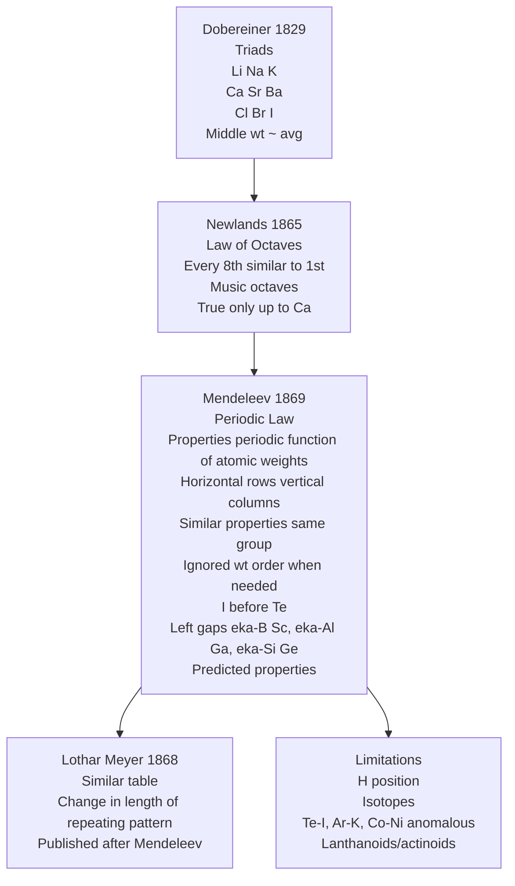
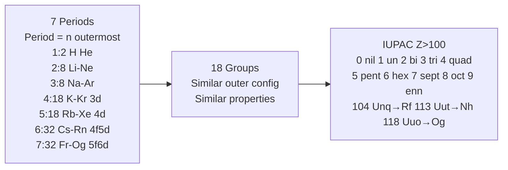
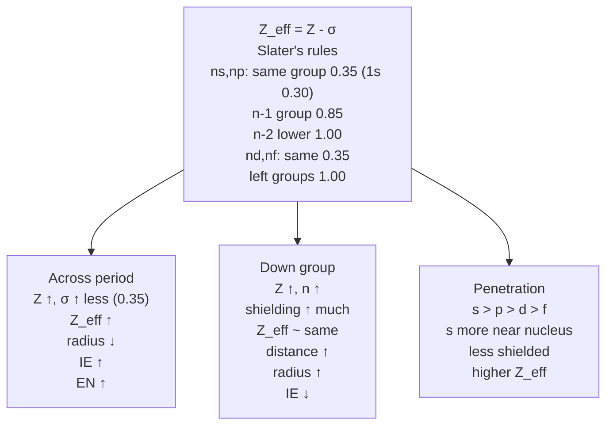
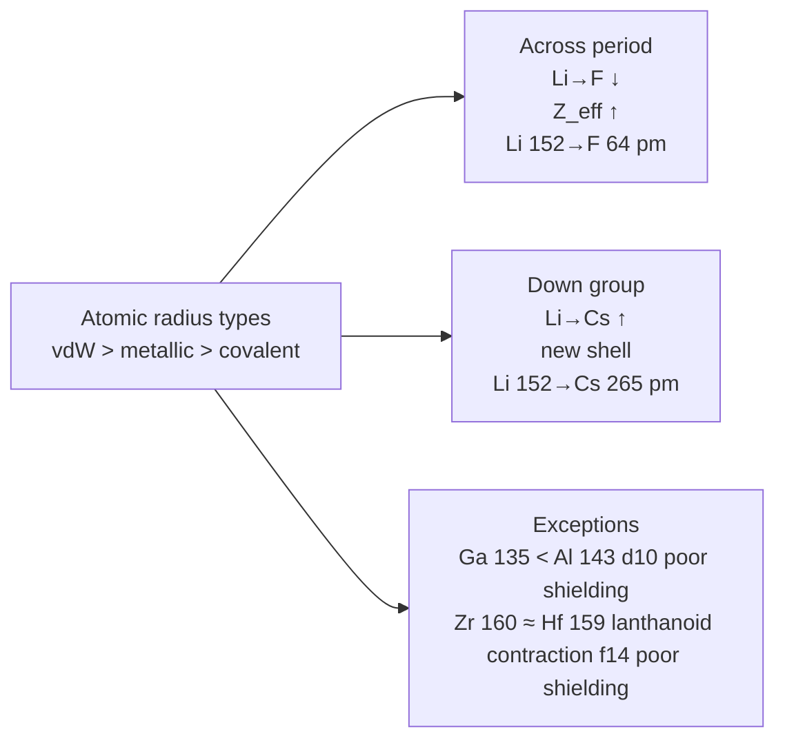
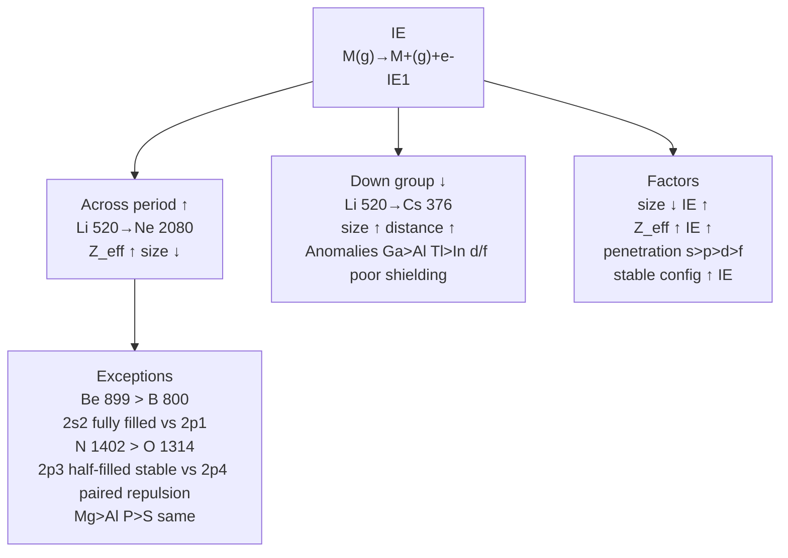
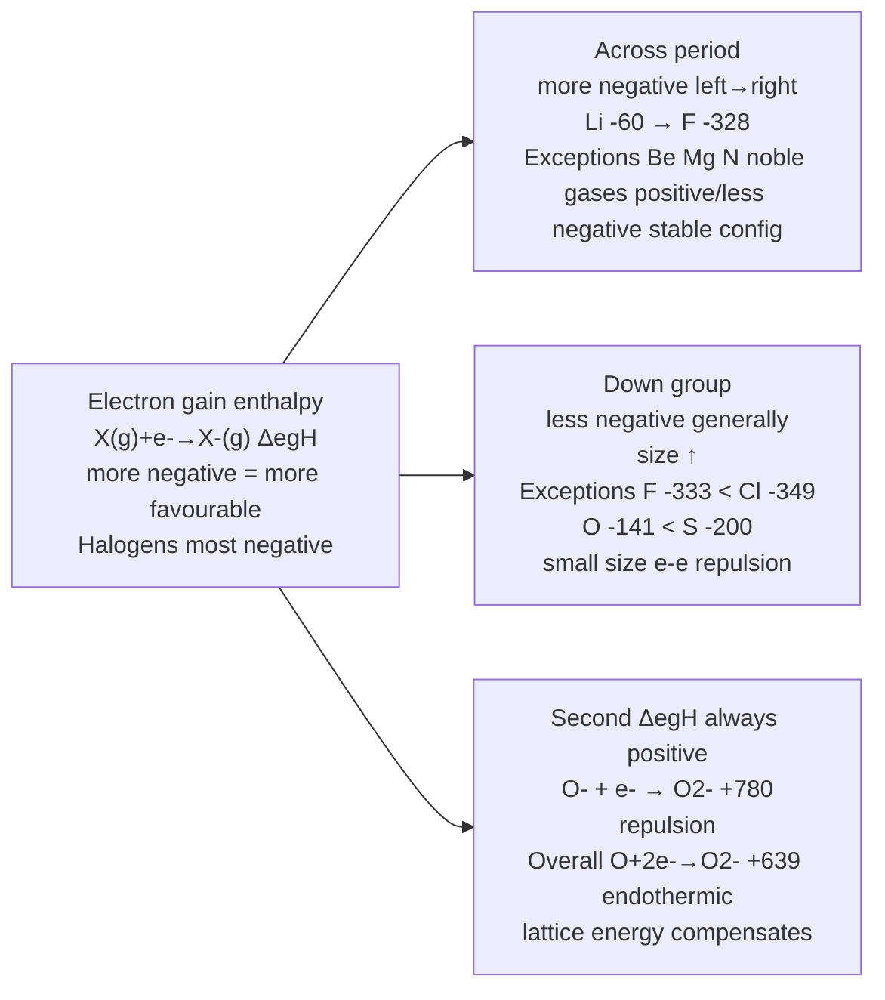
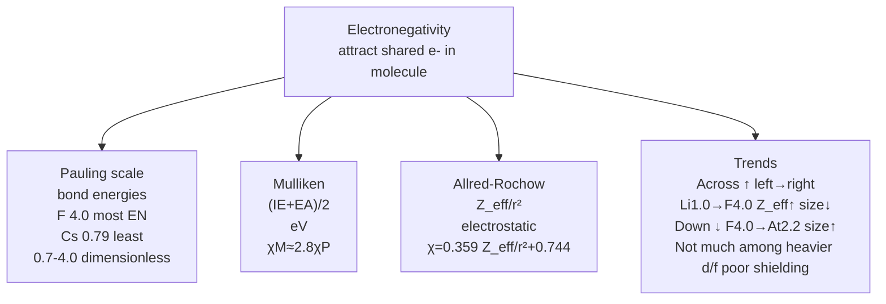
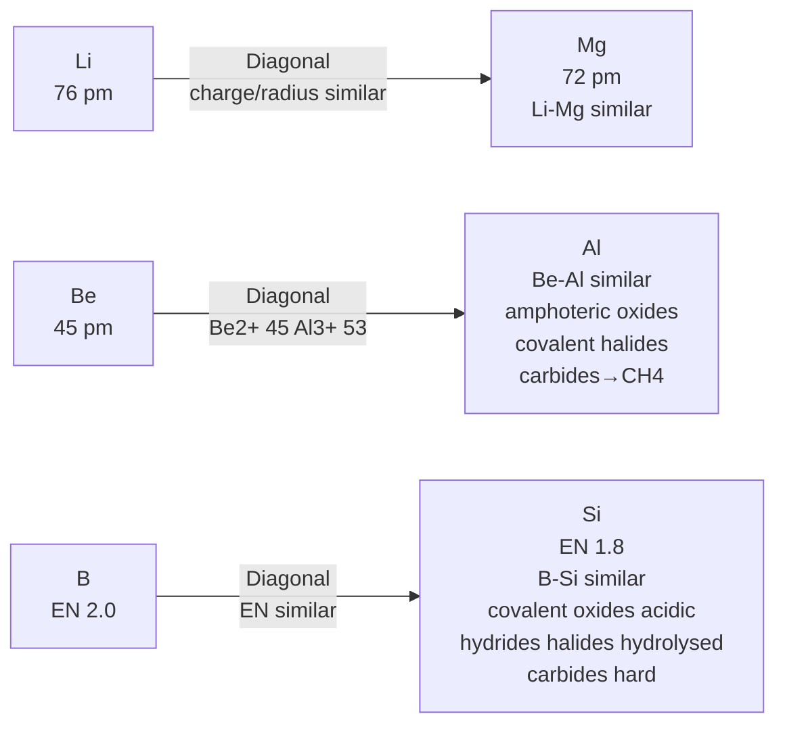
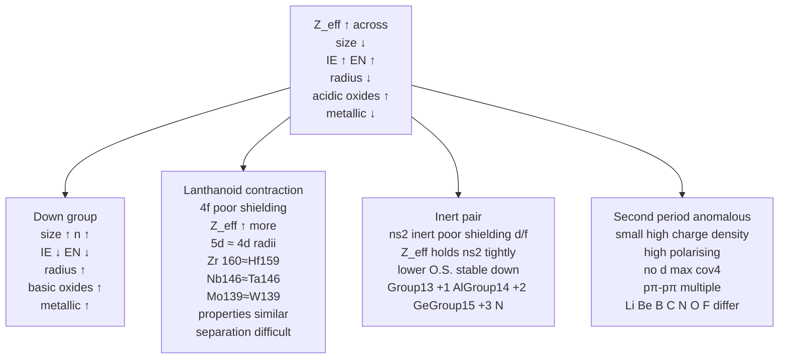

# Classification of Elements and Periodicity in Properties — JEE Main + Advanced Notes

> **Sources merged into these notes**
> | Source | File |
> |---|---|
> | NCERT Class XI Chemistry (rationalised 2023+), Unit 3 | [`kech103.pdf`](kech103.pdf) |
>
> 🅰 = Allen/Advanced-only content; 🆇 = extra JEE-Advanced bridging; ⚠ = trap.

## Contents

- [Part A — Genesis of Periodic Classification](#part-a--genesis-of-periodic-classification)
  1. [Dobereiner Triads, Newlands Octaves, Mendeleev Periodic Law (3.2)](#1-dobereiner-triads-newlands-octaves-mendeleev-periodic-law-32)
  2. [Modern Periodic Law — Moseley & Atomic Number (3.3)](#2-modern-periodic-law--moseley--atomic-number-33)
  3. [Present Form — Long Form Periodic Table, IUPAC Nomenclature Z>100 (3.4)](#3-present-form--long-form-periodic-table-iupac-nomenclature-z100-34)
- [Part B — Electronic Configuration & Blocks](#part-b--electronic-configuration--blocks)
  4. [Electronic Configuration & Types of Elements — s, p, d, f, Noble Gases (3.5)](#4-electronic-configuration--types-of-elements--s-p-d-f-noble-gases-35)
  5. [Effective Nuclear Charge & Slater's Rules — Advanced Tool](#5-effective-nuclear-charge--slaters-rules--advanced-tool)
- [Part C — Periodic Trends — Physical Properties](#part-c--periodic-trends--physical-properties)
  6. [Atomic Radius — Covalent, Metallic, van der Waals (3.6.1)](#6-atomic-radius--covalent-metallic-van-der-waals-361)
  7. [Ionic Radius (3.6.2)](#7-ionic-radius-362)
  8. [Ionization Enthalpy — IE₁, IE₂, Trends & Exceptions (3.6.3)](#8-ionization-enthalpy--ie1-ie2-trends--exceptions-363)
  9. [Electron Gain Enthalpy / Electron Affinity (3.6.4)](#9-electron-gain-enthalpy--electron-affinity-364)
  10. [Electronegativity — Pauling, Mulliken, Allred-Rochow (3.6.5)](#10-electronegativity--pauling-mulliken-allred-rochow-365)
- [Part D — Periodic Trends — Chemical Properties & Advanced Applications](#part-d--periodic-trends--chemical-properties--advanced-applications)
  11. [Valency, Oxidation States, Anomalous Second Period & Diagonal Relationship (3.7)](#11-valency-oxidation-states-anomalous-second-period--diagonal-relationship-37)
  12. [Metallic & Non-Metallic Character, Nature of Oxides, Reactivity (3.7)](#12-metallic--non-metallic-character-nature-of-oxides-reactivity-37)
  13. [Periodic Trends in Chemical Reactivity — Advanced Patterns](#13-periodic-trends-in-chemical-reactivity--advanced-patterns)
  14. [Quick Revision Sheet](#14-quick-revision-sheet)

---

# Part A — Genesis of Periodic Classification

## 1. Dobereiner Triads, Newlands Octaves, Mendeleev Periodic Law (3.2)

Answer-first: Classification evolved from grouping by similar properties → Periodic Law: properties periodic function of atomic weights (Mendeleev) later atomic numbers (Moseley).

**Dobereiner triads (early 1800s, Johann Dobereiner):** Groups of three elements with similar physical/chemical properties, middle element atomic weight about halfway between other two, properties in between.

| Triad | At. wt. | Triad | At. wt. | Triad | At. wt. |
|---|---|---|---|---|---|
| Li 7, Na 23, K 39 → Na ~ (Li+K)/2 | Ca 40, Sr 88, Ba 137 → Sr ~ (Ca+Ba)/2 | Cl 35.5, Br 80, I 127 → Br ~ (Cl+I)/2 |

**Newlands Law of Octaves (1865, John Alexander Newlands):** Arranged elements increasing atomic weights, every eighth element had properties similar to first, like eighth note resembles first in octaves of music. True only up to Ca. Awarded Davy Medal 1887 by Royal Society.

| Element | Li | Be | B | C | N | O | F |
|---|---|---|---|---|---|---|---|
| At. wt. | 7 | 9 | 11 | 12 | 14 | 16 | 19 |
| Element | Na | Mg | Al | Si | P | S | Cl |
| At. wt. | 23 | 24 | 27 | 29 | 31 | 32 | 35.5 |
| Element | K | Ca | | | | | |
| At. wt. | 39 | 40 | | | | | |

**Mendeleev Periodic Law (Russian Dmitri Mendeleev 1834-1907 & German Lothar Meyer 1830-1895):**

> Properties of elements are periodic function of their atomic weights.

Mendeleev arranged elements horizontal rows vertical columns increasing atomic weights such that similar properties same vertical group. More elaborate than Meyer, used broader physical/chemical properties, especially empirical formulas and properties of compounds. Ignored atomic weight order when needed: I (lower atomic weight than Te) placed in Group VII with F, Cl, Br due similarities. Left gaps for undiscovered elements: e.g., eka-boron (Sc), eka-aluminium (Ga), eka-silicon (Ge), predicted properties close to actual. Lothar Meyer by 1868 developed table closely resembles Modern Periodic Table, observed change in length of repeating pattern, but work published after Mendeleev.

**Mendeleev's achievements:** Predicted elements, corrected atomic weights (Be, In, etc), left gaps.

**Limitations:** Position of H, isotopes, anomalous pairs Te-I, Ar-K, Co-Ni, lanthanoids/actinoids not accommodated.

## 2. Modern Periodic Law — Moseley & Atomic Number (3.3)

When Mendeleev developed table, internal structure of atom unknown. Beginning 20th century profound developments sub-atomic particles. In 1913 English physicist Henry Moseley observed regularities characteristic X-ray spectra: plot $\ce{\sqrt{ν}}$ (frequency of X-rays) vs atomic number Z gave straight line, not vs atomic mass. Showed atomic number more fundamental property than atomic mass.

**Modern Periodic Law:**

> Physical and chemical properties of elements are periodic functions of their atomic numbers.

Periodic Law consequence of periodic variation in electronic configurations which determine physical/chemical properties. Analogies among 94 naturally occurring elements (Np, Pu like Ac, Pa also found in pitch blende uranium ore). Stimulated renewed interest, creation of artificially produced short-lived elements. Atomic number = nuclear charge = number protons = number electrons in neutral atom. Significance of quantum numbers and electronic configurations in periodicity.

## 3. Present Form — Long Form Periodic Table, IUPAC Nomenclature Z>100 (3.4)

Numerous forms devised, some emphasise chemical reactions valence, others electronic configuration. Long form (present) is most used.

**Long form features:**

- 7 periods (horizontal rows): Period number = principal quantum number n of outermost shell, number of elements in period = 2n²? Actually 2,8,8,18,18,32,32 due filling. Period 1: 2 elements H, He; Period 2: 8 (Li-Ne); Period 3: 8 (Na-Ar); Period 4: 18 (K-Kr) includes 3d; Period 5: 18 (Rb-Xe) includes 4d; Period 6: 32 (Cs-Rn) includes 4f +5d; Period 7: 32 (Fr-Og) includes 5f+6d, incomplete.
- 18 groups (vertical columns): Group number = number of valence electrons? For s-block group number = ns electrons, p-block group number = ns+np = 10+? Actually groups 13-18 have 3-8 valence.
- Elements with similar outer electronic config similar properties same group.

**IUPAC nomenclature for Z>100 (superheavy):**

Systematic names from roots: 0 nil, 1 un, 2 bi, 3 tri, 4 quad, 5 pent, 6 hex, 7 sept, 8 oct, 9 enn.

| Z | Name | Symbol |
|---|---|---|
| 101 | Unnilunium | Unu |
| 102 | Unnilbium | Unb |
| 103 | Unniltrium | Unt |
| 104 | Unnilquadium | Unq |
| 105 | Unnilpentium | Unp |
| 106 | Unnilhexium | Unh |
| 107 | Unnilseptium | Uns |
| 108 | Unniloctium | Uno |
| 109 | Unnilennium | Une |
| 110 | Ununnilium | Uun |
| 111 | Unununium | Uuu |
| 112 | Ununbium | Uub |
| 113 | Ununtrium | Uut (now Nh nihonium) |
| 114 | Ununquadium | Uuq (now Fl flerovium) |
| 115 | Ununpentium | Uup (now Mc moscovium) |
| 116 | Ununhexium | Uuh (now Lv livermorium) |
| 117 | Ununseptium | Uus (now Ts tennessine) |
| 118 | Ununoctium | Uuo (now Og oganesson) |

Official names now: 104 Rf rutherfordium, 105 Db dubnium, 106 Sg seaborgium, 107 Bh bohrium, 108 Hs hassium, 109 Mt meitnerium, 110 Ds darmstadtium, 111 Rg roentgenium, 112 Cn copernicium, 113 Nh nihonium, 114 Fl flerovium, 115 Mc moscovium, 116 Lv livermorium, 117 Ts tennessine, 118 Og oganesson.

---

# Part B — Electronic Configuration & Blocks

## 4. Electronic Configuration & Types of Elements — s, p, d, f, Noble Gases (3.5)

Electronic configuration basis for periodic classification.

**s-block:** Groups 1,2, outer $\ce{ns^{1-2}}$, highly electropositive, metallic, low IE, strong reducing, form ionic compounds, alkali and alkaline earth.

**p-block:** Groups 13-18, outer $\ce{ns^2 np^{1-6}}$, non-metals, metalloids, metals, high IE, form covalent, max oxidation state = total valence.

**d-block:** Groups 3-12, outer $\ce{(n-1)d^{1-10} ns^{0-2}}$, transition elements, variable oxidation states, coloured complexes, catalytic.

**f-block:** Lanthanoids $\ce{4f^{1-14}5d^{0-1}6s^2}$ Ce-Lu, actinoids $\ce{5f^{1-14}6d^{0-1}7s^2}$ Th-Lr, placed bottom, inner transition, variable O.S., radioactive actinoids.

**Noble gases:** Group 18, $\ce{ns^2 np^6}$ (He $\ce{1s^2}$) completely filled, very high IE, inert, monoatomic.

**Types based on properties:**

- Metals: s-block, d-block, f-block, heavier p-block, low IE, low EN, form cations, basic oxides, good conductors, malleable ductile.
- Non-metals: p-block (except heavier), high IE, high EN, form anions, acidic oxides.
- Metalloids: B, Si, Ge, As, Sb, Te, borderline, semiconductors.

## 5. Effective Nuclear Charge & Slater's Rules — Advanced Tool

Answer-first: Periodic trends explained by effective nuclear charge $\ce{Z_eff = Z - σ}$ where σ shielding constant, Slater's rules estimate σ.

**Shielding/screening:** Inner electrons shield outer from full nuclear charge, outer feels less $\ce{Z_eff}$.

**Penetration:** s > p > d > f penetration to nucleus, s more penetrating, better shielding? Actually penetration order s > p > d > f means s electron spends more time near nucleus, less shielded, higher $\ce{Z_eff}$.

**Slater's rules (1930, John C. Slater):** To calculate σ for electron in ns,np:

- Write config in groups: (1s) (2s,2p) (3s,3p) (3d) (4s,4p) (4d) (4f) (5s,5p) etc.
- For electron in ns,np:
  - Other electrons in same group (ns,np) contribute 0.35 each (0.30 for 1s).
  - Electrons in n-1 group contribute 0.85 each.
  - Electrons in n-2 and lower groups contribute 1.00 each.
- For electron in nd or nf:
  - Same group 0.35 each.
  - All groups to left (lower n) contribute 1.00 each.

**Example:** $\ce{Z_eff}$ for 3s electron in Na (Z=11, config 1s² 2s²2p⁶ 3s¹):

- Groups: (1s²) (2s²2p⁶) (3s¹)
- σ = 2*1.00 (1s) + 8*0.85 (2s2p) + 0*0.35 = 2 + 6.8 = 8.8
- $\ce{Z_eff = 11 - 8.8 = 2.2}$

For 2p electron in O (Z=8, config 1s² 2s²2p⁴):

- Groups: (1s²) (2s²2p⁴)
- For one 2p electron: other electrons in same group: 5 other (2s²2p³) *0.35 = 1.75, plus 1s² *0.85? Actually n-1 group (1s) contributes 0.85? Wait rule for ns,np: n-1 contributes 0.85, n-2 lower 1.00. For 2s,2p electron, n=2, n-1=1, so 1s electrons contribute 0.85 each: 2*0.85=1.7
- σ = 1.75 + 1.7 = 3.45, $\ce{Z_eff = 8 - 3.45 = 4.55}$

**Trends via $\ce{Z_eff}$:**

- Across period: Z increases, σ increases less (same shell 0.35), so $\ce{Z_eff}$ increases → atomic radius decreases, IE increases, EN increases.
- Down group: Z increases, n increases, shielding increases much (new shell), $\ce{Z_eff}$ roughly same or slight increase, but distance increases → radius increases, IE decreases.

> **⚠ Trap:** $\ce{Z_eff}$ for same period increases left→right, but not strictly due d/f poor shielding leads to anomalies Ga, etc.

---

# Part C — Periodic Trends — Physical Properties

## 6. Atomic Radius — Covalent, Metallic, van der Waals (3.6.1)

**Definitions:**

- **Covalent radius:** Half distance between two atoms bonded by single covalent bond in homoatomic molecule, e.g., $\ce{Cl2}$ bond length 198 pm → covalent radius 99 pm. For heteronuclear, subtract.
- **Metallic radius:** Half distance between two adjacent metal atoms in metallic lattice, e.g., Na metallic radius 186 pm.
- **van der Waals radius:** Half distance between two non-bonded atoms of two adjacent molecules in solid state, e.g., Cl₂ van der Waals radius 180 pm > covalent 99 pm because no overlap, just contact.
- Order: van der Waals > metallic > covalent for same element.

**Trends:**

- **Across period:** Atomic radius decreases left→right due $\ce{Z_eff}$ increases, nuclear charge pulls electrons closer, e.g., Li 152 pm → F 64 pm.
- **Down group:** Atomic radius increases down due new shell added, distance ↑ despite $\ce{Z_eff}$ slight increase, e.g., Li 152 → Cs 265 pm.
- **Exceptions:** Due poor shielding d/f, Ga (135 pm) < Al (143 pm), etc. Lanthanoid contraction: 4f poor shielding → atomic radii of 5d series similar to 4d, e.g., Zr 160 pm, Hf 159 pm almost same.

## 7. Ionic Radius (3.6.2)

Ionic radius: Distance between nucleus and outermost shell of ion.

- **Cation smaller than parent atom:** Loss of shell, increased $\ce{Z_eff}$, e.g., Na 186 pm → Na⁺ 102 pm.
- **Anion larger than parent atom:** Gain of electron, decreased $\ce{Z_eff}$, increased repulsion, e.g., Cl 99 pm → Cl⁻ 181 pm.
- **Isoelectronic species:** Same number electrons, e.g., $\ce{N^{3-}, O^{2-}, F-, Na+, Mg^{2+}, Al^{3+}}$ all 10 e⁻ (Ne config), radius decreases with increasing Z (nuclear charge) due $\ce{Z_eff}$ ↑: $\ce{N^{3-} 171 > O^{2-} 140 > F- 136 > Na+ 102 > Mg2+ 72 > Al3+ 53}$ pm.
- **Trends:** Across period ionic radius decreases for isoelectronic? Actually for same charge, decreases left→right due $\ce{Z_eff}$ ↑. Down group increases due new shell.

## 8. Ionization Enthalpy — IE₁, IE₂, Trends & Exceptions (3.6.3)

**Definition:** Enthalpy required to remove outermost electron from isolated gaseous atom: $\ce{M(g) -> M+(g) + e-}$ IE₁, $\ce{M+(g) -> M2+(g) + e-}$ IE₂, etc. Units kJ/mol.

- **IE₂ > IE₁ >?** Successive IE increases because removal from positive ion harder, $\ce{IE1 < IE2 < IE3}$.
- **Across period:** IE increases left→right due $\ce{Z_eff}$ ↑, size ↓, e.g., Li 520 → Ne 2080 kJ/mol.
- **Exceptions across period:**
  - $\ce{Be (899) > B (800)}$: Be $\ce{2s²}$ fully filled stable, B $\ce{2s²2p¹}$ p electron easier to remove.
  - $\ce{N (1402) > O (1314)}$: N $\ce{2p³}$ half-filled extra stable, O $\ce{2p⁴}$ one paired electron repulsion easier to remove.
  - Similarly $\ce{Mg > Al}$, $\ce{P > S}$.
- **Down group:** IE decreases down due size ↑ distance ↑ despite $\ce{Z_eff}$ slight increase, e.g., Li 520 → Cs 376.
- **Anomalies down group due d/f poor shielding:** IE of Ga > Al, Tl > In? Actually B > Tl > Ga > Al > In for Group 13 due poor shielding d/f.

**Factors affecting IE:**

- Atomic size: IE ∝ 1/size
- $\ce{Z_eff}$: IE ∝ $\ce{Z_eff}$
- Penetration: s > p > d > f → s electron harder to remove higher IE.
- Electronic config: Fully filled/half-filled stable higher IE.

> **⚠ Trap:** IE₂ of alkali metals very high because $\ce{M+}$ has noble gas config, e.g., Na IE₁ 496, IE₂ 4562 kJ/mol. Similarly Mg IE₂ 1450 but IE₃ 7732 due $\ce{Mg2+}$ Ne config.

## 9. Electron Gain Enthalpy / Electron Affinity (3.6.4)

**Definition:** Enthalpy change when electron added to isolated gaseous atom: $\ce{X(g) + e- -> X-(g)}$ ΔegH. Negative value means exothermic (favourable), more negative more favourable. Electron affinity is magnitude? IUPAC: Electron gain enthalpy negative of electron affinity? But often used interchangeably.

- **Across period:** Becomes more negative left→right due $\ce{Z_eff}$ ↑ size ↓, e.g., Li -60, F -328 kJ/mol.
- **Exceptions:** Be, Mg, N, noble gases have positive or less negative ΔegH due stable config (fully filled/half-filled).
- **Down group:** Generally becomes less negative down due size ↑, but anomalies:
  - $\ce{F (-333) < Cl (-349)}$: Cl more negative than F due small size F electron-electron repulsion in 2p, added electron experiences repulsion.
  - Similarly $\ce{O (-141) < S (-200)}$.
- **Second electron gain enthalpy always positive:** $\ce{X-(g) + e- -> X2-(g)}$ ΔegH₂ positive due repulsion, e.g., O first -141, second +780 → overall $\ce{O + 2e- -> O2-}$ ΔH = +639 kJ/mol endothermic, but lattice energy compensates in ionic compounds.
- **Halogens have most negative ΔegH** due ns²np⁵ one short of noble gas, gain one electron favourable.

| Element | ΔegH₁ kJ/mol |
|---|---|
| F | -333 |
| Cl | -349 (most negative) |
| Br | -325 |
| I | -296 |
| O | -141 |
| S | -200 |

## 10. Electronegativity — Pauling, Mulliken, Allred-Rochow (3.6.5)

**Definition:** Tendency of atom in molecule to attract shared electrons.

**Scales:**

- **Pauling scale (1932, Linus Pauling):** Based on bond energies, dimensionless, F 4.0 most electronegative, Cs 0.79 least, range 0.7-4.0. Formula: $\ce{χA - χB = 0.208√(Δ)}$ where Δ = $\ce{EAB - √(EA-A * EB-B)}$ extra ionic resonance energy.
- **Mulliken scale (Robert Mulliken):** Average of IE and electron affinity: $\ce{χM = (IE + EA)/2}$, in eV, $\ce{χM ≈ 2.8 χP}$ roughly.
- **Allred-Rochow scale:** Based on $\ce{Z_eff / r²}$ electrostatic force: $\ce{χAR = 0.359 Z_eff / r² + 0.744}$ where r covalent radius Å.

**Trends:**

- Across period increases left→right due $\ce{Z_eff}$ ↑ size ↓, e.g., Li 1.0 → F 4.0.
- Down group decreases due size ↑, e.g., F 4.0 → At 2.2, but not much among heavier due d/f poor shielding.

**Factors:** $\ce{Z_eff}$, size, IE, EA.

**Applications:** Predict bond polarity, % ionic character, acid-base strength, etc. $\ce{% ionic = (1 - e^{-0.25(Δχ)²})×100}$.

---

# Part D — Periodic Trends — Chemical Properties & Advanced Applications

## 11. Valency, Oxidation States, Anomalous Second Period & Diagonal Relationship (3.7)

**Valency:** Combining capacity, number of H atoms that combine with element, e.g., $\ce{CH4}$ C valency 4, $\ce{NH3}$ N 3, $\ce{H2O}$ O 2. Related to number of valence electrons.

**Oxidation states:** Group oxidation state = total valence electrons, max O.S. increases towards right of periodic table. Other O.S. differ by 2 due inert pair effect. Variation: B, C, N families group O.S. most stable for lighter, O.S. two less becomes more stable for heavier.

**Anomalous second period:**

- Small size, high IE/EN, absence d-orbitals max covalence 4, high polarising power, ability to form pπ-pπ multiple bonds.
- Li, Be, B, C, N, O, F differ from heavier congeners.
- Example: $\ce{Li2CO3}$ decomposes $\ce{->Li2O+CO2}$ other alkali carbonates stable, $\ce{BeCl2}$ covalent vs $\ce{MgCl2}$ ionic.

**Diagonal relationship:** First element of group resembles second element of next group due similar charge/radius ratio.

- **Li-Mg:** Similar ionic radii $\ce{Li+ 76 pm Mg2+ 72 pm}$, charge/radius similar polarising power, both hard high MP, form nitrides $\ce{Li3N Mg3N2}$, normal oxides only $\ce{Li2O MgO}$ no peroxide/superoxide, hydroxides weak less soluble decompose $\ce{LiOH Mg(OH)2->oxides}$, carbonates decompose $\ce{Li2CO3 MgCO3->oxides+CO2}$, bicarbonates only in solution, nitrates decompose to oxides $\ce{4LiNO3->2Li2O+4NO2+O2}$ $\ce{2Mg(NO3)2->2MgO+4NO2+O2}$ vs other alkali $\ce{2MNO3->2MNO2+O2}$, chlorides deliquescent soluble organic solvents partial covalent.
- **Be-Al:** Charge/radius $\ce{Be2+ 45 Al3+ 53}$ similar, both hard high MP, amphoteric oxides $\ce{BeO Al2O3}$, hydroxides amphoteric $\ce{Be(OH)2 Al(OH)3}$, halides covalent soluble organic Lewis acid bridged dimer $\ce{BeCl2}$ chain $\ce{Al2Cl6}$, carbides $\ce{Be2C Al4C3}$ both $\ce{->CH4}$ with water, nitrides $\ce{Be3N2 AlN}$, CN 4, both react alkali $\ce{Be+2NaOH->Na2BeO2+H2}$.
- **B-Si:** EN B 2.0 Si 1.8 similar, both covalent, oxides acidic $\ce{B2O3 SiO2}$, hydrides $\ce{B2H6 SiH4}$, halides hydrolysed, carbides hard $\ce{B4C SiC}$.

## 12. Metallic & Non-Metallic Character, Nature of Oxides, Reactivity (3.7)

**Metallic character:** Tendency to lose electrons form cations, low IE low EN. Across period decreases left→right IE ↑ EN ↑, down group increases IE ↓ size ↑. Heaviest element in each p-block group most metallic.

**Non-metallic character:** Opposite, high IE high EN, forms anions, acidic oxides.

**Nature of oxides:**

- Non-metal oxides acidic or neutral, e.g., $\ce{CO2}$ acidic $\ce{CO2+H2O->H2CO3}$, $\ce{CO}$ neutral, $\ce{N2O5}$ acidic, $\ce{NO}$ neutral.
- Metal oxides basic, e.g., $\ce{Na2O + H2O -> 2NaOH}$ basic, $\ce{MgO}$ basic.
- Amphoteric oxides both acidic and basic, e.g., $\ce{Al2O3 + 6HCl -> 2AlCl3 + 3H2O}$ basic, $\ce{Al2O3 + 2NaOH -> 2NaAlO2 + H2O}$ acidic; $\ce{BeO, Ga2O3, SnO, PbO}$ amphoteric.

Acidic character of oxides increases across period left→right and decreases down group.

**Reactivity:**

- Metals reactivity increases down group (IE ↓) and decreases across period left→right (IE ↑).
- Non-metals reactivity decreases down group? For halogens oxidising power $\ce{F2>Cl2>Br2>I2}$ decreases down, reducing power halides reverse.
- Noble gases inert.

## 13. Periodic Trends in Chemical Reactivity — Advanced Patterns

**Effective nuclear charge explains:**

- **Atomic radius:** $\ce{Z_eff}$ ↑ → radius ↓ across period, $\ce{Z_eff}$ ~ same but n ↑ → radius ↑ down group.
- **IE:** $\ce{Z_eff}$ ↑ size ↓ → IE ↑ across, size ↑ → IE ↓ down.
- **Electron gain:** $\ce{Z_eff}$ ↑ → more negative across, size ↑ → less negative down, exceptions F<Cl O<S due e-e repulsion small size.
- **EN:** $\ce{Z_eff}$ ↑ size ↓ → EN ↑ across, size ↑ → EN ↓ down.

**Advanced patterns for JEE Advanced:**

- **Lanthanoid contraction:** 4f poor shielding → $\ce{Z_eff}$ ↑ more than expected → radii of 5d series similar to 4d, e.g., Zr 160 pm Hf 159 pm, Nb 146 Ta 146, Mo 139 W 139, chemical properties similar Zr/Hf, Nb/Ta difficult to separate.
- **Inert pair effect:** ns² inert due poor shielding d/f, increased effective nuclear charge holds ns² tightly, stability lower O.S. increases down group: Group 13 +1 stability $\ce{Al<Ga<In<Tl}$ Tl+1 predominant, Group 14 +2 stability $\ce{Ge<Sn<Pb}$ Pb+2 predominant, Group 15 +3 stability $\ce{N<P<As<Sb<Bi}$ Bi+3 predominant.
- **Second period anomalies:** Small size high charge density high polarising power, absence d-orbitals max covalence 4, pπ-pπ multiple bonding.
- **Diagonal relationship:** Due similar charge/radius.
- **Metallic character vs IE/EN:** Lower IE lower EN more metallic more basic oxides more reducing.

> **Example (JEE Advanced):** Why $\ce{Zr}$ and $\ce{Hf}$ have almost same atomic radii? Due lanthanoid contraction 4f poor shielding $\ce{Z_eff}$ ↑.

> **Example:** Why $\ce{Tl+}$ more stable than $\ce{Tl3+}$? Inert pair effect ns² inert poor shielding f/d.

> **Example:** Why $\ce{BF3}$ Lewis acid but $\ce{AlF3}$? B electron-deficient 6 e⁻ around B, Al also but larger size tendency ↓.

---

## 14. Quick Revision Sheet

- Genesis: Dobereiner triads Li Na K (Na ~ avg Li+K), Ca Sr Ba, Cl Br I middle wt ~ avg other two properties in between; Newlands Law of Octaves 1865 every 8th similar to 1st music octaves true only up to Ca Davy Medal 1887; Mendeleev Periodic Law properties periodic function of atomic weights, horizontal rows vertical columns increasing atomic weights similar properties same group, ignored wt order I before Te Group VII with F Cl Br, left gaps eka-B Sc eka-Al Ga eka-Si Ge predicted properties close, Lothar Meyer 1868 similar table change in length repeating pattern published after Mendeleev; limitations H position isotopes Te-I Ar-K Co-Ni anomalous lanthanoids/actinoids.
- Modern Law: Moseley 1913 $\ce{\sqrt{ν}}$ X-ray frequency vs Z straight line not vs atomic mass atomic number more fundamental than mass, modern law physical/chemical properties periodic functions of atomic numbers, consequence periodic variation electronic configurations.
- Present form: 7 periods period number = n outermost, elements in period 2,8,8,18,18,32,32 due filling, 1:2 H He 2:8 Li-Ne 3:8 Na-Ar 4:18 K-Kr 3d 5:18 Rb-Xe 4d 6:32 Cs-Rn 4f5d 7:32 Fr-Og 5f6d incomplete; 18 groups similar outer config similar properties; IUPAC Z>100 roots 0 nil 1 un 2 bi 3 tri 4 quad 5 pent 6 hex 7 sept 8 oct 9 enn systematic 101 Unu 102 Unb 103 Unt 104 Unq→Rf rutherfordium 105 Unp→Db dubnium 106 Unh→Sg seaborgium 107 Uns→Bh bohrium 108 Uno→Hs hassium 109 Une→Mt meitnerium 110 Uun→Ds darmstadtium 111 Uuu→Rg roentgenium 112 Uub→Cn copernicium 113 Uut→Nh nihonium 114 Uuq→Fl flerovium 115 Uup→Mc moscovium 116 Uuh→Lv livermorium 117 Uus→Ts tennessine 118 Uuo→Og oganesson.
- Blocks: s Groups1-2 ns¹⁻² highly electropositive metallic low IE strong reducing ionic alkali alkaline earth; p Groups13-18 ns²np¹⁻⁶ non-metals metalloids metals high IE covalent max O.S. = total valence; d Groups3-12 (n-1)d¹⁻¹⁰ ns⁰⁻² transition variable O.S. coloured complexes catalytic; f lanthanoids 4f¹⁻¹⁴ 5d⁰⁻¹6s² Ce-Lu actinoids 5f¹⁻¹⁴ 6d⁰⁻¹7s² Th-Lr bottom inner transition variable radioactive actinoids; noble gases Group18 ns²np⁶ He1s² completely filled very high IE inert monoatomic; types metals s d f heavier p low IE low EN cations basic oxides conductors malleable ductile, non-metals p high IE high EN anions acidic oxides, metalloids B Si Ge As Sb Te borderline semiconductors.
- Effective nuclear charge $\ce{Z_eff=Z-σ}$ shielding inner shields outer, penetration s>p>d>f s more near nucleus less shielded higher $\ce{Z_eff}$; Slater's rules: write groups (1s)(2s2p)(3s3p)(3d)(4s4p)(4d)(4f)(5s5p)... for ns,np same group 0.35 (1s 0.30) n-1 group 0.85 n-2 lower 1.00, for nd nf same 0.35 left groups 1.00; example Na 3s Z=11 groups (1s²)(2s²2p⁶)(3s¹) σ=2*1.00+8*0.85=8.8 $\ce{Z_eff=2.2}$, O 2p Z=8 (1s²)(2s²2p⁴) for one 2p other same 5*0.35=1.75 +1s 2*0.85=1.7 σ=3.45 $\ce{Z_eff=4.55}$; trends across Z↑ σ↑ less (0.35) $\ce{Z_eff}$↑ radius↓ IE↑ EN↑, down Z↑ n↑ shielding ↑ much $\ce{Z_eff}$~same distance↑ radius↑ IE↓.
- Atomic radius: covalent half distance single covalent bond homoatomic e.g., Cl₂ 198→99 pm heteronuclear subtract, metallic half distance adjacent metal atoms in lattice e.g., Na 186 pm, van der Waals half distance non-bonded adjacent molecules solid e.g., Cl₂ vdW 180 > covalent 99 no overlap contact, order vdW>metallic>covalent same element; across period radius ↓ left→right $\ce{Z_eff}$↑ nuclear pulls closer Li152→F64 pm, down group ↑ new shell distance↑ Li152→Cs265 pm, exceptions Ga135<Al143 d10 poor shielding, Zr160≈Hf159 lanthanoid contraction 4f poor shielding 5d≈4d.
- Ionic radius: cation smaller than parent loss shell increased $\ce{Z_eff}$ Na186→Na⁺102 pm, anion larger than parent gain e⁻ decreased $\ce{Z_eff}$ increased repulsion Cl99→Cl⁻181 pm, isoelectronic same e⁻ e.g., N³⁻ O²⁻ F⁻ Na⁺ Mg²⁺ Al³⁺ all 10e⁻ Ne config radius ↓ with Z↑ $\ce{Z_eff}$↑ N³⁻171>O²⁻140>F⁻136>Na⁺102>Mg²⁺72>Al³⁺53 pm, across same charge ↓ left→right $\ce{Z_eff}$↑, down ↑ new shell.
- Ionization enthalpy: $\ce{M(g)->M+(g)+e-}$ IE₁ $\ce{M+->M2++e-}$ IE₂ successive IE₁<IE₂<IE₃ increases removal from positive harder, across ↑ left→right $\ce{Z_eff}$↑ size↓ Li520→Ne2080 kJ/mol, exceptions Be899>B800 Be2s² fully filled stable B2s²2p¹ p easier, N1402>O1314 N2p³ half-filled extra stable O2p⁴ paired repulsion easier similarly Mg>Al P>S, down ↓ Li520→Cs376 size↑ distance↑ anomalies down d/f poor shielding IE Ga>Al Tl>In Group13 B>Tl>Ga>Al>In; factors size ↓ IE↑ $\ce{Z_eff}$↑ IE↑ penetration s>p>d>f s harder higher IE stable config fully/half-filled higher IE; trap IE₂ alkali very high M⁺ noble gas Na IE₁496 IE₂4562, Mg IE₂1450 IE₃7732 Mg²⁺ Ne config.
- Electron gain enthalpy: $\ce{X(g)+e-→X-(g)}$ ΔegH negative exothermic favourable more negative more favourable halogens most negative ns²np⁵ one short noble gas; across more negative left→right $\ce{Z_eff}$↑ size↓ Li-60→F-328, exceptions Be Mg N noble gases positive/less negative stable config fully/half-filled; down less negative generally size↑ anomalies F-333<Cl-349 Cl more negative than F small size F e-e repulsion 2p added e⁻ repulsion similarly O-141<S-200; second ΔegH always positive $\ce{X-+e-→X2-}$ repulsion e.g., O first -141 second +780 overall O+2e-→O2- +639 endothermic lattice compensates ionic; halogens most negative.
- Electronegativity: tendency atom in molecule attract shared e⁻; Pauling scale 1932 Linus Pauling bond energies dimensionless F4.0 most EN Cs0.79 least 0.7-4.0 formula χA-χB=0.208√Δ Δ=EAB-√(EA-A*EB-B) extra ionic resonance; Mulliken average IE+EA χM=(IE+EA)/2 eV χM≈2.8χP; Allred-Rochow electrostatic $\ce{Z_eff/r²}$ χAR=0.359$\ce{Z_eff}$/r²+0.744 r covalent Å; trends across ↑ Li1.0→F4.0 $\ce{Z_eff}$↑ size↓, down ↓ F4.0→At2.2 size↑ not much among heavier d/f poor shielding; factors $\ce{Z_eff}$ size IE EA; applications bond polarity % ionic (1-e^{-0.25(Δχ)²})×100 acid-base.
- Valency combining capacity number H combine e.g., CH4 C4 NH3 N3 H2O O2 related valence e⁻; oxidation states group O.S.=total valence e⁻ max O.S. ↑ towards right, other O.S. differ by 2 inert pair, variation B C N families group O.S. most stable lighter O.S. two less more stable heavier; anomalous second period small size high IE/EN absence d max covalence 4 high polarising pπ-pπ multiple bonds Li Be B C N O F differ e.g., Li2CO3 decomposes →Li2O+CO2 other alkali stable BeCl2 covalent vs MgCl2 ionic; diagonal Li-Mg ionic radii Li+76 Mg2+72 charge/radius similar polarising hard high MP nitrides Li3N Mg3N2 normal oxides only Li2O MgO no peroxide/superoxide hydroxides weak less soluble decompose LiOH Mg(OH)2→oxides carbonates decompose Li2CO3 MgCO3→oxides+CO2 bicarbonates only solution nitrates 4LiNO3→2Li2O+4NO2+O2 2Mg(NO3)2→2MgO+4NO2+O2 vs other alkali 2MNO3→2MNO2+O2 chlorides deliquescent soluble organic partial covalent; Be-Al charge/radius Be2+45 Al3+53 similar hard high MP amphoteric oxides BeO Al2O3 hydroxides amphoteric Be(OH)2 Al(OH)3 halides covalent soluble organic Lewis acid bridged dimer BeCl2 chain Al2Cl6 carbides Be2C Al4C3 both →CH4 water nitrides Be3N2 AlN CN4 both react alkali Be+2NaOH→Na2BeO2+H2; B-Si EN B2.0 Si1.8 similar covalent oxides acidic B2O3 SiO2 hydrides B2H6 SiH4 halides hydrolysed carbides hard B4C SiC.
- Metallic character tendency lose e⁻ form cations low IE low EN across ↓ left→right IE↑ EN↑ down ↑ IE↓ size↑ heaviest p-block most metallic; non-metallic opposite high IE high EN anions acidic oxides; oxides nature non-metal acidic/neutral CO2 acidic CO2+H2O→H2CO3 CO neutral N2O5 acidic NO neutral, metal basic Na2O+H2O→2NaOH basic MgO basic, amphoteric both acidic basic Al2O3+6HCl→2AlCl3+3H2O basic Al2O3+2NaOH→2NaAlO2+H2O acidic BeO Ga2O3 SnO PbO amphoteric acidic character oxides ↑ across left→right ↓ down group; reactivity metals ↑ down IE↓ ↓ across left→right IE↑, non-metals halogens oxidising F2>Cl2>Br2>I2 ↓ down reducing halides reverse I->Br->Cl->F- noble gases inert.
- Advanced: lanthanoid contraction 4f poor shielding Z_eff↑ more than expected radii 5d similar to 4d Zr160 Hf159 Nb146 Ta146 Mo139 W139 chemical similar difficult separate; inert pair ns2 inert poor shielding d/f Z_eff holds ns2 tightly lower O.S. stable down Group13 +1 Al<Ga<In<Tl Tl+1 predominant Group14 +2 Ge<Sn<Pb Pb+2 predominant Group15 +3 N<P<As<Sb<Bi Bi+3 predominant; second period anomalous small high charge density high polarising no d max cov4 pπ-pπ multiple; diagonal similar charge/radius; metallic vs IE/EN lower IE lower EN more metallic more basic oxides more reducing.

---

*Cross-links:* [Chemical Bonding](../02-Chemical-Bonding-and-Molecular-Structure/notes.md) — Fajans, polarising power, lattice vs hydration, pπ-pπ; [Hydrogen](../03-Hydrogen/notes.md) — position of H, isotopes, hydrides; [s-Block](../04-The-s-Block-Elements/notes.md) — diagonal Li-Mg Be-Al, IE hydration; [p-Block Groups 13-14](../05-The-p-Block-Elements/notes.md) — general p-block trends, inert pair, anomalous B/C; [p-Block Groups 15-18](../09-The-p-Block-Elements/notes.md) — apatite, nitrates, halides; [d-and f-Block](../07-The-d-and-f-Block-Elements/notes.md) — lanthanoid contraction, transition vs p-block.
*Sources:* NCERT rationalised Unit 3 (kech103) + Advanced Slater, Fajans, lanthanoid contraction.
