# Chemical Bonding — structure source

This table is the **single source** for every structure drawing in [`../notes.md`](../notes.md).
Edit a row, then regenerate:

```
python scripts/render_structures.py Inorganic-Chemistry/02-Chemical-Bonding-and-Molecular-Structure/figures/structures.md
```

That rewrites `mol/<ID>.svg` (one Ketcher SVG per row: plain image on GitHub, and double-click-editable in Obsidian with **ChemEdit**), the gallery below, and the `smiles` block at bottom (live grid with **Chem** plugin). Column meanings in script docstring; rulebook R18–R19.

> **Edited a structure in Ketcher?** Right-click drawing → *Copy SMILES*, paste into table here, rerun.

| Label | SMILES | ID | O.S. | Check | Note |
|---|---|---|---|---|---|
| H₂O water | `O` | h2o | - | - | bent 104.5° sp³ |
| NH₃ ammonia | `N` | nh3 | - | - | pyramidal 107° sp³ |
| CH₄ methane | `C` | ch4 | auto H | C=-4 | tetrahedral 109.5° sp³ |
| BF₃ boron trifluoride | `FB(F)F` | bf3 | - | - | trigonal planar 120° sp² |
| BeCl₂ beryllium chloride | `Cl[Be]Cl` | becl2 | - | - | linear 180° sp |
| CO₂ carbon dioxide | `O=C=O` | co2 | auto | C=+4 | linear 180° sp |
| C₂H₂ ethyne | `C#C` | c2h2 | auto H | C=-1 | linear 180° sp |
| C₂H₄ ethene | `C=C` | c2h4 | auto H | C=-2 | trigonal planar 120° sp² |
| NH₄⁺ ammonium | `[NH4+]` | nh4 | - | - | tetrahedral sp³ |
| PCl₅ phosphorus pentachloride | `ClP(Cl)(Cl)(Cl)Cl` | pcl5 | - | - | TBP sp³d |
| SF₄ sulfur tetrafluoride | `FS(F)(F)F` | sf4 | - | - | see-saw sp³d |
| ClF₃ chlorine trifluoride | `FCl(F)F` | clf3 | - | - | T-shaped sp³d |
| XeF₂ xenon difluoride | `F[Xe]F` | xef2 | - | - | linear sp³d |
| SF₆ sulfur hexafluoride | `FS(F)(F)(F)(F)F` | sf6 | - | - | octahedral sp³d² |
| XeF₄ xenon tetrafluoride | `F[Xe](F)(F)F` | xef4 | - | - | square planar sp³d² |
| BrF₅ bromine pentafluoride | `FBr(F)(F)(F)F` | brf5 | - | - | square pyramidal sp³d² |
| IF₇ iodine heptafluoride | `FI(F)(F)(F)(F)(F)F` | if7 | - | - | pentagonal bipyramidal sp³d³ |
| SO₂ sulfur dioxide | `O=S=O` | so2 | - | - | bent 119° sp² |
| O₃ ozone | `[O-][O+]=O` | o3 | - | - | bent 117° resonance |
| CO carbon monoxide | `[C-]#[O+]` | co | - | - | triple bond BO3 |
| NO nitric oxide | `[N]=O` | no | - | - | BO2.5 radical |
| HF hydrogen fluoride | `F` | hf | - | - | H-bond donor |
| HCl hydrogen chloride | `Cl` | hcl | - | - | polar |
| BF₃ with back bonding | `FB(F)F` | bf3-bb | - | - | pπ-pπ back bonding |
| BCl₃ boron trichloride | `ClB(Cl)Cl` | bcl3 | - | - | trigonal planar, no back bonding as strong |
| NMe₃ trimethylamine | `CN(C)C` | nme3 | - | - | pyramidal basic |
| N(SiH₃)₃ trisilylamine | `N([SiH3])[SiH3][SiH3]` | nsih3 | - | - | planar due to pπ-dπ back bonding |
| H₂S hydrogen sulfide | `S` | h2s | - | - | bent 92° Drago |
| PH₃ phosphine | `P` | ph3 | - | - | pyramidal 93.5° Drago |
| CCl₄ carbon tetrachloride | `ClC(Cl)(Cl)Cl` | ccl4 | - | - | tetrahedral μ=0 |
| CHCl₃ chloroform | `ClC(Cl)Cl` | chcl3 | - | - | polar |
| Benzene | `c1ccccc1` | benzene | - | - | resonance 1.5 |
| NO₃⁻ nitrate | `[O-][N+](=O)[O-]` | no3 | - | - | trigonal planar resonance |

## Gallery (generated)

<!-- gallery:begin -->
| Structure | Species | Note |
|---|---|---|
| 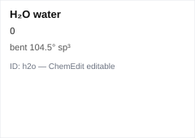 | H₂O water | bent 104.5° sp³ |
|  | NH₃ ammonia | pyramidal 107° sp³ |
| 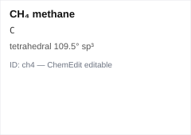 | CH₄ methane | tetrahedral 109.5° sp³ |
| 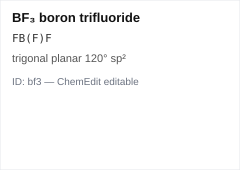 | BF₃ boron trifluoride | trigonal planar 120° sp² |
| 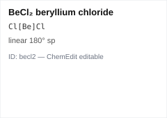 | BeCl₂ beryllium chloride | linear 180° sp |
| 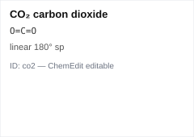 | CO₂ carbon dioxide | linear 180° sp |
| 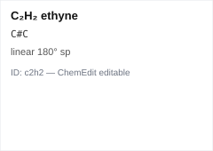 | C₂H₂ ethyne | linear 180° sp |
| 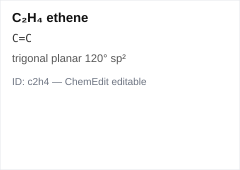 | C₂H₄ ethene | trigonal planar 120° sp² |
| 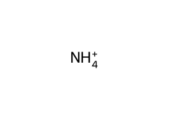 | NH₄⁺ ammonium | tetrahedral sp³ |
| 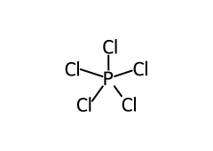 | PCl₅ phosphorus pentachloride | TBP sp³d |
| 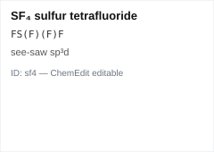 | SF₄ sulfur tetrafluoride | see-saw sp³d |
| 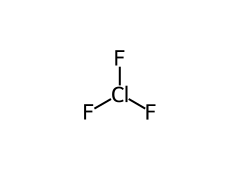 | ClF₃ chlorine trifluoride | T-shaped sp³d |
| 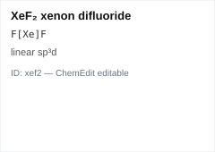 | XeF₂ xenon difluoride | linear sp³d |
| 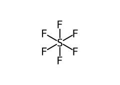 | SF₆ sulfur hexafluoride | octahedral sp³d² |
| 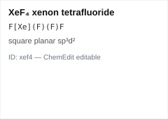 | XeF₄ xenon tetrafluoride | square planar sp³d² |
| 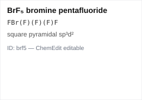 | BrF₅ bromine pentafluoride | square pyramidal sp³d² |
| 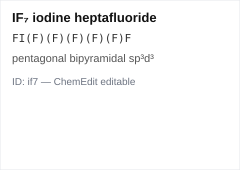 | IF₇ iodine heptafluoride | pentagonal bipyramidal sp³d³ |
| 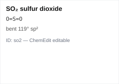 | SO₂ sulfur dioxide | bent 119° sp² |
| 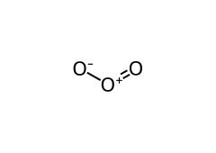 | O₃ ozone | bent 117° resonance |
| 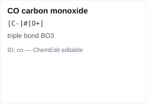 | CO carbon monoxide | triple bond BO3 |
| 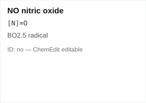 | NO nitric oxide | BO2.5 radical |
| 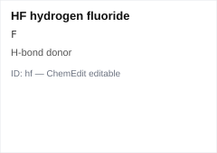 | HF hydrogen fluoride | H-bond donor |
| 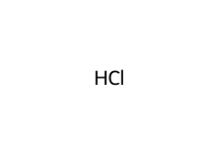 | HCl hydrogen chloride | polar |
| 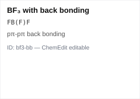 | BF₃ with back bonding | pπ-pπ back bonding |
| 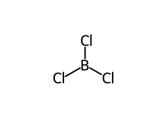 | BCl₃ boron trichloride | trigonal planar, no back bonding as strong |
| 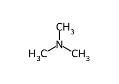 | NMe₃ trimethylamine | pyramidal basic |
| 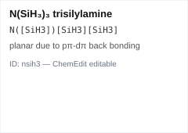 | N(SiH₃)₃ trisilylamine | planar due to pπ-dπ back bonding |
| 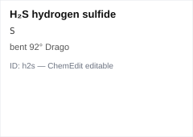 | H₂S hydrogen sulfide | bent 92° Drago |
| 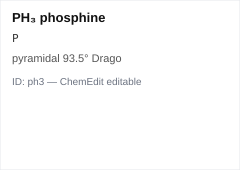 | PH₃ phosphine | pyramidal 93.5° Drago |
| 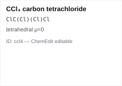 | CCl₄ carbon tetrachloride | tetrahedral μ=0 |
| 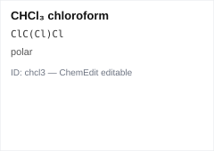 | CHCl₃ chloroform | polar |
| 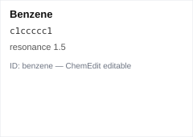 | Benzene | resonance 1.5 |
| 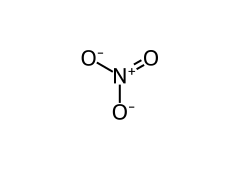 | NO₃⁻ nitrate | trigonal planar resonance |
<!-- gallery:end -->

## Live structures for the Chem plugin (generated)

<!-- smiles:begin -->
```smiles
O
N
C
FB(F)F
Cl[Be]Cl
O=C=O
C#C
C=C
[NH4+]
ClP(Cl)(Cl)(Cl)Cl
FS(F)(F)F
FCl(F)F
F[Xe]F
FS(F)(F)(F)(F)F
F[Xe](F)(F)F
FBr(F)(F)(F)F
FI(F)(F)(F)(F)(F)F
O=S=O
[O-][O+]=O
[C-]#[O+]
[N]=O
F
Cl
FB(F)F
ClB(Cl)Cl
CN(C)C
N([SiH3])[SiH3][SiH3]
S
P
ClC(Cl)(Cl)Cl
ClC(Cl)Cl
c1ccccc1
[O-][N+](=O)[O-]
```
<!-- smiles:end -->
