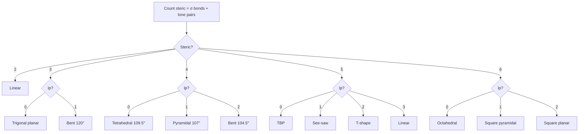

# Chemical Bonding and Molecular Structure — JEE Main + Advanced Notes

> **Sources merged into these notes**
> | Source | File |
> |---|---|
> | NCERT Class XI Chemistry (rationalised, 2023+), Unit 4 | [`kech104.pdf`](kech104.pdf) |
> | Allen — Chemical Bonding Theory (Nurture Course, English Medium) | [`CHEMICAL BONDING- Theory.pdf`](CHEMICAL%20BONDING-%20Theory.pdf) |
>
> 🅰 = Allen-only content; 🆇 = extra JEE-Advanced point; ⚠ = trap.

## Contents

- [Part A — Foundations: Octet, Lewis, Formal Charge](#part-a--foundations-octet-lewis-formal-charge)
  - [1. Kossel-Lewis approach and octet rule (4.1)](#1-kossel-lewis-approach-and-octet-rule-41)
  - [2. Lewis symbols and Lewis structures (4.1.3)](#2-lewis-symbols-and-lewis-structures-413)
  - [3. Formal charge and its uses (4.1.4) 🅰](#3-formal-charge-and-its-uses-414-)
  - [4. Limitations of octet rule — incomplete, odd, expanded (4.1.5)](#4-limitations-of-octet-rule--incomplete-odd-expanded-415)
- [Part B — Ionic Bond](#part-b--ionic-bond)
  - [5. Ionic / electrovalent bond formation (4.2)](#5-ionic--electrovalent-bond-formation-42)
  - [6. Lattice enthalpy and Born-Haber cycle 🅰](#6-lattice-enthalpy-and-born-haber-cycle-)
  - [7. Fajans' rules — polarisation and covalent character 🅰](#7-fajans-rules--polarisation-and-covalent-character-)
  - [8. Properties of ionic compounds](#8-properties-of-ionic-compounds)
- [Part C — Bond Parameters and Resonance](#part-c--bond-parameters-and-resonance)
  - [9. Bond parameters — length, angle, enthalpy, order (4.3)](#9-bond-parameters--length-angle-enthalpy-order-43)
  - [10. Resonance (4.1)](#10-resonance-41)
- [Part D — VSEPR Theory](#part-d--vsepr-theory)
  - [11. VSEPR — basic postulates (4.4)](#11-vsepr--basic-postulates-44)
  - [12. VSEPR shapes table — AB₂ to AB₇](#12-vsepr-shapes-table--ab₂-to-ab₇)
  - [13. Lone pair effects and distortions 🅰](#13-lone-pair-effects-and-distortions-)
- [Part E — Valence Bond Theory and Hybridisation](#part-e--valence-bond-theory-and-hybridisation)
  - [14. Valence Bond Theory and orbital overlap (4.5)](#14-valence-bond-theory-and-orbital-overlap-45)
  - [15. Hybridisation — concept (4.6)](#15-hybridisation--concept-46)
  - [16. Types of hybridisation — sp to sp³d²](#16-types-of-hybridisation--sp-to-sp³d²)
  - [17. Hybridisation vs VSEPR — how to predict quickly 🅰](#17-hybridisation-vs-vsepr--how-to-predict-quickly-)
  - [18. Drago's rule and Bent's rule 🅰 🆇](#18-dragos-rule-and-bents-rule--)
- [Part F — Molecular Orbital Theory](#part-f--molecular-orbital-theory)
  - [19. MOT — LCAO, bonding/antibonding (4.7)](#19-mot--lcao-bondingantibonding-47)
  - [20. Energy level diagrams and bond order (4.7)](#20-energy-level-diagrams-and-bond-order-47)
  - [21. Homonuclear diatomics — B₂ to Ne₂ (4.8)](#21-homonuclear-diatomics--b₂-to-ne₂-48)
  - [22. Heteronuclear MOT — CO, NO, HF, HCl 🅰](#22-heteronuclear-mot--co-no-hf-hcl-)
- [Part G — Polarity and Intermolecular Forces](#part-g--polarity-and-intermolecular-forces)
  - [23. Dipole moment and % ionic character 🅰](#23-dipole-moment-and--ionic-character-)
  - [24. Back bonding 🅰 🆇](#24-back-bonding--)
  - [25. Hydrogen bonding (4.9)](#25-hydrogen-bonding-49)
  - [26. van der Waals forces and other secondary bonds 🅰](#26-van-der-waals-forces-and-other-secondary-bonds-)
- [Part H — Problem Solving and Revision](#part-h--problem-solving-and-revision)
  - [27. Worked problem patterns — Allen style 🅰](#27-worked-problem-patterns--allen-style-)
  - [28. JEE traps and must-remember orders ⚠](#28-jee-traps-and-must-remember-orders-)
  - [29. Quick Revision Sheet](#29-quick-revision-sheet)

---

# Part A — Foundations: Octet, Lewis, Formal Charge

## 1. Kossel-Lewis approach and octet rule (4.1)

Answer-first: Atoms combine to achieve noble-gas configuration — 8 e⁻ in valence shell (2 for H, He). Kossel explained ionic bond via electron transfer, Lewis via sharing. Noble gases inert because ns²np⁶.

* **Kossel (1916):** Highly electropositive alkali metals lose e⁻ → M⁺, highly electronegative halogens gain e⁻ → X⁻, both attain [Noble gas]. Electrostatic attraction = ionic bond. Electrovalence = number of charges.
  * Na → Na⁺ + e⁻ [Ne] , Cl + e⁻ → Cl⁻ [Ar] , Na⁺ + Cl⁻ → NaCl
  * Ca → Ca²⁺ + 2e⁻ , 2F + 2e⁻ → 2F⁻ , Ca²⁺ + 2F⁻ → CaF₂
* **Lewis (1916):** Atom = positively charged Kernel + outer shell max 8 e⁻ at cube corners. Bond = sharing to achieve octet. Dots = valence e⁻. Lewis symbols: number of dots = group valence or 8 - dots.
* **Octet rule:** Atoms share/gain/lose e⁻ to have 8 e⁻ around them.

```mermaid
flowchart TD
    A[Why combine?] --> B[Lower energy → more stable]
    B --> C{How?}
    C -->|Transfer e⁻| D[Ionic: Na → Na⁺, Cl → Cl⁻]
    C -->|Share e⁻| E[Covalent: Cl· + ·Cl → Cl:Cl]
    D --> F[Octet: [Ne], [Ar]]
    E --> F
```

> **Note:** Octet is a bookkeeping rule, not a law. It works best for 2nd period.

## 2. Lewis symbols and Lewis structures (4.1.3)

Lewis dot structures show bonding pairs and lone pairs. Steps (NCERT):

1. Total valence e⁻ = sum of group valences. For anion add charge, cation subtract.
   * CH₄: C 4 + 4×H 1 = 8 e⁻
   * CO₃²⁻: C 4 + 3×O 6 + 2 (charge) = 24 e⁻
   * NH₄⁺: N 5 + 4×H 1 -1 = 8 e⁻
2. Least electronegative atom central (except H). Skeletal.
3. Distribute e⁻ as single bonds, then complete octet of terminals, then central, then multiple bonds if needed.
4. Each H gets duplet (2 e⁻).

Examples:
* H₂O: H–O–H with 2 lone pairs on O
* CCl₄: C central, 4 C–Cl single bonds, 3 lone pairs per Cl
* CO₂: O=C=O , each O octet, C octet via 2 double bonds
* N₂: N≡N , one lone pair each N
* CO: :C≡O: with formal charges (see §3) — triple bond needed to satisfy octet

| Molecule | Total valence | Lewis | Note |
|---|---:|---|---|
| BeH₂ | 4 | H:Be:H | incomplete octet (4 e⁻ on Be) |
| BF₃ | 24 | F–B–F with 3 bonds | incomplete (6 e⁻ on B) |
| PCl₅ | 40 | 5 P–Cl bonds | expanded (10 e⁻ on P) |
| SF₆ | 48 | 6 S–F bonds | expanded (12 e⁻ on S) |

## 3. Formal charge and its uses (4.1.4) 🅰

Formal charge = valence e⁻ in free atom - non-bonding e⁻ - ½ bonding e⁻.

$$ F.C. = V - L - \frac{1}{2}B $$

Use: most stable Lewis structure has smallest formal charges, negative charge on more electronegative atom.

O₃ example:
```
   O₁ central: V=6, L=2, B=6 → F.C. = 6-2-3 = +1
   O₂ terminal double-bonded: V=6, L=4, B=4 → 0
   O₃ terminal single-bonded: V=6, L=6, B=2 → -1
```
Structure: ⁺¹O–O⁻¹ with double bond to other O. Actual molecule resonance hybrid.

| Species | Best structure by formal charge |
|---|---|
| CO | :C≡O: with C⁻¹, O⁺¹ is best? Actually :C≡O: with formal charges -1 on C, +1 on O is more stable than C=O with larger charges. But CO has very small dipole (C negative) proving this. |
| NCO⁻ | [N≡C–O]⁻ with N -2? Best is N≡C–O⁻ with charges 0? Need check: N≡C–O⁻: N 0? Actually calculate. |
| SCN⁻ | [S=C=N]⁻ more stable than S–C≡N etc. |

> **⚠ Trap:** Formal charge ≠ oxidation number ≠ real charge. Formal charge is for Lewis bookkeeping.

## 4. Limitations of octet rule — incomplete, odd, expanded (4.1.5)

| Type | Description | Examples |
|---|---|---|
| **Incomplete octet** | Central has <8 e⁻ | BeH₂ (4 e⁻), BH₃ (6 e⁻), BF₃ (6 e⁻), AlCl₃ (6 e⁻) — electron-deficient, Lewis acids |
| **Odd-electron** | Odd total valence → one atom has 7 e⁻ | NO (11 e⁻), NO₂ (17 e⁻) — paramagnetic, dimerise |
| **Expanded octet** | Central >8 e⁻, needs d-orbitals (3rd period onwards) | PCl₅ (10 e⁻), SF₆ (12 e⁻), H₂SO₄ (12 e⁻ around S), IF₇ (14 e⁻) |
| **Other failures** | Super-octet stable species, noble gas compounds, shape not explained | XeF₂, XeF₄, etc. |

* BF₃ dimerises? No, but AlCl₃ dimerises to Al₂Cl₆ to complete octet via 3c-2e? Actually Al₂Cl₆ has 2 bridging Cl with coordinate bonds.
* Odd-electron NO₂ dimerises to N₂O₄ to achieve octet.

---

# Part B — Ionic Bond

## 5. Ionic / electrovalent bond formation (4.2)

Ionic bond = complete transfer of e⁻ + electrostatic attraction. Formed between low IE metal + high EA non-metal.

Conditions favouring ionic (Allen 🅰):
* Low ionization enthalpy of cation (Group 1,2)
* High electron gain enthalpy of anion (Group 17)
* High lattice energy (small size, high charge)

Energy steps: M(g) → M⁺(g) + e⁻ (IE), X(g) + e⁻ → X⁻(g) (EA), M⁺(g) + X⁻(g) → MX(s) (Lattice enthalpy U).

## 6. Lattice enthalpy and Born-Haber cycle 🅰

**Lattice enthalpy U** = energy released when 1 mol gaseous ions form solid. ∝ (q⁺q⁻)/(r⁺+r⁻). Larger charge, smaller size → higher U → more stable ionic.

**Born-Haber cycle** for NaCl:

```
Na(s) + ½Cl₂(g) → NaCl(s)  ΔH_f = -411 kJ/mol

Steps:
1. Na(s) → Na(g)  ΔH_sub = +108
2. ½Cl₂(g) → Cl(g) ½ΔH_diss = +121
3. Na(g) → Na⁺(g) + e⁻  IE₁ = +496
4. Cl(g) + e⁻ → Cl⁻(g)  EA = -349
5. Na⁺(g) + Cl⁻(g) → NaCl(s)  U = ?

Hess: ΔH_f = ΔH_sub + ½D + IE + EA + U
→ U = ΔH_f - (others) ≈ -787 kJ/mol
```

| Factor | Effect on U |
|---|---|
| ↑ charge | ↑ U (MgO > NaCl) |
| ↓ size | ↑ U (NaF > NaI) |
| More ions per formula | ↑ |

> **JEE Advanced:** Born-Haber used to calculate EA, lattice energy, or check feasibility.

## 7. Fajans' rules — polarisation and covalent character 🅰

Ionic bond has partial covalent character due to polarisation: cation distorts anion's electron cloud.

Fajans' rules — covalent character ↑ when:

| Rule | Reason | Example order |
|---|---:|---|
| **Small cation** | high polarising power ∝ charge/size² | Li⁺ > Na⁺ > K⁺, so LiCl more covalent than NaCl |
| **Large anion** | more polarisable | I⁻ > Br⁻ > Cl⁻ > F⁻, so LiI more covalent than LiF |
| **High charge on both** | more polarisation | Al³⁺ high → AlCl₃ covalent, Na⁺ low → NaCl ionic |
| **Cation with pseudo-noble gas config (ns²np⁶d¹⁰)** | more polarising than noble gas config | Cu⁺, Ag⁺ more covalent than Na⁺, K⁺; hence AgCl covalent-ish |
| **High charge, small size both** | | |

Polarising power = charge / (radius)². Polarizability ∝ size of anion.

Applications:
* **Solubility:** More covalent → less soluble in polar water, more in organic. AgF soluble (ionic), AgI insoluble (covalent).
* **Melting point:** More covalent → lower m.p. NaCl 800°C ionic, AlCl₃ 180°C covalent dimer.
* **Thermal stability of carbonates:** Small cation polarises CO₃²⁻ → decomposes easier. Li₂CO₃ decomposes, Na₂CO₃ stable. Order: Li₂CO₃ < Na₂CO₃ < K₂CO₃ < Rb₂CO₃ < Cs₂CO₃.
* **Order of covalent character:** 
  * LiF < LiCl < LiBr < LiI
  * NaCl < MgCl₂ < AlCl₃ < SiCl₄ < PCl₅

```mermaid
flowchart LR
    A[Cation small + high charge] --> C[High polarising power]
    B[Anion large] --> D[High polarisability]
    C + D --> E[More covalent character]
    E --> F[Low m.p., less soluble in water, more in organic, more colour]
```

## 8. Properties of ionic compounds

* Hard, brittle crystalline solids
* High m.p., b.p. due to high U
* Soluble in polar solvents (hydration energy > lattice)
* Conduct electricity in molten/aqueous (free ions), not solid
* Non-directional → no isomerism, high coordination numbers

---

# Part C — Bond Parameters and Resonance

## 9. Bond parameters — length, angle, enthalpy, order (4.3)

| Parameter | Definition | Trend |
|---|---|---|
| **Bond length** | Equilibrium distance between nuclei of bonded atoms | ∝ size, ∝ single > double > triple. C–C 154 pm, C=C 134 pm, C≡C 120 pm. |
| **Bond angle** | Angle between two bonds at central atom | Depends on hybridisation, lone pairs. CH₄ 109.5°, NH₃ 107°, H₂O 104.5° |
| **Bond enthalpy** | Energy needed to break 1 mol bonds in gas | ∝ bond order, ∝ 1/size. C–C 348, C=C 610, C≡C 840 kJ/mol |
| **Bond order** | Number of bonds between two atoms (Lewis) / (Nb-Na)/2 (MOT) | ↑ bond order → ↓ length, ↑ enthalpy, ↑ stability |

Factors:
* **Hybridisation:** More s% → shorter, stronger. sp (50% s) < sp² (33%) < sp³ (25%) length. Example C–H: sp 108 pm, sp² 110 pm, sp³ 112 pm.
* **Resonance:** Bond order averaged. In benzene C–C 139 pm between single/double.

## 10. Resonance (4.1)

When one Lewis structure cannot explain properties, multiple structures with same atomic positions but different electron distribution = resonating structures. Actual = resonance hybrid.

Conditions:
* Same positions of atoms, same number of paired/unpaired e⁻
* More covalent bonds, less charge separation, negative on electronegative = more stable contributor.

Examples:
* O₃: O=O⁺–O⁻ ↔ O⁻–O⁺=O
* CO₃²⁻: 3 structures with one C=O and two C–O⁻, bond order 1.33 each, all C–O 129 pm (between single 143 and double 122)
* Benzene: 2 Kekulé structures, C–C bond order 1.5
* NO₃⁻: 3 structures
* Energy: resonance hybrid more stable than any contributor by resonance energy.

> **⚠ Trap:** Resonance structures are not isomers, not in equilibrium. They are imaginary; hybrid is real.

---

# Part D — VSEPR Theory

## 11. VSEPR — basic postulates (4.4)

Valence Shell Electron Pair Repulsion — shape determined by repulsion between electron pairs in valence shell of central atom. Order: lp-lp > lp-bp > bp-bp.

Postulates:
1. Pairs arrange to minimize repulsion → max distance.
2. Lone pair occupies more space than bond pair → compresses angle.
3. Multiple bonds behave as one pair but more repulsive.
4. Electronegative substituents pull bond pair away → less repulsion.

## 12. VSEPR shapes table — AB₂ to AB₇

| Steric number (e⁻ pairs) | lp | Formula | Shape | Example | Bond angle |
|---:|---:|---|---|---|---|
| 2 | 0 | AB₂ | Linear | BeCl₂, CO₂, C₂H₂ | 180° |
| 3 | 0 | AB₃ | Trigonal planar | BF₃, BCl₃ | 120° |
| 3 | 1 | AB₂L | Bent / V | SO₂, O₃ | ~119° |
| 4 | 0 | AB₄ | Tetrahedral | CH₄, CCl₄, NH₄⁺ | 109.5° |
| 4 | 1 | AB₃L | Trigonal pyramidal | NH₃, PCl₃ | ~107° |
| 4 | 2 | AB₂L₂ | Bent | H₂O, OF₂ | ~104.5° |
| 5 | 0 | AB₅ | Trigonal bipyramidal | PCl₅ | 90°,120°,180° |
| 5 | 1 | AB₄L | See-saw | SF₄ | ~102°, 173° |
| 5 | 2 | AB₃L₂ | T-shaped | ClF₃ | 87.5° |
| 5 | 3 | AB₂L₃ | Linear | XeF₂ | 180° |
| 6 | 0 | AB₆ | Octahedral | SF₆ | 90°,180° |
| 6 | 1 | AB₅L | Square pyramidal | BrF₅ | ~84.8° |
| 6 | 2 | AB₄L₂ | Square planar | XeF₄ | 90° |
| 7 | 0 | AB₇ | Pentagonal bipyramidal | IF₇ | 72°,90° |
| 7 | 1 | AB₆L | Pentagonal pyramidal | XeOF₅⁻ etc 🆇 |  |



## 13. Lone pair effects and distortions 🅰

* **NH₃ vs PH₃:** NH₃ 107° pyramidal, PH₃ 93.5° almost pure p — Drago's rule (see §18).
* **H₂O 104.5° < NH₃ 107° < CH₄ 109.5°** due to 2 lp vs 1 lp vs 0 lp.
* **ClF₃ T-shaped:** 2 lp equatorial in TBP to minimize lp-lp 120° repulsion. Lone pairs occupy equatorial positions in TBP, axial in octahedral? Actually in TBP, lp prefer equatorial (120° apart). In AB₅, 1 lp equatorial → see-saw.
* **SF₄ see-saw:** 1 lp equatorial.
* **XeF₂ linear:** 3 lp equatorial, 2 F axial.

> **⚠ VSEPR fails** for transition metals, for molecules with inactive lone pairs (heavy p-block).

---

# Part E — Valence Bond Theory and Hybridisation

## 14. Valence Bond Theory and orbital overlap (4.5)

VBT: bond formed by overlap of half-filled atomic orbitals with opposite spins, pairing electrons, lowering energy. Strength ∝ overlap.

Types:
* **s-s overlap:** H₂ — 1s + 1s → σ bond
* **s-p overlap:** HF — H 1s + F 2p
* **p-p overlap:** 
  * Head-on → σ (e.g., F₂ p_z + p_z)
  * Sidewise → π (e.g., O₂, N₂)

```
  σ bond:  ---- overlap along internuclear axis ----
  s + s, s + p_z, p_z + p_z (z = bond axis)

  π bond:  || sidewise overlap, above and below axis
  p_x + p_x, p_y + p_y
```

* Strength: σ > π because overlap more.
* Multiple bonds: double = 1σ + 1π, triple = 1σ + 2π

Limitations of VBT: cannot explain paramagnetism of O₂, delocalization, etc. → MOT.

## 15. Hybridisation — concept (4.6)

Hybridisation = mixing of atomic orbitals of same atom with similar energy to form new hybrid orbitals with same energy, oriented to minimize repulsion, better overlap.

Rules:
1. Only orbitals of central atom hybridise, not terminal.
2. Number of hybrids = number of atomic orbitals mixed.
3. Hybrid orbitals form only σ bonds, lone pairs occupy hybrids, π bonds use unhybridised p/d.
4. Type determines shape.

## 16. Types of hybridisation — sp to sp³d²

| Hybrid | Atomic orbitals | Steric | Shape | Angle | % s | Example |
|---|---|---:|---|---|---:|---|
| sp | s + p | 2 | Linear | 180° | 50% | BeCl₂, CO₂, C₂H₂, [Ag(NH₃)₂]⁺ |
| sp² | s + 2p | 3 | Trigonal planar | 120° | 33% | BF₃, C₂H₄, NO₃⁻, graphite |
| sp³ | s + 3p | 4 | Tetrahedral | 109.5° | 25% | CH₄, NH₃, H₂O, NH₄⁺ |
| sp³d | s + 3p + d(z²) | 5 | TBP | 90°,120° | 20% | PCl₅, SF₄, ClF₃ |
| sp³d² | s + 3p + 2d(z²,x²-y²) | 6 | Octahedral | 90° | 16.7% | SF₆, [CrF₆]³⁻ |
| sp³d³ | s + 3p + 3d | 7 | Pentagonal bipyramidal | 72°,90° | 14% | IF₇, XeF₆? |
| dsp² | (n-1)d + s + 2p | 4 | Square planar | 90° | - | [Ni(CN)₄]²⁻, [PtCl₄]²⁻ |
| d²sp³ | (n-1)d² + s + p³ | 6 | Octahedral (inner) | 90° | - | [Fe(CN)₆]³⁻, [Co(NH₃)₆]³⁺ |

* For TBP sp³d: 3 equatorial bonds sp²-like (120°), 2 axial p-d (90°). Axial longer than equatorial due to more repulsion (3 at 90° vs 2).
* For octahedral sp³d²: all 90°.

```
  sp:   ──●──  180°
  sp²:  trigonal 120°
  sp³:  tetrahedron 109.5°
  sp³d: TBP
      F
      |
  F—P—F  equatorial 120°
      |
      F
      axial
```

## 17. Hybridisation vs VSEPR — how to predict quickly 🅰

**Fast method (Allen):**
1. Count steric number = σ bonds + lone pairs.
   * σ bonds = total atoms attached to central (if multiple bond counts as 1)
2. Steric → hybridisation:
   * 2 → sp, 3 → sp², 4 → sp³, 5 → sp³d, 6 → sp³d², 7 → sp³d³
3. Lone pairs → shape via VSEPR.

Examples:
* H₂O: O central, 2 H attached + 2 lp = 4 → sp³, bent.
* NH₃: N 3 H +1 lp =4 → sp³, pyramidal.
* PCl₅: P 5 Cl +0 lp =5 → sp³d, TBP.
* SF₆: S 6 F =6 → sp³d², octahedral.
* XeF₄: Xe 4 F +2 lp =6 → sp³d², square planar.
* ICl₄⁻: I 4 Cl +2 lp +1 (negative charge?) Actually steric = 4 +2 =6 → sp³d², square planar.

> **⚠ Common mistake:** Count π bonds as separate for hybridisation. Do not. Double bond = 1 σ for steric.

## 18. Drago's rule and Bent's rule 🅰 🆇

**Drago's rule 🅰:** For central atom from 3rd period onwards, with at least one lone pair, and with highly electropositive or low electronegativity substituents (H, alkyl), hybridisation is *not* required. Pure p orbitals used for bonding.

Conditions for Drago:
1. Central atom belongs to 3rd period or below (P, S, As, Sb...)
2. Central has at least one lone pair
3. Substituent electronegativity ≤ 2.5 (H, CH₃, etc.)

Effect: bond angle ~ 90° (pure p-p overlap), no hybridisation, low dipole.

Examples:
* PH₃: 93.5°, AsH₃: 91.8°, SbH₃: 91.3°, H₂S: 92.1°, H₂Se: 91°
* But PF₃: 97.8° with hybridisation (F electronegative, so Drago fails) → sp³.

**Bent's rule 🅰 🆇:** More electronegative substituents prefer hybrid orbitals with *less* s-character, more p-character. Lone pairs prefer more s-character.

Implications:
* In CH₃F: C–F bond has more p-character than C–H, so F–C–H angle <109.5°
* In PF₃Cl₂: More electronegative F occupies axial positions? Actually in TBP, more electronegative prefers axial (more p/d character).
* Lone pair occupies orbital with more s% → explains NH₃ vs PH₃: N lone pair in sp³ with high s%, P lone pair pure s, bonds pure p → angle small.

| Molecule | Angle | Explanation |
|---|---|---|
| NH₃ 107° vs PH₃ 93.5° | Drago: PH₃ no hybridisation, pure p |
| H₂O 104.5° vs H₂S 92° | Same |
| CH₂F₂: F–C–F < H–C–H | Bent: F prefers p-rich orbital |

---

# Part F — Molecular Orbital Theory

## 19. MOT — LCAO, bonding/antibonding (4.7)

MOT: atomic orbitals combine to form molecular orbitals delocalised over whole molecule. Electrons fill MOs by Aufbau.

LCAO: ψ_MO = ψ_A ± ψ_B

* ψ_bonding = ψ_A + ψ_B (constructive, electron density between nuclei, lower energy than AOs)
* ψ_antibonding = ψ_A - ψ_B (destructive, node between nuclei, higher energy, marked *)

Conditions for effective overlap:
1. Similar energy of AOs
2. Same symmetry (e.g., s with s, p_z with p_z for σ, p_x with p_x for π)
3. Proper orientation and sufficient overlap

Types:
* s + s → σ(1s), σ*(1s)
* p_z + p_z (z = internuclear) → σ(2p_z), σ*(2p_z)
* p_x + p_x, p_y + p_y → π(2p_x), π*(2p_x) etc.

Energy order: σ1s < σ*1s < σ2s < σ*2s < (π2p_x = π2p_y) < σ2p_z < π*2p_x = π*2p_y < σ*2p_z (for B₂, C₂, N₂). For O₂, F₂ order flips: σ2p_z lower than π*? Actually for O₂ onwards: σ2s < σ*2s < σ2p_z < π2p_x=π2p_y < π* < σ*.

Why flip? s-p mixing in B, C, N (2s and 2p close) pushes σ2p_z up.

## 20. Energy level diagrams and bond order (4.7)

Bond order = ½ (Nb - Na) where Nb = electrons in bonding MOs, Na = antibonding.

* Bond order 0 → unstable, no bond
* Higher bond order → shorter, stronger, higher dissociation energy
* Bond order fractional possible via resonance/MOT.

Magnetic: if all electrons paired → diamagnetic, if unpaired → paramagnetic.

## 21. Homonuclear diatomics — B₂ to Ne₂ (4.8)

**For Li₂ to N₂ (with s-p mixing):**

Order: σ1s < σ*1s < σ2s < σ*2s < π2p_x=π2p_y < σ2p_z < π* < σ*

| Species | Valence e⁻ | Config | Bond order | Magnetism | Bond length trend |
|---|---|---|---|---|---|
| Li₂ | 2 | σ2s² | 1 | Diamag | 267 pm |
| Be₂ | 4 | σ2s² σ*2s² | 0 | — | does not exist |
| B₂ | 6 | σ2s² σ*2s² π2p_x¹ π2p_y¹ | 1 | **Paramag (2 unpaired)** — VBT fails | 159 pm |
| C₂ | 8 | σ2s² σ*2s² π2p_x² π2p_y² | 2 | Diamag (double bond, both π) | 124 pm |
| N₂ | 10 | ... π⁴ σ2p_z² | 3 | Diamag, very strong | 110 pm, highest dissociation |
| O₂ | 12 | For O₂ order changes: σ2s² σ*2s² σ2p_z² π⁴ π*² | 2 | **Paramag (2 unpaired in π*)** — VBT fails | 121 pm |
| F₂ | 14 | ... π*⁴ | 1 | Diamag | 141 pm |
| Ne₂ | 16 | ... σ*² | 0 | — | does not exist |

* **B₂ paramagnetism:** MOT predicts 2 unpaired in π bonding, proved experimentally. VBT would predict diamagnetic.
* **O₂ paramagnetism:** 2 unpaired in π* antibonding, explains O₂ attracted to magnet.

```
Energy diagram for N₂ (with s-p mixing):
         σ*2p_z  ──
         π*2p    ── ──
         σ2p_z   ──
         π2p     ── ──
         σ*2s    ──
         σ2s     ──
         σ*1s    ──
         σ1s     ──

Energy diagram for O₂ (no s-p mixing):
         σ*2p_z  ──
         π*2p    ── ── (2 e⁻ unpaired)
         π2p     ── ──
         σ2p_z   ──
         ... same lower
```

> **⚠ JEE trap:** Bond order alone not decides stability if antibonding electrons many. F₂ bond order 1 but weaker than O₂ bond order 2? Actually F₂ 158 kJ/mol, O₂ 498 kJ/mol.

## 22. Heteronuclear MOT — CO, NO, HF, HCl 🅰

For AB molecules, AOs of different energies → MOs more closer to more electronegative atom, unequal contribution.

* **CO:** 10 valence e⁻ like N₂, isoelectronic. Config: (σ2s)²(σ*2s)²(π2p)⁴(σ2p)². Bond order 3. Dipole small, C negative due to lone pair in σ HOMO concentrated on C. Very strong.
* **NO:** 11 e⁻. Config: ... (π* )¹. Bond order 2.5. Paramagnetic (1 unpaired). NO⁺ bond order 3 (stronger), NO⁻ bond order 2.
* **NO⁺ vs NO vs NO⁻:** Bond length NO⁺ < NO < NO⁻, bond order 3 >2.5>2.
* **HF:** Only H 1s overlaps with F 2p_z → σ bonding, σ* antibonding, other F p_x,p_y non-bonding. Bond order 1. Highly polar.
* **HCl similar.**

| Species | e⁻ | Bond order | Magnetism | Note |
|---|---|---:|---|---|
| CO | 10 | 3 | Diamag | Highest bond enthalpy among diatomics |
| NO | 11 | 2.5 | Paramag |  |
| NO⁺ | 10 | 3 | Diamag | Shorter than NO |
| CN⁻ | 10 | 3 | Diamag | Isoelectronic with N₂, CO |
| O₂⁺ | 11 | 2.5 | Paramag (1 unpaired) | Shorter than O₂ |
| O₂⁻ (superoxide) | 13 | 1.5 | Paramag | Longer than O₂ |
| O₂²⁻ (peroxide) | 14 | 1 | Diamag | Longest |

---

# Part G — Polarity and Intermolecular Forces

## 23. Dipole moment and % ionic character 🅰

Dipole moment μ = q × d (charge × distance). Vector. Unit Debye: 1 D = 3.336×10⁻³⁰ C·m.

* For diatomic AB: μ = δ × bond length, where δ = partial charge.
* % ionic character = (μ_observed / μ_theoretical ionic) ×100, where μ_theoretical = e × d.

Examples:
* HF: μ = 1.91 D, theoretical if 100% ionic = 4.8 D × (0.92Å) ~? % ionic ~43%
* HCl: μ = 1.03 D, % ionic ~17%
* HBr: 0.78 D, % ionic ~12%

Factors:
* Large ΔEN → high μ, but not always due to shape cancellation.
* CO₂ μ=0 (linear, dipoles cancel) even though C–O polar.
* BF₃ μ=0 (trigonal planar), CCl₄ μ=0 (tetrahedral), p-dichlorobenzene μ=0.
* H₂O μ=1.84 D, bent; NH₃ μ=1.47 D, pyramidal.

Order: NH₃ (1.47) > NF₃ (0.24) because in NF₃, N–F dipoles oppose lone pair dipole.

```
  NH₃:  lone pair dipole adds to N→H? Actually N δ- , H δ+, N→H bond dipole away from lone pair? Need check: NH₃ net dipole towards lone pair, NF₃ net opposite, so smaller.
```

> **JEE Advanced:** For polyatomic, μ vector sum. Use geometry.

## 24. Back bonding 🅰 🆇

Back bonding = donation of electron pair from filled orbital of one atom to vacant orbital of another, *in addition* to σ bond, forming partial π bond, strengthening bond, shortening length.

Types:
1. **pπ-pπ back bonding:** Vacant p of B accepts from filled p of F/O/N. Example BF₃: B has vacant p, F lone pair donates → B–F has partial double character, bond shorter, bond energy higher, Lewis acidity decreases: BF₃ < BCl₃ < BBr₃ < BI₃ (because F best back donor). Actually acidity order reversed due to back bonding: BF₃ weakest Lewis acid.
2. **pπ-dπ back bonding:** Filled p of F/O donates to vacant d of Si/P/S/Cl. Example SiF₄? Actually (Si–F) stronger, Trisilylamine N(SiH₃)₃ planar due to N pπ → Si dπ back bonding, N lone pair delocalised, so N(SiH₃)₃ less basic than N(CH₃)₃.
3. **dπ-pπ or dπ-dπ in metal carbonyls:** Metal d → CO π* back donation (will be covered in Coordination).

Effects:
* Bond length decreases
* Bond angle changes
* Lewis basicity/acidity changes
* Hybridisation changes

Examples table:

| Molecule | Back bonding | Effect |
|---|---|---|
| BF₃ | F lp → B vacant p | B–F shorter, BF₃ less acidic than BCl₃ |
| B₂H₆? No |
| N(SiH₃)₃ | N lp → Si d | Planar, N not basic, sp² |
| N(CH₃)₃ | No back bonding | Pyramidal, basic, sp³ |
| O(SiH₃)₂ | O lp → Si d | Angle 144° (wider than H₂O 104°) due to back bonding reducing lone pair repulsion |
| Cl₃Si–SiCl₃? |

## 25. Hydrogen bonding (4.9)

H-bond = electrostatic attraction between H attached to highly electronegative atom (F,O,N) and lone pair of another F,O,N.

Conditions: H bonded to F/O/N (high EN, small size) → H δ⁺, and acceptor with lone pair.

Strength: 10-40 kJ/mol (vs covalent ~400, van der Waals ~1-10). Strongest: F–H⋯F.

Types:
* **Intermolecular:** Between different molecules → ↑ b.p., ↑ viscosity, ↑ solubility.
  * H₂O, HF, NH₃, ROH, RCOOH, etc.
  * H₂O has highest b.p. among hydrides of group 16 due to H-bonding: H₂O 100°C, H₂S -60°C.
  * Ice less dense than water due to tetrahedral H-bond network with voids.
* **Intramolecular:** Within same molecule → ↓ b.p., ↓ solubility in water, affects acidity, chelation.
  * o-nitrophenol has intramolecular H-bond → steam volatile, less soluble, lower b.p. than p-nitrophenol (intermolecular).
  * o-hydroxybenzaldehyde, acetylacetone enol form.

Effects table:

| Property | H-bonding effect |
|---|---|
| Boiling point | ↑ for intermolecular (H₂O > H₂S) |
| Melting point | ↑ |
| Solubility | Polar solutes with H-bonding soluble in water (alcohol, sugar) |
| Viscosity | ↑ (glycerol) |
| Density | Ice open cage → density water > ice |
| Acidity | o-hydroxybenzoic acid more acidic due to stabilisation of conjugate base via H-bond |

> **⚠ H-bond is not a bond in Lewis sense**, it's a dipole-dipole interaction, but stronger.

## 26. van der Waals forces and other secondary bonds 🅰

| Force | Origin | Strength | Distance dependence |
|---|---|---|---|
| London dispersion | Instantaneous dipole-induced dipole | 0.05-40 kJ/mol | 1/r⁶, all molecules |
| Dipole-dipole | Permanent dipole-permanent dipole | 5-25 kJ/mol | 1/r³, polar molecules |
| Dipole-induced dipole | Permanent dipole induces in non-polar | 2-10 kJ/mol |  |
| Ion-dipole | Ion + polar molecule | 40-600 kJ/mol | Hydration, solubility |
| Ion-induced dipole |  |  |  |

* Boiling point trend in noble gases ↑ down group due to ↑ London forces (size ↑).
* Boiling point of alkanes ↑ with molecular mass.

---

# Part H — Problem Solving and Revision

## 27. Worked problem patterns — Allen style 🅰

**Pattern 1 — Formal charge best structure:**
Q: Which is best Lewis for NCO⁻?
A: N≡C–O⁻ (charges: N 0? Actually N -1? Let's calculate: N≡C–O⁻: N: V5 L2 B6 → 5-2-3=0, C V4 L0 B8 →0, O V6 L6 B2 → -1). Alternative N=C=O⁻ has charges -1 on N. First has negative on more electronegative O → more stable.

**Pattern 2 — Fajans:**
Q: Order covalent character: NaF, NaCl, NaBr, NaI.
A: Small cation same, anion size ↑ → covalent ↑: NaF < NaCl < NaBr < NaI.

Q: MgCl₂ vs AlCl₃ vs SiCl₄ vs PCl₅ melting point?
A: Charge ↑ → covalent ↑ → m.p. ↓: NaCl 801°C ionic > MgCl₂ 714°C > AlCl₃ 180°C (sublimes) > SiCl₄ -70°C liquid > PCl₅ 167°C sublimes.

**Pattern 3 — VSEPR shape:**
Q: Shape of XeF₂, XeF₄, XeF₆?
A: Steric 5 with 3 lp → linear, steric 6 with 2 lp → square planar, steric 7 with 1 lp → distorted octahedral (capped).

**Pattern 4 — Hybridisation with lone pairs:**
Q: Hybridisation of I in IF₇, IF₅, ICl₄⁻?
A: IF₇ steric 7 → sp³d³, IF₅ steric 6 → sp³d², ICl₄⁻ steric 6 (4 bond +2 lp) → sp³d² square planar.

**Pattern 5 — MOT bond order:**
Q: Order bond length: O₂, O₂⁺, O₂⁻, O₂²⁻?
A: Bond order: O₂⁺ 2.5 < O₂ 2 < O₂⁻ 1.5 < O₂²⁻ 1. So length reverse: O₂⁺ < O₂ < O₂⁻ < O₂²⁻.

Q: Which is paramagnetic: B₂, C₂, N₂, O₂, F₂?
A: B₂ (2 unpaired), O₂ (2 unpaired). Others diamag.

**Pattern 6 — Dipole moment zero?**
Q: Which have μ=0: CO₂, BF₃, CCl₄, CHCl₃, NH₃, NF₃, H₂O, p-dichlorobenzene, o-dichlorobenzene?
A: CO₂, BF₃, CCl₄, p-dichlorobenzene (symmetric cancellation). Others non-zero.

**Pattern 7 — Back bonding acidity:**
Q: Lewis acidity order BF₃, BCl₃, BBr₃, BI₃?
A: BF₃ < BCl₃ < BBr₃ < BI₃ due to decreasing pπ-pπ back bonding (F best donor).

**Pattern 8 — H-bonding b.p.:**
Q: Why H₂O b.p. 100°C > H₂S -60°C > H₂Se -41°C > H₂Te -2°C? Actually H₂O anomalously high due to H-bonding.

**Pattern 9 — Drago:**
Q: Bond angle in PH₃ vs NH₃?
A: PH₃ ~93°, no hybridisation (Drago), NH₃ 107° sp³.

## 28. JEE traps and must-remember orders ⚠

> **⚠ Trap 1:** Formal charge ≠ oxidation number. In CO, formal charges C⁻¹ O⁺¹ but oxidation numbers C⁺² O⁻².

> **⚠ Trap 2:** VSEPR counts double/triple as one steric unit. C₂H₄: each C steric 3 (2 H +1 C) → sp², not sp³.

> **⚠ Trap 3:** Hybridisation of terminal atoms not considered. In PCl₅, P sp³d, Cl not hybridised.

> **⚠ Trap 4:** O₂ paramagnetic — VBT says diamagnetic, MOT says paramagnetic. Experimental proves MOT.

> **⚠ Trap 5:** BF₃ μ=0 but B–F polar. Cancellation due to trigonal planar.

> **⚠ Trap 6:** Fajans: small cation + large anion = more covalent, not more ionic.

> **⚠ Trap 7:** Back bonding reduces Lewis acidity: BF₃ weakest, not strongest.

> **⚠ Trap 8:** H-bond strength: F–H⋯F strongest, but HF b.p. 19.5°C < H₂O 100°C because H₂O has 2 H-bonds per molecule vs HF 1.

Must-remember orders:

| Property | Order |
|---|---|
| **Bond length** C–C > C=C > C≡C | Single longest |
| **Bond enthalpy** C≡C > C=C > C–C | Triple strongest |
| **Ionic character** HF > HCl > HBr > HI | ΔEN decreasing |
| **Dipole** NH₃ > NF₃, CH₃Cl > CH₂Cl₂ > CHCl₃ > CCl₄ (0) |
| **Covalent character** LiF < LiCl < LiBr < LiI ; NaCl < MgCl₂ < AlCl₃ |
| **Thermal stability of hydrides** NH₃ > PH₃ > AsH₃ > SbH₃ > BiH₃ (Drago, bond strength ↓) |
| **Bond angle** CH₄ 109.5° > NH₃ 107° > H₂O 104.5° ; H₂O > H₂S > H₂Se |
| **Lewis acidity** BF₃ < BCl₃ < BBr₃ < BI₃ ; BH₃ > BF₃ (no back bonding in BH₃) |
| **Basicity** NMe₃ > NH₃ > N(SiH₃)₃ (back bonding kills basicity) |
| **MOT bond order** N₂ 3 > O₂ 2 > B₂ 1 > Be₂ 0 |
| **Melting point ionic vs covalent** NaCl > MgCl₂ > AlCl₃ > SiCl₄ |
| **H-bond b.p.** H₂O > HF > NH₃ (but HF has strongest H-bond per bond) |

## 29. Quick Revision Sheet

- Kossel-Lewis: octet = ns²np⁶, Lewis dots = valence e⁻.
- Formal charge = V - L - B/2; best structure minimal charges, negative on EN atom.
- Octet exceptions: incomplete (BeH₂, BF₃), odd (NO, NO₂), expanded (PCl₅, SF₆, IF₇).
- Ionic bond: low IE + high EA + high U. Lattice U ∝ q⁺q⁻/r.
- Born-Haber: ΔH_f = ΔH_sub + ½D + IE + EA + U.
- Fajans: covalent ↑ with small cation, large anion, high charge, pseudo-noble gas config (Cu⁺, Ag⁺). Applications: solubility, m.p., thermal stability.
- Bond parameters: length ∝ 1/order, ∝ size; enthalpy ∝ order; angle depends on hybridisation + lp.
- Resonance: same atoms, different e⁻ distribution; hybrid more stable by resonance energy; bond lengths averaged.
- VSEPR: repulsion lp-lp > lp-bp > bp-bp; steric = σ + lp; shapes from 2 linear to 7 pentagonal bipyramidal; lp prefer equatorial in TBP.
- VBT: overlap s-s, s-p, p-p head-on σ, sidewise π; σ stronger; double = 1σ+1π, triple =1σ+2π.
- Hybridisation: sp 180° 50% s, sp² 120° 33% s, sp³ 109.5° 25% s, sp³d TBP 90/120 20% s, sp³d² octahedral 90° 16.7% s, sp³d³ pentagonal bipyramidal.
- Fast: steric = atoms attached (multiple counts 1) + lp; 2→sp,3→sp²,4→sp³,5→sp³d,6→sp³d²,7→sp³d³.
- Drago: 3rd period+ central with lp + EN of substituent ≤2.5 → no hybridisation, angle ~90°, e.g., PH₃ 93.5°, H₂S 92°.
- Bent: EN substituents prefer p-rich orbitals; lp prefers s-rich.
- MOT: LCAO ψ± = ψ_A ± ψ_B; bonding lower energy, antibonding higher with node. Conditions: similar energy, same symmetry, good overlap.
- Energy order: For B₂,C₂,N₂ (s-p mixing): σ1s < σ*1s < σ2s < σ*2s < π2p_x=π2p_y < σ2p_z < π* < σ*; for O₂,F₂: σ2p_z < π.
- Bond order = ½(Nb-Na); magnetism: unpaired → paramag; higher BO → shorter, stronger.
- Homonuclear: Li₂ BO1, Be₂ 0 (no), B₂ 1 paramag 2 unpaired, C₂ 2 diamag, N₂ 3 diamag very strong, O₂ 2 paramag 2 unpaired, F₂ 1 diamag, Ne₂ 0.
- Heteronuclear: CO, CN⁻, NO⁺ 10e⁻ BO3; NO 11e⁻ BO2.5 paramag; O₂⁺ BO2.5, O₂⁻ BO1.5, O₂²⁻ BO1.
- Dipole μ = q×d, vector sum; μ=0 for symmetric: CO₂, BF₃, CCl₄, p-dichlorobenzene, XeF₄. NH₃ 1.47 D > NF₃ 0.24 D due to lone pair direction.
- % ionic = μ_obs / (e×d) ×100.
- Back bonding: pπ-pπ (B–F), pπ-dπ (N–Si), dπ-pπ (metal-CO). Effects: shorter bond, wider angle, reduced basicity/acidity. BF₃ < BCl₃ < BBr₃ acidity due to back bonding; N(SiH₃)₃ planar non-basic vs NMe₃ pyramidal basic.
- H-bond: H attached to F/O/N + lone pair on F/O/N; strength 10-40 kJ/mol; intermolecular ↑ b.p., m.p., solubility, viscosity; intramolecular ↓ b.p., steam volatile. Ice open cage less dense than water.
- van der Waals: London dispersion (all, 1/r⁶), dipole-dipole, dipole-induced, ion-dipole.
- Must orders: Covalent character LiF<LiCl<LiBr<LiI; m.p. NaCl>MgCl₂>AlCl₃>SiCl₄; Lewis acidity BF₃<BCl₃<BBr₃<BI₃; bond angle CH₄>NH₃>H₂O; H₂O>H₂S>H₂Se.

---

*Cross-links:* [Classification & Periodicity](../01-Classification-of-Elements-and-Periodicity-in-Properties/notes.md) — IE/EA/EN trends behind Fajans and Born-Haber; [Equilibrium](../../Physical-Chemistry/04-Equilibrium/notes.md) — lattice vs hydration decides solubility; [Coordination Compounds](../08-Coordination-Compounds/notes.md) — hybridisation dsp²/d²sp³, VBT vs CFT, back bonding in carbonyls.

