# Chemical Bonding and Molecular Structure — JEE Main + Advanced Notes

> **Sources merged into these notes**
> | Source | File |
> |---|---|
> | NCERT Class XI Chemistry (rationalised, 2023+), Unit 4 | [`kech104.pdf`](kech104.pdf) |
> | Allen — Chemical Bonding Theory (Nurture Course, English Medium) | [`CHEMICAL BONDING- Theory.pdf`](CHEMICAL%20BONDING-%20Theory.pdf) |
> | Structure drawings | [`figures/structures.md`](figures/structures.md) — Chem & ChemEdit SVGs |
>
> 🅰 = Allen-only content; 🆇 = extra JEE-Advanced point; ⚠ = trap.

## Contents

- [Part A — Foundations: Octet, Lewis, Formal Charge](#part-a--foundations-octet-lewis-formal-charge)
  - [1. Kossel-Lewis approach and octet rule (4.1)](#1-kossel-lewis-approach-and-octet-rule-41)
  - [2. Lewis symbols and Lewis structures (4.1.3)](#2-lewis-symbols-and-lewis-structures-413)
  - [3. Formal charge and its uses (4.1.4) 🅰](#3-formal-charge-and-its-uses-414-)
  - [4. Limitations of octet rule — incomplete, odd, expanded (4.1.5)](#4-limitations-of-octet-rule--incomplete-odd-expanded-415)
- [Part B — Ionic Bond](#part-b--ionic-bond)
  - [5. Ionic / electrovalent bond formation (4.2)](#5-ionic--electrovalent-bond-formation-42)
  - [6. Lattice enthalpy and Born-Haber cycle 🅰](#6-lattice-enthalpy-and-born-haber-cycle-)
  - [7. Fajans' rules — polarisation and covalent character 🅰](#7-fajans-rules--polarisation-and-covalent-character-)
  - [8. Properties of ionic compounds](#8-properties-of-ionic-compounds)
- [Part C — Bond Parameters and Resonance](#part-c--bond-parameters-and-resonance)
  - [9. Bond parameters — length, angle, enthalpy, order (4.3)](#9-bond-parameters--length-angle-enthalpy-order-43)
  - [10. Resonance (4.1)](#10-resonance-41)
- [Part D — VSEPR Theory](#part-d--vsepr-theory)
  - [11. VSEPR — basic postulates (4.4)](#11-vsepr--basic-postulates-44)
  - [12. VSEPR shapes table — AB₂ to AB₇](#12-vsepr-shapes-table--ab₂-to-ab₇)
  - [13. Lone pair effects and distortions 🅰](#13-lone-pair-effects-and-distortions-)
- [Part E — Valence Bond Theory and Hybridisation](#part-e--valence-bond-theory-and-hybridisation)
  - [14. Valence Bond Theory and orbital overlap (4.5)](#14-valence-bond-theory-and-orbital-overlap-45)
  - [15. Hybridisation — concept (4.6)](#15-hybridisation--concept-46)
  - [16. Types of hybridisation — sp to sp³d²](#16-types-of-hybridisation--sp-to-sp³d²)
  - [17. Hybridisation vs VSEPR — how to predict quickly 🅰](#17-hybridisation-vs-vsepr--how-to-predict-quickly-)
  - [18. Drago's rule and Bent's rule 🅰 🆇](#18-dragos-rule-and-bents-rule--)
- [Part F — Molecular Orbital Theory](#part-f--molecular-orbital-theory)
  - [19. MOT — LCAO, bonding/antibonding (4.7)](#19-mot--lcao-bondingantibonding-47)
  - [20. Energy level diagrams and bond order (4.7)](#20-energy-level-diagrams-and-bond-order-47)
  - [21. Homonuclear diatomics — B₂ to Ne₂ (4.8)](#21-homonuclear-diatomics--b₂-to-ne₂-48)
  - [22. Heteronuclear MOT — CO, NO, HF, HCl 🅰](#22-heteronuclear-mot--co-no-hf-hcl-)
- [Part G — Polarity and Intermolecular Forces](#part-g--polarity-and-intermolecular-forces)
  - [23. Dipole moment and % ionic character 🅰](#23-dipole-moment-and--ionic-character-)
  - [24. Back bonding 🅰 🆇](#24-back-bonding--)
  - [25. Hydrogen bonding (4.9)](#25-hydrogen-bonding-49)
  - [26. van der Waals forces and other secondary bonds 🅰](#26-van-der-waals-forces-and-other-secondary-bonds-)
- [Part H — Problem Solving and Revision](#part-h--problem-solving-and-revision)
  - [27. Worked problem patterns — Allen style 🅰](#27-worked-problem-patterns--allen-style-)
  - [28. JEE traps and must-remember orders ⚠](#28-jee-traps-and-must-remember-orders-)
  - [29. Quick Revision Sheet](#29-quick-revision-sheet)

---

# Part A — Foundations: Octet, Lewis, Formal Charge

## 1. Kossel-Lewis approach and octet rule (4.1)

Answer-first: Atoms combine to achieve noble-gas configuration — 8 e⁻ in valence shell (2 for H, He). Kossel explained ionic bond via electron transfer, Lewis via sharing. Noble gases inert because ns²np⁶.

* **Kossel (1916):** Highly electropositive alkali metals lose e⁻ → M⁺, highly electronegative halogens gain e⁻ → X⁻, both attain [Noble gas]. Electrostatic attraction = ionic bond. Electrovalence = number of charges.
  * Na → Na⁺ + e⁻ [Ne] , Cl + e⁻ → Cl⁻ [Ar] , Na⁺ + Cl⁻ → NaCl
  * Ca → Ca²⁺ + 2e⁻ , 2F + 2e⁻ → 2F⁻ , Ca²⁺ + 2F⁻ → CaF₂
* **Lewis (1916):** Atom = positively charged Kernel + outer shell max 8 e⁻ at cube corners. Bond = sharing to achieve octet. Dots = valence e⁻. Lewis symbols: number of dots = group valence or 8 - dots.
* **Octet rule:** Atoms share/gain/lose e⁻ to have 8 e⁻ around them.

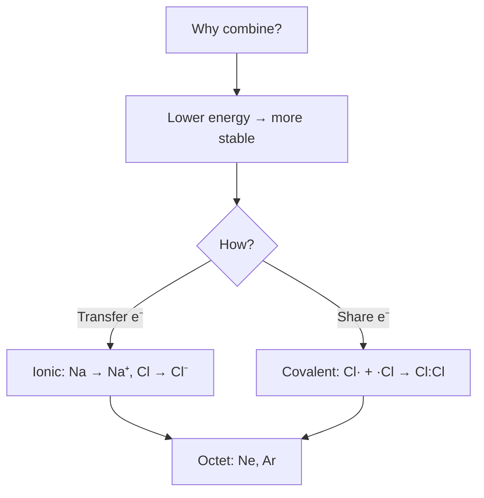
*Atoms combine only to lower their energy — by electron transfer (ionic) or electron sharing (covalent), always to reach a noble-gas octet.*

> **Note:** Octet is a bookkeeping rule, not a law. It works best for 2nd period.

## 2. Lewis symbols and Lewis structures (4.1.3)

Lewis dot structures show bonding pairs and lone pairs. Steps (NCERT):

1. Total valence e⁻ = sum of group valences. For anion add charge, cation subtract.
   * CH₄: C 4 + 4×H 1 = 8 e⁻
   * CO₃²⁻: C 4 + 3×O 6 + 2 (charge) = 24 e⁻
   * NH₄⁺: N 5 + 4×H 1 -1 = 8 e⁻
2. Least electronegative atom central (except H). Skeletal.
3. Distribute e⁻ as single bonds, then complete octet of terminals, then central, then multiple bonds if needed.
4. Each H gets duplet (2 e⁻).

Chemical structures drawn with Chem/ChemEdit (Obsidian renders SMILES, GitHub shows SVG):

| H₂O bent | NH₃ pyramidal | CH₄ tetrahedral | BF₃ trigonal planar |
|---|---|---|---|
|  |  |  |  |

| BeCl₂ linear | CO₂ linear | C₂H₂ ethyne linear | C₂H₄ ethene planar |
|---|---|---|---|
|  |  |  |  |

| Molecule | Total valence | Note |
|---|---:|---|
| BeH₂ | 4 | incomplete octet (4 e⁻ on Be) |
| BF₃ | 24 | incomplete (6 e⁻ on B) |
| PCl₅ | 40 | expanded (10 e⁻ on P) |
| SF₆ | 48 | expanded (12 e⁻ on S) |

## 3. Formal charge and its uses (4.1.4) 🅰

Formal charge = valence e⁻ in free atom - non-bonding e⁻ - ½ bonding e⁻.

$$ F.C. = V - L - \frac{1}{2}B $$

Use: most stable Lewis structure has smallest formal charges, negative charge on more electronegative atom.

O₃ example — central O: V=6, L=2, B=6 → F.C. = +1; double-bonded terminal O: V=6 L=4 B=4 → 0; single-bonded terminal O: V=6 L=6 B=2 → -1. Structure: ⁺¹O–O⁻¹ with double bond to other O. Actual molecule resonance hybrid.

| Species | Best structure by formal charge |
|---|---|
| CO | :C≡O: with C⁻¹, O⁺¹ is more stable than C=O, explains small dipole with C negative |
| NCO⁻ | N≡C–O⁻ best: negative on more EN O |
| SCN⁻ | S=C=N⁻ more stable than S–C≡N |

> **⚠ Trap:** Formal charge ≠ oxidation number ≠ real charge. Formal charge is for Lewis bookkeeping.

Structures with formal charges:

| O₃ ozone | CO | NO₃⁻ nitrate |
|---|---|---|
|  |  |  |

## 4. Limitations of octet rule — incomplete, odd, expanded (4.1.5)

| Type | Description | Examples |
|---|---|---|
| **Incomplete octet** | Central has <8 e⁻ | BeH₂ (4 e⁻), BH₃ (6 e⁻), BF₃ (6 e⁻), AlCl₃ (6 e⁻) — electron-deficient, Lewis acids |
| **Odd-electron** | Odd total valence → one atom has 7 e⁻ | NO (11 e⁻), NO₂ (17 e⁻) — paramagnetic, dimerise |
| **Expanded octet** | Central >8 e⁻, needs d-orbitals (3rd period onwards) | PCl₅ (10 e⁻), SF₆ (12 e⁻), H₂SO₄ (12 e⁻ around S), IF₇ (14 e⁻) |
| **Other failures** | Shape not explained, noble gas compounds | XeF₂, XeF₄ |

* AlCl₃ dimerises to Al₂Cl₆ to complete octet via coordinate bonds.
* Odd-electron NO₂ dimerises to N₂O₄.

---

# Part B — Ionic Bond

## 5. Ionic / electrovalent bond formation (4.2)

Ionic bond = complete transfer of e⁻ + electrostatic attraction. Formed between low IE metal + high EA non-metal.

Conditions favouring ionic (Allen 🅰):
* Low ionization enthalpy of cation (Group 1,2)
* High electron gain enthalpy of anion (Group 17)
* High lattice energy (small size, high charge)

Energy steps: M(g) → M⁺(g) + e⁻ (IE), X(g) + e⁻ → X⁻(g) (EA), M⁺(g) + X⁻(g) → MX(s) (Lattice enthalpy U).

## 6. Lattice enthalpy and Born-Haber cycle 🅰

**Lattice enthalpy U** = energy released when 1 mol gaseous ions form solid. ∝ (q⁺q⁻)/(r⁺+r⁻). Larger charge, smaller size → higher U → more stable ionic.

**Born-Haber cycle** for NaCl — Mermaid version (no ASCII):

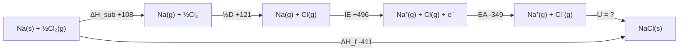
*The Born–Haber cycle: the lattice enthalpy is whatever closes the loop, so it can be measured without ever forming the crystal directly.*

Hess: ΔH_f = ΔH_sub + ½D + IE + EA + U → U = ΔH_f - (others) ≈ -787 kJ/mol

| Factor | Effect on U |
|---|---|
| ↑ charge | ↑ U (MgO > NaCl) |
| ↓ size | ↑ U (NaF > NaI) |
| More ions per formula | ↑ |

> **JEE Advanced:** Born-Haber used to calculate EA, lattice energy, or check feasibility.

## 7. Fajans' rules — polarisation and covalent character 🅰

Ionic bond has partial covalent character due to polarisation: cation distorts anion's electron cloud.

Fajans' rules — covalent character ↑ when:

| Rule | Reason | Example order |
|---|---:|---|
| **Small cation** | high polarising power ∝ charge/size² | Li⁺ > Na⁺ > K⁺, so LiCl more covalent than NaCl |
| **Large anion** | more polarisable | I⁻ > Br⁻ > Cl⁻ > F⁻, so LiI more covalent than LiF |
| **High charge on both** | more polarisation | Al³⁺ high → AlCl₃ covalent, Na⁺ low → NaCl ionic |
| **Cation with pseudo-noble gas config (ns²np⁶d¹⁰)** | more polarising than noble gas config | Cu⁺, Ag⁺ more covalent than Na⁺, K⁺; hence AgCl covalent-ish |

Polarising power = charge / (radius)². Polarizability ∝ size of anion.

Applications:
* **Solubility:** More covalent → less soluble in polar water, more in organic. AgF soluble (ionic), AgI insoluble (covalent).
* **Melting point:** More covalent → lower m.p. NaCl 800°C ionic, AlCl₃ 180°C covalent dimer.
* **Thermal stability of carbonates:** Small cation polarises CO₃²⁻ → decomposes easier. Li₂CO₃ decomposes, Na₂CO₃ stable. Order: Li₂CO₃ < Na₂CO₃ < K₂CO₃ < Rb₂CO₃ < Cs₂CO₃.
* **Order of covalent character:** LiF < LiCl < LiBr < LiI ; NaCl < MgCl₂ < AlCl₃ < SiCl₄ < PCl₅

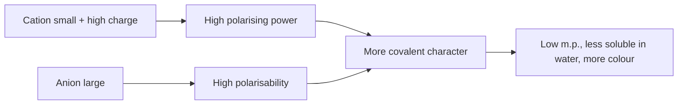
*Fajans' rules: polarisation converts an ionic solid into a covalent one, and the physical properties follow.*

## 8. Properties of ionic compounds

* Hard, brittle crystalline solids
* High m.p., b.p. due to high U
* Soluble in polar solvents (hydration energy > lattice)
* Conduct electricity in molten/aqueous (free ions), not solid
* Non-directional → no isomerism, high coordination numbers

---

# Part C — Bond Parameters and Resonance

## 9. Bond parameters — length, angle, enthalpy, order (4.3)

| Parameter | Definition | Trend |
|---|---|---|
| **Bond length** | Equilibrium distance between nuclei of bonded atoms | ∝ size, ∝ single > double > triple. C–C 154 pm, C=C 134 pm, C≡C 120 pm. |
| **Bond angle** | Angle between two bonds at central atom | Depends on hybridisation, lone pairs. CH₄ 109.5°, NH₃ 107°, H₂O 104.5° |
| **Bond enthalpy** | Energy needed to break 1 mol bonds in gas | ∝ bond order, ∝ 1/size. C–C 348, C=C 610, C≡C 840 kJ/mol |
| **Bond order** | Number of bonds between two atoms (Lewis) / (Nb-Na)/2 (MOT) | ↑ bond order → ↓ length, ↑ enthalpy, ↑ stability |

Factors:
* **Hybridisation:** More s% → shorter, stronger. sp (50% s) < sp² (33%) < sp³ (25%) length. Example C–H: sp 108 pm, sp² 110 pm, sp³ 112 pm.
* **Resonance:** Bond order averaged. In benzene C–C 139 pm between single/double.

| C₂H₂ sp 120 pm triple | C₂H₄ sp² 134 pm double | CH₄ sp³ 154 pm single |
|---|---|---|
|  |  |  |

## 10. Resonance (4.1)

When one Lewis structure cannot explain properties, multiple structures with same atomic positions but different electron distribution = resonating structures. Actual = resonance hybrid.

Conditions:
* Same positions of atoms, same number of paired/unpaired e⁻
* More covalent bonds, less charge separation, negative on electronegative = more stable contributor.

Examples:
* O₃: O=O⁺–O⁻ ↔ O⁻–O⁺=O
* CO₃²⁻: 3 structures with one C=O and two C–O⁻, bond order 1.33 each, all C–O 129 pm
* Benzene: 2 Kekulé structures, C–C bond order 1.5

| O₃ resonance | Benzene resonance | NO₃⁻ resonance |
|---|---|---|
|  |  |  |

> **⚠ Trap:** Resonance structures are not isomers, not in equilibrium. They are imaginary; hybrid is real.

---

# Part D — VSEPR Theory

## 11. VSEPR — basic postulates (4.4)

Valence Shell Electron Pair Repulsion — shape determined by repulsion between electron pairs in valence shell of central atom. Order: lp-lp > lp-bp > bp-bp.

Postulates:
1. Pairs arrange to minimize repulsion → max distance.
2. Lone pair occupies more space than bond pair → compresses angle.
3. Multiple bonds behave as one pair but more repulsive.
4. Electronegative substituents pull bond pair away → less repulsion.

## 12. VSEPR shapes table — AB₂ to AB₇

| Steric number (e⁻ pairs) | lp | Formula | Shape | Example | Bond angle |
|---:|---:|---|---|---|---|
| 2 | 0 | AB₂ | Linear | BeCl₂, CO₂, C₂H₂ | 180° |
| 3 | 0 | AB₃ | Trigonal planar | BF₃, BCl₃ | 120° |
| 3 | 1 | AB₂L | Bent / V | SO₂, O₃ | ~119° |
| 4 | 0 | AB₄ | Tetrahedral | CH₄, CCl₄, NH₄⁺ | 109.5° |
| 4 | 1 | AB₃L | Trigonal pyramidal | NH₃, PCl₃ | ~107° |
| 4 | 2 | AB₂L₂ | Bent | H₂O, OF₂ | ~104.5° |
| 5 | 0 | AB₅ | Trigonal bipyramidal | PCl₅ | 90°,120°,180° |
| 5 | 1 | AB₄L | See-saw | SF₄ | ~102°, 173° |
| 5 | 2 | AB₃L₂ | T-shaped | ClF₃ | 87.5° |
| 5 | 3 | AB₂L₃ | Linear | XeF₂ | 180° |
| 6 | 0 | AB₆ | Octahedral | SF₆ | 90°,180° |
| 6 | 1 | AB₅L | Square pyramidal | BrF₅ | ~84.8° |
| 6 | 2 | AB₄L₂ | Square planar | XeF₄ | 90° |
| 7 | 0 | AB₇ | Pentagonal bipyramidal | IF₇ | 72°,90° |

Chemical drawings for VSEPR shapes (ChemEdit editable SVGs):

| Linear 180° | Trigonal planar 120° | Tetrahedral 109.5° | TBP |
|---|---|---|---|
|  |  |  |  |

| See-saw | T-shaped | Linear XeF₂ | Octahedral |
|---|---|---|---|
|  |  |  |  |

| Square planar | Square pyramidal | Pentagonal bipyramidal | Bent |
|---|---|---|---|
|  |  |  |  |

Mermaid decision tree for VSEPR:

**Step 1 — count σ bonds + lone pairs to get the steric number (SN).**

**Step 2a — SN 2 to 4:**

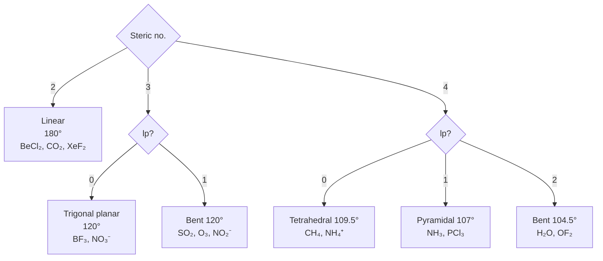
*Steric numbers 2–4: after counting, the number of lone pairs on the central atom is the only other thing you need.*

**Step 2b — SN 5 and 6 (lone pairs take equatorial positions first):**

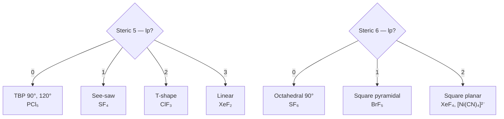
*Steric numbers 5 and 6: every lone pair sits equatorial, so the shape degrades one notch at a time from the parent polyhedron.*

## 13. Lone pair effects and distortions 🅰

* **NH₃ vs PH₃:** NH₃ 107° pyramidal, PH₃ 93.5° almost pure p — Drago's rule (see §18).
* **H₂O 104.5° < NH₃ 107° < CH₄ 109.5°** due to 2 lp vs 1 lp vs 0 lp.
* **ClF₃ T-shaped:** 2 lp equatorial in TBP to minimize lp-lp 120° repulsion. Lone pairs occupy equatorial positions in TBP.
* **SF₄ see-saw:** 1 lp equatorial.
* **XeF₂ linear:** 3 lp equatorial, 2 F axial.

> **⚠ VSEPR fails** for transition metals, for molecules with inactive lone pairs (heavy p-block).

---

# Part E — Valence Bond Theory and Hybridisation

## 14. Valence Bond Theory and orbital overlap (4.5)

VBT: bond formed by overlap of half-filled atomic orbitals with opposite spins, pairing electrons, lowering energy. Strength ∝ overlap.

Types of overlap — Mermaid:

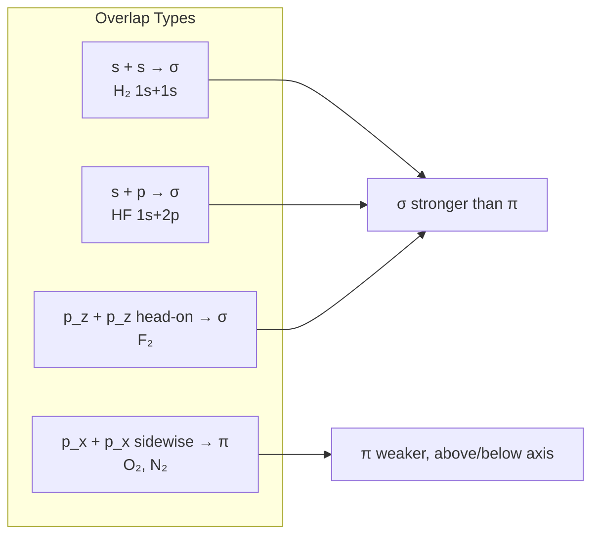
*Valence bond theory: which orbitals overlap, and why σ is always formed head-on and always beats π.*

* Strength: σ > π because overlap more.
* Multiple bonds: double = 1σ + 1π, triple = 1σ + 2π
* Limitations of VBT: cannot explain paramagnetism of O₂, delocalization → MOT.

## 15. Hybridisation — concept (4.6)

Hybridisation = mixing of atomic orbitals of same atom with similar energy to form new hybrid orbitals with same energy, oriented to minimize repulsion, better overlap.

Rules:
1. Only orbitals of central atom hybridise, not terminal.
2. Number of hybrids = number of atomic orbitals mixed.
3. Hybrid orbitals form only σ bonds, lone pairs occupy hybrids, π bonds use unhybridised p/d.
4. Type determines shape.

## 16. Types of hybridisation — sp to sp³d²

| Hybrid | Mixed orbitals | Steric no. | % s |
|---|---|---:|---:|
| sp | s + p | 2 | 50% |
| sp² | s + 2p | 3 | 33% |
| sp³ | s + 3p | 4 | 25% |
| sp³d | s + 3p + d(z²) | 5 | 20% |
| sp³d² | s + 3p + 2d(z², x²−y²) | 6 | 16.7% |
| sp³d³ | s + 3p + 3d | 7 | 14% |
| dsp² | (n−1)d + s + 2p | 4 | — |
| d²sp³ | (n−1)d² + s + 3p | 6 | — |

| Hybrid | Shape | Bond angle | Example |
|---|---|---|---|
| sp | Linear | 180° | BeCl₂, CO₂, C₂H₂, [Ag(NH₃)₂]⁺ |
| sp² | Trigonal planar | 120° | BF₃, C₂H₄, NO₃⁻, graphite |
| sp³ | Tetrahedral | 109.5° | CH₄, NH₃, H₂O, NH₄⁺ |
| sp³d | TBP | 90°, 120° | PCl₅, SF₄, ClF₃ |
| sp³d² | Octahedral | 90° | SF₆, [CrF₆]³⁻ |
| sp³d³ | Pentagonal bipyramidal | 72°, 90° | IF₇, XeF₆ |
| dsp² | Square planar | 90° | [Ni(CN)₄]²⁻, [PtCl₄]²⁻ |
| d²sp³ | Octahedral (inner orbital) | 90° | [Fe(CN)₆]³⁻, [Co(NH₃)₆]³⁺ |

For TBP sp³d: 3 equatorial bonds sp²-like (120°), 2 axial p-d (90°). Axial longer than equatorial due to more repulsion.

Mermaid for hybridisation progression:

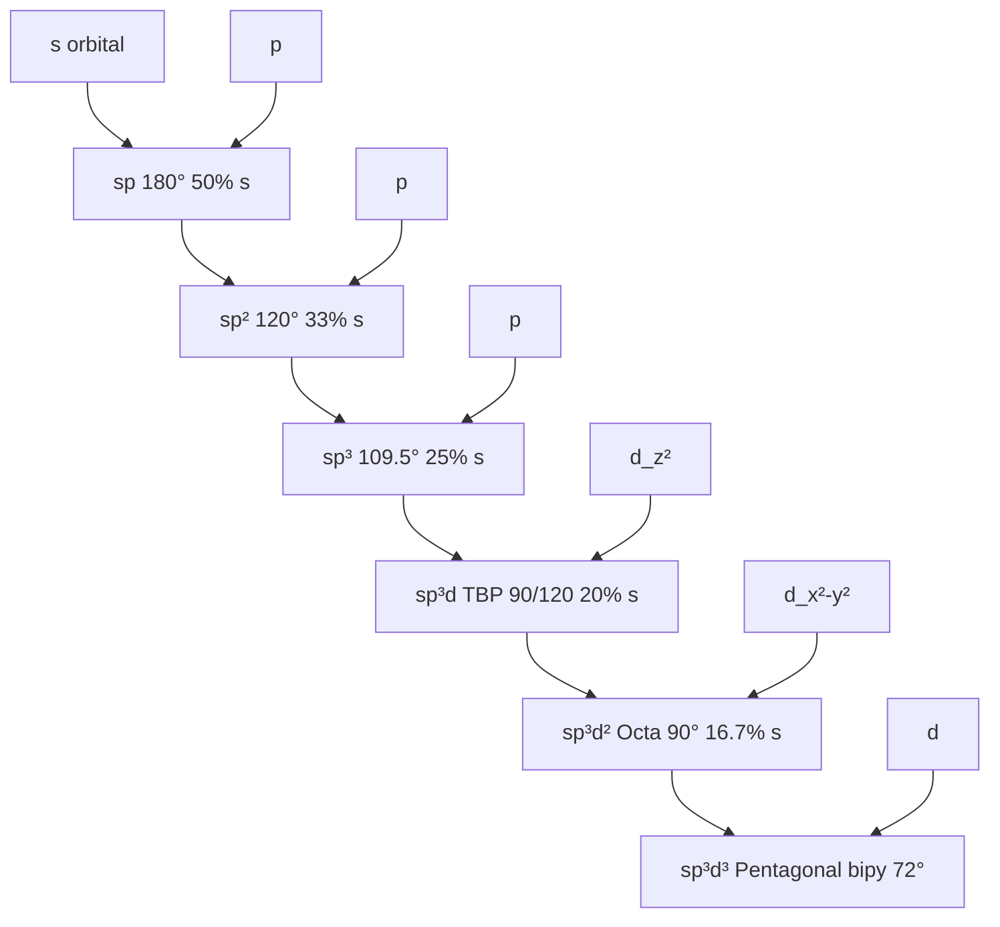
*Hybridisation and geometry: more s-character means a larger angle, from sp (180°) to sp³ (109.5°) and beyond.*

| sp linear 180° | sp² trigonal 120° | sp³ tetrahedral 109.5° | sp³d TBP |
|---|---|---|---|
|  |  |  |  |

## 17. Hybridisation vs VSEPR — how to predict quickly 🅰

**Fast method (Allen):**
1. Count steric number = σ bonds + lone pairs. σ bonds = atoms attached (multiple bond counts as 1)
2. Steric → hybridisation: 2→sp,3→sp²,4→sp³,5→sp³d,6→sp³d²,7→sp³d³
3. Lone pairs → shape via VSEPR.

Examples:
* H₂O: O 2 H +2 lp =4 → sp³, bent
* NH₃: N 3 H +1 lp =4 → sp³, pyramidal
* PCl₅: P 5 Cl +0 lp =5 → sp³d, TBP
* SF₆: S 6 F =6 → sp³d², octahedral
* XeF₄: Xe 4 F +2 lp =6 → sp³d², square planar

> **⚠ Common mistake:** Count π bonds as separate for hybridisation. Do not. Double bond = 1 σ for steric.

## 18. Drago's rule and Bent's rule 🅰 🆇

**Drago's rule 🅰:** For central atom from 3rd period onwards, with at least one lone pair, and with highly electropositive or low electronegativity substituents (H, alkyl), hybridisation is *not* required. Pure p orbitals used for bonding.

Conditions for Drago:
1. Central atom belongs to 3rd period or below (P, S, As, Sb...)
2. Central has at least one lone pair
3. Substituent electronegativity ≤ 2.5 (H, CH₃, etc.)

Effect: bond angle ~ 90° (pure p-p overlap), no hybridisation, low dipole.

| PH₃ Drago 93.5° | H₂S Drago 92° | NH₃ normal 107° sp³ | H₂O normal 104.5° sp³ |
|---|---|---|---|
|  |  |  |  |

Examples: PH₃ 93.5°, AsH₃ 91.8°, SbH₃ 91.3°, H₂S 92.1°, H₂Se 91°. But PF₃ 97.8° with hybridisation (F electronegative, so Drago fails) → sp³.

**Bent's rule 🅰 🆇:** More electronegative substituents prefer hybrid orbitals with *less* s-character, more p-character. Lone pairs prefer more s-character.

| Molecule | Bond angle | Explanation |
|---|---|---|
| `NH₃` 107° vs `PH₃` 93.5° | the 15° gap | Drago: PH₃ has no hybridisation, pure p orbitals |
| `H₂O` 104.5° vs `H₂S` 92° | the 12° gap | same reason, same pattern |
| `CH₂F₂` | F–C–F < H–C–H | Bent: F prefers a p-rich orbital, H an s-rich one |

---

# Part F — Molecular Orbital Theory

## 19. MOT — LCAO, bonding/antibonding (4.7)

MOT: atomic orbitals combine to form molecular orbitals delocalised over whole molecule. Electrons fill MOs by Aufbau.

LCAO: ψ_MO = ψ_A ± ψ_B

* ψ_bonding = ψ_A + ψ_B (constructive, electron density between nuclei, lower energy)
* ψ_antibonding = ψ_A - ψ_B (destructive, node between nuclei, higher energy, marked *)

Conditions for effective overlap:
1. Similar energy of AOs
2. Same symmetry (s with s, p_z with p_z for σ, p_x with p_x for π)
3. Proper orientation and sufficient overlap

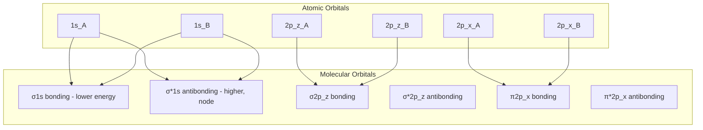
*LCAO in practice — combine the same-named AOs of two atoms into one lower bonding and one higher antibonding MO.*

## 20. Energy level diagrams and bond order (4.7)

Bond order = ½ (Nb - Na) where Nb = electrons in bonding MOs, Na = antibonding.

* Bond order 0 → unstable, no bond
* Higher bond order → shorter, stronger, higher dissociation energy
* Magnetic: all paired → diamagnetic, unpaired → paramagnetic

Mermaid for bond order concept:

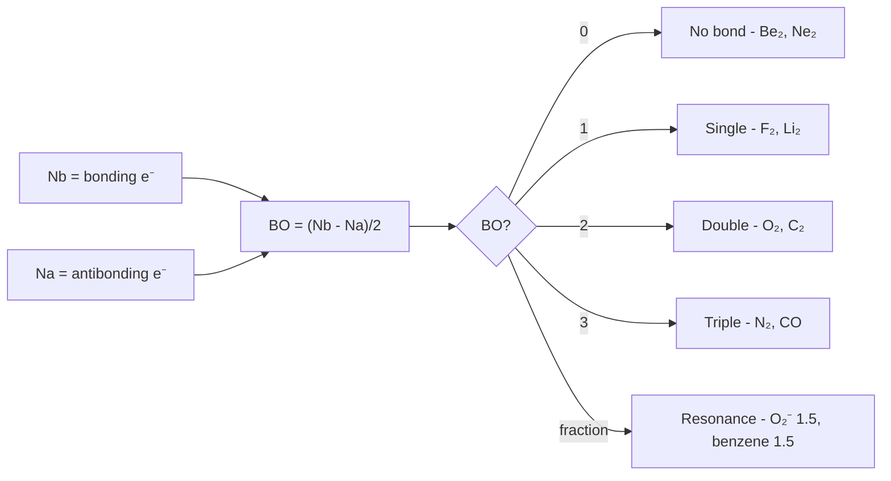
*Bond order from the electron count, and what it predicts: why He₂ and Ne₂ do not exist but Li₂ does.*

## 21. Homonuclear diatomics — B₂ to Ne₂ (4.8)

**For Li₂ to N₂ (with s-p mixing):** Order: σ1s < σ*1s < σ2s < σ*2s < π2p_x=π2p_y < σ2p_z < π* < σ*

**For O₂ to Ne₂ (no s-p mixing):** Order: σ1s < σ*1s < σ2s < σ*2s < σ2p_z < π2p_x=π2p_y < π* < σ*

Why flip? s-p mixing in B, C, N (2s and 2p close) pushes σ2p_z up.

Detailed MO diagrams — Mermaid:

**N₂ diagram (with s-p mixing, BO=3, diamagnetic):**

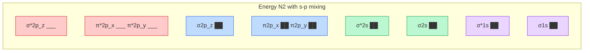
*O₂ MO diagram — the four electrons that make O₂ paramagnetic and give it a bond order of 2.*

10 valence e⁻: σ2s² σ*2s² π⁴ σ² → BO = (8-2)/2 =3

**O₂ diagram (no s-p mixing, BO=2, paramagnetic with 2 unpaired in π*):**

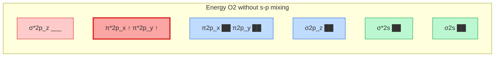
*F₂ MO diagram — the full 2p shell collapses the bond order to 1 and cancels the paramagnetism.*

12 valence e⁻: σ2s² σ*2s² σ2p_z² π⁴ π*² → BO = (8-4)/2=2, 2 unpaired in π* → paramagnetic

**B₂ diagram (BO=1, paramagnetic — VBT fails):**

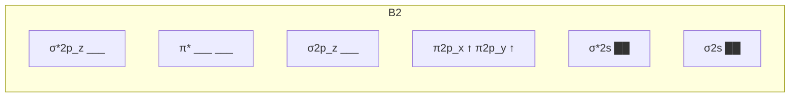
*B₂ MO diagram — the four π*2p electrons occupy degenerate π* orbitals, so B₂ is paramagnetic.*

6 valence e⁻: σ2s² σ*2s² π¹ π¹ → BO=1, 2 unpaired

**C₂ diagram (BO=2, diamagnetic, double bond both π):**

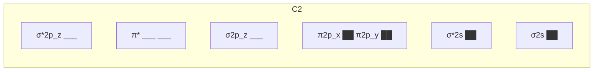
*C₂ and N₂ MO diagrams — the N₂ triple bond is the strongest single bond in the table.*

8 valence e⁻: σ2s² σ*2s² π⁴ → BO=2

Complete table:

| Species | Valence e⁻ | Config | Bond order | Magnetism | Bond length |
|---|---:|---|---|---|---|
| Li₂ | 2 | σ2s² | 1 | Diamag | 267 pm |
| Be₂ | 4 | σ2s² σ*2s² | 0 | — | does not exist |
| B₂ | 6 | σ2s² σ*2s² π¹ π¹ | 1 | **Paramag (2 unpaired)** — VBT fails | 159 pm |
| C₂ | 8 | σ2s² σ*2s² π⁴ | 2 | Diamag (both π) | 124 pm |
| N₂ | 10 | ... π⁴ σ² | 3 | Diamag, very strong | 110 pm |
| O₂ | 12 | ... σ² π⁴ π*² | 2 | **Paramag (2 unpaired in π*)** | 121 pm |
| F₂ | 14 | ... π*⁴ | 1 | Diamag | 141 pm |
| Ne₂ | 16 | ... σ*² | 0 | — | does not exist |

> **⚠ JEE trap:** Bond order alone not decides stability if antibonding many. F₂ BO1 weaker than O₂ BO2.

## 22. Heteronuclear MOT — CO, NO, HF, HCl 🅰

For AB molecules, AOs of different energies → MOs closer to more EN atom, unequal contribution.

Mermaid for heteronuclear:

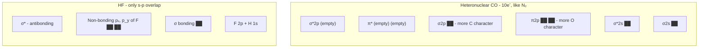
*Heteronuclear CO — more stable than N₂, with the bonding electrons pulled onto carbon, which is why CO is such a good σ-donor and π-acceptor ligand.*

| Species | e⁻ | Bond order | Magnetism | Note |
|---|---:|---:|---|---|
| CO | 10 | 3 | Diamag | Highest bond enthalpy, C negative due to HOMO on C |
| NO | 11 | 2.5 | Paramag (1 in π*) | 15 e⁻ isoelectronic with N₂ once the π* electron is counted out |
| NO⁺ | 10 | 3 | Diamag | Shorter than NO |
| CN⁻ | 10 | 3 | Diamag | Isoelectronic with N₂, CO |
| O₂⁺ | 11 | 2.5 | Paramag (1 unpaired) | Shorter than O₂ |
| O₂⁻ (superoxide) | 13 | 1.5 | Paramag | Longer than O₂ |
| O₂²⁻ (peroxide) | 14 | 1 | Diamag | Longest |

Bond length order: O₂⁺ < O₂ < O₂⁻ < O₂²⁻ (BO 2.5 >2 >1.5 >1)

| CO triple BO3 | NO BO2.5 radical | HF polar σ |
|---|---|---|
|  |  |  |

---

# Part G — Polarity and Intermolecular Forces

## 23. Dipole moment and % ionic character 🅰

Dipole moment μ = q × d (charge × distance). Vector. Unit Debye: 1 D = 3.336×10⁻³⁰ C·m.

* For diatomic AB: μ = δ × bond length
* % ionic character = (μ_observed / μ_theoretical ionic) ×100, μ_theoretical = e × d

Examples:
* HF: μ = 1.91 D, theoretical 100% ionic ~4.8 D → % ionic ~43%
* HCl: μ = 1.03 D, % ionic ~17%
* HBr: 0.78 D, % ionic ~12%

Mermaid for dipole cancellation:

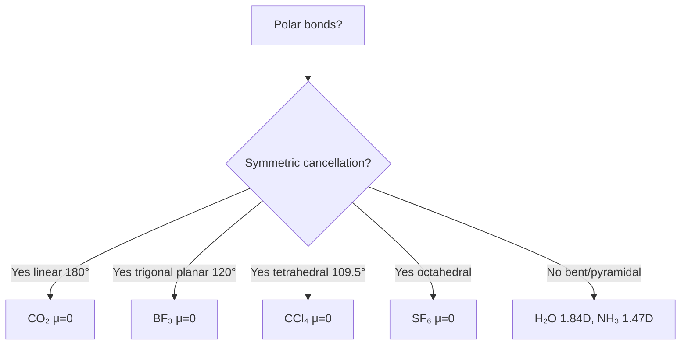
*A molecule has a dipole only if the bond dipoles do not cancel — check the symmetry before you calculate.*

Order: NH₃ (1.47) > NF₃ (0.24) because in NF₃, N–F dipoles oppose lone pair dipole.

| CO₂ μ=0 linear cancels | BF₃ μ=0 trigonal cancels | CCl₄ μ=0 tetrahedral cancels | H₂O μ=1.84D bent |
|---|---|---|---|
|  |  |  |  |

## 24. Back bonding 🅰 🆇

Back bonding = donation of electron pair from filled orbital of one atom to vacant orbital of another, *in addition* to σ bond, forming partial π bond, strengthening, shortening.

Types:

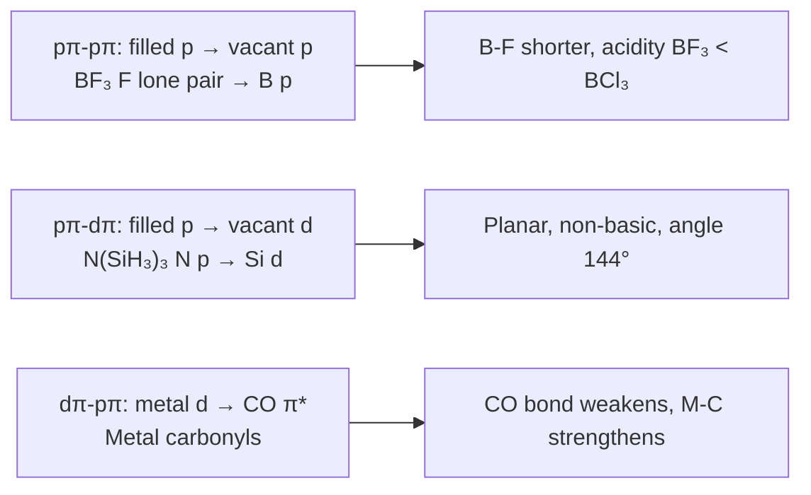
*Back bonding: pπ–pπ, pπ–dπ and dπ–pπ donation, and how it shortens bonds while lowering basicity.*

| BF₃ pπ-pπ back bonding | BCl₃ no strong back bonding | NMe₃ pyramidal basic | N(SiH₃)₃ planar non-basic pπ-dπ |
|---|---|---|---|
|  |  |  |  |

| Molecule | Back bonding | Effect |
|---|---|---|
| BF₃ | F lp → B vacant p | B–F shorter, BF₃ less acidic than BCl₃ |
| N(SiH₃)₃ | N lp → Si d | Planar, N not basic, sp² |
| N(CH₃)₃ | No back bonding | Pyramidal, basic, sp³ |
| O(SiH₃)₂ | O lp → Si d | Angle 144° (wider than H₂O 104°) |

## 25. Hydrogen bonding (4.9)

H-bond = electrostatic attraction between H attached to highly electronegative atom (F,O,N) and lone pair of another F,O,N.

Conditions: H bonded to F/O/N (high EN, small size) → H δ⁺, and acceptor with lone pair.

Strength: 10-40 kJ/mol (vs covalent ~400, van der Waals ~1-10). Strongest: F–H⋯F.

Mermaid for H-bonding effects:

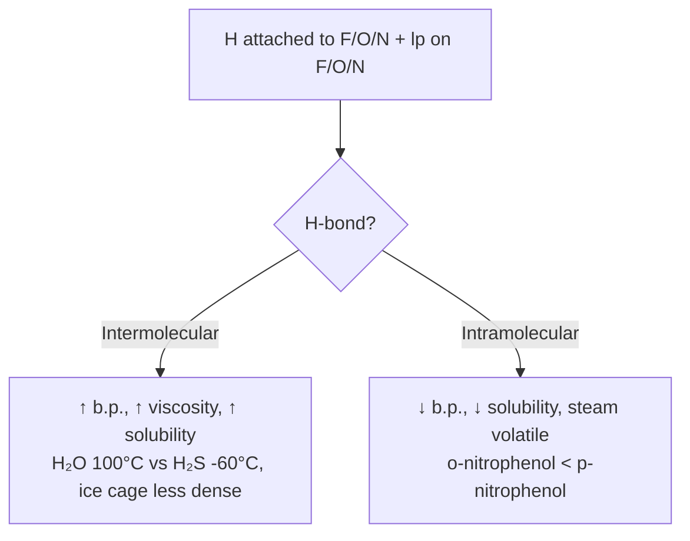
*Hydrogen bonding raises boiling point, viscosity and solubility in the donor, and the classic o-/p-nitrophenol contrast.*

Types:
* **Intermolecular:** H₂O, HF, NH₃, ROH, RCOOH — H₂O highest b.p. among Group 16 hydrides due to H-bonding
* **Intramolecular:** o-nitrophenol, o-hydroxybenzaldehyde, acetylacetone enol form — steam volatile, less soluble

| Property | H-bonding effect |
|---|---|
| Boiling point | ↑ for intermolecular (H₂O > H₂S) |
| Melting point | ↑ |
| Solubility | Polar solutes with H-bonding soluble in water (alcohol, sugar) |
| Viscosity | ↑ (glycerol) |
| Density | Ice open cage → density water > ice |

## 26. van der Waals forces and other secondary bonds 🅰

| Force | Origin | Strength | Distance dependence |
|---|---|---|---|
| London dispersion | Instantaneous dipole-induced dipole | 0.05-40 kJ/mol | 1/r⁶, all molecules |
| Dipole-dipole | Permanent dipole-permanent dipole | 5-25 kJ/mol | 1/r³, polar molecules |
| Dipole-induced dipole | Permanent dipole induces in non-polar | 2-10 kJ/mol | 1/r⁶, and it is what makes a non-polar solute dissolve in a polar solvent |
| Ion-dipole | Ion + polar molecule | 40-600 kJ/mol | Hydration, solubility |

* Boiling point trend in noble gases ↑ down group due to ↑ London forces (size ↑).
* Boiling point of alkanes ↑ with molecular mass.

---

# Part H — Problem Solving and Revision

## 27. Worked problem patterns — Allen style 🅰

**Pattern 1 — Formal charge best structure:**
Q: Which is best Lewis for NCO⁻? A: N≡C–O⁻ (charges: N 0, C 0, O -1) has negative on more EN O → more stable.

**Pattern 2 — Fajans:**
Q: Order covalent character: NaF, NaCl, NaBr, NaI. A: Small cation same, anion size ↑ → covalent ↑: NaF < NaCl < NaBr < NaI.
Q: MgCl₂ vs AlCl₃ vs SiCl₄ vs PCl₅ melting point? A: Charge ↑ → covalent ↑ → m.p. ↓: NaCl 801°C > MgCl₂ 714°C > AlCl₃ 180°C > SiCl₄ -70°C

**Pattern 3 — VSEPR shape:**
Q: Shape of XeF₂, XeF₄, XeF₆? A: Steric 5 with 3 lp → linear, steric 6 with 2 lp → square planar, steric 7 with 1 lp → distorted octahedral.

**Pattern 4 — Hybridisation with lone pairs:**
Q: Hybridisation of I in IF₇, IF₅, ICl₄⁻? A: IF₇ steric 7 → sp³d³, IF₅ steric 6 → sp³d², ICl₄⁻ steric 6 (4 bond +2 lp) → sp³d² square planar.

**Pattern 5 — MOT bond order:**
Q: Order bond length: O₂, O₂⁺, O₂⁻, O₂²⁻? A: Bond order: O₂⁺ 2.5 < O₂ 2 < O₂⁻ 1.5 < O₂²⁻ 1. So length reverse: O₂⁺ < O₂ < O₂⁻ < O₂²⁻.
Q: Which is paramagnetic: B₂, C₂, N₂, O₂, F₂? A: B₂ (2 unpaired), O₂ (2 unpaired).

**Pattern 6 — Dipole moment zero?**
Q: Which have μ=0: CO₂, BF₃, CCl₄, CHCl₃, NH₃, NF₃, H₂O, p-dichlorobenzene? A: CO₂, BF₃, CCl₄, p-dichlorobenzene (symmetric cancellation).

**Pattern 7 — Back bonding acidity:**
Q: Lewis acidity order BF₃, BCl₃, BBr₃, BI₃? A: BF₃ < BCl₃ < BBr₃ < BI₃ due to decreasing pπ-pπ back bonding.

**Pattern 8 — Drago:**
Q: Bond angle in PH₃ vs NH₃? A: PH₃ ~93°, no hybridisation (Drago), NH₃ 107° sp³.

## 28. JEE traps and must-remember orders ⚠

> **⚠ Trap 1:** Formal charge ≠ oxidation number. In CO, formal charges C⁻¹ O⁺¹ but oxidation numbers C⁺² O⁻².

> **⚠ Trap 2:** VSEPR counts double/triple as one steric unit. C₂H₄: each C steric 3 (2 H +1 C) → sp², not sp³.

> **⚠ Trap 3:** Hybridisation of terminal atoms not considered. In PCl₅, P sp³d, Cl not hybridised.

> **⚠ Trap 4:** O₂ paramagnetic — VBT says diamagnetic, MOT says paramagnetic. Experimental proves MOT.

> **⚠ Trap 5:** BF₃ μ=0 but B–F polar. Cancellation due to trigonal planar.

> **⚠ Trap 6:** Fajans: small cation + large anion = more covalent, not more ionic.

> **⚠ Trap 7:** Back bonding reduces Lewis acidity: BF₃ weakest, not strongest.

> **⚠ Trap 8:** H-bond strength: F–H⋯F strongest, but HF b.p. 19.5°C < H₂O 100°C because H₂O has 2 H-bonds per molecule vs HF 1.

Must-remember orders:

| Property | Order | Why |
|---|---|---|
| **Bond length** | C–C > C=C > C≡C | single longest — more shared pairs pull the nuclei together |
| **Bond enthalpy** | C≡C > C=C > C–C | triple strongest — more s-character, shorter and stronger σ overlap |
| **Ionic character** | HF > HCl > HBr > HI | ΔEN falls down the group; Fajans: bigger anion + small cation = more polarisation |
| **Dipole moment** | `NH₃` > `NF₃`; `CH₃Cl` > `CH₂Cl₂` > `CHCl₃` > `CCl₄` (0) | bond dipoles cancel as substitution rises; in NH₃ they reinforce |
| **Covalent character** | `LiF` < `LiCl` < `LiBr` < `LiI`; `NaCl` < `MgCl₂` < `AlCl₃` | ΔEN falls down the group, charge/radius falls across a period |
| **Thermal stability of hydrides** | `NH₃` > `PH₃` > `AsH₃` > `SbH₃` > `BiH₃` | E–H bond enthalpy falls, but ΔH(atomisation) falls faster |
| **Bond angle** | `CH₄` 109.5° > `NH₃` 107° > `H₂O` 104.5°; `H₂O` > `H₂S` > `H₂Se` | one lone pair squeezes harder than two; more s-character = larger angle |
| **Lewis acidity** | `BF₃` < `BCl₃` < `BBr₃` < `BI₃`; `BH₃` > `BF₃` | back bonding falls as F size grows; π donation beats σ withdrawal |
| **Basicity** | `NMe₃` > `NH₃` > `N(SiH₃)₃` | back bonding into the Si 3d sink drains the lone pair |
| **MOT bond order** | `N₂` 3 > `O₂` 2 > `B₂` 1 > `Be₂` 0 | antibonding π* fills first, as the atoms get larger |
| **Melting point** | `NaCl` > `MgCl₂` > `AlCl₃` > `SiCl₄` | ionic lattice energy falls, covalent character rises |
| **H-bond boiling point** | `H₂O` > `HF` > `NH₃` | stronger H-bonding needs more electronegative **and** more donors |

## 29. Quick Revision Sheet

- Kossel-Lewis: octet = ns²np⁶, Lewis dots = valence e⁻.
- Formal charge = V - L - B/2; best structure minimal charges, negative on EN atom.
- Octet exceptions: incomplete (BeH₂, BF₃), odd (NO, NO₂), expanded (PCl₅, SF₆, IF₇).
- Ionic bond: low IE + high EA + high U. Lattice U ∝ q⁺q⁻/r.
- Born-Haber: ΔH_f = ΔH_sub + ½D + IE + EA + U.
- Fajans: covalent ↑ with small cation, large anion, high charge, pseudo-noble gas config (Cu⁺, Ag⁺).
- Bond parameters: length ∝ 1/order, enthalpy ∝ order, angle depends on hybridisation + lp.
- Resonance: same atoms, different e⁻ distribution; hybrid more stable; bond lengths averaged.
- VSEPR: lp-lp > lp-bp > bp-bp; steric = σ + lp; shapes 2 linear to 7 pentagonal bipyramidal; lp equatorial in TBP.
- VBT: overlap s-s, s-p, p-p head-on σ, sidewise π; σ stronger; double =1σ+1π, triple=1σ+2π.
- Hybridisation: sp 180° 50% s, sp² 120° 33% s, sp³ 109.5° 25% s, sp³d TBP 90/120 20% s, sp³d² octahedral 90° 16.7% s, sp³d³ pentagonal bipyramidal 72°.
- Fast: steric = atoms attached (multiple counts 1) + lp; 2→sp,3→sp²,4→sp³,5→sp³d,6→sp³d²,7→sp³d³.
- Drago: 3rd period+ central with lp + EN ≤2.5 → no hybridisation, angle ~90°: PH₃ 93.5°, H₂S 92°.
- Bent: EN substituents prefer p-rich orbitals; lp prefers s-rich.
- MOT: LCAO ψ± = ψ_A ± ψ_B; bonding lower, antibonding higher with node.
- Energy order: B₂,C₂,N₂ with s-p mixing: σ1s<σ*1s<σ2s<σ*2s<π<σ<π*<σ*; O₂,F₂: σ2p_z<π.
- Bond order =½(Nb-Na); magnetism: unpaired→paramag; higher BO→shorter.
- Homonuclear: Li₂ BO1, Be₂ 0 (no), B₂ 1 paramag 2 unpaired, C₂ 2 diamag, N₂ 3 diamag very strong, O₂ 2 paramag 2 unpaired, F₂ 1 diamag, Ne₂ 0.
- Heteronuclear: CO,CN⁻,NO⁺ 10e⁻ BO3; NO 11e⁻ BO2.5 paramag; O₂⁺ 2.5, O₂⁻ 1.5, O₂²⁻ 1.
- Dipole μ=q×d, vector sum; μ=0 symmetric: CO₂,BF₃,CCl₄,p-dichlorobenzene,XeF₄. NH₃ 1.47D > NF₃ 0.24D.
- % ionic = μ_obs/(e×d)×100.
- Back bonding: pπ-pπ (B–F), pπ-dπ (N–Si), dπ-pπ (metal-CO). Effects: shorter bond, wider angle, reduced basicity/acidity. BF₃<BCl₃<BBr₃ acidity; N(SiH₃)₃ planar non-basic vs NMe₃ pyramidal basic.
- H-bond: H attached to F/O/N + lp on F/O/N; 10-40 kJ/mol; inter ↑ b.p., intra ↓ b.p., steam volatile. Ice open cage less dense than water.
- van der Waals: London dispersion (all, 1/r⁶), dipole-dipole, dipole-induced, ion-dipole.

---

*Cross-links:* [Classification & Periodicity](../01-Classification-of-Elements-and-Periodicity-in-Properties/notes.md) — IE/EA/EN trends behind Fajans and Born-Haber; [Equilibrium](../../Physical-Chemistry/04-Equilibrium/notes.md) — lattice vs hydration decides solubility; [Coordination Compounds](../08-Coordination-Compounds/notes.md) — hybridisation dsp²/d²sp³, VBT vs CFT, back bonding in carbonyls; [Structure gallery](figures/structures.md) — all SMILES drawings editable with Chem/ChemEdit.

