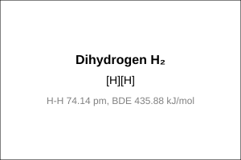
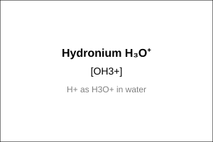
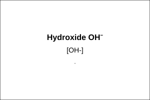

# Hydrogen — structure source

This table is the **single source** for every structure drawing in [`../notes.md`](../notes.md).
Edit a row, then regenerate:

```bash
python scripts/render_structures.py Inorganic-Chemistry/03-Hydrogen/figures/structures.md
```

That rewrites `mol/<ID>.svg` (one Ketcher SVG per row: plain image on GitHub, and double-click-editable in Obsidian with **ChemEdit**), the gallery below, and the `smiles` block at bottom (live grid with **Chem** plugin). Column meanings in script docstring; rulebook R18–R19.

> **Edited a structure in Ketcher?** Right-click drawing → *Copy SMILES*, paste into table here, rerun.

| Label | SMILES | ID | O.S. | Check | Note |
|---|---|---|---|---|---|
| Water H₂O | O | h2o | auto | O=-2 | bent 104.5°, O-H 95.7 pm |
| Heavy water D₂O | [2H]O[2H] | d2o | auto | O=-2 | moderator, same bent |
| Hydrogen peroxide H₂O₂ | OO | h2o2 | auto | O=-1 | open book, dihedral 111.5° gas, 90.2° solid, O-O 148 pm |
| Dihydrogen H₂ | [H][H] | h2 | - | - | H-H 74.14 pm, BDE 435.88 kJ/mol |
| Hydronium H₃O⁺ | [OH3+] | h3o | auto | O=-2 | H+ as H3O+ in water |
| Hydroxide OH⁻ | [OH-] | oh | auto | O=-2 | - |

<!-- gallery:begin -->
| ID | Structure | Label |
|---|---|---|
| h2o |  | Water H₂O |
| d2o |  | Heavy water D₂O |
| h2o2 |  | Hydrogen peroxide H₂O₂ |
| h2 |  | Dihydrogen H₂ |
| h3o |  | Hydronium H₃O⁺ |
| oh |  | Hydroxide OH⁻ |
<!-- gallery:end -->

<!-- smiles:begin -->
```smiles
O h2o Water H₂O
[2H]O[2H] d2o Heavy water D₂O
OO h2o2 Hydrogen peroxide H₂O₂
[H][H] h2 Dihydrogen H₂
[OH3+] h3o Hydronium H₃O⁺
[OH-] oh Hydroxide OH⁻
```
<!-- smiles:end -->
