# Hydrogen — JEE Advanced Notes

> **Sources merged into these notes**
> | Source | File |
> |---|---|
> | NCERT Class XI Chemistry (pre-rationalised 2018-19), Unit 9 | [`kech202-legacy.pdf`](kech202-legacy.pdf) |
> | Allen — Hydrogen & Its Compounds module (Enthusiast, English) | [`Hydrogen _ Its Compounds_Theory_26.pdf`](Hydrogen%20_%20Its%20Compounds_Theory_26.pdf) |
>
> 🅰 = Allen-only content; 🆇 = extra JEE-Advanced bridging point; ⚠ = trap.

## Contents

- [Part A — Position, Isotopes & Forms of Hydrogen](#part-a--position-isotopes--forms-of-hydrogen)
  1. [Position of Hydrogen in Periodic Table (9.1)](#1-position-of-hydrogen-in-periodic-table-91)
  2. [Isotopes of Hydrogen (9.2.2)](#2-isotopes-of-hydrogen-922)
  3. [Different Forms of Hydrogen — Allen Classification](#3-different-forms-of-hydrogen--allen-classification)
- [Part B — Dihydrogen Preparation, Properties & Uses](#part-b--dihydrogen-preparation-properties--uses)
  4. [Occurrence of Dihydrogen (9.2.1)](#4-occurrence-of-dihydrogen-921)
  5. [Laboratory Preparation (9.3.1)](#5-laboratory-preparation-931)
  6. [Commercial Production & Syngas (9.3.2)](#6-commercial-production--syngas-932)
  7. [Physical & Chemical Properties (9.4)](#7-physical--chemical-properties-94)
  8. [Uses of Dihydrogen (9.4.3)](#8-uses-of-dihydrogen-943)
- [Part C — Hydrides](#part-c--hydrides)
  9. [Classification of Hydrides (9.5)](#9-classification-of-hydrides-95)
  10. [Ionic / Saline Hydrides (9.5.1)](#10-ionic--saline-hydrides-951)
  11. [Covalent / Molecular Hydrides (9.5.2)](#11-covalent--molecular-hydrides-952)
  12. [Metallic / Interstitial Hydrides (9.5.3)](#12-metallic--interstitial-hydrides-953)
- [Part D — Water, Hardness, Heavy Water & Peroxide](#part-d--water-hardness-heavy-water--peroxide)
  13. [Water — Occurrence & Physical Properties (9.6)](#13-water--occurrence--physical-properties-96)
  14. [Structure of Water & Ice (9.6)](#14-structure-of-water--ice-96)
  15. [Chemical Properties of Water (9.6)](#15-chemical-properties-of-water-96)
  16. [Hard & Soft Water — Types & Softening (9.6)](#16-hard--soft-water--types--softening-96)
  17. [Heavy Water D₂O (9.7)](#17-heavy-water-d₂o-97)
  18. [Hydrogen Peroxide H₂O₂ (9.8) — Structure & Properties](#18-hydrogen-peroxide-h₂o₂-98--structure--properties)
  19. [Dihydrogen as Fuel & Hydrogen Economy (9.9)](#19-dihydrogen-as-fuel--hydrogen-economy-99)
  20. [Quick Revision Sheet](#20-quick-revision-sheet)

---

# Part A — Position, Isotopes & Forms of Hydrogen

## 1. Position of Hydrogen in Periodic Table (9.1)

Answer-first: Hydrogen is unique — 1s¹ configuration resembles both alkali metals (ns¹) and halogens (ns²np⁵ one short of noble gas), but H⁺ is ~1.5×10⁻³ pm vs normal atomic/ionic 50–200 pm, never exists free, always associated. Best placed **separately** at top of periodic table, not in Group 1 or 17.

| Resembles alkali metals (Group 1) | Resembles halogens (Group 17) | Differs from both |
|---|---|---|
| 1s¹ vs ns¹, forms H⁺, forms oxides/halides/sulphides, unipositive ion | 1 short of He (1s²), forms H⁻, diatomic molecule H₂, forms hydrides + many covalent compounds, high IE | Very high IE (H 1312, Li 520, F 1680 kJ/mol), non-metallic under normal conditions, low reactivity vs halogens, tiny H⁺ |

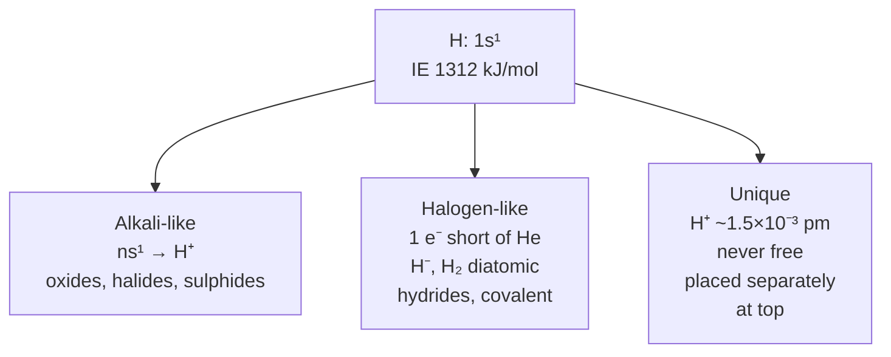
*Hydrogen resembles both groups but H⁺ size forces separate placement.*

> **⚠ Trap:** Do not place H in Group 1 in exams asking position. Answer: separately at top, though sometimes shown above Group 1 for convenience.

## 2. Isotopes of Hydrogen (9.2.2)

Three isotopes differ in neutrons, same electronic config → almost same chemical properties, rates differ due to bond dissociation enthalpy, physical properties differ considerably due to mass.

| Property | Protium ¹H | Deuterium D (²H) | Tritium T (³H) |
|---|---|---|---|
| Abundance % | 99.985 | 0.0156 | 10⁻¹⁵ |
| Atomic mass g/mol | 1.008 | 2.014 | 3.016 |
| Neutrons | 0 | 1 | 2 |
| m.p. K | 13.96 | 18.73 | 20.62 |
| b.p. K | 20.39 | 23.67 | 25.0 |
| Density g/L | 0.09 | 0.18 | 0.27 |
| ΔH_fus kJ/mol | 0.117 | 0.197 | — |
| ΔH_vap kJ/mol | 0.904 | 1.226 | — |
| Bond dissociation kJ/mol at 298K | 435.88 | 443.35 | — |
| Internuclear distance pm | 74.14 | 74.14 | — |
| Ionization enthalpy kJ/mol | 1312 | — | — |
| Electron gain enthalpy kJ/mol | -73 | — | — |
| Radioactivity | stable | stable | β⁻ emitter, t½ 12.33 yr |

- Terrestrial H contains 0.0156% D mostly as HD; tritium ~1 atom per 10¹⁸ protium.
- Harold C. Urey (1934 Nobel) separated D by physical methods.

🅰 **Allen extra:** Enthalpy of bond dissociation difference → kinetic isotope effect: D reacts slower than H.

## 3. Different Forms of Hydrogen — Allen Classification

### (a) Based on oxidation number

| Form | Symbol | e⁻ count | O.N. | Formation |
|---|---|---|---:|---|
| Proton | H⁺ | 0 | +1 | $\ce{H -> H+ + e-}$ |
| Hydride | H⁻ | 2 | -1 | $\ce{H + e- -> H-}$ |
| Atomic hydrogen | H• | 1 | 0 | $\ce{H2 -> 2H}$ |

- In aqueous state H⁺ exists as $\ce{H+(H2O)n}$; n=1 → $\ce{H3O+}$, n=2 → $\ce{H5O2+}$ etc.

### (b) Based on reactivity — 🅰

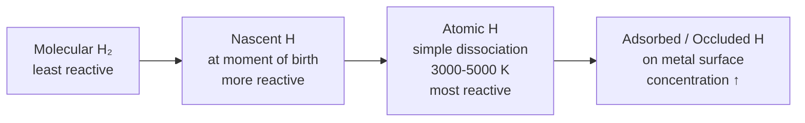
*Four forms of hydrogen in order of reactivity — molecular, adsorbed, nascent and atomic.*

| Type | How formed | Example |
|---|---|---|
| Simple atomic H | Thermal dissociation $\ce{H2 -> 2H}$ at 3000–5000 K, low P, high T favours | Electric arc |
| Nascent H | At instant of chemical reaction | $\ce{Zn + H2SO4 -> ZnSO4 + 2H}$ (nascent) ; $\ce{2NaOH + Be -> Na2BeO2 + 2H}$ ; $\ce{C2H5OH + Na -> C2H5ONa + H}$ |
| Adsorbed/Occluded | H on outer surface of metal / inside metal lattice | Pd adsorbs large volume; property called **occlusion** |

**Reactivity order:** $\ce{Atomic H > Nascent H > Molecular H2}$

### (c) Based on nuclear spin — Nuclear isomers 🅰

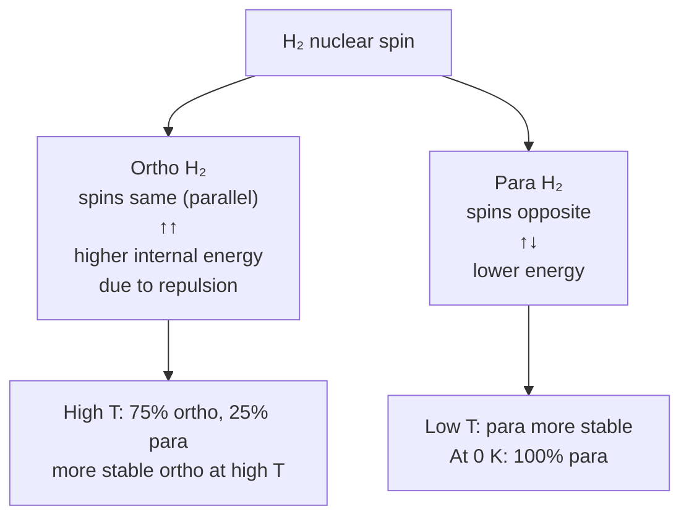
*Ortho and para H₂ differ only in nuclear spin, and the ratio shifts with temperature.*

- At absolute zero: 0% ortho, 100% para. At high T: 75% ortho, 25% para.
- 🅰 **Important:** 100% para can be obtained at low T, but 100% ortho cannot be obtained because at high T para dissociates to atomic H.
- Ortho & para differ only in **physical** properties, chemical same.

---

# Part B — Dihydrogen Preparation, Properties & Uses

## 4. Occurrence of Dihydrogen (9.2.1)

- Most abundant element in universe (70% total mass), principal in solar atmosphere; Jupiter & Saturn mostly H₂.
- Earth atmosphere 0.15% by mass (light nature escapes); combined form 15.4% of crust + oceans; in water, plant/animal tissues, carbohydrates, proteins, hydrocarbons.

## 5. Laboratory Preparation (9.3.1)

$\ce{Zn + 2H+ -> Zn^{2+} + H2}$ — granulated Zn + dil HCl (usual lab).

$\ce{Zn + 2NaOH -> Na2ZnO2 + H2}$ — Zn + aq alkali, sodium zincate formed.

- High purity H₂ via Zn + dil H₂SO₄, but HCl preferred to avoid side reactions.

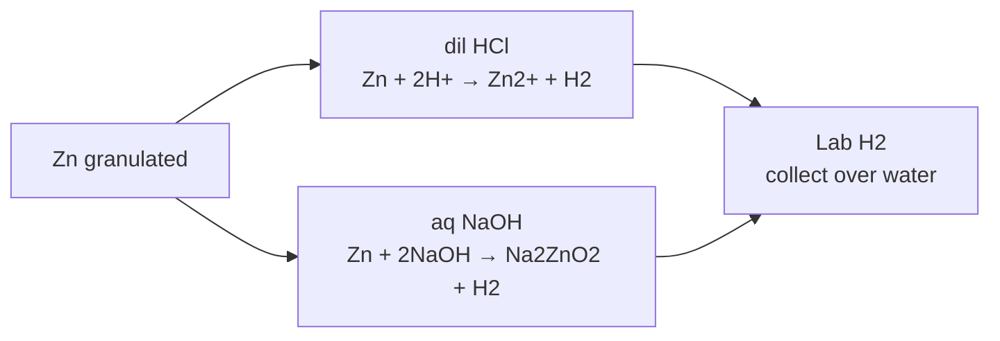
*Lab methods: acid route and alkali route both give H₂.*

## 6. Commercial Production & Syngas (9.3.2)

### (i) Electrolysis of acidified water

$\ce{2H2O(l) ->[Electrolysis][traces acid/base] 2H2(g) + O2(g)}$ — Pt electrodes.

High purity >99.95% H₂ by electrolysing warm aq $\ce{Ba(OH)2}$ between Ni electrodes.

### (ii) Byproduct of brine electrolysis (chlor-alkali)

At anode: $\ce{2Cl- -> Cl2 + 2e-}$

At cathode: $\ce{2H2O + 2e- -> H2 + 2OH-}$

Overall: $\ce{2Na+ + 2Cl- + 2H2O -> Cl2 + H2 + 2Na+ + 2OH-}$

### (iii) From hydrocarbons / coke — syngas

$\ce{CnH2n+2 + nH2O ->[1270 K][Ni] nCO + (2n+1)H2}$

$\ce{CH4 + H2O ->[1270 K][Ni] CO + 3H2}$

$\ce{C + H2O ->[1270 K] CO + H2}$ — coal gasification, mixture $\ce{CO + H2}$ = **water gas**, also called **syngas** (synthesis gas) used for methanol + hydrocarbons.

Nowadays syngas from sewage, sawdust, scrap wood, newspapers.

**Water-gas shift / Bosch process** to increase H₂:

$\ce{CO + H2O ->[673 K][Fe2O3/Cr2O3] CO2 + H2}$

$\ce{CO2}$ removed by scrubbing with sodium arsenite solution.

- Present industrial share: ~77% from petrochemicals, 18% coal, 4% electrolysis, 1% other.

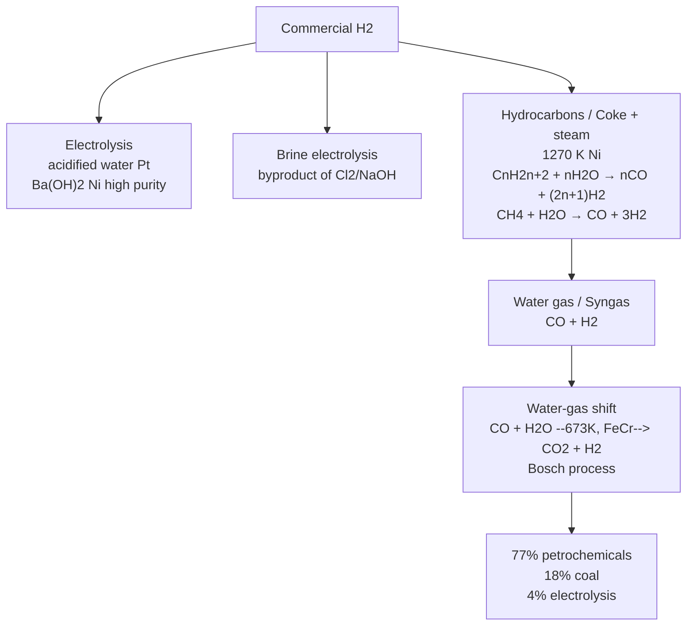
*Commercial routes: electrolysis, brine byproduct, and hydrocarbon reforming to syngas then shift.*

## 7. Physical & Chemical Properties (9.4)

**Physical:** colourless, odourless, tasteless, combustible, lighter than air, insoluble in water; properties table in §2.

**Chemical:** Determined by high H–H bond dissociation enthalpy (highest single bond). Dissociation ~0.081% at 2000 K, 95.5% at 5000 K. Relatively inert at room T; atomic H produced at high T in electric arc or UV.

Reacts by: (i) loss of e⁻ → H⁺, (ii) gain → H⁻, (iii) sharing → covalent bond.

### Reactions

$\ce{H2 + X2 -> 2HX}$ (X = F, Cl, Br, I) — with F₂ even in dark, with I₂ needs catalyst.

$\ce{2H2 + O2 ->[catalyst/heating] 2H2O}$ $\Delta H° = -285.9$ kJ/mol — highly exothermic.

$\ce{3H2 + N2 ->[673 K, 200 atm][Fe] 2NH3}$ $\Delta H° = -92.6$ kJ/mol — Haber process.

$\ce{H2 + 2M -> 2MH}$ (M = alkali metal, high T) — hydrides.

$\ce{H2 + Pd^{2+} -> Pd + 2H+}$ — reduces metal ions.

$\ce{yH2 + MxOy -> xM + yH2O}$ — reduces less active metal oxides.

Hydrogenation: vegetable oils + H₂ / Ni → edible fats (margarine, vanaspati).

Hydroformylation: $\ce{H2 + CO + RCH=CH2 -> RCH2CH2CHO}$ then $\ce{H2 + RCH2CH2CHO -> RCH2CH2CH2OH}$.

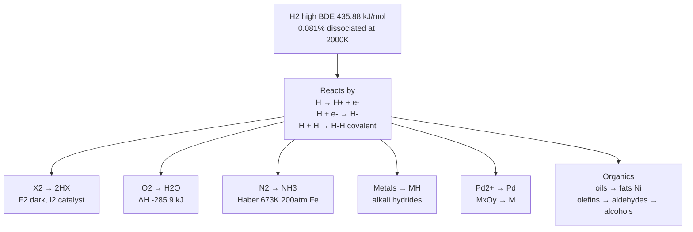
*Chemical behaviour governed by high H-H BDE; three modes of reaction.*

> **Example (NCERT 9.1):** Comment on reactions with (i) Cl₂ (ii) Na (iii) CuO.
> (i) $\ce{H2}$ reduces Cl₂ to Cl⁻, itself oxidized to H⁺, covalent HCl via sharing.
> (ii) Reduced by Na to NaH, e⁻ transferred Na→H, ionic $\ce{Na+ H-}$.
> (iii) Reduces CuO to Cu(0), itself to $\ce{H2O}$ covalent.

## 8. Uses of Dihydrogen (9.4.3)

- Largest single use: $\ce{NH3}$ synthesis → $\ce{HNO3}$ + fertilizers.
- Vanaspati fat by hydrogenation of polyunsaturated oils (soyabean, cotton seed).
- Bulk organic chemicals, methanol: $\ce{CO + 2H2 ->[Co catalyst] CH3OH}$.
- Metal hydrides manufacture.
- $\ce{HCl}$ preparation.
- Metallurgical reduction of heavy metal oxides.
- Atomic H and oxy-hydrogen torches for cutting/welding — atomic H recombines on surface → 4000 K.
- Rocket fuel in space research.
- Fuel cells — pollution-free, more energy per unit mass than gasoline; only pollutants oxides of N₂ (if N₂ impurity), minimized by water injection.

---

# Part C — Hydrides

## 9. Classification of Hydrides (9.5)

Dihydrogen combines with almost all elements except noble gases → binary hydrides $\ce{EHx}$ or $\ce{EmHn}$ (e.g., $\ce{MgH2}$, $\ce{B2H6}$).

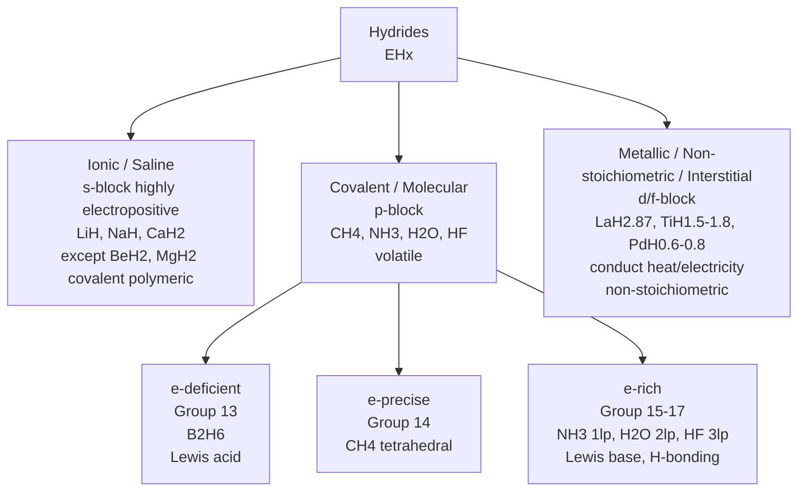
*Three categories; covalent further split by electron count vs bonds.*

## 10. Ionic / Saline Hydrides (9.5.1)

- Stoichiometric compounds with s-block highly electropositive; lighter $\ce{LiH}$, $\ce{BeH2}$, $\ce{MgH2}$ significant covalent, polymeric.
- Crystalline, non-volatile, non-conducting solid, melts conduct electricity, electrolysis liberates $\ce{H2}$ at anode: $\ce{2H- (melt) -> H2 + 2e-}$ confirms $\ce{H-}$ existence.
- React violently with water: $\ce{NaH + H2O -> NaOH + H2}$.
- $\ce{LiH}$ relatively unreactive with $\ce{O2}$/$\ce{Cl2}$ at moderate T, used to make other hydrides:

$\ce{8LiH + Al2Cl6 -> 2LiAlH4 + 6LiCl}$

$\ce{2LiH + B2H6 -> 2LiBH4}$

## 11. Covalent / Molecular Hydrides (9.5.2)

Dihydrogen + p-block → molecular, volatile. For non-metals, hydrogen compounds considered hydrides.

**Electron-deficient:** too few e⁻ for conventional Lewis structure, e.g., $\ce{B2H6}$ diborane; all Group 13 form; act as Lewis acids (e⁻ acceptors).

**Electron-precise:** required e⁻ for Lewis, Group 14, e.g., $\ce{CH4}$ tetrahedral.

**Electron-rich:** excess e⁻ as lone pairs, Groups 15-17, $\ce{NH3}$ 1 lp, $\ce{H2O}$ 2 lp, $\ce{HF}$ 3 lp; Lewis bases (donors); lone pairs on N,O,F → H-bonding → association.

> **Example (NCERT 9.2):** Would hydrides of N,O,F have lower b.p. than subsequent group members?
> On mass basis expected lower, but due to high electronegativity N,O,F → appreciable H-bonding → b.p. $\ce{NH3, H2O, HF}$ higher than $\ce{PH3, H2S, HCl}$ etc.

## 12. Metallic / Interstitial Hydrides (9.5.3)

- Formed by many d- and f-block; Group 7,8,9 do NOT form hydrides; from Group 6 only Cr forms $\ce{CrH}$.
- Conduct heat/electricity though less efficiently than parent metals.
- Almost always non-stoichiometric, H-deficient: $\ce{LaH2.87, YbH2.55, TiH1.5-1.8, ZrH1.3-1.75, VH0.56, NiH0.6-0.7, PdH0.6-0.8}$ — law of constant composition does NOT hold.
- Earlier thought H occupies interstices in metal lattice distorting without change in type → called interstitial hydrides; recent studies show except $\ce{Ni, Pd, Ce, Ac}$ other hydrides have lattice different from parent metal.
- Property of H absorption on transition metals used in catalytic reduction/hydrogenation; $\ce{Pd, Pt}$ accommodate large volume of $\ce{H2}$ → storage media, potential energy source.

---

# Part D — Water, Hardness, Heavy Water & Peroxide

## 13. Water — Occurrence & Physical Properties (9.6)

Major part of living organisms (human 65%, some plants 95%). Crucial for survival, important solvent. Distribution not uniform.

| Source | % total |
|---|---|
| Oceans | 97.33 |
| Saline lakes & inland seas | 0.008 |
| Polar ice & glaciers | 2.04 |
| Ground water | 0.61 |
| Lakes | 0.009 |
| Soil moisture | 0.005 |
| Atmospheric vapour | 0.001 |
| Rivers | 0.0001 |

**Physical properties** due to extensive H-bonding in condensed phase: high freezing point, b.p., heat of vaporisation/fusion vs $\ce{H2S}$, $\ce{H2Se}$; higher specific heat, thermal conductivity, surface tension, dipole moment, dielectric constant.

| Property | $\ce{H2O}$ | $\ce{D2O}$ |
|---|---|---|
| Mol mass g/mol | 18.0151 | 20.0276 |
| m.p. K | 273.0 | 276.8 |
| b.p. K | 373.0 | 374.4 |
| ΔH_f kJ/mol | -285.9 | -294.6 |
| ΔH_vap (373K) kJ/mol | 40.66 | 41.61 |
| ΔH_fus kJ/mol | 6.01 | — |
| T max density K | 276.98 | 284.2 |
| Density 298K g/cm³ | 1.0000 | 1.1059 |
| Viscosity cP | 0.8903 | 1.107 |
| Dielectric const C²/Nm² | 78.39 | 78.06 |
| Conductivity 293K ohm⁻¹cm⁻¹ | 5.7×10⁻⁸ | — |

High heat of vaporisation & capacity → moderation of climate & body T; excellent solvent for ion/molecule transport; H-bonding with polar molecules → covalent compounds like alcohol, carbohydrates dissolve.

## 14. Structure of Water & Ice (9.6)

**Gas phase:** bent molecule, bond angle 104.5°, O–H 95.7 pm.

Highly polar, dipole, orbital overlap picture: O sp³ hybrid, 2 lone pairs.

Liquid: associated by H-bonds.

**Ice:** At atmospheric pressure hexagonal form, at very low T cubic form. Density ice < water → floats; ice layer on lake insulates, survival of aquatic life — ecological significance.

**Ice structure:** Highly ordered 3D H-bonded, each O tetrahedrally surrounded by 4 O at 276 pm; open type structure with wide holes that can hold other molecules interstitially.

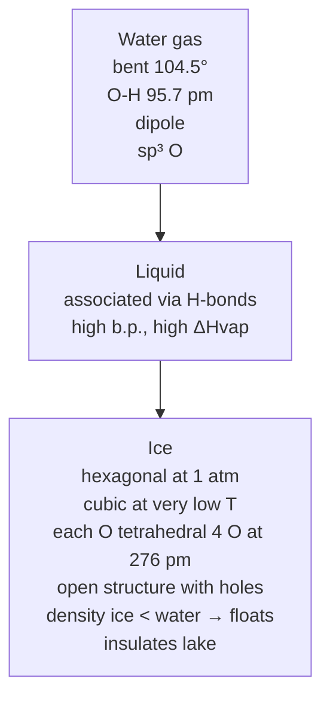
*Water in three states: the bent gas molecule, the H-bonded liquid, and the open cage structure that makes ice float.*

*Water structure progression: bent gas → H-bonded liquid → open tetrahedral ice.*

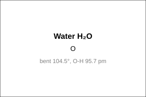
*Water H₂O — bent 104.5°, O.S. H +1, O -2 — ChemEdit editable.*

## 15. Chemical Properties of Water (9.6)

**(1) Amphoteric nature:**

$\ce{H2O + NH3 -> OH- + NH4+}$ — water acts as acid.

$\ce{H2O + H2S -> H3O+ + HS-}$ — water acts as base.

Auto-protolysis (self-ionization): $\ce{H2O + H2O -> H3O+ + OH-}$ — acid-1 base-2 → acid-2 base-1 conjugate pairs.

**(2) Redox:**

Reduced to $\ce{H2}$ by highly electropositive metals: $\ce{2H2O + 2Na -> 2NaOH + H2}$ — source of $\ce{H2}$.

Oxidised to $\ce{O2}$ during photosynthesis: $\ce{6CO2 + 12H2O -> C6H12O6 + 6H2O + 6O2}$

With fluorine: $\ce{2F2 + 2H2O -> 4H+ + 4F- + O2}$

**(3) Hydrolysis:**

High dielectric constant, strong hydrating tendency, dissolves many ionic compounds; certain covalent/ionic hydrolysed:

$\ce{P4O10 + 6H2O -> 4H3PO4}$

$\ce{SiCl4 + 2H2O -> SiO2 + 4HCl}$

$\ce{N3- + 3H2O -> NH3 + 3OH-}$

**(4) Hydrates formation:** Many salts crystallise as hydrated salts — 3 types:

- Coordinated water: $\ce{[Cr(H2O)6]^{3+} 3Cl-}$
- Interstitial water: $\ce{BaCl2.2H2O}$
- H-bonded water: $\ce{[Cu(H2O)4]^{2+} SO4^{2-}.H2O}$ in $\ce{CuSO4.5H2O}$ — number of water directly bonded to metal is 4? Actually in $\ce{CuSO4.5H2O}$, 4 waters coordinated to Cu²⁺, 1 H-bonded — JEE 2009 asked: answer 4? But Allen says 3? Let's clarify: $\ce{CuSO4.5H2O}$ structure: Cu²⁺ coordinated to 4 H₂O + 2 O from sulfate? No, typical: 4 H₂O directly bonded to Cu, 1 H₂O H-bonded to sulfate. Some sources say 4. NCERT problem says? We'll note: 4 waters directly bonded to Cu, 1 via H-bond. 🅰 Allen problem says 3? Check: Actually $\ce{[Cu(H2O)4]SO4.H2O}$ → 4 directly bonded. So answer 4.

## 16. Hard & Soft Water — Types & Softening (9.6)

Rain water almost pure (some dissolved gases). Good solvent dissolves salts. Presence of Ca/Mg salts as hydrogencarbonate, chloride, sulphate → **hard water** — does NOT give lather with soap. Water free from soluble Ca/Mg → **soft water** — lathers easily.

Hard water forms scum/precipitate with soap: soap $\ce{C17H35COONa}$ + $\ce{M^{2+}}$ → $\ce{(C17H35COO)2M v + 2Na+}$ (M=Ca/Mg). Unsuitable for laundry, harmful for boilers (scale reduces efficiency).

**Hardness types:**

- **Temporary hardness:** due to $\ce{Mg(HCO3)2}$, $\ce{Ca(HCO3)2}$.
- **Permanent hardness:** due to soluble chlorides & sulphates of Mg/Ca.

### Temporary hardness removal

**(i) Boiling:**

$\ce{Mg(HCO3)2 ->[Heating] Mg(OH)2 v + 2CO2 ^}$ — because solubility product $\ce{Mg(OH)2}$ vs $\ce{MgCO3}$, $\ce{Mg(OH)2}$ precipitated.

$\ce{Ca(HCO3)2 ->[Heating] CaCO3 v + H2O + CO2 ^}$

Precipitates filtered → soft water.

**(ii) Clark's method:** Calculated lime added:

$\ce{Ca(HCO3)2 + Ca(OH)2 -> 2CaCO3 v + 2H2O}$

$\ce{Mg(HCO3)2 + 2Ca(OH)2 -> 2CaCO3 v + Mg(OH)2 v + 2H2O}$

### Permanent hardness removal

**(i) Washing soda (sodium carbonate):**

$\ce{MCl2 + Na2CO3 -> MCO3 v + 2NaCl}$

$\ce{MSO4 + Na2CO3 -> MCO3 v + Na2SO4}$

**(ii) Calgon's method:** Sodium hexametaphosphate $\ce{Na6P6O18}$ commercial calgon:

$\ce{Na6P6O18 -> 2Na+ + Na4P6O18^{2-}}$

$\ce{M^{2+} + Na4P6O18^{2-} -> [Na2MP6O18]^{2-} + 2Na+}$ — complex anion keeps $\ce{Mg^{2+}}$, $\ce{Ca^{2+}}$ in solution.

**(iii) Ion-exchange (Zeolite / Permutit):**

Hydrated sodium aluminium silicate — zeolite/permutit $\ce{[Na2Al2Si2O8.xH2O]}$ or $\ce{[Na2O.Al2O3.2SiO2.xH2O]}$ — written as $\ce{NaZ}$.

$\ce{2NaZ + M^{2+} -> MZ2 + 2Na+}$ (M=Mg,Ca)

Exhausted when Na used up, regenerated with NaCl: $\ce{MZ2 + 2NaCl -> 2NaZ + MCl2}$

**(iv) Synthetic resins (most popular today):**

Cation exchanger: granular insoluble organic acid resins with $\ce{-SO3H}$ or $\ce{-COOH}$ groups (RH); anion exchanger with basic amine groups (ROH).

At cation exchanger: $\ce{Ca^{2+} + 2RH -> R2Ca + 2H+}$ ; $\ce{Mg^{2+} + 2RH -> R2Mg + 2H+}$

At anion exchanger: $\ce{ROH + Cl- -> RCl + OH-}$ ; $\ce{2ROH + SO4^{2-} -> R2SO4 + 2OH-}$

Water from cation exchanger acidic (H⁺), passed through anion exchanger removes anions via OH⁻ exchange:

$\ce{H+ + OH- -> H2O}$ — pure water, free from impurities, drinkable.

Regeneration: cation resin with dil acid $\ce{2HCl + R2Ca -> 2RH + CaCl2}$; anion resin with dil NaOH $\ce{NaOH + RCl -> NaCl + ROH}$.

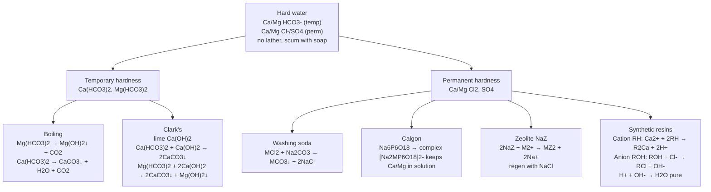
*Hard water classification and softening: temporary via boiling/Clark's, permanent via washing soda, Calgon, zeolite, resins.*

## 17. Heavy Water D₂O (9.7)

Prepared by exhaustive electrolysis of water or as byproduct in fertilizer industries.

**Physical:** colourless, odourless, tasteless mobile liquid; nearly all physical constants higher than ordinary water (see table §13).

**Reactions to make deuterated compounds:**

$\ce{CaC2 + 2D2O -> C2D2 + Ca(OD)2}$

$\ce{SO3 + D2O -> D2SO4}$

$\ce{Al4C3 + 12D2O -> 3CD4 + 4Al(OD)3}$

**Uses:** Moderator & coolant in nuclear reactors, exchange reactions for study of reaction mechanisms. As neutron moderator: fission in U-235 brought by slow neutrons; substances slowing neutrons called moderators; heavy water used.

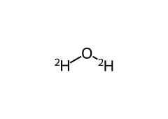
*D₂O — heavy water, moderator in nuclear reactors.*

## 18. Hydrogen Peroxide H₂O₂ (9.8) — Structure & Properties

> NCERT 2023 rationalisation moved H₂O₂ to p-block, Allen says "taken in p-block chapter". Included here because legacy NCERT Unit 9 contained it and JEE Advanced still expects structure & prep.

**Structure:** Open book structure, dihedral angle, gas phase vs solid. O–O bond, non-planar.

- Gas phase: dihedral 111.5°, O–O 148 pm, O–H 95 pm, angle O-O-H 94.8°.
- Solid: dihedral 90.2° due to H-bonding.

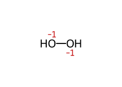
*H₂O₂ — open book, O–O 148 pm, dihedral ~111° gas, ~90° solid — ChemEdit editable.*

**Preparation:**

- Lab: $\ce{BaO2.8H2O + H2SO4 -> BaSO4 v + H2O2 + 8H2O}$ (barium peroxide octahydrate)
- $\ce{Na2O2 + H2SO4 -> Na2SO4 + H2O2}$
- Commercial: auto-oxidation of 2-ethylanthraquinol, electrolysis of $\ce{H2SO4}$ → $\ce{H2S2O8}$ → hydrolysis.

**Properties:**

- Oxidising and reducing both (O.S. O = -1 intermediate between -2 and 0).
- Oxidising in acid: $\ce{2Fe^{2+} + H2O2 + 2H+ -> 2Fe^{3+} + 2H2O}$; $\ce{PbS + 4H2O2 -> PbSO4 + 4H2O}$
- Reducing in acid: $\ce{2MnO4- + 5H2O2 + 6H+ -> 2Mn^{2+} + 8H2O + 5O2}$
- Decomposes: $\ce{2H2O2 -> 2H2O + O2}$ catalysed by metals, $\ce{MnO2}$, etc.
- Weak acid: $\ce{H2O2 ⇌ H+ + HO2-}$ Ka ~ 10⁻¹².

**Uses:** Bleaching, antiseptic, rocket propellant, synthesis, environmental cleaning.

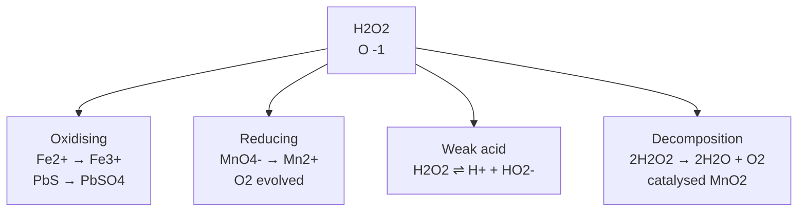
*H₂O₂ sits at oxygen oxidation state −1, so it acts as both an oxidising and a reducing agent.*

## 19. Dihydrogen as Fuel & Hydrogen Economy (9.9)

Energy released on combustion per mole/mass/volume:

| Basis | $\ce{H2}$ gas | $\ce{H2}$ liquid | LPG | $\ce{CH4}$ gas | Octane liquid |
|---|---|---|---|---|---|
| Per mole kJ | 286 | 285 | 2220 | 880 | 5511 |
| Per gram kJ | 143 | 142 | 50 | 53 | 47 |
| Per litre kJ | 12 | 9968 | 25590 | 35 | 34005 |

- On mass basis $\ce{H2}$ releases ~3× more than petrol, less pollutants (only oxides of $\ce{N2}$ if $\ce{N2}$ impurity), minimized by water injection to lower T.
- Limitations: compressed $\ce{H2}$ cylinder weighs ~30× petrol tank for same energy; liquid $\ce{H2}$ requires 20 K insulated tanks; storage in metal alloys $\ce{NaNi5, Ti-TiH2, Mg-MgH2}$ for small quantities.
- **Hydrogen economy:** transportation & storage of energy as liquid/gaseous $\ce{H2}$, not as electric power; pilot project in India Oct 2005: 5% $\ce{H2}$ mixed in CNG for 4-wheelers, gradually increased.
- Fuel cells for electric power — expected viable safe sources to be identified.

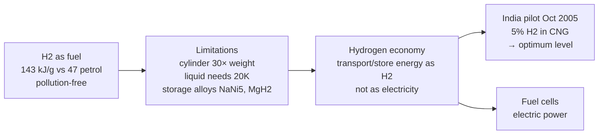
*Hydrogen economy: H₂ as energy carrier, high mass energy, storage challenges, fuel cell application.*

---

## 20. Quick Revision Sheet

- Position: H 1s¹ resembles alkali (ns¹ → H⁺) and halogen (1 short of He → H⁻, diatomic, hydrides) but H⁺ ~1.5×10⁻³ pm never free → placed separately at top.
- Isotopes: ¹H 99.985% protium 0 n, D 0.0156% 1 n, T 10⁻¹⁵% 2 n radioactive β⁻ t½ 12.33 yr; same chem, physical differ due to mass, bond dissociation H 435.88, D 443.35 kJ/mol.
- Forms: O.N. H⁺ (0 e⁻, +1), H⁻ (2 e⁻, -1), H• (1 e⁻, 0); reactivity atomic (3000-5000 K dissociation) > nascent (at birth, Zn+acid, amphoteric metal+base, alcohol+alkali) > molecular; nuclear spin ortho (same spin, higher energy) 75% at high T, para (opposite) 100% at 0 K, 100% para obtainable, not 100% ortho, physical differ only.
- Occurrence: universe 70% mass, solar atmosphere, Jupiter/Saturn mostly H₂, earth atmosphere 0.15% mass, combined 15.4% crust+oceans.
- Lab prep: $\ce{Zn + 2H+ -> Zn^{2+} + H2}$, $\ce{Zn + 2NaOH -> Na2ZnO2 + H2}$.
- Commercial: electrolysis acidified water Pt, Ba(OH)₂ Ni high purity >99.95%, brine byproduct $\ce{2Cl- -> Cl2}$, $\ce{2H2O + 2e- -> H2 + 2OH-}$, hydrocarbon reforming $\ce{CH4 + H2O ->[1270K][Ni] CO + 3H2}$, $\ce{C + H2O -> CO + H2}$ coal gasification = water gas = syngas (CO+H₂), water-gas shift $\ce{CO + H2O ->[673K][FeCr] CO2 + H2}$ Bosch, $\ce{CO2}$ scrubbed by sodium arsenite; 77% petrochemicals, 18% coal, 4% electrolysis.
- Physical: colourless, odourless, tasteless, combustible, lighter than air, insoluble; chemical governed by high BDE, reacts by loss H⁺, gain H⁻, sharing covalent; $\ce{H2 + X2 -> 2HX}$ F₂ dark, I₂ catalyst; $\ce{2H2 + O2 -> 2H2O}$ ΔH -285.9 kJ; $\ce{3H2 + N2 -> 2NH3}$ Haber 673K 200atm Fe ΔH -92.6 kJ; $\ce{H2 + 2M -> 2MH}$; $\ce{H2 + Pd^{2+} -> Pd + 2H+}$; $\ce{yH2 + MxOy -> xM + yH2O}$; hydrogenation oils→fats Ni, hydroformylation olefins→aldehydes→alcohols.
- Uses: NH₃ → HNO₃ fertilizers largest, vanaspati fat, methanol $\ce{CO + 2H2 -> CH3OH}$ Co, metal hydrides, HCl, metallurgical reduction, atomic H torch 4000 K, rocket fuel, fuel cells pollution-free.
- Hydrides: $\ce{EHx}$ / $\ce{EmHn}$, ionic/saline s-block highly electropositive LiH, NaH, CaH₂ (BeH₂, MgH₂ covalent polymeric) crystalline non-volatile solid non-conducting melts conduct $\ce{2H- -> H2 + 2e-}$, $\ce{NaH + H2O -> NaOH + H2}$, $\ce{LiH}$ unreactive O₂/Cl₂ moderate T → makes $\ce{LiAlH4, LiBH4}$; covalent molecular p-block volatile split e-deficient Group13 $\ce{B2H6}$ Lewis acid, e-precise Group14 $\ce{CH4}$ tetrahedral, e-rich Group15-17 $\ce{NH3}$ 1lp, $\ce{H2O}$ 2lp, $\ce{HF}$ 3lp Lewis base H-bonding → association, b.p. $\ce{NH3, H2O, HF}$ higher than heavier congeners due H-bonding; metallic/non-stoichiometric d/f-block Group7,8,9 no hydrides, Group6 only CrH, conduct heat/electricity less, non-stoichiometric $\ce{LaH2.87, TiH1.5-1.8, PdH0.6-0.8}$, law constant composition fails, interstitial earlier thought H in interstices, actually lattice different except Ni,Pd,Ce,Ac, Pd/Pt store large H₂ → storage media.
- Water: occurrence table oceans 97.33%, ice/glaciers 2.04% etc; physical due H-bonding high m.p., b.p., ΔHvap/fus vs H₂S, H₂Se, high specific heat, thermal conductivity, surface tension, dipole, dielectric; table H₂O vs D₂O; structure gas bent 104.5° O-H 95.7 pm polar sp³, liquid H-bonded, ice hexagonal 1 atm cubic low T density ice<water floats insulates lake ecological, ice structure each O tetrahedral 4 O at 276 pm open holes; chemical amphoteric $\ce{H2O + NH3 -> OH- + NH4+}$, $\ce{H2O + H2S -> H3O+ + HS-}$, auto-protolysis $\ce{H2O + H2O -> H3O+ + OH-}$, redox $\ce{2H2O + 2Na -> 2NaOH + H2}$, photosynthesis $\ce{6CO2 + 12H2O -> C6H12O6 + 6H2O + 6O2}$, $\ce{2F2 + 2H2O -> 4H+ + 4F- + O2}$, hydrolysis $\ce{P4O10 + 6H2O -> 4H3PO4}$, $\ce{SiCl4 + 2H2O -> SiO2 + 4HCl}$, hydrates coordinated $\ce{[Cr(H2O)6]Cl3}$, interstitial $\ce{BaCl2.2H2O}$, H-bonded $\ce{CuSO4.5H2O}$ → $\ce{[Cu(H2O)4]SO4.H2O}$ 4 directly bonded.
- Hard water: rain pure, dissolves Ca/Mg HCO₃⁻, Cl⁻, SO₄²⁻ → hard no lather scum $\ce{(C17H35COO)2M}$ with soap, soft free Ca/Mg lathers; temporary hardness $\ce{Ca(HCO3)2, Mg(HCO3)2}$ removed boiling $\ce{Mg(HCO3)2 -> Mg(OH)2↓ + 2CO2}$, $\ce{Ca(HCO3)2 -> CaCO3↓ + H2O + CO2}$, Clark's lime $\ce{Ca(HCO3)2 + Ca(OH)2 -> 2CaCO3↓}$, $\ce{Mg(HCO3)2 + 2Ca(OH)2 -> 2CaCO3↓ + Mg(OH)2↓}$; permanent hardness Ca/Mg Cl₂, SO₄ removed washing soda $\ce{MCl2 + Na2CO3 -> MCO3↓ + 2NaCl}$, Calgon $\ce{Na6P6O18 -> [Na2MP6O18]^{2-}}$ keeps Ca/Mg in solution, zeolite $\ce{NaZ}$ $\ce{2NaZ + M^{2+} -> MZ2 + 2Na+}$ regen $\ce{MZ2 + 2NaCl -> 2NaZ + MCl2}$, synthetic resins RH cation $\ce{Ca^{2+} + 2RH -> R2Ca + 2H+}$, ROH anion $\ce{ROH + Cl- -> RCl + OH-}$, $\ce{H+ + OH- -> H2O}$ pure, regen cation dil acid $\ce{R2Ca + 2HCl -> 2RH + CaCl2}$, anion dil NaOH.
- Heavy water D₂O: prep exhaustive electrolysis or fertilizer byproduct, colourless etc physical constants higher, reactions $\ce{CaC2 + 2D2O -> C2D2 + Ca(OD)2}$, $\ce{SO3 + D2O -> D2SO4}$, $\ce{Al4C3 + 12D2O -> 3CD4 + 4Al(OD)3}$, uses moderator & coolant nuclear reactors, exchange reactions mechanism study, neutron moderator slows neutrons for U-235 fission.
- H₂O₂: open book dihedral gas 111.5° solid 90.2° O-O 148 pm O-H 95 pm O-O-H 94.8°, prep $\ce{BaO2.8H2O + H2SO4 -> BaSO4 + H2O2}$, $\ce{Na2O2 + H2SO4 -> Na2SO4 + H2O2}$, auto-oxidation anthraquinol, $\ce{H2SO4}$ electrolysis → $\ce{H2S2O8}$ → hydrolysis; oxidising $\ce{2Fe^{2+} + H2O2 + 2H+ -> 2Fe^{3+} + 2H2O}$, $\ce{PbS + 4H2O2 -> PbSO4 + 4H2O}$, reducing $\ce{2MnO4- + 5H2O2 + 6H+ -> 2Mn^{2+} + 8H2O + 5O2}$, decomp $\ce{2H2O2 -> 2H2O + O2}$ catalysed $\ce{MnO2}$, weak acid Ka~1e-12.
- Fuel: energy per gram H₂ 143 kJ vs petrol 47, per litre gas 12 vs liquid 9968 vs LPG 25590 vs octane 34005; pollution-free except NOx, water injection minimizes, cylinder weight 30× petrol, liquid needs 20K insulated tanks, storage alloys $\ce{NaNi5, Ti-TiH2, Mg-MgH2}$; hydrogen economy transport/store as H₂ not electricity, India pilot Oct 2005 5% H₂ in CNG, fuel cells electric power.

---

*Cross-links:* [Chemical Bonding](../02-Chemical-Bonding-and-Molecular-Structure/notes.md) — H-bonding, hydride types, water structure; [s-Block](../04-The-s-Block-Elements/notes.md) — saline hydrides, water softening, $\ce{Na2O2}$; [p-Block](../05-The-p-Block-Elements/notes.md) — $\ce{H2O2}$ detailed, electron-deficient hydrides $\ce{B2H6}$; [d-and f-Block](../07-The-d-and-f-Block-Elements/notes.md) — interstitial hydrides, $\ce{Pd/H2}$ storage.
*Sources:* NCERT pre-rationalised Unit 9 (kech202) + Allen Hydrogen module (Enthusiast).
