# s-Block — structure source

This table is the **single source** for every structure drawing in [`../notes.md`](../notes.md).
Edit a row, then regenerate:

```bash
python scripts/render_structures.py Inorganic-Chemistry/04-The-s-Block-Elements/figures/structures.md
```

| Label | SMILES | ID | O.S. | Check | Note |
|---|---|---|---|---|---|
| Sodium oxide Na₂O | `[Na+].[Na+].[O-2]` | na2o | auto | Na=+1 O=-2 | normal oxide Li2O type |
| Sodium peroxide Na₂O₂ | `[Na+].[Na+].[O-][O-]` | na2o2 | auto | Na=+1 O=-1 | peroxide O-O |
| Potassium superoxide KO₂ | `[K+].[O-][O]` | ko2 | auto | K=+1 O=-1,0 O~-1/2 | superoxide: one unpaired e⁻, O at −1 and 0 |
| Sodium hydroxide NaOH | `[Na+].[OH-]` | naoh | auto | Na=+1 | strong base |
| Calcium oxide CaO | `[Ca+2].[O-2]` | cao | auto | Ca=+2 O=-2 | quick lime basic |
| Calcium hydroxide Ca(OH)₂ | `[Ca+2].[OH-].[OH-]` | caoh2 | auto | Ca=+2 | slaked lime |
| Calcium carbonate CaCO₃ | `[Ca+2].[O-]C([O-])=O` | caco3 | auto | Ca=+2 C=+4 | limestone |
| Calcium sulphate CaSO₄ | `[Ca+2].[O-]S([O-])(=O)=O` | caso4 | auto | Ca=+2 S=+6 | gypsum |
| Magnesium chloride MgCl₂ | `[Mg+2].[Cl-].[Cl-]` | mgcl2 | auto | Mg=+2 | ionic |
| Beryllium chloride BeCl₂ chain | `Cl[Be]Cl` | becl2 | auto | Be=+2 | covalent chain solid dimer vapour |
| Beryllium oxide BeO | `[Be+2].[O-2]` | beo | auto | Be=+2 O=-2 | amphoteric |
| Sodium carbonate Na₂CO₃ | `[Na+].[Na+].[O-]C([O-])=O` | na2co3 | auto | C=+4 | Solvay product |
| Sodium bicarbonate NaHCO₃ | `[Na+].OC(=O)[O-]` | nahco3 | auto | C=+4 | baking soda |
| Lithium nitride Li₃N | `[Li+].[Li+].[Li+].[N-3]` | li3n | auto | Li=+1 N=-3 | Li + N2 only alkali nitride |
| Magnesium nitride Mg₃N₂ | `[Mg+2].[Mg+2].[Mg+2].[N-3].[N-3]` | mg3n2 | auto | Mg=+2 N=-3 | Mg + N2 |

<!-- gallery:begin -->
| ID | Structure | Label |
|---|---|---|
| na2o | 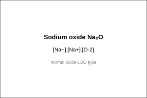 | Sodium oxide Na₂O |
| na2o2 | 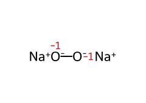 | Sodium peroxide Na₂O₂ |
| ko2 | 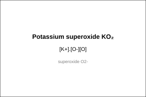 | Potassium superoxide KO₂ |
| naoh | 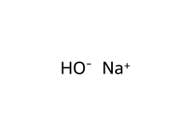 | Sodium hydroxide NaOH |
| cao | 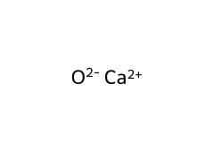 | Calcium oxide CaO |
| caoh2 | 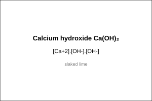 | Calcium hydroxide Ca(OH)₂ |
| caco3 | 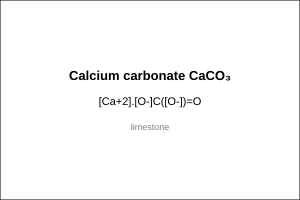 | Calcium carbonate CaCO₃ |
| caso4 | 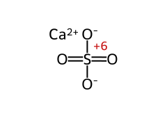 | Calcium sulphate CaSO₄ |
| mgcl2 | 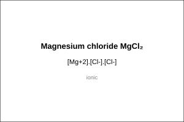 | Magnesium chloride MgCl₂ |
| becl2 | 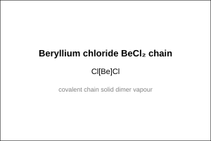 | Beryllium chloride BeCl₂ chain |
| beo | 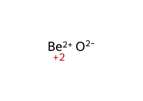 | Beryllium oxide BeO |
| na2co3 | 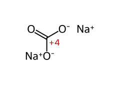 | Sodium carbonate Na₂CO₃ |
| nahco3 | 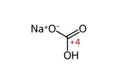 | Sodium bicarbonate NaHCO₃ |
| li3n | 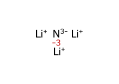 | Lithium nitride Li₃N |
| mg3n2 | 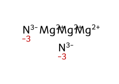 | Magnesium nitride Mg₃N₂ |
<!-- gallery:end -->

<!-- smiles:begin -->
```smiles
[Na+].[Na+].[O-2] na2o Sodium oxide Na₂O
[Na+].[Na+].[O-][O-] na2o2 Sodium peroxide Na₂O₂
[K+].[O-][O] ko2 Potassium superoxide KO₂
[Na+].[OH-] naoh Sodium hydroxide NaOH
[Ca+2].[O-2] cao Calcium oxide CaO
[Ca+2].[OH-].[OH-] caoh2 Calcium hydroxide Ca(OH)₂
[Ca+2].[O-]C([O-])=O caco3 Calcium carbonate CaCO₃
[Ca+2].[O-]S([O-])(=O)=O caso4 Calcium sulphate CaSO₄
[Mg+2].[Cl-].[Cl-] mgcl2 Magnesium chloride MgCl₂
Cl[Be]Cl becl2 Beryllium chloride BeCl₂ chain
[Be+2].[O-2] beo Beryllium oxide BeO
[Na+].[Na+].[O-]C([O-])=O na2co3 Sodium carbonate Na₂CO₃
[Na+].OC(=O)[O-] nahco3 Sodium bicarbonate NaHCO₃
[Li+].[Li+].[Li+].[N-3] li3n Lithium nitride Li₃N
[Mg+2].[Mg+2].[Mg+2].[N-3].[N-3] mg3n2 Magnesium nitride Mg₃N₂
```
<!-- smiles:end -->
