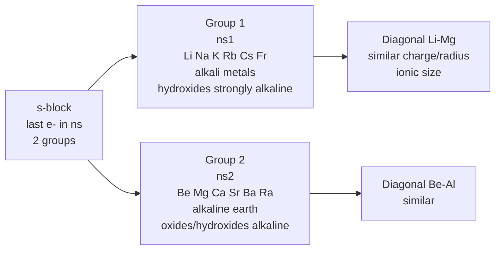
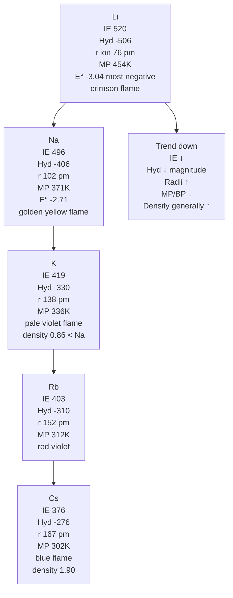
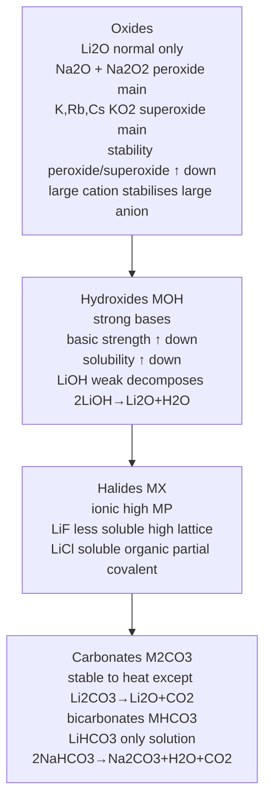
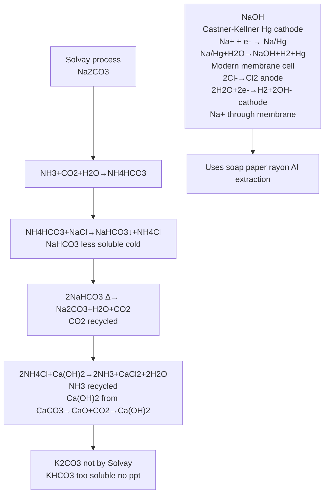
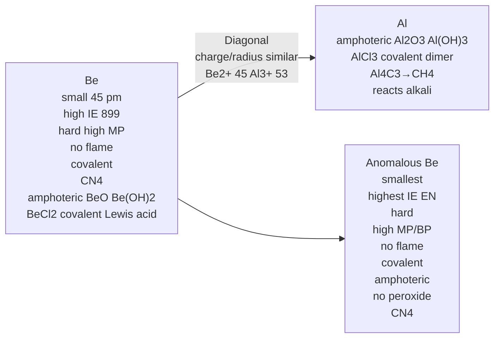
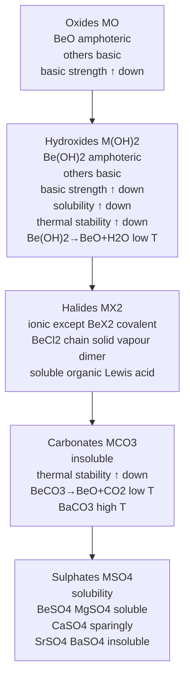
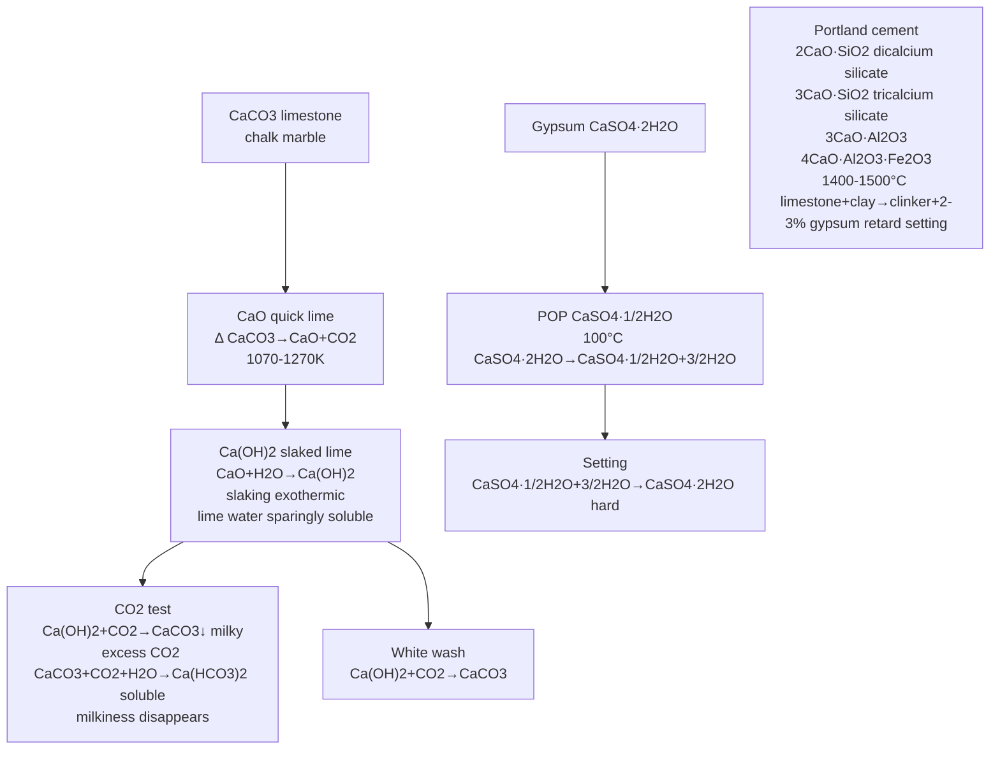
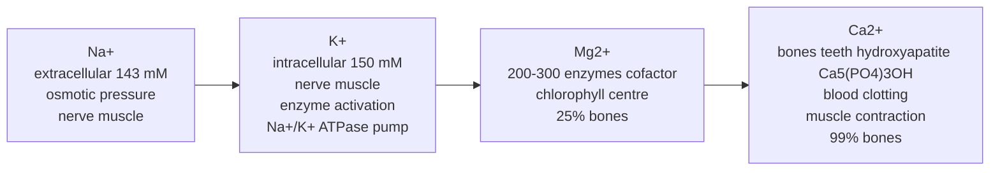

# The s-Block Elements — JEE Advanced Notes

> **Sources merged into these notes**
> | Source | File |
> |---|---|
> | NCERT Class XI (pre-rationalised 2018-19), Unit 10 — s-Block | [`kech203-legacy.pdf`](kech203-legacy.pdf) |
> | Allen — s-Block module (Enthusiast, English, 27 pages) | [`s-Block_Theory_26.pdf`](s-Block_Theory_26.pdf) |
>
> 🅰 = Allen-only content; 🆇 = extra JEE-Advanced bridging point; ⚠ = trap.

## Contents

- [Part A — General & Group 1 Alkali Metals](#part-a--general--group-1-alkali-metals)
  1. [General Characteristics of s-Block (10.1)](#1-general-characteristics-of-s-block-101)
  2. [Group 1 — Occurrence, Config, Atomic Properties (10.2)](#2-group-1--occurrence-config-atomic-properties-102)
  3. [Physical Properties — Radii, IE, Hydration, MP/BP, Density](#3-physical-properties--radii-ie-hydration-mpbp-density)
  4. [Chemical Properties — Air, Water, H₂, Halogens, Diagonal Li-Mg](#4-chemical-properties--air-water-h₂-halogens-diagonal-li-mg)
  5. [Oxides, Hydroxides, Halides, Carbonates — Trends](#5-oxides-hydroxides-halides-carbonates--trends)
  6. [Important Compounds of Na & K — Na₂CO₃ Solvay, NaCl, NaOH, NaHCO₃, KCl](#6-important-compounds-of-na--k--na₂co₃-solvay-nacl-naoh-nahco₃-kcl)
- [Part B — Group 2 Alkaline Earth Metals](#part-b--group-2-alkaline-earth-metals)
  7. [Group 2 — Occurrence, Config, Atomic Properties (10.3)](#7-group-2--occurrence-config-atomic-properties-103)
  8. [Physical Properties — Radii, IE, Hydration, MP/BP](#8-physical-properties--radii-ie-hydration-mpbp)
  9. [Chemical Properties — Air, Water, Halogens, Diagonal Be-Al, Anomalous Be](#9-chemical-properties--air-water-halogens-diagonal-be-al-anomalous-be)
  10. [Oxides, Hydroxides, Halides, Carbonates, Sulphates — Trends](#10-oxides-hydroxides-halides-carbonates-sulphates--trends)
  11. [Important Compounds of Ca & Mg — CaO, Ca(OH)₂, CaCO₃, CaSO₄, MgCl₂, Cement](#11-important-compounds-of-ca--mg--cao-caoh₂-caco₃-caso₄-mgcl₂-cement)
  12. [Biological Significance of Na, K, Mg, Ca (10.5)](#12-biological-significance-of-na-k-mg-ca-105)
  13. [Quick Revision Sheet](#13-quick-revision-sheet)

---

# Part A — General & Group 1 Alkali Metals

## 1. General Characteristics of s-Block (10.1)

Answer-first: s-block elements have last electron entering outermost s-orbital, s can accommodate only 2 electrons → two groups 1 & 2 belong to s-block, highly electropositive, highly reactive, never found free in nature.

- Group 1 alkali metals: Li, Na, K, Rb, Cs, Fr — collectively alkali metals because hydroxides strongly alkaline on reaction with water.
- Group 2 alkaline earth metals: Be, Mg, Ca, Sr, Ba, Ra — oxides/hydroxides alkaline, found in earth crust.
- Li and Be first elements exhibit anomalous properties different from rest, resemble second element of following group: Li→Mg, Be→Al diagonal relationship due similarity ionic sizes and/or charge/radius ratio.
- Francium and radium synthetic radioactive, half-life small.

*The s-block is just two groups — plus the two diagonal pairs, Li–Mg and Be–Al, that the rest of the chapter keeps referring back to.*

## 2. Group 1 — Occurrence, Config, Atomic Properties (10.2)

**Occurrence:** Highly reactive never free, as silicates, halides, carbonates. Na, K abundant, Li less, Rb, Cs trace.

**Electronic config:** $\ce{ns^1}$, e.g., Li [He]2s¹, Na [Ne]3s¹, K [Ar]4s¹, Rb [Kr]5s¹, Cs [Xe]6s¹, Fr [Rn]7s¹.

## 3. Physical Properties — Radii, IE, Hydration, MP/BP, Density

| Property | Li | Na | K | Rb | Cs |
|---|---|---|---|---|---|
| Atomic number | 3 | 11 | 19 | 37 | 55 |
| Atomic mass g/mol | 6.94 | 22.99 | 39.10 | 85.47 | 132.91 |
| Config | [He]2s¹ | [Ne]3s¹ | [Ar]4s¹ | [Kr]5s¹ | [Xe]6s¹ |
| IE kJ/mol | 520 | 496 | 419 | 403 | 376 |
| Hydration enthalpy kJ/mol | −506 | −406 | −330 | −310 | −276 |
| Metallic radius pm | 152 | 186 | 227 | 248 | 265 |
| Ionic radius M⁺ pm | 76 | 102 | 138 | 152 | 167 (180 Fr) |
| m.p. K | 454 | 371 | 336 | 312 | 302 |
| b.p. K | 1615 | 1156 | 1032 | 961 | 944 |
| Density g/cm³ | 0.53 | 0.97 | 0.86 | 1.53 | 1.90 |
| E° M⁺/M V | −3.04 | −2.71 | −2.92 | −2.92 | −2.92 |

**Trend down the group:** Z, mass, radii ↑; IE, m.p., b.p., |ΔhydH| ↓. Density rises
except K < Na. Li is the strongest reducing agent (most negative E°) because its very
small M⁺ is the most strongly hydrated.

- **IE decreases down** due size increase, outer electron farther, easier to remove.
- **Hydration enthalpy decreases down** magnitude decreases as size increases, Li⁺ most hydrated.
- **Metallic/ionic radii increase down** one extra shell.
- **MP/BP decrease down** metallic bond weakens as size increases, K anomalous density < Na due packing?
- **E°:** Li⁺/Li most negative -3.04 V despite high IE due very high hydration enthalpy -506 compensates.

🅰 **Allen extra:** Flame colours: Li crimson red, Na golden yellow, K pale violet, Rb red violet, Cs blue. Due low IE, electrons excited easily.

*Group 1 down the table: radius up, ionisation enthalpy down, hydration enthalpy collapsing, yet melting point taking its odd Li → Be → B → C zigzag.*

## 4. Chemical Properties — Air, Water, H₂, Halogens, Diagonal Li-Mg

**Reactivity increases down group** due IE ↓.

**Towards air (O₂):**

$\ce{4Li + O2 -> 2Li2O}$ normal oxide (mainly)

$\ce{2Na + O2 -> Na2O2}$ peroxide (main) + $\ce{Na2O}$ small

$\ce{K + O2 -> KO2}$ superoxide, $\ce{Rb, Cs}$ also superoxides — superoxide stability increases down due larger cation stabilises larger anion (lattice energy).

Oxides: normal $\ce{M2O}$, peroxide $\ce{M2O2}$ contains $\ce{O2^{2-}}$, superoxide $\ce{MO2}$ contains $\ce{O2-}$.

**Towards water:**

$\ce{2M + 2H2O -> 2MOH + H2}$ highly exothermic, reactivity increases down, Li mild, Na violent, K catches fire, Rb/Cs explosive.

$\ce{2Li + 2H2O -> 2LiOH + H2}$ slow

$\ce{2Na + 2H2O -> 2NaOH + H2}$ violent

**Towards dihydrogen:**

$\ce{2M + H2 -> 2MH}$ hydrides ionic, high MP, $\ce{LiH}$ most stable, $\ce{NaH}$ etc. $\ce{MH + H2O -> MOH + H2}$.

**Towards halogens:**

$\ce{2M + X2 -> 2MX}$ halides, reactivity $\ce{F2 > Cl2 > Br2 > I2}$.

**Diagonal relationship Li-Mg:**

| Property | Li | Mg | Similarities |
|---|---|---|---|
| Hardness | Hard | Hard | Both harder than other alkali |
| MP/BP | High vs group | High | Higher than Na/K and Ca |
| Reaction with O₂ | $\ce{Li2O}$ only | $\ce{MgO}$ only | Both form normal oxide only, no peroxide/superoxide due small size |
| Reaction with N₂ | $\ce{6Li + N2 -> 2Li3N}$ nitride | $\ce{3Mg + N2 -> Mg3N2}$ nitride | Both form nitrides, other alkali do not |
| Hydroxides | $\ce{LiOH}$ weak base less soluble | $\ce{Mg(OH)2}$ weak base less soluble | Both weak bases, less soluble, decompose on heating $\ce{LiOH, Mg(OH)2 -> oxides}$ |
| Carbonates | $\ce{Li2CO3}$ decomposes $\ce{-> Li2O + CO2}$ | $\ce{MgCO3 -> MgO + CO2}$ | Both decompose on heating, other alkali carbonates stable to heat |
| Bicarbonates | $\ce{LiHCO3}$ exists only in solution | $\ce{Mg(HCO3)2}$ only in solution | Both only in solution |
| Nitrates | $\ce{4LiNO3 -> 2Li2O + 4NO2 + O2}$ | $\ce{2Mg(NO3)2 -> 2MgO + 4NO2 + O2}$ | Both decompose to oxides, NO₂, O₂, other alkali nitrates $\ce{2MNO3 -> 2MNO2 + O2}$ |
| Chlorides | $\ce{LiCl}$ deliquescent, soluble organic solvents | $\ce{MgCl2}$ deliquescent, soluble organic solvents | Both deliquescent, soluble in organic due partial covalent |

- Reason: Similar ionic sizes $\ce{Li+ 76 pm, Mg2+ 72 pm}$ and charge/radius ratio $\ce{Li+ 1/76, Mg2+ 2/72}$ similar polarising power.

**Anomalous Li:**

- Smallest size, highest IE, highest hydration, hardest, highest MP/BP in group, most negative E°, forms only normal oxide, forms nitride, least reactive but strongest reducing in aqueous due high hydration, less soluble hydroxides/carbonates.

## 5. Oxides, Hydroxides, Halides, Carbonates — Trends

**Oxides:**

- $\ce{Li2O}$ normal, $\ce{Na2O}$ + $\ce{Na2O2}$ peroxide main, $\ce{K, Rb, Cs}$ superoxides $\ce{MO2}$ main. Stability of peroxides/superoxides increases down larger cation stabilises larger anion.

**Hydroxides $\ce{MOH}$:**

- Preparation: $\ce{M2O + H2O -> 2MOH}$, $\ce{M + H2O -> MOH + H2}$.
- White crystalline, strong bases (except LiOH weak), basic strength increases down, solubility increases down, thermal stability increases down (LiOH decomposes $\ce{2LiOH -> Li2O + H2O}$ on heating).

**Halides $\ce{MX}$:**

- Ionic, high MP, $\ce{M-F}$ most ionic, $\ce{M-I}$ least, solubility? $\ce{LiF}$ less soluble due high lattice energy, $\ce{LiCl}$ soluble organic solvents due partial covalent small size high polarisation.

**Carbonates $\ce{M2CO3}$ and bicarbonates $\ce{MHCO3}$:**

- Carbonates stable to heat except $\ce{Li2CO3}$ decomposes $\ce{Li2CO3 -> Li2O + CO2}$, solubility increases? Actually $\ce{Li2CO3}$ less soluble.
- Bicarbonates: $\ce{LiHCO3}$ only in solution, $\ce{NaHCO3, KHCO3}$ etc exist solid but decompose on heating $\ce{2NaHCO3 -> Na2CO3 + H2O + CO2}$.
- Solubility of carbonates? $\ce{Li2CO3}$ less soluble.

*Down group 1 the oxide changes identity — Li₂O, then Na₂O₂, then the superoxides — because the cation is no longer small enough to stabilise O²⁻.*

## 6. Important Compounds of Na & K — Na₂CO₃ Solvay, NaCl, NaOH, NaHCO₃, KCl

### Sodium carbonate $\ce{Na2CO3}$ — Solvay process (ammonia-soda)

**Principle:** $\ce{NaCl + NH3 + CO2 + H2O -> NaHCO3 + NH4Cl}$, $\ce{2NaHCO3 -> Na2CO3 + H2O + CO2}$.

Steps:

1. $\ce{NH3 + CO2 + H2O -> NH4HCO3}$ / $\ce{2NH3 + CO2 + H2O -> (NH4)2CO3}$ → $\ce{(NH4)2CO3 + CO2 + H2O -> 2NH4HCO3}$
2. $\ce{NH4HCO3 + NaCl -> NaHCO3 v + NH4Cl}$ — $\ce{NaHCO3}$ less soluble in cold, precipitates.
3. $\ce{2NaHCO3 ->[Δ] Na2CO3 + H2O + CO2}$ — $\ce{CO2}$ recycled.
4. $\ce{2NH4Cl + Ca(OH)2 -> 2NH3 + CaCl2 + 2H2O}$ — $\ce{NH3}$ recycled, $\ce{Ca(OH)2}$ from $\ce{CaCO3 -> CaO + CO2}$, $\ce{CaO + H2O -> Ca(OH)2}$.

- $\ce{K2CO3}$ cannot be made by Solvay because $\ce{KHCO3}$ too soluble, does not precipitate.

Properties: White, soluble, alkaline $\ce{Na2CO3 + H2O -> NaOH + NaHCO3}$, $\ce{10H2O}$ washing soda $\ce{Na2CO3.10H2O}$ effloresces $\ce{-> Na2CO3.H2O}$ monohydrate → anhydrous soda ash.

Uses: Glass, soap, paper, water softening, $\ce{NaOH}$ manufacture.

### Sodium chloride $\ce{NaCl}$

- Abundant sea water, brine, rock salt, purification via common ion effect HCl gas through brine precipitates NaCl.
- MP 1081K, soluble, non-hygroscopic? Actually pure not hygroscopic but impure hygroscopic due MgCl₂.
- Uses: Chemical industry, $\ce{Na2CO3, NaOH, Cl2}$ manufacture, food.

### Sodium hydroxide $\ce{NaOH}$ — Caustic soda

**Manufacture:**

- **Castner-Kellner (mercury cathode):** Brine electrolysis, anode $\ce{2Cl- -> Cl2 + 2e-}$, cathode Hg $\ce{Na+ + e- -> Na/Hg}$ amalgam, amalgam + $\ce{H2O -> NaOH + H2 + Hg}$.
- **Membrane cell (modern):** Ion-selective membrane, anode Ti, cathode steel, $\ce{2Cl- -> Cl2}$, cathode $\ce{2H2O + 2e- -> H2 + 2OH-}$, $\ce{Na+}$ migrates through membrane → $\ce{NaOH}$.

Properties: White deliquescent, strong base, highly soluble exothermic, soapy touch, $\ce{2NaOH + CO2 -> Na2CO3 + H2O}$, $\ce{2Al + 2NaOH + 2H2O -> 2NaAlO2 + 3H2}$.

Uses: Soap, paper, petroleum, rayon, $\ce{Al}$ extraction.

### Sodium bicarbonate $\ce{NaHCO3}$ — Baking soda

Preparation: $\ce{Na2CO3 + CO2 + H2O -> 2NaHCO3}$ (Solvay intermediate).

Properties: White, sparingly soluble, alkaline $\ce{NaHCO3 + H2O -> NaOH + H2CO3}$, decomposes $\ce{2NaHCO3 ->[150°C] Na2CO3 + H2O + CO2}$ — leavening, fire extinguisher $\ce{NaHCO3 + HCl -> NaCl + H2O + CO2}$.

Uses: Baking, antacid, fire extinguisher, $\ce{CO2}$ source.

### Potassium chloride etc.

Similar to Na.

*Solvay process step by step, and why NH₃ is recycled rather than replaced by lime.*

---

# Part B — Group 2 Alkaline Earth Metals

## 7. Group 2 — Occurrence, Config, Atomic Properties (10.3)

**Occurrence:** Be as beryl $\ce{Be3Al2Si6O18}$, Mg as magnesite $\ce{MgCO3}$ dolomite $\ce{MgCO3.CaCO3}$ Epsom $\ce{MgSO4.7H2O}$ carnallite $\ce{KCl.MgCl2.6H2O}$, Ca as limestone $\ce{CaCO3}$ gypsum $\ce{CaSO4.2H2O}$, Sr, Ba less.

**Config:** $\ce{ns^2}$, Be [He]2s², Mg [Ne]3s², Ca [Ar]4s², Sr [Kr]5s², Ba [Xe]6s², Ra [Rn]7s².

## 8. Physical Properties — Radii, IE, Hydration, MP/BP

| Property | Be | Mg | Ca | Sr | Ba |
|---|---|---|---|---|---|
| Atomic number | 4 | 12 | 20 | 38 | 56 |
| Atomic mass | 9.01 | 24.31 | 40.08 | 87.62 | 137.33 |
| Metallic radius pm | 112 | 160 | 197 | 215 | 222 |
| Ionic radius M²⁺ pm | 45 | 72 | 100 | 118 | 135 |
| IE1 kJ/mol | 899 | 737 | 590 | 549 | 503 |
| IE2 kJ/mol | 1757 | 1450 | 1145 | 1064 | 965 |
| Hydration enthalpy kJ/mol (M²⁺) | −2494 | −1921 | −1577 | −1443 | −1305 |
| MP K | 1560 | 923 | 1115 | 1050 | 1000 |
| BP K | 2745 | 1363 | 1757 | 1655 | 2143 |
| Density g/cm³ | 1.84 | 1.74 | 1.55 | 2.63 | 3.59 |
| E° M²⁺/M V | −1.97 | −2.36 | −2.84 | −2.89 | −2.91 |

**Trend down the group:** Z, mass, radii ↑; IE, |ΔhydH| ↓. Be is the exception
everywhere — its tiny size gives the highest m.p. (1560 K), the only amphoteric oxide
and the only covalent halides. Ba is the strongest reducing agent (most negative E°).

- IE1 decreases down size ↑, but Be>Mg due small size, IE2 also.
- Hydration enthalpy magnitude decreases down, Be²⁺ highly hydrated due small size, but Mg²⁺ often highest in some tables due size vs charge? Actually hydration $\ce{Be^{2+} > Mg^{2+} > Ca^{2+} > Sr^{2+} > Ba^{2+}}$ generally.
- Radii increase down one extra shell.
- MP/BP not regular due different crystal structures.
- E° more negative down, Be least negative due high IE and small size less hydration? Actually Be E° -1.97 least negative.

Flame colours: Ca brick red, Sr crimson red, Ba apple green, Be Mg no colour (high IE).

## 9. Chemical Properties — Air, Water, Halogens, Diagonal Be-Al, Anomalous Be

**Reactivity increases down** but less than alkali.

**Towards air (O₂):**

$\ce{2M + O2 -> 2MO}$ normal oxides, $\ce{BeO, MgO}$; $\ce{Ba}$ also forms peroxide $\ce{BaO2}$.

$\ce{Be + O2 -> 2BeO}$, $\ce{2Mg + O2 -> 2MgO}$, etc.

$\ce{MO}$ ionic, BeO amphoteric, others basic.

**Towards water:**

$\ce{Be + H2O}$ no reaction (oxide layer), $\ce{Mg + H2O}$ hot water $\ce{Mg + H2O -> MgO + H2}$ or $\ce{Mg + 2H2O -> Mg(OH)2 + H2}$ steam, $\ce{Ca, Sr, Ba + 2H2O -> M(OH)2 + H2}$ cold water, reactivity increases down.

**Towards H₂:**

$\ce{M + H2 -> MH2}$ hydrides ionic except $\ce{BeH2, MgH2}$ covalent polymeric, $\ce{BeH2}$ prepared $\ce{BeCl2 + LiAlH4}$.

**Towards halogens:**

$\ce{M + X2 -> MX2}$ halides ionic except $\ce{BeX2}$ covalent.

**Anomalous Be:**

- Smallest size, highest IE, highest EN, high polarising power, forms covalent compounds, hard, high MP/BP, does not give flame colour, oxide amphoteric, does not react water, does not form peroxide, coordination number 4 (tetrahedral) vs 6 for others.

**Diagonal Be-Al:**

| Property | Be | Al | Similarities |
|---|---|---|---|
| Charge/radius | $\ce{Be^{2+} 45 pm}$ | $\ce{Al^{3+} 53 pm}$ | Similar polarising power |
| Hardness | Hard | Hard | Harder than other group members |
| MP/BP | High | High | Higher than others in group |
| Oxides | $\ce{BeO}$ amphoteric | $\ce{Al2O3}$ amphoteric | Both amphoteric, others basic |
| Hydroxides | $\ce{Be(OH)2}$ amphoteric | $\ce{Al(OH)3}$ amphoteric | Both amphoteric, others basic |
| Halides | $\ce{BeCl2}$ covalent, soluble organic, Lewis acid, bridged dimer | $\ce{AlCl3}$ covalent, soluble organic, Lewis acid, dimer Al₂Cl₆ | Both covalent, soluble organic, Lewis acids, bridged structures |
| Carbides | $\ce{Be2C}$ → $\ce{CH4}$ with water | $\ce{Al4C3}$ → $\ce{CH4}$ with water | Both give methane with water |
| Nitrides | $\ce{Be3N2}$ | $\ce{AlN}$ | Both nitrides |
| Coordination | CN 4 tetrahedral | CN 4 and 6 | Both show CN 4 |
| Reaction with alkali | $\ce{Be + 2NaOH -> Na2BeO2 + H2}$ | $\ce{2Al + 2NaOH + 2H2O -> 2NaAlO2 + 3H2}$ | Both react with alkali giving H₂ and beryllate/aluminate |

Reason: Similar charge/radius ratio.

*Be and Al: the same charge-to-radius ratio puts them on the same diagonal.*

## 10. Oxides, Hydroxides, Halides, Carbonates, Sulphates — Trends

**Oxides MO:**

- $\ce{BeO, MgO}$ etc. BeO amphoteric, others basic, basic strength increases down, solubility? BeO insoluble, others? $\ce{BeO + 2NaOH -> Na2BeO2 + H2O}$ amphoteric, $\ce{Al2O3}$ similar.
- $\ce{MO + H2O -> M(OH)2}$.

**Hydroxides $\ce{M(OH)2}$:**

- Preparation $\ce{MO + H2O -> M(OH)2}$, $\ce{M + 2H2O -> M(OH)2 + H2}$.
- White, basic strength increases down, $\ce{Be(OH)2}$ amphoteric $\ce{Be(OH)2 + 2NaOH -> Na2BeO2 + 2H2O}$, $\ce{Be(OH)2 + 2HCl -> BeCl2 + 2H2O}$, others basic, solubility increases down (Be(OH)₂ insoluble, Ba(OH)₂ soluble), thermal stability increases down $\ce{Be(OH)2 -> BeO + H2O}$ low T, $\ce{Ba(OH)2}$ high T.

**Halides $\ce{MX2}$:**

- Ionic except $\ce{BeX2}$ covalent, $\ce{BeCl2}$ in solid chain, vapour dimer, soluble organic solvents, Lewis acid, $\ce{BeF2}$ ionic? Actually $\ce{BeF2}$ glassy. Solubility? $\ce{BeF2}$ soluble, $\ce{MgF2}$ less, $\ce{CaF2}$ insoluble due high lattice energy.

**Carbonates $\ce{MCO3}$:**

- Insoluble water, thermal stability increases down: $\ce{BeCO3 -> BeO + CO2}$ low T, $\ce{BaCO3 -> BaO + CO2}$ high T, because larger cation stabilises larger anion? Actually lattice energy decreases? Stability ↑ down.
- Solubility decreases? Actually? $\ce{BeCO3}$? Generally solubility decreases? Let's recall: Carbonates solubility? $\ce{BeCO3}$? Complex.

**Sulphates $\ce{MSO4}$:**

- Solubility: $\ce{BeSO4, MgSO4}$ soluble, $\ce{CaSO4}$ sparingly soluble, $\ce{SrSO4, BaSO4}$ insoluble, due hydration vs lattice.

*Every Group 2 compound in one table — oxides, hydroxides, halides, carbonates, sulphates — and how the trends run down the group.*

## 11. Important Compounds of Ca & Mg — CaO, Ca(OH)₂, CaCO₃, CaSO₄, MgCl₂, Cement

### Calcium oxide $\ce{CaO}$ — Quick lime

Preparation: $\ce{CaCO3 ->[Δ] CaO + CO2}$ limestone kiln 1070-1270K.

Properties: White amorphous, high MP, basic oxide $\ce{CaO + H2O -> Ca(OH)2}$ slaking highly exothermic, $\ce{CaO + CO2 -> CaCO3}$, $\ce{CaO + SiO2 -> CaSiO3}$.

Uses: Cement, glass, $\ce{Ca(OH)2}$, drying agent.

### Calcium hydroxide $\ce{Ca(OH)2}$ — Slaked lime

Preparation: $\ce{CaO + H2O -> Ca(OH)2}$ slaking.

Properties: White powder sparingly soluble water (lime water), aqueous solution alkaline, absorbs $\ce{CO2}$ $\ce{Ca(OH)2 + CO2 -> CaCO3 + H2O}$ milky test for $\ce{CO2}$, excess $\ce{CO2}$ $\ce{CaCO3 + CO2 + H2O -> Ca(HCO3)2}$ soluble milkiness disappears, used white wash $\ce{Ca(OH)2 + CO2 -> CaCO3}$.

Uses: White wash, plaster, $\ce{CaO}$, glass, water softening Clark's method.

### Calcium carbonate $\ce{CaCO3}$

Occurrence limestone, marble, chalk, calcite.

Properties: White insoluble, decomposes $\ce{CaCO3 ->[Δ] CaO + CO2}$, with $\ce{CO2}$ water forms bicarbonate $\ce{CaCO3 + CO2 + H2O -> Ca(HCO3)2}$ soluble temporary hardness.

Uses: Cement, lime, toothpaste, antacid.

### Calcium sulphate $\ce{CaSO4}$

Gypsum $\ce{CaSO4.2H2O}$, Plaster of Paris $\ce{CaSO4.1/2H2O}$.

Preparation: $\ce{CaSO4.2H2O ->[100°C] CaSO4.1/2H2O + 3/2H2O}$, $\ce{->[200°C] CaSO4}$ anhydrite.

Plaster of Paris sets with water: $\ce{CaSO4.1/2H2O + 3/2H2O -> CaSO4.2H2O}$ hard mass, expansion? Used plaster, casts, blackboard chalk.

Dead burnt plaster $\ce{CaSO4}$ anhydrite does not set.

### Magnesium chloride $\ce{MgCl2}$

From carnallite $\ce{KCl.MgCl2.6H2O}$, $\ce{MgCl2.6H2O ->[Δ] MgCl2 + 6H2O}$ but hydrolysed so $\ce{MgCl2.6H2O + NH4Cl}$ etc.

Uses: $\ce{Mg}$ extraction.

### Portland cement

Mixture of calcium silicates $\ce{2CaO.SiO2}$ dicalcium silicate, $\ce{3CaO.SiO2}$ tricalcium silicate, $\ce{3CaO.Al2O3}$ tricalcium aluminate, $\ce{4CaO.Al2O3.Fe2O3}$.

Manufacture: Limestone $\ce{CaCO3}$ + clay $\ce{SiO2, Al2O3}$ heated 1400-1500°C rotary kiln → clinker + gypsum 2-3% $\ce{CaSO4.2H2O}$ to retard setting.

Setting: Hydrolysis of silicates forms colloidal gel that hardens, $\ce{2CaO.SiO2 + xH2O -> 2CaO.SiO2.xH2O}$, etc.

*Limestone to whitewash: the lime cycle, and why excess CO₂ makes the milkiness disappear.*

## 12. Biological Significance of Na, K, Mg, Ca (10.5)

- $\ce{Na+}$: Main cation extracellular fluid, 143 mmol/L plasma, maintains osmotic pressure, nerve impulse, muscle contraction.
- $\ce{K+}$: Main cation intracellular fluid 150 mmol/L, nerve impulse, muscle contraction, enzyme activation, $\ce{Na+/K+}$ pump maintains gradient via $\ce{Na+-K+ ATPase}$.
- $\ce{Mg^{2+}}$: 200-300 enzymes cofactor, chlorophyll $\ce{Mg}$ centre photosynthesis, 25% of $\ce{Mg}$ in body in bones.
- $\ce{Ca^{2+}}$: Bones teeth as hydroxyapatite $\ce{Ca5(PO4)3OH}$, blood clotting, muscle contraction, nerve impulse, 99% body Ca in bones.

*Where Na, K, Mg and Ca actually live in the body, and what happens when the gradients collapse.*

---

## 13. Quick Revision Sheet

- s-block: last e⁻ ns, 2 groups, highly electropositive reactive never free; Li Be anomalous diagonal Li-Mg Be-Al due similar ionic size charge/radius.
- Group 1 alkali: Li Na K Rb Cs Fr ns¹ [He]2s¹ etc; occurrence silicates halides carbonates; physical IE 520 496 419 403 376 ↓ down size ↑, hydration -506 -406 -330 -310 -276 ↓ magnitude ↓, metallic 152 186 227 248 265 ↑, ionic M⁺ 76 102 138 152 167 ↑, MP 454 371 336 312 302 ↓, BP 1615 1156 1032 961 944 ↓, density 0.53 0.97 0.86 1.53 1.90 ↑ but K<Na anomalous, E° Li⁺/Li -3.04 most negative high hydration, flame Li crimson Na golden yellow K pale violet Rb red violet Cs blue; chemical reactivity ↑ down, O₂ Li Li₂O normal only, Na Na₂O + Na₂O₂ peroxide main, K Rb Cs KO₂ superoxide main stability peroxides/superoxides ↑ down large cation stabilises large anion, H₂O 2M+2H₂O→2MOH+H₂ exothermic reactivity ↑ Li mild Na violent K fire Rb/Cs explosive, H₂ 2M+H₂→2MH ionic high MP LiH most stable MH+H₂O→MOH+H₂, halogens 2M+X₂→2MX F₂>Cl₂>Br₂>I₂; diagonal Li-Mg: hard, high MP/BP, Li₂O only MgO only, nitrides Li₃N Mg₃N₂ other alkali no, hydroxides weak base less soluble LiOH Mg(OH)₂ decompose LiOH Mg(OH)₂→oxides, carbonates decompose Li₂CO₃→Li₂O+CO₂ MgCO₃→MgO+CO₂ other stable, bicarbonates only solution LiHCO₃ Mg(HCO₃)₂, nitrates 4LiNO₃→2Li₂O+4NO₂+O₂ 2Mg(NO₃)₂→2MgO+4NO₂+O₂ other 2MNO₃→2MNO₂+O₂, chlorides deliquescent soluble organic LiCl MgCl₂ partial covalent; anomalous Li smallest high IE high hydration hardest high MP most negative E° only normal oxide nitride least reactive strongest reducing aqueous less soluble.
- Oxides Li₂O normal Na₂O+Na₂O₂ peroxide main K Rb Cs MO₂ superoxide main; hydroxides MOH white strong bases except LiOH weak basic strength ↑ down solubility ↑ down thermal stability ↑ down 2LiOH→Li₂O+H₂O; halides MX ionic high MP LiF less soluble high lattice LiCl soluble organic partial covalent; carbonates M₂CO₃ stable except Li₂CO₃→Li₂O+CO₂ solubility? Li₂CO₃ less soluble, bicarbonates MHCO₃ LiHCO₃ only solution 2NaHCO₃→Na₂CO₃+H₂O+CO₂; important Na₂CO₃ Solvay NH₃+CO₂+H₂O→NH₄HCO₃ NH₄HCO₃+NaCl→NaHCO₃↓+NH₄Cl less soluble cold 2NaHCO₃Δ→Na₂CO₃+H₂O+CO₂ CO₂ recycled 2NH₄Cl+Ca(OH)₂→2NH₃+CaCl₂+2H₂O NH₃ recycled Ca(OH)₂ from CaCO₃→CaO+CO₂ CaO+H₂O→Ca(OH)₂ K₂CO₃ not by Solvay KHCO₃ too soluble no ppt white soluble alkaline Na₂CO₃+H₂O→NaOH+NaHCO₃ 10H₂O washing soda effloresces → monohydrate → soda ash uses glass soap paper water softening NaOH manufacture; NaCl abundant sea water brine rock salt purification common ion HCl gas brine precipitates NaCl MP1081K soluble non-hygroscopic pure impure hygroscopic MgCl₂ uses Na₂CO₃ NaOH Cl₂ food; NaOH caustic soda Castner-Kellner Hg cathode 2Cl-→Cl₂ anode Na++e-→Na/Hg amalgam amalgam+H₂O→NaOH+H₂+Hg membrane modern ion-selective Ti anode steel cathode 2Cl-→Cl₂ 2H₂O+2e-→H₂+2OH- Na+ through membrane →NaOH white deliquescent strong base highly soluble exothermic soapy 2NaOH+CO₂→Na₂CO₃+H₂O 2Al+2NaOH+2H₂O→2NaAlO₂+3H₂ uses soap paper petroleum rayon Al extraction; NaHCO₃ baking soda Na₂CO₃+CO₂+H₂O→2NaHCO₃ Solvay intermediate white sparingly soluble alkaline NaHCO₃+H₂O→NaOH+H₂CO₃ decomposes 2NaHCO₃150°C→Na₂CO₃+H₂O+CO₂ leavening fire extinguisher NaHCO₃+HCl→NaCl+H₂O+CO₂ uses baking antacid fire extinguisher CO₂ source.
- Group 2 alkaline earth: Be Mg Ca Sr Ba Ra ns² [He]2s² etc occurrence Be beryl Be₃Al₂Si₆O₁₈ Mg magnesite MgCO₃ dolomite MgCO₃·CaCO₃ Epsom MgSO₄·7H₂O carnallite KCl·MgCl₂·6H₂O Ca limestone CaCO₃ gypsum CaSO₄·2H₂O; physical metallic 112 160 197 215 222 pm ↑ ionic M²⁺ 45 72 100 118 135 pm ↑ IE1 899 737 590 549 503 ↓ Be>Mg small IE2 1757 1450 1145 1064 965 ↓ hydration Be²⁺ -1650 Mg²⁺ -1926 Ca²⁺ -1577 Sr²⁺ -1443 Ba²⁺ -1305 ↓ magnitude after Mg? generally Be>Mg>Ca>Sr>Ba highly hydrated small size, MP 1560 923 1115 1050 1000 no regular Be high small size BP 2745 1363 1757 1655 2143 density 1.84 1.74 1.55 2.63 3.59 ↑ after Ca E° M²⁺/M -1.97 -2.36 -2.84 -2.89 -2.91 more negative down Be least negative flame Ca brick red Sr crimson Ba apple green Be Mg no colour high IE; chemical reactivity ↑ down less than alkali O₂ 2M+O₂→2MO normal BeO MgO Ba also BaO₂ peroxide MO ionic BeO amphoteric others basic, H₂O Be no oxide layer Mg hot water Mg+H₂O→MgO+H₂ steam Mg+2H₂O→Mg(OH)₂+H₂ Ca Sr Ba cold  M+2H₂O→M(OH)₂+H₂ reactivity ↑, H₂ M+H₂→MH₂ ionic except BeH₂ MgH₂ covalent polymeric BeH₂ BeCl₂+LiAlH4, halogens M+X₂→MX₂ ionic except BeX₂ covalent; anomalous Be smallest high IE high EN high polarising power covalent hard high MP/BP no flame amphoteric oxide does not react water no peroxide CN4 vs 6 others; diagonal Be-Al: charge/radius Be²⁺45 Al³⁺53 similar polarising hard high MP/BP BeO amphoteric Al₂O₃ amphoteric Be(OH)₂ amphoteric Al(OH)₃ amphoteric BeCl₂ covalent soluble organic Lewis acid bridged dimer AlCl₃ covalent soluble organic Lewis acid dimer Al₂Cl₆ Be₂C→CH₄ Al₄C₃→CH₄ Be₃N₂ AlN nitrides CN4 both Be+2NaOH→Na₂BeO₂+H₂ 2Al+2NaOH+2H₂O→2NaAlO₂+3H₂ both react alkali H₂ beryllate/aluminate.
- Oxides MO BeO amphoteric others basic basic strength ↑ down BeO+2NaOH→Na₂BeO₂+H₂O amphoteric; hydroxides M(OH)₂ white basic strength ↑ down Be(OH)₂ amphoteric Be(OH)₂+2NaOH→Na₂BeO₂+2H₂O Be(OH)₂+2HCl→BeCl₂+2H₂O others basic solubility ↑ down Be(OH)₂ insoluble Ba(OH)₂ soluble thermal stability ↑ down Be(OH)₂→BeO+H₂O low T Ba(OH)₂ high T; halides MX₂ ionic except BeX₂ covalent BeCl₂ chain solid vapour dimer soluble organic Lewis acid BeF₂ glassy solubility BeF₂ soluble MgF₂ less CaF₂ insoluble high lattice; carbonates MCO₃ insoluble thermal stability ↑ down BeCO₃→BeO+CO₂ low T BaCO₃ high T larger cation stabilises larger anion; sulphates MSO₄ solubility BeSO₄ MgSO₄ soluble CaSO₄ sparingly SrSO₄ BaSO₄ insoluble hydration vs lattice; important CaO quick lime CaCO₃Δ→CaO+CO₂ 1070-1270K white amorphous high MP basic CaO+H₂O→Ca(OH)₂ slaking highly exothermic CaO+CO₂→CaCO₃ CaO+SiO₂→CaSiO₃ uses cement glass Ca(OH)₂ drying agent; Ca(OH)₂ slaked lime CaO+H₂O→Ca(OH)₂ white powder sparingly soluble lime water alkaline absorbs CO₂ Ca(OH)₂+CO₂→CaCO₃+H₂O milky test CO₂ excess CaCO₃+CO₂+H₂O→Ca(HCO₃)₂ soluble milkiness disappears white wash Ca(OH)₂+CO₂→CaCO₃ uses white wash plaster CaO glass water softening Clark; CaCO₃ limestone marble chalk calcite white insoluble decomposes CaCO₃Δ→CaO+CO₂ with CO₂ water bicarbonate CaCO₃+CO₂+H₂O→Ca(HCO₃)₂ soluble temporary hardness uses cement lime toothpaste antacid; CaSO₄ gypsum CaSO₄·2H2O POP CaSO₄·1/2H2O 100°C CaSO4·2H2O→CaSO4·1/2H2O+3/2H2O 200°C→CaSO4 anhydrite POP sets water CaSO4·1/2H2O+3/2H2O→CaSO4·2H2O hard mass used plaster casts blackboard chalk dead burnt CaSO4 anhydrite does not set; MgCl2 carnallite KCl·MgCl2·6H2O MgCl2·6H2OΔ→MgCl2+6H2O hydrolysed so +NH4Cl uses Mg extraction; Portland cement mixture calcium silicates 2CaO·SiO2 dicalcium silicate 3CaO·SiO2 tricalcium silicate 3CaO·Al2O3 tricalcium aluminate 4CaO·Al2O3·Fe2O3 manufacture limestone CaCO3 + clay SiO2 Al2O3 heated 1400-1500°C rotary kiln → clinker + gypsum 2-3% CaSO4·2H2O retard setting setting hydrolysis silicates colloidal gel hardens.
- Biological: Na+ extracellular 143 mM plasma osmotic pressure nerve muscle, K+ intracellular 150 mM nerve muscle enzyme activation Na+/K+ pump Na+-K+ ATPase maintains gradient, Mg2+ 200-300 enzymes cofactor chlorophyll Mg centre photosynthesis 25% Mg bones, Ca2+ bones teeth hydroxyapatite Ca5(PO4)3OH blood clotting muscle contraction nerve 99% body Ca bones.

---

*Cross-links:* [Chemical Bonding](../02-Chemical-Bonding-and-Molecular-Structure/notes.md) — polarising power, Fajans, diagonal relationship, lattice vs hydration; [Hydrogen](../03-Hydrogen/notes.md) — hydrides MH, MH2, water softening; [p-Block Groups 13-14](../05-The-p-Block-Elements/notes.md) — diagonal Be-Al, B-Si, Al2O3 amphoteric, silicates zeolites; [p-Block Groups 15-18](../09-The-p-Block-Elements/notes.md) — apatite, nitrates; [d-and f-Block](../07-The-d-and-f-Block-Elements/notes.md) — inert pair comparison.
*Sources:* NCERT pre-rationalised Unit 10 (kech203) + Allen s-Block module.
