# p-Block Groups 13-14 — structure source

This table is the **single source** for every structure drawing in [`../notes.md`](../notes.md).
Edit a row, then regenerate:

```bash
python scripts/render_structures.py Inorganic-Chemistry/05-The-p-Block-Elements/figures/structures.md
```

| Label | SMILES | ID | O.S. | Check | Note |
|---|---|---|---|---|---|
| Boron trifluoride BF₃ | `FB(F)F` | bf3 | auto | B=+3 | trigonal planar, Lewis acid |
| Boron trichloride BCl₃ | `ClB(Cl)Cl` | bcl3 | auto | B=+3 | trigonal planar |
| Aluminium chloride dimer Al₂Cl₆ | `Cl[Al](Cl)Cl[Al](Cl)Cl` | al2cl6 | auto | Al=+3 | halogen bridged dimer tetrahedral |
| Diborane B₂H₆ | `[BH2]1[H][BH2][H]1` | b2h6 | - | - | the two bridging 3c-2e B–H–B bonds are drawn; O.S. omitted, a banana bond has no single O.S. |
| Boric acid H₃BO₃ | `OB(O)O` | h3bo3 | auto | B=+3 | layered H-bonded BO3 triangles |
| Borax anion [B₄O₅(OH)₄]²⁻ | `[H]OB1OB(O[H])O[B-]2(O[H])O[B-](O[H])(O1)O2` | borax | auto | B=+3 | tetranuclear: two trigonal BO₃ and two tetrahedral BO₄ boron |
| Borazine B₃N₃H₆ | `B1NBNBN1` | borazine | auto | B=+3 N=-3 | inorganic benzene planar |
| Boron nitride BN | `B#N` | bn | auto | B=+3 N=-3 | hexagonal graphite-like |
| Carbon monoxide CO | `[C-]#[O+]` | co | auto | C=+2 | :C≡O: 112.8 pm toxic |
| Carbon dioxide CO₂ | `O=C=O` | co2 | auto | C=+4 | linear 115 pm |
| Silicon dioxide SiO₂ | `O=[Si]=O` | sio2 | auto | Si=+4 | 3D tetrahedral network quartz |
| Silicon tetrachloride SiCl₄ | `[Si](Cl)(Cl)(Cl)Cl` | sicl4 | auto | Si=+4 | tetrahedral hydrolysed |
| Silicate tetrahedron SiO₄⁴⁻ | `[Si]([O-])([O-])([O-])[O-]` | sio4 | auto | Si=+4 | basic unit |
| Methane CH₄ | `C` | ch4 | auto | C=-4 | tetrahedral |
| Silane SiH₄ | `[SiH4]` | sih4 | auto | Si=-4 | tetrahedral |
| Aromatic C₆ ring — the sp² unit | `c1ccccc1` | benzene | - | - | every C is sp² with one π electron delocalised; graphite, graphene and the C₆₀ wall are all built from such rings |

<!-- gallery:begin -->
| Structure | Species | O.S. on the drawing | Note |
|---|---|---|---|
| 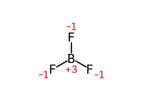 | Boron trifluoride BF₃ | F −1 · B +3 | trigonal planar, Lewis acid |
| 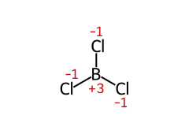 | Boron trichloride BCl₃ | Cl −1 · B +3 | trigonal planar |
| 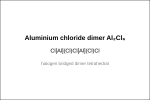 | Aluminium chloride dimer Al₂Cl₆ | Cl −2, −1 (avg −6⁄5) · Al +3 | halogen bridged dimer tetrahedral |
| 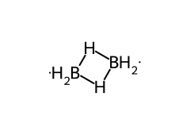 | Diborane B₂H₆ | — | the two bridging 3c-2e B–H–B bonds are drawn; O.S. omitted, a banana bond has no single O.S. |
| 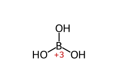 | Boric acid H₃BO₃ | B +3 | layered H-bonded BO3 triangles |
| ![Borax anion [B₄O₅(OH)₄]²⁻](mol/borax.svg) | Borax anion [B₄O₅(OH)₄]²⁻ | B +3 | tetranuclear: two trigonal BO₃ and two tetrahedral BO₄ boron |
| 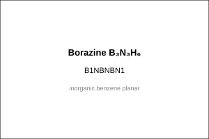 | Borazine B₃N₃H₆ | B +3 · N −3 | inorganic benzene planar |
| 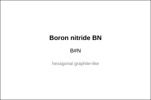 | Boron nitride BN | B +3 · N −3 | hexagonal graphite-like |
| 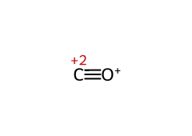 | Carbon monoxide CO | C +2 | :C≡O: 112.8 pm toxic |
| 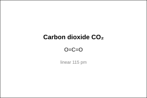 | Carbon dioxide CO₂ | C +4 | linear 115 pm |
| 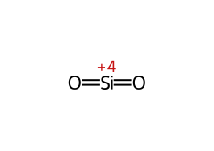 | Silicon dioxide SiO₂ | Si +4 | 3D tetrahedral network quartz |
| 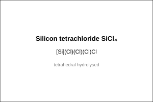 | Silicon tetrachloride SiCl₄ | Si +4 · Cl −1 | tetrahedral hydrolysed |
| 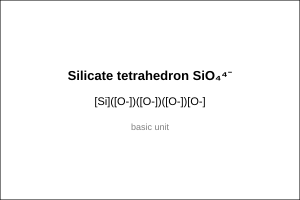 | Silicate tetrahedron SiO₄⁴⁻ | Si +4 | basic unit |
| 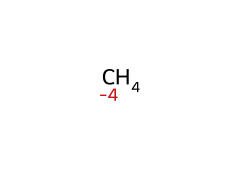 | Methane CH₄ | C −4 | tetrahedral |
| 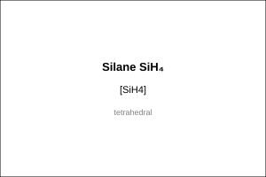 | Silane SiH₄ | Si −4 | tetrahedral |
| 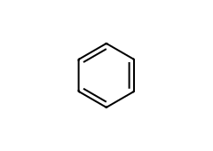 | Aromatic C₆ ring — the sp² unit | — | every C is sp² with one π electron delocalised; graphite, graphene and the C₆₀ wall are all built from such rings |
<!-- gallery:end -->

<!-- smiles:begin -->
```smiles
FB(F)F
ClB(Cl)Cl
Cl[Al](Cl)Cl[Al](Cl)Cl
[BH2]1[H][BH2][H]1
OB(O)O
[H]OB1OB(O[H])O[B-]2(O[H])O[B-](O[H])(O1)O2
B1NBNBN1
B#N
[C-]#[O+]
O=C=O
O=[Si]=O
[Si](Cl)(Cl)(Cl)Cl
[Si]([O-])([O-])([O-])[O-]
C
[SiH4]
c1ccccc1
```
<!-- smiles:end -->
