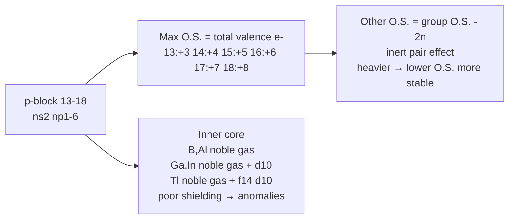
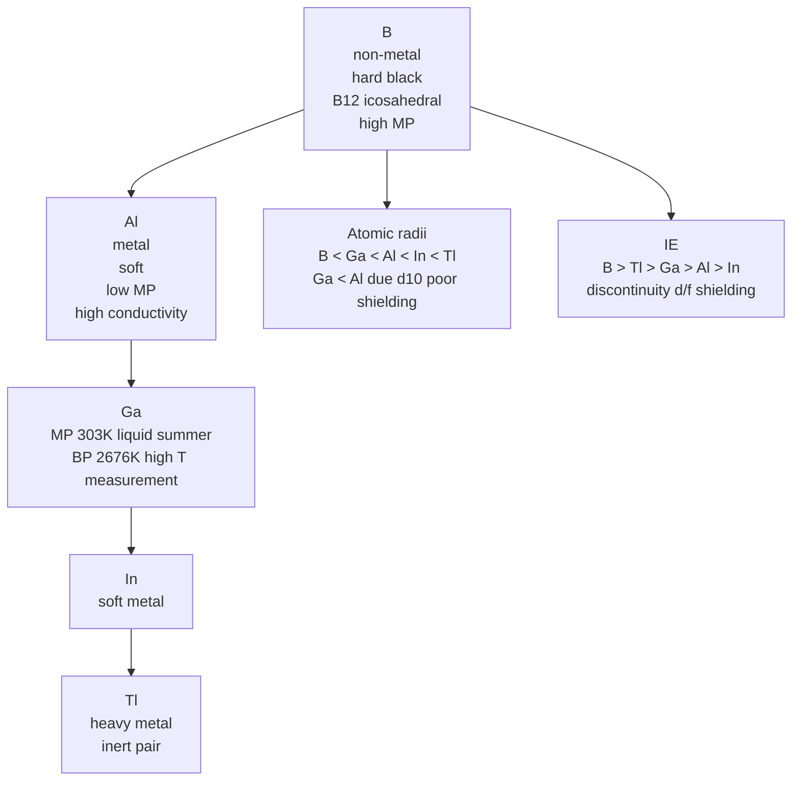
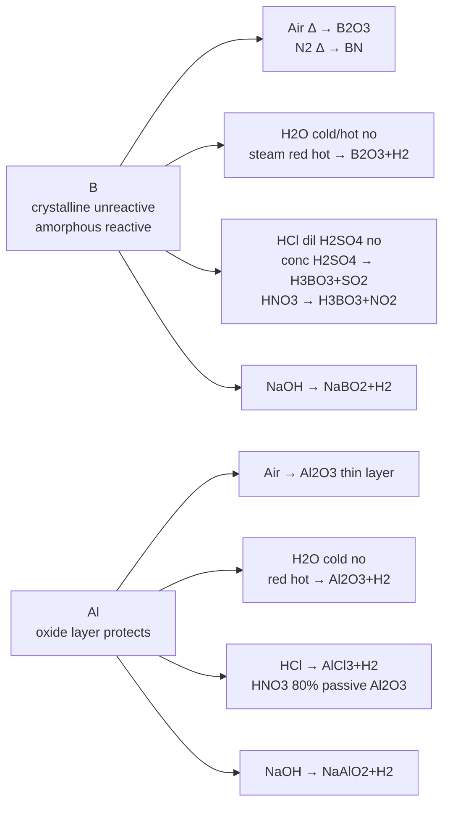
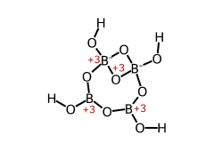
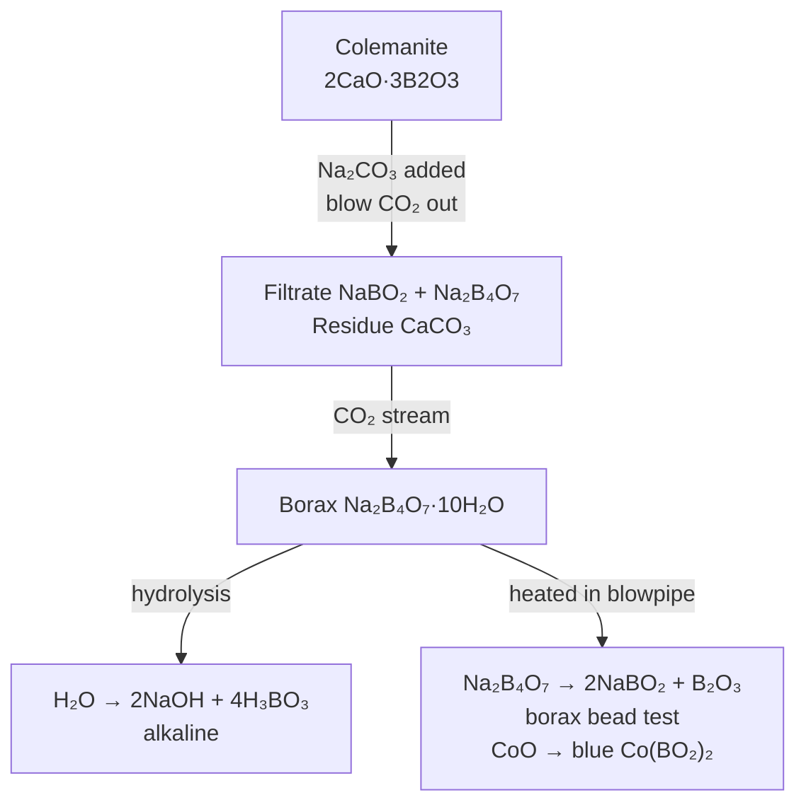
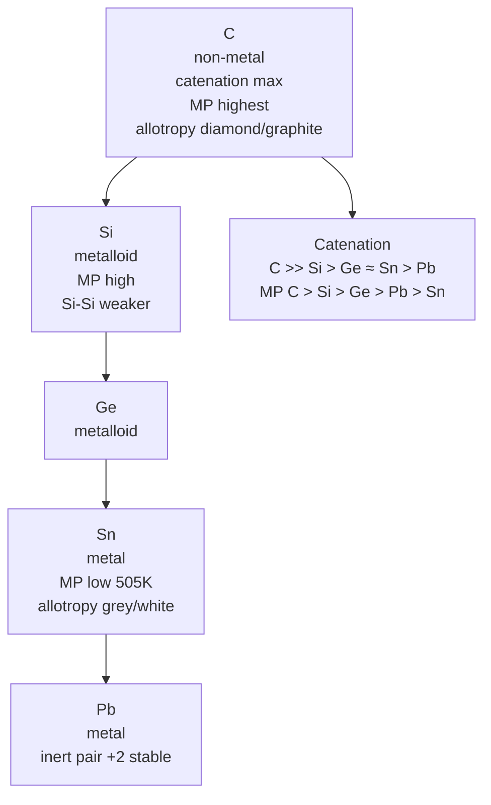
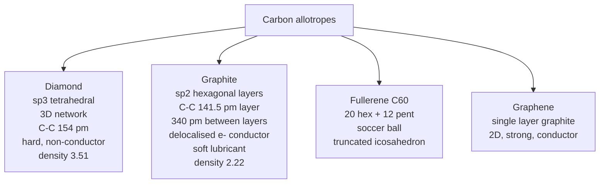
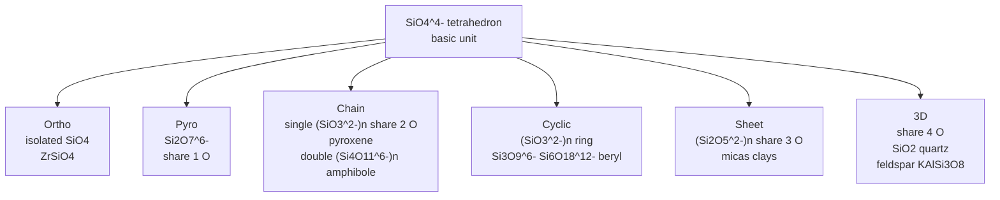
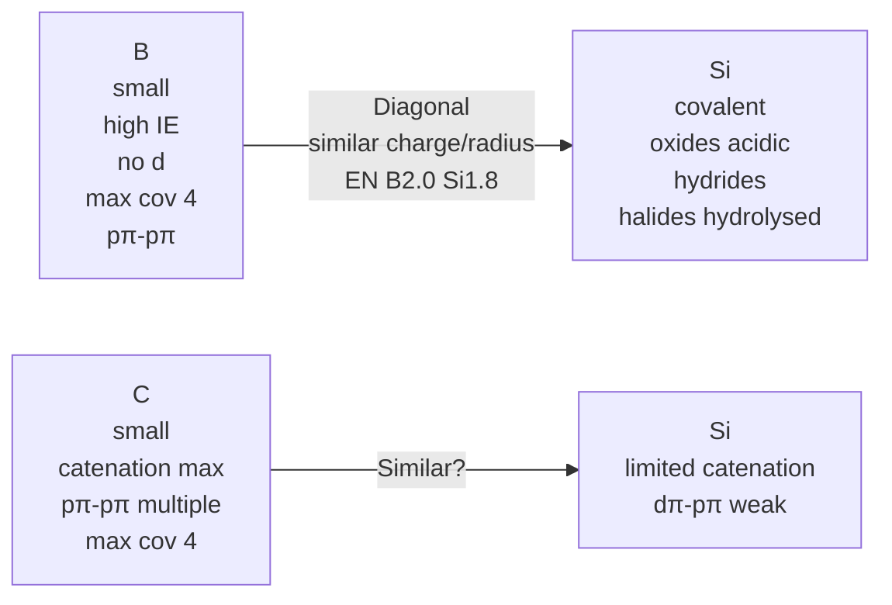

# The p-Block Elements (Groups 13 & 14) — JEE Advanced Notes

> **Sources merged into these notes**
> | Source | File |
> |---|---|
> | NCERT Class XI (pre-rationalised 2018-19), Unit 11 — Groups 13 & 14 | [`kech204-legacy.pdf`](kech204-legacy.pdf) |
> | Allen — p-Block module (Enthusiast, English, 92 pages, Groups 13-18) — Group 13-14 portion | [`p-block_Theory_26.pdf`](p-block_Theory_26.pdf) |
>
> 🅰 = Allen-only content; 🆇 = extra JEE-Advanced bridging point; ⚠ = trap.

## Contents

- [Part A — General Trends of p-Block](#part-a--general-trends-of-p-block)
  1. [Introduction & Electronic Configuration](#1-introduction--electronic-configuration)
  2. [Oxidation States & Inert Pair Effect](#2-oxidation-states--inert-pair-effect)
  3. [Anomalous Behaviour of First Member & pπ-pπ Bonding](#3-anomalous-behaviour-of-first-member--pπ-pπ-bonding)
- [Part B — Group 13: Boron Family](#part-b--group-13-boron-family)
  4. [Occurrence & Electronic Config (11.1)](#4-occurrence--electronic-config-111)
  5. [Atomic Radii, Ionic Radii, IE, Electronegativity](#5-atomic-radii-ionic-radii-ie-electronegativity)
  6. [Physical Properties — MP/BP, Density, Metallic Character](#6-physical-properties--mpbp-density-metallic-character)
  7. [Chemical Properties — Oxidation States, Lewis Acidity, Hydrolysis](#7-chemical-properties--oxidation-states-lewis-acidity-hydrolysis)
  8. [Reactivity Towards Air, Water, Acids, Alkalis, Halogens](#8-reactivity-towards-air-water-acids-alkalis-halogens)
  9. [Preparation of Boron & Aluminium](#9-preparation-of-boron--aluminium)
  10. [Important Compounds of Boron — Borax, Boric Acid, Diborane, Borazine, BN](#10-important-compounds-of-boron--borax-boric-acid-diborane-borazine-bn)
  11. [Compounds of Aluminium — Al₂O₃, AlCl₃, Alums](#11-compounds-of-aluminium--al₂o₃-alcl₃-alums)
- [Part C — Group 14: Carbon Family](#part-c--group-14-carbon-family)
  12. [Occurrence & Electronic Config (11.2)](#12-occurrence--electronic-config-112)
  13. [Atomic Radii, IE, Electronegativity, Physical Properties](#13-atomic-radii-ie-electronegativity-physical-properties)
  14. [Chemical Properties — Catenation, Oxidation States, Reactivity](#14-chemical-properties--catenation-oxidation-states-reactivity)
  15. [Allotropes of Carbon — Diamond, Graphite, Fullerenes, Graphene](#15-allotropes-of-carbon--diamond-graphite-fullerenes-graphene)
  16. [Important Compounds of Carbon — CO, CO₂, Carbonates](#16-important-compounds-of-carbon--co-co₂-carbonates)
  17. [Silicon & Its Compounds — SiO₂, Silicates, Silicones, SiCl₄, Zeolites](#17-silicon--its-compounds--sio₂-silicates-silicones-sicl₄-zeolites)
  18. [Anomalous Behaviour & Diagonal Relationship](#18-anomalous-behaviour--diagonal-relationship)
  19. [Uses of Group 13 & 14 Elements](#19-uses-of-group-13--14-elements)
  20. [Quick Revision Sheet](#20-quick-revision-sheet)

---

# Part A — General Trends of p-Block

## 1. Introduction & Electronic Configuration

Answer-first: p-block elements have last electron entering outermost p orbital, 6 groups 13-18, valence $\ce{ns^2 np^{1-6}}$ (He $\ce{1s^2}$), inner core differs → variation in properties, maximum oxidation state = total valence electrons.

| Group | General config | First member | Group oxidation state | Other oxidation states |
|---|---|---|---|---|
| 13 | $\ce{ns^2 np^1}$ | B | +3 | +1 |
| 14 | $\ce{ns^2 np^2}$ | C | +4 | +2, -4 |
| 15 | $\ce{ns^2 np^3}$ | N | +5 | +3, -3 |
| 16 | $\ce{ns^2 np^4}$ | O | +6 | +4, +2, -2 |
| 17 | $\ce{ns^2 np^5}$ | F | +7 | +5, +3, +1, -1 |
| 18 | $\ce{ns^2 np^6}$ | He | +8 | — |

- Inner core: B, Al have noble gas core; Ga, In have noble gas + 10 d-electrons; Tl has noble gas + 14 f + 10 d. Difference affects properties.
- Non-metals and metalloids exist only in p-block; non-metallic character decreases down group, heaviest most metallic.

*Group 13–18 in one picture: the maximum oxidation state, the inert-pair effect, and the inner-core configurations behind the anomalies.*

## 2. Oxidation States & Inert Pair Effect

- In B, C, N families group O.S. most stable for lighter elements; O.S. two less than group O.S. becomes progressively more stable for heavier elements.
- **Inert pair effect:** ns² electrons become inert due to poor shielding of intervening d/f orbitals, increased effective nuclear charge holds ns electrons tightly, only p electrons participate. Relative stability +1 increases: $\ce{Al < Ga < In < Tl}$; Tl +1 predominant, +3 highly oxidising.
- Compounds in +1 more ionic than +3.

## 3. Anomalous Behaviour of First Member & pπ-pπ Bonding

First member differs in two major respects:

1. **Size** and properties dependent on size — same as Li, Be in s-block.
2. **d-orbitals:** Second period elements restricted to max covalence 4 (2s + 2p). Third period have vacant 3d between 3p and 4s, can expand covalence >4: B forms $\ce{[BF4]-}$, Al forms $\ce{[AlF6]^{3-}}$.

**pπ-pπ multiple bonding:** First member can form pπ-pπ multiple bonds to itself ($\ce{C=C, C≡C, N≡N}$) and to other second row ($\ce{C=O, C=N, C≡N, N=O}$). Heavier p-block forms π bonds via d orbitals (dπ-pπ or dπ-dπ), higher energy, less stable. Coordination number in heavier may be higher: N in $\ce{NO3-}$ 3-coordination with pπ bond, P in $\ce{PO4^{3-}}$ 4-coordination with s,p,d π.

---

# Part B — Group 13: Boron Family

## 4. Occurrence & Electronic Config (11.1)

Boron fairly rare: orthoboric acid $\ce{H3BO3}$, borax $\ce{Na2B4O7.10H2O}$, kernite $\ce{Na2B4O7.4H2O}$, in India Puga Valley (Ladakh) & Sambhar Lake (Rajasthan), abundance <0.0001% crust, isotopes ¹⁰B 19% ¹¹B 81%.

Aluminium most abundant metal, third most abundant element crust 8.3% after O 45.5% Si 27.7%, bauxite $\ce{Al2O3.2H2O}$, cryolite $\ce{Na3AlF6}$, in India mica MP, Karnataka, Orissa, Jammu. Ga, In, Tl less abundant. Nihonium Nh 113, atomic mass 286, config [Rn]5f¹⁴6d¹⁰7s²7p², half-life 20 sec, chemistry not established — synthetic radioactive.

Electronic config outer $\ce{ns^2 np^1}$; close look: B, Al noble gas core, Ga, In noble gas + 10 d, Tl noble gas + 14 f + 10 d → more complex than s-block.

## 5. Atomic Radii, Ionic Radii, IE, Electronegativity

**Atomic radii:** On moving down, one extra shell added → expected increase, but deviation observed.

| Order | Sequence |
|---|---|
| Atomic radii | $\ce{B < Ga < Al < In < Tl}$ |
| Ionic radii (+3) | $\ce{B < Al < Ga < In < Tl}$ |

- Ga atomic radius 135 pm < Al 143 pm due to poor shielding of 10 d-electrons, increased nuclear charge.

**Ionization enthalpy:** Does not decrease smoothly down group.

Order: $\ce{B > Tl > Ga > Al > In}$

- Decrease B→Al due size increase; discontinuity Al→Ga and In→Tl due inability of d/f electrons low shielding to compensate nuclear charge increase.
- Order $\ce{ΔiH1 < ΔiH2 < ΔiH3}$, sum of first three very high → affects chemical properties.

**Electronegativity:** Down group first decreases B→Al then increases marginally due atomic size discrepancies.

## 6. Physical Properties — MP/BP, Density, Metallic Character

| Property | Trend |
|---|---|
| Boron | Non-metallic, extremely hard black solid, many allotropes, very strong crystalline lattice → unusually high MP |
| Rest | Soft metals low MP high electrical conductivity |
| Ga | Unusually low MP 303 K → liquid in summer, high BP 2676 K → useful for high T measurement |
| Density | Increases B → Tl |
| MP order | $\ce{B > Al > Tl > In > Ga}$ |
| BP order | $\ce{B > Al > Ga > In > Tl}$ |
| Electropositive character | Less electropositive due high IE, metallic character increases down: $\ce{B < Al > Ga > In > Tl}$ but B non-metal others metals |

🅰 **Boron allotropy:** All allotropes have basic building $\ce{B12}$ icosahedral units polyhedron 20 faces 12 corners, simplest α-rhombohedral boron. Al, In, Tl have close-packed metal structure.

*The Group 13 physical properties do not decrease smoothly — the d¹⁰ contraction makes Ga smaller and Tl heavier than expected.*

## 7. Chemical Properties — Oxidation States, Lewis Acidity, Hydrolysis

**(i) Oxidation states:**

- B sum first three IE very high → prevents +3 ions, forms only covalent. Al sum decreases considerably → able to form $\ce{Al^{3+}}$, highly electropositive.
- Down group poor shielding d/f → increased effective nuclear charge holds ns² tightly (inert pair) → only p electrons in bonding → Ga, In, Tl both +1 and +3 observed, stability +1 increases $\ce{Al < Ga < In < Tl}$, Tl +1 predominant, +3 highly oxidising.
- Compounds +1 more ionic than +3.

**(ii) Trivalent state electron-deficient:**

Number of electrons around central atom in $\ce{BF3}$ only 6 → tendency to accept pair → Lewis acid, tendency decreases down group size increases.

$\ce{BCl3 + NH3 -> BCl3.NH3}$ planar → tetrahedral

$\ce{AlCl3}$ achieves stability by dimer $\ce{Al2Cl6}$ halogen bridged tetrahedral, metal completes octet accepting electrons from halogen.

**(iii) Hydrolysis:** In trivalent state most compounds covalent hydrolysed in water, trichlorides hydrolyse to tetrahedral $\ce{[M(OH)4]-}$ sp³, AlCl₃ in acidified aqueous forms octahedral $\ce{[Al(H2O)6]^{3+}}$ sp³d².

## 8. Reactivity Towards Air, Water, Acids, Alkalis, Halogens

| Reactant | Boron | Aluminium |
|---|---|---|
| Air (crystalline B unreactive, amorphous B + Al on heating) | $\ce{4B + 3O2 -> 2B2O3}$ | $\ce{4Al + 3O2 -> 2Al2O3}$ thin oxide layer protects |
| $\ce{N2}$ high T | $\ce{2B + N2 -> 2BN}$ | $\ce{2Al + N2 -> 2AlN}$ |
| Water cold/hot | No reaction | No reaction (oxide layer) |
| Steam red hot | $\ce{2B + 3H2O -> B2O3 + 3H2}$ | $\ce{2Al + 3H2O -> Al2O3 + 3H2}$ (red hot) Actually $\ce{2Al + 3H2O -> Al2O3 + 3H2}$ |
| HCl | No reaction | $\ce{2Al + 6HCl -> 2AlCl3 + 3H2}$ |
| dil $\ce{H2SO4}$ | No reaction | $\ce{2Al + 3H2SO4 -> Al2(SO4)3 + 3H2}$ |
| conc $\ce{H2SO4}$ | $\ce{2B + 3H2SO4 -> 2H3BO3 + 3SO2}$ | $\ce{2Al + 6H2SO4 -> Al2(SO4)3 + 3SO2 + 6H2O}$ |
| $\ce{HNO3}$ | $\ce{B + 3HNO3 -> H3BO3 + 3NO2}$ | $\ce{Al + HNO3 (80%) -> Al2O3}$ passive layer no further reaction |
| NaOH | $\ce{2B + 2NaOH + 2H2O -> 2NaBO2 + 3H2}$ | $\ce{2Al + 2NaOH + 2H2O -> 2NaAlO2 + 3H2}$ sodium meta-aluminate |
| C | $\ce{4B + C -> B4C}$ | $\ce{4Al + 3C -> Al4C3}$ |
| Mg | $\ce{3Mg + 2B -> Mg3B2}$ | — |

Oxides nature varies: $\ce{B2O3}$ acidic → reacts with basic oxides forming metal borates; $\ce{Al2O3}$, $\ce{Ga2O3}$ amphoteric; $\ce{In2O3}$, $\ce{Tl2O3}$ basic.

*Boron and aluminium against air, water, acids and alkalis — the amphoterism that defines the group.*

## 9. Preparation of Boron & Aluminium

**Boron:**

$\ce{Na2B4O7 + HCl/H2SO4 -> NaX + H2B4O7}$

$\ce{H2B4O7 + 5H2O -> 4H3BO3 ->[Δ] B2O3 + 3H2O}$

Reduction: $\ce{B2O3 + Na/K/Mg/Al -> B + Na2O/K2O/MgO/Al2O3}$

**Aluminium:** Hall-Héroult electrolysis of $\ce{Al2O3}$ in cryolite, or from bauxite via Bayer process.

🅰 Allen details for Al: bright silvery-white, high tensile strength, high electrical/thermal conductivity, low density, forms alloys.

## 10. Important Compounds of Boron — Borax, Boric Acid, Diborane, Borazine, BN

### Borax $\ce{Na2B4O7.10H2O}$

**Preparation from colemanite:**

$\ce{2CaO.3B2O3 (colemanite) + 2Na2CO3 -> 2CaCO3 v + Na2B4O7 + 2NaBO2}$

Filtered $\ce{CaCO3}$ residue, $\ce{NaBO2}$ in filtrate concentrated, crystallise, filtered $\ce{Na2B4O7 + NaBO2}$ in solution, $\ce{CO2}$ passed, crystallise again $\ce{Na2B4O7.10H2O}$ as residue via $\ce{4NaBO2 + CO2 -> Na2B4O7 + Na2CO3}$.

**Properties:**

- White crystalline solid, actually contains tetranuclear units $\ce{[B4O5(OH)4]^{2-}}$ correct formula $\ce{Na2[B4O5(OH)4].8H2O}$.
- Dissolves water alkaline: $\ce{Na2B4O7 + 7H2O -> 2NaOH + 4H3BO3}$
- On heating loses water swells, further heating transparent liquid solidifies glass-like **borax bead**: $\ce{Na2B4O7.10H2O -> Na2B4O7 ->[Δ] 2NaBO2 + B2O3}$ sodium metaborate + boric anhydride. Metaborates of transition metals characteristic colours → borax bead test for identification: CoO on Pt loop heated with borax → blue $\ce{Co(BO2)2}$ bead.

*Borax — tetranuclear [B₄O₅(OH)₄]²⁻ — actual structure Na₂[B₄O₅(OH)₄].8H₂O.*

*Borax from colemanite, and the borax bead test that identifies a metal by the colour of its metaborate.*

### Orthoboric acid $\ce{H3BO3}$ / $\ce{B(OH)3}$

**Preparation:**

$\ce{Na2B4O7 + 2HCl + 5H2O -> 2NaCl + 4B(OH)3}$

Also hydrolysis of most B compounds (halides, hydrides).

**Properties:**

- White crystalline solid soapy touch, sparingly soluble cold water highly soluble hot water.
- Soluble water behaves as weak monobasic acid, does NOT donate protons, accepts $\ce{OH-}$ → Lewis acid: $\ce{B(OH)3 + 2H2O ⇌ H3O+ + [B(OH)4]-}$ or $\ce{H3BO3}$.
- Since only partially reacts, weak acid cannot be titrated satisfactorily with NaOH sharp endpoint not obtained. If polyhydroxy compounds glycerol, mannitol, sugar added (cis diol) → behaves as strong monobasic acid, can be titrated with NaOH phenolphthalein: $\ce{B(OH)3 + NaOH -> Na[B(OH)4]}$ → $\ce{NaBO2 + 2H2O}$. Added cis diol forms very stable complexes with $\ce{[B(OH)4]-}$ removing it → forward reaction Le Chatelier.
- Structure: layered, $\ce{B(OH)3}$ units H-bonded, planar $\ce{BO3}$ triangles.

*Boric acid H₃BO₃ — layered H-bonded, Lewis acid B(OH)₃.*

**Uses:** Antiseptic, eye wash, glass, glazes.

### Diborane $\ce{B2H6}$

**Preparation:**

$\ce{4BF3 + 3LiAlH4 -> 2B2H6 + 3LiF + 3AlF3}$ (lab)

$\ce{2NaBH4 + I2 -> B2H6 + 2NaI + H2}$

$\ce{BF3 + NaBH4 -> ...}$

Industrial: $\ce{2BF3 + 6NaH ->[450K] B2H6 + 6NaF}$

**Structure:** Banana bonds, 2 centre-2 electron terminal B-H, 3 centre-2 electron bridging B-H-B, $\ce{D2h}$? Actually $\ce{B2H6}$ has 4 terminal H, 2 bridging H, B-B 177 pm, B-H terminal 119 pm, bridging 133 pm, angle.

*Diborane B₂H₆ — 2c-2e terminal + 3c-2e bridging banana bonds.*

**Properties:**

- Colourless highly toxic gas, b.p. 180 K, catches fire spontaneously in air, hydrolysed water: $\ce{B2H6 + 6H2O -> 2B(OH)3 + 6H2}$
- Reaction with Lewis bases: $\ce{B2H6 + 2NH3 -> [BH2(NH3)2]+[BH4]-}$ → on heating borazine; $\ce{B2H6 + 2CO -> 2BH3CO}$; $\ce{B2H6 + 2Me3N -> 2BH3.NMe3}$
- As Lewis acid: $\ce{B2H6 + 2LiH -> 2LiBH4}$

**Uses:** Reducing agent, rocket propellant, synthesis of other boranes, semiconductor doping.

### Borazine $\ce{B3N3H6}$ — Inorganic benzene

$\ce{3B2H6 + 6NH3 -> 2B3N3H6 + 12H2}$ at 473 K

Structure: planar hexagonal ring alternating B-N, B-N 144 pm, isoelectronic with benzene, aromatic? Less aromatic due polarity, reacts addition.

*Borazine B₃N₃H₆ — inorganic benzene, planar.*

*The benzene ring it is isoelectronic with — the B–N ring of borazine has the same skeleton, but
the polar B–N bonds delocalise the π electrons less evenly, so it is much less aromatic.*

### Boron Nitride BN

$\ce{B2O3 + 2NH3 ->[Δ] 2BN + 3H2O}$ — hard, high MP, similar to graphite hexagonal BN (soft lubricant) and cubic BN (hard as diamond).

### Boron Carbide $\ce{B4C}$ — hardest after diamond, used as abrasive, armour.

## 11. Compounds of Aluminium — Al₂O₃, AlCl₃, Alums

**Aluminium oxide $\ce{Al2O3}$ (alumina):** Amphoteric, corundum, very hard, high MP, $\ce{Al2O3 + 6HCl -> 2AlCl3 + 3H2O}$, $\ce{Al2O3 + 2NaOH -> 2NaAlO2 + H2O}$.

**Aluminium chloride $\ce{AlCl3}$:**

Anhydrous: $\ce{2Al + 3Cl2 -> 2AlCl3}$, $\ce{Al2O3 + 3C + 3Cl2 -> 2AlCl3 + 3CO}$

Structure: dimer $\ce{Al2Cl6}$ in vapour and non-polar solvents, halogen bridged tetrahedral Al, 101° and 79° angles, 118° etc. In aqueous acidified forms octahedral $\ce{[Al(H2O)6]^{3+}}$ sp³d².

*Al₂Cl₆ — dimer halogen bridged tetrahedral.*

Uses: Lewis acid catalyst Friedel-Crafts.

**Alums:** General formula $\ce{M2SO4.M'2(SO4)3.24H2O}$ where M monovalent $\ce{Na+, K+}$, M' trivalent $\ce{Al^{3+}, Cr^{3+}, Fe^{3+}}$, e.g., potash alum $\ce{K2SO4.Al2(SO4)3.24H2O}$.

---

# Part C — Group 14: Carbon Family

## 12. Occurrence & Electronic Config (11.2)

Group 14: C, Si, Ge, Sn, Pb, Fl (flerovium 114, synthetic). C 0.02% crust, Si 27.7% second most abundant, Ge, Sn, Pb less.

Electronic config outer $\ce{ns^2 np^2}$.

## 13. Atomic Radii, IE, Electronegativity, Physical Properties

**Atomic radii:** Increases down group but not regular due d/f shielding.

Order atomic: $\ce{C < Si < Ge < Sn < Pb}$ but Ge < Si? Actually $\ce{C 77, Si 118, Ge 122, Sn 140, Pb 146}$ pm.

**Ionization enthalpy:** Decreases down but not smoothly.

**Electronegativity:** Due small size elements slightly more electronegative than expected, decreases down but not much.

**Physical properties:**

- MP order: $\ce{C > Si > Ge > Pb > Sn}$ (Sn low due different structure)
- BP order: $\ce{Si > Ge > Sn > Pb}$ (C sublimes)
- Density increases down.
- Metallic character increases down: C non-metal, Si, Ge metalloids, Sn, Pb metals.
- Catenation: Ability to form bonds with itself, max in C, decreases down $\ce{C >> Si > Ge ≈ Sn > Pb}$ due to bond strength and size. C forms long chains, branched, rings; Si limited catenation due weaker Si-Si.
- Allotropy: C shows diamond, graphite, fullerenes; Si amorphous and crystalline; Ge, Sn also.

*Group 14 down the table: catenation and melting point both peak at carbon and collapse by lead.*

## 14. Chemical Properties — Catenation, Oxidation States, Reactivity

**Oxidation states:** Group O.S. +4, other +2 due inert pair, stability +2 increases down $\ce{Ge < Sn < Pb}$, Pb +2 predominant, +4 oxidising; C, Si +4 stable, Ge +4, Sn +2/+4 both, Pb +2.

Compounds +4 covalent, +2 ionic character more.

**Reactivity:**

- Towards $\ce{O2}$: $\ce{C + O2 -> CO2}$, $\ce{2C + O2 -> 2CO}$ (limited O2); $\ce{Si + O2 -> SiO2}$; $\ce{Ge, Sn, Pb + O2 -> MO2}$ (MO also).
- Towards $\ce{H2O}$: C, Si, Ge not affected water; Sn decomposes steam $\ce{Sn + 2H2O -> SnO2 + 2H2}$; Pb unaffected (oxide layer).
- Towards halogens: $\ce{M + 2X2 -> MX4}$ (C, Si, Ge, Sn) except $\ce{Pb + X2 -> PbX2}$ (+2); $\ce{MX4}$ tetrahedral, covalent except $\ce{SnF4, PbF4}$ ionic.
- Towards acids: C not affected, Si with HF? Actually $\ce{Si + 4HF -> SiF4 + 2H2}$? No, Si with HF + HNO3. Sn, Pb with acids.

## 15. Allotropes of Carbon — Diamond, Graphite, Fullerenes, Graphene

**Diamond:** sp³ hybridized C, tetrahedral network, each C bonded to 4 C, 3D giant molecule, C-C 154 pm, very hard, high MP 4373 K, high density 3.51 g/cm³, non-conductor (no free e⁻), transparent, used as abrasive, jewellery, cutting.

**Graphite:** sp² hybridized C, layered hexagonal rings, each layer 2D sheet, C-C 141.5 pm within layer, layers held by van der Waals 340 pm, each C bonded to 3 C, 4th electron delocalised → conductor (parallel to layers), soft lubricant (layers slide), black opaque, density 2.22 g/cm³, used as electrode, lubricant, moderator.

**Fullerenes:** $\ce{C60}$ buckminsterfullerene, 60 C atoms arranged as 20 hexagons + 12 pentagons, truncated icosahedron, soccer ball, C-C 143.5 pm, aromatic, discovered 1985, $\ce{C70}$ etc.

**Graphene:** Single layer of graphite, 2D, sp², extremely strong, conductor, 1 atom thick.

**Other:** Carbon black, charcoal, coke.

*The four carbon allotropes side by side — bonding, bond length, and what that does to hardness and conductivity.*

## 16. Important Compounds of Carbon — CO, CO₂, Carbonates

**Carbon monoxide CO:**

Preparation: $\ce{HCOOH ->[conc H2SO4][Δ] CO + H2O}$; $\ce{C + H2O -> CO + H2}$ water gas; $\ce{2C + O2 -> 2CO}$ limited O₂.

Properties: Colourless odourless highly toxic (binds haemoglobin 300× more than O₂), neutral oxide, burns blue flame $\ce{2CO + O2 -> 2CO2}$, reducing agent $\ce{Fe2O3 + 3CO -> 2Fe + 3CO2}$.

Structure: $\ce{:C≡O:}$ with 3 bonds, one dative, bond length 112.8 pm, sp hybridized.

*CO — :C≡O: triple bond, 112.8 pm, toxic.*

**Carbon dioxide CO₂:**

Preparation: $\ce{CaCO3 ->[Δ] CaO + CO2}$; $\ce{Na2CO3 + 2HCl -> 2NaCl + H2O + CO2}$; combustion C.

Properties: Colourless odourless gas, acidic oxide $\ce{CO2 + H2O -> H2CO3}$, dry ice solid sublimes, does not support combustion, used fire extinguisher, greenhouse gas.

Structure: Linear $\ce{O=C=O}$, sp hybridized C, C-O 115 pm, non-polar but polar bonds.

*CO₂ — linear O=C=O, 115 pm.*

**Carbonates:** $\ce{CO3^{2-}}$ trigonal planar, $\ce{H2CO3}$ weak diprotic acid, bicarbonates $\ce{MHCO3}$ soluble (except?), carbonates of alkali metals soluble, others insoluble.

## 17. Silicon & Its Compounds — SiO₂, Silicates, Silicones, SiCl₄, Zeolites

**Silicon:** Second most abundant, exists as silica $\ce{SiO2}$ and silicates, prepared $\ce{SiO2 + 2C -> Si + 2CO}$ in electric furnace, or $\ce{SiCl4 + 2Mg -> Si + 2MgCl2}$, purified via zone refining.

**Silica $\ce{SiO2}$ (silicon dioxide):** Giant 3D network each Si tetrahedrally surrounded by 4 O, each O bonded to 2 Si, high MP, quartz, cristobalite, tridymite polymorphs, amorphous glass. Reacts with HF: $\ce{SiO2 + 4HF -> SiF4 + 2H2O}$, with NaOH: $\ce{SiO2 + 2NaOH -> Na2SiO3 + H2O}$.

*SiO₂ — 3D tetrahedral network, quartz.*

**Silicates:** Metal derivatives of silicic acid $\ce{H4SiO4}$, basic unit $\ce{SiO4^{4-}}$ tetrahedron. Types based on sharing O:

- Orthosilicates: isolated $\ce{SiO4^{4-}}$ e.g., $\ce{ZrSiO4}$ zircon
- Pyrosilicates: $\ce{Si2O7^{6-}}$ two tetrahedra share one O e.g., $\ce{Sc2Si2O7}$ thortveitite
- Chain silicates: share 2 O, single chain $\ce{(SiO3^{2-})n}$ e.g., pyroxenes, double chain $\ce{(Si4O11^{6-})n}$ e.g., amphiboles
- Cyclic: $\ce{(SiO3^{2-})n}$ ring e.g., $\ce{Si3O9^{6-}}$, $\ce{Si6O18^{12-}}$ beryl $\ce{Be3Al2Si6O18}$
- Sheet: share 3 O, $\ce{(Si2O5^{2-})n}$ e.g., micas, clays
- 3D: share 4 O, $\ce{SiO2}$ quartz, feldspars $\ce{KAlSi3O8}$.

*Silicate structures classified purely by how many corners of the SiO₄ tetrahedron are shared.*

**Silicones:** Organosilicon polymers $\ce{(R2SiO)n}$ where R alkyl/aryl, general $\ce{R2SiCl2}$ hydrolysis → $\ce{R2Si(OH)2}$ → condensation → silicone. Properties: water repellent, high thermal stability, chemically inert, used as sealant, grease, electrical insulator, water-proofing.

Preparation: $\ce{2CH3Cl + Si ->[Cu][573K] (CH3)2SiCl2}$ then $\ce{(CH3)2SiCl2 + 2H2O -> (CH3)2Si(OH)2 + 2HCl}$ → polymerisation → $\ce{[(CH3)2SiO]n}$ + $\ce{H2O}$.

**Silicon tetrachloride $\ce{SiCl4}$:** $\ce{Si + 2Cl2 -> SiCl4}$, tetrahedral, covalent, hydrolysed $\ce{SiCl4 + 2H2O -> SiO2 + 4HCl}$.

*SiCl₄ — tetrahedral, hydrolysed.*

**Zeolites:** Aluminosilicates 3D network $\ce{[AlSiO4]-}$ with $\ce{Na+, K+, Ca2+}$ balancing, general $\ce{Mx/n[(AlO2)x(SiO2)y].zH2O}$, honeycomb structure with cavities, used as molecular sieves, water softening (permutit), catalyst (ZSM-5 converts alcohols to gasoline), e.g., $\ce{Na2Al2Si2O8.xH2O}$.

## 18. Anomalous Behaviour & Diagonal Relationship

**Anomalous B:** Small size, high IE, high electronegativity, absence d-orbitals → max covalence 4, forms electron-deficient compounds, Lewis acid, high MP, forms only covalent.

**Anomalous C:** Small size, high electronegativity, high IE, absence d-orbitals, max covalence 4, forms pπ-pπ multiple bonds, catenation max, allotropy.

**Diagonal relationship:**

- **B–Si:** Both have similar electronegativity (B 2.0, Si 1.8), similar charge/radius, both form covalent, both have similar oxides $\ce{B2O3, SiO2}$ acidic, both form hydrides $\ce{B2H6, SiH4}$, halides hydrolysed, both form carbides $\ce{B4C, SiC}$ hard.
- **C–P?** Not.
- **Be–Al** (s-block diagonal) already.

*Why boron and carbon both differ from silicon, and why silicon nevertheless shows a diagonal relationship to both.*

## 19. Uses of Group 13 & 14 Elements

| Element | Uses |
|---|---|
| Boron | Borax, boric acid antiseptic, borosilicate glass, hard $\ce{B4C}$ abrasive, $\ce{BN}$ lubricant, control rods in nuclear reactor (¹⁰B absorbs neutrons) |
| Aluminium | Alloys, aerospace, packaging, conductor, utensils, construction |
| Carbon | Diamond jewellery cutting, graphite electrode lubricant moderator, coke fuel reducing agent, carbon black filler, charcoal |
| Silicon | Semiconductors, transistors, chips, solar cells, alloys, silicones, glass, cement, ceramics, zeolites |

---

## 20. Quick Revision Sheet

- p-block: 13-18, ns²np¹⁻⁶, inner core differs B/Al noble gas, Ga/In d¹⁰, Tl f¹⁴d¹⁰ poor shielding → anomalies, max O.S. = total valence e⁻, other O.S. = group -2n inert pair.
- First member anomalous: small size, high IE/EN, no d → max cov 4, pπ-pπ multiple bonds $\ce{C=C, C≡C, N≡N, C=O}$, heavier dπ-pπ weak, coordination higher.
- Group 13: B rare $\ce{H3BO3, Na2B4O7.10H2O}$, Al abundant 8.3% bauxite $\ce{Al2O3.2H2O}$ cryolite $\ce{Na3AlF6}$; config ns²np¹; atomic radii $\ce{B<Ga<Al<In<Tl}$ Ga<Al d¹⁰ poor shielding 135 vs 143 pm; ionic +3 $\ce{B<Al<Ga<In<Tl}$; IE $\ce{B>Tl>Ga>Al>In}$ discontinuity d/f; EN B→Al ↓ then ↑ marginally; physical B non-metal hard black B12 icosahedral high MP, rest soft metals low MP Ga 303K liquid summer BP 2676K high T measurement, density B→Tl ↑, MP $\ce{B>Al>Tl>In>Ga}$ BP $\ce{B>Al>Ga>In>Tl}$, metallic $\ce{B<Al>Ga>In>Tl}$; chemical O.S. +3 +1 inert pair stability +1 $\ce{Al<Ga<In<Tl}$ Tl +1 predominant +3 oxidising, +1 more ionic, trivalent e-deficient Lewis acid $\ce{BF3, BCl3}$ tendency ↓ down, $\ce{BCl3+NH3->BCl3.NH3}$ planar→tetrahedral, $\ce{AlCl3}$ dimer $\ce{Al2Cl6}$ halogen bridged tetrahedral, hydrolysis $\ce{[M(OH)4]-}$ sp³ $\ce{[Al(H2O)6]^{3+}}$ sp³d²; reactivity air $\ce{4B+3O2->2B2O3, 4Al+3O2->2Al2O3}$ thin layer protects, N2 $\ce{2B+N2->2BN, 2Al+N2->2AlN}$, water cold/hot no, steam red hot $\ce{2B+3H2O->B2O3+H2}$, acids HCl no B Al→$\ce{AlCl3+H2}$, dil H2SO4 no B, conc $\ce{2B+3H2SO4->2H3BO3+3SO2}$, $\ce{HNO3 B->H3BO3+NO2}$ Al 80% passive $\ce{Al2O3}$, alkali $\ce{2B+2NaOH+2H2O->2NaBO2+3H2, 2Al+2NaOH+2H2O->2NaAlO2+3H2}$, C $\ce{4B+C->B4C, 4Al+3C->Al4C3}$, oxides $\ce{B2O3}$ acidic $\ce{Al2O3, Ga2O3}$ amphoteric $\ce{In2O3, Tl2O3}$ basic.
- Boron prep: $\ce{Na2B4O7+HCl->H2B4O7+5H2O->4H3BO3->B2O3+Na/K/Mg/Al->B}$; borax from colemanite $\ce{2CaO.3B2O3+2Na2CO3->2CaCO3+Na2B4O7+2NaBO2}$, $\ce{4NaBO2+CO2->Na2B4O7+Na2CO3}$ → $\ce{Na2B4O7.10H2O}$ contains $\ce{[B4O5(OH)4]^{2-}}$ correct $\ce{Na2[B4O5(OH)4].8H2O}$, alkaline $\ce{Na2B4O7+7H2O->2NaOH+4H3BO3}$, heating $\ce{Na2B4O7.10H2O->Na2B4O7->[Δ]2NaBO2+B2O3}$ borax bead test CoO→blue $\ce{Co(BO2)2}$; boric acid $\ce{Na2B4O7+2HCl+5H2O->2NaCl+4B(OH)3}$, white soapy sparingly cold highly hot, weak monobasic Lewis acid $\ce{B(OH)3+2H2O⇌H3O++[B(OH)4]-}$, cannot titrate NaOH sharp endpoint, with cis diol glycerol/mannitol/sugar forms stable complex removes $\ce{[B(OH)4]-}$ → strong monobasic titratable phenolphthalein, layered H-bonded $\ce{BO3}$ triangles; diborane $\ce{4BF3+3LiAlH4->2B2H6+3LiF+3AlF3}$, structure banana 2c-2e terminal B-H 119 pm 4H + 3c-2e bridging B-H-B 133 pm 2H B-B 177 pm, colourless toxic gas b.p. 180K spontaneous fire, $\ce{B2H6+6H2O->2B(OH)3+6H2}$, Lewis bases $\ce{B2H6+2NH3->[BH2(NH3)2]+[BH4]-}$ → borazine, $\ce{B2H6+2LiH->2LiBH4}$; borazine $\ce{B3N3H6}$ inorganic benzene $\ce{3B2H6+6NH3->2B3N3H6+12H2}$ 473K planar hex alternating B-N 144 pm; BN $\ce{B2O3+2NH3->2BN+3H2O}$ hard high MP graphite-like hexagonal soft lubricant cubic hard as diamond; $\ce{B4C}$ hardest after diamond abrasive armour; $\ce{Al2O3}$ amphoteric corundum hard high MP $\ce{Al2O3+6HCl->2AlCl3+3H2O, Al2O3+2NaOH->2NaAlO2+H2O}$; $\ce{AlCl3}$ anhydrous $\ce{2Al+3Cl2, Al2O3+3C+3Cl2->2AlCl3+3CO}$ dimer $\ce{Al2Cl6}$ vapour non-polar halogen bridged tetrahedral 101° 79° 118°, aqueous $\ce{[Al(H2O)6]^{3+}}$ sp³d² Lewis acid Friedel-Crafts; alums $\ce{M2SO4.M'2(SO4)3.24H2O}$ e.g., potash alum $\ce{K2SO4.Al2(SO4)3.24H2O}$.
- Group 14: C 0.02% Si 27.7% second abundant; config ns²np²; atomic radii $\ce{C77 Si118 Ge122 Sn140 Pb146}$ pm increases but not regular; IE decreases not smoothly; EN decreases; physical MP $\ce{C>Si>Ge>Pb>Sn}$ BP $\ce{Si>Ge>Sn>Pb}$ density ↑, metallic C non-metal Si Ge metalloids Sn Pb metals, catenation $\ce{C>>Si>Ge≈Sn>Pb}$, allotropy C diamond graphite fullerenes graphene; chemical O.S. +4 +2 inert pair stability +2 $\ce{Ge<Sn<Pb}$ Pb+2 predominant +4 oxidising C Si +4 stable; reactivity O2 $\ce{C+O2->CO2, 2C+O2->2CO}$, $\ce{Si+O2->SiO2}$, $\ce{Ge Sn Pb->MO2}$; H2O C Si Ge no, Sn steam $\ce{Sn+2H2O->SnO2+2H2}$ Pb no oxide layer; halogens $\ce{M+2X2->MX4}$ C Si Ge Sn except $\ce{Pb+X2->PbX2}$, $\ce{MX4}$ tetrahedral covalent except $\ce{SnF4, PbF4}$ ionic.
- Carbon allotropes: diamond sp³ tetrahedral network C-C 154 pm 3D giant hard high MP 4373K density 3.51 non-conductor transparent abrasive jewellery cutting; graphite sp² hexagonal layers C-C 141.5 pm layer 340 pm between layers delocalised e⁻ conductor parallel soft lubricant black opaque density 2.22 electrode lubricant moderator; fullerene C60 20 hex +12 pent truncated icosahedron soccer ball C-C 143.5 pm aromatic 1985; graphene single layer graphite 2D strong conductor 1 atom thick; carbon black charcoal coke.
- CO: prep $\ce{HCOOH->[conc H2SO4][Δ]CO+H2O}$, $\ce{C+H2O->CO+H2}$, $\ce{2C+O2->2CO}$ limited O2, colourless odourless highly toxic binds haemoglobin 300× O2 neutral oxide blue flame $\ce{2CO+O2->2CO2}$ reducing $\ce{Fe2O3+3CO->2Fe+3CO2}$, structure $\ce{:C≡O:}$ 3 bonds one dative 112.8 pm sp; CO2 prep $\ce{CaCO3->CaO+CO2}$, $\ce{Na2CO3+2HCl}$, combustion C, colourless odourless acidic $\ce{CO2+H2O->H2CO3}$ dry ice sublimes fire extinguisher greenhouse, linear $\ce{O=C=O}$ sp C-O 115 pm non-polar; carbonates $\ce{CO3^{2-}}$ trigonal planar $\ce{H2CO3}$ weak diprotic.
- Silicon: second abundant silica silicates, prep $\ce{SiO2+2C->Si+2CO}$ electric furnace $\ce{SiCl4+2Mg->Si+2MgCl2}$ zone refining; silica $\ce{SiO2}$ giant 3D network Si tetrahedral 4 O each O 2 Si high MP quartz cristobalite tridymite amorphous glass $\ce{SiO2+4HF->SiF4+2H2O, SiO2+2NaOH->Na2SiO3+H2O}$; silicates metal derivatives $\ce{H4SiO4}$ basic $\ce{SiO4^{4-}}$ tetrahedron types ortho isolated $\ce{ZrSiO4}$, pyro $\ce{Si2O7^{6-}}$ share1O $\ce{Sc2Si2O7}$, chain single $\ce{(SiO3^{2-})n}$ share2O pyroxenes double $\ce{(Si4O11^{6-})n}$ amphiboles, cyclic $\ce{(SiO3^{2-})n}$ ring $\ce{Si3O9^{6-} Si6O18^{12-}}$ beryl $\ce{Be3Al2Si6O18}$, sheet share3O $\ce{(Si2O5^{2-})n}$ micas clays, 3D share4O $\ce{SiO2}$ quartz feldspar $\ce{KAlSi3O8}$; silicones $\ce{(R2SiO)n}$ R alkyl/aryl $\ce{R2SiCl2}$ hydrolysis $\ce{R2Si(OH)2}$ condensation, prep $\ce{2CH3Cl+Si->[Cu][573K](CH3)2SiCl2}$ $\ce{(CH3)2SiCl2+2H2O->(CH3)2Si(OH)2+2HCl}$ → polymerisation $\ce{[(CH3)2SiO]n+H2O}$ water repellent high thermal stability inert sealant grease insulator waterproofing; $\ce{SiCl4}$ $\ce{Si+2Cl2->SiCl4}$ tetrahedral covalent hydrolysed $\ce{SiCl4+2H2O->SiO2+4HCl}$; zeolites aluminosilicates 3D $\ce{[AlSiO4]-}$ with $\ce{Na+ K+ Ca2+}$ general $\ce{Mx/n[(AlO2)x(SiO2)y].zH2O}$ honeycomb cavities molecular sieves water softening permutit catalyst ZSM-5 alcohols→gasoline e.g., $\ce{Na2Al2Si2O8.xH2O}$.
- Anomalous B small high IE EN no d max cov4 e-deficient Lewis acid high MP covalent; C small high EN IE no d max cov4 pπ-pπ multiple catenation max allotropy; diagonal B-Si similar EN 2.0 vs1.8 charge/radius covalent oxides acidic $\ce{B2O3 SiO2}$ hydrides $\ce{B2H6 SiH4}$ halides hydrolysed carbides hard $\ce{B4C SiC}$.
- Uses: B borax boric acid antiseptic borosilicate glass $\ce{B4C}$ abrasive BN lubricant ¹⁰B neutron absorber control rods; Al alloys aerospace packaging conductor utensils construction; C diamond jewellery cutting graphite electrode lubricant moderator coke fuel reducing agent carbon black filler charcoal; Si semiconductors chips solar cells alloys silicones glass cement ceramics zeolites.

---

*Cross-links:* [Chemical Bonding](../02-Chemical-Bonding-and-Molecular-Structure/notes.md) — Lewis acidity, banana bonds, sp²/sp³, silicates; [Hydrogen](../03-Hydrogen/notes.md) — hydrides $\ce{B2H6, SiH4}$, borax bead test; [s-Block](../04-The-s-Block-Elements/notes.md) — diagonal Be-Al, B-Si, aluminosilicates, zeolites; [d-and f-Block](../07-The-d-and-f-Block-Elements/notes.md) — inert pair effect comparison.
*Sources:* NCERT pre-rationalised Unit 11 (kech204) + Allen p-Block module Groups 13-14 portion.
