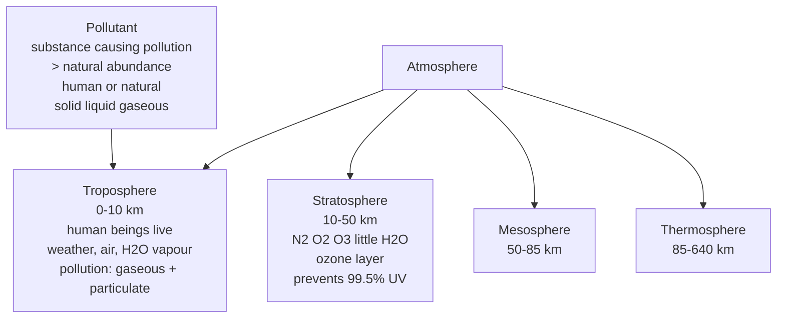
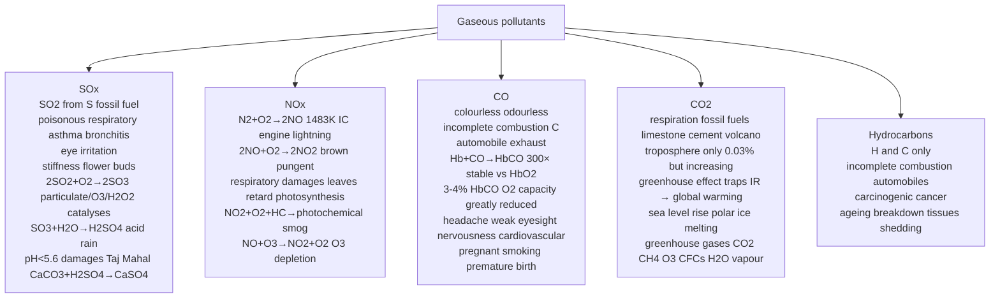
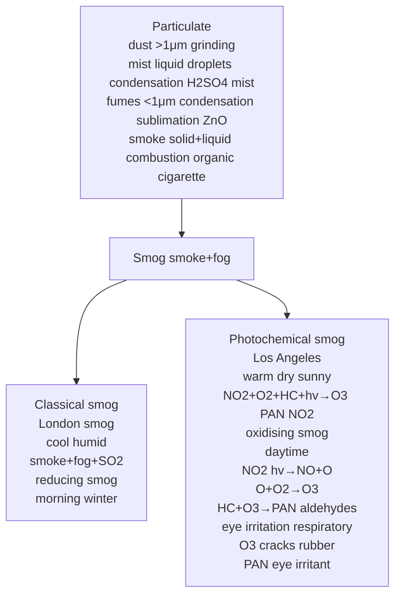
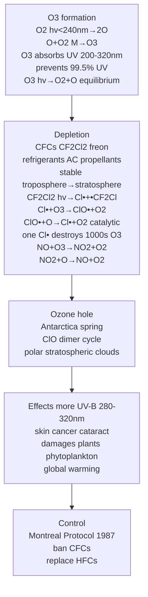
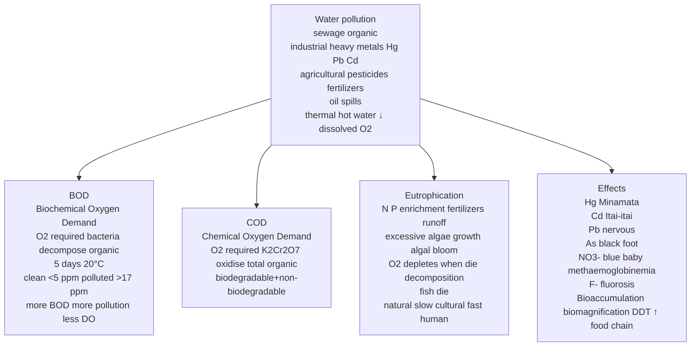
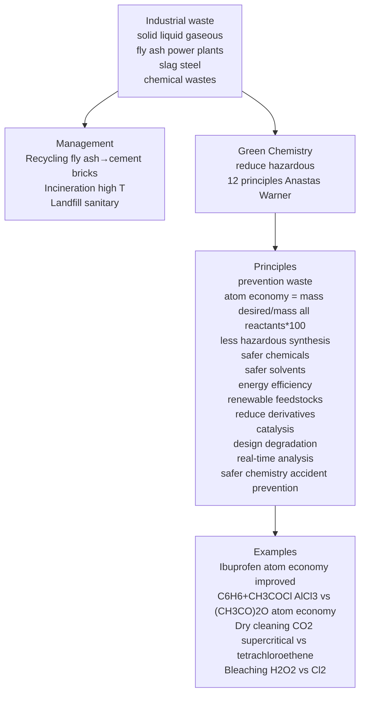

# Environmental Chemistry — JEE Advanced Notes

> **Sources merged into these notes**
> | Source | File |
> |---|---|
> | NCERT Class XI (pre-rationalised 2018-19), Unit 14 | [`kech207-legacy.pdf`](kech207-legacy.pdf) |
> | Allen — Environmental Chemistry module | [`Environmental Chemistry_Theory_26.pdf`](Environmental%20Chemistry_Theory_26.pdf) |
>
> 🅰 = Allen-only content; 🆇 = extra JEE-Advanced; ⚠ = trap.

## Contents

- [Part A — Atmospheric Pollution](#part-a--atmospheric-pollution)
  1. [Environmental Pollution & Atmosphere Structure (14.1)](#1-environmental-pollution--atmosphere-structure-141)
  2. [Tropospheric Pollution — Gaseous Pollutants (14.2)](#2-tropospheric-pollution--gaseous-pollutants-142)
  3. [Particulate Pollutants & Smog (14.2)](#3-particulate-pollutants--smog-142)
  4. [Stratospheric Pollution — Ozone Formation & Depletion (14.3)](#4-stratospheric-pollution--ozone-formation--depletion-143)
- [Part B — Water, Soil & Industrial Pollution](#part-b--water-soil--industrial-pollution)
  5. [Water Pollution — Causes, BOD, COD, Eutrophication (14.4)](#5-water-pollution--causes-bod-cod-eutrophication-144)
  6. [Soil Pollution — Pesticides, Wastes (14.5)](#6-soil-pollution--pesticides-wastes-145)
  7. [Industrial Waste & Green Chemistry (14.6)](#7-industrial-waste--green-chemistry-146)
  8. [Quick Revision Sheet](#8-quick-revision-sheet)

---

# Part A — Atmospheric Pollution

## 1. Environmental Pollution & Atmosphere Structure (14.1)

Answer-first: Pollutant is substance causing pollution present in greater concentration than natural abundance produced by human activities or natural happenings, solid liquid gaseous.

**Atmosphere structure:**

- **Troposphere:** Lowest region where human beings + organisms live, extends up to ~10 km sea level, contains air, water vapour, clouds, weather.
- **Stratosphere:** Above troposphere 10-50 km above sea level, contains $\ce{N2, O2, O3}$, little water vapour, contains ozone layer which prevents ~99.5% sun's harmful UV reaching earth.
- **Mesosphere:** 50-85 km.
- **Thermosphere:** 85-640 km.

*The atmospheric layers, where each one sits, and which pollutants matter where.*

## 2. Tropospheric Pollution — Gaseous Pollutants (14.2)

Tropospheric pollution due to presence undesirable solid or gaseous particles in air.

**1. Gaseous air pollutants:** Oxides of S, N, C, $\ce{H2S}$, hydrocarbons, $\ce{O3}$, other oxidants.

**2. Particulate pollutants:** Dust, mist, fumes, smoke, smog.

### (a) Oxides of Sulphur

Produced when S-containing fossil fuel burnt.

- $\ce{SO2}$ poisonous to animals and plants, causes respiratory diseases asthma, bronchitis, emphysema, irritation eyes tears redness.
- High $\ce{SO2}$ leads to stiffness flower buds eventually fall off plants.
- Uncatalysed oxidation slow, presence particulate matter in polluted air catalyses $\ce{2SO2 + O2 -> 2SO3}$, promoted by $\ce{O3}$ and $\ce{H2O2}$.

$\ce{2SO2 + O2 -> 2SO3}$

$\ce{SO3 + H2O -> H2SO4}$ acid rain

Acid rain: $\ce{SO2, NO2}$ + $\ce{H2O}$ → $\ce{H2SO4, HNO3}$ pH <5.6, damages buildings Taj Mahal marble cancer $\ce{CaCO3 + H2SO4 -> CaSO4 + H2O + CO2}$, harms plants, aquatic life, corrodes metals.

### (b) Oxides of Nitrogen

$\ce{N2 + O2 ->[1483K] 2NO}$ in IC engines, lightning, $\ce{2NO + O2 -> 2NO2}$, $\ce{NO2}$ brown pungent.

Effects: Respiratory, $\ce{NO2}$ damages plant leaves, retard photosynthesis, $\ce{NO2}$ + $\ce{O2}$ + hydrocarbons → photochemical smog, $\ce{NO}$ + $\ce{O3}$ → $\ce{NO2 + O2}$ ozone depletion.

$\ce{NO + O3 -> NO2 + O2}$

### (c) Hydrocarbons

Composed H and C only, formed incomplete combustion fuel automobiles, carcinogenic cause cancer, harm plants ageing breakdown tissues shedding leaves flowers twigs.

### (d) Oxides of Carbon

**(i) CO:** One of most serious air pollutants, colourless odourless highly poisonous due ability block delivery $\ce{O2}$ to organs tissues, produced incomplete combustion C, mainly automobile exhaust, other sources incomplete combustion coal firewood petrol, vehicles increasing poorly maintained inadequate pollution control → greater CO. Why poisonous? Binds haemoglobin to form **carboxyhaemoglobin** which is about 300 times more stable than $\ce{O2}$-haemoglobin complex. In blood when concentration carboxyhaemoglobin reaches 3-4%, $\ce{O2}$ carrying capacity greatly reduced, oxygen deficiency → headache weak eyesight nervousness cardiovascular disorder, reason advised not to smoke, pregnant women smoking increased CO level may induce premature birth spontaneous abortions deformed babies.

$\ce{Hb + CO -> HbCO}$ carboxyhaemoglobin 300× stable vs $\ce{HbO2}$

**(ii) CO₂:** Released respiration burning fossil fuels energy decomposition limestone during cement manufacture volcanic eruptions, confined to troposphere only, normally 0.03% by volume, but increasing due fossil fuels, **greenhouse effect**: $\ce{CO2}$ traps IR radiated by earth → heats atmosphere → **global warming**, consequences sea level rise due polar ice melting, climate change, increased $\ce{CO2}$ → more photosynthesis? But overall harmful. Greenhouse gases: $\ce{CO2, CH4, O3, CFCs, H2O vapour}$.

*The oxides of carbon and nitrogen: where they come from, what they do to the lungs, and how NO₂ drives photochemical smog and ozone loss.*

## 3. Particulate Pollutants & Smog (14.2)

**Particulate pollutants:** Dust, mist, fumes, smoke, smog.

- **Dust:** Solid particles >1 μm, produced grinding, etc.
- **Mist:** Liquid droplets formed condensation vapour, e.g., $\ce{H2SO4}$ mist.
- **Fumes:** Solid particles <1 μm formed condensation vapour from sublimation, distillation, e.g., ZnO fumes.
- **Smoke:** Mixture solid and liquid particles formed combustion organic matter, e.g., cigarette smoke.
- **Smog:** Smoke + fog, two types:

**Classical smog (London smog):** Cool humid climate, smoke + fog + $\ce{SO2}$, reducing smog, occurs morning winter.

**Photochemical smog (Los Angeles smog):** Warm dry sunny climate, $\ce{NO2 + O2}$ + hydrocarbons + sunlight → $\ce{O3, PAN (peroxyacetyl nitrate), NO2}$, oxidising smog, occurs daytime.

Photochemical smog formation:

$\ce{NO2 ->[hv] NO + O}$

$\ce{O + O2 -> O3}$

$\ce{NO + O3 -> NO2 + O2}$

$\ce{HC + O3, NO, O2 -> PAN, aldehydes}$

Effects: Eye irritation, respiratory, damages plants, $\ce{O3}$ cracks rubber, PAN eye irritant.

**Viable particulate:** Bacteria, fungi, algae, etc., cause diseases.

**Non-viable:** Formed disintegration? Dust, smoke, etc.

*Particulates by size and origin, then the two smogs — reducing London type and oxidising Los Angeles type.*

## 4. Stratospheric Pollution — Ozone Formation & Depletion (14.3)

**Ozone formation in stratosphere:**

$\ce{O2 ->[hv <240nm] 2O}$

$\ce{O + O2 ->[M] O3}$ where M third body

$\ce{O3}$ absorbs UV 200-320 nm harmful, prevents 99.5% UV reaching earth, $\ce{O3 ->[hv] O2 + O}$ etc equilibrium.

**Ozone depletion:**

CFCs (chlorofluorocarbons) $\ce{CF2Cl2}$ freon used refrigerants, AC, propellants, stable in troposphere reach stratosphere, photolysis:

$\ce{CF2Cl2 ->[hv] Cl• + •CF2Cl}$

$\ce{Cl• + O3 -> ClO• + O2}$

$\ce{ClO• + O -> Cl• + O2}$ — catalytic cycle, one Cl• destroys thousands $\ce{O3}$.

Similarly $\ce{NO + O3 -> NO2 + O2}$, $\ce{NO2 + O -> NO + O2}$.

**Ozone hole:** Over Antarctica spring, $\ce{ClO}$ dimer cycle, polar stratospheric clouds.

**Effects depletion:** More UV-B 280-320 nm reaches earth → skin cancer, cataract, damages plants, phytoplankton, global warming.

**Control:** Montreal Protocol 1987 ban CFCs, replace with HFCs, etc.

*Ozone forms by photolysis and is destroyed by the ClO dimer cycle over Antarctica; the Montreal Protocol is the control measure.*

---

# Part B — Water, Soil & Industrial Pollution

## 5. Water Pollution — Causes, BOD, COD, Eutrophication (14.4)

Water essential for life, but pollution due human activities.

**Causes:**

- Sewage, domestic waste, organic matter
- Industrial waste heavy metals $\ce{Hg, Pb, Cd}$, chemicals
- Agricultural runoff pesticides fertilizers
- Oil spills
- Thermal pollution hot water from power plants reduces dissolved $\ce{O2}$

**BOD (Biochemical Oxygen Demand):** Amount $\ce{O2}$ required by bacteria to decompose organic matter in water at certain T in certain time (usually 5 days at 20°C). More BOD → more organic pollution, less dissolved $\ce{O2}$, harmful aquatic life. Clean water BOD <5 ppm, polluted >17 ppm.

**COD (Chemical Oxygen Demand):** Amount $\ce{O2}$ required to oxidise total organic matter (biodegradable + non-biodegradable) by strong oxidising agent $\ce{K2Cr2O7}$.

**Eutrophication:** Enrichment of water with nutrients $\ce{N, P}$ from fertilizers runoff → excessive growth algae → algal bloom → depletes $\ce{O2}$ when algae die decomposition → fish die. Natural eutrophication slow, cultural due human activities fast.

**Other terms:**

- **DO (Dissolved Oxygen):** Amount $\ce{O2}$ dissolved in water, 5-6 ppm needed for aquatic life, <4 ppm harmful.
- **Bioaccumulation & Biomagnification:** Pesticides non-biodegradable accumulate in organisms, concentration increases up food chain, e.g., DDT.

**Water pollutants effects:**

- $\ce{Hg}$ → Minamata disease
- $\ce{Cd}$ → Itai-itai disease
- $\ce{Pb}$ → nervous system damage
- $\ce{As}$ → black foot disease
- $\ce{NO3-}$ → blue baby syndrome (methaemoglobinemia)
- $\ce{F-}$ → fluorosis

*Water pollution sources, the BOD/COD test pair, and how eutrophication kills a lake.*

## 6. Soil Pollution — Pesticides, Wastes (14.5)

Soil upper layer earth crust, supports plant growth, but pollution due:

- **Pesticides:** Insecticides (DDT, BHC), herbicides, fungicides, non-biodegradable, persistent, bioaccumulation biomagnification, kill useful organisms.
- **Industrial wastes:** Heavy metals, chemicals, fly ash.
- **Fertilizers:** Excessive use → soil becomes acidic/alkaline, eutrophication via runoff.
- **Deforestation, mining.**

**Pesticides classification:**

- Insecticides: DDT, BHC, aldrin
- Herbicides: 2,4-D, sodium chlorate
- Fungicides: Bordeaux mixture

**Control:** Use biodegradable pesticides, organic farming, crop rotation.

## 7. Industrial Waste & Green Chemistry (14.6)

**Industrial waste:** Solid, liquid, gaseous wastes from industries, e.g., fly ash from power plants, slag from steel, chemical wastes.

**Management:**

- **Recycling:** e.g., fly ash used in cement, bricks.
- **Incineration:** Burning at high T.
- **Landfill:** Sanitary landfill.

**Green Chemistry:** Chemistry that reduces hazardous substances, environmentally friendly, 12 principles by Anastas and Warner.

**Principles (JEE relevant):**

- Prevention waste
- Atom economy: $\ce{% atom economy = (mass desired product / mass all reactants) *100}$
- Less hazardous synthesis
- Designing safer chemicals
- Safer solvents
- Energy efficiency
- Renewable feedstocks
- Reduce derivatives
- Catalysis
- Design for degradation
- Real-time analysis
- Inherently safer chemistry for accident prevention

**Examples green chemistry:**

- $\ce{CH3-CH=CH2 + O2 ->[PdCl2/CuCl2] CH3CHO}$? Actually? 
- Ibuprofen synthesis atom economy improved.
- $\ce{C6H6 + CH3COCl ->[AlCl3] C6H5COCH3 + HCl}$ vs $\ce{C6H6 + (CH3CO)2O -> C6H5COCH3 + CH3COOH}$ atom economy better second? Actually second produces acetic acid less hazardous.
- Dry cleaning with $\ce{CO2}$ supercritical instead of tetrachloroethene.
- Bleaching paper with $\ce{H2O2}$ instead of $\ce{Cl2}$.

*Industrial waste streams, how they are managed, and what green chemistry asks instead.*

---

## 8. Quick Revision Sheet

- Pollutant substance causing pollution > natural abundance human/natural solid liquid gaseous; atmosphere troposphere 0-10 km human live weather gaseous+particulate, stratosphere 10-50 km N2 O2 O3 little H2O ozone layer prevents 99.5% UV 200-320 nm, mesosphere 50-85 km thermosphere 85-640 km.
- Tropospheric gaseous: SOx SO2 S fossil fuel poisonous respiratory asthma bronchitis emphysema eye irritation tears redness stiffness flower buds fall, uncatalysed oxidation slow particulate matter catalyses 2SO2+O2→2SO3 promoted O3 H2O2 SO3+H2O→H2SO4 acid rain pH<5.6 damages Taj Mahal CaCO3+H2SO4→CaSO4+H2O+CO2 plants aquatic metals; NOx N2+O2→2NO 1483K IC engine lightning 2NO+O2→2NO2 brown pungent respiratory damages leaves retard photosynthesis NO2+O2+HC→photochemical smog NO+O3→NO2+O2 O3 depletion; CO colourless odourless incomplete combustion C automobile exhaust Hb+CO→HbCO 300× stable vs HbO2 3-4% HbCO O2 capacity greatly reduced headache weak eyesight nervousness cardiovascular pregnant smoking premature birth abortions deformed babies; CO2 respiration fossil fuels limestone cement volcano troposphere only 0.03% but increasing greenhouse effect traps IR→global warming sea level rise polar ice melting greenhouse gases CO2 CH4 O3 CFCs H2O vapour; hydrocarbons H and C only incomplete combustion automobiles carcinogenic cancer ageing breakdown shedding.
- Particulate: dust >1μm grinding, mist liquid droplets condensation H2SO4 mist, fumes <1μm condensation sublimation ZnO, smoke solid+liquid combustion organic cigarette, smog smoke+fog classical London cool humid smoke+fog+SO2 reducing morning winter, photochemical Los Angeles warm dry sunny NO2+O2+HC+hv→O3 PAN peroxyacetyl nitrate NO2 oxidising daytime NO2 hv→NO+O O+O2→O3 NO+O3→NO2+O2 HC+O3→PAN aldehydes eye irritation respiratory O3 cracks rubber PAN eye irritant, viable bacteria fungi algae diseases non-viable dust smoke.
- Stratospheric: O3 formation O2 hv<240nm→2O O+O2 M→O3 absorbs UV 200-320nm prevents 99.5% UV O3 hv→O2+O equilibrium; depletion CFCs CF2Cl2 freon refrigerants AC propellants stable troposphere→stratosphere CF2Cl2 hv→Cl•+•CF2Cl Cl•+O3→ClO•+O2 ClO•+O→Cl•+O2 catalytic one Cl• destroys 1000s O3 NO+O3→NO2+O2 NO2+O→NO+O2; ozone hole Antarctica spring ClO dimer polar stratospheric clouds; effects more UV-B 280-320nm skin cancer cataract plants phytoplankton global warming; control Montreal Protocol 1987 ban CFCs replace HFCs.
- Water pollution: sewage organic industrial heavy metals Hg Pb Cd chemicals agricultural pesticides fertilizers oil spills thermal hot water ↓ dissolved O2; BOD Biochemical Oxygen Demand O2 required bacteria decompose organic 5 days 20°C clean <5 ppm polluted >17 ppm more BOD more pollution less DO; COD Chemical Oxygen Demand O2 required K2Cr2O7 oxidise total organic biodegradable+non-biodegradable; eutrophication N P enrichment fertilizers runoff excessive algae growth algal bloom O2 depletes when die decomposition fish die natural slow cultural fast human; DO Dissolved Oxygen 5-6 ppm needed aquatic <4 ppm harmful; bioaccumulation biomagnification pesticides non-biodegradable accumulate concentration ↑ food chain DDT; effects Hg Minamata Cd Itai-itai Pb nervous As black foot NO3- blue baby methaemoglobinemia F- fluorosis.
- Soil pollution: upper layer crust supports plant growth pollution pesticides insecticides DDT BHC aldrin herbicides 2,4-D sodium chlorate fungicides Bordeaux mixture non-biodegradable persistent bioaccumulation biomagnification kill useful organisms, industrial wastes heavy metals chemicals fly ash, fertilizers excessive acidic/alkaline eutrophication runoff deforestation mining; control biodegradable pesticides organic farming crop rotation.
- Industrial waste solid liquid gaseous fly ash power plants slag steel chemical wastes management recycling fly ash→cement bricks incineration high T landfill sanitary; Green Chemistry reduce hazardous environmentally friendly 12 principles Anastas Warner prevention waste atom economy = mass desired/mass all reactants*100 less hazardous synthesis safer chemicals safer solvents energy efficiency renewable feedstocks reduce derivatives catalysis design degradation real-time analysis safer chemistry accident prevention; examples ibuprofen atom economy improved, C6H6+CH3COCl AlCl3 vs (CH3CO)2O atom economy second better acetic acid less hazardous, dry cleaning CO2 supercritical vs tetrachloroethene, bleaching H2O2 vs Cl2.

---

*Cross-links:* [p-Block Groups 13-14](../05-The-p-Block-Elements/notes.md) — $\ce{SO2, CO2}$ acidic oxides; [p-Block Groups 15-18](../09-The-p-Block-Elements/notes.md) — $\ce{NOx, O3, CFCs, Xe}$; [Hydrogen](../03-Hydrogen/notes.md) — $\ce{H2O}$ structure, hard water; [s-Block](../04-The-s-Block-Elements/notes.md) — $\ce{CaCO3}$ Taj Mahal marble cancer; [Chemical Bonding](../02-Chemical-Bonding-and-Molecular-Structure/notes.md) — ozone resonance, CFCs.
*Sources:* NCERT pre-rationalised Unit 14 (kech207) + Allen Environmental Chemistry module.
