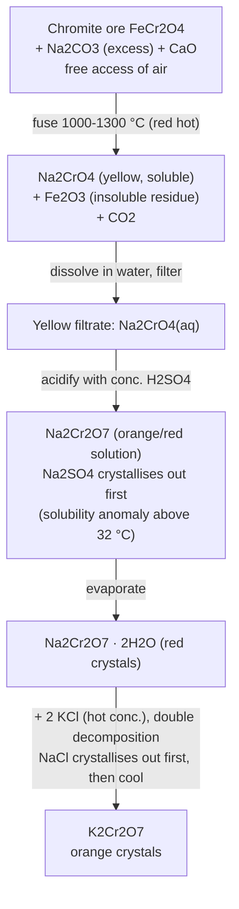
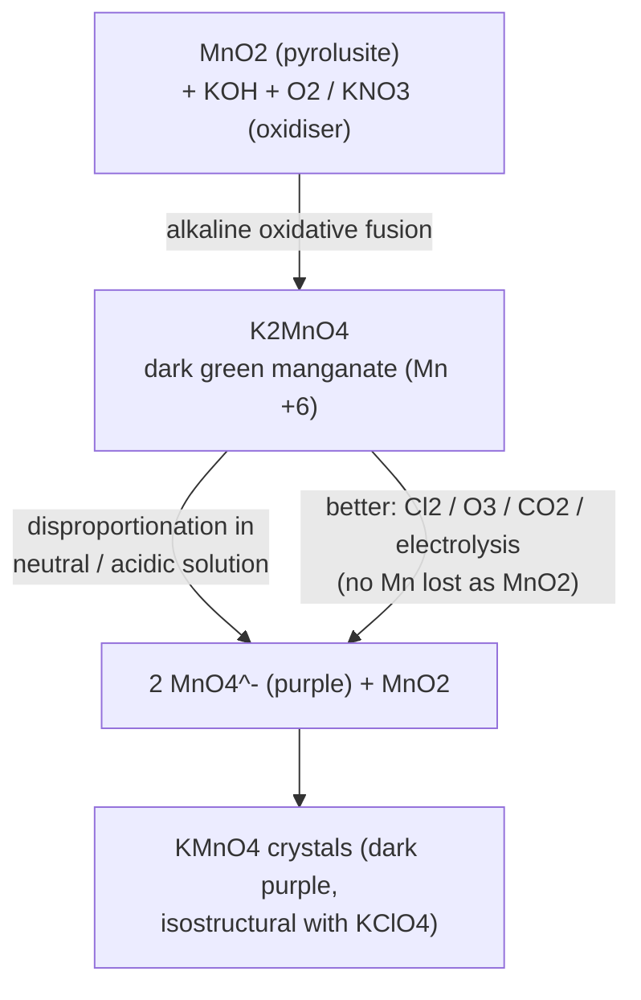
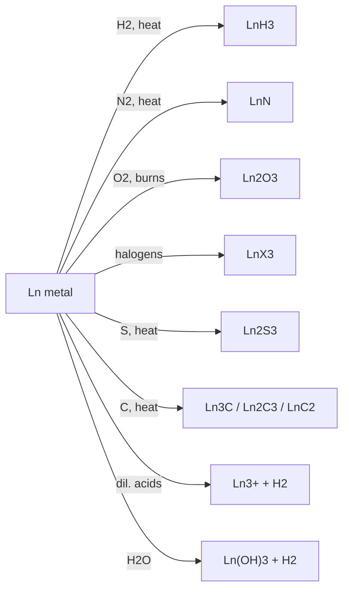

# The d- and f-Block Elements — JEE Main + Advanced Notes

> **Sources merged into these notes**
> | Source | File |
> |---|---|
> | NCERT Class XII Chemistry (rationalised, 2023+), Unit 4 | [`lech104.pdf`](lech104.pdf) |
> | Allen — d-Block Theory (JEE Main + Advanced, Enthusiast Course, batch '26) | [`d-Block_Theory_26.pdf`](d-Block_Theory_26.pdf) |
>
> Everything below is covered in **both** sources first; points that come from only one
> source, or that are added to close the JEE Main → JEE Advanced gap, are marked
> 🅰 (Allen-only), 🆇 (extra JEE-Advanced point).

## Contents

- [Part A — The d-Block (Transition Elements)](#part-a--the-d-block-transition-elements)
  1. [Position in the Periodic Table](#1-position-in-the-periodic-table)
  2. [Electronic Configurations](#2-electronic-configurations)
  3. [General Properties & Trends](#3-general-properties--trends)
  4. [Oxidation States](#4-oxidation-states)
  5. [Standard Electrode Potentials](#5-standard-electrode-potentials)
  6. [Chemical Reactivity](#6-chemical-reactivity)
  7. [Stability of Higher Oxidation States — Halides & Oxides](#7-stability-of-higher-oxidation-states--halides--oxides)
  8. [Magnetic Properties](#8-magnetic-properties)
  9. [Formation of Coloured Ions](#9-formation-of-coloured-ions)
  10. [Complex Formation](#10-complex-formation)
  11. [Catalytic Properties](#11-catalytic-properties)
  12. [Interstitial Compounds](#12-interstitial-compounds)
  13. [Alloy Formation](#13-alloy-formation)
  14. [Important Compounds — K₂Cr₂O₇ and KMnO₄](#14-important-compounds--k₂cr₂o₇-and-kmno₄)
- [Part B — The f-Block (Inner Transition Elements)](#part-b--the-f-block-inner-transition-elements)
  15. [The Lanthanoids](#15-the-lanthanoids)
  16. [The Actinoids](#16-the-actinoids)
  17. [Lanthanoids vs Actinoids — Comparison](#17-lanthanoids-vs-actinoids--comparison)
- [Part C — Allen Module Extras & JEE Advanced Corner](#part-c--allen-module-extras--jee-advanced-corner)
  18. [Experiments from the Module (Double Salts, Ferrioxalate)](#18-experiments-from-the-module)
  19. [Silver and Its Compounds](#19-silver-and-its-compounds)
  20. [Zinc Compounds](#20-zinc-compounds)
  21. [Copper Compounds](#21-copper-compounds)
  22. [Iron Compounds](#22-iron-compounds)
  23. [JEE Advanced Corner — Reasoning Bank](#23-jee-advanced-corner--reasoning-bank)
  24. [Quick Revision Sheet](#24-quick-revision-sheet)

---

# Part A — The d-Block (Transition Elements)

## 1. Position in the Periodic Table

- The **d-block** occupies the large middle section of the periodic table, **groups 3–12**,
  flanked between the s- and p-blocks. The d-orbitals of the **penultimate (n−1) shell**
  are progressively filled across four long periods.
- The **f-block** (4f and 5f series) is placed as a separate panel at the bottom.
- Names: d-block elements = **transition metals**; f-block = **inner transition metals**.

```
            d-block (Groups 3–12)
            ┌────────────────────┐
  s-block   │  3d  4d  5d  6d    │   p-block
  (1,2) ──► │  rows of the       │ ◄── (13–18)
            │  transition metals │
            └────────────────────┘
        f-block (4f lanthanoids, 5f actinoids) — bottom panel
```

**The four transition series**

| Series | d-orbital | Members |
|---|---|---|
| 1st | 3d | Sc (21) → Zn (30) |
| 2nd | 4d | Y (39) → Cd (48) |
| 3rd | 5d | La (57), Hf (72) → Hg (80) |
| 4th | 6d | Ac (89), Rf (104) → Cn (112) |

Inner transition series: **4f** = lanthanoids (Ce → Lu, chemistry discussed with La),
**5f** = actinoids (Th → Lr, discussed with Ac).

### Why "transition"?

- Originally: their properties are **transitional between s-block and p-block** elements.
- **IUPAC definition (exam-important):** transition metals are metals that have an
  **incomplete d subshell** either in the **neutral atom or in their ions**.

> **⚠ Classic traps:**
> - Zn, Cd, Hg (group 12) have **d¹⁰** in the ground state *and* in their common
>   oxidation states → **not transition elements** (but they *are* d-block elements, and
>   their chemistry is studied with the transition metals).
> - **Sc** (3d¹4s²) *is* a transition element — the **atom** has an incomplete d-subshell
>   (3d¹), even though its only ion Sc³⁺ is d⁰. It is the only 3d element with **no
>   variable oxidation state** (only +3).
> - **Ag** (4d¹⁰5s¹) looks like group 12, but Ag²⁺ (4d⁹) has an incomplete d-subshell →
>   Ag **is** a transition element. *(Favourite JEE one-liners.)*

## 2. Electronic Configurations

- General outer configuration: **(n−1)d¹⁻¹⁰ ns¹⁻²** — except **Pd: 4d¹⁰5s⁰** 🅰.
- Exceptions occur because (n−1)d and ns are very close in energy, and
  **half-filled / completely-filled** sets of orbitals have extra stability.

```
   Cr (Z = 24):  [Ar] 3d⁵ 4s¹   (not 3d⁴4s²)  ← half-filled d⁵ stability
   Cu (Z = 29):  [Ar] 3d¹⁰ 4s¹  (not 3d⁹4s²)  ← completely-filled d¹⁰ stability
```

### Ground-state outer configurations (NCERT Table 4.1)

**1st series (3d)**

| Element | Sc | Ti | V | Cr | Mn | Fe | Co | Ni | Cu | Zn |
|---|---|---|---|---|---|---|---|---|---|---|
| Z | 21 | 22 | 23 | 24 | 25 | 26 | 27 | 28 | 29 | 30 |
| 4s | 2 | 2 | 2 | **1** | 2 | 2 | 2 | 2 | **1** | 2 |
| 3d | 1 | 2 | 3 | **5** | 5 | 6 | 7 | 8 | **10** | 10 |

**2nd series (4d)** — note Nb, Mo, Ru, Rh and especially **Pd (4d¹⁰5s⁰)**

| Element | Y | Zr | Nb | Mo | Tc | Ru | Rh | Pd | Ag | Cd |
|---|---|---|---|---|---|---|---|---|---|---|
| Z | 39 | 40 | 41 | 42 | 43 | 44 | 45 | 46 | 47 | 48 |
| 5s | 2 | 2 | 1 | 1 | 2 | 1 | 1 | **0** | 1 | 2 |
| 4d | 1 | 2 | 4 | 5 | 5 | 7 | 8 | **10** | 10 | 10 |

**3rd series (5d)**

| Element | La | Hf | Ta | W | Re | Os | Ir | Pt | Au | Hg |
|---|---|---|---|---|---|---|---|---|---|---|
| Z | 57 | 72 | 73 | 74 | 75 | 76 | 77 | 78 | 79 | 80 |
| 6s | 2 | 2 | 2 | 2 | 2 | 2 | 2 | 1 | 1 | 2 |
| 5d | 1 | 2 | 3 | 4 | 5 | 6 | 7 | 9 | 10 | 10 |

**4th series (6d)**

| Element | Ac | Rf | Db | Sg | Bh | Hs | Mt | Ds | Rg | Cn |
|---|---|---|---|---|---|---|---|---|---|---|
| Z | 89 | 104 | 105 | 106 | 107 | 108 | 109 | 110 | 111 | 112 |
| 7s | 2 | 2 | 2 | 2 | 2 | 2 | 2 | 2 | 1 | 2 |
| 6d | 1 | 2 | 3 | 4 | 5 | 6 | 7 | 8 | 10 | 10 |

### Configurations of 3d ions — *ns electrons are lost BEFORE (n−1)d* 🅰

| | Sc | Ti | V | Cr | Mn | Fe | Co | Ni | Cu | Zn |
|---|---|---|---|---|---|---|---|---|---|---|
| M | 3d¹4s² | 3d²4s² | 3d³4s² | 3d⁵4s¹ | 3d⁵4s² | 3d⁶4s² | 3d⁷4s² | 3d⁸4s² | 3d¹⁰4s¹ | 3d¹⁰4s² |
| M⁺ | 3d¹4s¹ | 3d²4s¹ | 3d³4s¹ | 3d⁵ | 3d⁵4s¹ | 3d⁶4s¹ | 3d⁷4s¹ | 3d⁸4s¹ | 3d¹⁰ | 3d¹⁰4s¹ |
| M²⁺ | 3d¹ | 3d² | 3d³ | 3d⁴ | 3d⁵ | 3d⁶ | 3d⁷ | 3d⁸ | 3d⁹ | 3d¹⁰ |
| M³⁺ | [Ar] | 3d¹ | 3d² | 3d³ | 3d⁴ | 3d⁵ | 3d⁶ | 3d⁷ | — | — |

> **Rule of thumb for JEE:** while forming ions the **s-electrons go first**; stability
> bonuses at **d⁰, d⁵, d¹⁰** control which oxidation states survive
> (e.g. Mn²⁺ d⁵, Fe³⁺ d⁵, Cu²⁺ over Cu⁺ in water, Zn²⁺ d¹⁰).

Why is transition chemistry special? The d-orbitals **protrude to the periphery** of the
atom more than s/p orbitals, so they are strongly influenced by the surroundings and also
influence neighbouring atoms — hence variable oxidation states, coloured ions, complexes,
catalysis and paramagnetism. Ions with the same dⁿ configuration (n = 1–9) show similar
magnetic/electronic behaviour.

## 3. General Properties & Trends

### 3.1 Physical / metallic character

- All are **metals**: high tensile strength, ductility, malleability, high thermal &
  electrical conductivity, metallic lustre.
- Except **Zn, Cd, Hg (and Mn)** they adopt typical close-packed metallic structures
  (bcc / hcp / ccp) at room temperature.
- Except Zn, Cd, Hg they are **very hard** with **low volatility** and **high m.p./b.p.**

### 3.2 Melting points

```
M.p. trend along a series: rises to a maximum near d⁵, then falls.
(anomalous dips at Mn in 3d and Tc in 4d)

        ▲ M.p.
        │        max near d⁵
        │       ●●●
        │     ●     ●●
        │   ●          ●●
        │ ●                ●
        └──────────────────────► Z
      Sc  ...  Mn ...  Zn (lowest in 3d)
```

- **Reason:** high m.p. because **more (n−1)d electrons + ns electrons** participate in
  interatomic metallic bonding. One unpaired electron per d-orbital (≈d⁵) is the most
  favourable for strong bonding.
- 🅰 **Allen one-liners:** m.p. maximum at **Cr / Mo / W** (six unpaired electrons
  available for metallic bonding); **Zn / Cd / Hg have the lowest m.p.** (no unpaired
  d-electron for metallic bonding; nearly "liquid-like" weak bonding → Hg is liquid).

### 3.3 Enthalpy of atomisation (ΔaH°)

- Transition metals have **high ΔaH°** — large number of unpaired electrons ⇒ stronger
  interatomic interaction ⇒ stronger metallic bonds.
- **Maxima at about the middle of each series** (one unpaired e⁻ per d-orbital is the
  sweet spot). 🅰 Zinc is the 3d minimum: **ΔaH°(Zn) = 126 kJ mol⁻¹** because *no*
  3d electron takes part in metallic bonding.
- **2nd and 3rd series have larger ΔaH° than the 1st series** → much more frequent
  **metal–metal bonding** in compounds of the heavy transition metals.
- ΔaH° is a key input for standard electrode potentials: metals with very high ΔaH°
  (very high b.p.) tend to be **noble**.

**ΔaH° of the 3d series (kJ mol⁻¹):**

| Sc | Ti | V | Cr | Mn | Fe | Co | Ni | Cu | Zn |
|---|---|---|---|---|---|---|---|---|---|
| 326 | 473 | 515 | 397 | 281 | 416 | 425 | 430 | 339 | **126** |

### 3.4 Atomic and ionic radii

- In a series, radius **decreases** with Z (same charge ions): each new electron enters
  an inner d-orbital while nuclear charge rises by +1; d-electrons shield poorly, so
  effective nuclear charge on the outer electrons increases. The decrease is small.

```
3d metallic radii (pm):
  Sc   Ti   V    Cr   Mn   Fe   Co   Ni   Cu   Zn
  164  147  135  129  137  126  125  125  128  137
   ╲ decreases ╱   ~ flat (e⁻–e⁻ repulsion    ╲ slight rise ╱
                 balances nuclear pull)          (d¹⁰, no
                                               exchange energy)
```

🅰 Allen: **decreases → remains nearly constant → increases slightly** at Cu/Zn.

- **Between series:** radii rise from 3d → 4d, but **5d radii ≈ 4d radii** because the
  **lanthanoid contraction** (filling of 4f before the 5d series) offsets the expected
  size increase. e.g. **Zr 160 pm, Hf 159 pm** → nearly identical chemistry, co-occur in
  nature, hard to separate.
- Cause of the contraction: **poor shielding of one electron by another in the same
  subshell**; shielding of one 4f electron by another is *worse* than d–d shielding.

### 3.5 Density 🅰

- Low atomic volume + high mass ⇒ high density (D = M/V). Decreasing metallic radius
  plus rising atomic mass gives a general increase across a series.
- **3d series:** Sc (3.43, lowest) … **Cu (8.9 g cm⁻³, highest)**; Zn drops to 7.1.
- **Os (22.61) and Ir (22.57) g cm⁻³ are the densest elements.**
- In all groups (except IIIB) density rises 3d → 4d, and **nearly doubles 4d → 5d**
  (mass ↑ but radii stay similar — lanthanoid contraction). e.g. Ti < Zr ≪ Hf.
- 🅰 Useful orders: **Fe < Ni < Cu**; **Fe < Cu < Au**; **Fe < Hg < Au**.

| 3d element | Sc | Ti | V | Cr | Mn | Fe | Co | Ni | Cu | Zn |
|---|---|---|---|---|---|---|---|---|---|---|
| ρ / g cm⁻³ | 3.43 | 4.1 | 6.07 | 7.19 | 7.21 | 7.8 | 8.7 | 8.9 | **8.9** | 7.1 |

### 3.6 Ionisation enthalpies

- IE increases left → right along each series (rising nuclear charge, inner-d filling),
  but the increase is **much gentler** than in p-block periods and **irregular**.
- Successive IEs don't rise as steeply as in non-transition elements → losing a variable
  number of d-electrons is not prohibitively expensive → **variable oxidation states**.
- 3d electrons shield the 4s electron reasonably well → atomic radii shrink slowly →
  1st IE rises only slightly along the series.
- The steady rise in IE2/IE3 **breaks at d⁵ and d¹⁰** configurations:
  - 🅰 Allen orders (from the tabulated data):
    - **IE2: Cr > Fe > Mn** (Cr⁺ 3d⁵ → removing an e⁻ from stable d⁵ costs more) and **Cu > Zn** (Cu⁺ 3d¹⁰ vs Zn⁺ 3d¹⁰4s¹).
    - **IE3: Mn > Cr > Fe**; **Zn has the highest IE3** (electron from stable d¹⁰ of Zn²⁺).
- **Exchange-energy argument (why the breaks exist):** exchange energy ≈ number of
  parallel-spin pairs in degenerate orbitals; losing an electron from d⁵ (maximum
  exchange stabilisation) costs extra. Consequences:
  - Mn⁺ is 3d⁵4s¹ but Cr⁺ is 3d⁵ → **IE2(Mn) < IE2(Cr)** … and the d⁵ of Mn²⁺ makes
    **IE3(Mn) ≫ IE3(Fe)** (Fe²⁺ d⁶ → Fe³⁺ d⁵ *gains* stability, Mn²⁺ d⁵ → Mn³⁺ d⁴ loses it).
- IE2 is unusually high for Cr and Cu (M⁺ = d⁵, d¹⁰); IE3 very high for Cu, Ni, Zn →
  explains why oxidation states **> +2 are hard** for Ni, Cu, Zn.

**Ionisation enthalpies of the 3d series (kJ mol⁻¹):**

| | Sc | Ti | V | Cr | Mn | Fe | Co | Ni | Cu | Zn |
|---|---|---|---|---|---|---|---|---|---|---|
| IE₁ | 631 | 656 | 650 | 653 | 717 | 762 | 758 | 736 | 745 | **906** |
| IE₂ | 1235 | 1309 | 1414 | **1592** | 1509 | 1561 | 1644 | 1752 | **1958** | 1734 |
| IE₃ | 2393 | 2657 | 2833 | 2990 | **3260** | 2962 | 3243 | 3402 | 3556 | **3837** |

### 3.7 Master data table for the 3d series (NCERT Table 4.2)

| Property | Sc | Ti | V | Cr | Mn | Fe | Co | Ni | Cu | Zn |
|---|---|---|---|---|---|---|---|---|---|---|
| Configuration | 3d¹4s² | 3d²4s² | 3d³4s² | 3d⁵4s¹ | 3d⁵4s² | 3d⁶4s² | 3d⁷4s² | 3d⁸4s² | 3d¹⁰4s¹ | 3d¹⁰4s² |
| ΔaH° / kJ mol⁻¹ | 326 | 473 | 515 | 397 | 281 | 416 | 425 | 430 | 339 | 126 |
| Metallic radius / pm | 164 | 147 | 135 | 129 | 137 | 126 | 125 | 125 | 128 | 137 |
| M²⁺ radius / pm | – | – | 79 | 82 | 82 | 77 | 74 | 70 | 73 | 75 |
| M³⁺ radius / pm | 73 | 67 | 64 | 62 | 65 | 65 | 61 | 60 | – | – |
| E°(M²⁺/M) / V | – | −1.63 | −1.18 | −0.90 | −1.18 | −0.44 | −0.28 | −0.25 | **+0.34** | −0.76 |
| E°(M³⁺/M²⁺) / V | – | −0.37 | −0.26 | −0.41 | **+1.57** | +0.77 | **+1.97** | – | – | – |
| Density / g cm⁻³ | 3.43 | 4.1 | 6.07 | 7.19 | 7.21 | 7.8 | 8.7 | 8.9 | 8.9 | 7.1 |

## 4. Oxidation States

- Greatest **number** of oxidation states occurs **in/near the middle of the series** —
  **Mn shows every state from +2 to +7** (all four of 3d⁵4s² valence electrons plus
  d-electrons usable).
- Fewer states at the ends: too few electrons to lose (Sc, Ti) or too many d-electrons
  to share for high valence (Cu, Zn). Sc(II) virtually unknown; Ti(IV) > Ti(III), Ti(II).
  **Zn shows only +2.**
- Maximum stable oxidation state ≈ **sum of ns + (n−1)d electrons, up to Mn**:
  Ti⁴⁺ (TiO₂), V⁵⁺ (VO₂⁺), Cr⁶⁺ (CrO₄²⁻), Mn⁷⁺ (MnO₄⁻) — then an **abrupt drop**:
  typical species afterwards are Fe(II,III), Co(II,III), Ni(II), Cu(I,II), Zn(II).

**Oxidation states of the 3d series** (*bold* = most common):

| | Sc | Ti | V | Cr | Mn | Fe | Co | Ni | Cu | Zn |
|---|---|---|---|---|---|---|---|---|---|---|
| +1 | | | | | | | | | **1** | |
| +2 | | 2 | 2 | 2 | **2** | **2** | **2** | **2** | **2** | **2** |
| +3 | **3** | 3 | 3 | **3** | 3 | **3** | 3 | 3 | | |
| +4 | | **4** | 4 | 4 | 4 | 4 | 4 | 4 | | |
| +5 | | | **5** | 5 | 5 | | | | | |
| +6 | | | | **6** | 6 | 6 | | | | |
| +7 | | | | | **7** | | | | | |

- **Variability differs from p-block:** d-block states differ by **one unit**
  (V²⁺, V³⁺, V⁴⁺, V⁵⁺); p-block states normally differ by **two units** (inert pair).
- **Group trend (opposite of inert-pair effect):** in d-block the **higher** oxidation
  state becomes **more stable for the heavier members**. In group 6: **Mo(VI) and W(VI)
  are more stable than Cr(VI)** — Cr(VI) (acidic dichromate) is a strong oxidiser, while
  MoO₃ and WO₃ are not.
- **Low / zero states** appear with **π-acceptor ligands** (back-bonding): oxidation
  state **0** in Ni(CO)₄, Fe(CO)₅.
- 🆇 **Sc shows no variable oxidation state** (only +3, noble-gas core) — standard JEE
  one-liner; likewise the **lowest common state is +2**, and in the *first half* of the
  series **+2 becomes progressively more stable** (see E°(M³⁺/M²⁺) below).

## 5. Standard Electrode Potentials

### 5.1 E°(M²⁺/M) — the thermochemical cycle

M(s) → M²⁺(aq) costs **ΔaH° + IE₁ + IE₂** and is repaid by **ΔhydH°(M²⁺)**:

| M | ΔaH° | IE₁ | IE₂ | ΔhydH°(M²⁺) | E°(M²⁺/M) / V |
|---|---|---|---|---|---|
| Ti | 469 | 656 | 1309 | −1866 | −1.63 |
| V | 515 | 650 | 1414 | −1895 | −1.18 |
| Cr | 398 | 653 | 1592 | −1925 | −0.90 |
| Mn | 279 | 717 | 1509 | −1862 | −1.18 |
| Fe | 418 | 762 | 1561 | −1998 | −0.44 |
| Co | 427 | 758 | 1644 | −2079 | −0.28 |
| Ni | 431 | 736 | 1752 | −2121 | −0.25 |
| Cu | 339 | 745 | 1958 | −2121 | **+0.34** |
| Zn | 130 | 906 | 1734 | −2059 | −0.76 |

(all enthalpies in kJ mol⁻¹)

**Facts to memorise**

- **Cu is the only 3d metal with positive E°(M²⁺/M)** → it **cannot liberate H₂ from
  acids**; only oxidising acids (HNO₃, hot conc. H₂SO₄) attack it. Its high
  ΔaH° + IE₁ + IE₂ is not compensated by hydration enthalpy.
- General trend: E° becomes **less negative** across the series (rising IE₁ + IE₂).
- **Mn, Ni, Zn are more negative than the smooth trend:**
  - Mn²⁺ — extra stability of half-filled **d⁵**;
  - Zn²⁺ — extra stability of **d¹⁰**;
  - Ni²⁺ — the **most negative ΔhydH°** of the series.

### 5.2 E°(M³⁺/M²⁺)

| Couple | Sc³⁺/Sc²⁺ | Ti³⁺/Ti²⁺ | V³⁺/V²⁺ | Cr³⁺/Cr²⁺ | Mn³⁺/Mn²⁺ | Fe³⁺/Fe²⁺ | Co³⁺/Co²⁺ |
|---|---|---|---|---|---|---|---|
| E° / V | very low (Sc³⁺ noble-gas stable) | −0.37 | −0.26 | −0.41 | **+1.57** | +0.77 | **+1.97** |

- Low value for Sc → stability of **Sc³⁺ (noble-gas configuration)**.
- Highest value for Zn (not shown in table; Zn³⁺ would strip an e⁻ from d¹⁰).
- **High for Mn:** Mn²⁺ (d⁵) is particularly stable — the third IE of Mn (d⁵→d⁴) is
  huge; hence Mn(III) is of little importance and **Mn³⁺ is a strong oxidiser**.
- **Low for Fe:** Fe³⁺ (d⁵) is *extra stable* → Fe²⁺ is relatively easy to oxidise.
- **Low for V:** V²⁺ has a **half-filled t₂g (d³)** level.
- 🆇 Consequence: **Mn³⁺ and Co³⁺ are the strongest oxidising M³⁺ ions in water**;
  **Ti²⁺, V²⁺, Cr²⁺ are strong reducing agents** — e.g.
  `2 Cr²⁺(aq) + 2 H⁺(aq) → 2 Cr³⁺(aq) + H₂(g)`

> **Reasoning gem (NCERT):** Cr²⁺ (d⁴) is **reducing** because Cr²⁺ → Cr³⁺ gives
> **t₂g³ (half-filled t₂g)**, very stable in water (CFSE). Fe²⁺ (d⁶) → Fe³⁺ (d⁵) also
> looks stabilising, so **Cr²⁺ is the stronger reducing agent**. Conversely Mn³⁺ (d⁴) is
> **oxidising** because Mn³⁺ → Mn²⁺ gives the stable half-filled **d⁵**.

## 6. Chemical Reactivity

- Most first-series metals are electropositive enough to dissolve in mineral acids;
  a few are **"noble"** (unaffected by single, non-oxidising acids).
- Except Cu, the 3d metals are oxidised by 1 M H⁺ (rates can be slow); **Ti and V are
  practically passive** to dilute non-oxidising acids at room temperature.
- Decreasing tendency to form M²⁺ across the series tracks the less-negative E° values
  (rising IE₁ + IE₂); Mn, Ni, Zn dip as explained above.
- Metals combine with non-metals (O₂, N₂, S, halogens) at high temperature to give
  binary compounds; first-series oxides dissolve in acids/bases to give **oxometallic
  salts** (e.g. chromates, dichromates, permanganates).

## 7. Stability of Higher Oxidation States — Halides & Oxides

### 7.1 Halides of the 3d metals

| Oxidation number | Halides known |
|---|---|
| +6 | CrF₆ |
| +5 | VF₅, CrF₅ |
| +4 | TiX₄, VX₄ (F→Br), CrX₄, MnF₄ |
| +3 | TiX₃, VX₃, CrX₃, MnF₃, FeX₃ (F→Br), CoF₃ |
| +2 | TiX₂ (F→I), VX₂, CrX₂, MnX₂, FeX₂, CoX₂, NiX₂, CuX₂ (F, Cl), ZnX₂ |
| +1 | CuX (Cl→I) |

*(X = F→I unless restricted as shown)*

- Highest oxidation numbers achieved in **TiX₄, VF₅, CrF₆**. Mn(+7) has **no simple
  halide** but **MnO₃F** exists; beyond Mn there are no trihalides except **FeX₃ and
  CoF₃**.
- **Fluorine stabilises the highest states** — high lattice energy (CoF₃) or high bond
  enthalpy in covalent species (VF₅, CrF₆). Conversely **fluorides are unstable in low
  states** (no VF₂; same for CuF… CuX exists only for Cl, Br, I).
- V⁵⁺ exists only as VF₅; other "VX₅" hydrolyse to oxohalides **VOX₃**.
- **CuI₂ does not exist** — Cu²⁺ oxidises I⁻:
  `2 Cu²⁺ + 4 I⁻ → Cu₂I₂(s) + I₂`
- **Cu⁺ disproportionates in water:** `2 Cu⁺(aq) → Cu²⁺(aq) + Cu(s)` — the very
  negative **ΔhydH° of Cu²⁺** more than pays for IE₂ of Cu → **Cu²⁺(aq) is more stable
  than Cu⁺(aq)**.

### 7.2 Oxides of the 3d metals

| Oxidation number | Oxides |
|---|---|
| +1 | Cu₂O |
| +2 | TiO, VO, CrO, MnO, FeO, CoO, NiO, CuO, ZnO |
| +3 | Sc₂O₃, Ti₂O₃, V₂O₃, Cr₂O₃, Mn₂O₃, Fe₂O₃; mixed oxides Mn₃O₄, Fe₃O₄, Co₃O₄ |
| +4 | TiO₂, V₂O₄ (VO₂), CrO₂, MnO₂ |
| +5 | V₂O₅ |
| +6 | CrO₃ |
| +7 | Mn₂O₇ |

- Highest oxide oxidation number = **group number**, reached Sc₂O₃ → Mn₂O₇. Beyond
  group 7, **no oxide of Fe above Fe₂O₃** (ferrate(VI), FeO₄²⁻, forms only in alkaline
  media and decomposes to Fe₂O₃ + O₂).
- **Oxygen stabilises high states even better than fluorine** (multiple M=O bonding):
  highest Mn fluoride is **MnF₄** but highest oxide is **Mn₂O₇**. In Mn₂O₇ each Mn is
  **tetrahedrally** surrounded by O, with an **Mn–O–Mn bridge**; Mn₂O₇ is a **covalent
  green oil**.
- Tetrahedral **[MO₄]ⁿ⁻** ions exist for V⁵⁺, Cr⁶⁺, Mn⁵⁺, Mn⁶⁺, Mn⁷⁺.
- **Basic → acidic trend with oxidation state:** lowest oxide basic, highest oxide
  acidic/amphoteric:
  - MnO (basic) → Mn₂O₇ (acidic, gives HMnO₄); CrO basic, **Cr₂O₃ amphoteric**,
    CrO₃ acidic (gives H₂CrO₄ / H₂Cr₂O₇).
  - 🅰 Vanadium: **V₂O₃ (basic) → V₂O₄ (less basic; dissolves in acids → VO²⁺ salts)
    → V₂O₅ (amphoteric, mainly acidic)**: with alkali → VO₄³⁻, with acid → VO₂⁺.
- **Oxocations stabilise high states:** V⁵⁺ as **VO₂⁺**, V⁴⁺ as **VO²⁺**, Ti⁴⁺ as **TiO²⁺**.
- 🆇 **Oxidising power increases:** `VO₂⁺ < Cr₂O₇²⁻ < MnO₄⁻` — because the reduced
  (lower) species formed becomes progressively more stable.

## 8. Magnetic Properties

- **Diamagnetic** — repelled by field, all electrons paired.
- **Paramagnetic** — attracted, unpaired electrons present. **Ferromagnetism** is an
  extreme form of paramagnetism (Fe, Co, Ni).
- For first-series compounds the **orbital contribution is quenched** → use the
  **spin-only formula**:

```
        μ = √( n(n + 2) )  BM      (n = number of unpaired electrons)
        1 unpaired e⁻  → 1.73 BM
```

| Ion | Config | n (unpaired) | μ calc / BM | μ observed / BM |
|---|---|---|---|---|
| Sc³⁺ | 3d⁰ | 0 | 0 | 0 |
| Ti³⁺ | 3d¹ | 1 | 1.73 | 1.75 |
| Ti²⁺ | 3d² | 2 | 2.84 | 2.76 |
| V²⁺ | 3d³ | 3 | 3.87 | 3.86 |
| Cr²⁺ | 3d⁴ | 4 | 4.90 | 4.80 |
| Mn²⁺ | 3d⁵ | 5 | 5.92 | 5.96 |
| Fe²⁺ | 3d⁶ | 4 | 4.90 | 5.3–5.5 |
| Co²⁺ | 3d⁷ | 3 | 3.87 | 4.4–5.2 |
| Ni²⁺ | 3d⁸ | 2 | 2.84 | 2.9–3.4 |
| Cu²⁺ | 3d⁹ | 1 | 1.73 | 1.8–2.2 |
| Zn²⁺ | 3d¹⁰ | 0 | 0 | 0 |

- **Worked example:** divalent ion of Z = 25 → Mn²⁺, d⁵, μ = √(5×7) = **5.92 BM**.
- 🆇 Observed values exceeding the spin-only value (Fe²⁺, Co²⁺) signal **unquenched
  orbital contribution** — a favourite Advanced inference.

## 9. Formation of Coloured Ions

- Colour arises from **d–d transitions**: an electron is excited from a lower d-orbital
  to a higher one (the five d-orbitals are split by ligands — see Coordination Compounds
  unit); the absorbed frequency usually lies in the **visible region**, and we see the
  **complementary colour**. The exact frequency depends on the **ligand**.
- **d⁰ and d¹⁰ ions are colourless** (no d–d transition possible): Sc³⁺, Ti⁴⁺, Zn²⁺,
  Cu⁺.
- Colours of aquated 3d ions:

| Config | Ion | Colour | | Config | Ion | Colour |
|---|---|---|---|---|---|---|
| d⁰ | Sc³⁺, Ti⁴⁺ | colourless | | d⁵ | Mn²⁺ | (light) pink |
| d¹ | Ti³⁺ | purple | | d⁵ | Fe³⁺ | yellow |
| d¹ | V⁴⁺ | blue | | d⁶ | Fe²⁺ | light green |
| d² | V³⁺ | green | | d⁷ | Co²⁺ | pink |
| d³ | V²⁺ | violet | | d⁸ | Ni²⁺ | green |
| d³ | Cr³⁺ | violet | | d⁹ | Cu²⁺ | blue |
| d⁴ | Cr²⁺ | blue | | d¹⁰ | Zn²⁺ | colourless |
| d⁴ | Mn³⁺ | violet | | | | |

## 10. Complex Formation

- Transition metals form a **large number of complexes** because of:
  1. comparatively **small cation size**,
  2. **high ionic charge**,
  3. **availability of d-orbitals** for bonding.
- Examples: [Fe(CN)₆]³⁻, [Fe(CN)₆]⁴⁻, [Cu(NH₃)₄]²⁺, [PtCl₄]²⁻. (Full theory → the
  Coordination Compounds chapter.)

## 11. Catalytic Properties

- Cause: **variable oxidation states** + **ability to form complexes/adsorb reactants**.
  Surface catalysts use 3d + 4s electrons to bond reactants → raises local
  concentration, weakens reactant bonds, **lowers activation energy**.
- Classic example of redox catalysis — Fe³⁺ catalyses
  `2 I⁻ + S₂O₈²⁻ → I₂ + 2 SO₄²⁻` via
  `2 Fe³⁺ + 2 I⁻ → 2 Fe²⁺ + I₂` then `2 Fe²⁺ + S₂O₈²⁻ → 2 Fe³⁺ + 2 SO₄²⁻`.

**Catalyst table 🅰 (NCERT + Allen combined — memorise for JEE):**

| Catalyst | Process / reaction |
|---|---|
| **V₂O₅** | SO₂ → SO₃ in the **Contact process** (H₂SO₄) |
| **Fe (promoted)** | N₂ + H₂ → NH₃, **Haber–Bosch process** |
| **Ni / Raney Ni** | catalytic hydrogenation; hexamethylenediamine manufacture; H₂ from NH₃; anthraquinone → anthraquinol (H₂O₂ manufacture) |
| **TiCl₃ / TiCl₄ + Al(CH₃)₃** | **Ziegler–Natta** catalyst → polyethylene |
| **PdCl₂** | **Wacker process**: C₂H₄ + H₂O + PdCl₂ → CH₃CHO + 2 HCl + Pd |
| **Pd** | hydrogenation (e.g. phenol → cyclohexanone) |
| **Pt / PtO** | **Adams catalyst** — reductions |
| **Pt/Rh** | (formerly) **Ostwald process**: NH₃ → NO |
| **MnO₂** | decomposition of KClO₃ → O₂ |
| **FeCl₃** | CS₂ + Cl₂ → CCl₄ |
| **Cu** | **Direct process**: Si + CH₃Cl → (CH₃)₂SiCl₂ (silicones) |
| **Cu/V** | cyclohexanol/cyclohexanone → adipic acid (nylon-6,6) |
| **CuCl₂** | **Deacon process**: HCl + O₂ → Cl₂ |
| **FeSO₄ + H₂O₂** | **Fenton's reagent** — oxidises alcohols |

## 12. Interstitial Compounds

- Small atoms (**H, C, N, B**) trapped in the **crystal lattice voids** of the metal.
  Examples: TiC, Mn₄N, Fe₃H, VH₀.₅₆, TiH₁.₇ — **non-stoichiometric**, neither ionic nor
  covalent; formulas don't correspond to normal oxidation states.
- Properties: **(i)** m.p. higher than the pure metal; **(ii)** very hard (some borides
  approach diamond); **(iii)** retain metallic conductivity; **(iv)** chemically inert.
- They are well known for transition metals because of the small size of the metal
  atoms' lattice voids relative to H/C/N and the large number of interstitial sites.

## 13. Alloy Formation

- An **alloy** = blend of metals (homogeneous solid solution) formed when the metallic
  radii are within **about 15%** of each other.
- Transition metals alloy readily (similar radii) → alloys are **hard, high-melting**.
- Best known: **ferrous alloys** — Cr, V, W, Mo, Mn added to make various **steels and
  stainless steels**. Alloys with non-transition metals: **brass (Cu–Zn)**,
  **bronze (Cu–Sn)**.

## 14. Important Compounds — K₂Cr₂O₇ and KMnO₄

### 14.1 Potassium dichromate, K₂Cr₂O₇

**Uses:** leather industry; oxidant for preparing **azo compounds**;
**primary standard** in volumetric analysis.

**Preparation — from chromite ore FeCr₂O₄:**



Key equations:

```
4 FeCr2O4 + 8 Na2CO3 + 7 O2  --fuse, air-->  8 Na2CrO4 + 2 Fe2O3 + 8 CO2
2 Na2CrO4 + 2 H+  →  Na2Cr2O7 + 2 Na+ + H2O
Na2Cr2O7 + 2 KCl  →  K2Cr2O7 + 2 NaCl
```

🅰 Details from the module:
- **CaO (lime)** is added with Na₂CO₃ to keep the fusion mass **porous** so air reaches
  every part, and to **prevent fusion** into a lump.
- Na₂SO₄ solubility rises only up to **32 °C then falls** — the suitable temperature is
  chosen so Na₂SO₄ crystallises out first and can be removed.
- **Q: Why is K₂Cr₂O₇ preferred over Na₂Cr₂O₇ in the lab?** Na₂Cr₂O₇ is
  **deliquescent** (concentration drifts → can't be a primary standard); K₂Cr₂O₇ has no
  water of crystallisation and is not deliquescent.

**Chromate ⇌ dichromate interconversion (same oxidation state, +6):**

```
2 CrO4^2- + 2 H+   ⇌   Cr2O7^2- + H2O      (acid / pH ↓ : orange dichromate)
Cr2O7^2- + 2 OH-   ⇌   2 CrO4^2- + H2O     (base / pH ↑ : yellow chromate)
```

> Raising the pH of a dichromate solution turns it **yellow (chromate)**; adding acid
> turns chromate **orange (dichromate)**. Standard JEE question.

**Structures:**

```
   Chromate, CrO4^2-                      Dichromate, Cr2O7^2-
   (tetrahedral)                          (two corner-sharing tetrahedra)

           O                                      O      O     O
          ╱│╲                                     ║      ║     ║
       O–Cr–O    2-                          O–Cr–O–Cr–O   2-
          │                                         ║     (bridge O)
          O                                    Cr–O–Cr angle ≈ 126°
```

**Oxidising action** (in acid):

```
Cr2O7^2- + 14 H+ + 6 e-  →  2 Cr^3+ + 7 H2O        E° = +1.33 V
```

Half-reactions of common reductants (add to the above):

```
6 I-      → 3 I2   + 6 e-
3 Sn^2+   → 3 Sn^4+ + 6 e-
3 H2S     → 6 H+ + 3 S + 6 e-
6 Fe^2+   → 6 Fe^3+ + 6 e-
```

Full equations to memorise:

```
Cr2O7^2- + 14 H+ + 6 Fe^2+ → 2 Cr^3+ + 6 Fe^3+ + 7 H2O
Cr2O7^2- + 14 H+ + 6 I-    → 2 Cr^3+ + 3 I2   + 7 H2O
Cr2O7^2- +  8 H+ + 3 H2S   → 2 Cr^3+ + 3 S    + 7 H2O
```

🅰 **Iodometric standardisation of hypo (Na₂S₂O₃):** K₂Cr₂O₇ (primary standard, weighed
exactly) + excess KI in acid liberates I₂
(`Cr2O7^2- + 14 H+ + 6 I- → 2 Cr^3+ + 3 I2 + 7 H2O`), and the I₂ is titrated against
the hypo solution.

🅰 **Cr(VI) is analogous to S(VI)** (both tetrahedral d⁰-type oxo-species):

| Feature | S(VI) | Cr(VI) |
|---|---|---|
| Acidic oxide | SO₃ | CrO₃ |
| Oxoanions | SO₄²⁻, S₂O₇²⁻ | CrO₄²⁻, Cr₂O₇²⁻ |
| Isomorphism | SO₄²⁻ ↔ CrO₄²⁻ (isomorphous) | |
| Chloride → chromyl/sulfuryl | SO₂Cl₂ | **CrO₂Cl₂** |
| Anion + OH⁻ | SO₃Cl⁻ → SO₄²⁻ | CrO₃Cl⁻ → CrO₄²⁻ |
| Polymer structure | β-SO₃ | CrO₃ has the **same chain structure** as β-SO₃ |

🆇 **Chromyl chloride test (link with Salt Analysis):**
`K2Cr2O7 + 4 NaCl + 6 H2SO4 → 2 KHSO4 + 4 NaHSO4 + 2 CrO2Cl2 (red vapours) + 3 H2O`;
CrO₂Cl₂ + 2 NaOH → Na₂CrO₄ (yellow) + 2 NaCl + H₂O — a confirmatory test for Cl⁻.

### 14.2 Potassium permanganate, KMnO₄

**Preparation — from pyrolusite ore MnO₂:**



Key equations:

```
2 MnO2 + 4 KOH + O2        --fuse-->  2 K2MnO4 + 2 H2O
3 MnO4^2- + 4 H+           →  2 MnO4^- + MnO2 + 2 H2O          (disproportionation)
3 K2MnO4 + 2 H2SO4         →  2 KMnO4 + MnO2 + 2 K2SO4 + 2 H2O
3 K2MnO4 + 2 H2O + 4 CO2   →  2 KMnO4 + MnO2 + 4 KHCO3
2 K2MnO4 + Cl2             →  2 KMnO4 + 2 KCl      (no Mn wasted as MnO2)
2 K2MnO4 + O3 + H2O        →  2 KMnO4 + 2 KOH + O2
MnO4^2-  --electrolytic oxidation in alkali-->  MnO4^-
```

🅰 Module extras:
- **KClO₃ / KNO₃ speed the fusion** — on decomposition they supply O₂ readily.
- **Manganate also from permanganate:** boil KMnO₄ with KOH:
  `4 KMnO4 + 4 KOH → 4 K2MnO4 + 2 H2O + O2`.
- The disproportionation route **wastes ⅓ of the Mn as MnO₂** — hence Cl₂/O₃/electrolysis
  routes are preferred industrially.
- 🅰 **Prove MnO₄²⁻ disproportionates in acid (a module problem):**
  E°(MnO₄²⁻ → MnO₂) = **+2.26 V** (reduction) and E°(MnO₄⁻/MnO₄²⁻) = **+0.56 V**;
  E°cell = 2.26 − 0.56 = **+1.70 V > 0** → spontaneous disproportionation.

**Physical properties:** dark purple (almost black) crystals, **isostructural with
KClO₄**; moderate solubility (6.4 g/100 g water at 293 K); decomposes at 513 K:
`2 KMnO4 → K2MnO4 + MnO2 + O2`. Intense colour + diamagnetism (with weak,
temperature-dependent paramagnetism) are explained by MO theory.

- **Manganate (MnO₄²⁻) is tetrahedral, green, paramagnetic** (one unpaired e⁻).
- **Permanganate (MnO₄⁻) is tetrahedral, purple, diamagnetic**; π-bonding by overlap of
  O p-orbitals with Mn d-orbitals.

```
   Manganate MnO4^2- (green, 1 unpaired e-)     Permanganate MnO4^- (purple, d0)
              O-                                         O
             ╱│╲                                        ╱│╲
          O–Mn–O                                    O–Mn–O   -
             │                                         │
             O                                         O
```

**Effect of heating 🅰:**

```
2 KMnO4  --Δ, 200 °C-->  K2MnO4 (green) + MnO2 (black) + O2
2 K2MnO4 --red hot-->    2 K2MnO3 + O2
```

**Reduction products depend on the medium:**

| Medium | Product | Mn state | E° |
|---|---|---|---|
| Alkaline (1 e⁻) | MnO₄²⁻ (green manganate) | +6 | +0.56 V |
| Neutral/faintly alkaline (3 e⁻) | MnO₂ (brown ppt) | +4 | +1.69 V |
| Acidic (5 e⁻) | Mn²⁺ (colourless/pale pink) | +2 | +1.52 V |

🆇 [H⁺] decides the path; at [H⁺] = 1 permanganate *should* oxidise water but the
reaction is extremely slow unless Mn²⁺ is present or the solution is heated
(**autocatalysis** — classic JEE observation).

🅰 **KMnO₄ is not a primary standard** — hard to obtain pure and free of MnO₂; light/acid
slowly reduce it (`4 MnO4- + 4 H+ → 4 MnO2 + 2 H2O + 3 O2`), so keep it in **dark
bottles** and **standardise just before use**.

**Oxidising reactions — ACIDIC medium (memorise all):**

```
(a) 10 I-  + 2 MnO4- + 16 H+ → 2 Mn2+ + 8 H2O + 5 I2
(b) 5 Fe2+ + MnO4- + 8 H+    → Mn2+ + 4 H2O + 5 Fe3+      (green → yellow)
(c) 5 C2O4^2- + 2 MnO4- + 16 H+ → 2 Mn2+ + 8 H2O + 10 CO2   (oxalate, at 333 K)
(d) 5 S^2- + 2 MnO4- + 16 H+ → 2 Mn2+ + 8 H2O + 5 S↓        (from H2S)
(e) 5 SO3^2- + 2 MnO4- + 6 H+ → 2 Mn2+ + 3 H2O + 5 SO4^2-   (SO2/sulphite → sulphate)
(f) 5 NO2- + 2 MnO4- + 6 H+  → 2 Mn2+ + 5 NO3- + 3 H2O      (nitrite → nitrate)
(g) 5 H2O2 + 2 MnO4- + 6 H+  → 2 Mn2+ + 8 H2O + 5 O2        🅰
(h) S2O3^2- → Mn2+ + S↓ + SO4^2-  (thiosulphate, acidic)     🅰
(i) 2 KMnO4 + 16 HCl → 2 KCl + 5 Cl2 + 8 H2O + 2 MnCl2      🅰
```

**NEUTRAL / faintly alkaline medium:**

```
(a) 2 MnO4- + H2O + I-       → 2 MnO2 + 2 OH- + IO3-     (iodide → iodate!)
(b) 8 MnO4- + 3 S2O3^2- + H2O → 8 MnO2 + 6 SO4^2- + 2 OH- (thiosulphate → sulphate,
                                                          almost quantitative)
(c) 2 MnO4- + 3 Mn2+ + 2 H2O → 5 MnO2 + 4 H+   (ZnSO4/ZnO catalyses; Volhard-type)
(d) 2 KMnO4 + 3 HCO2K → 2 MnO2 + KHCO3 + 2 K2CO3 + H2O    🅰 (formate → carbonate)
(e) 2 KMnO4 + 3 H2O2 → 2 KOH + 2 MnO2 + 2 H2O + 3 O2      🅰
```

> ⚠ **Permanganate titrations are never done in HCl** — HCl is itself oxidised to Cl₂
> (reaction (i) above), consuming permanganate and ruining the end point.

🅰 **Lab conversion of Mn²⁺ → MnO₄⁻** (strong oxidants in acidic medium):
**PbO₂**, Pb₃O₄ + HNO₃, **NaBiO₃/H⁺**, **(NH₄)₂S₂O₈/H⁺** (peroxodisulphate),
**KIO₄/H⁺**:
`2 Mn2+ + 5 S2O8^2- + 8 H2O → 2 MnO4- + 10 SO4^2- + 16 H+`

**Uses:** analytical chemistry (redox titrations), favourite oxidant in preparative
organic chemistry, bleaching of wool/cotton/silk and textile fibres, decolourisation of
oils — all relying on its strong oxidising power.

# Part B — The f-Block (Inner Transition Elements)

Two series: **lanthanoids** = the 14 elements following La (4f filling); **actinoids** =
the 14 elements following Ac (5f filling). La/Ac are chemically included in their
respective series (general symbol **Ln** for lanthanoids). Lanthanoids resemble each
other more than any ordinary transition series; actinoid chemistry is complicated by a
wide range of oxidation states and by **radioactivity**.

## 15. The Lanthanoids

### 15.1 Electronic configurations

- Atoms: **[Xe] 4f⁰⁻¹⁴ 5d⁰⁻¹ 6s²** — 6s² is constant, 4f occupancy varies (with 5d¹
  appearances at La, Gd and Lu, reflecting f⁰/f⁷/f¹⁴ stability).
- **All Ln³⁺ ions are 4fⁿ** (n = 0 → 14) — the most stable oxidation state of every
  lanthanoid.

| Z | Element | Atom | Ln²⁺ | Ln³⁺ | Ln⁴⁺ |
|---|---|---|---|---|---|
| 57 | La | 5d¹6s² | – | 4f⁰ | – |
| 58 | Ce | 4f¹5d¹6s² | – | 4f¹ | **4f⁰** |
| 59 | Pr | 4f³6s² | – | 4f² | 4f¹ |
| 60 | Nd | 4f⁴6s² | – | 4f³ | 4f² |
| 61 | Pm | 4f⁵6s² | – | 4f⁴ | – |
| 62 | Sm | 4f⁶6s² | 4f⁶ | 4f⁵ | – |
| 63 | Eu | 4f⁷6s² | **4f⁷** | 4f⁶ | – |
| 64 | Gd | 4f⁷5d¹6s² | – | 4f⁷ | – |
| 65 | Tb | 4f⁹6s² | – | 4f⁸ | **4f⁷** |
| 66 | Dy | 4f¹⁰6s² | – | 4f⁹ | 4f⁸ |
| 67 | Ho | 4f¹¹6s² | – | 4f¹⁰ | – |
| 68 | Er | 4f¹²6s² | – | 4f¹¹ | – |
| 69 | Tm | 4f¹³6s² | 4f¹³ | 4f¹² | – |
| 70 | Yb | 4f¹⁴6s² | **4f¹⁴** | 4f¹³ | – |
| 71 | Lu | 4f¹⁴5d¹6s² | – | 4f¹⁴ | – |

*(only electrons outside [Xe] shown)*

### 15.2 Atomic & ionic sizes — the Lanthanoid Contraction

- **Lanthanoid contraction:** steady decrease in atomic and ionic radii La → Lu
  (M³⁺: **106 pm → 85 pm**).
- **Cause:** imperfect shielding within the same subshell; one **4f electron shields
  another less effectively** than a d electron does, so rising nuclear charge pulls the
  whole 4fⁿ shell in.
- **Consequences (JEE favourites):**
  1. **5d-series radii ≈ 4d-series radii** (Zr 160 pm, Hf 159 pm) → very similar
     chemistry, co-occurrence in minerals, difficult separation.
  2. Basic strength of Ln(OH)₃ decreases La → Lu; chemistry of elements *after* the
     series (Hf onwards) is shaped by it.

### 15.3 Oxidation states

- **+3 dominates** for all. Occasionally **+2 and +4** — always traceable to the extra
  stability of **f⁰, f⁷, f¹⁴**:
  - **+4:** Ce⁴⁺ (f⁰, noble-gas core — but a **strong oxidant**, E°(Ce⁴⁺/Ce³⁺) =
    **+1.74 V**; kinetically slow water oxidation makes Ce(IV) a good **analytical
    reagent**), Pr⁴⁺, Nd⁴⁺, Tb⁴⁺ (f⁷), Dy⁴⁺ — +4 states mostly in oxides MO₂.
  - **+2:** **Eu²⁺ (f⁷)** — strong reductant reverting to +3; **Yb²⁺ (f¹⁴)** — also a
    reductant; Sm²⁺ behaves much like Eu²⁺ (both +2 and +3).
- 🅰 Exam question: *members showing +4:* **Ce, Pr, Nd, Tb, Dy**; *showing +2:*
  **Sm, Eu, Tm, Yb** — correlate with f⁰/f⁷/f¹⁴ targets.

### 15.4 General characteristics

- Silvery-white **soft metals**, tarnish rapidly in air; hardness rises with Z
  (**Sm is steel-hard**).
- m.p. range **1000–1200 K**, but **Sm melts at 1623 K**. Good conductors; typical
  metallic structures. Density varies smoothly **except Eu and Yb** (and occasionally
  Sm, Tm) — Eu/Yb have anomalously large metallic radii (~199/~194 pm) because of their
  divalent tendency.
- **Ionisation:** IE₁ ≈ 600 kJ mol⁻¹, IE₂ ≈ 1200 kJ mol⁻¹ (comparable with Ca). Exchange
  effects make **IE₃ abnormally low for La, Gd, Lu** (empty/half-filled/filled f-level
  reached after removing the electron).
- **E°(Ln³⁺/Ln)** ≈ −2.2 to −2.4 V (**Eu: −2.0 V**) → early members are Ca-like
  reactive; heavier members behave more like Al.

### 15.5 Reactions of the lanthanoids (NCERT Fig. 4.7)



- Oxides **Ln₂O₃** and hydroxides **Ln(OH)₃** are definite compounds (not just hydrated
  oxides), **basic** like alkaline-earth oxides/hydroxides.
- Hydroxides are **strong bases**; earlier members react with water readily.

### 15.6 Colour & magnetism of Ln³⁺

- Most Ln³⁺ are **coloured** in solids and solution — **f–f transitions**; absorption
  bands are **narrow** (4f orbitals are shielded deep inside, little ligand effect).
- **La³⁺ (f⁰) and Lu³⁺ (f¹⁴) are colourless**; ions other than f⁰ (La³⁺, Ce⁴⁺) and f¹⁴
  (Yb²⁺, Lu³⁺) types are **paramagnetic**.

### 15.7 Uses

- Best single use: **alloy steels** for plates and pipes.
- **Mischmetall** ≈ 95% lanthanoid metal + ~5% Fe (traces of S, C, Ca, Al) — used in
  **Mg-based alloys** for bullets, shells and **lighter flint**.
- Mixed Ln oxides = **petroleum cracking catalysts**; individual Ln oxides as
  **phosphors** in TV screens / fluorescent surfaces.

## 16. The Actinoids

### 16.1 Basics & electronic configurations

- Fourteen elements **Th → Lr** (Ac included); all **radioactive** — early members have
  long half-lives, later ones from a day down to **3 min for Lr**; later members exist
  only in nanogram quantities → chemistry hard to study.
- All have **7s²** with variable **5f/6d** occupancy; 5f fills from Pa onwards,
  complete at Lr (Z = 103). Irregularities again follow **f⁰, f⁷, f¹⁴** stability
  (Am: 5f⁷7s²; Cm: 5f⁷6d¹7s²).
- **5f orbitals are less buried than 4f** → 5f electrons **participate in bonding much
  more** than 4f electrons do.

| Z | Element | Atom (outside [Rn]) | M³⁺ | M⁴⁺ |
|---|---|---|---|---|
| 89 | Ac | 6d¹7s² | 5f⁰ | – |
| 90 | Th | 6d²7s² | – | 5f⁰ |
| 91 | Pa | 5f²6d¹7s² | 5f² | 5f¹ |
| 92 | U | 5f³6d¹7s² | 5f³ | 5f² |
| 93 | Np | 5f⁴6d¹7s² | 5f⁴ | 5f³ |
| 94 | Pu | 5f⁶7s² | 5f⁵ | 5f⁴ |
| 95 | Am | 5f⁷7s² | 5f⁶ | 5f⁵ |
| 96 | Cm | 5f⁷6d¹7s² | 5f⁷ | 5f⁶ |
| 97 | Bk | 5f⁹7s² | 5f⁸ | 5f⁷ |
| 98 | Cf | 5f¹⁰7s² | 5f⁹ | 5f⁸ |
| 99 | Es | 5f¹¹7s² | 5f¹⁰ | 5f⁹ |
| 100 | Fm | 5f¹²7s² | 5f¹¹ | 5f¹⁰ |
| 101 | Md | 5f¹³7s² | 5f¹² | 5f¹¹ |
| 102 | No | 5f¹⁴7s² | 5f¹³ | 5f¹² |
| 103 | Lr | 5f¹⁴6d¹7s² | 5f¹⁴ | – |

### 16.2 Actinoid contraction

- Gradual decrease in atomic/M³⁺ radii across the series — the **actinoid contraction**,
  and it is **greater per element than the lanthanoid contraction** because **5f
  electrons shield even more poorly than 4f electrons**. Its consequences extend to the
  trans-actinoid elements (less well known).

### 16.3 Oxidation states

- **+3 is the dominant state**, but the **range is much wider** than for lanthanoids
  because **5f, 6d and 7s are of comparable energies**.
- Maximum oxidation state rises in the first half — **Th(+4) → Pa(+5) → U(+6) → Np(+7)** —
  then falls:

| State | Shown by |
|---|---|
| +3 | all Ac → Lr (dominant) |
| +4 | Th, Pa, U, Np, Pu, Am, Cm, Bk |
| +5 | Pa, U, Np, Pu, Am |
| +6 | U, Np, Pu, Am |
| +7 | Np, Pu |

- +3 and +4 ions **hydrolyse** in water. The uneven distribution makes it unsatisfactory
  to review actinoid chemistry by oxidation state.

### 16.4 General characteristics

- Silvery metals with a **variety of metallic structures** (irregularities in metallic
  radii far greater than in lanthanoids).
- **Highly reactive**, especially finely divided: boiling water gives a **mixture of
  oxide and hydride**; combine with most non-metals at moderate temperatures.
- **HCl attacks all**; **HNO₃ barely** (protective oxide layer); **alkalies: no action**.
- Magnetic behaviour more complex than lanthanoids; susceptibility roughly parallels the
  number of unpaired 5f electrons but with different magnitudes.
- **IEs of early actinoids are lower than those of early lanthanoids** — 5f penetrates
  the core less, is less firmly held → outer electrons more available for bonding.

## 17. Lanthanoids vs Actinoids — Comparison

| Property | Lanthanoids (4f) | Actinoids (5f) |
|---|---|---|
| Config | [Xe]4f⁰⁻¹⁴5d⁰⁻¹6s² | [Rn]5f⁰⁻¹⁴6d⁰⁻²7s² |
| Dominant O.S. | +3; +2/+4 rare (f⁰/f⁷/f¹⁴) | +3, but wide range up to +7 early in series |
| Bonding by f-e⁻ | 4f deeply buried → negligible | 5f less buried → significant participation |
| Contraction | Lanthanoid contraction | Actinoid contraction (larger per step) |
| Radioactivity | Non-radioactive (Pm exception) | All radioactive |
| Reactivity | Ca-like (early) → Al-like (late) | Highly reactive; passivated by HNO₃ |
| Colour/magnetism | Narrow f–f bands; simple | More complex magnetism |
| Similarity within series | Very similar throughout | Lanthanoid-like behaviour only in the 2nd half |

# Part C — Allen Module Extras & JEE Advanced Corner

Everything in this part is 🅰 module material (or 🆇 bridging points) that NCERT's
chapter does not cover but JEE Main/Advanced does ask.

## 18. Experiments from the Module

### 18.1 Double salts — potash alum and Mohr's salt

- Equimolar components crystallise together:
  ```
  K2SO4 + Al2(SO4)3 + 24 H2O → K2SO4·Al2(SO4)3·24H2O  = 2KAl(SO4)2·12H2O (potash alum)
  FeSO4 + (NH4)2SO4 + 6 H2O → FeSO4·(NH4)2SO4·6H2O    (Mohr's salt, light green)
  ```
- Fe²⁺ and Al³⁺ hydrolyse, so **2–3 mL dil. H₂SO₄** is added while making the solutions.
- Cool slowly (good crystals); for Mohr's salt avoid prolonged heating (Fe²⁺ → Fe³⁺
  would change stoichiometry). 🆇 Mohr's salt is a **primary standard for KMnO₄
  titrations** (stable, doesn't effloresce like FeSO₄·7H₂O).
- Module discussion points to be able to answer: double salt vs complex salt (double
  salts dissociate completely into simple ions in water; complexes retain their
  coordination entity); alums with cations other than Al³⁺; potash alum solution turns
  blue litmus red (Al³⁺ hydrolysis).

### 18.2 Potassium trioxalatoferrate(III)

```
FeCl3 + 6 KOH + 3 H2C2O4 → K3[Fe(C2O4)3] + 3 KCl + 6 H2O     (green crystals)
```

- IUPAC name: **potassium trioxalato­ferrate(III)**; coordination number of Fe = **6**;
  oxalate is **bidentate** (other examples: en, glycinate…); it does **not** give tests
  for free Fe³⁺ because Fe³⁺ is locked inside the complex ion — a **chelate**.

## 19. Silver and Its Compounds

**Reactions of metallic Ag:**

```
4 Ag + 2 H2S + O2        → 2 Ag2S (black tarnish) + 2 H2O      (dry/moist air)
2 Ag + 2 H2SO4 (hot conc)→ Ag2SO4 + SO2 + 2 H2O
Ag + 2 HNO3 (conc)       → AgNO3 + NO2 + H2O
Ag + dil. HCl            → no reaction (alone)…
4 Ag + 4 HCl + O2        → 4 AgCl↓ + 2 H2O                     (in presence of O2)
4 Ag + 8 KCN + 2 H2O + O2 → 4 K[Ag(CN)2] + 4 KOH               (cyanide leaching)
Ag dissolves in aq. regia; not in a single non-oxidising acid.
```

**AgNO₃ — "lunar caustic":** burning-caustic sensation on skin + finely divided black
Ag.

```
Preparation: Ag + dil./conc. HNO3 → AgNO3
Thermal decomposition: 2 AgNO3(s) → 2 Ag + 2 NO2 + O2
Stepwise: 2 AgNO3 --212 °C--> 2 AgNO2 + O2 ;  2 AgNO2 --500 °C--> 2 Ag + 2 NO + O2
With excess I2: 6 AgNO3 + 3 I2 + 3 H2O → 5 AgI + AgIO3 + 6 HNO3
Ag2SO4 --Δ--> 2 Ag + SO2 + O2
```

- 🆇 Ag⁺ gives a white ppt with Na₂S₂O₃ **quickly**; with excess Na₂S₂O₃ the ppt takes
  time and dissolves:
  `Ag2S2O3 + H2O --Δ--> Ag2S (black) + H2SO4` (thiosulphate test — colour changes
  white → yellow → brown → black).
- **AgCl, AgBr, AgI dissolve in excess Na₂S₂O₃** forming **[Ag(S₂O₃)₂]³⁻** (Ag₂S does
  not) — basis of photographic fixing.
- AgBr + AgNO₃/KBr chemistry: pale-yellow AgBr ppt.

**AgCl reactions (a standard chain):**

```
AgCl --insoluble in dil. HCl / aq. regia? (insoluble)--
AgCl + Zn/HCl → Ag↓
AgCl + Na2CO3: 4 AgCl + 2 Na2CO3 → 4 Ag↓ + 4 NaCl + 2 CO2 + O2
AgCl + NaOH (conc.): 2 AgCl + 2 NaOH → Ag2O + 2 NaCl + H2O
Ag2O + C6H12O6 (glucose) → 2 Ag↓ + gluconic acid      (silver mirror chemistry)
Ag2O + H2O2 → 2 Ag + H2O + O2
K2S2O8 + 2 AgNO3 + 2 H2O → 2 AgO + 2 KHSO4 + 2 HNO3
```

> ⚠ **AgO is NOT simple Ag(II):** expected d⁹ paramagnetism is **not observed** — AgO is
> **diamagnetic** and is really **Ag^I[Ag^III O₂]** (mixed-valence). Classic Advanced trap.

- 🆇 Photographic developer reaction:
  `K2FeII(C2O4)2 + AgBr → KFeIII(C2O4)2 + Ag↓ + KBr` (ferrous oxalate reduces AgBr).

## 20. Zinc Compounds

### ZnO — "philosopher's wool" (woolly floc appearance)

```
Preparations: 2 Zn + O2 → 2 ZnO
               ZnCO3 / Zn(NO3)2 / Zn(OH)2 --calcine--> ZnO
Purest ZnO: 4 ZnSO4 + 4 Na2CO3 + 3 H2O → ZnCO3·3Zn(OH)2↓ (white basic zinc carbonate)
            --Δ--> 4 ZnO + 3 H2O↑ + CO2↑
```

Properties:
- **Thermochromism: white (cold) ⇌ yellow (hot).**
- Insoluble in water; **sublimes at 400 °C**; **amphoteric**:
  `ZnO + 2 HCl → ZnCl2 + H2O`; `ZnO + 2 NaOH → Na2ZnO2 + H2O`.
- Reduced by H₂ (>400 °C) and by C: `ZnO + H2 → Zn + H2O`; `ZnO + C → Zn + CO`.
- **Rinmann's green:** `2 Co(NO3)2 → 2 CoO + 4 NO2 + O2`, then `CoO + ZnO → CoZnO2`
  (CoO·ZnO), a green pigment.
- Uses: white pigment (superior to white lead — doesn't blacken), zinc ointment.

### ZnCl₂

```
ZnO / ZnCO3 / Zn(OH)2 + HCl → ZnCl2 (crystallises as ZnCl2·2H2O)
```

- **Anhydrous ZnCl₂ cannot be made by heating the hydrate** (hydrolysis):
  `ZnCl2·2H2O --Δ--> Zn(OH)Cl + HCl + H2O` then `Zn(OH)Cl --Δ--> ZnO + HCl`.
  Instead: `Zn + Cl2 → ZnCl2`, or `Zn + 2 HCl(dry) → ZnCl2 + H2`, or `Zn + HgCl2 → ZnCl2 + Hg`.
- Deliquescent white solid (anhydrous); **dehydrating agent**;
  `ZnCl2 + H2S → ZnS`; with NaOH → Zn(OH)₂ →(excess) [Zn(OH)₄]²⁻;
  with NH₄OH → Zn(OH)₂ →(excess) [Zn(NH₃)₄]²⁺.
- Uses: timber impregnation (anti-insect); **ZnO·ZnCl₂ cement for dental fillings**.

### ZnSO₄

```
Zn / ZnO / ZnCO3 + dil. H2SO4 → ZnSO4 (+ H2 / H2O / CO2)
Roasting ZnS:  ZnS + 2 O2 → ZnSO4   (parallel: 2 ZnS + 3 O2 → 2 ZnO + 2 SO2;
                                       also ZnS + 4 O3 → ZnSO4 + 4 O2)
```

Dehydration ladder:
```
ZnSO4·7H2O --39-70 °C--> ZnSO4·6H2O --＞70 °C--> ZnSO4·H2O --＞280 °C--> ZnSO4
        --＞800 °C--> ZnO + SO2 + O2
```

- Uses: eye lotion; **lithopone = ZnS + BaSO₄** (white pigment).

## 21. Copper Compounds

### CuO (black)

```
(i)  CuCO3·Cu(OH)2 (malachite, green) --Δ--> 2 CuO + H2O + CO2    (commercial)
(ii) 2 Cu + O2 → 2 CuO ;  Cu2O + ½ O2 → 2 CuO
(iii) Cu(OH)2 --Δ--> CuO + H2O
(iv) 2 Cu(NO3)2 --250 °C--> 2 CuO + 4 NO2 + O2
```

- Insoluble in water; dissolves in dilute acids → Cu²⁺ salts.
- **Above 1100 °C:** `4 CuO → 2 Cu2O + O2`.
- Reduced to Cu by hot H₂ or C.

### CuCl₂

```
CuO + 2 HCl(conc) → CuCl2 + H2O
Cu(OH)2·CuCO3 + 4 HCl → 2 CuCl2 + 3 H2O + CO2
```

- Crystallises as **CuCl₂·2H₂O, emerald green**; anhydrous CuCl₂ = dark-brown mass
  (heat the dihydrate at 150 °C in HCl vapour).
- **Colour chemistry (JEE favourite):**
  - dilute solution: **blue** — [Cu(H₂O)₄]²⁺;
  - + conc. HCl / KCl: **yellow** — [CuCl₄]²⁻;
  - concentrated solution: **green** — equilibrium between the two:
    `2 [Cu(H2O)4]Cl2 ⇌ [Cu(H2O)4]^2+ + [CuCl4]^2- + 4 H2O`.
- **CuCl₂ → CuCl** (white, insoluble) by: Cu turnings (Δ); H₂SO₃ + H₂O; Zn/HCl; SnCl₂.
- Halide colours: CuF₂·2H₂O light blue; CuCl₂·2H₂O green; CuBr₂ almost black;
  **CuI₂ does not exist** (Cu²⁺ oxidises I⁻ → Cu₂I₂ + I₂).

### CuSO₄

```
CuO / Cu(OH)2 / Cu(OH)2·CuCO3 + dil. H2SO4 → CuSO4
Commercial: Cu (scrap) + H2SO4 + ½ O2 → CuSO4 + H2O
Cu + dil. H2SO4 alone → no reaction (Cu lies below H in the electrochemical series)
```

Dehydration ladder (memorise):

```
CuSO4·5H2O --efflorescence--> CuSO4·3H2O --100 °C--> CuSO4·H2O --230 °C--> CuSO4 (white)
   (blue)        (pale blue)            (bluish white)
CuSO4 --750 °C--> CuO + SO3 ;  --800 °C--> CuO + SO2 + O2
```

🆇 The blue colour is due to [Cu(H₂O)₄]²⁺; the **fifth water molecule is held by
hydrogen bonding**, not coordinated (common Advanced one-liner).

## 22. Iron Compounds

### FeSO₄·7H₂O (green vitriol)

```
(i)   Fe (scrap) + dil. H2SO4 → FeSO4 + H2
(ii)  FeS (Kipp's waste) + dil. H2SO4 → FeSO4 + H2S
(iii) FeS2 + 2 H2O + 7/2 O2 → FeSO4 + H2SO4
```

- Aerial oxidation: `4 FeSO4 + O2 + 2 H2O → 4 Fe(OH)SO4` (basic ferric sulphate).
- `FeSO4·7H2O --300 °C--> FeSO4 (anhydrous, white) --high T--> Fe2O3 + SO2 + SO3`.
- Solution is **acidic (hydrolysis)**: FeSO₄ + 2 H₂O ⇌ Fe(OH)₂ + H₂SO₄.
- **Reducing agent:** decolourises acidified KMnO₄ and K₂Cr₂O₇;
  `Au^3+ + 3 Fe^2+ → Au↓ + 3 Fe^3+` (purple of Cassius context);
  `2 Fe^2+ + 2 HgCl2 → Hg2Cl2↓ (white) + 2 Fe^3+`.
- Forms **Mohr's salt** (NH₄)₂SO₄·FeSO₄·6H₂O.

### FeO (black)

```
FeC2O4 --Δ, no air--> FeO + CO + CO2
```

- Stable only at high temperature; on slow cooling **disproportionates**:
  `4 FeO → Fe3O4 + Fe`. 🆇 Fe₃O₄ (magnetite) is a mixed oxide FeO·Fe₂O₃.

### FeCl₂

```
Fe + 2 HCl --heat in HCl current--> FeCl2 + H2
2 FeCl3 + H2 --Δ--> 2 FeCl2 + 2 HCl
```

- Deliquescent; soluble in water **and** alcohol/ether (considerable covalent character).
- Vapour ≈ **Fe₂Cl₄ dimer** (~1000 °C); normal monomer above 1300 °C.
- `12 FeCl2 + 3 O2 → 2 Fe2O3 + 8 FeCl3` (oxidation in air).
- `3 FeCl2 + 4 H2O (steam) → Fe3O4 + 6 HCl + H2`.
- Hydrates: FeCl₂·2H₂O colourless; ·4H₂O pale green; ·6H₂O green.

### FeCl₃ — the most important ferric salt

```
Anhydrous: 2 Fe + 3 Cl2 (dry) → 2 FeCl3  (vapours condensed)
Hydrated: Fe2O3 / Fe(OH)3 + HCl → FeCl3·6H2O (yellow crystals)
```

- **Structure:** anhydrous FeCl₃ is a **dimer Fe₂Cl₆** (chloride bridges):

```
        Cl     Cl
       ╱ ╲   ╱ ╲
    Cl–Fe   Fe–Cl        ⇌  at 750 °C  ⇌  2 FeCl3
       ╲ ╱   ╲ ╱        above 750 °C: 2 FeCl3 ⇌ 2 FeCl2 + Cl2
        Cl     Cl
```

- Solution is **acidic (hydrolysis):** FeCl₃ + 3 H₂O ⇌ Fe(OH)₃ + 3 HCl.
- Adduct: `FeCl3 + 6 NH3 → FeCl3·6NH3`.
- **Oxidising reactions (memorise):**
  ```
  2 FeCl3 + SnCl2 → 2 FeCl2 + SnCl4
  2 FeCl3 + SO2 + 2 H2O → 2 FeCl2 + H2SO4 + 2 HCl
  2 FeCl3 + H2S → 2 FeCl2 + 2 HCl + S
  2 FeCl3 + 2 KI → 2 FeCl2 + 2 KCl + I2
  FeCl3 + [H] → FeCl2 + HCl
  ```
- Tests: `FeCl3 + 3 NH4OH → Fe(OH)3↓ + 3 NH4Cl`;
  `FeCl3 + 3 NH4SCN → Fe(SCN)3 (blood red) + 3 NH4Cl`;
  **Prussian blue:** `4 FeCl3 + 3 K4[Fe(CN)6] → Fe4[Fe(CN)6]3 + 12 KCl`
  (ferri-ferrocyanide — 🆇 mixed-valence Fe(II)/Fe(III) lattice; see Coordination/salt
  analysis).
- **FeCl₃·6H₂O cannot be dehydrated by heat** — it converts to oxide:
  `2 FeCl3·6H2O --heat--> Fe2O3 + 6 HCl + 9 H2O`.
  Use **thionyl chloride** instead:
  `FeCl3·6H2O + 6 SOCl2 → FeCl3 + 12 HCl + 6 SO2`. 🆇 (SOCl₂ trick also works for other
  hydrated chlorides — standard Advanced point.)

## 23. JEE Advanced Corner — Reasoning Bank

1. **Sc is a transition element, Zn is not** — Sc atom has 3d¹ (incomplete); Zn is d¹⁰
   in atom *and* ions.
2. **Ag is a transition element despite 4d¹⁰** — Ag²⁺ is 4d⁹.
3. **Why Mn²⁺ resists oxidation but Fe²⁺ doesn't:** Mn²⁺ is d⁵ (half-filled);
   Fe²⁺ → Fe³⁺ gives d⁵ (E° Fe³⁺/Fe²⁺ = +0.77 V).
4. **+2 state stabilises across the first half of the series:** rising IE₃ makes M³⁺
   harder to reach — E°(M³⁺/M²⁺): Ti −0.37 → V −0.26 → Cr −0.41 → Mn +1.57 → Fe +0.77 →
   Co +1.97.
5. **Cr²⁺ reducing vs Mn³⁺ oxidising (both d⁴):** Cr²⁺ → Cr³⁺ = t₂g³ (very stable in
   water); Mn³⁺ → Mn²⁺ = d⁵ (half-filled). Hence Cr²⁺ the *stronger* reductant compared
   with Fe²⁺.
6. **Co²⁺ stable in water but oxidised by complexing reagents:** E°(Co³⁺/Co²⁺) = +1.97 V
   in water, but ligands like NH₃ stabilise Co³⁺ enormously (e.g. [Co(NH₃)₆]³⁺), pulling
   the potential down so air oxidises Co(II) in ammoniacal solution.
7. **d¹ ions are unstable** → they tend to lose the electron → strong reductants
   (e.g. Ti³⁺ → Ti⁴⁺ chemistry); d⁰ is a comfortable endpoint.
8. **Cu's positive E°:** high ΔaH° + IE₁ + IE₂ not repaid by hydration → no H₂ from
   acids.
9. **IE anomalies at d⁵/d¹⁰** (exchange energy): IE₂ peaks at Cr (d⁵) and Cu (d¹⁰);
   IE₃ peaks at Mn (d⁵) and Zn (d¹⁰).
10. **Oxygen beats fluorine** at stabilising the highest states (Mn₂O₇ > MnF₄) — M=O
    multiple bonding.
11. **Magnetic-moment inferences (NCERT Ex. 4.38):**
    K₄[Mn(CN)₆]: 2.2 BM → one unpaired e⁻ → CN⁻ forces pairing (strong field);
    [Fe(H₂O)₆]²⁺: 5.3 BM → four unpaired (weak field, high spin);
    K₂[MnCl₄]: 5.9 BM → five unpaired (tetrahedral, no pairing).
12. **Octahedral occupation of hydrated 3d M²⁺/M³⁺ ions (NCERT Ex. 4.36):**
    Ti²⁺ t₂g², V²⁺ t₂g³, Cr³⁺ t₂g³, Mn²⁺ t₂g³eg², Fe²⁺ t₂g⁴eg², Fe³⁺ t₂g³eg²,
    Co²⁺ t₂g⁵eg², Ni²⁺ t₂g⁶eg², Cu²⁺ t₂g⁶eg³.
13. **Ce³⁺ (4f¹):** μ = √(1×3) = **1.73 BM** (Hund's rule → one 4f electron).
14. **3d vs 4d/5d series (NCERT Ex. 4.35):** 4d/5d metals have larger radii (5d ≈ 4d),
    higher ΔaH°, more stable **higher** oxidation states, higher IE (with exceptions),
    and much stronger metal–metal bonding; 3d metals have less regular configurations
    and more restricted high states.
15. **Oxometal species where the metal's O.S. = its group number (NCERT 4.6):**
    anions — **VO₄³⁻** (V, group 5), **CrO₄²⁻ / Cr₂O₇²⁻** (Cr, group 6), **MnO₄⁻**
    (Mn, group 7); the corresponding oxocations TiO²⁺ (group 4) and VO₂⁺ (group 5)
    follow the same rule.
16. **Why K₂Cr₂O₇ and not Na₂Cr₂O₇ as primary standard** — deliquescence of the Na salt.
17. **MnO₄²⁻ disproportionation is provable from E° values** (2.26 − 0.56 = +1.70 V).
18. **KMnO₄ + HCl incompatibility** in titrations (Cl⁻ gets oxidised).
19. **AgO = Ag^I[Ag^III O₂], diamagnetic**; **CuI₂ doesn't exist**; **FeCl₃·6H₂O + heat
    → Fe₂O₃**; **ZnCl₂·2H₂O + heat → ZnO** — all "what happens on heating" favourites.

## 24. Quick Revision Sheet

- **Transition element = incomplete d-subshell** (atom or ion). Zn/Cd/Hg/Cn ✗, Ag ✓.
- Configurations: (n−1)d¹⁻¹⁰ns¹⁻²; **Cr 3d⁵4s¹, Cu 3d¹⁰4s¹, Pd 4d¹⁰5s⁰**; ions lose
  **ns first**.
- **M.p./ΔaH max near d⁵**; Zn lowest ΔaH (126); 4d/5d > 3d (M–M bonding).
- Radii: ↓ across a series; **4d > 3d, but 5d ≈ 4d** (lanthanoid contraction; Zr 160 ≈
  Hf 159 pm). Density: Ti→Cu rises; **Cu 8.9 max (3d)**; **Os/Ir ~22.6 overall**.
- IE: gentle, irregular rise; **breaks at d⁵ (Cr²⁺/Mn²⁺/Mn³⁺) and d¹⁰ (Cu/Zn)**.
- Oxidation states: max variety at **Mn (+2…+7)**; max O.S. = s+d electrons (to Mn);
  heavy congeners prefer **higher** states; 0 state with π-acceptors (Ni(CO)₄).
- E°(M²⁺/M): only **Cu positive (+0.34)**; dips at Mn (d⁵), Ni (Δhyd), Zn (d¹⁰).
  E°(M³⁺/M²⁺): **Mn +1.57, Co +1.97** strong oxidants; Cr²⁺/V²⁺/Ti²⁺ strong reductants.
- **μ = √(n(n+2)) BM**; colour = d–d transition; d⁰/d¹⁰ colourless.
- K₂Cr₂O₇: chromite → Na₂CrO₄ →(H⁺) Na₂Cr₂O₇ →(KCl) K₂Cr₂O₇;
  **CrO₄²⁻ ⇌ Cr₂O₇²⁻ with pH**; Cr(VI)/acid: `+14H⁺ +6e⁻ → 2Cr³⁺ + 7H₂O` (E° 1.33);
  oxidises I⁻, Fe²⁺, Sn²⁺, H₂S. Cr₂O₇²⁻ = two corner-sharing tetrahedra (126°).
- KMnO₄: MnO₂ + KOH + O₂ → K₂MnO₄ →(Cl₂/O₃/H⁺/electrolysis) KMnO₄;
  **acid → Mn²⁺, neutral → MnO₂, alkaline → MnO₄²⁻**; never titrate in HCl;
  not a primary standard; Mn²⁺ → MnO₄⁻ by PbO₂/NaBiO₃/S₂O₈²⁻/IO₄⁻.
- **Lanthanoids:** +3 dominant; Ce⁴⁺ (f⁰) oxidant (+1.74 V), Eu²⁺/Yb²⁺ reductants;
  **contraction** ⇒ Zr≈Hf; Ln(OH)₃ basic; mischmetall.
- **Actinoids:** all radioactive; 5f bonds; O.S. up to +7 (Np); actinoid contraction >
  lanthanoid contraction; HNO₃ passivates.
- Allen compounds: AgO diamagnetic (Ag^I Ag^III); ZnO white↔yellow, Rinmann's green;
  CuSO₄·5H₂O ladder (blue→pale blue→bluish-white→white); [Cu(H₂O)₄]²⁺ blue vs
  [CuCl₄]²⁻ yellow; Fe₂Cl₆ dimer; FeCl₃ + SCN⁻ blood red; Prussian blue;
  SOCl₂ dehydrates FeCl₃·6H₂O.

---

*Next chapters to receive the same treatment (in folder order): Coordination Compounds
(module uploaded), Metallurgy (module uploaded), Salt Analysis (module uploaded), then
the remaining 26 chapters from NCERT.*

