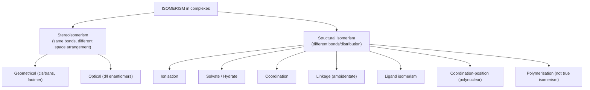

# Coordination Compounds — JEE Main + Advanced Notes

> **Sources merged into these notes**
> | Source | File |
> |---|---|
> | NCERT Class XII Chemistry (rationalised, 2023+), Unit 5 | [`lech105.pdf`](lech105.pdf) |
> | Allen — Coordination Compound module (JEE Main + Advanced, Enthusiast, English) | [`3-JAEIC-Coordination Compound_Eng.pdf.pdf`](3-JAEIC-Coordination%20Compound_Eng.pdf.pdf) |
>
> 🅰 = Allen-only content; 🆇 = extra JEE-Advanced bridging point. Cross-references to
> d-block chemistry and salt analysis are linked at the bottom.

## Contents

- [Part A — Foundations](#part-a--foundations)
  1. [Introduction & Addition Compounds](#1-introduction--addition-compounds)
  2. [Werner's Theory of Coordination Compounds](#2-werners-theory-of-coordination-compounds)
  3. [Essential Terminology](#3-essential-terminology)
  4. [Ligands — Complete Classification](#4-ligands--complete-classification)
  5. [Writing Formulas & IUPAC Nomenclature](#5-writing-formulas--iupac-nomenclature)
- [Part B — Isomerism](#part-b--isomerism)
  6. [Structural Isomerism](#6-structural-isomerism)
  7. [Stereoisomerism — Geometrical](#7-stereoisomerism--geometrical)
  8. [Stereoisomerism — Optical & Isomer Counting](#8-stereoisomerism--optical--isomer-counting)
- [Part C — Bonding Theories](#part-c--bonding-theories)
  9. [Effective Atomic Number (Sidgwick)](#9-effective-atomic-number-sidgwick)
  10. [Valence Bond Theory](#10-valence-bond-theory)
  11. [Crystal Field Theory](#11-crystal-field-theory)
  12. [Colour in Coordination Compounds](#12-colour-in-coordination-compounds)
  13. [Jahn–Teller Distortion](#13-jahnteller-distortion)
- [Part D — Stability, Carbonyls & Applications](#part-d--stability-carbonyls--applications)
  14. [Stability of Complexes](#14-stability-of-complexes)
  15. [Bonding in Metal Carbonyls](#15-bonding-in-metal-carbonyls)
  16. [Importance & Applications](#16-importance--applications)
  17. [Solved-Example Patterns & JEE Pointers](#17-solved-example-patterns--jee-pointers)
  18. [Quick Revision Sheet](#18-quick-revision-sheet)

---

# Part A — Foundations

## 1. Introduction & Addition Compounds

- Coordination chemistry grew from the **complex-forming tendency of transition
  elements**. Coordination compounds are the backbone of modern inorganic and
  bio-inorganic chemistry and of chemical industry.
- Vital examples: **chlorophyll (Mg)**, **haemoglobin (Fe)**, **vitamin B₁₂
  (cyanocobalamin, Co)**. They matter in analytical chemistry, polymerisation,
  metallurgy/refining, photography, water purification, electroplating, textile
  dyeing and medicinal chemistry.

**Addition compounds** form when solutions of two or more salts in simple molecular
proportion are evaporated and new crystals separate:

```
K2SO4 + Al2(SO4)3 + 24 H2O → K2SO4·Al2(SO4)3·24H2O   (potash alum)
CuSO4 + 4 NH3 + H2O → [Cu(NH3)4]SO4·H2O
```

They divide into two classes:

| Class | Behaviour in solution | Example |
|---|---|---|
| **Double salts** | lose identity — dissociate completely into simple ions | potash alum → K⁺, Al³⁺, SO₄²⁻; Mohr's salt; carnallite KCl·MgCl₂·6H₂O |
| **Coordination compounds** | retain identity — furnish a complex ion | K₄[Fe(CN)₆] → 4 K⁺ + [Fe(CN)₆]⁴⁻ (no free Fe²⁺, no free CN⁻) |

🅰 Allen further splits complexes by stability of the complex ion:
- **Perfect complexes** — complex ion practically undissociated
  (K₄[Fe(CN)₆]: [Fe(CN)₆]⁴⁻ gives **no tests for Fe²⁺ or CN⁻**).
- **Imperfect complexes** — reversibly dissociated enough to respond to tests of the
  simple ions (K₂[Cd(CN)₄] ⇌ Cd²⁺ + 4 CN⁻ — this is why CdS *can* precipitate from it,
  see Salt Analysis notes).

## 2. Werner's Theory of Coordination Compounds

Alfred Werner (1866–1919, Nobel 1913) proposed **primary and secondary valences**.

**The key experiment** — CoCl₃–NH₃ series with excess AgNO₃ in cold:

| Compound (old) | Modern formula | AgCl precipitated | Conductivity |
|---|---|---|---|
| CoCl₃·6NH₃ (yellow) | [Co(NH₃)₆]Cl₃ | 3 mol | 1:3 electrolyte |
| CoCl₃·5NH₃ (purple) | [Co(NH₃)₅Cl]Cl₂ | 2 mol | 1:2 electrolyte |
| CoCl₃·4NH₃ (green) | [Co(NH₃)₄Cl₂]Cl | 1 mol | 1:1 electrolyte |
| CoCl₃·4NH₃ (violet) | [Co(NH₃)₄Cl₂]Cl | 1 mol | 1:1 electrolyte |

The last two have the same empirical formula but different properties → **isomers**
(Werner deduced their octahedral geometry — green = *trans*, violet = *cis*).

**Postulates:**
1. Metals show two kinds of linkages — **primary** (ionisable, satisfied by anions;
   = oxidation state) and **secondary** (non-ionisable, satisfied by neutral molecules
   or anions, rarely cations; = **coordination number**, fixed for a metal).
2. Ligands satisfying secondary valencies point to **fixed positions in space** →
   definite geometry (coordination polyhedron). Common polyhedra: **octahedral,
   tetrahedral, square planar**: [Co(NH₃)₆]³⁺, [CoCl(NH₃)₅]²⁺, [CoCl₂(NH₃)₄]⁺ are
   octahedral; [Ni(CO)₄] tetrahedral; [PtCl₄]²⁻ square planar.
3. The species inside the square brackets = **coordination entity**; outside =
   **counter ions**.

🅰 **Allen extras:**
- Werner-type Pt series (same logic):

| Old formula | Modern formula | Cl⁻ pptd | Total ions |
|---|---|---|---|
| PtCl₄·6NH₃ | [Pt(NH₃)₆]Cl₄ | 4 | 5 |
| PtCl₄·5NH₃ | [Pt(NH₃)₅Cl]Cl₃ | 3 | 4 |
| PtCl₄·4NH₃ | [Pt(NH₃)₄Cl₂]Cl₂ | 2 | 3 |
| PtCl₄·3NH₃ | [Pt(NH₃)₃Cl₃]Cl | 1 | 2 |
| PtCl₄·2NH₃ | [Pt(NH₃)₂Cl₄] | 0 | 0 (non-electrolyte) |

- **Werner's representation:** dotted lines = primary valency, continuous lines =
  secondary valency; a Cl⁻ may satisfy both at once.
- 🆇 **Secondary-valence worked examples (NCERT Ex. 5.1):** from AgCl-precipitation
  data: PdCl₂·4NH₃ → 2, NiCl₂·6H₂O → 2, PtCl₄·2HCl → 0, CoCl₃·4NH₃ → 1,
  PtCl₂·2NH₃ → 0.

## 3. Essential Terminology

| Term | Meaning | Example |
|---|---|---|
| **Coordination entity** | central atom/ion + fixed number of bonded ions/molecules | [CoCl₃(NH₃)₃], [Ni(CO)₄], [Fe(CN)₆]⁴⁻ |
| **Central atom/ion** | the Lewis acid that accepts electron pairs | Ni²⁺ in [NiCl₂(H₂O)₄]; Co³⁺ in [CoCl(NH₃)₅]²⁺ |
| **Ligand** | Lewis base bonded to the central ion | Cl⁻, H₂O, NH₃, en, EDTA⁴⁻ |
| **Coordination number (CN)** | number of ligand **donor atoms** σ-bonded to the metal (π bonds NOT counted) | 6 in [PtCl₆]²⁻, [Fe(C₂O₄)₃]³⁻ (ox is didentate), [Co(en)₃]³⁺ |
| **Coordination sphere** | everything inside [ ] | [Fe(CN)₆]⁴⁻ in K₄[Fe(CN)₆]; K⁺ = counter ion |
| **Coordination polyhedron** | spatial arrangement of donor atoms | octahedral [Co(NH₃)₆]³⁺; tetrahedral [Ni(CO)₄]; square planar [PtCl₄]²⁻ |
| **Oxidation number** | charge on metal if all ligands removed with their shared pairs; written in Roman numerals | Cu in [Cu(CN)₄]³⁻ is +1 → Cu(I) |
| **Homoleptic** | one kind of donor group | [Co(NH₃)₆]³⁺ |
| **Heteroleptic** | more than one kind | [Co(NH₃)₄Cl₂]⁺ |

🅰 **Common coordination numbers of important metals (memorise):**

| Metal | CN | | Metal | CN |
|---|---|---|---|---|
| Cu⁺, Au⁺ | 2, 4 | | Ni²⁺, Fe²⁺, Co²⁺ | 4, 6 |
| Ag⁺ | 2 | | Fe³⁺, Co³⁺, Al³⁺, Sc³⁺ | 6 |
| Hg₂²⁺ | 2 | | Pt²⁺, Pd²⁺, Cu²⁺, Ag²⁺ | 4 |
| Mg²⁺ | 6 | | Pt⁴⁺, Pd⁴⁺ | 6 |

## 4. Ligands — Complete Classification

**(A) By charge:** neutral (H₂O, NH₃, CO, NO, C₆H₆); **positive** (NO⁺, N₂H₅⁺ 🅰);
negative (Cl⁻, CN⁻, NO₂⁻, OH⁻…).

**(B) By denticity** (number of electron pairs donated / donor atoms used):

| Denticity | Ligands |
|---|---|
| Uni- (1) | X⁻, CN⁻, NO₂⁻, NH₃, py, OH⁻, NO₃⁻, H₂O, SO₃²⁻, CO, NO, O²⁻, PPh₃ |
| Bi- (2) | **en** (ethane-1,2-diamine), **ox²⁻** (oxalate), **DMG⁻**, **o-phen** (1,10-phenanthroline), **dipy** (2,2′-bipyridyl), pn/bn/tn (propylene/butylene/trimethylene diamine), **acac⁻** (acetylacetonate), **gly⁻** (glycinato), CO₃²⁻ |
| Tri- (3) | dien (diethylenetriamine), terpy (2,2′:6′,2″-terpyridine) |
| Tetra- (4) | trien (triethylenetetraamine), nta³⁻ (nitrilotriacetate) |
| Penta- (5) | ethylenediamine triacetate (EDTA³⁻) |
| **Hexa- (6)** | **EDTA⁴⁻** — binds through **2 N + 4 O** atoms |

- **Chelate ligands:** di-/polydentate ligands binding through two or more donor atoms
  simultaneously, forming rings → **chelate complexes are more stable** than analogous
  unidentate complexes (the **chelate effect**; the number of ring-forming groups =
  denticity).
- **Ambidentate ligands** — two different donor atoms, only one binds at a time:

| Ligand | binds via | names |
|---|---|---|
| NO₂⁻ | N / O | nitro / nitrito |
| CN⁻ | C / N | cyanido / isocyanido |
| SCN⁻ | S / N | thiocyanato-S / -N |
| CNO⁻ | C / N | cyanato / isocyanato |
| S₂O₃²⁻ | S / O | thiosulphato |
| SeCN⁻ | Se / N | selenocyanato |

- 🅰 **Flexidentate ligands:** sometimes coordinate using fewer donor sites than
  available (SO₄²⁻, CO₃²⁻).
- 🅰 **By bonding interaction:** **classical (σ-donor only)** ligands (O²⁻, OH⁻, F⁻)
  vs **π-acid / π-acceptor ligands** that also accept back-donated electron density
  (CO, CN⁻, NO⁺, PF₃, PR₃) — the origin of zero/low oxidation states in carbonyls.

## 5. Writing Formulas & IUPAC Nomenclature

### 5.1 Formula rules (IUPAC)

1. Central atom **first**; 2. ligands in **alphabetical order** (placement ignores
   charge — 2004 draft); 3. polydentate/abbreviated ligands also alphabetised by first
   letter of the abbreviation; 4. whole entity in [ ], polyatomic ligands and
   abbreviations in ( ); 5. no spaces inside the sphere; 6. charge as right superscript,
   number before sign ([Co(CN)₆]³⁻); 7. cation and anion charges balance.

### 5.2 Naming rules

1. **Cation named first** in all cases. 2. Ligands named alphabetically **before** the
   metal (reverse order of formula writing). 3. Anionic ligands end in **-o** (2004
   draft: **-ido** — chloro → chlorido); special neutral names: **aqua** (H₂O),
   **ammine** (NH₃), **carbonyl** (CO), **nitrosyl** (NO); 🅰 positive ligands end in
   **-ium** (NO⁺ nitrosonium/nitrosylium; N₂H₅⁺ hydrazinium).
4. Number of ligands: **di-, tri-, tetra-**… but **bis-, tris-, tetrakis-** when the
   ligand name already contains a numerical prefix (or is polydentate/organic):
   [NiCl₂(PPh₃)₂] = dichloridobis(triphenylphosphine)nickel(II).
5. Metal oxidation state in Roman numerals. 6. Metal in a **cationic/neutral** entity
   keeps its name; in an **anionic** entity it ends in **-ate**, with Latin names for
   some metals (Fe → **ferrate**, Ag → **argentate**, Cu → **cuprate**, Au → aurate,
   Pb → plumbate, Sn → stannate). 7. Outer-sphere anion named last.

**Ligand name table (🅰 + NCERT):** CO₃²⁻ carbonato, SO₃²⁻ sulphito, C₂O₄²⁻ oxalato,
CH₃COO⁻ acetato, SO₄²⁻ sulphato, NO₃⁻ nitrato, S₂O₃²⁻ thiosulphato, ONO⁻ nitrito,
NO₂⁻ (via N) nitro.

### 5.3 Worked examples to learn

| Formula | IUPAC name |
|---|---|
| K₄[Fe(CN)₆] | potassium hexacyanidoferrate(II) |
| K₂[PtCl₆] | potassium hexachloridoplatinate(IV) |
| [Co(NH₃)₆]Cl₃ | hexaamminecobalt(III) chloride |
| [Cr(H₂O)₄Cl₂]Cl | tetraaquadichloridochromium(III) chloride |
| [Pt(NH₃)₂Cl₄] | diamminetetrachloridoplatinum(IV) |
| [Co(NH₃)₃Cl₃] | triamminetrichloridocobalt(III) |
| K₃[Co(NO₂)₆] | potassium hexanitrocobaltate(III) |
| **Na₃[Fe(CN)₅NO]** | **sodium pentacyanonitrosylferrate(II)** — NO counts as **NO⁺**, so Fe is **+2** 🅰 |
| [NiCl₄]²⁻ | tetrachloridonickelate(II) ion |
| [Fe(en)₃]Cl₃ | tris(ethylenediamine)iron(III) chloride |
| [Ni(Gly)₂] | bis(glycinato)nickel(II) |
| [Cr(NH₃)₃(H₂O)₃]Cl₃ | triamminetriaquachromium(III) chloride |
| [Co(en)₃]₂(SO₄)₃ | tris(ethane-1,2-diamine)cobalt(III) sulphate |
| [Ag(NH₃)₂][Ag(CN)₂] | diamminesilver(I) dicyanidoargentate(I) — same metal, different names in cation vs anion |
| [Pt(NH₃)₂Cl(NO₂)] | diamminechloridonitrito-N-platinum(II) |
| K₃[Cr(C₂O₄)₃] | potassium trioxalatochromate(III) |
| [CoCl₂(en)₂]Cl | dichloridobis(ethane-1,2-diamine)cobalt(III) chloride |
| [Co(NH₃)₅(CO₃)]Cl | pentaamminecarbonatocobalt(III) chloride |
| Hg[Co(SCN)₄] | mercury(I) tetrathiocyanato-S-cobaltate(III) |

**Name → formula (NCERT Ex. 5.2):** tetraammineaquachloridocobalt(III) chloride →
[Co(NH₃)₄(H₂O)Cl]Cl₂; potassium tetrahydroxidozincate(II) → K₂[Zn(OH)₄]; potassium
trioxalatoaluminate(III) → K₃[Al(C₂O₄)₃]; dichloridobis(ethane-1,2-diamine)cobalt(III)
→ [CoCl₂(en)₂]⁺; tetracarbonylnickel(0) → [Ni(CO)₄].

🅰 **Polynuclear complexes & bridging ligands:** a ligand linking two metal ions is a
**bridging ligand**, prefixed by Greek **µ-** for each bridge —
e.g. [(H₂O)₄Fe(µ-NH₂)(µ-OH)Fe(H₂O)₄](SO₄)₂ =
tetraaquairon(III)-µ-amido-µ-hydroxotetraaquairon(III) sulphate.

# Part B — Isomerism



## 6. Structural Isomerism

### 6.1 Ionisation isomerism
Counter ion is itself a potential ligand and swaps places with a ligand:
- **[Co(NH₃)₅(SO₄)]Br** vs **[Co(NH₃)₅Br]SO₄**
- 🅰 [Co(NH₃)₄Br₂]SO₄ (red-violet) vs [Co(NH₃)₄SO₄]Br₂ (red);
  [Pt(NH₃)₄Cl₂]Br₂ vs [Pt(NH₃)₄Br₂]Cl₂; [Co(NH₃)₄(NO₃)₂]SO₄ vs [Co(NH₃)₄SO₄](NO₃)₂.
- **Distinguishing test (NCERT Intext 5.4):** with Ba²⁺ only the sulphate-outside form
  gives BaSO₄; with Ag⁺ only the bromide-outside form gives AgBr.

### 6.2 Solvate / hydrate isomerism
Solvent molecules either inside the sphere or free in the lattice.
🆇 Called "hydrate isomerism" when the solvent is water. The classic set —
**CrCl₃·6H₂O has four hydrate isomers** 🅰:

| Isomer | Colour | Cl⁻ pptd by AgNO₃ |
|---|---|---|
| [Cr(H₂O)₆]Cl₃ | violet | 3 |
| [Cr(H₂O)₅Cl]Cl₂·H₂O | grey-green | 2 |
| [Cr(H₂O)₄Cl₂]Cl·2H₂O | dark green | 1 |
| [Cr(H₂O)₃Cl₃]·3H₂O | dark green | 0 |

### 6.3 Linkage isomerism
From **ambidentate ligands**. Jørgensen's classic:
**[Co(NH₃)₅(NO₂)]Cl₂** — **yellow nitro form** (Co–NO₂, via N; stable to acids) and
**red nitrito form** (Co–ONO, via O; decomposed by acids). 🅰 Distinguished by IR
spectroscopy. Also M–NCS vs M–SCN.

### 6.4 Coordination isomerism
Ligand interchange between cationic and anionic complex entities:
**[Co(NH₃)₆][Cr(CN)₆]** vs **[Cr(NH₃)₆][Co(CN)₆]**. 🅰 Also
[Co(NH₃)₆][Cr(C₂O₄)₃] vs [Cr(NH₃)₆][Co(C₂O₄)₃].

### 6.5 Ligand isomerism 🅰
The ligand itself has isomeric forms: complexes of 1,2-diaminopropane (pn) vs
1,3-diaminopropane (tn) — e.g. [Fe(H₂O)₂C₃H₆(NH₂)₂Cl₂] exists in both.

### 6.6 Coordination-position isomerism 🅰
In **polynuclear** complexes — interchange of ligands between different metal nuclei
(e.g. bridging vs terminal Cl/PPh₃ in Pd₂ complexes).

### 6.7 Polymerisation isomerism 🅰
Same **empirical** formula, different molecular weight — *not true isomerism*:
[Pt(NH₃)₂Cl₂] vs [Pt(NH₃)₄][PtCl₄].

## 7. Stereoisomerism — Geometrical

**Square planar (CN 4):**
- **Ma₂b₂** → cis + trans; the famous pair **[Pt(NH₃)₂Cl₂]** — *cis*-platin
  (anti-cancer) vs *trans*.
- **Ma₂bc** → cis + trans ([Pt(NH₃)₂ClBr]).
- **Mabcd** → **3 isomers** (two cis-type, one trans-type).
- **Tetrahedral complexes NEVER show geometrical isomerism** — all positions are
  mutually adjacent (NCERT Intext example).

**Octahedral (CN 6):**
- **Ma₄b₂ / [MX₂L₄]** → cis & trans ([Co(NH₃)₄Cl₂]⁺, [Fe(NH₃)₄Cl₂]).
- **[MX₂(L–L)₂]** (didentate ligand) → cis & trans; **the cis isomer is optically
  active** ([CoCl₂(en)₂]⁺).
- **Ma₃b₃** → **fac** (three identical ligands on one octahedral face) and **mer**
  (around the meridian) — e.g. [Co(NH₃)₃(NO₂)₃].

```
octahedral Ma4b2:                 octahedral Ma3b3:
   cis: b's at 90°                 fac: a-a-a on one face
   trans: b's at 180°              mer: a's around a meridian
```

## 8. Stereoisomerism — Optical & Isomer Counting

- Optical isomers = **non-superimposable mirror images (enantiomers)**; chiral
  complexes rotate plane-polarised light: **d (+) dextrorotatory, l (−)
  laevorotatory**.
- Common in **octahedral complexes with didentate ligands**: **[Co(en)₃]³⁺** (d/l),
  **cis-[PtCl₂(en)₂]²⁺** (only the cis form is optically active; trans has a plane of
  symmetry), cis-[CrCl₂(ox)₂]³⁻ is chiral, trans is not (NCERT Ex. 5.5).
- 🅰 Expected even in **tetrahedral Mabcd** complexes (all four ligands different).

### Isomer-count tables 🅰 (JEE Advanced favourites — memorise)

**Geometrical isomers, octahedral (all monodentate):**

| Formula | No. of GI |
|---|---|
| Ma₆, Ma₅b | none |
| Ma₄b₂, Ma₄bc | 2 |
| Ma₃b₃, Ma₃b₂c | 2 / 3 |
| Ma₃bcd | 4 |
| Ma₂b₂c₂ | 5 |
| Ma₂b₂cd | 6 |
| Ma₂bcde | 9 |
| **Mabcdef** | **15** |

**Total stereoisomers & enantiomer pairs (uppercase = chelating ligand):**

| Formula | Stereoisomers | Enantiomer pairs |
|---|---|---|
| Ma₂b₂ (sq. planar) | 2 | 0 |
| Ma₃b₃ | 2 | 0 |
| Ma₂bc | 2 | 0 |
| Ma₃bcd | 5 | 1 |
| Ma₂bcde | 15 | 6 |
| Mabcdef | 30 | 15 |
| Ma₂b₂c₂ | 6 | 1 |
| Ma₂b₂cd | 8 | 2 |
| Ma₃b₂c | 3 | 0 |
| M(AA)(BC)de | 10 | 5 |
| M(AB)(AB)cd | 11 | 5 |
| M(AB)(CD)ef | 20 | 10 |
| M(AB)₃ | 4 | 2 |

🆇 Quick logic for the common ones: Ma₄b₂ = 2 (cis/trans); [M(AA)₃] = 2 (Δ/Λ);
[M(AA)₂X₂] = 3 (trans = 1, cis = d + l pair); Ma₃b₃ = 2 (fac/mer).

# Part C — Bonding Theories

Werner explained *what* bonds form; VBT/CFT explain *why* — directional bonding,
magnetism, colour. (Ligand Field Theory and MOT refine CFT further but are beyond
NCERT.)

## 9. Effective Atomic Number (Sidgwick)

🅰 **EAN** = total electrons on the central metal **after** receiving ligand lone
pairs:

```
EAN = (Z of metal − oxidation state) + 2 × (coordination number)
```

Stable complexes tend to reach the **atomic number of the next noble gas**:
- K₄[Fe(CN)₆]: Fe²⁺ → 26 − 2 + 12 = **36 (Kr)** ✓
- K₃[Cr(C₂O₄)₃]: Cr³⁺ → 24 − 3 + 12 = **33** (does not reach Kr — given in module as a
  counter-example)
- [Ni(CO)₄]: 28 − 0 + 8 = 36 (Kr) — explains the stability of metal carbonyls.

## 10. Valence Bond Theory

Under ligand influence the metal hybridises (n−1)d, ns, np (or nd) orbitals into
equivalent hybrid orbitals that accept ligand lone pairs.

**Hybridisation ↔ geometry table (combined NCERT + Allen):**

| CN | Hybridisation | Geometry | Examples |
|---|---|---|---|
| 2 | sp | linear | [Ag(NH₃)₂]⁺, [Ag(CN)₂]⁻ |
| 3 | sp² | trigonal planar | [HgI₃]⁻ |
| 4 | sp³ | tetrahedral | [NiCl₄]²⁻, [ZnCl₄]²⁻, [FeCl₄]⁻, **[Ni(CO)₄]**, [Zn(NH₃)₄]²⁺ |
| 4 | **dsp²** (d = dx²−y²) | square planar | [Ni(CN)₄]²⁻, [PdCl₄]²⁻, [Pt(NH₃)₄]²⁺, [Cu(NH₃)₄]²⁺, [PtCl₄]²⁻ |
| 5 | sp³d / dsp³ (d = dz²) | trigonal bipyramidal | **[Fe(CO)₅]**, [CuCl₅]³⁻ |
| 5 | sp³d / dsp³ (d = dx²−y²) | square pyramidal | [Ni(CN)₅]³⁻ |
| 6 | **d²sp³** (inner) or **sp³d²** (outer) | octahedral | d²sp³: [Co(NH₃)₆]³⁺, [Fe(CN)₆]³⁻, [Cr(NH₃)₆]³⁺; sp³d²: [CoF₆]³⁻, [FeF₆]³⁻, [Ni(NH₃)₆]²⁺ |

(In octahedral hybridisation the d-orbitals used are always dx²−y² and dz².)

### Worked VBT cases (learn these five)

1. **[Co(NH₃)₆]³⁺** — Co³⁺ is 3d⁶; NH₃ (strong field) pairs electrons leaving two 3d
   orbitals vacant → **d²sp³**, all paired → **diamagnetic**, **inner orbital / low
   spin**.
2. **[CoF₆]³⁻** — F⁻ (weak field), no pairing → **sp³d²** (uses 4d), **4 unpaired
   e⁻**, **outer orbital / high spin**, paramagnetic.
3. **[NiCl₄]²⁻** — Ni²⁺ 3d⁸; Cl⁻ weak → **sp³ tetrahedral**, 2 unpaired e⁻,
   paramagnetic.
4. **[Ni(CO)₄]** — Ni(0) 3d⁸4s²; CO forces 4s electrons into 3d (pairing) → **sp³**,
   **diamagnetic**, tetrahedral.
5. **[Ni(CN)₄]²⁻** — Ni²⁺ 3d⁸; CN⁻ pairs electrons, one 3d vacant → **dsp² square
   planar**, **diamagnetic**.
   🆇 Same metal, CN 4: weak Cl⁻ → tetrahedral/paramagnetic; strong CN⁻ → square
   planar/diamagnetic. Contrast [NiCl₄]²⁻ (paramagnetic) vs [Ni(CO)₄] (diamagnetic) —
   both tetrahedral but different metal oxidation states (Ni²⁺ d⁸ vs Ni⁰ d¹⁰).

### Magnetic-data complications (NCERT 5.5.2)

For d¹–d³ ions (Ti³⁺, V³⁺, Cr³⁺) two vacant 3d orbitals are always available →
octahedral d²sp³ regardless of ligand. From d⁴ up, pairing *may or may not* occur:
- [Mn(CN)₆]³⁻ → 2 unpaired; [MnCl₆]³⁻ → 4 unpaired
- [Fe(CN)₆]³⁻ → 1 unpaired; [FeF₆]³⁻ → 5 unpaired
- [CoF₆]³⁻ → 4 unpaired; [Co(C₂O₄)₃]³⁻ → diamagnetic
CN⁻/ox²⁻ force inner-orbital (d²sp³) entities; F⁻/Cl⁻ give outer-orbital (sp³d²).
- **Spin-only moment:** μ = √(n(n+2)) BM; Bohr magneton = eh/4πmc 🅰.
- **Geometry from magnetism (NCERT Ex. 5.7):** [MnBr₄]²⁻ with μ = 5.9 BM has 5
  unpaired e⁻ → **tetrahedral** (dsp² would pair d⁸ to diamagnetic).
- **Limitations of VBT:** many assumptions; no quantitative magnetism; no colour;
  no quantitative thermodynamic/kinetic stability; can't reliably choose tetrahedral
  vs square planar; doesn't distinguish weak/strong ligands.

## 11. Crystal Field Theory

CFT treats the M–L bond as **ionic**: ligands = point charges (anions) or point
dipoles (neutral). In a free ion the five d orbitals are **degenerate**; an
asymmetric ligand field lifts the degeneracy → **crystal field splitting**.

### 11.1 Octahedral splitting

Ligands approach along the axes → **dx²−y², dz² (eg set)** are raised; **dxy, dyz,
dxz (t2g set)** are lowered relative to the barycentre:

```
                        eg (dx2-y2, dz2)     +0.6 Δo  (= +3/5 Δo)
 free ion      ---- barycentre ----
 d (degenerate)                     split by 6L
                        t2g (dxy, dxz, dyz)  -0.4 Δo  (= -2/5 Δo)
```

- Δo depends on the ligand field and metal charge.
- **Spectrochemical series** (experimental; increasing field strength):
  `I⁻ < Br⁻ < SCN⁻ < Cl⁻ < (S²⁻) < F⁻ < OH⁻ < C₂O₄²⁻ < H₂O < NCS⁻ < edta⁴⁻ < NH₃ < en < CN⁻ < CO`
  (SCN⁻ written for S-donation, NCS⁻ for N-donation 🅰.)
- **Δo vs pairing energy P (the decisive rule):**
  - **Δo < P** → 4th e⁻ goes to eg: t₂g³eg¹ → **weak field → HIGH spin**
  - **Δo > P** → 4th e⁻ pairs in t₂g: t₂g⁴eg⁰ → **strong field → LOW spin**
  - d⁴–d⁷ entities are the ones where high/low spin choices exist; d⁴–d⁷ strong-field
    complexes gain extra stability.
- **CFSE (octahedral) 🅰:**  `CFSE = (−0.4 n_t2g + 0.6 n_eg) Δo + xP`
  (x = number of electron pairs).

### 11.2 Tetrahedral splitting

- Inverted and smaller: **e set** (dz², dx²−y²) lower, **t₂ set** (dxy, dxz, dyz)
  higher; no 'g' subscript (no centre of symmetry).
- **Δt = (4/9) Δo** 🅰 — because only 4 ligands (2/3 the field) and none point
  directly at orbitals (× 2/3 again).
- Splitting never large enough to force pairing → **low-spin tetrahedral complexes
  are essentially unknown**. Since Δt < Δo, octahedral geometry is generally favoured
  (CN 6 > CN 4 preference).
- **CFSE (tetrahedral) 🅰:** `CFSE = (−0.6 n_t2 + 0.4 n_e) Δt + xP`.

### 11.3 Square planar splitting 🅰

Remove the two trans (z-axis) ligands from an octahedron:

```
dx2-y2   (highest — ligands approach along x, y)
dxy
dz2
dxz, dyz (lowest — no ligand on z-axis)
```

Δsp = Δ₁ + Δ₂ + Δ₃ > Δo; experimentally **Δsp ≈ 1.3 Δo**. This is why d⁸ metals with
strong ligands (Ni²⁺/Pd²⁺/Pt²⁺ + CN⁻) go square planar and diamagnetic.

### 11.4 Factors influencing Δ / CFSE 🅰

1. **Higher oxidation state → larger Δ:** [Fe(H₂O)₆]³⁺ > [Fe(H₂O)₆]²⁺.
2. Same charge, **more d-electrons → larger CFSE:** [Co(H₂O)₆]²⁺ < [Ni(H₂O)₆]²⁺.
3. **Higher d-orbital quantum number → larger Δ:** [Co(NH₃)₆]³⁺ < [Rh(NH₃)₆]³⁺ <
   [Ir(NH₃)₆]³⁺ (3d < 4d < 5d).
4. Geometry: Δt = (4/9)Δo; Δsp ≈ 1.3 Δo.
5. **Chelating ligands increase CFSE:** [Fe(ox)₃]³⁻ > [Fe(SCN)₆]³⁻.

**Limitations of CFT:** anionic ligands ought to split most (point-charge logic) yet
sit at the weak end of the spectrochemical series; ignores covalent character — both
resolved by Ligand Field Theory / MOT.

## 12. Colour in Coordination Compounds

- d–d transitions: an electron is promoted t₂g → eg; absorbed frequency lies in the
  visible; observed colour = **complementary** of absorbed.
- **[Ti(H₂O)₆]³⁺ (3d¹):** absorbs blue-green (~498 nm), appears **violet**;
  t₂g¹eg⁰ → t₂g⁰eg¹.
- **No ligand → no splitting → colourless:** heated anhydrous [Ti(H₂O)₆]Cl₃ is
  colourless; **anhydrous CuSO₄ is white**, CuSO₄·5H₂O is blue.

**Absorbed vs observed colour (NCERT Table 5.3):**

| Complex | λ absorbed (nm) | Absorbed | Observed |
|---|---|---|---|
| [CoCl(NH₃)₅]²⁺ | 535 | yellow | violet |
| [Co(NH₃)₅(H₂O)]³⁺ | 500 | blue-green | red |
| [Co(NH₃)₆]³⁺ | 475 | blue | yellow-orange |
| [Co(CN)₆]³⁻ | 310 | UV (not visible) | pale yellow |
| [Cu(H₂O)₄]²⁺ | 600 | red | blue |
| [Ti(H₂O)₆]³⁺ | 498 | blue-green | violet |

- **Ligand effect on colour — the Ni²⁺ + en series:**
  [Ni(H₂O)₆]²⁺ (green) → +en → [Ni(H₂O)₄(en)]²⁺ (pale blue) → [Ni(H₂O)₂(en)₂]²⁺
  (blue/purple) → [Ni(en)₃]²⁺ (violet). Stronger field → larger Δ → higher-energy
  (shorter-λ) absorption.
- **Gemstones 🆇:** ruby = Al₂O₃ with 0.5–1% Cr³⁺ (d³) in octahedral Al³⁺ sites —
  d–d transitions give the red; emerald = Cr³⁺ in octahedral sites of beryl
  Be₃Al₂Si₆O₁₈ — different field shifts the absorption bands so green is transmitted.
- 🆇 Order of absorption wavelength for [Ni(NO₂)₆]⁴⁻ > [Ni(NH₃)₆]²⁺ > [Ni(H₂O)₆]²⁺
  follows the spectrochemical series (NO₂⁻ > NH₃ > H₂O) — NCERT Ex. 5.31 pattern.

## 13. Jahn–Teller Distortion 🅰 (JEE Advanced special)

- **Symmetrical filling of t₂g/eg → no distortion; unsymmetrical filling → distortion**
  of the octahedral geometry (usually **tetragonal** — elongation or compression of
  axial bonds).
- **Strong JT effect** when the **eg set is asymmetrically occupied**:
  **d⁴ high-spin, d⁷ low-spin, d⁹**.
- **Weak JT effect** when only t₂g is asymmetric: d¹, d², d⁴ LS, d⁵ LS, d⁶ HS, d⁷ HS.
- Symmetric configurations (d³, d⁵ HS, d⁶ LS, d⁸, d¹⁰…) → no distortion.
- Classic examples:
  - **[Cu(H₂O)₆]²⁺ (d⁹, t₂g⁶eg³):** tetragonal — four short equatorial Cu–O bonds,
    two long axial ones. Same for [Cr(H₂O)₆]²⁺ (d⁴ HS).
  - **Au(II) (d⁹, 5d → huge Δ) disproportionates:** 2 Au²⁺ → Au⁺ (d¹⁰) + Au³⁺ (d⁸,
    square planar).
  - **[Cu(en)₃]²⁺ does not exist** — JT strain along the z-axis chelate; the real
    species is [Cu(en)₂(H₂O)₂]²⁺ with stability order
    **trans-[Cu(en)₂(H₂O)₂]²⁺ > cis-[Cu(en)₂(H₂O)₂]²⁺ ≫ [Cu(en)₃]²⁺ (absent)**.
- JEE Main 2022 patterns: maximum JT distortion among Cu(II) complexes →
  **[Cu(H₂O)₆]SO₄** (weak-field H₂O, no chelate constraint); octahedral
  [Cu(en)₂(SCN)₂] → 3 relatively more stable isomers considering JT.

# Part D — Stability, Carbonyls & Applications

## 14. Stability of Complexes

🅰 Stepwise formation of an aquo-metal complex (ignoring charges):

```
[M(H2O)6] + L ⇌ [M(H2O)5L] + H2O        K1
[M(H2O)5L] + L ⇌ [M(H2O)4L2] + H2O      K2
...
[M(H2O)Ln-1] + L ⇌ [MLn] + H2O          Kn
Overall stability constant:  βn = K1 × K2 × ... × Kn
```

- **Thermodynamic stability** — magnitude of βn at equilibrium; larger βn = more
  product. Measured from aqueous solutions (ligand displaces water from the aqua
  ion).
- **Kinetic stability** — the **rate** at which ligand substitution occurs; a
  thermodynamically unstable complex can be kinetically inert (slow to react), and
  vice versa.
- **Chelate effect:** multidentate ligands give markedly larger β values than
  analogous unidentate ligands — the driving force is **entropy** (more particles
  released into solution per exchange).

## 15. Bonding in Metal Carbonyls

**Homoleptic carbonyls** — structures fixed by hybridisation:

| Carbonyl | Geometry | Hybridisation (VBT) |
|---|---|---|
| **Ni(CO)₄** | tetrahedral | sp³ (Ni: 3d⁸4s² → d¹⁰) |
| **Fe(CO)₅** | trigonal bipyramidal | dsp³ |
| **Cr(CO)₆** | octahedral | d²sp³ |
| **Mn₂(CO)₁₀** | two square pyramids joined apex-to-apex | dsp³ + **Mn–Mn bond** |
| **Co₂(CO)₈** | bridged dimer | Co–Co bond + **2 bridging CO** ligands |

🅰 EAN is satisfied in all (Ni 36, Fe 36, Cr 36; the metal–metal bond supplies the
missing electron in Mn and Co).

**Synergic (σ + π) bonding:**

```
M  —σ donate→  CO   (lone pair on C → empty metal hybrid)
M  ←π back—   CO    (filled metal dπ → empty π* antibonding of CO)
```

- The metal→CO π back-donation strengthens the M–C σ bond **and** weakens the C≡O
  bond (C–O stretch frequency in IR is diagnostic — bridging CO absorbs at lower ν).
- π back-bonding **stabilises the zero oxidation state**.
- 🆇 **NO as ligand:** NO⁺ donates 2 e⁻; neutral NO donates 3 e⁻ in nitrosyl complexes.

## 16. Importance & Applications

### 16.1 Analytical chemistry & quantitative analysis
- **EDTA titrations** — Ca²⁺/Mg²⁺ (water hardness), many cations; complexometric
  titration curves (pM vs volume, with equivalence-point jump — Allen solved example).
- **Selective precipitants:** DMG for Ni²⁺ (red, with intramolecular H-bonding; the
  complex is dsp² square planar and diamagnetic 🅰), α-nitroso-β-naphthol and cupferron
  for Co²⁺, cupron for Cu²⁺.
- 🅰 **AgNO₃-precipitation stoichiometry (solved example):**
  [Cr(H₂O)₅Cl]Cl₂ furnishes **2 free Cl⁻** → 30 mL of 0.01 M complex needs
  60 mL × … = **6 mL of 0.1 M AgNO₃** (2 Cl⁻ × 0.3 mmol).

### 16.2 Extraction / purification of metals
- **Gold & silver:** dissolve ore in dilute NaCN (aerated) →
  [Au(CN)₂]⁻ / [Ag(CN)₂]⁻; metal recovered by Zn cementation.
- **Mond process (Ni):** Ni + 4 CO → Ni(CO)₄ (volatile, 330–350 K) → pure Ni + 4 CO
  at 450–470 K.

### 16.3 Biological importance (bio-inorganic chemistry)

| Molecule | Metal | Role |
|---|---|---|
| Chlorophyll | Mg | photosynthesis |
| Haemoglobin | Fe | O₂ transport |
| Vitamin B₁₂ (cyanocobalamin) | Co | prevents pernicious anaemia |
| Carbonic anhydrase | Zn | CO₂/H₂CO₃ balance in body |
| Carboxypeptidase A | Zn | enzymatic peptide-bond hydrolysis |

### 16.4 Electroplating
[Ag(CN)₂]⁻ and [Au(CN)₂]⁻ baths (alkaline) give smooth, adherent coatings — the
complex slows metal deposition (K⁺ outside the sphere keeps the bath conducting).

### 16.5 Photography
Fixing with hypo (sodium thiosulphate) dissolves unexposed AgBr as
[Ag(S₂O₃)₂]³⁻.

### 16.6 Catalysis
**Wilkinson's catalyst [(Ph₃P)₃RhCl]** — homogeneous hydrogenation of alkenes.

### 16.7 Medicinal chemistry (chelation therapy)
- **D-penicillamine / desferrioxime B** — remove excess Cu and Fe (copper/iron
  toxicity, Wilson's disease, haemosiderosis).
- **EDTA** — lead poisoning (Pb²⁺ removal).
- **cis-platin [Pt(NH₃)₂Cl₂]** — anti-cancer (the *trans* isomer is inactive).

## 17. Solved-Example Patterns & JEE Pointers

1. **AgCl-ppt counting** — ionisable Cl⁻ only: [Cr(H₂O)₅Cl]Cl₂ → 2 Cl⁻; hydrate water
   doesn't react. Use it for molarity/AgNO₃-volume problems.
2. **Hybridisation + magnetism combo** (recurring JEE pattern): [Co(NH₃)₆]³⁺ → d²sp³
   diamagnetic; [Ni(CN)₄]²⁻ → dsp² diamagnetic; [Ni(CO)₄] → sp³ diamagnetic.
3. **Ni–DMG structure** — remember the four N donors + two **O–H···O intramolecular
   H-bonds**, dsp², diamagnetic (dmg is bidentate monoanionic).
4. **Counting ionisable ions** for conductivity: [Co(NH₃)₆]Cl₃ → 1:3 (4 ions);
   PtCl₄·2NH₃ → non-electrolyte.
5. **EAN check** for carbonyls (EAN = 36) and K₄[Fe(CN)₆].
6. **CFSE comparisons** use the formulas and factors of §11.4; remember tetrahedral
   complexes are always high spin and Δt = (4/9)Δo.
7. **JT distortion** predicts: Cu(II) complexes elongated; [Cu(en)₃]²⁺ absent;
   [Cu(H₂O)₆]²⁺ most distorted.
8. **Isomer counts** — use the tables in §8; JEE Main 2022 asked them directly.
9. **Colour questions** — link ligand strength to λ absorbed; anhydrous salts are
   colourless/white when no ligand field exists.
10. **Synergic bonding** explains both M–C strengthening and C–O weakening; bridging
    CO lowers ν(CO) in IR.

## 18. Quick Revision Sheet

- Addition compounds: double salts (full dissociation) vs coordination compounds
  (complex ion survives).
- Werner: primary = ionisable = oxidation state; secondary = non-ionisable =
  coordination number; octahedral geometry explained the CoCl₃·4NH₃ twins.
- CN counts σ-bonds only; polydentate ligands → chelates (more stable: chelate
  effect, entropy); ambidentate → linkage isomerism.
- Naming: cation first; ligands alphabetical; -o/-ido anionic endings; bis/tris for
  complex ligands; -ate on metals in anions (ferrate, argentate, cuprate); µ- for
  bridges; NO⁺ counted as nitrosyl (Fe in Na₃[Fe(CN)₅NO] is +2).
- Isomerism: ionisation (swap counter ion ↔ ligand), hydrate (water in/out), linkage
  (NO₂ vs ONO), coordination (swap between cationic/anionic spheres), ligand,
  coordination-position, polymerisation (empirical only).
- Stereoisomerism: square planar Ma₂b₂/Ma₂bc/Mabcd; no GI in tetrahedral; octahedral
  Ma₄b₂, [MX₂(en)₂] (cis = optically active), fac/mer; M(AB)₃ → Δ/Λ.
- VBT geometries: sp(2) linear, sp²(3), sp³(4) tet, dsp²(4) sq planar, dsp³(5) TBP,
  d²sp³/sp³d²(6) oct; μ = √(n(n+2)).
- CFT: oct eg ↑0.6Δo / t₂g ↓0.4Δo; tet inverted, Δt = 4/9Δo; sq planar dx²−y² top,
  Δsp ≈ 1.3Δo; Δo ≶ P decides high/low spin; series I⁻ < … < H₂O < … < en < CN⁻ < CO.
- Colour: d–d transitions; observed = complementary; stronger ligand → shorter λ
  absorbed; anhydrous CuSO₄ white; ruby/emerald = Cr³⁺ d–d transitions in host
  lattices.
- JT: eg-asymmetric (d⁴ HS, d⁷ LS, d⁹) → strong distortion; Cu(II) elongated;
  [Cu(en)₃]²⁺ impossible; Au(II) disproportionates.
- Stability: βn = ΠKi; thermodynamic vs kinetic; chelate effect (entropy).
- Carbonyls: Ni(CO)₄ tet, Fe(CO)₅ TBP, Cr(CO)₆ oct; σ-donate + π-back-bond
  (synergic); EAN = 36 satisfied.
- Applications: EDTA hardness/titrations, cyanide leaching of Au/Ag, Mond Ni,
  chlorophyll/haemoglobin/B₁₂, Wilkinson, [Ag(CN)₂]⁻/[Au(CN)₂]⁻ plating, hypo fixing,
  penicillamine/desferrioxime/EDTA therapy, cis-platin.

---
*Cross-chapter links:* [`../07-The-d-and-f-Block-Elements/notes.md`](../07-The-d-and-f-Block-Elements/notes.md)
(transition-metal context, K₂Cr₂O₇/KMnO₄) ·
[`../../../Practical-Chemistry/Salt-Analysis/notes.md`](../../Practical-Chemistry/Salt-Analysis/notes.md)
(complexes used as reagents and precipitates — K₄[Fe(CN)₆], DMG, K₃[Co(NO₂)₆]).
*Sources:* NCERT Class XII rationalised ed. (lech105) · Allen Coordination Compound
module (Enthusiast, JEE Main + Advanced).

