# p-Block Groups 15-18 — structure source

This table is the **single source** for every structure drawing in [`../notes.md`](../notes.md).
Edit a row, then regenerate:

```bash
python scripts/render_structures.py Inorganic-Chemistry/09-The-p-Block-Elements/figures/structures.md
```

| Label | SMILES | ID | O.S. | Check | Note |
|---|---|---|---|---|---|
| Ammonia NH₃ | `N` | nh3 | auto | N=-3 | pyramidal 107.8° |
| White phosphorus P₄ | `P12P3P1P23` | p4 | auto | P=0 | tetrahedral 60° strained |
| Phosphine PH₃ | `P` | ph3 | auto | P=-3 | pyramidal 93.6° |
| Phosphorus trichloride PCl₃ | `ClP(Cl)Cl` | pcl3 | auto | P=+3 | pyramidal |
| Phosphorus pentachloride PCl₅ | `ClP(Cl)(Cl)(Cl)Cl` | pcl5 | auto | P=+5 | trigonal bipyramidal |
| Phosphorus trioxide P₄O₆ | `O1P2OP3OP1OP(O2)O3` | p4o6 | auto | P=+3 | adamantane cage, 6 P-O-P |
| Phosphorus pentoxide P₄O₁₀ | `O=P12OP3(=O)OP(=O)(O1)OP(=O)(O2)O3` | p4o10 | auto | P=+5 | adamantane cage, 4 P=O + 6 P-O-P |
| Hypophosphorous acid H₃PO₂ | `[PH2](=O)O` | h3po2 | auto | P=+1 | 2 P-H, monobasic |
| Phosphorous acid H₃PO₃ | `OP(O)O` | h3po3 | auto | P=+3 | 1 P-H dibasic |
| Phosphoric acid H₃PO₄ | `O=P(O)(O)O` | h3po4 | auto | P=+5 | tribasic PO(OH)3 |
| Nitrous oxide N₂O | `[N-]=[N+]=O` | n2o | auto | N~+1 | linear N-N-O |
| Nitric oxide NO | `[N]=O` | no | auto | N=+2 | paramagnetic odd e- |
| Nitrogen dioxide NO₂ | `[N](=O)=O` | no2 | auto | N=+4 | angular, odd e-, dimerises to N₂O₄ |
| Dinitrogen pentoxide N₂O₅ | `O=[N+]([O-])O[N+](=O)[O-]` | n2o5 | auto | N=+5 | O2N-O-NO2 |
| Nitric acid HNO₃ | `O=[N](=O)O` | hno3 | auto | N=+5 | planar HO–NO₂ |
| Ozone O₃ | `O=[O+][O-]` | o3 | auto | O=-1,0,+1 O~0 | bent 117°, resonance |
| Sulphur dioxide SO₂ | `O=S=O` | so2 | auto | S=+4 | angular 119.5° |
| Sulphur trioxide SO₃ | `O=S(=O)=O` | so3 | auto | S=+6 | trigonal planar |
| Sulphuric acid H₂SO₄ | `OS(O)(=O)=O` | h2so4 | auto | S=+6 | tetrahedral (HO)2SO2 |
| Thiosulphuric acid H₂S₂O₃ | `OS(=O)(=O)[SH]` | h2s2o3 | auto | S=+5,-1 | one O of SO₃ replaced by S–H |
| Peroxodisulphuric acid H₂S₂O₈ | `OS(=O)(=O)OOS(=O)(=O)O` | h2s2o8 | auto | S=+6 | O-O Marshall |
| Chlorine monofluoride ClF | `FCl` | clf | auto | Cl=+1 | linear interhalogen |
| Chlorine trifluoride ClF₃ | `FCl(F)F` | clf3 | auto | Cl=+3 | T-shaped |
| Bromine pentafluoride BrF₅ | `FBr(F)(F)(F)F` | brf5 | auto | Br=+5 | square pyramidal |
| Iodine heptafluoride IF₇ | `F[I](F)(F)(F)(F)(F)F` | if7 | auto | I=+7 | pentagonal bipyramidal |
| Hypochlorous acid HOCl | `OCl` | hocl | auto | Cl=+1 | HO-Cl |
| Perchloric acid HClO₄ | `O[Cl](=O)(=O)=O` | hclo4 | auto | Cl=+7 | tetrahedral HO–ClO₃ |
| Xenon difluoride XeF₂ | `F[Xe]F` | xef2 | auto | Xe=+2 | linear sp3d 3lp eq |
| Xenon tetrafluoride XeF₄ | `F[Xe](F)(F)F` | xef4 | auto | Xe=+4 | square planar sp3d2 2lp axial |
| Xenon hexafluoride XeF₆ | `F[Xe](F)(F)(F)(F)F` | xef6 | auto | Xe=+6 | distorted octahedral sp3d3 1lp |
| Xenon trioxide XeO₃ | `O=[Xe](=O)=O` | xeo3 | auto | Xe=+6 | pyramidal sp3 1lp |
| Xenon oxytetrafluoride XeOF₄ | `O=[Xe](F)(F)(F)F` | xeof4 | auto | Xe=+6 | square pyramidal sp3d2 |

<!-- gallery:begin -->
| Structure | Species | O.S. on the drawing | Note |
|---|---|---|---|
|  | Ammonia NH₃ | N −3 | pyramidal 107.8° |
|  | White phosphorus P₄ | P 0 | tetrahedral 60° strained |
| 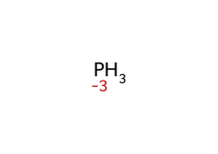 | Phosphine PH₃ | P −3 | pyramidal 93.6° |
|  | Phosphorus trichloride PCl₃ | Cl −1 · P +3 | pyramidal |
|  | Phosphorus pentachloride PCl₅ | Cl −1 · P +5 | trigonal bipyramidal |
|  | Phosphorus trioxide P₄O₆ | P +3 | adamantane cage, 6 P-O-P |
|  | Phosphorus pentoxide P₄O₁₀ | P +5 | adamantane cage, 4 P=O + 6 P-O-P |
| 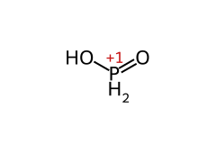 | Hypophosphorous acid H₃PO₂ | P +1 | 2 P-H, monobasic |
| 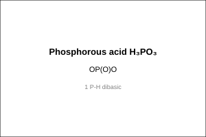 | Phosphorous acid H₃PO₃ | P +3 | 1 P-H dibasic |
| 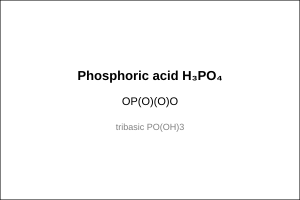 | Phosphoric acid H₃PO₄ | P +5 | tribasic PO(OH)3 |
| 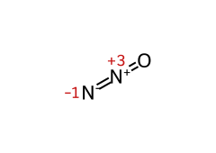 | Nitrous oxide N₂O | N −1, +3 (avg +1) | linear N-N-O |
| 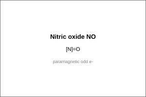 | Nitric oxide NO | N +2 | paramagnetic odd e- |
| 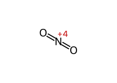 | Nitrogen dioxide NO₂ | N +4 | angular, odd e-, dimerises to N₂O₄ |
| 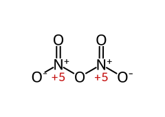 | Dinitrogen pentoxide N₂O₅ | N +5 | O2N-O-NO2 |
|  | Nitric acid HNO₃ | N +5 | planar HO–NO₂ |
|  | Ozone O₃ | O −1, 0, +1 | bent 117°, resonance |
|  | Sulphur dioxide SO₂ | S +4 | angular 119.5° |
| 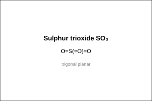 | Sulphur trioxide SO₃ | S +6 | trigonal planar |
|  | Sulphuric acid H₂SO₄ | S +6 | tetrahedral (HO)2SO2 |
|  | Thiosulphuric acid H₂S₂O₃ | S −1, +5 (avg +2) | one O of SO₃ replaced by S–H |
|  | Peroxodisulphuric acid H₂S₂O₈ | S +6 · O −1 | O-O Marshall |
|  | Chlorine monofluoride ClF | F −1 · Cl +1 | linear interhalogen |
|  | Chlorine trifluoride ClF₃ | F −1 · Cl +3 | T-shaped |
|  | Bromine pentafluoride BrF₅ | F −1 · Br +5 | square pyramidal |
|  | Iodine heptafluoride IF₇ | F −1 · I +7 | pentagonal bipyramidal |
| 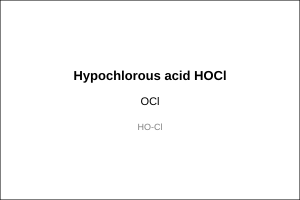 | Hypochlorous acid HOCl | Cl +1 | HO-Cl |
| 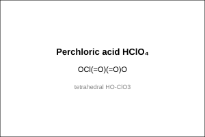 | Perchloric acid HClO₄ | Cl +7 | tetrahedral HO–ClO₃ |
|  | Xenon difluoride XeF₂ | F −1 · Xe +2 | linear sp3d 3lp eq |
|  | Xenon tetrafluoride XeF₄ | F −1 · Xe +4 | square planar sp3d2 2lp axial |
|  | Xenon hexafluoride XeF₆ | F −1 · Xe +6 | distorted octahedral sp3d3 1lp |
|  | Xenon trioxide XeO₃ | Xe +6 | pyramidal sp3 1lp |
| 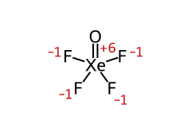 | Xenon oxytetrafluoride XeOF₄ | Xe +6 · F −1 | square pyramidal sp3d2 |
<!-- gallery:end -->

<!-- smiles:begin -->
```smiles
N
P12P3P1P23
P
ClP(Cl)Cl
ClP(Cl)(Cl)(Cl)Cl
O1P2OP3OP1OP(O2)O3
O=P12OP3(=O)OP(=O)(O1)OP(=O)(O2)O3
[PH2](=O)O
OP(O)O
O=P(O)(O)O
[N-]=[N+]=O
[N]=O
[N](=O)=O
O=[N+]([O-])O[N+](=O)[O-]
O=[N](=O)O
O=[O+][O-]
O=S=O
O=S(=O)=O
OS(O)(=O)=O
OS(=O)(=O)[SH]
OS(=O)(=O)OOS(=O)(=O)O
FCl
FCl(F)F
FBr(F)(F)(F)F
F[I](F)(F)(F)(F)(F)F
OCl
O[Cl](=O)(=O)=O
F[Xe]F
F[Xe](F)(F)F
F[Xe](F)(F)(F)(F)F
O=[Xe](=O)=O
O=[Xe](F)(F)(F)F
```
<!-- smiles:end -->
