# The p-Block Elements (Groups 15-18) — JEE Advanced Notes

> **Sources merged into these notes**
> | Source | File |
> |---|---|
> | NCERT Class XII (pre-rationalised 2018-19), Unit 7 — Groups 15-18 | [`lech107-legacy.pdf`](lech107-legacy.pdf) |
> | Allen — p-Block module (Enthusiast, 92 pages, Groups 13-18) — Groups 15-18 portion | [`p-block_Theory_26.pdf`](p-block_Theory_26.pdf) |
>
> 🅰 = Allen-only content; 🆇 = extra JEE-Advanced bridging point; ⚠ = trap.

## Contents

- [Part A — Group 15: Nitrogen Family](#part-a--group-15-nitrogen-family)
  1. [Occurrence, Config, Atomic Properties (7.1)](#1-occurrence-config-atomic-properties-71)
  2. [Physical Properties — Allotropy, Catenation, MP/BP](#2-physical-properties--allotropy-catenation-mpbp)
  3. [Chemical Properties — Oxidation States, Inert Pair, Anomalous N](#3-chemical-properties--oxidation-states-inert-pair-anomalous-n)
  4. [Hydrides EH₃ — Trends (7.2)](#4-hydrides-eh₃--trends-72)
  5. [Oxides — E₂O₃, E₂O₅, N-oxides (7.3)](#5-oxides--e₂o₃-e₂o₅-n-oxides-73)
  6. [Halides — EX₃, EX₅ (7.4)](#6-halides--ex₃-ex₅-74)
  7. [Important Compounds — N₂, NH₃, HNO₃, P₄, PH₃, PCl₃, PCl₅, Oxoacids of P](#7-important-compounds--n₂-nh₃-hno₃-p₄-ph₃-pcl₃-pcl₅-oxoacids-of-p)
- [Part B — Group 16: Oxygen Family (Chalcogens)](#part-b--group-16-oxygen-family-chalcogens)
  8. [Occurrence, Config, Atomic Properties (7.5)](#8-occurrence-config-atomic-properties-75)
  9. [Physical & Chemical Properties — Oxidation States, Hydrides H₂E, Oxides, Halides](#9-physical--chemical-properties--oxidation-states-hydrides-h₂e-oxides-halides)
  10. [Important Compounds — O₂, O₃, SO₂, SO₃, H₂SO₄ Contact Process, Oxoacids of S](#10-important-compounds--o₂-o₃-so₂-so₃-h₂so₄-contact-process-oxoacids-of-s)
- [Part C — Group 17: Halogen Family](#part-c--group-17-halogen-family)
  11. [Occurrence, Config, Atomic Properties (7.6)](#11-occurrence-config-atomic-properties-76)
  12. [Physical & Chemical Properties — Oxidation States, Anomalous F, Reactivity](#12-physical--chemical-properties--oxidation-states-anomalous-f-reactivity)
  13. [Hydrides HX, Oxides, Oxoacids of Cl, Interhalogens, Pseudohalogens](#13-hydrides-hx-oxides-oxoacids-of-cl-interhalogens-pseudohalogens)
- [Part D — Group 18: Noble Gases](#part-d--group-18-noble-gases)
  14. [Occurrence, Config, Properties, Uses (7.7)](#14-occurrence-config-properties-uses-77)
  15. [Xenon Compounds — XeF₂, XeF₄, XeF₆, XeO₃, XeOF₄ Structures (7.8)](#15-xenon-compounds--xef₂-xef₄-xef₆-xeo₃-xeof₄-structures-78)
  16. [Quick Revision Sheet](#16-quick-revision-sheet)

---

# Part A — Group 15: Nitrogen Family

## 1. Occurrence, Config, Atomic Properties (7.1)

**Occurrence:**

- N₂ 78% volume atmosphere, 33rd most abundant crust, as Chile saltpetre $\ce{NaNO3}$, Indian saltpetre $\ce{KNO3}$, proteins, nucleic acids.
- P 11th most abundant crust, apatite family $\ce{Ca9(PO4)6.CaX2}$ (X=F,Cl,OH) fluorapatite $\ce{Ca9(PO4)6.CaF2}$, chlorapatite, DNA/RNA, phosphate rocks, bones.
- As, Sb, Bi mainly sulphide minerals.

**Electronic config:** Valence $\ce{ns^2 np^3}$.

**Atomic & ionic radii:** Covalent radius $\ce{N < P < As < Sb < Bi}$ increases down, considerable increase N→P, small increase As→Bi due filled d/f orbitals.

**Ionisation enthalpy:** $\ce{N > P > As > Sb > Bi}$ IE1 decreases down due size increase; extra stable half-filled p and smaller size → IE Group 15 > Group 14 corresponding periods; successive $\ce{ΔiH1 < ΔiH2 < ΔiH3}$.

**Electronegativity:** $\ce{N > P > As > Sb = Bi}$ (Sb 1.9, Bi 1.9), generally decreases down size increase, difference not pronounced among heavier.

**Metallic character:** $\ce{N, P}$ non-metals, $\ce{As, Sb}$ metalloids, $\ce{Bi}$ metal → metallic character increases down due IE decrease and size increase.

## 2. Physical Properties — Allotropy, Catenation, MP/BP

- All elements polyatomic: $\ce{N2}$ diatomic gas, others solids.
- Boiling points generally increase top→bottom, melting point increases up to As then decreases to Bi.
- **Allotropy:** Except N, all show allotropy: P → white, red, black; As, Sb → yellow, grey; Bi → α,β,γ,δ.

**Catenation:** Group 15 also shows catenation but much smaller than carbon. Hydrazine $\ce{H2N-NH2}$ 2 N bonded, $\ce{HN3}$ 3 N. P has maximum tendency for catenation forming cyclic/open chain many P atoms, $\ce{P2H4}$ 2 P bonded. Lesser tendency vs C due low bond dissociation enthalpies: $\ce{C-C 353.3, N-N 160.8, P-P 201.6, As-As 147.4}$ kJ/mol.

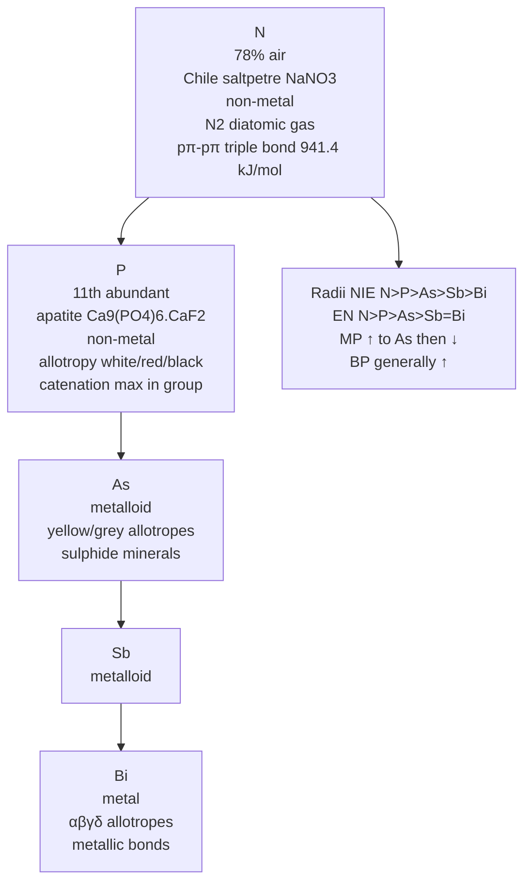
*Group 15 from nitrogen to bismuth: catenation and metallic character both rise, N₂'s triple bond anchors the top of the group.*

## 3. Chemical Properties — Oxidation States, Inert Pair, Anomalous N

**Oxidation states:** Common -3, +3, +5.

- Tendency -3 decreases down size + metallic character increases, Bi hardly forms -3.
- Stability +5 decreases down, only well characterised Bi(V) is $\ce{BiF5}$.
- Stability +5 ↓ and +3 ↑ due inert pair effect down group.
- N exhibits +1, +2, +4 also with O; P shows +1, +4 in some oxoacids.
- N all O.S. +1 to +4 tend to disproportionate in acid: $\ce{3HNO2 -> HNO3 + H2O + 2NO}$.
- P nearly all intermediate O.S. disproportionate to +5 and -3 in both alkali and acid: $\ce{4H3PO3 ->[Heat] 3H3PO4 + PH3}$.
- +3 in As, Sb, Bi increasingly stable w.r.t disproportionation.
- N restricted max covalency 4 (one s + three p orbitals); heavier have vacant d orbitals can expand covalency as $\ce{[PF6]-}$.

**Anomalous N:**

- Unique ability to form pπ-pπ multiple bonds with itself and small high EN elements (C,O).
- Heavier do not form pπ-pπ as atomic orbitals large diffuse cannot effective overlap.
- N exists as diatomic triple bond one σ two π N≡N bond enthalpy 941.4 kJ/mol very high.
- P, As, Sb form single bonds P-P, As-As, Sb-Sb while Bi metallic bonds in elemental state.
- Single N-N weaker than single P-P due high interelectronic repulsion non-bonding electrons owing small bond length → catenation weaker in N.
- Absence d orbitals in N restricts covalency to 4, cannot form dπ-pπ as heavier can e.g., $\ce{R3P=O}$ or $\ce{R3P=CH2}$, P, As can form dπ-dπ with transition metals when compounds $\ce{P(C2H5)3, As(C6H5)3}$ act as ligands.

## 4. Hydrides EH₃ — Trends (7.2)

All elements form $\ce{EH3}$ type.

| Property | $\ce{NH3}$ | $\ce{PH3}$ | $\ce{AsH3}$ | $\ce{SbH3}$ | $\ce{BiH3}$ |
|---|---|---|---|---|---|
| m.p. K | 195.2 | 139.5 | 156.7 | 185 | — |
| b.p. K | 238.5 | 185.5 | 210.6 | 254.6 | 290 |
| E-H distance pm | 101.7 | 141.9 | 151.9 | 170.7 | — |
| H-E-H angle ° | 107.8 | 93.6 | 91.8 | 91.3 | — |
| ΔfH° kJ/mol | -46.1 | +13.4 | +66.4 | +145.1 | +278 |
| E-H dissociation kJ/mol | 389 | 322 | 297 | 255 | — |

- Stability decreases $\ce{NH3 -> BiH3}$ observed from bond dissociation enthalpy → reducing character increases, $\ce{NH3}$ mild reducing, $\ce{BiH3}$ strongest reducing among hydrides.
- Basicity decreases $\ce{NH3 > PH3 > AsH3 > SbH3 ≥ BiH3}$.

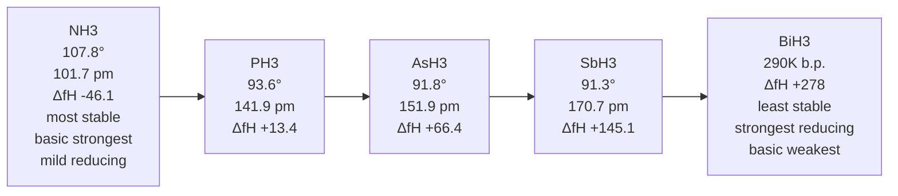
*The EH₃ hydrides — bond angle, bond length and thermal stability all fall down the group while basicity and reducing power rise.*

*Hydrides: bond angle decreases, E-H distance increases, stability decreases, reducing character increases down.*

## 5. Oxides — E₂O₃, E₂O₅, N-oxides (7.3)

All elements form two types: $\ce{E2O3}$ and $\ce{E2O5}$, higher O.S. oxide more acidic than lower, acidic character decreases down group.

- $\ce{E2O3}$ of N and P purely acidic, As, Sb amphoteric, Bi basic.
- N forms many oxides:

| Oxide | O.S. of N | Structure | Property |
|---|---|---|---|
| $\ce{N2O}$ nitrous oxide | +1 | $\ce{N-N-O}$ linear | Neutral, laughing gas |
| $\ce{NO}$ nitric oxide | +2 | — | Neutral, paramagnetic (odd e⁻) |
| $\ce{N2O3}$ dinitrogen trioxide | +3 | $\ce{O=N-O-N=O}$ | Acidic, $\ce{N2O3 + H2O -> 2HNO2}$ |
| $\ce{NO2}$ nitrogen dioxide | +4 | Angular, odd e⁻ | Acidic, dimerises $\ce{2NO2 ⇌ N2O4}$ |
| $\ce{N2O4}$ dinitrogen tetroxide | +4 | Planar dimer of $\ce{NO2}$ | — |
| $\ce{N2O5}$ dinitrogen pentoxide | +5 | $\ce{O2N-O-NO2}$ | Acidic, $\ce{N2O5 + H2O -> 2HNO3}$ |

- P oxides: $\ce{P4O6}$ (P +3) and $\ce{P4O10}$ (P +5) — adamantane-like structures, $\ce{P4O6}$ has 6 P-O-P bridges, $\ce{P4O10}$ has 4 $\ce{P=O}$.

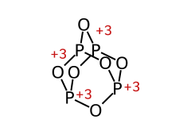
*P₄O₆ — P +3, 6 P-O-P bridges.*

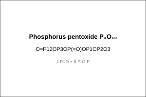
*P₄O₁₀ — P +5, 4 P=O + 6 P-O-P.*

## 6. Halides — EX₃, EX₅ (7.4)

- $\ce{EX3}$: All elements form trihalides, mostly covalent except $\ce{BiF3}$ ionic, $\ce{NCl3}$ explosive, $\ce{PCl3}$ hydrolysed: $\ce{PCl3 + 3H2O -> H3PO3 + 3HCl}$.
- $\ce{EX5}$: $\ce{PCl5, AsCl5, SbCl5}$ exist, $\ce{NCl5, BiCl5}$ do not (N no d orbitals cannot expand octet, Bi inert pair). $\ce{PCl5}$ trigonal bipyramidal, 3 equatorial P-Cl equivalent, 2 axial longer due repulsion, not all 5 bonds equivalent — JEE question.

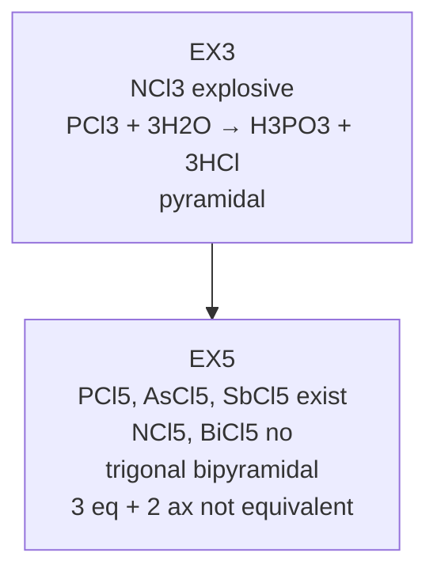
*EX₃ versus EX₅: why the +5 state exists for P, As and Sb but not for N or Bi.*

## 7. Important Compounds — N₂, NH₃, HNO₃, P₄, PH₃, PCl₃, PCl₅, Oxoacids of P

### Dinitrogen $\ce{N2}$

- Triple bond N≡N 941.4 kJ/mol very high, inert at room T, low reactivity due high bond enthalpy and non-polar.
- Preparation: $\ce{NH4Cl + NaNO2 -> N2 + 2H2O + NaCl}$, thermal decomposition $\ce{Ba(N3)2 -> Ba + 3N2}$, $\ce{NH4NO2 -> N2 + 2H2O}$.

### Ammonia $\ce{NH3}$

- Preparation Haber: $\ce{N2 + 3H2 ->[673K, 200atm][Fe, Mo] 2NH3}$ ΔH -92.6 kJ/mol.
- Lab: $\ce{2NH4Cl + Ca(OH)2 -> CaCl2 + 2NH3 + 2H2O}$, $\ce{NH4+ + OH- -> NH3 + H2O}$.
- Properties: Colourless pungent gas, highly soluble water due H-bonding, pyramidal structure H-N-H 107.8°, sp³ N with one lone pair, basic Lewis base: $\ce{NH3 + H2O ⇌ NH4+ + OH-}$ Kb 1.8×10⁻⁵, forms complexes $\ce{[Ag(NH3)2]+, [Cu(NH3)4]^{2+}}$, reducing? Mild.
- Uses: Fertilizers $\ce{(NH4)2SO4, NH4NO3, urea}$, $\ce{HNO3}$ manufacture Ostwald, refrigerant.

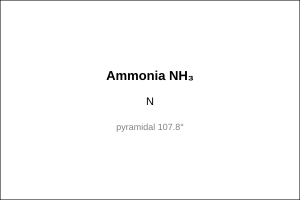
*NH₃ — pyramidal 107.8°, sp³, lone pair.*

### Nitric acid $\ce{HNO3}$

- Preparation Ostwald: $\ce{4NH3 + 5O2 ->[Pt-Rh][900K] 4NO + 6H2O}$, $\ce{2NO + O2 -> 2NO2}$, $\ce{3NO2 + H2O -> 2HNO3 + NO}$.
- Properties: Colourless fuming, strong acid, strong oxidising, aqua regia $\ce{3HCl + HNO3 -> NOCl + Cl2 + 2H2O}$ dissolves Au, Pt.
- Structure: Planar, $\ce{HO-NO2}$, N sp², N-O 121 pm and 140 pm etc.

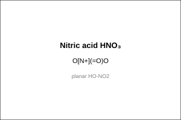
*HNO₃ — planar, HO-NO₂.*

### White phosphorus $\ce{P4}$

- Tetrahedral $\ce{P4}$ molecule, each P at corner, P-P 221 pm, angle 60° strained, very reactive, white waxy solid, soluble $\ce{CS2}$, glows in dark (phosphorescence), stored under water, converts to red P on heating 573K in inert atmosphere.
- Red P polymeric chain, less reactive, non-poisonous, used in matchboxes.
- Black P most stable, layered.

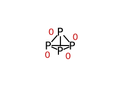
*P₄ — tetrahedral, 60° strained, white phosphorus.*

### Phosphine $\ce{PH3}$

- Preparation: $\ce{Ca3P2 + 6H2O -> 3Ca(OH)2 + 2PH3}$, $\ce{P4 + 3NaOH + 3H2O -> PH3 + 3NaH2PO2}$.
- Properties: Colourless rotten fish smell, weakly basic, less basic than $\ce{NH3}$, pyramidal 93.6°, reducing, forms phosphonium $\ce{PH4+}$ with HI.

### Phosphorus trichloride $\ce{PCl3}$ and pentachloride $\ce{PCl5}$

- $\ce{P4 + 6Cl2 -> 4PCl3}$ limited $\ce{Cl2}$, $\ce{P4 + 10Cl2 -> 4PCl5}$ excess $\ce{Cl2}$.
- $\ce{PCl3}$: pyramidal, sp³, $\ce{PCl3 + 3H2O -> H3PO3 + 3HCl}$.
- $\ce{PCl5}$: trigonal bipyramidal, $\ce{PCl5 + H2O -> POCl3 + 2HCl}$ partial, $\ce{PCl5 + 4H2O -> H3PO4 + 5HCl}$ complete, solid $\ce{[PCl4]+[PCl6]-}$ ionic.

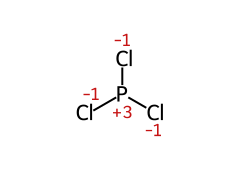
*PCl₃ — pyramidal.*

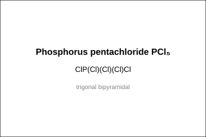
*PCl₅ — trigonal bipyramidal gas, [PCl₄]⁺[PCl₆]⁻ solid.*

### Oxoacids of Phosphorus — JEE Advanced favourite

| Acid | Formula | O.S. of P | Basicity | Structure & P-H bonds | Reducing? |
|---|---|---|---|---|---|
| Hypophosphorous | $\ce{H3PO2}$ | +1 | 1 (monobasic) | $\ce{H2PO(OH)}$ 2 P-H | Strong reducing |
| Orthophosphorous | $\ce{H3PO3}$ | +3 | 2 (dibasic) | $\ce{HPO(OH)2}$ 1 P-H | Reducing |
| Pyrophosphorous | $\ce{H4P2O5}$ | +3 | 2? Actually 2? | — | — |
| Orthophosphoric | $\ce{H3PO4}$ | +5 | 3 (tribasic) | $\ce{PO(OH)3}$ 0 P-H | Non-reducing |
| Pyrophosphoric | $\ce{H4P2O7}$ | +5 | 4 | — | — |
| Metaphosphoric | $\ce{HPO3}$ | +5 | 1 | cyclic $\ce{(HPO3)3}$ | — |

- P-H bonds present in $\ce{H3PO2}$ (2), $\ce{H3PO3}$ (1) → reducing due P-H, does NOT ionise, only P-OH ionises → basicity = number of P-OH.
- Structures: tetrahedral P, sp³.

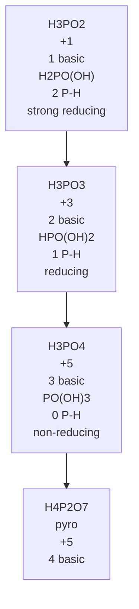
*Oxoacids of phosphorus — the number of P–H bonds sets basicity and reducing power, and the P–H count is the JEE favourite.*

*Oxoacids of P: basicity = P-OH count, P-H = reducing.*

---

# Part B — Group 16: Oxygen Family (Chalcogens)

## 8. Occurrence, Config, Atomic Properties (7.5)

**Occurrence:** O most abundant element crust 46.6%, S 0.03%, Se, Te less, Po radioactive. O as $\ce{O2}$ 21% air, water, silicates; S as sulphides $\ce{FeS2}$ pyrites, sulphates gypsum $\ce{CaSO4.2H2O}$.

**Config:** $\ce{ns^2 np^4}$.

**Radii:** Covalent $\ce{O < S < Se < Te < Po}$ increases down.

**IE:** $\ce{O > S > Se > Te > Po}$ decreases down, but O > S due small size.

**EN:** $\ce{O > S > Se > Te > Po}$ decreases.

**Metallic character:** O, S non-metals, Se, Te metalloids, Po metal.

## 9. Physical & Chemical Properties — Oxidation States, Hydrides H₂E, Oxides, Halides

**Oxidation states:** Common -2, +2, +4, +6. O shows -2 (except $\ce{OF2}$ +2, $\ce{O2F2}$ +1), -1 in peroxides. Stability +6 decreases down, +4 increases due inert pair? Actually for Group 16, +6 stability decreases down.

**Hydrides $\ce{H2E}$:**

| Property | $\ce{H2O}$ | $\ce{H2S}$ | $\ce{H2Se}$ | $\ce{H2Te}$ |
|---|---|---|---|---|
| m.p. K | 273 | 188 | 208 | 222 |
| b.p. K | 373 | 213 | 232 | 269 |
| H-E distance pm | 95.7 | 133.6 | 146 | 169 |
| H-E-H angle ° | 104.5 | 92.1 | 91 | 90 |
| ΔfH kJ/mol | -286 | -20 | +29 | +99 |
| Dissociation H-E kJ/mol | 463 | 347 | 276 | 238 |
| Acidity | neutral | weak acid | stronger | strongest |
| Reducing character | — | mild | stronger | strongest |

- $\ce{H2O}$ has highest b.p., m.p. due H-bonding, anomalous.
- Acidity increases down, reducing character increases down (bond dissociation decreases).

**Oxides:** $\ce{EO2}$ and $\ce{EO3}$ types. $\ce{O2}$ gas, $\ce{SO2}$ gas, $\ce{SeO2}$ solid, $\ce{TeO2}$ solid. Acidic character decreases down. $\ce{SO2}$ acidic, $\ce{TeO2}$ amphoteric.

- $\ce{SO2}$ angular, $\ce{O=S=O}$ 119.5°, $\ce{SO3}$ trigonal planar.

**Halides:** $\ce{EX2, EX4, EX6}$; $\ce{SF6}$ stable, $\ce{SF4}$ seesaw, $\ce{SCl2}$ etc.

## 10. Important Compounds — O₂, O₃, SO₂, SO₃, H₂SO₄ Contact Process, Oxoacids of S

### Dioxygen $\ce{O2}$

- Paramagnetic due 2 unpaired electrons in π* (MO), preparation $\ce{2KClO3 ->[MnO2][Δ] 2KCl + 3O2}$, $\ce{2H2O2 -> 2H2O + O2}$.

### Ozone $\ce{O3}$

- Bent 117°, O-O 127.8 pm, resonance, preparation $\ce{3O2 ->[silent electric discharge] 2O3}$, strong oxidising, $\ce{O3 + 2KI + H2O -> 2KOH + O2 + I2}$.

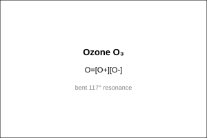
*O₃ — bent 117°, resonance.*

### Sulphur dioxide $\ce{SO2}$

- Preparation $\ce{S + O2 -> SO2}$, $\ce{4FeS2 + 11O2 -> 2Fe2O3 + 8SO2}$, $\ce{Na2SO3 + 2HCl -> 2NaCl + H2O + SO2}$.
- Properties: Colourless pungent, acidic oxide $\ce{SO2 + H2O -> H2SO3}$, reducing and oxidising both, bleaching via reduction, angular.

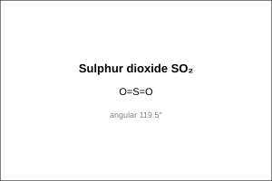
*SO₂ — angular 119.5°.*

### Sulphur trioxide $\ce{SO3}$

- $\ce{2SO2 + O2 ->[V2O5][450°C] 2SO3}$, trigonal planar, acidic $\ce{SO3 + H2O -> H2SO4}$.

### Sulphuric acid $\ce{H2SO4}$ — King of chemicals, Contact process

**Contact process:**

$\ce{S + O2 -> SO2}$

$\ce{2SO2 + O2 ->[V2O5][410-450°C, 2 atm] 2SO3}$ — key step, $\ce{V2O5}$ catalyst, exothermic, low T favours but rate low → 410-450°C optimum, 2 atm.

$\ce{SO3 + H2SO4 -> H2S2O7}$ oleum

$\ce{H2S2O7 + H2O -> 2H2SO4}$

Properties: Colourless viscous oily liquid, strong acid dibasic, strong oxidising, dehydrating $\ce{C12H22O11 ->[conc H2SO4] 12C + 11H2O}$, sulphonating.

Structure: Tetrahedral S, $\ce{(HO)2SO2}$, S-O 157 pm and S=O 142 pm.

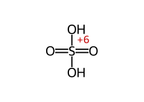
*H₂SO₄ — tetrahedral S, (HO)₂SO₂.*

**Oxoacids of S:**

| Acid | Formula | O.S. S | Structure |
|---|---|---|---|
| Sulphurous | $\ce{H2SO3}$ | +4 | $\ce{(HO)2SO}$ |
| Sulphuric | $\ce{H2SO4}$ | +6 | $\ce{(HO)2SO2}$ |
| Thiosulphuric | $\ce{H2S2O3}$ | +2 avg? Actually S +5 and -2 | $\ce{(HO)2S2O}$ one S replaces O |
| Peroxodisulphuric (Marshall) | $\ce{H2S2O8}$ | +6 | $\ce{(HO)SO2-O-O-SO2(OH)}$ O-O |
| Dithionic | $\ce{H2S2O6}$ | +5 | — |

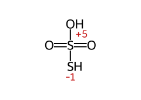
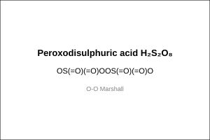
*Both are "sulphuric acid with one O swapped": in thiosulphuric acid an **O is replaced by S**
(S +5 and −2, average +2), in Marshall's acid an **O is replaced by an O–O peroxide bridge**
(both S stay +6). Only the second is a true peroxide — which is the whole point of the pair.*

---

# Part C — Group 17: Halogen Family

## 11. Occurrence, Config, Atomic Properties (7.6)

**Occurrence:** F as fluorspar $\ce{CaF2}$, cryolite $\ce{Na3AlF6}$, fluorapatite; Cl as NaCl; Br as $\ce{NaBr, KBr}$ in sea water; I as $\ce{NaIO3}$ Chile saltpetre, sea weeds.

**Config:** $\ce{ns^2 np^5}$.

**Radii:** Covalent $\ce{F < Cl < Br < I}$ increases down.

**IE:** $\ce{F > Cl > Br > I}$ decreases.

**EN:** $\ce{F 4.0 > Cl 3.0 > Br 2.8 > I 2.5}$ highest F.

**Electron gain enthalpy:** $\ce{Cl > F > Br > I}$ — F has more negative? Actually Cl -349, F -333, Br -325, I -296 kJ/mol, Cl most negative due small size F electron-electron repulsion.

## 12. Physical & Chemical Properties — Oxidation States, Anomalous F, Reactivity

**Oxidation states:** Common -1, +1, +3, +5, +7 (except F only -1). F most electronegative cannot show positive O.S. except $\ce{OF2}$ +2, $\ce{O2F2}$ +1.

**Anomalous F:**

- Small size, high EN, high IE, low F-F bond dissociation (158 kJ/mol) vs Cl-Cl 242, non-availability d-orbitals → max covalence 1, forms only $\ce{[F]-}$, no positive O.S., H-bonding in HF, highest oxidising power.

**Reactivity:** $\ce{F2 > Cl2 > Br2 > I2}$ oxidising power decreases down, reducing power halides $\ce{I- > Br- > Cl- > F-}$ reverse.

- Towards H: $\ce{H2 + X2 -> 2HX}$; HF H-bonded → higher b.p. anomalous.
- Towards O: $\ce{OF2, O2F2, Cl2O, ClO2, Cl2O7, Br2O, I2O5}$ etc.
- Towards metals: forms metal halides ionic/covalent.

## 13. Hydrides HX, Oxides, Oxoacids of Cl, Interhalogens, Pseudohalogens

**Hydrides HX:**

| Property | HF | HCl | HBr | HI |
|---|---|---|---|---|
| b.p. K | 292.6 (H-bonded) | 188 | 206 | 237 |
| Bond dissociation kJ/mol | 574 | 432 | 363 | 295 |
| Acidity aqueous | Weak (H-bonded) | Strong | Stronger | Strongest |
| Stability | Most stable | — | — | Least stable, HI reducing |

- HF weak acid due H-bonding, but corrodes glass $\ce{SiO2 + 4HF -> SiF4 + 2H2O}$.

**Oxoacids of Cl:**

| Acid | O.S. Cl | Formula | Structure | Acidity & Oxidising |
|---|---|---|---|---|
| Hypochlorous | +1 | HOCl | $\ce{HO-Cl}$ | Weakest acid, oxidising |
| Chlorous | +3 | $\ce{HClO2}$ | $\ce{HO-Cl-O}$ | — |
| Chloric | +5 | $\ce{HClO3}$ | $\ce{HO-ClO2}$ | Strong acid |
| Perchloric | +7 | $\ce{HClO4}$ | $\ce{HO-ClO3}$ tetrahedral | Strongest acid, strongest oxidising |

- Acidic strength increases with O.S.: $\ce{HOCl < HClO2 < HClO3 < HClO4}$.
- Oxidising power: $\ce{HClO4}$ strongest? Actually $\ce{HClO}$ etc.

**Interhalogens:** $\ce{XX'}$ type, $\ce{XX'3, XX'5, XX'7}$.

- $\ce{ClF, BrF, IF, BrCl, ICl}$ — linear
- $\ce{ClF3, BrF3, IF3}$ — T-shaped
- $\ce{ClF5, BrF5, IF5}$ — square pyramidal
- $\ce{IF7}$ — pentagonal bipyramidal

| Interhalogen | Shape | Hybridisation of the central atom |
|---|---|---|
| $\ce{ClF}$ | linear | sp |
| $\ce{ClF3}$ | T-shaped (2 lone pairs) | sp³d |
| $\ce{BrF5}$ | square pyramidal (1 lone pair) | sp³d² |
| $\ce{IF7}$ | pentagonal bipyramidal | sp³d³ |

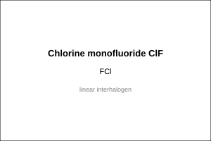
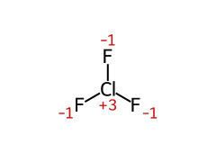
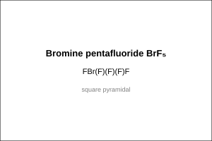
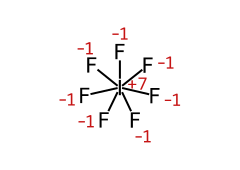
*The four interhalogen shapes of the rule, drawn: the lone pairs on the central halogen are what
turn a straight AX₂ into a T, a square pyramid or a pentagonal bipyramid. A halogen can never
expand its octet beyond 14 electrons, which is why the series stops at IF₇.*

Preparation: $\ce{Cl2 + F2 ->[473K] 2ClF}$, $\ce{Cl2 + 3F2 ->[573K] 2ClF3}$, etc.

Properties: More reactive than halogens except F2, hydrolysed: $\ce{ICl + H2O -> HCl + HOI}$.

**Pseudohalogens:** Univalent ions consisting of two or more atoms at least one N, properties similar to halide ions, e.g., $\ce{CN-, SCN-, SeCN-, OCN-, N3-}$ (azide). Pseudohalogen molecules $\ce{(CN)2}$ cyanogen, $\ce{(SCN)2}$ thiocyanogen.

$\ce{(CN)2 + 2OH- -> CN- + CNO- + H2O}$ similar to $\ce{Cl2 + 2OH- -> Cl- + ClO- + H2O}$.

---

# Part D — Group 18: Noble Gases

## 14. Occurrence, Config, Properties, Uses (7.7)

**Occurrence:** Atmosphere ~1% Ar, trace He, Ne, Kr, Xe, Rn radioactive.

**Config:** $\ce{ns^2 np^6}$ (He $\ce{1s^2}$) valence shell completely filled → very stable, very high IE, low electron affinity, inert.

**Physical:** Monoatomic gases, low b.p., b.p. increases down due van der Waals increases with size.

**Chemical:** Inert due completely filled valence, high IE, more positive electron gain enthalpy. First compound $\ce{Xe+[PtF6]-}$ by Bartlett 1962.

**Uses:** He low b.p. 4.2 K cryogenics, balloons, breathing mixture $\ce{He+O2}$ for divers (low solubility blood), Ne discharge tubes, Ar inert atmosphere welding, light bulbs, Xe flash tubes, lasers.

## 15. Xenon Compounds — XeF₂, XeF₄, XeF₆, XeO₃, XeOF₄ Structures (7.8)

**Preparation:**

$\ce{Xe + F2 ->[673K, 1 atm] XeF2}$

$\ce{Xe + 2F2 ->[873K, 7 atm] XeF4}$

$\ce{Xe + 3F2 ->[573K, 60-70 atm] XeF6}$

Hydrolysis:

$\ce{2XeF2 + 2H2O -> 2Xe + 4HF + O2}$

$\ce{6XeF4 + 12H2O -> 4Xe + 2XeO3 + 24HF + 3O2}$

$\ce{XeF6 + 3H2O -> XeO3 + 6HF}$

$\ce{XeF6 + H2O -> XeOF4 + 2HF}$ partial hydrolysis

$\ce{XeF6 + 2H2O -> XeO2F2 + 4HF}$

**Structures (VSEPR):**

| Compound | Steric | Hybridization | Shape | Structure |
|---|---|---|---|---|
| $\ce{XeF2}$ | 5 (2 bp +3 lp) | sp³d | Linear | F-Xe-F 180°, 3 lp equatorial |
| $\ce{XeF4}$ | 6 (4 bp +2 lp) | sp³d² | Square planar | 2 lp axial |
| $\ce{XeF6}$ | 7 (6 bp +1 lp) | sp³d³ | Distorted octahedral | 1 lp |
| $\ce{XeO3}$ | 4 (3 bp +1 lp) | sp³ | Pyramidal | 1 lp, 3 Xe=O |
| $\ce{XeOF4}$ | 6 (5 bp +1 lp) | sp³d² | Square pyramidal | O axial, 1 lp? Actually 1 lp? |
| $\ce{XeO2F2}$ | 5 (4 bp +1 lp) | sp³d | See-saw? Actually? | — |

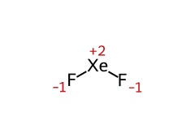
*XeF₂ — linear, sp³d, 3 lp equatorial.*

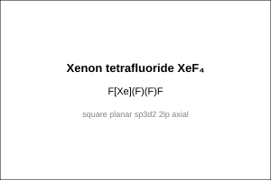
*XeF₄ — square planar, sp³d², 2 lp axial.*

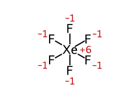
*XeF₆ — distorted octahedral, sp³d³, 1 lp.*

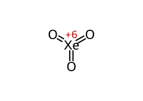
*XeO₃ — pyramidal, sp³, 1 lp.*

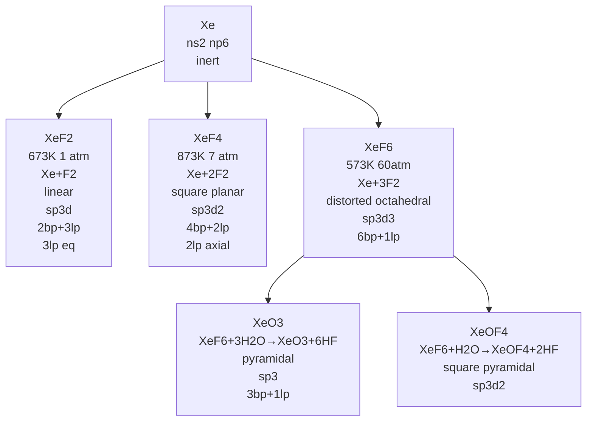
*Xenon fluorides and oxyfluorides: the conditions, the hybridisation, and the lone-pair count that fixes the shape.*

*Xenon fluorides preparation and structures via VSEPR.*

> **⚠ Trap:** $\ce{XeF2}$ linear not bent, $\ce{XeF4}$ square planar not tetrahedral, $\ce{XeF6}$ distorted octahedral not regular.

---

## 16. Quick Revision Sheet

- Group 15: N 78% air, P 11th abundant apatite $\ce{Ca9(PO4)6.CaF2}$, config ns²np³, radii $\ce{N<P<As<Sb<Bi}$ increase considerable N→P small As→Bi d/f shielding, IE $\ce{N>P>As>Sb>Bi}$ Group15>Group14 half-filled p, EN $\ce{N>P>As>Sb=Bi}$ 1.9, metallic $\ce{N,P}$ non-metal $\ce{As,Sb}$ metalloid $\ce{Bi}$ metal, BP ↑ top→bottom MP ↑ to As then ↓, allotropy P white/red/black As Sb yellow/grey Bi αβγδ, catenation $\ce{C>>Si>P>N}$ etc bond dissociation $\ce{C-C353, N-N160, P-P201, As-As147}$ kJ/mol; O.S. -3 +3 +5 stability -3 ↓ down Bi hardly -3, +5 ↓ only $\ce{BiF5}$ well characterised, +3 ↑ inert pair, N +1+2+4 with O, P +1+4 oxoacids, N O.S. +1 to +4 disproportionate acid $\ce{3HNO2->HNO3+H2O+2NO}$, P intermediate $\ce{4H3PO3->3H3PO4+PH3}$ both alkali acid, +3 As Sb Bi increasingly stable, N max covalency 4 no d, heavier vacant d expand as $\ce{[PF6]-}$; anomalous N pπ-pπ multiple with itself small high EN $\ce{N≡N}$ triple one σ two π 941.4 kJ/mol high inert, P As Sb single bonds P-P As-As Sb-Sb Bi metallic, N-N weaker than P-P interelectronic repulsion small bond length → catenation weaker N, absence d N cannot dπ-pπ as heavier $\ce{R3P=O, R3P=CH2}$, P As dπ-dπ with transition metals $\ce{P(C2H5)3}$ ligands; hydrides $\ce{EH3}$ trends m.p. $\ce{NH3 195, PH3 139, AsH3 156, SbH3 185}$, b.p. $\ce{NH3 238, PH3 185, AsH3 210, SbH3 254, BiH3 290}$, E-H $\ce{NH3 101.7 PH3 141.9 AsH3 151.9 SbH3 170.7}$ pm ↑, angle $\ce{NH3 107.8 PH3 93.6 AsH3 91.8 SbH3 91.3}$ ↓, ΔfH $\ce{NH3 -46, PH3 +13, AsH3 +66, SbH3 +145, BiH3 +278}$ ↑, dissociation $\ce{NH3 389 PH3 322 AsH3 297 SbH3 255}$ ↓, stability $\ce{NH3->BiH3}$ ↓ reducing character ↑ $\ce{NH3}$ mild $\ce{BiH3}$ strongest, basicity $\ce{NH3>PH3>AsH3>SbH3≥BiH3}$; oxides $\ce{E2O3, E2O5}$ higher O.S. more acidic than lower acidic ↓ down $\ce{E2O3}$ N P acidic As Sb amphoteric Bi basic, N oxides $\ce{N2O +1 N-N-O}$ neutral laughing gas, $\ce{NO +2}$ neutral paramagnetic odd e⁻, $\ce{N2O3 +3 O=N-O-N=O}$ acidic $\ce{N2O3+H2O->2HNO2}$, $\ce{NO2 +4}$ angular odd e⁻ acidic dimerises $\ce{2NO2⇌N2O4}$, $\ce{N2O4 +4}$ planar dimer, $\ce{N2O5 +5 O2N-O-NO2}$ acidic $\ce{N2O5+H2O->2HNO3}$, P oxides $\ce{P4O6}$ +3 adamantane 6 P-O-P $\ce{P4O10}$ +5 4 P=O +6 P-O-P; halides $\ce{EX3}$ all covalent except $\ce{BiF3}$ ionic $\ce{NCl3}$ explosive $\ce{PCl3+3H2O->H3PO3+3HCl}$, $\ce{EX5}$ $\ce{PCl5 AsCl5 SbCl5}$ exist $\ce{NCl5 BiCl5}$ no N no d Bi inert pair $\ce{PCl5}$ trigonal bipyramidal 3 eq +2 ax not equivalent; important N2 triple inert high bond enthalpy prep $\ce{NH4Cl+NaNO2->N2+2H2O+NaCl}$, $\ce{NH4NO2->N2+2H2O}$; NH3 Haber $\ce{N2+3H2->[673K 200atm][Fe Mo]2NH3}$ ΔH -92.6 lab $\ce{2NH4Cl+Ca(OH)2->CaCl2+2NH3+2H2O}$, colourless pungent highly soluble H-bonding pyramidal 107.8° sp³ one lp basic Lewis $\ce{NH3+H2O⇌NH4++OH-}$ Kb 1.8e-5 complexes $\ce{[Ag(NH3)2]+ [Cu(NH3)4]2+}$ uses fertilizers $\ce{(NH4)2SO4 NH4NO3}$ urea $\ce{HNO3}$ Ostwald refrigerant; HNO3 Ostwald $\ce{4NH3+5O2->[Pt-Rh][900K]4NO+6H2O, 2NO+O2->2NO2, 3NO2+H2O->2HNO3+NO}$ colourless fuming strong acid strong oxidising aqua regia $\ce{3HCl+HNO3->NOCl+Cl2+2H2O}$ Au Pt dissolves structure planar HO-NO2 sp²; white P P4 tetrahedral P-P 221 pm angle 60° strained reactive white waxy soluble CS2 glows dark phosphorescence stored water converts red P 573K inert polymeric chain less reactive non-poisonous matchboxes black P most stable layered; PH3 prep $\ce{Ca3P2+6H2O->3Ca(OH)2+2PH3}$, $\ce{P4+3NaOH+3H2O->PH3+3NaH2PO2}$ colourless rotten fish weakly basic less than NH3 pyramidal 93.6° reducing phosphonium $\ce{PH4+}$ with HI; PCl3 $\ce{P4+6Cl2->4PCl3}$ limited Cl2 pyramidal sp³ $\ce{PCl3+3H2O->H3PO3+3HCl}$, PCl5 $\ce{P4+10Cl2->4PCl5}$ excess Cl2 trigonal bipyramidal $\ce{PCl5+H2O->POCl3+2HCl}$ partial $\ce{PCl5+4H2O->H3PO4+5HCl}$ solid $\ce{[PCl4]+[PCl6]-}$ ionic; oxoacids P table $\ce{H3PO2 +1}$ monobasic $\ce{H2PO(OH)}$ 2 P-H strong reducing, $\ce{H3PO3 +3}$ dibasic $\ce{HPO(OH)2}$ 1 P-H reducing, $\ce{H4P2O5 +3}$, $\ce{H3PO4 +5}$ tribasic $\ce{PO(OH)3}$ 0 P-H non-reducing, $\ce{H4P2O7 +5}$ 4 basic, $\ce{HPO3 +5}$ cyclic $\ce{(HPO3)3}$, basicity = P-OH count P-H reducing does NOT ionise tetrahedral sp³.
- Group 16: O most abundant crust 46.6% S 0.03% as $\ce{FeS2}$ pyrites gypsum $\ce{CaSO4.2H2O}$, config ns²np⁴, radii $\ce{O<S<Se<Te<Po}$ ↑, IE $\ce{O>S>Se>Te>Po}$ ↓ O>S small, EN $\ce{O>S>Se>Te>Po}$ ↓, metallic O S non-metal Se Te metalloid Po metal; O.S. -2 +2 +4 +6 O -2 except $\ce{OF2}$ +2 $\ce{O2F2}$ +1 -1 peroxides stability +6 ↓ down +4 ↑ inert pair; hydrides $\ce{H2E}$ m.p. $\ce{H2O273 H2S188 H2Se208 H2Te222}$, b.p. $\ce{H2O373 H2S213 H2Se232 H2Te269}$ $\ce{H2O}$ highest H-bonding anomalous, H-E $\ce{H2O95.7 H2S133.6 H2Se146 H2Te169}$ pm ↑, angle $\ce{H2O104.5 H2S92.1 H2Se91 H2Te90}$ ↓, ΔfH $\ce{H2O-286 H2S-20 H2Se+29 H2Te+99}$ ↑, dissociation $\ce{H2O463 H2S347 H2Se276 H2Te238}$ ↓, acidity neutral→weak→stronger→strongest ↑, reducing mild→stronger→strongest ↑; oxides $\ce{EO2, EO3}$ $\ce{O2}$ gas $\ce{SO2}$ gas $\ce{SeO2}$ solid $\ce{TeO2}$ solid acidic ↓ $\ce{SO2}$ acidic $\ce{TeO2}$ amphoteric $\ce{SO2}$ angular $\ce{O=S=O}$ 119.5° $\ce{SO3}$ trigonal planar; halides $\ce{EX2 EX4 EX6}$ $\ce{SF6}$ stable $\ce{SF4}$ seesaw; important O2 paramagnetic 2 unpaired π* MO prep $\ce{2KClO3->[MnO2][Δ]2KCl+3O2}$, $\ce{2H2O2->2H2O+O2}$; O3 bent 117° O-O 127.8 pm resonance prep $\ce{3O2->[silent discharge]2O3}$ strong oxidising $\ce{O3+2KI+H2O->2KOH+O2+I2}$; SO2 prep $\ce{S+O2->SO2, 4FeS2+11O2->2Fe2O3+8SO2, Na2SO3+2HCl->2NaCl+H2O+SO2}$ colourless pungent acidic $\ce{SO2+H2O->H2SO3}$ reducing oxidising both bleaching reduction angular; SO3 $\ce{2SO2+O2->[V2O5][450C]2SO3}$ trigonal planar acidic $\ce{SO3+H2O->H2SO4}$; H2SO4 king of chemicals Contact $\ce{S+O2->SO2, 2SO2+O2->[V2O5][410-450C 2atm]2SO3}$ key exothermic low T favours rate low →410-450°C optimum 2atm $\ce{SO3+H2SO4->H2S2O7}$ oleum $\ce{H2S2O7+H2O->2H2SO4}$ colourless viscous oily strong acid dibasic strong oxidising dehydrating $\ce{C12H22O11->[conc H2SO4]12C+11H2O}$ sulphonating structure tetrahedral S $\ce{(HO)2SO2}$ S-O 157 S=O 142 pm; oxoacids S $\ce{H2SO3 +4 (HO)2SO}$, $\ce{H2SO4 +6 (HO)2SO2}$, $\ce{H2S2O3 +2}$ avg S+5 -2 $\ce{(HO)2S2O}$ one S replaces O, $\ce{H2S2O8 +6}$ Marshall $\ce{(HO)SO2-O-O-SO2(OH)}$ O-O.
- Group 17: F fluorspar $\ce{CaF2}$ cryolite $\ce{Na3AlF6}$ fluorapatite, Cl NaCl, Br NaBr KBr sea water, I NaIO3 Chile saltpetre sea weeds, config ns²np⁵, radii $\ce{F<Cl<Br<I}$ ↑, IE $\ce{F>Cl>Br>I}$ ↓, EN $\ce{F4.0>Cl3.0>Br2.8>I2.5}$ highest F, electron gain enthalpy $\ce{Cl>F>Br>I}$ Cl -349 F -333 Br -325 I -296 Cl most negative F e-e repulsion small size; O.S. -1 +1 +3 +5 +7 except F only -1 F most EN cannot positive except $\ce{OF2}$ +2 $\ce{O2F2}$ +1; anomalous F small high EN high IE low F-F 158 vs Cl-Cl 242 non-availability d max cov1 only $\ce{F-}$ no positive H-bonding HF highest oxidising; reactivity oxidising $\ce{F2>Cl2>Br2>I2}$ ↓ reducing halides $\ce{I->Br->Cl->F-}$ reverse; towards H $\ce{H2+X2->2HX}$ HF H-bonded higher b.p. anomalous; towards O $\ce{OF2 O2F2 Cl2O ClO2 Cl2O7 Br2O I2O5}$; towards metals ionic/covalent; hydrides HX b.p. HF 292.6 H-bonded HCl 188 HBr 206 HI 237, bond dissociation HF 574 HCl 432 HBr 363 HI 295 ↓, acidity HF weak H-bonded HCl strong HBr stronger HI strongest, stability most stable HF least stable HI reducing; HF weak acid corrodes glass $\ce{SiO2+4HF->SiF4+2H2O}$; oxoacids Cl O.S. +1 HOCl, +3 $\ce{HClO2 HO-Cl-O}$, +5 $\ce{HClO3 HO-ClO2}$, +7 $\ce{HClO4 HO-ClO3}$ tetrahedral acidic strength $\ce{HOCl<HClO2<HClO3<HClO4}$ ↑ with O.S. oxidising $\ce{HClO4}$ strongest?; interhalogens $\ce{XX'}$ $\ce{XX'3 XX'5 XX'7}$ $\ce{ClF BrF IF BrCl ICl}$ linear, $\ce{ClF3 BrF3 IF3}$ T-shaped, $\ce{ClF5 BrF5 IF5}$ square pyramidal, $\ce{IF7}$ pentagonal bipyramidal prep $\ce{Cl2+F2->[473K]2ClF}$, $\ce{Cl2+3F2->[573K]2ClF3}$, more reactive than halogens except F2 hydrolysed $\ce{ICl+H2O->HCl+HOI}$; pseudohalogens univalent ions 2+ atoms at least one N properties similar halide $\ce{CN- SCN- SeCN- OCN- N3-}$ azide pseudohalogen molecules $\ce{(CN)2}$ cyanogen $\ce{(SCN)2}$ thiocyanogen $\ce{(CN)2+2OH-->CN-+CNO-+H2O}$ similar $\ce{Cl2+2OH-->Cl-+ClO-+H2O}$.
- Group 18: atmosphere ~1% Ar trace He Ne Kr Xe Rn radioactive, config ns²np⁶ He 1s² completely filled very stable very high IE low EA inert, physical monoatomic gases low b.p. b.p. ↑ down van der Waals ↑ size, chemical inert completely filled high IE positive EA, first compound $\ce{Xe+[PtF6]-}$ Bartlett 1962, uses He low b.p. 4.2K cryogenics balloons breathing $\ce{He+O2}$ divers low solubility blood Ne discharge tubes Ar inert welding light bulbs Xe flash tubes lasers; Xe compounds prep $\ce{Xe+F2->[673K 1atm]XeF2}$, $\ce{Xe+2F2->[873K 7atm]XeF4}$, $\ce{Xe+3F2->[573K 60-70atm]XeF6}$, hydrolysis $\ce{2XeF2+2H2O->2Xe+4HF+O2}$, $\ce{6XeF4+12H2O->4Xe+2XeO3+24HF+3O2}$, $\ce{XeF6+3H2O->XeO3+6HF}$, $\ce{XeF6+H2O->XeOF4+2HF}$ partial $\ce{XeF6+2H2O->XeO2F2+4HF}$; structures VSEPR $\ce{XeF2}$ 5 (2bp+3lp) sp³d linear F-Xe-F 180° 3lp eq, $\ce{XeF4}$ 6 (4bp+2lp) sp³d² square planar 2lp axial, $\ce{XeF6}$ 7 (6bp+1lp) sp³d³ distorted octahedral 1lp, $\ce{XeO3}$ 4 (3bp+1lp) sp³ pyramidal 1lp 3 Xe=O, $\ce{XeOF4}$ 6 (5bp+1lp) sp³d² square pyramidal O axial.

---

*Cross-links:* [p-Block Groups 13-14](../05-The-p-Block-Elements/notes.md) — general p-block trends, inert pair, pπ-pπ; [Chemical Bonding](../02-Chemical-Bonding-and-Molecular-Structure/notes.md) — VSEPR, hybridization, MO for O₂, XeF structures; [s-Block](../04-The-s-Block-Elements/notes.md) — diagonal relationship; [Hydrogen](../03-Hydrogen/notes.md) — hydrides EH₃, H₂E, HX.
*Sources:* NCERT pre-rationalised Unit 7 (lech107) + Allen p-Block module Groups 15-18 portion.
