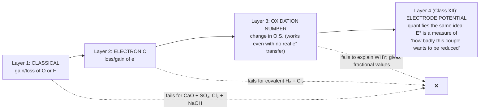
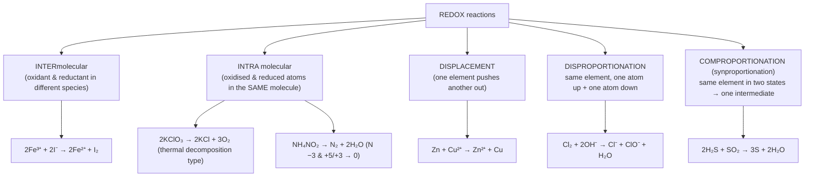
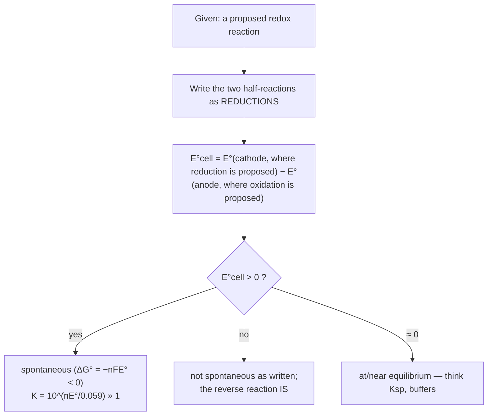

# Redox Reactions — JEE Main + Advanced Notes

> **Sources merged into these notes**
> | Source | File |
> |---|---|
> | NCERT Class XI Chemistry (rationalised, 2023+), Unit 7 | [`kech201.pdf`](kech201.pdf) |
> | Allen module for this chapter | _not uploaded yet — drop it in this folder and the 🅰 tags below get filled in_ |
>
> Section numbers `7.x` below follow the NCERT Unit 7 exactly, so you can read the PDF and
> these notes side by side. 🆇 = extra point needed for **JEE Advanced** that NCERT does not
> spell out. ⚠ marks the traps that actually appear in papers.

## Contents

- [Part A — The Three Languages of Redox](#part-a--the-three-languages-of-redox)
  1. [Classical idea: gain/loss of oxygen and hydrogen](#1-classical-idea-gainloss-of-oxygen-and-hydrogen-71)
  2. [Electronic concept: electron transfer](#2-electronic-concept-electron-transfer-72)
  3. [Competitive electron transfer — who wins?](#3-competitive-electron-transfer--who-wins-721)
  4. [Oxidation number: definition and the rule set](#4-oxidation-number-definition-and-the-rule-set-73)
  5. [Assigning O.S. in the nasty species (the memorise-this list)](#5-assigning-os-in-the-nasty-species-the-memorise-this-list)
  6. [Oxidation number ≠ formal charge ≠ real charge](#6-oxidation-number--formal-charge--real-charge-)
- [Part B — Classifying and Balancing](#part-b--classifying-and-balancing)
  7. [Types of redox reactions](#7-types-of-redox-reactions-731)
  8. [Oxidising and reducing agents from oxidation states](#8-oxidising-and-reducing-agents-from-oxidation-states)
  9. [Balancing by the oxidation-number method](#9-balancing-by-the-oxidation-number-method-732-a)
  10. [Balancing by the ion–electron (half-reaction) method](#10-balancing-by-the-ionelectron-half-reaction-method-732-b)
  11. [n-factor, equivalent weight, normality](#11-n-factor-equivalent-weight-normality-)
- [Part C — Redox in the Lab and in the Cell](#part-c--redox-in-the-lab-and-in-the-cell)
  12. [Redox titrations: permanganate, dichromate, iodometry](#12-redox-titrations-permanganate-dichromate-iodometry-733)
  13. [Limitations of the oxidation-number concept](#13-limitations-of-the-oxidation-number-concept-734)
  14. [Redox couples and electrode processes: the Daniell cell](#14-redox-couples-and-electrode-processes-the-daniell-cell-74)
  15. [Standard electrode potentials — NCERT Table 7.1](#15-standard-electrode-potentials--ncert-table-71-74)
  16. [Everything Table 7.1 lets you predict](#16-everything-table-71-lets-you-predict-)
- [Part D — JEE Advanced Corner](#part-d--jee-advanced-corner)
  17. [Latimer diagrams and the disproportionation test](#17-latimer-diagrams-and-the-disproportionation-test-)
  18. [Oxidation-state map of the p-block (redox behaviour of elements)](#18-oxidation-state-map-of-the-p-block)
  19. [Species bank: structures, O.S. and reactions that decide the question](#19-species-bank-structures-os-and-reactions-that-decide-the-question)
  20. [Worked problem patterns](#20-worked-problem-patterns)
  21. [NCERT exercise gems worth re-doing](#21-ncert-exercise-gems-worth-re-doing)
  22. [Quick Revision Sheet](#22-quick-revision-sheet)

---

# Part A — The Three Languages of Redox

NCERT builds the topic in **three layers** (the chapter summary calls it "three tier
conceptualisation"): **classical (O/H)** → **electronic (e⁻)** → **oxidation number
(book-keeping)**. Every JEE question is asked in the third language, but the *reasoning*
is usually the second one.



## 1. Classical idea: gain/loss of oxygen and hydrogen (7.1)

| | Classical definition |
|---|---|
| **Oxidation** | addition of **oxygen**, or removal of **hydrogen** |
| **Reduction** | addition of **hydrogen**, or removal of **oxygen** |

NCERT's own examples:

```
2Mg + O₂ → 2MgO            Mg is oxidised (O added)
S  + O₂ → SO₂              S is oxidised
Cl₂ + H₂S → 2HCl + S       H₂S is oxidised (H removed) → S
3Cl₂ + 2NH₃ → N₂ + 6HCl    NH₃ is oxidised (H removed) → N₂
SO₂ + 2H₂S → 3S + 2H₂O     SO₂ reduced (O removed), H₂S oxidised (H removed)
```

**Etymology (asked as assertion–reason):** *reduction* = "a **reduction** in the weight /
in the oxidation number", because metal ores (oxides) *lost* weight when roasted to metal.

> **⚠ Where layer 1 dies:** reactions with **no oxygen at all** — e.g.
> `CaO + SO₃ → CaSO₄`, `2Na + Cl₂ → 2NaCl`, `Cl₂ + 2NaOH → NaCl + NaOCl + H₂O`.
> These are still redox (or not) and the classical language cannot say.
> Also note: `CaO + SO₃ → CaSO₄` is **not redox at all** (no O.S. changes) — the classical
> "oxygen was transferred, so it must be redox" reasoning is a **wrong** argument.

## 2. Electronic concept: electron transfer (7.2)

| | Electronic definition |
|---|---|
| **Oxidation** | **loss** of electrons → species becomes **more positive** |
| **Reduction** | **gain** of electrons → species becomes **less positive** |
| **Oxidant (oxidising agent)** | electron **acceptor** → itself gets **reduced** |
| **Reductant (reducing agent)** | electron **donor** → itself gets **oxidised** |

NCERT's worked illustration, `FeCl₃ + KI`:

```
2FeCl₃ + 2KI → 2FeCl₂ + I₂ + 2KCl          (molecular)
2Fe³⁺ + 2I⁻  → 2Fe²⁺ + I₂                  (net ionic — ALWAYS write this first)
   │              │
   │              └─ I⁻ loses 1e⁻ each → oxidised → I⁻ is the REDUCTANT
   └─ Fe³⁺ gains 1e⁻ → reduced → Fe³⁺ is the OXIDANT
```

Second NCERT example — `CuSO₄ + KI` (the one students get wrong because a **precipitate**
also forms):

```
2CuSO₄ + 4KI → Cu₂I₂↓ + 2K₂SO₄ + I₂
2Cu²⁺ + 4I⁻ → 2Cu⁺ + 2I⁻ + I₂  →  2CuI(s) + I₂
   Cu²⁺ → Cu⁺  (reduced; blue → colourless CuI)
   I⁻  → ½I₂  (oxidised; liberated iodine = brown)
```

> **⚠ Mnemonics that never fail:**
> **OIL RIG** — Oxidation Is Loss, Reduction Is Gain.
> **GEROA / CER** — Gain of Electrons = Reduction of Oxidising Agent, i.e. *the oxidant
> is reduced, the reductant is oxidised.* The agent is named for what it **does**, not for
> what happens to it. Half the objective questions are just this swap.

**Both must occur together.** Electrons cannot float free in solution: number of e⁻ lost =
number of e⁻ gained (this "e⁻ bookkeeping" is what powers every titration calculation in §12).

## 3. Competitive electron transfer — who wins? (7.2.1)

NCERT's two-tube experiment (the **origin of the electrochemical series**):

```
   Tube A:  Zn strip in CuSO₄(aq)          Tube B:  Cu strip in ZnSO₄(aq)
   ┌───────────────────────┐               ┌───────────────────────┐
   │  blue colour fades    │               │  no change            │
   │  Zn dissolves, Cu deposits │            │  (Cu cannot push e⁻  │
   │  (a redox reaction)   │               │   onto Zn²⁺)          │
   └───────────────────────┘               └───────────────────────┘

   Zn + Cu²⁺ → Zn²⁺ + Cu        ✔  spontaneous   (Zn is the better reductant)
   Cu + Zn²⁺ → no reaction      ✘
```

General form: `M₁ + N₂²⁺ → M₁²⁺ + N₂` occurs **only if M₁ has greater tendency to lose
electrons than N₂**. So a single reaction ranks two metals. NCERT builds a ladder from
several such pairwise tests:

```
   reducing strength (tendency to lose e⁻)  falls  ─────────────────────────►
        Li > K > Ba > Ca > Na > Mg > Al > Mn > Zn > Cr > Fe > Co > Ni > Sn
        > Pb > (H₂) > Cu > Ag > Hg > Pt > Au
```

Same logic for **non-metals** (NCERT's halogen set):

```
Cl₂ + 2Br⁻ → 2Cl⁻ + Br₂        ✔    ⇒ oxidising power  Cl₂ > Br₂
Br₂ + 2I⁻  → 2Br⁻  + I₂        ✔    ⇒ oxidising power  Br₂ > I₂
∴  oxidising power:   F₂ > Cl₂ > Br₂ > I₂
   reducing power of halides (reverse!):  I⁻ > Br⁻ > Cl⁻ > F⁻
```

And the NCERT "textbook" example showing that even a **gas** competes:

```
2Fe²⁺ + Br₂ → 2Fe³⁺ + 2Br⁻        ✔   (Br₂ is strong enough to oxidise Fe²⁺)
2Fe²⁺ + I₂ →  no reaction          ✘   (I₂ is not; hence Fe³⁺ oxidises I⁻ instead)
```

> **⚠ Rule:** the **stronger reductant + stronger oxidant → weaker reductant + weaker
> oxidant**. Every spontaneous displacement reaction runs "downhill" on both ladders
> simultaneously. If a proposed reaction has a strong reductant on the right-hand side,
> reject it.

## 4. Oxidation number: definition and the rule set (7.3)

**Oxidation number (O.N.)** = the *apparent* charge an atom appears to carry **after
assigning every shared electron pair to the more electronegative partner** — a formal
book-keeping charge, not a measured charge (NCERT says exactly this: "the concept of
oxidation number is used to keep track of electrons"; see also §13).

Then: **oxidation = increase in O.N.; reduction = decrease in O.N.** and a reaction is redox
iff at least one element's O.N. rises while another's falls.

### The rules (apply in this order — later rules lose to earlier ones)

| # | Rule | Notes / examples |
|---|---|---|
| 1 | Free element (any allotrope) = **0** | Na, Mg, H₂, O₂, O₃, P₄, S₈, Cl₂, Cr, graphite = 0 |
| 2 | Monoatomic ion = charge | Na⁺ +1, Mg²⁺ +2, Al³⁺ +3, N³⁻ −3, Fe³⁺ +3 |
| 3 | **Fluorine = −1 always** (in every compound, incl. with metals *and* non-metals) | OF₂: O = **+2**; O₂F₂: O = **+1**; SF₄: S=+4, ClF₃: Cl=+3, BrF₅: Br=+5 |
| 4 | **Alkali = +1, alkaline earth = +2** in compounds | (Li in Li₃N is +1, N is −3) |
| 5 | **H = +1** with non-metals; **H = −1 (hydride)** with metals | H₂O, HCl: +1 · NaH, CaH₂, LiAlH₄, NaBH₄: −1 · **0 in elemental H₂** |
| 6 | **O = −2** normally; **−1 in peroxides** (H₂O₂, Na₂O₂, BaO₂, H₂SO₅, H₂S₂O₈); **−½ in superoxides** (KO₂, RbO₂); **−⅓ in ozonides** (KO₃); **+2 in OF₂, +1 in O₂F₂**; **0 in O₂/O₃** |
| 7 | Sum of O.N. = **charge on the species** | neutral → 0; ion → its charge |
| 8 | In a **X–X bond** the pair is split equally → contributes 0 to each atom | S₈: 0; H₂O₂ has O–O so O = −1; Cl₂O₇ no such issue |
| 9 | More electronegative atom takes the pair | hence in **NCl₃** N = **−3**, Cl = **+1** (N is more EN than Cl!) — ⚠ the "Cl is always −1" reflex fails here |
| 10 | **Transition metals / others:** compute by rule 7 and quote the number | MnO₄⁻: Mn=+7 · Cr₂O₇²⁻: Cr=+6 · MnO₄²⁻: +6 · MnO₂: +4 · K₂MnO₄: +6 |

### Fixed-value ions worth knowing cold

```
NO₃⁻  N +5      NO₂⁻  N +3      NH₄⁺  N −3      NH₂OH  N −1      N₂H₄  N −2      HN₃  N −⅓(avg)
SO₄²⁻ S +6      SO₃²⁻ S +4      S₂O₃²⁻  S +2(avg)      S₄O₆²⁻  S +2.5(avg)
ClO⁻  Cl +1     ClO₂⁻ +3        ClO₃⁻ +5        ClO₄⁻ +7      ClO₂ +4
CO₃²⁻ C +4      HCO₃⁻ +4        C₂O₄²⁻ +3       CN⁻  C +2, N −3
PO₄³⁻ P +5      HPO₄²⁻ +5      H₂PO₂⁻ P +1      HPO₃²⁻ P +3
MnO₄⁻ +7        Cr₂O₇²⁻ +6      Fe(CN)₆⁴⁻ Fe +2     Fe(CN)₆³⁻ Fe +3
```

> **⚠ The single most common error:** treating an *average* O.N. as if every atom had it.
> `Na₂S₂O₃` → S = +2 average is fine for balancing, but structurally one S is **−2** and the
> other **+6**. In redox **titration** of thiosulphate with iodine the *average* is what the
> electron count sees (+2 → +2.5 in S₄O₆²⁻), which is why `n = 1` per thiosulphate.

## 5. Assigning O.S. in the nasty species (the memorise-this list)

The JEE-standard "hard" set, with the structure drawn — because **you must see the bonds,
not just the formula**:

```
(a) H₂SO₅  (Caro's acid)          (b) CrO₅  (blue peroxide, "butterfly")
        O                                   O ‖
        ‖                                   O═Cr═O     each O–O peroxide O = −1
   H–O–S═O                            /     \
        |                              O──────O         Cr = +6, NOT +10
        O–H
   S = +6 (not +8): two peroxide O are −1
   check: 2H(+1) + S(+6) + 3O(−2) + 2O(−1) = 0 ✔

(c) H₂S₂O₈ (Marshall's acid)       (d) Na₂S₂O₃ (thiosulphate)
   HO–S(=O)₂–O–O–S(=O)₂–OH           NaO–S(=O)₂–S
   S = +6 (NOT +7/+8)                 terminal S = −2, central S = +6 (avg +2)
   2 peroxide oxygens at −1
                                    (e) Na₂S₄O₆ (tetrathionate)
                                       ⁻O₃S–S–S–SO₃⁻
                                       two terminal S = +5, two central (S–S) = 0
                                       (avg +2.5) — this is why titration
                                       of S₂O₃²⁻→S₄O₆²⁻ is only 1 e⁻ each
```

| Species | O.S. of the marked element | Why (the point of the question) |
|---|---|---|
| `Na₂S₂O₃` S | **+2 avg** (−2, +6) | peroxide-free but non-equivalent S |
| `Na₂S₄O₆` S | **+2.5 avg** (0, +5) | S–S bonds → 0 |
| `H₂SO₅` S | **+6** | 2 peroxide O |
| `H₂S₂O₈` S | **+6** | 2 peroxide O |
| `CrO₅` Cr | **+6** | 4 peroxide O |
| `HN₃` N | **−⅓ avg** (−1, 0, 0) | fractional allowed |
| `NH₂OH` N | **−1** | O takes the pairs, H gives to N |
| `N₂H₄` N | **−2** | |
| `NH₄NO₃` N | **−3 and +5** (avg −1) | two N in *different* environments — ⚠ |
| `Fe₃O₄` Fe | **+8⁄3 avg** (2×+3, 1×+2) | it is `FeO·Fe₂O₃` |
| `Mn₃O₄` Mn | **+8⁄3** (2×+3, 1×+2) | `MnO·Mn₂O₃` |
| `Pb₃O₄` Pb | **+8⁄3** (2×+4, 1×+2) | `2PbO·PbO₂` |
| `KO₂` O | **−½** | superoxide, has 1 unpaired e⁻ → paramagnetic |
| `O₂F₂` O | **+1** | F wins |
| `NO₂` (neutral) N | **+4**; but in **N₂O₄** dimer still +4 | NO₂ is odd-electron → dimerises |
| `NO⁺` / `NO⁻` | N **+3** / **+1** | the species charge is not zero: N + (−2) = +1 ⇒ N = +3 |
| `ClO₂` Cl | **+4**; `ClO₂⁻` +3; `ClO₂⁺` +5 | charge of species, not 0 |
| `C₆H₁₂O₆` (glucose) C | **0 avg** | 6C + 12(+1) + 6(−2) = 0 |
| `CaOCl₂` (bleaching powder) Cl | **+1 and −1** | it is `Ca(OCl)Cl` — mixed O.S., **not** +1 avg for both |
| `Mg₂Si` / `Mg₂Sn` | Si/Sn **−4** | metals with *more electropositive* partner |
| `H₂[PdCl₄]` Pd | **+2** | Pt/Pd in complexes use rule 7 |
| `[Fe(CN)₅NO]²⁺` nitroprusside | Fe **+2**, NO as **NO⁺** | ⚠ the brown-ring test `FeSO₄ + NO → [Fe(H₂O)₅NO]²⁺` is best treated with **NO⁺**, Fe²⁺ unchanged — it is a *complexation*, not a redox reaction, which is precisely why the ring is stable only in concentrated H₂SO₄ |
| `C₁₁H₂₂O₁₁`/sucrose, benzene C | **0**, benzene C **−1** | |
| `K₃PO₃`(phosphite) P | **+3** | only 2 ionisable H → structure `HPO₃²⁻` |
| `H₄P₂O₅`(hypophosphoric) P | **+3** | P–P bond → 0 for that bond |
| `H₄P₂O₆` (pyrophosphorous) P | **+4** | P–P bond |
| `H₃PO₂/H₃PO₃/H₃PO₄` P | **+1 / +3 / +5** | basicity 1 / 2 / 3 as well |
| `NaBH₄` B | **+3**, H **−1** | hydride! |
| `LiAlH₄` Al | **+3**, H **−1** | |
| `Al₄C₃` / `CaC₂` | C **−4** (methide) / **−1** (acetylide, C≡C) | `Ca⁺⁺[C≡C]²⁻` |
| `FeO₄²⁻` (ferrate) Fe | **+6** | strong oxidant |
| `XeF₂ / XeF₄ / XeF₆` | Xe **+2 / +4 / +6** | hydrolysis gives XeO₃ (+6) |

> **⚠ Structural assignment vs algebraic average — when each is asked:**
> "Find the oxidation number of S in Na₂S₂O₃" → **+2 (average)** is the NCERT answer.
> "Find the oxidation states of the two sulphur atoms" → **−2 and +6**.
> In **balancing** and **equivalent-weight** work, use the *average*, since electrons are
> counted for the whole molecule.

## 6. Oxidation number ≠ formal charge ≠ real charge 🆇

| | Oxidation number | Formal charge | Actual (partial) charge |
|---|---|---|---|
| Rule | bonding pairs → **more EN atom, entirely** | bonding pairs → **split equally** | from experiment / calculation |
| Needs EN? | yes | no | — |
| Same atom differs? | yes (Cl in Cl₂ = 0, in ClF = +1) | yes (FC in CO: C −1, O +1) | — |
| Example: CO | C **+2**, O **−2** | C **−1**, O **+1** (triple bond + lone pairs) | C slightly **negative** end… yet C binds metals |

```
   CO:   :C≡O:      formal charge  C(−1) O(+1)   → C donates to metals
         O.N.  C(+2) O(−2)                        → book-keeping for redox
```

**Why JEE likes this:** in `Ni(CO)₄` nickel's oxidation state is **0**, but CO ligands are
neutral so nothing contradicts the −1 formal charge on C. In `Fe(CO)₅`, Fe = 0. Oxidation
states can be **0 and negative**: `Ni(CO)₄` (0), `HCo(CO)₄` (Co −1), `Mn₂(CO)₁₀` (0), and
`Fe₂(CO)₉`. ⚠ "Oxidation state of an element in a compound can be zero or fractional but
never… " — no such limit exists; metal carbonyls prove 0, and `Fe₃O₄` proves fractional.

---

# Part B — Classifying and Balancing

## 7. Types of redox reactions (7.3.1)



### (a) Intermolecular redox
Oxidation and reduction happen on **different** reactant species.

```
2KMnO₄ + 16HCl → 2KCl + 2MnCl₂ + 8H₂O + 5Cl₂      Mn +7→+2 (reduced); Cl −1→0 (oxidised)
K₂Cr₂O₇ + 14HCl → 2KCl + 2CrCl₃ + 7H₂O + 3Cl₂      Cr +6→+3
```

### (b) Intramolecular redox
One molecule contains both an oxidisable and a reducible centre:

```
2KClO₃ → 2KCl + 3O₂          Cl +5→−1 (reduced), O −2→0 (oxidised) — same formula unit
2NaNO₃ → 2NaNO₂ + O₂         N +5→+3, O −2→0
(NH₄)₂Cr₂O₇ → N₂ + 4H₂O + Cr₂O₃   N −3→0, Cr +6→+3   (the "volcano" demo)
```

### (c) Displacement — metal displacing metal / non-metal

```
Metal–metal:      Fe + CuSO₄ → FeSO₄ + Cu        (Fe above Cu)
Metal–hydrogen:   Zn + 2HCl → ZnCl₂ + H₂  ✔   ·   Cu + HCl ✘ (Cu below H₂)
Non-metal:        Cl₂ + 2KBr → 2KCl + Br₂  ✔   ·   Br₂ + 2KCl ✘
```

### (d) Disproportionation — the ⭐ of JEE

One element in an **intermediate** O.S. simultaneously rises and falls:

```
2H₂O₂ → 2H₂O + O₂                    O −1 → −2 and 0
Cl₂ + 2OH⁻ (cold) → Cl⁻ + ClO⁻ + H₂O   Cl 0 → −1, +1
3Cl₂ + 6OH⁻ (hot) → 5Cl⁻ + ClO₃⁻ + 3H₂O  Cl 0 → −1, +5
3ClO⁻ → ClO₃⁻ + 2Cl⁻                  Cl +1 → +5, −1   (bleach on standing)
2Cu⁺ → Cu²⁺ + Cu                      (+1 unstable vs +2/0; E° 0.52→0.153 ✔)
3MnO₄²⁻ + 4H⁺ → 2MnO₄⁻ + MnO₂ + 2H₂O  Mn +6 → +7, +4
Mn³⁺ → Mn²⁺ + MnO₂ (aq)                NCERT Q7.21
P₄ + 3NaOH + 3H₂O → PH₃ + 3NaH₂PO₂     P 0 → −3 and +1   ⚠ classic
Br₂ + 2OH⁻ → Br⁻ + BrO⁻ + H₂O  (I₂ does **not** give a stable hypoiodite:
     3I₂ + 6OH⁻ → 5I⁻ + IO₃⁻ + 3H₂O goes straight to iodate — see §8 note)
3S + 6NaOH → 2Na₂S + Na₂SO₃ + 3H₂O      S 0 → −2 and +4 ✔
2ClO₂ + 2OH⁻ → ClO₂⁻ + ClO₃⁻ + H₂O      Cl +4 → +3 and +5  ✔
NO₂ + H₂O → HNO₃ + HNO₂ (N +4 → +5, +3)  ✔  and 3NO₂ + H₂O → 2HNO₃ + NO
2NO₂ + 2OH⁻ → NO₂⁻ + NO₃⁻ + H₂O  ✔
```

### (e) Comproportionation (conproportionation)

```
2H₂S + SO₂ → 3S + 2H₂O          S −2 and +4 → 0
NH₄NO₂ → N₂ + 2H₂O              N −3 and +3 → 0
NO + NO₂ + H₂O → 2HNO₂          N +2 and +4 → +3
H₂SO₃ + 2H₂S → 3S + 3H₂O        S +4 and −2 → 0
Mn²⁺ + MnO₄⁻ → 2MnO₂ (neutral)  Mn +2 and +7 → +4
   ⇒ this is why a trace of Mn²⁺ makes permanganate stop at brown MnO₂ instead of
     going to Mn²⁺, and why Mn²⁺ is *added* in some iodometric permanganate assays
Cl⁻ + ClO⁻ + 2H⁺ → Cl₂ + H₂O  ✔ (bleach + HCl gives Cl₂ — ⚠ dangerous, asked as reason)
```

> **⚠ Not every "combination/decomposition" is redox:**
> `CaO + CO₂ → CaCO₃` ✘, `Na₂CO₃ + CaCl₂ → CaCO₃ + 2NaCl` ✘,
> `CaCO₃ →(Δ) CaO + CO₂` ✘, `NH₃ + HCl → NH₄Cl` ✘,
> `2HI → H₂ + I₂` ✔ (H +1→0, I −1→0). **Check O.N., not the pattern.**

## 8. Oxidising and reducing agents from oxidation states

**The master rule (this single line answers a dozen questions):**

```
   element at its HIGHEST O.S.  →  can only fall   →  OXIDISING agent only
   element at its LOWEST  O.S.  →  can only rise   →  REDUCING agent only
   element at an INTERMEDIATE   →  can go either way → BOTH (or disproportionate)
```

| Element | only reductant | both | only oxidant |
|---|---|---|---|
| **S** (−2…+6) | H₂S, S²⁻, Na₂S, M₂S | S(0), SO₂, H₂SO₃, SO₃²⁻, HSO₃⁻, S₂O₃²⁻, H₂S₂O₃ | H₂SO₄ (conc), SO₄²⁻ (dil: none!), SO₃, HClO₄, Na₂S₂O₈, K₂S₂O₈ |
| **N** (−3…+5) | NH₃, NH₄⁺, N³⁻ | N₂(0), NO(+2), NO₂(+4), HNO₂(+3), N₂O₄ | HNO₃, NO₃⁻ (conc), N₂O₅ |
| **Cl** (−1…+7) | HCl, Cl⁻ | Cl₂(0), HOCl(+1), HClO₂ | HClO₃, HClO₄, ClO₄⁻ |
| **Fe** | Fe(0) | Fe²⁺ (+2 → both) | Fe³⁺ (+3 = max for Fe in normal media; FeO₄²⁻ +6 = very strong oxidant) |
| **Mn** | Mn(0) | Mn²⁺ (weak reductant) | Mn³⁺, MnO₂(+4), MnO₄²⁻(+6), **MnO₄⁻(+7)** |
| **Sn** | Sn(0) | Sn²⁺ (reductant; can also be reduced) | Sn⁴⁺ (only oxidant, and a weak one) |
| **I** (−1…+7) | I⁻, HI | I₂ (0), IO₃⁻/HIO₃ (+5) | IO₄⁻/H₅IO₆ (+7) |

Consequences NCERT and JEE both drill:

- **SO₂ is both**: decolourises acid KMnO₄ (as **reductant**, S +4→+6) and turns
  `K₂Cr₂O₇` orange→green (reductant); but with H₂S it is the **oxidant** (`SO₂ + 2H₂S → 3S`).
- **H₂O₂ is both**: oxidant toward `PbS → PbSO₄` (also `H₂S`, `Fe²⁺`, `I⁻`, `NO₂⁻`, `SO₃²⁻`);
  reductant toward `MnO₄⁻`, `Cr₂O₇²⁻`, `O₃`, `Cl₂`, `Br₂`, `PbO₂` (`PbO₂ + H₂O₂ → PbO + H₂O + O₂↑`).
  It also **disproportionates**: `2H₂O₂ → 2H₂O + O₂` (O −1 → −2 and 0), a reaction that is
  thermodynamically eager (E° = +1.10 V, see §17) but kinetically slow — hence MnO₂/light/
  dust catalyse it; commercial H₂O₂ is therefore stabilised with acetanilide or EDTA and
  stored in dark waxed bottles. **It can act as oxidant, reductant AND disproportionate;
  the medium and partner decide.**
- **Conc. H₂SO₄** oxidises Cu, C, S, Br⁻, I⁻ but **not** Fe/Al/Cr (passivation by a dense
  oxide layer) and **not** Au/Pt. It cannot be used to dry H₂S/HBr/HI (they reduce it).
- **HNO₃** oxidises everything except Au, Pt (need aqua regia 3HCl:HNO₃).
  `Cu + HNO₃`: conc → NO₂ (+5→+4), dil → NO (+5→+2); with very dilute HNO₃ and active
  metals → NH₄NO₃ (N +5→−3) — the 8-electron jump, favourite in "number of moles of
  HNO₃ reduced" questions.
- **HCl is never an oxidant via Cl⁻** in these media: it is a reductant, which is why
  **HCl cannot be used to acidify KMnO₄** (Cl⁻ → Cl₂, and 2MnO₄⁻ + 16HCl error).
- ⚠ `I₂` cannot oxidise Fe²⁺, so **FeI₃ does not exist** (Fe³⁺ oxidises I⁻), whereas
  **FeBr₃ does**. Similarly **CuI₂ doesn't exist**, but **CuI₂'s absence** doesn't stop
  CuF₂ and CuCl₂. And `AgF₂` (Ag²⁺) is a monster oxidant while `AgF` is stable (NCERT Q7.10).
- ⚠ `2Hg²⁺ + 2Fe²⁺ → Hg₂²⁺ + 2Fe³⁺` (NCERT) shows the oxidant stopping at the **intermediate**
  state (+1, not 0) when the reductant is in limited supply. NCERT Q7.11 states the general
  principle: **excess reductant → oxidant is pushed to its lowest O.S.; excess oxidant →
  reductant is pushed to its highest O.S.**
  `P + Cl₂`: limited Cl₂ → PCl₃, excess Cl₂ → PCl₅;
  `Sn + Cl₂` → SnCl₄ (Sn goes to its maximum with a strong oxidant);
  `Fe + I₂` → FeI₂ **only**, however much I₂ you use, because I₂ (0.54 V) cannot
  push Fe to +3 (Fe³⁺/Fe²⁺ = 0.77 V) — "excess oxidant" has a ceiling set by E°, not
  by stoichiometry. That is the one case where the NCERT rule needs the Table 7.1 caveat.

> **⚠ Why iodine never disproportionates in alkali:** `I₂ + 2OH⁻ → I⁻ + IO⁻` is
> thermodynamically reversible and `3I₂ + 6OH⁻ → 5I⁻ + IO₃⁻ + 3H₂O` **does** happen in hot
> concentrated alkali — the *hypoiodite* IO⁻ is unstable so the cold reaction gives
> essentially no stable hypoiodite. Fluorine does not disproportionate either: F is always
> −1 (nothing more electronegative except in F₂), so `F₂ + OH⁻` gives **OF₂** (+2 on O — F
> still −1) or O₂ depending on conditions; F₂ can only be reduced → strongest oxidant, ever.

## 9. Balancing by the oxidation-number method (7.3.2 a)

```
STEP 1  Write the skeleton; assign O.N. to every atom.
STEP 2  Identify the element oxidised and the element reduced.
STEP 3  Compute Δ per molecule (multiply by the number of atoms of that element
        in the formula unit!) → "increase" and "decrease".
STEP 4  Cross-multiply the two changes as coefficients → conservation of e⁻.
STEP 5  Balance the remaining atoms by inspection — LAST the H and O (as H₂O).
STEP 6  Check the CHARGE on both sides too. A redox equation that balances atoms
        but not charge is wrong.
```

**Worked (NCERT's own example, Fe²⁺ + Cr₂O₇²⁻ in acid):**

```
Fe²⁺ + Cr₂O₇²⁻ + H⁺ → Fe³⁺ + Cr³⁺ + H₂O

 Fe:  +2 → +3     increase 1  per Fe
 Cr:  +6 → +3     decrease 3  per Cr ×2 atoms = 6  per dichromate
 ⇒ multiply Fe species by 6, dichromate by 1

 6Fe²⁺ + Cr₂O₇²⁻ + 14H⁺ → 6Fe³⁺ + 2Cr³⁺ + 7H₂O

 charge: LHS 6(+2) + (−2) + 14(+1) = +24 ;  RHS 6(+3) + 2(+3) = +24 ✔
 charge: 12 − 2 + 14 = +24  |  18 + 6 = +24  ✔   (atoms: 6Fe, 2Cr, 7O, 14H ✔)
```

**Second worked one (NCERT's H₂S + MnO₄⁻ style, in acid):**

```
MnO₄⁻ + H₂S + H⁺ → Mn²⁺ + S + H₂O
 Mn +7→+2 : ↓5        S −2→0 : ↑2
 ⇒ 2MnO₄⁻ + 5H₂S + 6H⁺ → 2Mn²⁺ + 5S + 8H₂O     (check charge: LHS −2+6=+4, RHS +4 ✔)
```

⚠ Where this method **cannot** be used: reactions where the same element both rises and
falls by an unclear amount (disproportionations like `Cl₂ + OH⁻`) — there, use ion–electron.

## 10. Balancing by the ion–electron (half-reaction) method (7.3.2 b)

```
        ACIDIC MEDIUM                                BASIC MEDIUM
   ┌─────────────────────────────┐          ┌─────────────────────────────┐
   │ 1. split into 2 half-rxns   │          │ 1. split into 2 half-rxns   │
   │ 2. balance every atom       │          │ 2. balance every atom except │
   │    except O and H           │          │    O and H                  │
   │ 3. O:   add H₂O             │          │ 3. O:   add 1 H₂O per O     │
   │ 4. H:   add H⁺              │          │         needed, on the side │
   │ 5. charge: add e⁻           │          │         short of O          │
   │ 6. multiply so e⁻ cancel    │          │ 4. H:   add H⁺ as usual     │
   │ 7. add, cancel, check       │          │ 5. kill every H⁺: add the   │
   │    atoms AND charge         │          │    SAME number of OH⁻ to    │
   └─────────────────────────────┘          │    BOTH sides; H⁺+OH⁻→H₂O; │
                                            │    cancel surplus H₂O       │
   ⚡ Shortcut: balance it in acid, then      │ 6. multiply so e⁻ cancel    │
   add OH⁻ to both sides for each H⁺ and      │ 7. add, cancel, check      │
   finish in one pass.                         │    atoms AND charge       │
                                            └─────────────────────────────┘
```


**Half-reaction recipe bank (memorise these seven — they cover ~90 % of papers):**

```
 reduction   MnO₄⁻ + 8H⁺ + 5e⁻ → Mn²⁺ + 4H₂O        (acid)
 reduction   MnO₄⁻ + 2H₂O + 3e⁻ → MnO₂ + 4OH⁻       (neutral/faintly alkaline)
 reduction   MnO₄⁻ + e⁻ → MnO₄²⁻                     (strongly alkaline)
 reduction   Cr₂O₇²⁻ + 14H⁺ + 6e⁻ → 2Cr³⁺ + 7H₂O
 reduction   CrO₄²⁻ + 4H₂O + 3e⁻ → Cr(OH)₃ + 5OH⁻   (alkaline dichromate/chromate)
 oxidation   C₂O₄²⁻ → 2CO₂ + 2e⁻
 oxidation   H₂O₂ → O₂ + 2H⁺ + 2e⁻        (H₂O₂ as reductant)
 reduction   H₂O₂ + 2H⁺ + 2e⁻ → 2H₂O            (H₂O₂ as oxidant, acid)
 reduction   HO₂⁻ + H₂O + 2e⁻ → 3OH⁻             (H₂O₂ as oxidant, base)
 oxidation   2I⁻ → I₂ + 2e⁻      ;   reduction  I₂ + 2e⁻ → 2I⁻
 oxidation   2S₂O₃²⁻ → S₄O₆²⁻ + 2e⁻
 oxidation   SO₂ + 2H₂O → SO₄²⁻ + 4H⁺ + 2e⁻
 reduction   NO₃⁻ + 4H⁺ + 3e⁻ → NO + 2H₂O
 reduction   ClO⁻ + H₂O + 2e⁻ → Cl⁻ + 2OH⁻
 oxidation   Fe²⁺ → Fe³⁺ + e⁻
 reduction   O₂ + 4H⁺ + 4e⁻ → 2H₂O    ;  O₂ + 2H₂O + 4e⁻ → 4OH⁻ (neutral/basic: corrosion!)
```

**Worked, basic medium — NCERT's `MnO₄⁻ + I⁻ → MnO₂ + IO₃⁻`:**

```
 ox:   I⁻ + 6OH⁻ → IO₃⁻ + 3H₂O + 6e⁻        (I: −1 → +5  ⇒ 6 e⁻, ⚠ not 5)
 red:  MnO₄⁻ + 2H₂O + 3e⁻ → MnO₂ + 4OH⁻     (Mn: +7 → +4 ⇒ 3 e⁻)
 multiply red ×2 (LCM of 6 and 3 = 6) and add:
   I⁻ + 6OH⁻ + 2MnO₄⁻ + 4H₂O → IO₃⁻ + 3H₂O + 2MnO₂ + 8OH⁻
 cancel 3H₂O (4−3) and 6OH⁻ (8−6):
 ─────────────────────────────────────────────────────────────
   2MnO₄⁻ + I⁻ + H₂O → 2MnO₂ + IO₃⁻ + 2OH⁻
   atoms: Mn 2|2 · I 1|1 · O 8+1 = 9 | 4+3+2 = 9 ✔ · H 2|2 ✔
   charge: −2−1 = −3 | −1−2 = −3 ✔     ← and no H⁺ anywhere: basic medium ✔
```

⚠ Same reagents, **acidic** medium → `MnO₄⁻ + 8H⁺ + 5e⁻ → Mn²⁺` and `2I⁻ → I₂ + 2e⁻`,
so `2MnO₄⁻ + 10I⁻ + 16H⁺ → 2Mn²⁺ + 5I₂ + 8H₂O`: the MnO₄⁻ : I⁻ ratio flips from **2 : 1**
in base to **2 : 5** in acid. "Medium decides the stoichiometry" is a favourite JEE
Advanced assertion, and it is why every balancing question must state the medium.

**Disproportionation done properly (`Cl₂ + OH⁻`):**

```
 red:  Cl₂ + 2e⁻ → 2Cl⁻
 ox:   Cl₂ + 8OH⁻ → 2ClO⁻ + 4H₂O + 2e⁻      (Cl: 0 → +1)
 add and halve:
   Cl₂ + 2OH⁻ → Cl⁻ + ClO⁻ + H₂O            ✔ cold, dilute alkali
   3Cl₂ + 6OH⁻ → 5Cl⁻ + ClO₃⁻ + 3H₂O        ✔ hot, concentrated alkali
   (hot version check: 5 Cl⁰ → 5Cl⁻ gains 5e⁻ while 1 Cl⁰ → Cl⁺⁵ loses 5e⁻ ✔)
```

> **⚠ The two checks that catch every slip:** atoms of **each** element, then total
> **charge**. In basic medium H⁺ must not survive in the final equation; in acidic medium
> OH⁻ must not survive. Most "is this equation balanced?" MCQ options fail exactly one of
> these two tests.
**Disproportionation done properly (`Cl₂ + OH⁻`):**

```
 red: Cl₂ + 2e⁻ → 2Cl⁻
 ox:  Cl₂ + 8OH⁻ → 2ClO⁻ + 4H₂O + 2e⁻   (halve the coefficients at the end)
   ox:  Cl₂ + 4OH⁻ → 2ClO⁻ + 2H₂O + 2e⁻
   add: Cl₂ + 2OH⁻ → Cl⁻ + ClO⁻ + H₂O      ✔ (cold, dilute)
   hot/conc: 3Cl₂ + 6OH⁻ → 5Cl⁻ + ClO₃⁻ + 3H₂O   ✔
```

> **⚠ Do not "balance" by adding O²⁻, H⁺ *and* OH⁻ to the same side, and do not forget that
> in **basic** medium H⁺ cannot appear in the final equation; in **acidic** medium OH⁻ cannot
> appear. That single check rejects most wrong options in JEE's "which equation is balanced"
> MCQs (also watch for a **missing** H₂O or a coefficient of ½ that was never doubled).**

## 11. n-factor, equivalent weight, normality 🆇

Everything in §12 hangs on this.

```
  n-factor (valency factor) of an OXIDANT/REDUCTANT  = e⁻ lost or gained per formula unit
  Equivalent weight  E = M / n
  Normality N = n × M = (moles of e⁻ capacity) / V(L)
  At the endpoint:  N₁V₁ = N₂V₂      (equivalents of oxidant = equivalents of reductant)
```

**How to get n in each case:**

| Species | Reaction | n |
|---|---|---|
| `KMnO₄` | acid: Mn⁺⁷→Mn⁺² | **5** |
| `KMnO₄` | neutral/faintly alkaline: →MnO₂ | **3** |
| `KMnO₄` | alkaline: →MnO₄²⁻ | **1** |
| `K₂Cr₂O₇` | Cr₂O₇²⁻→2Cr³⁺ | **6** (per mole = 2 Cr × 3) |
| `H₂C₂O₄·2H₂O` | C⁺³→2C⁺⁴ | **2** (M = 126, E = 63) |
| `Na₂C₂O₄` | | **2** (134 → 67) |
| `FeSO₄·(NH₄)₂SO₄·6H₂O` (Mohr salt) | Fe²⁺→Fe³⁺ | **1** (392 → 392) |
| `FeC₂O₄` | Fe²⁺→Fe³⁺ **and** C₂O₄²⁻→2CO₂ | **3** (144 → 48) |
| `Fe₂(C₂O₄)₃` | 3 oxalate × 2 | **6** |
| `Na₂S₂O₃` | → ½S₄O₆²⁻ | **1** (158 → 158) |
| `Na₂S₂O₃` | → HSO₄⁻/SO₄²⁻ (with Cl₂/Br₂) | **8** (158 → 19.75) |
| `H₂O₂` | as reductant → O₂, or as oxidant → H₂O | **2** both ways (34 → 17) |
| `I₂` | I₂→2I⁻ | **2** (254 → 127) |
| `SO₂` | S⁺⁴→S⁺⁶ | **2** (64 → 32) |
| `H₂S` | S⁻²→S⁰ | **2**; to SO₂/SO₄²⁻ → **8** |
| `SnCl₂` | Sn²⁺→Sn⁴⁺ | **2** |
| `HNO₃` | →NO₂ **1**, →NO **3**, →N₂O **4**, →NH₄⁺ **8** |
| `Zn` | Zn→Zn²⁺ | **2** (65.4 → 32.7) |
| `KClO₃` | `2KClO₃ → 2KCl + 3O₂`: Cl +5→−1 = 6 e⁻ **gained** per Cl, O −2→0 = 2 e⁻ **lost** per O (×6 O = 12) ⇒ 2 × 6 = 12 ✔ | **6** (M 122.5 → E 20.4) |
| `KIO₄`/`NaIO₄` | periodate → iodate IO₃⁻ | **2**; → I⁻ = **8** |

**For non-redox (metathesis) the n-factor changes meaning — total charge exchanged:**

```
 acid  n = H⁺ actually transferred  → HCl 1, H₂SO₄ 2, H₃PO₂ 1 (!), H₃PO₃ 2, H₃PO₄ 3,
        oxalic acid 2, CH₃COOH 1, H₃BO₃ 1 (Lewis, accepts OH⁻), Ca(OH)₂ 2
 base  n = OH⁻ available
 salt  n = total cationic (or anionic) charge that gets replaced
        Na₂CO₃ → NaHCO₃ : 1        Na₂CO₃ → CO₂ : 2
        BaCl₂·2H₂O : 2 (2 Cl⁻)     K₄[Fe(CN)₆] : 4     AgNO₃ : 1
 redox-active salt: use the e⁻ change, e.g. K₂Cr₂O₇ 6, and in
        2Na₂S₂O₃ + I₂ the n of I₂ is 2 while of thiosulphate is 1.
⚠ A species has NO unique n-factor — it depends on the reaction quoted.
   Always ask "n for which reaction?"
```

**Mastering the arithmetic shortcuts:**

```
  strength (g L⁻¹) = N × E        equivalents = N(L)×V(L) = mass/E = meq/1000
  mixing:   N_R = (N₁V₁ ± N₂V₂)/(V₁+V₂)     (+ same-type, − excess of larger)
  dilution: N₁V₁ = N₂V₂                     (also for M)
  % purity = (N_titrant × V_titrant(L) × E_analyte / mass_of_sample(g)) × 100
```

> **⚠ Normality is a trap-laden shortcut for anything but acid–base and redox endpoints.**
> For JEE Advanced, prefer *moles + electron balance*: write the two half-reactions, take the
> LCM of electrons, and read off mole ratios. n-factor is then a fast check, not the reasoning.

---

# Part C — Redox in the Lab and in the Cell

## 12. Redox titrations: permanganate, dichromate, iodometry (7.3.3)

### (a) Permanganate titrations — "self-indicator"

```
  2KMnO₄ + 3H₂SO₄ → K₂SO₄ + 2MnSO₄ + 3[O] + 3H₂O     (NCERT's "nascent oxygen" book-keeping)
  MnO₄⁻ (intense purple, ε very large)  →  Mn²⁺ (almost colourless)
  ⇒ 1 drop excess KMnO₄ gives the permanent pale PINK end point — no indicator needed
```

Titrated with **dilute H₂SO₄ acidified** permanganate (burette) into:

| Analyte | Net ionic equation (acid medium) | Mole ratio |
|---|---|---|
| Fe²⁺ (Mohr's salt) | `MnO₄⁻ + 5Fe²⁺ + 8H⁺ → Mn²⁺ + 5Fe³⁺ + 4H₂O` | 1 : 5 |
| oxalate C₂O₄²⁻ | `2MnO₄⁻ + 5C₂O₄²⁻ + 16H⁺ → 2Mn²⁺ + 10CO₂ + 8H₂O` | 2 : 5 |
| H₂O₂ | `2MnO₄⁻ + 5H₂O₂ + 6H⁺ → 2Mn²⁺ + 5O₂ + 8H₂O` | 2 : 5 |
| NO₂⁻ | `2MnO₄⁻ + 5NO₂⁻ + 6H⁺ → 2Mn²⁺ + 5NO₃⁻ + 3H₂O` | 2 : 5 |
| SO₃²⁻ | `2MnO₄⁻ + 5SO₃²⁻ + 6H⁺ → 2Mn²⁺ + 5SO₄²⁻ + 3H₂O` | 2 : 5 |
| I⁻, Br⁻, Cl⁻ | oxidised too → **never** use KMnO₄ with hydrohalic acids | — |

**The reasons that are asked (NCERT says all of these):**

- ⚠ **Why H₂SO₄ and never HCl (or HNO₃)?** HCl's Cl⁻ is itself oxidised
  (`2MnO₄⁻ + 10Cl⁻ + 16H⁺ → 2Mn²⁺ + 5Cl₂ + 8H₂O`), consuming permanganate → high, unstable
  titre. HNO₃ is an oxidising acid and would pre-oxidise the analyte (Fe²⁺ → Fe³⁺), giving a
  low titre. Only dilute H₂SO₄ is inert to both partners.
- ⚠ **Why heat the oxalate to ~60–70 °C?** The MnO₄⁻/C₂O₄²⁻ reaction is *slow* at room
  temperature; it is **autocatalysed by the Mn²⁺ product**, so the first drop is slow and the
  rest are fast. Above ~80 °C oxalic acid/H₂SO₄ decompose (`H₂C₂O₄ → CO + CO₂ + H₂O`) →
  too-high titre. (Titration *kinetics*, not equilibrium — Advanced loves this pairing.)
- ⚠ **Why is KMnO₄ not a primary standard?** Traces of MnO₂ catalyse its own decomposition
  by attacking the water/organics; it can't be obtained pure and is light-sensitive. So it is
  **standardised against** primary standards: **sodium oxalate** (or oxalic acid dihydrate,
  E = 63), **arsenious oxide**, or **Mohr's salt** (E = 392, n = 1).
- **Fe²⁺ in an ore/liquid:** dissolve in acid, reduce all Fe to Fe²⁺ with **SnCl₂** then
  remove excess Sn²⁺ with **HgCl₂** (Volhard–Zimmermann inhibitor: `Sn²⁺ + 2HgCl₂ →
  Sn⁴⁺ + Hg₂Cl₂↓ + 2Cl⁻`) so that Cl⁻ is masked and never reaches MnO₄⁻.
- **Licorice/"permanganate index"** of water: MnO₄⁻ in **alkaline** medium (n = 1, MnO₄²⁻
  green) oxidises organic matter — back-titrate the leftover oxalate.

### (b) Dichromate titrations — the *better* permanganate

```
 K₂Cr₂O₇ + 7H₂SO₄ → K₂SO₄ + Cr₂(SO₄)₃ + 7H₂O + 3[O]
 Cr₂O₇²⁻ + 14H⁺ + 6e⁻ → 2Cr³⁺ + 7H₂O        E° = +1.33 V (vs MnO₄⁻ 1.51 V)
```

- K₂Cr₂O₇ **is a primary standard**: available ultra-pure, **not** deliquescent (unlike
  Na₂Cr₂O₇, which is why potash salt is used), stable on drying at 573 K, and its solution
  is stable indefinitely (no catalytic decomposition by light/MnO₂-type attack).
- Colour change orange → green is **too weak** to see → use a **redox indicator**:
  **diphenylamine** or **diphenylamine suliphonic acid** (violet → colourless/green), or
  **ferroin** (red → pale blue).
- Because E°(Cr₂O₇²⁻/Cr³⁺) = 1.33 V < E°(Cl₂/Cl⁻) = 1.36 V, dichromate **can** be used in
  **HCl** medium — its the reason COD (chemical oxygen demand) analysis is done with
  dichromate in concentrated H₂SO₄/HCl-containing samples where permanganate fails.
- Same analytes, ratio `Cr₂O₇²⁻ : 6Fe²⁺`:
  `Cr₂O₇²⁻ + 6Fe²⁺ + 14H⁺ → 2Cr³⁺ + 6Fe³⁺ + 7H₂O` (1 : 6).

### (c) Iodometry / iodimetry (thiosulphate) — "the indirect army"

```
 IODIMETRY  (direct): titrate the ANALYTE with standard I₂  — analyte is a reductant
                       (S₂O₃²⁻, SO₃²⁻, H₂S, Sn²⁺, As(III), vitamin C)
 IODOMETRY  (indirect): add excess KI to the OXIDANT, liberate I₂, titrate I₂ with
                       standard Na₂S₂O₃  — for Cu²⁺, Cr₂O₇²⁻, MnO₄⁻, ClO⁻, IO₃⁻, Fe³⁺, H₂O₂, OCl⁻

   Oxidant + I⁻ → I₂ (or I₃⁻) ;  I₂ + 2S₂O₃²⁻ → 2I⁻ + S₄O₆²⁻
   indicator: FRESH STARCH (deep blue; starch–I₂ charge-transfer complex)
              add near the END point (else the blue complex is trapped and slow to release)
```

Standard iodometric systems and their stoichiometry (memorise the **e⁻** count, not the text):

```
 Cu²⁺:  2Cu²⁺ + 4I⁻ → Cu₂I₂↓ + I₂        ⇒ 1 Cu²⁺ ≡ 1 S₂O₃²⁻  (Cu is 1-each, not 2)
 Cr₂O₇²⁻: Cr₂O₇²⁻ + 6I⁻ + 14H⁺ → 2Cr³⁺ + 3I₂ + 7H₂O ⇒ 1 dichromate ≡ 6 thiosulphate
 IO₃⁻:  IO₃⁻ + 5I⁻ + 6H⁺ → 3I₂ + 3H₂O ⇒ 1 iodate ≡ 6 thiosulphate
 ClO⁻ / "available chlorine": OCl⁻ + 2I⁻ + 2H⁺ → Cl⁻ + I₂ + H₂O ⇒ 1 ≡ 2
 H₂O₂:  H₂O₂ + 2I⁻ + 2H⁺ → I₂ + 2H₂O ⇒ 1 ≡ 2
 MnO₄⁻ (iodometric): 2MnO₄⁻ + 10I⁻ + 16H⁺ → 2Mn²⁺ + 5I₂ ⇒ 1 ≡ 5
 Fe³⁺:  2Fe³⁺ + 2I⁻ → 2Fe²⁺ + I₂ ⇒ 1 Fe³⁺ ≡ 1 thiosulphate
```

⚠ Iodometric determination of **Cu²⁺ must be buffered to pH ~3–4** (acetate): in strong acid
I⁻ is oxidised by atmospheric O₂ (titre too high), in alkaline medium Cu²⁺ precipitates as
Cu(OH)₂ (titre too low); and **KSCN is added near the end point** to displace I₂ adsorbed on the
CuI precipitate (`CuI·I₂ + SCN⁻ → CuSCN↓ + I₂`), which otherwise makes the end point hazy.

**"Available chlorine" of bleaching powder** — the classic industrial calculation:

```
 acidify with acetic acid:  OCl⁻ + Cl⁻ + 2H⁺ → Cl₂ + H₂O   (comproportionation +1,−1 → 0)
 assay (iodometric):        OCl⁻ + 2I⁻ + 2H⁺ → Cl⁻ + I₂ + H₂O
                            I₂ + 2S₂O₃²⁻ → 2I⁻ + S₄O₆²⁻
 ⇒ 1 mol CaOCl₂ ≡ 1 mol Cl₂ ≡ 1 mol I₂ ≡ 2 mol S₂O₃²⁻
 "available chlorine" = the Cl₂ that acid can liberate;
 pure CaOCl₂ (M = 126.98) → 70.9/126.98 = 55.8 % max (commercial bleach 25–35 %)
 N(thiosulphate) × V(L) × 35.45 g = mass of available chlorine   (E of Cl₂ = 70.9/2)
```

### (d) Which titration, which indicator — one table to remember

| Titration | Indicator | End point colour |
|---|---|---|
| Fe²⁺ / SO₃²⁻ / I⁻ vs **KMnO₄** | none (self) | colourless → **permanent pale pink** |
| Fe²⁺ vs **K₂Cr₂O₇** | diphenylamine(-sulphonate) / ferroin | violet → **green**/colourless |
| **I₂** vs S₂O₃²⁻ (iodimetry) | starch | blue → **colourless** |
| oxidant + KI vs **S₂O₃²⁻** (iodometry) | starch | blue → **colourless** |
| **Ce(SO₄)₂** (cerimetry, E° Ce⁴⁺/Ce³⁺ = 1.44) | ferroin | red → pale blue |

> **⚠ Ce⁴⁺/Ce³⁺ is the "ideal" one-electron oxidant** (no side reactions, sharp end point,
> stable in HClO₄/H₂SO₄, E° depends on the acid — 🆇 asked as "why cerimetry over permanganate").

## 13. Limitations of the oxidation-number concept (7.3.4)

NCERT closes the chapter's concept with four honest admissions — and every one of them is
somebody's assertion–reason question:

1. **O.N. is a book-keeping device, not a measured charge.** In `H₂SO₄` sulphur carries +6
   but the real charge on S (from X-ray/electron density) is far smaller and possibly even
   positive-but-not-6.
2. **Fractional / average values are accepted** — `Fe₃O₄` (+8/3), `S₄O₆²⁻` (+2.5), `HN₃`
   (−1/3), `KO₂` (−1/2) — even though "no atom actually loses ⅓ of an electron".
3. **It fails when peroxide/oxygen–oxygen linkages are present.** Applying "O = −2" blindly
   to `H₂SO₅`/`H₂S₂O₈` gives S = +8, which is impossible (S has only 6 valence electrons).
   The structure, not the rule, must be consulted.
4. **Same element, same compound, different O.N.** — the two N of `NH₄NO₃` (−3 and +5), the
   two S of thiosulphate, the three Fe of `Fe₃O₄`. A single "oxidation number" hides this.

Plus two 🆇 points:

5. O.N. **cannot** rank oxidising power — `MnO₄⁻`(+7) vs `Cr₂O₇²⁻`(+6) vs `HClO₄`(+7): you
   need **E°** (§15). Fluorine is −1 in every compound yet F₂ is the strongest oxidant.
6. O.N. does not describe **catalytic/inner-sphere electron transfer** (e.g.
   `Fe²⁺/Tl³⁺` is slow despite a big O.N. driving force because Tl²⁺(6s²6p¹) is a
   high-energy intermediate) — i.e. O.N. says *whether*, never *how fast*.

## 14. Redox couples and electrode processes: the Daniell cell (7.4)

NCERT's key conceptual move: **separate the two half-reactions in space and make the
electrons travel through a wire** — then heat is replaced by electrical work, and each
half-cell develops a measurable potential.

```
        REDOX COUPLE = oxidised form + reduced form of the same species,
                       written Ox / Red  (NCERT: oxidised form first)

        Zn²⁺/Zn      Cu²⁺/Cu      Fe³⁺/Fe²⁺      MnO₄⁻/Mn²⁺      Cl₂/Cl⁻      H⁺/H₂

   ┌───────────────┐  salt bridge ┌───────────────┐
   │ Zn rod in     │  (U-tube,    │ Cu rod in     │
   │ ZnSO₄(aq)     │  KCl or      │ CuSO₄(aq)     │
   │               │  NH₄NO₃ in   │               │
   │  Zn → Zn²⁺+2e⁻│  agar jelly) │ Cu²⁺+2e⁻ → Cu │
   │  OXIDATION    │ ~~~~  ‖~~~~  │  REDUCTION    │
   │  = ANODE (−)  │  ions flow   │  = CATHODE (+)│
   └───────┬───────┘  to close    └───────┬───────┘
           │   the circuit                │
           └──── e⁻ ───► A ───► ──────────┘     Ecell ≈ 1.1 V
             (electrons flow Zn → Cu through the wire;
              CONVENTIONAL current flows Cu → Zn, i.e. opposite — NCERT Fig 7.3)
```

**Anode vs cathode — the only definition that never fails:**

| | **Anode** | **Cathode** |
|---|---|---|
| Process | **oxidation** always | **reduction** always |
| Daniell (galvanic) | Zn, **negative** electrode | Cu, **positive** electrode |
| Electrolytic cell | **+** electrode | **−** electrode |
| Ion migration | anions migrate **to** it | cations migrate **to** it |

> **⚠ The sign of the electrodes is *not* definitional — the reaction is.** In a galvanic
> cell the anode is negative (it *pushes* electrons out); in an electrolytic cell the anode
> is positive (it is *connected to* the + terminal of the supply). Mnemonic:
> **"AnOx RedCat"** (Anode = Oxidation, Reduction = Cathode) works for both.

**Functions of the salt bridge (NCERT asks this directly):**

1. completes the circuit → allows current (ion migration) to flow between the half-cells;
2. keeps each beaker **electrically neutral** — otherwise ZnSO₄ would build +ve charge and
   CuSO₄ −ve charge and the cell would die in microseconds (liquid-junction potential);
3. **prevents mixing** of the two solutions, so direct reaction (wasteful short-circuit that
   just makes heat) does not occur;
4. minimises (does not eliminate) the **liquid junction potential** — hence electrolytes with
   near-equal ionic mobilities: KCl, NH₄NO₃, KNO₃ (🆇 `u°(K⁺) = 73.5`, `u°(Cl⁻) = 76.3`).

⚠ **Why not KCl with Ag⁺ or Pb²⁺?** it precipitates AgCl/PbCl₂ and blocks the bridge →
use **NH₄NO₃** or **KNO₃**. ⚠ Why not NaCl? `u°(Na⁺) = 50.1` ≠ `u°(Cl⁻) = 76.3` → large
junction potential. ⚠ Why agar? to hold the electrolyte as a **jelly** so solutions cannot flow
and dilute each other while ions still diffuse.

**What builds up at each electrode:** metal ions leaving the rod leave it electron-rich (−ve);
the solution gains an excess of cations. The two layers form an **electrical double layer**,
whose potential difference is the **electrode potential** — a *tendency*, measurable only
relative to another electrode (hence the SHE, §15, and Class XII Unit 2).

## 15. Standard electrode potentials — NCERT Table 7.1 (7.4)

**Definition (all four conditions matter):** the electrode potential when (i) every species is
at **unit activity ≈ 1 M** concentration, (ii) any **gas is at 1 bar** (NCERT says 1 atm),
(iii) **T = 298 K**, (iv) and the value is written for the **reduction** half-reaction
(IUPAC convention), measured against the **standard hydrogen electrode, whose E° is
defined as 0.00 V**.

### Table 7.1 (reduction potentials at 298 K) — the numbers JEE actually quotes

```
   E° / V   half-reaction (written as REDUCTION)
  ┌──────────────────────────────────────────────────────────────────────┐
  +2.87   F₂(g) + 2e⁻ → 2F⁻                          ⤒ STRONGEST OXIDANT
  +1.81   Co³⁺ + e⁻ → Co²⁺                            ⚠ stronger oxidant than MnO₄⁻!
  +1.78   H₂O₂ + 2H⁺ + 2e⁻ → 2H₂O
  +1.51   MnO₄⁻ + 8H⁺ + 5e⁻ → Mn²⁺ + 4H₂O
  +1.40   Au³⁺ + 3e⁻ → Au(s)
  +1.36   Cl₂(g) + 2e⁻ → 2Cl⁻
  +1.33   Cr₂O₇²⁻ + 14H⁺ + 6e⁻ → 2Cr³⁺ + 7H₂O
  +1.23   O₂(g) + 4H⁺ + 4e⁻ → 2H₂O
  +1.23   MnO₂(s) + 4H⁺ + 2e⁻ → Mn²⁺ + 2H₂O
  +1.09   Br₂ + 2e⁻ → 2Br⁻
  +0.96   NO₃⁻ + 4H⁺ + 3e⁻ → NO(g) + 2H₂O      (NCERT Table 7.1: 0.97)
  +0.92   2Hg²⁺ + 2e⁻ → Hg₂²⁺
  +0.80   Ag⁺ + e⁻ → Ag(s)
  +0.77   Fe³⁺ + e⁻ → Fe²⁺
  +0.68   O₂(g) + 2H⁺ + 2e⁻ → H₂O₂
  +0.54   I₂(s) + 2e⁻ → 2I⁻
  +0.52   Cu⁺ + e⁻ → Cu(s)
  +0.34   Cu²⁺ + 2e⁻ → Cu(s)
  +0.22   AgCl(s) + e⁻ → Ag(s) + Cl⁻
  +0.10   AgBr(s) + e⁻ → Ag(s) + Br⁻
  +0.00   2H⁺ + 2e⁻ → H₂(g)   ← the reference, by convention
  −0.13   Pb²⁺ + 2e⁻ → Pb(s)
  −0.14   Sn²⁺ + 2e⁻ → Sn(s)
  −0.25   Ni²⁺ + 2e⁻ → Ni(s)
  −0.44   Fe²⁺ + 2e⁻ → Fe(s)
  −0.74   Cr³⁺ + 3e⁻ → Cr(s)
  −0.76   Zn²⁺ + 2e⁻ → Zn(s)
  −0.83   2H₂O + 2e⁻ → H₂(g) + 2OH⁻        ← H₂ in BASE (why Al/Zn dissolve in NaOH)
  −1.66   Al³⁺ + 3e⁻ → Al(s)
  −2.37   Mg²⁺ + 2e⁻ → Mg(s)
  −2.71   Na⁺ + e⁻ → Na(s)
  −2.87   Ca²⁺ + 2e⁻ → Ca(s)
  −2.93   K⁺ + e⁻ → K(s)
  −3.05   Li⁺ + e⁻ → Li(s)                  ⤓ STRONGEST REDUCTANT (metal) — but see 🆇
  └──────────────────────────────────────────────────────────────────────┘
      ↑ increasing strength of OXIDISING agent (top forms)
      ↓ increasing strength of REDUCING agent (bottom forms)
```

**Reading rules:**

- `E° > 0` → the **reduced** form is a **weaker** reductant than H₂ (couple sits above
  hydrogen; its ion is easier to reduce than H⁺). `E° < 0` → reduced form is a **stronger**
  reductant than H₂ → the metal dissolves in acid with H₂ evolution.
- **Higher E°(Ox/Red) = stronger oxidant** on the left of that equation. Oxidising power:
  `F₂ > MnO₄⁻ > Cl₂ > Cr₂O₇²⁻ > MnO₂ > Br₂ > Fe³⁺ > I₂`.
- **Lower (more negative) E° = stronger reductant.** Reducing power of metals:
  `Li > K > Ca > Na > Mg > Al > Mn > Zn > Cr > Fe > Ni > Sn > Pb > (H₂) > Cu > Ag`.
- ⚠ `E°` is an **intensive** property: doubling the half-reaction **does not** double E°.
  `2H⁺ + 2e⁻ → H₂` and `H⁺ + e⁻ → ½H₂` both have E° = 0.00 V;
  `Fe³⁺/Fe²⁺ = +0.77` whether or not you multiply by 6 in a dichromate balance.
  (ΔG° **does** multiply — the correct route is always ΔG° = −nFE°.)

### 🆇 Li vs Na "anomaly" and the two extra scales

`E°(Li⁺/Li) = −3.05 V` is the most negative of all — so Li is the strongest reductant
**in aqueous solution**, even though its atom loses its electron **least** easily (ΔᵢH°(Li) = 520 kJ mol⁻¹ vs ΔᵢH°(Cs) = 376 kJ mol⁻¹) The reason Li wins is its huge hydration
enthalpy; the order of *ionisation enthalpy* alone would put Cs first. Full thermodynamic
cycle (this is a classic Advanced passage):

```
   M(s) → M(g)         ΔaH°            (sublimation: Li 161 > Cs 76)
   M(g) → M⁺(g) + e⁻    ΔiH°            (ionisation: Li 520 ≫ Cs 376)  ← disfavours Li
   M⁺(g) → M⁺(aq)      ΔhydH°          (hydration: Li −520 ≪ Cs −265) ← WINS for Li
   ──────────────────────────────────────────────────────────────
   Σ  ⇒  E°(Li⁺/Li) most negative  ⇒  Li is the strongest aqueous reductant
```

- In the **gas phase / fused salt / non-aqueous** (and in batteries with organic
  electrolytes), the "activity-series" order is reversed at the top: **Cs > Rb > K > Na >
  Li** by IE alone. That is why the "electrochemical series ≠ reactivity series in every
  solvent" caveat appears in Advanced solutions.
- ⚠ Lithium nevertheless **reacts least vigorously with water** (melting point + kinetics +
  it does not fragment, so surface stays wet) — "highest E° but slowest-looking reaction" is
  an assertion–reason favourite: thermodynamics ≠ kinetics.

## 16. Everything Table 7.1 lets you predict 🆇



**Worked — the four question types (NCERT Q7.26/7.28/7.29/7.30 are exactly these):**

```
(1) "Will the reaction occur?" — compute E°cell from the two reduction potentials:
    Zn(s) + Cu²⁺(0.1 M) → Zn²⁺ + Cu(s):
        E°cell = E°(Cu²⁺/Cu) − E°(Zn²⁺/Zn) = 0.34 − (−0.76) = +1.10 V > 0 ✔ occurs
    2Fe³⁺ + 2I⁻ → 2Fe²⁺ + I₂:   E° = 0.77 − 0.54 = +0.23 V ✔ occurs (⇒ FeI₃ cannot exist)
    2Fe³⁺ + 2Br⁻ → 2Fe²⁺ + Br₂:  E° = 0.77 − 1.09 = −0.32 V ✘ not feasible (⇒ FeBr₃ is fine)

(2) Displacement order (NCERT Q7.28: Al, Cu, Fe, Mg, Zn):
    more negative E° displaces less negative from its salt:
    sort by increasing E°: Mg(−2.37) < Al(−1.66) < Zn(−0.76) < Fe(−0.44) < Cu(+0.34)
    each metal displaces **every metal to its right** (higher E°) from its salt solution.
    So Mg displaces Al, Zn, Fe, Cu; Al displaces Zn, Fe, Cu; … Cu displaces none.
    ⇒ "arrange in the order in which they displace each other from their salt solutions"
      = simply list by increasing E°.

(3) Which is the strongest reductant / oxidant?   NCERT Q7.29:
    given K +/K −2.93, Ag +/Ag +0.80, Hg 2+/Hg +0.85, Mg 2+/Mg −2.37, Cr 3+/Cr −0.74
    → reducing power: K > Mg > Cr > Ag > Hg ; oxidising power (ions): Hg²⁺ > Ag⁺ > Cr³⁺ > Mg²⁺ > K⁺

(4) Depict the cell & compute emf   NCERT Q7.30: Zn(s) + 2Ag⁺ → Zn²⁺ + 2Ag(s)
    anode (left) : Zn|Zn²⁺      cathode (right): Ag⁺|Ag
    E°cell = 0.80 − (−0.76) = +1.56 V
    cell: (−) Zn(s) | Zn²⁺(aq) ‖ Ag⁺(aq) | Ag(s) (+)
```

**Other predictions the table supports** (all standard JEE one-liners):

- ⚠ **Metals above H₂ liberate H₂ from acids** — but **not** from HNO₃ (NO₃⁻ is a better
  oxidant than H⁺, so nitrogen oxides form instead of H₂; with very dilute HNO₃ and
  Mn/Zn the reduction of nitrate can go as far as **NH₄NO₃** (N +5 → −3, 8 e⁻) — the
  exception NCERT-class questions love to include.
- **Storage/transport:** CuSO₄ solution **cannot** be stored in a Zn pot (Zn reduces Cu²⁺);
  it **cannot** be stored in a Fe vessel either (E°(Fe²⁺/Fe) = −0.44 < +0.34, so Fe also
  reduces Cu²⁺). Only a **copper** vessel is safe. (Class XII intext 2.2 asks exactly this.)
- **Non-metals:** F₂ oxidises water (`2F₂ + 2H₂O → 4HF + O₂`, E° 2.87 > 1.23); Cl₂ oxidises
  Br⁻/I⁻; Br₂ oxidises I⁻ but not Cl⁻.
- **Extracting metals:** only metals with strongly negative E° are obtained by
  **electrolysis** (Na, K, Mg, Ca, Al; and F₂/Cl₂/NaOH from the chlor-alkali/Fluorine
  route); Cu, Ag, Hg can be got
  by roasting/reduction with C or by displacement.
- **Which ion disproportionates** — do it with §17's Latimer test.
- **E°(M³⁺/M²⁺) trends of the 3d series** and **why Fe²⁺ is a reductant while Fe³⁺ is an
  oxidant** connect to the d-block notes (§5 there): `E°(Co³⁺/Co²⁺) = +1.81` (aquated)
  explains why Co(III) exists only in complexes.

---

# Part D — JEE Advanced Corner

## 17. Latimer diagrams and the disproportionation test 🆇

A **Latimer diagram** writes the couples of one element in **decreasing oxidation state**,
left → right, with the standard **reduction** potential of each step above the arrow. Read it
right-to-left for oxidising power. Acid values at 298 K:

```
 chlorine:  ClO₄⁻ ─+0.36─ ClO₃⁻ ─+0.42─ HClO₂ ─+1.64─ HOCl ─+1.63─ Cl₂ ─+1.36─ Cl⁻
 manganese: MnO₄⁻ ─+0.56─ MnO₄²⁻ ─+2.26─ MnO₂ ─+0.95─ Mn³⁺ ─+1.51─ Mn²⁺ ─−1.18─ Mn
              (and MnO₄⁻ ─+1.51, 5e⁻─ Mn²⁺,  MnO₂ ─+1.23, 2e⁻─ Mn²⁺  — all self-consistent)
 iron:      FeO₄²⁻ ─≈+2.20─ Fe³⁺ ─+0.77─ Fe²⁺ ─−0.44─ Fe
 copper:    Cu²⁺ ─+0.153─ Cu⁺ ─+0.521─ Cu
 oxygen:    O₂ ─+0.68─ H₂O₂ ─+1.78─ H₂O
```

**Test A — will the middle species disproportionate?**

```
  For a species sitting between two steps:
        disproportionation is spontaneous   ⇔   E°(step to its RIGHT) > E°(step to its LEFT)

  · Cu⁺     : 0.521 > 0.153  → 2Cu⁺ → Cu²⁺ + Cu   E°cell = +0.368 V  ✔ spontaneous
  · MnO₄²⁻  : 2.26  > 0.56   → 3MnO₄²⁻ + 4H⁺ → 2MnO₄⁻ + MnO₂ + 2H₂O  E° = +1.70 V ✔
               (this is exactly the number the d-block notes §14 quote for manganate)
  · Mn³⁺    : 1.51  > 0.95   → 2Mn³⁺ + 2H₂O → Mn²⁺ + MnO₂ + 4H⁺  ✔  (NCERT Q7.21)
  · H₂O₂    : 1.78  > 0.68   → 2H₂O₂ → 2H₂O + O₂  E° = +1.10 V  ✔ (thermodynamically eager,
               kinetically lazy — hence the stabilisers, and MnO₂/light catalysis)
  · Fe²⁺    : −0.44 < +0.77  → does NOT disproportionate ✔ (that is why Fe²⁺ is a normal ion)
  · Cl⁻     : nothing below it → stable.  HOCl: 1.63 vs 1.64 → borderline, so bleach decays
               slowly and only accelerates on heating: 3ClO⁻ → ClO₃⁻ + 2Cl⁻ (hot conc.)
```

**Test B — combining steps: never add E°, add ΔG°**

```
  E°(overall, n₁+n₂ electrons) = (n₁E°₁ + n₂E°₂) / (n₁ + n₂)

  · Cu²⁺/Cu   = (1×0.153 + 1×0.521)/2 = +0.337 ≈ +0.34 ✔  (Table 7.1 says 0.34)
  · Fe³⁺/Fe   = (1×0.77 + 2×(−0.44))/3 = −0.037 V
  · MnO₄⁻/Mn²⁺: from MnO₄⁻ →MnO₂ (3e⁻, +1.70) and MnO₂ →Mn²⁺ (2e⁻, +1.23)
                = (3×1.70 + 2×1.23)/5 = +1.51 ✔  ← the check that the diagram is consistent
  ⚠ A question that asks for E°(Fe³⁺/Fe) by "0.77 + (−0.44)" is a trap: the answer needs
    the n-weighted mean, and any MCQ whose option equals the plain sum is wrong.
```

**Frost (oxidation-state) diagram — the fastest qualitative picture 🆇**

```
   plot  n·E°(element → that state)  (∝ −ΔG°/F)  against  oxidation number n
   · the LOWER the curve at a point, the more STABLE that state
   · a point lying ABOVE the chord joining its two neighbours → it disproportionates
   · a point lying BELOW that chord → its neighbours comproportionate into it
   · slope of a segment = E° of that couple ⇒ steeper downward slope = stronger oxidant
   Mn (acid): curve bottoms out at Mn²⁺ ⇒ every higher state is an oxidant toward Mn²⁺;
              in BASE the minimum moves to MnO₂ — which is exactly why neutral KMnO₄ stops
              at MnO₂ (brown ppt) and does not reach Mn²⁺.
   Cl (acid): the minimum is at Cl⁻, so every positive O.S. of chlorine is an oxidant.
              Yet perchlorate (Cl +7) has only E° = +0.36 V and is kinetically stubborn
              (no O–O bond to break, symmetric tetrahedron) whereas ClO₃⁻/ClO₂ from
              chlorate are far livelier — "low E° but high O.S." vs "high E° and high O.S."
              is why KClO₄ is storable and KClO₃ is a pyrotechnic oxidiser.
              Same logic for MnO₄⁻ (E° 1.51, fast) vs ClO₄⁻ (0.36, slow).
```

## 18. Oxidation-state map of the p-block

```
        group →   13     14      15      16      17
   "inert pair" stability of the LOWER state grows ↓ going DOWN the group:
   +3 Al > Ga > In > Tl(Tl⁺ most stable)   ·   +4 C,Si  vs +2 Pb (Pb⁴⁺ = oxidant, PbO₂)
   +5 N,P,As,Sb vs +3 Bi (Bi³⁺ the stable one); +7 Cl,Br vs the +5/+7 dominance of I
   (periodic acid H₅IO₆, I only reaches +7 with F or O); +6 S,Se vs +4 Te.
   ⇒ PbO₂ (Pb⁴⁺), NaBiO₃ (Bi⁵⁺), AgF₂ (Ag²⁺) are all fierce oxidants: "highest state =
     oxidant", and the oxidant strength rises steeply down the group.
   ⇒ GENERAL LAWS worth writing in an Advanced answer:
      (i) down a group the HIGHER state becomes less and less stable, because the (n−1)d/f
          contraction leaves the ns² pair inert: Sn⁴⁺ is content, Pb⁴⁺ is an oxidant;
          Sb⁵⁺ mild but Bi⁵⁺ violent (NaBiO₃ oxidises Mn²⁺ to MnO₄⁻); SO₄²⁻ is inert while
          TeO₄²⁻ (tellurate) is a decent oxidant. "Inert pair effect" is the *why*;
          "the highest state of the heavy congener oxidises" is the JEE-observable result.
      (ii) correspondingly the oxidising power of the highest state RISES down a group:
          ClO₄⁻ (very mild, E° 0.36) < BrO₄⁻ < periodate H₅IO₆/IO₄⁻ (strong, oxidises Mn²⁺
          to MnO₄⁻);  HClO₄ is a stable, non-oxidising strong acid while HBrO₄/H₅IO₆ are not.
      (iii) 2nd-period elements are capped by the **absence of d orbitals** — N cannot form
          5 bonds to F or Cl, so `NF₅ ✘`, `NCl₅ ✘`, `PCl₅ ✔`; N's +5 exists only in oxo-species
          (HNO₃, NO₃⁻) where π donation compensates. Same reason `CF₄` has no `CF₆²⁻`,
          and `SiF₆²⁻` exists. ⚠ So "maximum O.S. = group number" is *not* universal in p-block.
```

## 19. Species bank: structures, O.S. and reactions that decide the question

| Species / reaction | the fact that solves the problem |
|---|---|
| `H₂O₂` as **oxidant** (acid: `H₂O₂ + 2H⁺ + 2e⁻ → 2H₂O`, E° 1.78; base: `HO₂⁻ + H₂O + 2e⁻ → 3OH⁻`, E° 0.88) | turns `PbS → PbSO₄` (the old oil-paint restoration), `CN⁻ → CNO⁻`, `Fe²⁺ → Fe³⁺`, `NO₂⁻ → NO₃⁻`, `SO₃²⁻ → SO₄²⁻`, `Mn²⁺ → MnO₂` (in base) |
| `H₂O₂` as **reductant** (`H₂O₂ → O₂ + 2H⁺ + 2e⁻`) | reduces `MnO₄⁻ → Mn²⁺`, `Cr₂O₇²⁻ → Cr³⁺`, `HOCl → HCl`, `O₃ → O₂`, `PbO₂ → PbO`, `Ag₂O → Ag` — in every case **O₂ is evolved**, so effervescence is the visible proof of its reducing action |
| `BaO₂` | `BaO₂ + H₂SO₄ → BaSO₄↓ + H₂O₂` — the old industrial prep of H₂O₂; itself made by `2BaO + O₂ ⇌ 2BaO₂` (forward at ~823 K, reverse at ~673 K — a Le Chatelier temperature-cycling demo) |
| `Na₂O₂` + water | `2Na₂O₂ + 2H₂O → 4NaOH + H₂O₂` (cold, dilute) then H₂O₂ decomposes → O₂ |
| `KO₂` (superoxide, O = −½) | `4KO₂ + 2H₂O → 4KOH + 3O₂` and `4KO₂ + 2CO₂ → 2K₂CO₃ + 3O₂` — it **removes CO₂ and gives O₂ back**, which is exactly why it is used in gas masks and in submarine/spacecraft life support |
| ozone vs I⁻ | `O₃ + 2I⁻ + H₂O → O₂ + I₂ + 2OH⁻` (iodometric assay of ozone); `O₃ + H₂O₂ → 2O₂ + H₂O` — the H₂O₂-reduces-ozone case |
| `SO₂` bleaching | addition to the chromophore — **temporary** (O₂ in air restores colour); Cl₂ bleaching = **oxidation**, permanent. Also SO₂ decolourises (i) acid KMnO₄ (redox), (ii) K₂Cr₂O₇ (redox), (iii) acidified K₂Cr₂O₇ (green), and (iv) **Schiff's reagent (fuchsin–SO₂)** — where the colour returns on heating because that one is **addition**, not redox → aldehyde-specific addition (not redox!) |
| `Cl₂` + cold dilute NaOH → bleach | `Cl₂ + 2NaOH → NaCl + NaOCl + H₂O`; on standing `3NaOCl → 2NaCl + NaClO₃`; with water + CO₂ it releases HOCl (the actual bleaching agent, so bleach works only in mildly acidic/neutral conditions) ⚠ never mix bleach with acid (Cl₂ gas) or with ammonia (chloramines/NCl₃) |
| `NaBH₄` vs `LiAlH₄` | both are **hydride (H⁻) donors**, H is −1 → the substrate is reduced while H⁻ is *oxidised* (−1 → +1). NaBH₄ is milder (works in water/alcohol because B–H is less polar) |
| `H₂ + C₂H₂ → C₂H₄` (Lindlar) | hydrogenation = reduction of C from −1 → −2 by *formal* O.N., though nothing looks like electron transfer — the O.N. language is what makes it countable |
| `2HI → H₂ + I₂` and `HI + H₂SO₄` | conc. H₂SO₄ oxidises I⁻ all the way to I₂ + H₂S (+SO₂): HI cannot be prepared by the "NaI + H₂SO₄" method (unlike HCl, HBr partly) — reducing power I⁻ > Br⁻ > Cl⁻ in one question |
| `Fe³⁺ + SCN⁻ → [Fe(SCN)]²⁺` | **not redox** — thiocyanate test is complexation, no O.S. change. Contrast with `Fe³⁺ + I⁻` (redox). ⚠ JEE's favourite "which of these is not a redox reaction" pair |
| `CuSO₄ + KI` | gives CuI (white) + I₂ (brown) — Cu²⁺ is reduced, I⁻ oxidised; add thiosulphate to titrate the I₂ → **assay of Cu²⁺** |
| `KMnO₄ + oxalic acid + H₂SO₄, warm` | autocatalysis by Mn²⁺ (§12) |
| manganate → permanganate (green → purple) | `3MnO₄²⁻ + 4H⁺ → 2MnO₄⁻ + MnO₂ + 2H₂O` — Mn(+6) disproportionates as soon as the medium is acidified (Table 7.1 + d-block notes §14) |
| `Mn³⁺ (aq)` | `2Mn³⁺ + 2H₂O → Mn²⁺ + MnO₂ + 4H⁺` (NCERT Q7.21) |
| `ClO₂` | Cl +4, odd electron, explosive gas; excellent bleach/de-lignising agent; disproportionates in alkali to ClO₂⁻ + ClO₃⁻ (NCERT Q7.12) |
| `Na₂S₂O₃ + Cl₂ (excess)` | `Na₂S₂O₃ + 4Cl₂ + 5H₂O → 2NaHSO₄ + 8HCl` — used to **destroy excess chlorine** in drinking water (NCERT Q7.23) |
| `AgF₂` | Ag(II) is a very strong oxidant and fluorinating agent, wants to return to Ag(I) (NCERT Q7.10); it even oxidises sulfate to peroxodisulfate and halides to X₂ |
| `SnCl₂` | the workhorse reductant: `HgCl₂ + SnCl₂ → Hg₂Cl₂(white) → 2Hg(grey) + SnCl₄` (⚠ that colour change **is** the confirmatory test for Hg²⁺ in salt analysis, and it is 3 separate redox steps) |

## 20. Worked problem patterns

**P1 · "Which O.S. does the oxidant reach?" (NCERT Q7.11 style)**
> Excess Zn is added to `FeCl₃` solution. Final iron species?
Excess **reductant** → the oxidant (Fe³⁺) is pushed to its **lowest** accessible state:
`2Fe³⁺ + Zn → 2Fe²⁺ + Zn²⁺`, and with still more Zn / longer time `Fe²⁺ + Zn → Fe + Zn²⁺`
(E° −0.44 > −0.76 ⇒ spontaneous). So: **Fe²⁺ first, then Fe(s).** Compare with limited Zn: only Fe²⁺.

**P2 · Balancing + n-factor in one go**
> `xMnO₄⁻ + yC₂O₄²⁻ + zH⁺ → xMn²⁺ + 2yCO₂ + (z/2)H₂O` — find x : y : z.
e⁻: Mn gains 5, oxalate loses 2 ⇒ LCM 10 ⇒ **x = 2, y = 5**; charge: −2 + 0 + z = +4 ⇒
`z = 16`; H₂O = 8. ⇒ `2MnO₄⁻ + 5C₂O₄²⁻ + 16H⁺ → 2Mn²⁺ + 10CO₂ + 8H₂O` ✔ (classic NCERT
answer; also note MnO₄⁻ : oxalate = 2 : 5 ⇒ "1 mol KMnO₄ oxidises 2.5 mol oxalate").

**P3 · Titration arithmetic (the "hard water/COD" family)**
> 0.316 g of an oxalic-acid-containing sample required 28.5 mL of 0.1 N KMnO₄ in acid medium.
> % w/w of H₂C₂O₄·2H₂O?
meq of KMnO₄ = 28.5 × 0.1 = 2.85 meq = meq of acid ⇒ mass = 2.85×10⁻³ × 63 (E of
dihydrate = 126/2) = 0.1796 g ⇒ **56.8 %**. (Do it with moles to check: 2.85/5 = 0.57 meq of
MnO₄⁻ … same answer — always cross-check n!)

**P4 · O.N. counting across a process chain (NCERT Q7.25, Ostwald)**
```
   NH₃ (−3) ─cat.ox.→ NO (+2) ─auto-ox.→ NO₂ (+4) ─+H₂O/O₂→ HNO₃ (+5)
   4NH₃ + 5O₂ → 4NO + 6H₂O   (each N loses 5 e⁻; O₂ gains 4 e⁻ each → LCM 20)
   2NO + O₂ → 2NO₂            (N +2→+4; O₂ 0→−2)
   4NO₂ + O₂ + 2H₂O → 4HNO₃   (N +4→+5)
   ⇒ overall for 1 mol NH₃ → 1 mol HNO₃, 8 e⁻ transferred per N (−3 → +5)
   ⚠ "How many moles of e⁻ per mole of NH₃ in the whole process?" = 8 (LCM book-keeping),
     and each individual step's e⁻ count is the one the equation needs.
```

**P5 · Latimer/disproportionation numeric (Advanced 2015-ish style)**
> Given `E°(Cu²⁺/Cu⁺) = +0.153 V`, `E°(Cu⁺/Cu) = +0.521 V`, find the equilibrium constant for
> `2Cu⁺ ⇌ Cu²⁺ + Cu` at 298 K.
`E°cell = 0.521 − 0.153 = +0.368 V`, n = 1 ⇒
`log K = nE°/0.0591 = 0.368/0.0591 = 6.23` ⇒ **K ≈ 1.7 × 10⁶** ⇒ Cu⁺(aq) is a hopeless
proposition — this is *the* thermodynamic reason behind "CuCl is a white solid, unstable in
water, and Cu⁺ chemistry needs insoluble or complexed forms".

**P6 · "Is it redox?" sieve (put this on your exam scratch paper)**
```
   assign O.S. to EVERY element → write them in a row above/below → any change?
   no change  → NOT redox  (neutralisation, precipitation, most hydrations,
                             esterification, hydrolysis of esters, CaC₂ + H₂O,
                             SO₃ + H₂O, N₂O₅ + H₂O, P₄O₁₀ + H₂O, ether + HI)
   change     → redox; then check e⁻ lost total = e⁻ gained total (that also
                             settles the "which coefficient is wrong" questions)
```
⚠ Non-redox-but-looks-like-it list that appears repeatedly:
`Cl₂ + H₂O → HCl + HOCl` **IS redox** (disproportionation);
`NO₂ + H₂O → HNO₃ + HNO₂` **IS** redox (N +4 → +5 and +3), and so is the same reaction
written for the dimer, `N₂O₄ + H₂O`.
`CO₂ + NaOH`, `SO₃ + H₂O`, `BF₃ + F⁻`, `NH₄Cl + NaOH`, `CaCO₃ + HCl` are **NOT**.

## 21. NCERT exercise gems worth re-doing

| NCERT Q | one-line essence of the answer |
|---|---|
| 7.4 F₂ reacts with ice: `F₂ + H₂O → HF + HOF` | F₂ is so strong an oxidant that it oxidises the **oxygen of water**. In HOF the atoms are H +1, F −1, **O +2** — oxygen is the reductant for once; with excess F₂ the reaction runs to `2F₂ + 2H₂O → 4HF + O₂` |
| 7.5 O.S. of S in H₂SO₅, Cr in Cr₂O₇²⁻, N in Ca₃N₂, P in H₃PO₃, I in NaIO₄ | **+6**, **+6**, **−3**, **+3**, **+7** — H₂SO₅ needs the peroxide rule, Ca₃N₂ needs the more-electropositive-first rule |
| 7.8 why SO₂ and H₂O₂ are both but H₂S only reducing, H₂SO₄ only oxidising | §8 master rule |
| 7.9 comparing H₃PO₂ with H₃PO₃ (basicity *and* O.S.) | P is **+1** in H₃PO₂ (monobasic) and **+3** in H₃PO₃ (dibasic): the H bonded directly to P is never ionisable, so basicity and O.S. come from the same structure |
| 7.10 AgF₂ strong oxidant | Ag²⁺→Ag⁺ strongly favoured |
| 7.11 excess reductant → lower O.S. of the metal; excess oxidant → higher O.S. of the non-metal | e.g. P + limited Cl₂ → PCl₃; excess Cl₂ → PCl₅ |
| 7.12 the three "explain these observations" items (ClO₂ a good bleach; HNO₃ with Fe gives no H₂; etc.) | every answer is one of three moves: (a) intermediate O.S. → both roles, (b) the oxidant in the acid would be attacked too (HNO₃ with KMnO₄; HCl with KMnO₄), (c) disproportionation/comproportionation of Cl oxyanions — see §12 and §19 |
| 7.15 F₂ the best oxidant, I⁻ the best reductant among halogens | from E°(X₂/X⁻): 2.87 > 1.36 > 1.09 > 0.54 (oxidising power of X₂) while reducing power of X⁻ runs the other way |
| 7.16 why does the reaction occur even though it "looks" backwards | assign both couples, compute `E°cell = E°(cathode) − E°(anode)`; if positive it occurs — O.S. book-keeping alone cannot say |
| 7.17 the two observations about H₃PO₂/H₃PO₃-type and chlorine oxyacids | both answered by "which O.S. is at the minimum of the Frost curve" (§17) |
| 7.19 balance in **basic** medium (ion–electron) | §10 recipe |
| 7.20 what a single balanced equation tells you | mole ratios, the e⁻ count, which species is oxidised/reduced — and if **no** O.S. changed, that it is not redox at all |
| 7.21 Mn³⁺ disproportionation | §19 |
| 7.22 which element shows **only** a negative O.S.? | **Fluorine**, always −1 (nothing is more electronegative). Contrast H (+1, −1, 0) and metals like Mn/Cr that reach +7 in oxo-anions |
| 7.23 excess Cl₂ removed with thiosulphite | §19 equation |
| 7.24 from the periodic table: most electropositive metal, largest ion etc. | combine Table 7.1 order with the IE/hydration argument of §15 |
| 7.26 predict reaction occurs (Mg+Fe²⁺ etc.) | §16 (1) |
| 7.27 predict products of electrolysis | the discharge-order logic; full treatment in [Electrochemistry §13](../../Class-12/02-Electrochemistry/notes.md) — NCERT deliberately overlaps the two chapters |
| 7.28–7.30 displacement order, strongest reductant, cell depiction | §16 (2)–(4) |

## 22. Quick Revision Sheet

- **Three definitions:** classical (O/H) → electronic (e⁻) → oxidation number. Only the
  third is universal; only **electron count** can be wrong-checked (e⁻ lost = e⁻ gained).
- **Oxidant is reduced; reductant is oxidised.** OIL RIG / AnOx RedCat.
- Rules that override: F always −1; **peroxide O = −1**, superoxide −½; H = −1 in hydrides;
  sum = charge; X–X bonds contribute 0.
- Fractional/average O.N. allowed: `Fe₃O₄` +8⁄3, `S₄O₆²⁻` +2.5, `HN₃` −⅓, `KO₂` −½.
  Peroxide traps: `H₂SO₅`/`H₂S₂O₈` → S = **+6**; `CrO₅` → Cr = **+6**.
- Element at max O.S. → only oxidant; min → only reductant; middle → both (SO₂, H₂O₂, Fe²⁺).
  Excess **reductant** → oxidant reaches its **lowest** state; excess **oxidant** → reductant
  reaches its **highest** state.
- Types: intermolecular · intramolecular · displacement · **disproportionation** ·
  **comproportionation**. `P₄ + NaOH`, `Cl₂ + OH⁻` (cold → OCl⁻, hot → ClO₃⁻),
  `MnO₄²⁻`, `Mn³⁺`, `Cu⁺`, `NO₂ + H₂O` are the six to know cold.
- Balancing: oxidation-number method for intermolecular; **ion–electron always** for
  disproportionation and for basic medium. Finish with atom check **and** charge check;
  no H⁺ in base, no OH⁻ in acid.
- **n-factor:** MnO₄⁻ 5 (acid) / 3 (neutral) / 1 (alkaline); Cr₂O₇²⁻ 6; C₂O₄²⁻ 2;
  FeC₂O₄ 3; Mohr's salt 1; S₂O₃²⁻ 1 (I₂) or 8 (Cl₂); H₂O₂ 2 both ways.
- **KMnO₄:** self-indicator, dil. H₂SO₄ only, heat oxalate to 60–70 °C, autocatalysed by
  Mn²⁺, **not** a primary standard (standardise on Na₂C₂O₄). **K₂Cr₂O₇:** primary standard,
  diphenylamine indicator, works in HCl, E = M/6.
- **Iodometry:** oxidant + KI → I₂, titrate with S₂O₃²⁻/starch; 2Cu²⁺ ≡ I₂ ≡ 2S₂O₃²⁻.
- **Daniell cell:** redox couple `Ox/Red`; salt bridge = complete circuit + neutrality +
  prevent mixing (KCl/NH₄NO₃ in agar; never with Ag⁺/Pb²⁺); e⁻ Zn→Cu, current Cu→Zn.
- **E°** = reduction potential at 1 M, 1 bar, 298 K vs SHE (0.00 V); **intensive** — never
  multiply. Higher E° → stronger oxidant (F₂ +2.87 → best). Lower → stronger reductant
  (Li −3.05 → best in water; hydration enthalpy is why).
- `E°cell > 0 ⇔ ΔG° < 0 ⇔ K > 1`; `E°(Ox/Red)` also predicts displacement order, acid →
  H₂ evolution, storage of solutions, and extraction methods.
- **O.N. limits:** book-keeping only, average values, fails on peroxides and
  inequivalent atoms, cannot rank oxidants and says nothing about rate.
- **Advanced tools:** Latimer test "disproportionates if E°right > E°left"; combine steps
  with **ΔG°** ⇒ `E° = (n₁E₁ + n₂E₂)/(n₁+n₂)`; Frost diagram — above the line ⇒ unstable.

---

*Cross-links:* [Equilibrium (Unit 6)](../06-Equilibrium/notes.md) — for the electrode
potential ⇄ ΔG ⇄ K connection; [Electrochemistry (Class XII Unit 2)](../../Class-12/02-Electrochemistry/notes.md)
— where the qualitative E° logic of §15–16 becomes quantitative (Nernst, Faraday);
[d- and f-block (Class XII Unit 4)](../../Class-12/04-The-d-and-f-Block-Elements/notes.md)
— the KMnO₄/K₂Cr₂O₇ preparations behind §12.
