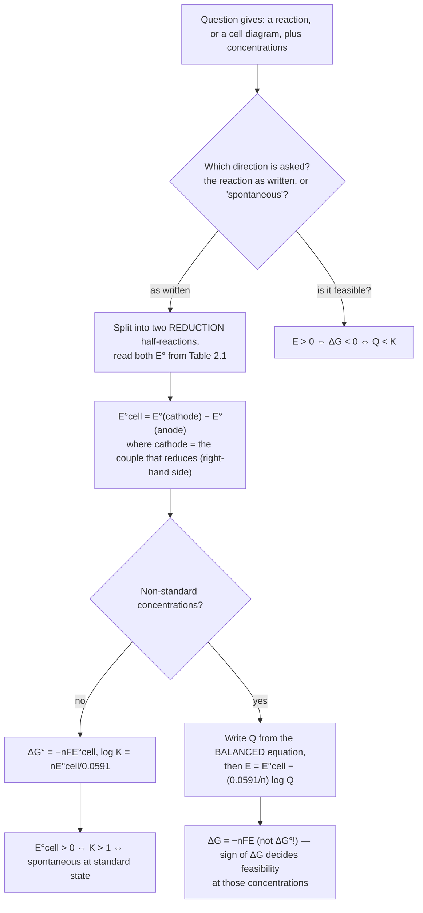
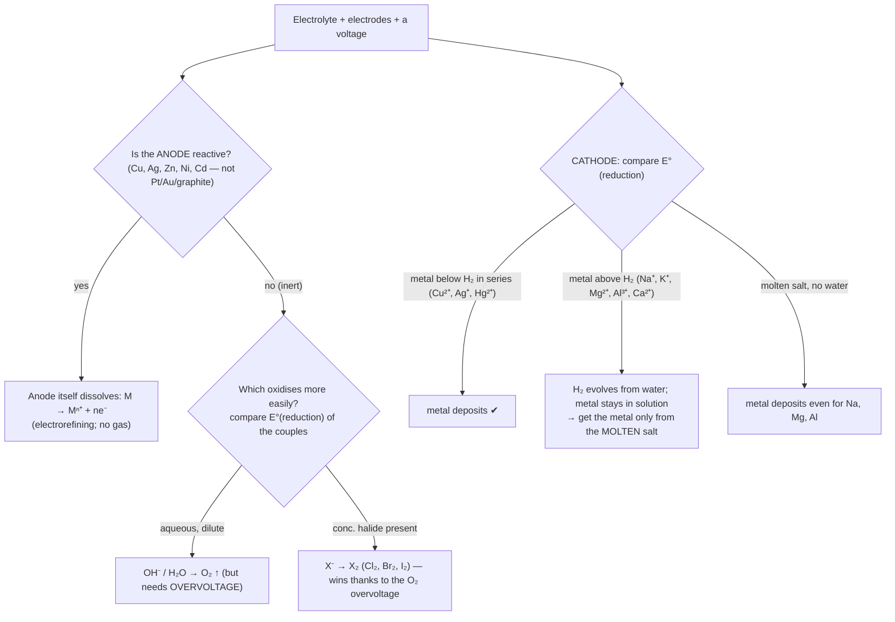

# Electrochemistry — JEE Main + Advanced Notes

> **Sources merged into these notes**
> | Source | File |
> |---|---|
> | NCERT Class XII Chemistry (rationalised, 2023+), Unit 2 | [`lech102.pdf`](lech102.pdf) |
> | Allen module for this chapter | _not uploaded yet — drop it here to enable 🅰 tags_ |
>
> `2.x` numbers are NCERT's own (the rationalised book renumbered Electrochemistry from
> Unit 3 → **Unit 2**, so old solutions quoting "Table 3.1 / Eq. 3.8" mean the same things:
> `Table 2.1`, `Eq. 2.x`). 🆇 = JEE-Advanced material beyond NCERT. ⚠ = trap.
> Constants used throughout: **F = 96487 C mol⁻¹** (NCERT's value; many solutions use 96500),
> **2.303 RT/F = 0.0591 V** and **RT/F = 0.0257 V** at 298 K.

## Contents

- [Part A — Cells, Potentials and Thermodynamics](#part-a--cells-potentials-and-thermodynamics-2123)
  1. [Two kinds of conductance, two kinds of cell](#1-two-kinds-of-conductance-two-kinds-of-cell-21)
  2. [The galvanic cell, cell notation and the salt bridge](#2-the-galvanic-cell-cell-notation-and-the-salt-bridge-22)
  3. [Electrode potential, SHE and the electrochemical series](#3-electrode-potential-she-and-the-electrochemical-series-221)
  4. [The Nernst equation — every form you will need](#4-the-nernst-equation--every-form-you-will-need-23)
  5. [Emf, ΔG and K: the three-way conversion](#5-emf-δg-and-k-the-three-way-conversion-231)
  6. [Concentration cells](#6-concentration-cells-)
  7. [Combining half-reactions: why E° is not additive](#7-combining-half-reactions-why-e-is-not-additive-)
- [Part B — Conductance of Electrolytic Solutions](#part-b--conductance-of-electrolytic-solutions-24)
  8. [G, κ, resistivity and the cell constant](#8-g-κ-resistivity-and-the-cell-constant-241)
  9. [Λm, Λeq and their variation with concentration](#9-λm-λeq-and-their-variation-with-concentration-242)
  10. [Kohlrausch's law and its four applications](#10-kohlrauschs-law-and-its-four-applications)
  11. [Ionic mobility, transport number, and why strong electrolytes deviate](#11-ionic-mobility-transport-number-and-why-strong-electrolytes-deviate-)
- [Part C — Electrolysis and Faraday's Laws](#part-c--electrolysis-and-faradays-laws-25)
  12. [Products of electrolysis: the discharge rules](#12-products-of-electrolysis-the-discharge-rules-251)
  13. [Faraday's laws and the quantitative machinery](#13-faradays-laws-and-the-quantitative-machinery-)
- [Part D — Batteries, Fuel Cells and Corrosion](#part-d--batteries-fuel-cells-and-corrosion-2628)
  14. [Primary batteries: dry cell, mercury cell, lithium](#14-primary-batteries-dry-cell-mercury-cell-lithium-261)
  15. [Secondary batteries: lead storage, Ni–Cd, Li-ion](#15-secondary-batteries-lead-storage-nicd-li-ion-262)
  16. [Fuel cells and the hydrogen economy](#16-fuel-cells-and-the-hydrogen-economy-27)
  17. [Corrosion: rusting as a short-circuited galvanic cell](#17-corrosion-rusting-as-a-short-circuited-galvanic-cell-28)
- [Part E — Advanced Corner](#part-e--advanced-corner-)
  18. [Cells that measure equilibrium constants: Ksp, Ka, Kw, Kf](#18-cells-that-measure-equilibrium-constants-ksp-ka-kw-kf-)
  19. [E–pH (Pourbaix), Latimer and Frost diagrams](#19-eph-pourbaix-latimer-and-frost-diagrams-)
  20. [Electrolysis problem patterns](#20-electrolysis-problem-patterns-)
  21. [Worked NCERT problem bank](#21-worked-ncert-problem-bank)
  22. [The trap list](#22-the-trap-list)
  23. [Quick Revision Sheet](#23-quick-revision-sheet)

---

# Part A — Cells, Potentials and Thermodynamics (2.1–2.3)

## 1. Two kinds of conductance, two kinds of cell (2.1)

```
 ELECTRONIC (metallic) conduction        ELECTROLYTIC (ionic) conduction
   carriers = electrons                    carriers = ions (in solution or melt)
   no mass transported                       mass IS transported → chemical change
   conductivity 10⁶–10⁸ S m⁻¹                decreases on cooling (viscosity ↓ when warm)
   ρ ↑ with T (lattice vibrations)          ρ ↓ with T (ions move faster)  ⚠ opposite!
   e.g. Cu 6×10⁷ S m⁻¹                        e.g. 1 M KCl ≈ 11 S m⁻¹ (a metal is ~10⁶× better)
   NCERT's Table 2.2 (conductivity /S m⁻¹ at 298.15 K) — memorise the ORDERS, they decide
   most factual MCQs:
     conductors block: Na, Cu, Ag, Au, Fe — order 10⁷ S m⁻¹, plus graphite, the
       non-metal that conducts electronically (order 10⁴)
     insulators:    glass 1.0×10⁻¹⁶, Teflon 1.0×10⁻¹⁸
     semiconductors: CuO 1×10⁻⁷, Si 1.5×10⁻², Ge 2.0   ← between the two blocks
     aqueous solutions: pure water 3.5×10⁻⁵, 0.01 M KCl 0.14, 0.01 M NaCl 0.12,
                        0.1 M HCl 3.91, 0.1 M CH₃COOH 0.047, 0.01 M CH₃COOH 0.016
   ⚠ the last five lines are the exam's favourite: 0.1 M HCl / 0.1 M acetic acid
     = 3.91/0.047 ≈ 83× — the entire gap is the degree of ionisation, not "HCl is
     more soluble". And pure water's 3.5×10⁻⁵ S m⁻¹ comes from its own ~10⁻⁷ M
     H⁺/OH⁻ (Kw, Equilibrium §14) — the number that makes §10's Λ°m(H₂O) trick work.
 superconductors: ρ = 0 below T_c (NCERT: metals at 0–15 K; ceramics up to ~150 K)
 electronically conducting polymers: polyacetylene, polyaniline, polypyrrole
   (Nobel 2000 — MacDiarmid, Heeger, Shirakawa) → light-weight batteries, bendable devices
```

**The two cells (NCERT's Fig 2.1–2.2, and it is the *same* cell doing both):**

| | **Galvanic (voltaic) cell** | **Electrolytic cell** |
|---|---|---|
| reaction | **spontaneous** redox → electricity | electricity → **non-spontaneous** redox |
| ΔG, E | ΔG < 0, E_cell > 0 | ΔG > 0, applied voltage > E_cell (with opposite sign) |
| anode | where oxidation occurs; **negative** | where oxidation occurs; **positive** |
| cathode | where reduction occurs; **positive** | where reduction occurs; **negative** |
| example | Daniell cell, discharging battery | electroplating, molten NaCl electrolysis, charging |
| energy | chemical → electrical | electrical → chemical |

⚠ **Charge a galvanic cell with a bigger opposing external voltage (E_ext > E_cell) and it
becomes an electrolytic cell** — that is precisely what recharging a battery is (NCERT
Fig 2.2). The anode/cathode *reactions* swap roles on charging; the electrode that was the
anode becomes the cathode.

> **⚠ The only safe definitions:** **anode = where oxidation happens, cathode = where
> reduction happens**, in both kinds of cells. Signs come and go with the mode of operation.
> (Also worth remembering: `E_ext > E_cell` for charging; if `E_ext = E_cell` no current
> flows, which is the basis of the *potentiometric* (zero-current) measurement of emf.)

## 2. The galvanic cell, cell notation and the salt bridge (2.2)

```
 DANIELL CELL   Zn(s) | ZnSO₄(aq) ‖ CuSO₄(aq) | Cu(s)        E° = 1.10 V
   anode (−)                                    cathode (+)
   Zn → Zn²⁺ + 2e⁻                              Cu²⁺ + 2e⁻ → Cu
        │  e⁻ flow: anode → cathode through the wire  │
        │  (conventional current: Cu → Zn)            │
   ┌────┴────┐   salt bridge (KCl/NH₄NO₃ in agar) ┌───┴────┐
   │ Zn²⁺↑   │  ← anions (Cl⁻, NO₃⁻) drift here   │ Cu²⁺↓  │
   │ SO₄²⁻   │  cations (K⁺) drift that way →      │ SO₄²⁻  │
   └─────────┘                                     └────────┘
```

### IUPAC cell notation rules (asked as "represent the cell")

1. **Anode on the left**, cathode on the right; the **electrolyte of each half-cell next to
   its own electrode**.
2. `|` = a **phase boundary** (solid|solution); `‖` = the **salt bridge** (two liquid junctions).
3. Give **concentrations** (mol L⁻¹) in parentheses and **gas pressures**, and always the
   state `(s) (l) (g) (aq)`.
4. If both partners of a redox couple are soluble (Fe³⁺/Fe²⁺, MnO₄⁻/Mn²⁺, H⁺/H₂) an
   **inert Pt electrode** must be written at the end.
5. Write the electrode that is being **oxidised** first; the cell reaction is obtained as
   `(right-hand reduction) − (left-hand reduction)` — i.e. reduce the right, oxidise the left,
   and add.

```
 worked: "Depict the cell for Zn(s) + 2Ag⁺(aq) → Zn²⁺(aq) + 2Ag(s)"   (NCERT Q2.3/Q7.30)
   (−) Zn(s) | Zn²⁺(aq) ‖ Ag⁺(aq) | Ag(s) (+)        E°cell = 0.80 − (−0.76) = +1.56 V
 worked: Fe³⁺/Fe²⁺ vs MnO₄⁻/Mn²⁺ cell
   (−) Pt | Fe²⁺(aq), Fe³⁺(aq) ‖ MnO₄⁻(aq), Mn²⁺(aq), H⁺(aq) | Pt (+)
   anode:  5×[Fe²⁺ → Fe³⁺ + e⁻]
   cathode: MnO₄⁻ + 8H⁺ + 5e⁻ → Mn²⁺ + 4H₂O
   overall: MnO₄⁻ + 5Fe²⁺ + 8H⁺ → Mn²⁺ + 5Fe³⁺ + 4H₂O     E° = 1.51 − 0.77 = +0.74 V
```

**Salt bridge:** inverted U-tube with a saturated solution of **KCl / KNO₃ / NH₄NO₃ in agar
agar**. Four functions: (i) completes the circuit, (ii) maintains **electrical neutrality**
in both half-cells, (iii) **prevents mixing** of the two electrolytes (which would simply
react and give heat), (iv) **minimises the liquid-junction potential** because `u°(K⁺) ≈
u°(Cl⁻)` (73.5 vs 76.3 S cm² mol⁻¹ — nearly equal ionic mobilities, so the diffusion
potentials cancel).

⚠ Never use KCl if the cell contains **Ag⁺ or Pb²⁺** (AgCl/PbCl₂ precipitate and block the
tube) → use **NH₄NO₃** or **KNO₃**. Agar is there to *immobilise* the solution so it cannot
flow and dilute the half-cells.

**Why the cell stops:** as Zn²⁺ builds up and Cu²⁺ is removed, `Q` grows; `E = E° −
(RT/nF)lnQ` falls; when **E = 0** the cell is "dead" — a *discharged* battery is simply a cell
that has reached equilibrium (Q = K). ⚠ That is the single most conceptual sentence in this
chapter and it is the link to [Equilibrium §9](../../Class-11/06-Equilibrium/notes.md).

## 3. Electrode potential, SHE and the electrochemical series (2.2.1)

```
 ELECTRODE POTENTIAL E = the potential difference between the metal and its solution,
   caused by the tendency of M to leave as Mⁿ⁺ (solution pressure) versus the tendency of
   Mⁿ⁺ to plate back (osmotic pressure).  Only a DIFFERENCE of two of these is measurable.

 STANDARD ELECTRODE POTENTIAL E°: reduction potential measured with
   · all solutes at unit activity (≈ 1 M),  · any gas at 1 bar (NCERT: 1 atm),
   · T = 298 K,  · written for the REDUCTION direction,  · vs the SHE.

 SHE (standard hydrogen electrode) — the zero of the scale:
   Pt(s) | H₂(g, 1 bar) | H⁺(aq, 1 M)     2H⁺ + 2e⁻ ⇌ H₂      E° ≡ 0.00000 V
   platinised Pt (coated with platinum black) = large area + catalyst for the H⁺/H₊
   equilibrium, so the electrode polarises as little as possible; it is only ever a
   *reference*, and any cell's emf against it gives the unknown E° directly:
   E°(Zn²⁺/Zn) from  Pt,H₂(1 bar)|H⁺(1M) ‖ Zn²⁺(1M)|Zn  = −0.76 V
   ⇒ the negative sign means Zn has a GREATER tendency to be oxidised than H₂, i.e. the
     Zn²⁺/Zn couple is a stronger REDUCING system than H⁺/H₂ (NCERT's wording).
```

**Rules for using the series (all four are asked):**

1. `E°cell = E°_cathode − E°_anode` = **E°_right − E°_left** (both as reduction potentials).
   Never flip signs by hand; just subtract. (NCERT's summary states exactly this.)
2. **E° is intensive**: multiplying a half-reaction by any factor leaves E° **unchanged**
   (ΔG° = −nFE° changes because n changes).
3. `E°cell > 0 ⇔ ΔG° < 0 ⇔ K > 1` → reaction is spontaneous as written at standard state.
4. The position in the series predicts: **displacement** (a metal with lower E° displaces one
   with higher E° from its salt), **H₂ evolution in acids** (metals below hydrogen),
   **oxidising/reducing strength**, **products of electrolysis**, and **extraction method**
   (metals at the very bottom — K, Ca, Na, Mg, Al — only by electrolysis).

**The series in action — NCERT's own questions, answered:**

```
 (a) strongest reductant = Li (E° = −3.05 V) → its ion Li⁺ is the WEAKEST oxidant;
     strongest oxidant in the table = F₂ (+2.87) → F⁻ the weakest reductant.
 (b) intext 2.1, "how would you determine E° for Mg²⁺|Mg?" — build the cell
     Pt,H₂(1 bar)|H⁺(1 M) ‖ Mg²⁺(1 M)|Mg and read the emf on a high-resistance voltmeter;
     Mg is the anode, so E°(Mg²⁺/Mg) = −(cell emf) = −2.36 V (Table 2.1; NCERT's own
     Q2.2 quotes −2.37 V — the two differ only by rounding, so use whichever the paper gives).
 (c) intext 2.2, "can you store CuSO₄ solution in a zinc pot?" — NO:
     E°cell = 0.34 − (−0.76) = +1.10 V > 0, so Zn reduces Cu²⁺ and the pot dissolves.
     A Cu or glass vessel is fine; Fe fails too (−0.44 < +0.34).
 (d) intext 2.3, "three substances that can oxidise Fe²⁺" — anything with E° > 0.77 V:
     MnO₄⁻ (1.51), Cr₂O₇²⁻ (1.33), Cl₂ (1.36), Br₂ (1.09), H₂O₂ (1.78) — note O₂ (1.23) also
     qualifies, which is exactly why Fe²⁺ salts and rust are Fe³⁺ (§17).
 (e) intext 2.11: Na, Mg, Al, Ca, K (the very negative ones) are produced
     by electrolysing the fused salts; Cu, Hg, Ag can be got by roasting/displacement.
 (f) intext 2.12: Cr₂O₇²⁻ + 6e⁻ + 14H⁺ → 2Cr³⁺ + 7H₂O needs 6 F = 6 × 96487 = 5.79×10⁵ C
     — the series and Faraday's laws are the two halves of the same chapter.
 (g) Q2.1: "arrange Al, Cu, Fe, Mg, Zn by mutual displacement" and Q2.2: "K, Ag, Hg, Mg, Cr
     in increasing reducing power" are the SAME skill — sort by E°, then read the list from
     the bottom up: Ag (0.80) < Hg (0.79) < Cr (−0.74) < Mg (−2.37) < K (−2.93).
```

⚠ **NCERT's own caution about the Li anomaly** (2.2.1): Li has the **lowest** E° of all
metals (strongest reductant in water) *because* of its very large hydration enthalpy, even
though its ionisation enthalpy is the largest of the alkali metals. So "lowest IE = strongest
reductant" is wrong for aqueous solution; the full cycle is
`ΔaH° + ΔiH° + ΔhydH°` (see Redox notes §15).

## 4. The Nernst equation — every form you will need (2.3)

**Electrode form** (for `Mⁿ⁺ + ne⁻ → M`, NCERT's Eq. 2.8):

```
   E = E° − (RT/nF) ln( a_red / a_ox )
   E(Mⁿ⁺/M) = E° − (RT/nF) ln(1/[Mⁿ⁺]) = E° + (RT/nF) ln[Mⁿ⁺]
            = E° + (0.0591/n) log[Mⁿ⁺]                 at 298 K
   ⚠ general mnemonic:  E = E° + (0.0591/n) log( OXIDISED form / REDUCED form )
     — with solids = 1, liquids = 1, gases as p/bar, and H⁺/OH⁻ included when they appear.
```

**Cell form:**

```
   E_cell = E°_cell − (RT/nF) ln Q = E°_cell − (0.0591/n) log Q     (n = e⁻ per cell reaction)
```

**The special cases that appear in papers:**

```
 hydrogen electrode    2H⁺ + 2e⁻ ⇌ H₂(g)
   E = 0 + (0.0591/2)log([H⁺]²/p_H₂) = 0.0591 log[H⁺] − (0.0591/2)log p_H₂
   at p_H₂ = 1 bar:  E = −0.0591 pH        ← the basis of pH measurement!
   intext 2.4: pH 10 → E = −0.0591 × 10 = −0.591 V

 metal electrode       Mⁿ⁺ + ne⁻ → M :   E = E° + (0.0591/n) log[Mⁿ⁺]
   ⚠ for Ag⁺/Ag (n = 1) a 10-fold dilution lowers E by 59.1 mV; for Cu²⁺/Cu (n = 2) by 29.5 mV

 metal–insoluble-salt  AgCl(s) + e⁻ → Ag(s) + Cl⁻
   E = E°(AgCl/Ag) − 0.0591 log[Cl⁻]   (E° = +0.22 V)  ← "second kind"; Ksp comes out of it
   similarly AgBr/Ag (+0.10 V), Hg₂Cl₂/Hg (calomel +0.27 V; saturated calomel +0.244 V)

 redox (inert Pt)      Fe³⁺ + e⁻ → Fe²⁺ :  E = 0.77 + 0.0591 log([Fe³⁺]/[Fe²⁺])
   MnO₄⁻ + 8H⁺ + 5e⁻ → Mn²⁺ + 4H₂O:
     E = 1.51 + (0.0591/5) log( [MnO₄⁻][H⁺]⁸/[Mn²⁺] )
       = 1.51 − 0.0945 pH  at [MnO₄⁻] = [Mn²⁺]      ⚠ 8/5 × 0.0591 = 0.0945 V per pH unit
   Cr₂O₇²⁻ + 14H⁺ + 6e⁻ → 2Cr³⁺ + 7H₂O:
     E = 1.33 + (0.0591/6)log(...) and it drops 0.138 V per pH unit (14/6 × 0.0591)
   ⇒ "permanganate/dichromate are strong oxidants only in ACID" is a Nernst statement, not
     an O.S. statement — and the same slope logic is why oxidants that consume H⁺ weaken in base.

 gas electrodes        O₂ + 4H⁺ + 4e⁻ → 2H₂O : E = 1.23 − 0.0591 pH
                       Cl₂ + 2e⁻ → 2Cl⁻        : E = 1.36 − 0.0591 log[Cl⁻]
```

> **⚠ Four recurring slips**
> 1. **log vs ln** — `2.303RT/F = 0.0591 V` is for **log₁₀**; with ln the coefficient is
>    0.0257 V at 298 K. Mixing them gives an answer 2.3× off.
> 2. Forgetting **n** in the denominator (n = electrons of *that* half-reaction, and for the
>    cell form n = electrons of the *balanced cell reaction*).
> 3. Putting **H₂O** or a pure **solid** into Q.
> 4. Using the *concentration* of a gas instead of its **pressure**, or forgetting to divide
>    the pH coefficient — e.g. the MnO₄⁻ slope is **0.0945**, not 0.0591.



## 5. Emf, ΔG and K: the three-way conversion (2.3.1)

```
   electrical work = −ΔG   (reversible cell at constant T, p)
   ───────────────────────────────────────────────────────────
   ΔG  = −nF E_cell                       (any state)
   ΔG° = −nF E°_cell                      (standard state)
   ΔG° = −RT lnK   ⇒   lnK = nFE°/RT   ⇒   log K = n E°_cell / 0.0591   (298 K)
   ───────────────────────────────────────────────────────────
   at equilibrium: E_cell = 0 and Q = K  (a dead battery is an equilibrated cell)
```

```
  Handy magnitudes at 298 K (memorise the scale, not the formula):
    E° = +0.0591 V  (n=1)  → K = 10        E° = +0.30 V (n=2) → K = 10¹⁰
    E° = +0.20 V  (n=1)  → K ≈ 2×10³      E° = −0.0591 V     → K = 0.1
    1 electron, 0.0591 V ⇒ ΔG° = −5.7 kJ mol⁻¹ (the same 5.708 kJ as in Equilibrium §9)
```

**NCERT's own worked example (intext 2.6):** `2Fe³⁺ + 2I⁻ → 2Fe²⁺ + I₂`, E°cell = 0.236 V,
n = 2:

```
   ΔG° = −2 × 96487 × 0.236 = −45.54 kJ mol⁻¹
   log K = nE°/0.0591 = 2 × 0.236/0.0591 = 7.99  ⇒ K = 9.62×10⁷  ✔ NCERT's two answers
   ✔ the reaction is quantitative → which is exactly why iodometry can ASSAY Fe³⁺,
     and why FeI₃ cannot be bottled (Redox notes §8).
```

**Emf at non-standard conditions (intext 2.5):** `Ni(s) + 2Ag⁺(0.002 M) → Ni²⁺(0.160 M) + 2Ag`,
E° = 1.05 V:

```
   Q = [Ni²⁺]/[Ag⁺]² = 0.160/(0.002)² = 4.0×10⁴
   E = 1.05 − (0.0591/2) log(4.0×10⁴) = 1.05 − 0.0296 × 4.602 = 1.05 − 0.136 = 0.91 V ✔
   ⚠ note the tiny [Ag⁺] (0.002 M) is SQUARED, giving a large Q and a 140 mV loss.
```

## 6. Concentration cells 🆇

A cell whose two half-cells are the **same electrode reaction** at **different
concentrations**. Then **E°cell = 0** and *all* the driving force comes from dilution:

```
   electrolyte concentration cell (transference, two H₂ electrodes at different p, or):
     Pt|H₂(p₁)|H⁺(c) | H⁺(c)|H₂(p₂)|Pt   →  E = (0.0591/2) log(p₂/p₁)

   the standard two-compartment type:
     M|Mⁿ⁺(c₁) ‖ Mⁿ⁺(c₂)|M
     left: M → Mⁿ⁺(c₁) + ne⁻      right: Mⁿ⁺(c₂) + ne⁻ → M
     E = (0.0591/n) log(c₂/c₁)     (c₂ > c₁ ⇒ E > 0)
   spontaneous direction: the CONCENTRATED side plates out, the DILUTE side dissolves —
     the cell works only as long as the two concentrations are unequal ⇒ both tend to
     EQUALISE (ΔG of dilution is the energy source).
   with Ag/Ag⁺, n = 1: c₂:c₁ = 10 → E = 59.1 mV; c₂:c₁ = 100 → 118 mV.
```

⚠ JEE favourite: "in a concentration cell, E° = 0 but E ≠ 0; ΔH ≈ 0 for the ideal dilution,
yet ΔG < 0 — so the work is paid for by **TΔS** of mixing." That reasoning (entropy-driven
cell) is a genuine Advanced question, and it is also why a concentration cell's emf is
**temperature-dependent in a way normal cells are not**.

Concentration cells with **transference** (electrolyte junction, no salt bridge) have an
extra liquid-junction term `E_j = (t₋ − t₊)(0.0591) log(c₂/c₁)` — see §11 for transport
numbers; the useful takeaway is that the bridge (or transference numbers being equal, as in
KCl) is what makes E clean.

## 7. Combining half-reactions: why E° is not additive 🆇

**E° values cannot be added; ΔG° values can.** For two consecutive reductions
`Ox₁ → Ox₂ (n₁, E₁)` and `Ox₂ → Red (n₂, E₂)`:

```
   E°(Ox₁/Red) = (n₁E₁ + n₂E₂)/(n₁ + n₂)                      (weight by electron count!)

 (1) Fe³⁺ + e⁻ → Fe²⁺   +0.77        (2) Cu²⁺ + e⁻ → Cu⁺  +0.153
     Fe²⁺ + 2e⁻ → Fe     −0.44            Cu⁺ + e⁻ → Cu    +0.521
     E°(Fe³⁺/Fe) = (1(0.77) + 2(−0.44))/3 = −0.037 V       E°(Cu²⁺/Cu) = (0.153+0.521)/2 = +0.337
     ⚠ note the 2 multiplies the n = 2 step: this is why Fe³⁺/Fe is only *slightly*
       negative even though Fe²⁺/Fe is −0.44 (i.e. Fe³⁺ is a poor "direct" oxidant to metal,
       and rust forms through Fe²⁺ first — see §17).

 ΔG° check: ΔG° = −nFE°;  E° = −ΔG°/(nF)   — always derive through ΔG° if unsure.
 Also: E° can be got from ΔfG° data (Advanced 2013 style):
   ΔG°_rxn = ΣνΔfG°(products) − ΣνΔfG°(reactants), then E°cell = −ΔG°/(nF).
```

⚠ A related trap: "E° for `2H₂O + 2e⁻ → H₂ + 2OH⁻` in base is −0.83 V; is that the same
electrode as H⁺/H₂?" — **yes** — it is the *hydrogen electrode at pH 14*, and
`0 − 0.0591 × 14 = −0.827 V`. The two entries of the same couple are one Nernst line apart
(NCERT Table 2.1 lists both — that redundancy is the exam's way of testing whether you
understand pH dependence).

---

# Part B — Conductance of Electrolytic Solutions (2.4)

## 8. G, κ, resistivity and the cell constant (2.4.1)

```
 conductance      G = 1/R                 [S = Ω⁻¹ = mho]
 resistivity      ρ = R·A/l               [Ω m]
 CONDUCTIVITY κ = 1/ρ = G·(l/A)           [S m⁻¹ or S cm⁻¹]
        (l/A) = CELL CONSTANT G*  →  κ = G × G* = (1/R)(l/A)
 molar conductivity  Λm = κ/c             [S m² mol⁻¹]
     with κ in S cm⁻¹ and c in mol L⁻¹:   Λm = (1000 κ)/c   [S cm² mol⁻¹]
 equivalent conductivity Λeq = 1000κ/N    [S cm² equiv⁻¹]
     and  Λm = n × Λeq    (n = total cationic/anionic charge per formula unit, "z₊ν₊")
     e.g. Λm(Na₂SO₄) = 2 Λeq(Na₂SO₄) ; Λm(AlCl₃) = 3 Λeq
```

⚠ **Unit conversion is where marks are lost.** `1 S m⁻¹ = 10⁻² S cm⁻¹`;
`1 S m² mol⁻¹ = 10⁴ S cm² mol⁻¹`. NCERT's own worked conversion:
κ = 0.01148 S cm⁻¹ = 1.148 S m⁻¹ at c = 50 mol m⁻³ (= 0.05 M) gives
`Λm = 1.148/50 = 0.02296 S m² mol⁻¹ = 229.6 S cm² mol⁻¹` ✔ — same number, two unit systems.

**Cell constant** is determined by calibration with a standard KCl solution whose κ is known
(NCERT uses κ(0.001 M KCl, 298 K) = 0.146×10⁻³ S cm⁻¹):

```
 G* = κ × R  = 0.146×10⁻³ S cm⁻¹ × 1500 Ω = 0.219 cm⁻¹        (NCERT's example)
 then for an unknown in the SAME cell:  κ = G*/R = 0.219/500 = 4.38×10⁻⁴ S cm⁻¹
   and Λm = 1000κ/c = 1000 × 4.38×10⁻⁴ / 0.001 = 438 S cm² mol⁻¹ ✔
 ⚠ the resistance of the WATER/solvent must be subtracted before κ is used for a
   sparingly soluble salt (§10, application 4) — this correction is a question in itself.
```

### How R (hence κ) is actually measured — NCERT 2.4.1 as a "give the reason" list

```
 A conductivity cell = two Pt electrodes (area A, distance l) dipped in the solution;
 the liquid between them is a column whose resistance is, by NCERT's Eq. 2.17,
     R = ρ l/A = (1/κ)(l/A)      ⇒  κ = (1/R)(l/A) = G × (cell constant)
 It is read on a WHEATSTONE bridge — but with THREE changes, each one a question:
  (i)  an AC source instead of a battery, because DC would electrolyse the solution and
       change its composition during the measurement (NCERT says exactly this);
  (ii) a headphones / "magic eye" null detector instead of a moving-coil galvanometer,
       which cannot follow an alternating current and would read zero;
  (iii)the electrodes are PLATINISED (coated electrochemically with platinum black) — this
       hugely increases the effective area and reduces POLARISATION, so A/l stays the same
       as the geometric value used in the cell constant.
 The cell constant (l/A) is a property of the CELL, not the solution: determine it once
 with a standard KCl solution of known κ, then use it for every unknown in that cell.
 ⚠ so κ of an unknown = (known κ of KCl × R_KCl) / R_unknown  — the one-line ratio form
   that solves most calibration problems without ever computing G*.
```

## 9. Λm, Λeq and their variation with concentration (2.4.2)

```
   κ (conductivity)  DECREASES on dilution  — fewer ions per unit volume
   Λm (molar cond.)  INCREASES on dilution  — reasons DIFFER for the two classes:

   STRONG electrolytes (KCl, NaCl, HCl):  Λm rises only slightly, because interionic
     attraction falls. Plot Λm vs √c is a straight line with a small negative slope,
     extrapolatable to c → 0 ⇒  Λ°m measurable directly.
        Λm = Λ°m − (A + BΛ°m)√c      (Debye–Hückel–Onsager) 🆇
        A = relaxation (asymmetry) effect: the ionic atmosphere lags behind, dragging back
        B = electrophoretic effect: the solvent shell of the counter-ion moves the other way
     ⚠ for these, Λm/Λ°m is NOT the degree of dissociation (α = 1 already at all c).

   WEAK electrolytes (CH₃COOH, NH₄OH):  Λm rises STEEPLY on dilution because α rises
     (Ostwald: α = √(Ka/c)); the curve is very steep near c → 0 and CANNOT be
     extrapolated — hence Kohlrausch's law is the only way to Λ°m (§10).
```

```
     Λm                                Λm
      │        strong: KCl, HCl          │            weak: CH₃COOH
      │      ___________________─ Λ°m    │                     ／
      │   ／‾‾                    (linear│                  ／
      │ ／  in √c, small slope)          │                ／  steep, never reaches
      └──────────── √c                    └──────────── √c   Λ°m by extrapolation
```

**NCERT's two factor lists (asked as "what does the conductivity depend on?"):**

```
 metallic conductance:  (i) nature & structure of the metal, (ii) number of valence
                          electrons per atom, (iii) temperature — it DECREASES as T rises.
 electrolytic conductance: (i) nature of the electrolyte, (ii) size of the ions and their
                          SOLVATION, (iii) nature of the solvent and its VISCOSITY,
                          (iv) concentration, (v) temperature — it INCREASES as T rises.
 ⚠ same five words, opposite temperature behaviour: heat shakes the lattice loose for ions
   but jiggles the metal's atoms into the electrons' path. "Resistance of an electrolytic
   solution decreases with temperature rise" is a standard true/false item.
```

**Intext 2.7 answered exactly as NCERT wants:** conductivity κ falls on dilution because the
**number of charge carriers per unit volume** decreases, even though each ion becomes freer
(and, for weak electrolytes, the degree of ionisation rises — still not enough to beat the
volume factor).

## 10. Kohlrausch's law and its four applications

> **Law of independent migration of ions (NCERT Eq. 2.25):** at infinite dilution every ion
> contributes a fixed share to Λ°m, independent of the counter-ion:
> **Λ°m = ν₊ λ°₊ + ν₋ λ°₋** (ν = number of ions per formula unit).

**NCERT Table 2.4 — limiting molar conductivities at 298 K (S cm² mol⁻¹):**

| Cation | λ° | Cation | λ° |
|---|---|---|---|
| H⁺ | **349.6** | Na⁺ | 50.1 |
| K⁺ | 73.5 | Ca²⁺ | 119.0 |
| Mg²⁺ | 106.0 | — | — |

| Anion | λ° | Anion | λ° |
|---|---|---|---|
| OH⁻ | **199.1** | Cl⁻ | 76.3 |
| Br⁻ | 78.1 | CH₃COO⁻ | 40.9 |
| SO₄²⁻ | 160.0 | HCOO⁻ | 54.6 |
| — | — | NH₄⁺ | 73.4 |

⚠ **Why H⁺ and OH⁻ are 3–5× faster than any other ion:** proton **hopping** (Grotthuss
mechanism) — the charge moves by relaying H-bonds through the water network, so no ion
actually has to swim the whole way. This is the standard "reason" question, and it is also
why Λ°m(HCl), Λ°m(NaOH), Λ°m(KOH) are the largest among strong electrolytes.
⚠ Also: Ca²⁺/Mg²⁺/SO₄²⁻ entries are per **mole of that ion**, so for CaCl₂ use
`Λ°m = λ°(Ca²⁺) + 2λ°(Cl⁻) = 119.0 + 152.6 = 271.6` — the ν factors are the #1 arithmetic slip.

### Application 1 — Λ°m of a **weak** electrolyte by adding/subtracting strong ones

```
 Λ°m(CH₃COOH) = Λ°m(HCl) + Λ°m(CH₃COONa) − Λ°m(NaCl)
              = 425.9   + 91.0          − 126.4     = 390.5 S cm² mol⁻¹ ✔ (NCERT Ex. 2.8)
 (equivalently λ°(H⁺) + λ°(CH₃COO⁻) = 349.6 + 40.9 = 390.5 ✔ the two routes must agree)
 Λ°m(NH₄OH) = Λ°m(NH₄Cl) + Λ°m(NaOH) − Λ°m(NaCl)
 Rule: pick a chain in which every intermediate species is a STRONG electrolyte.
```

### Application 2 — degree of dissociation of a weak electrolyte

```
   α = Λm/Λ°m                        (NCERT Eq. 2.26; the "Kohlrausch–Arrhenius" relation)
   Ka = cα²/(1−α) = cΛm²/(Λ°m(Λ°m − Λm))     (NCERT Eq. 2.27)   ← conductivity → Equilibrium §15
 intext 2.9 (methanoic acid): Λ°m = 349.6 + 54.6 = 404.2 ; Λm = 46.1 (c = 0.025 M)
   α = 46.1/404.2 = 0.114 ;  Ka = 0.025(0.114)²/(1−0.114) = 3.67×10⁻⁴ ✔ (NCERT's answer)
 Q2.11 (acetic acid): κ = 7.896×10⁻⁵ S cm⁻¹, c = 0.00241 M
   Λm = 1000κ/c = 32.76 ; α = 32.76/390.5 = 0.0839 ; Ka = 0.00241(0.0839)²/0.916 = 1.86×10⁻⁵ ✔
```

### Application 3 — solubility and Ksp of a **sparingly soluble** salt

```
   For AgCl: the saturated solution is so dilute that Λm ≈ Λ°m(AgCl) = 61.9 + 76.3 = 138.2
   (λ°(Ag⁺) = 61.9 comes from a data book — NCERT's Table 2.4 stops at the ions it lists)
   κ(solution) − κ(water) = κ(AgCl)  ;  S = 1000 κ(AgCl)/Λ°m  [mol L⁻¹]  (κ in S cm⁻¹)
   measured: κ(saturated soln) − κ(water) = κ(AgCl)   ← subtract, always;
   with κ(AgCl) = 1.86×10⁻⁶ S cm⁻¹: S = 1000 × 1.86×10⁻⁶/138.2 = 1.35×10⁻⁵ mol L⁻¹
   ⇒ Ksp = S² = 1.8×10⁻¹⁰ ✔ (this single experiment is *the* classical Ksp determination)
   ⚠ always subtract the conductivity of the water, and always use Λ°m (not Λm).
```

### Application 4 — ionic product of water

```
   Λ°m(H₂O) = λ°(H⁺) + λ°(OH⁻) = 349.6 + 199.1 = 548.7 S cm² mol⁻¹
   κ of pure (conductivity-blind) water = 5.5×10⁻⁸ S cm⁻¹
   c = 1000κ/Λ°m = 1000 × 5.5×10⁻⁸/548.7 = 1.0×10⁻⁷ mol L⁻¹ = [H⁺] = [OH⁻]
   ⇒ Kw = 1.0×10⁻¹⁴ ✔   (this is intext 2.8: "suggest a way to determine Λ°m of water")
   Reverse version (JEE Advanced): "given Λ°m(H₂O) = 548.7 and Λm of pure water = 5.5×10⁻⁸×10⁷,
   find Kw" — same three lines backwards.
```

## 11. Ionic mobility, transport number, and why strong electrolytes deviate 🆇

```
  ionic mobility u = drift speed / potential gradient = v/(E/l)   [m² V⁻¹ s⁻¹]
  λ° = F u°              (each ion's limiting conductivity is its charge-carrying ability)
  transport (transference) number  t₊ = λ₊/(λ₊ + λ₋) , t₋ = 1 − t₊
     HCl: t₊ = 349.6/548.7 = 0.637 → 64 % of the current in HCl is carried by H⁺
     KCl: 73.5/149.8 = 0.49 → nearly equal ⇒ why KCl is the salt-bridge electrolyte (§2)
  in an electric field the cation moves to the cathode carrying t₊ of the charge: this is the
  basis of Hittorf's method of determining transport numbers and of the
  "concentration cell with transference" emf correction (§6).
  ⚠ mobility order of the alkali metals is the REVERSE of their ionic radii:
    Li⁺(aq) < Na⁺ < K⁺ < Rb⁺ < Cs⁺ — because a small ion hydrates MORE strongly and
    drags a bigger shell (giant ionic radius in solution). "Smaller ion → faster" is wrong
    in water; it is true only in the gas phase.
```

---

# Part C — Electrolysis and Faraday's Laws (2.5)

## 12. Products of electrolysis: the discharge rules (2.5.1)



**The two working rules (say them like this in a subjective answer):**

- **Cathode:** the species with the **higher (more positive) reduction potential** is reduced
  first. In aqueous solution, a cation whose `E°(Mⁿ⁺/M)` is well below
  `E°(2H₂O/H₂ + 2OH⁻) = −0.83 V` will not plate out — hydrogen goes instead (overvoltage on
  some metals shifts this boundary: H₂ on Hg needs ~0.4 V extra, which is why Na amalgam can
  be made on a mercury cathode in the Castner–Kellner cell).
- **Anode:** the species with the **lower** reduction potential for its couple is oxidised —
  *unless* the anode is itself a dissolvable metal (then the metal wins: active anode), and
  with the important exception that **O₂ evolution needs a large overvoltage**, so in
  concentrated chloride solutions **Cl₂** comes off instead of O₂ even though
  `E°(O₂/H₂O) = 1.23 < E°(Cl₂/Cl⁻) = 1.36`. ⚠ That single inversion is the most-asked
  fact of this section.

**NCERT's four cases (intext/Q2.18), answered:**

```
 (i)   molten NaCl, Pt electrodes:  cathode Na⁺ + e⁻ → Na(l) ; anode 2Cl⁻ → Cl₂ + 2e⁻
        ⇒ Na metal + Cl₂ gas (no water ⇒ no competition)
 (ii)  aqueous NaCl (brine), Pt:    cathode H₂ (from water: 2H₂O + 2e⁻ → H₂ + 2OH⁻)
                                    anode Cl₂  → the CHLOR-ALKALI process; the solution left
                                    behind is NaOH (⚠ this is how "caustic soda" is made)
 (iii) aqueous CuSO₄, Pt:           cathode Cu(s) deposits (E° +0.34 > 0.00);
                                    anode O₂ (2H₂O → O₂ + 4H⁺ + 4e⁻) ⇒ the solution turns
                                    into H₂SO₄, so its pH FALLS as electrolysis proceeds ⚠
 (iv)  aqueous CuSO₄, COPPER electrodes: cathode Cu deposits, anode Cu dissolves
                                    ⇒ net transfer of Cu from anode to cathode =
                                       electrorefining; [Cu²⁺] and pH stay (nearly) constant
                                       (⚠ the contrast with (iii) is the question)
  Impurities in refining: precious metals (Ag, Au, Pt) fall as "anode mud" — the commercial
  source of Ag/Pt/Se; Fe, Zn, Ni stay dissolved (they are more reactive, so they do not plate
  at the cathode potential used).
```

**Rules for "predict the products" that survive all exceptions:**

1. List every oxidisable/reducible species (including **H₂O**!).
2. Order them by the E° table, remember overvoltage for H₂ and O₂ on that electrode material.
3. Ask whether the **electrode itself** is reactive — if yes, it participates.
4. Track what the leftover solution becomes (pH change, salt conversion).

## 13. Faraday's laws and the quantitative machinery 🆇

```
 FIRST LAW:   mass deposited/liberated  w ∝ Q = It
 SECOND LAW:  for the same Q, masses of different substances ∝ their equivalent weights
 ─────────────────────────────────────────────────────────────
      w = (E/F) Q = (M/(n F)) I t      [E = equivalent weight, n = e⁻ per formula unit]
      Q(coulomb) = I(A) × t(s)  ;  1 F = 96487 C = 1 mole of electrons
      moles of e⁻ = Q/F  →  moles of product = (Q/F)/n        ← the modern, safest route
      faradaic (current) efficiency = (mass actually obtained / mass predicted by Faraday) × 100
        = (Q theoretically required / Q actually passed) × 100
```

**The four standard problem shapes** (more worked ones in §20):

```
 (1) "charge required for": 1 mol Al³⁺→Al = 3 F; 1 mol Cu²⁺→Cu = 2 F;
     1 mol MnO₄⁻→Mn²⁺ = 5 F = 4.82×10⁵ C; 1 mol Cr₂O₇²⁻ = 6 F = 5.79×10⁵ C (intext 2.12);
     1 mol H₂O → ½O₂ = 2 F; 1 mol FeO → ½Fe₂O₃ = 1 F (Q2.14).
 (2) mass from I,t: Q = It → mol e⁻ → mol product (NCERT Q2.15: 5 A for 20 min in
     Ni(NO₃)₂ → 6000 C → 0.0622 mol e⁻ → 0.0311 mol Ni = 1.83 g ✔).
 (3) CELLS IN SERIES: the SAME charge passes through each ⇒
     w₁/w₂ = E₁/E₂. NCERT Q2.16: 1.45 g Ag deposited (0.0134 mol ⇒ Q = 1295 C) with
     I = 1.5 A → t = 863 s; Cu = (0.0134/2) × 63.5 = 0.426 g; Zn = 0.0067 × 65.4 = 0.439 g.
 (4) "how long / what current / what volume of gas at STP":
     gas volumes need moles = Q/(nF) then ×22.4 L (or 22.7 at 1 bar) —
     H₂: 2 e⁻ per mol, O₂: 4 e⁻, Cl₂: 2 e⁻.
```

⚠ **Equivalent weight subtleties**: in `Al³⁺ + 3e⁻ → Al`, E = 27/3 = 9; for `MnO₄⁻` (n = 5)
E = 158/5 = 31.6; for H₂: 2 e⁻ per mole, so "11.2 L of H₂ at STP per faraday" ✔ (1 F →
0.5 mol H₂ → 11.2 L). Likewise 1 F deposits 1 mol Ag (108 g), ½ mol Cu (31.8 g),
⅓ mol Al (9 g) — the "32.2, 108, 9 g" trio is the fastest way to check any answer.

---
# Part D — Batteries, Fuel Cells and Corrosion (2.6–2.8)

## 14. Primary batteries: dry cell, mercury cell, lithium (2.6.1)

> **Primary cell** = the redox reaction runs **once**; after it the battery is dead and cannot
> be revived (NCERT: "the reaction occurs only once and after use over a period of time
> battery becomes dead"). Practical requirements NCERT states up front: light, compact, and
> **voltage that does not vary appreciably during use**.

```
 DRY CELL (Leclanché) — 1.5 V, Fig 2.8
   anode (zinc container):   Zn(s) → Zn²⁺ + 2e⁻
   cathode (graphite rod in powdered MnO₂ + carbon):
                             MnO₂ + NH₄⁺ + e⁻ → MnO(OH) + NH₃
                             (Mn: +4 → +3 — NCERT points this out; MnO₂ is a DEPOLARISER)
   moist paste = NH₄Cl + ZnCl₂ electrolyte
   the NH₃ produced complexes the Zn²⁺:  Zn²⁺ + 4NH₃ → [Zn(NH₃)₄]²⁺
   ⚠ why it leaks/"dies" while switched off: local action on the Zn can (impurities set up
     micro-cells) and the slow reaction of Zn with NH₄Cl — a dry cell has a shelf life.

 MERCURY CELL — 1.35 V, Fig 2.9 (watches, hearing aids; being phased out for Hg pollution)
   anode:  Zn(Hg) + 2OH⁻ → ZnO(s) + H₂O + 2e⁻
   cathode: HgO + H₂O + 2e⁻ → Hg(l) + 2OH⁻
   overall: Zn(Hg) + HgO(s) → ZnO(s) + Hg(l)
   electrolyte: paste of KOH + ZnO
   ⚠ why its voltage is FLAT over its life (NCERT's own reason): the overall reaction involves
     NO ion whose concentration changes — so Q stays constant ⇒ E = E° − (0.0591/n)logQ
     never moves. Learn this answer as a "give the reason" question.

 LITHIUM cells — very high voltage (≈3.6 V in use) because E°(Li⁺/Li) = −3.05 V is the lowest
   of all metals,
   so Li couples give the largest E and, with M(Li) = 6.94 g mol⁻¹, the highest
   specific energy (energy per kg) — NCERT's point.
   Non-aqueous electrolyte is mandatory (Li + H₂O would react violently; the solvent must
   not contain a proton source more easily reduced than Li⁺).
   Cathode materials: MnO₂, FeS, V₂O₅, TiS₂, SOCl₂ (thionyl chloride) — solids whose
   framework accepts Li⁺ ("insertion" compounds).
```

## 15. Secondary batteries: lead storage, Ni–Cd, Li-ion (2.6.2)

> **Secondary cell** = can be **recharged** by passing current in the reverse direction
> (electrolytic mode with `E_ext > E_cell`, §1). NCERT gives "long life" comparisons:
> Ni–Cd lasts longer than lead storage but costs more.

```
 LEAD STORAGE (Fig 2.10) — 2 V per cell, 6 cells in series = 12 V in a car battery
   anode:   Pb(s) + SO₄²⁻(aq) → PbSO₄(s) + 2e⁻                    (oxidised)
   cathode: PbO₂(s) + SO₄²⁻(aq) + 4H⁺(aq) + 2e⁻ → PbSO₄(s) + 2H₂O(l)
   overall: Pb + PbO₂ + 2H₂SO₄ → 2PbSO₄ + 2H₂O       E°cell ≈ 2.0 V
   electrolyte: 38 % H₂SO₄ by mass (density ≈ 1.28 g mL⁻¹)
   ⚠ BOTH electrodes end up as PbSO₄ — so "which plate is sulphated?" has answer: both.
   ⚠ During discharge the acid is CONSUMED and water is FORMED ⇒ density falls: a
     hydrometer reading of ~1.28 = charged, ~1.15 = discharged. That is how a battery's
     state of charge is actually checked, and it is a favourite assertion-reason item.
   CHARGING: reverse the reaction — "PbSO₄ on anode and cathode is converted into Pb and
     PbO₂ respectively" (NCERT). Note the electrode *polarities* swap during charging (§1).
   intext 2.13 (write the chemistry of recharging): 2PbSO₄ + 2H₂O →(electrolysis) Pb +
     PbO₂ + 2H₂SO₄, i.e. H₂SO₄ is regenerated, the density rises again.
   ⚠ limits: self-discharge, sulphation (hard PbSO₄ crystals if left discharged), and
     water electrolysis ("gassing") above ~2.4 V per cell, which is why charging is done in
     stages and why batteries need topping-up with water.

 Ni–Cd cell:  discharge:  Cd(s) + 2Ni(OH)₃(s) → CdO(s) + 2Ni(OH)₂(s) + H₂O(l)
   (NCERT's equation; ~1.4 V; longer life than lead-acid but costlier → memory effect
    if it is repeatedly only partly discharged 🆇, which is why Ni–Cd tools want full cycles;
    Cd is a hazardous heavy metal → largely replaced by Ni–MH and Li-ion.)

 Li-ion 🆇 (NCERT mentions only in passing): LiCoO₂ cathode, carbon (graphite) anode in which
   Li⁺ is INTERCALATED on charging; organic carbonate electrolyte; ~3.6–3.7 V per cell,
   highest specific energy of the practical systems → hence phones/laptops/EVs.
   On discharge: LiₓC → Li⁺ + x e⁻ + C (anode) and Li₁₋ₓCoO₂ + xLi⁺ + xe⁻ → LiCoO₂ (cathode).
```

**Comparison table (as far as NCERT's Table 2.5 goes — the specific-energy trend is what is asked):**

| Cell | E /V | type | energy per mass | fate of the reaction |
|---|---|---|---|---|
| Dry (Leclanché) | 1.5 | primary | low | dead after use |
| Mercury | 1.35 | primary | low–med | flat voltage, discontinued |
| Li (thionyl/MnO₂) | ~3.6 | primary | **highest** | non-aqueous |
| Lead storage | 2.0 per cell | secondary | low | rechargeable, heavy |
| Ni–Cd | 1.4 | secondary | medium | rechargeable, toxic Cd |
| Li-ion | ~3.7 | secondary | very high | rechargeable |
| H₂–O₂ fuel cell | 1.23 (thermodynamic) | **flow** reactor | — | runs while fed |

⚠ A fuel cell is **not** a battery in NCERT's taxonomy: reactants are *fed continuously* and
products are *removed continuously*, so it never "dies" while the feed lasts — the reaction
is not stored in the device.

## 16. Fuel cells and the hydrogen economy (2.7)

```
 H₂–O₂ FUEL CELL (alkaline, KOH electrolyte, Fig 2.12):
   anode:   2H₂(g) + 4OH⁻(aq) → 4H₂O(l) + 4e⁻
   cathode: O₂(g) + 2H₂O(l) + 4e⁻ → 4OH⁻(aq)
   overall: 2H₂(g) + O₂(g) → 2H₂O(l)         E°cell = 1.23 V
   (multiply anode by 2 when the electrons are counted: 4 e⁻ per O₂)

 METANOL–O₂ fuel cell (NCERT's second example; more expensive but liquid-fed):
   anode:   CH₃OH + H₂O → CO₂ + 6H⁺ + 6e⁻
   cathode: 3/2 O₂ + 6H⁺ + 6e⁻ → 3H₂O
   overall: CH₃OH + 3/2 O₂ → CO₂ + 2H₂O       (E° ≈ 1.21 V; ΔG° = −702 kJ mol⁻¹, n = 6)

 WHY better: a galvanic cell converts chemical energy DIRECTLY into electrical energy — no
   combustion, no heat engine, so the Carnot ceiling does not apply. NCERT: thermal plants
   run at about 40 % efficiency; fuel cells are far more efficient and pollution-free.
   ⚠ the catch (asked in Advanced): the practical electrode kinetics of O₂ reduction need
     Pt (expensive) and the H₂ feed must be CO-free or the Pt is POISONED.
```

**The hydrogen economy (NCERT's boxed passage — good factual MCQ material):** fossil-fuel CO₂
→ greenhouse effect → ice melt, sea-level rise, island nations such as the Maldives threatened;
hydrogen's combustion product is **water only**; H₂ must be made by **splitting water with
solar energy** (electrolysis), so it is a renewable, non-polluting *energy carrier* — note the
wording: hydrogen is an energy **carrier**, not an energy *source*, because you must put more
energy in than you get back from any real cycle.

## 17. Corrosion: rusting as a short-circuited galvanic cell (2.8)

```
        (anodic spot)                          (cathodic spot)
   Fe → Fe²⁺ + 2e⁻   ──── e⁻ travel through the metal ────►  O₂ + 4H⁺ + 4e⁻ → 2H₂O
   E°(Fe²⁺/Fe) = −0.44 V                                     E°(O₂/H₂O) = +1.23 V
   ──────────────────────────────────────────────────────────────────────────
   overall: 2Fe(s) + O₂(g) + 4H⁺(aq) → 2Fe²⁺(aq) + 2H₂O(l)   E°cell = 1.67 V
   then atmospheric oxidation of Fe²⁺ (NCERT's equation):
     2Fe²⁺(aq) + 2H₂O(l) + ½O₂(g) → Fe₂O₃(s) + 4H⁺(aq)
   and the rust itself is the HYDRATED oxide, Fe₂O₃·xH₂O — porous, so it does NOT protect
   the metal underneath (unlike the adherent Al₂O₃ film on aluminium, which does:
   that contrast is the classic "why doesn't Al rust away?" question).
   ⚠ the H⁺ comes from H₂CO₃ formed when atmospheric CO₂ dissolves in the surface film of
     water (NCERT explicitly says this), or from other acidic oxides (SO₂ → acid rain),
     which is why coastal/industrial air corrodes iron faster.
```

**Factors and prevention (each maps onto one line of the mechanism above):**

| Attack | Protection (break that step) |
|---|---|
| water film + O₂ (both needed) | keep dry, paint/grease/plastic coating — barrier protection |
| electrolyte in the film (salt, acid) | avoid salt spray; washing with fresh water |
| anodic areas of Fe | **galvanising** with Zn: Zn (E° = −0.76) becomes the anode and corrodes *for* the iron — **sacrificial/cathodic protection**; same idea with Mg or Al blocks bolted to ships' hulls and pipelines |
| tiny galvanic couples from impurities | use soft iron (pure Fe corrodes slower than steel, whose carbides set up micro-cells); avoid **contact with a nobler metal** in electrolyte — tin-plated steel (tin can) rusts *fast* once scratched, because then Fe is the anode of an Fe–Sn cell ⚠ (this is the "tin can vs galvanised can" question) |
| — | **alloying / stainless steel** (Cr, Ni — passive Cr₂O₃ film), **anodising** Al, **electroplating** with a nobler metal for appearance *plus* a barrier |
| — | **impressed current** cathodic protection: connect the structure to the negative terminal of a DC supply 🆇 |

⚠ **Rust is Fe₂O₃·xH₂O, and it is not Al₂O₃.** A "protective layer" question must also
mention that Fe(III) oxide occupies a **larger volume** than the metal consumed, so it
cracks and spalls, exposing fresh metal — self-accelerating. Corrosion in the presence of
**dissolved salts** is faster because the electrolyte's conductivity lets the anode and
cathode sites be centimetres apart.

---

# Part E — Advanced Corner 🆇

## 18. Cells that measure equilibrium constants: Ksp, Ka, Kw, Kf 🆇

> The idea: `log K = nE°cell/0.0591`. Choose the two half-cells so that their sum **is** the
> equilibrium you want to measure, read `E°cell`, and K comes out. These are the "why do we
> care about emf" questions in Advanced papers.

```
 (1) Ksp of AgCl — combine Ag⁺/Ag with the chloride electrode:
      Ag⁺ + e⁻ → Ag                  E° = +0.80
      AgCl + e⁻ → Ag + Cl⁻           E° = +0.22    (this is Ag⁺/Ag in 1 M Cl⁻)
     cell reaction as written for dissolution? Subtract:  AgCl(s) → Ag⁺ + Cl⁻
      E°cell = 0.22 − 0.80 = −0.58 V
      log Ksp = nE°/0.0591 = −0.58/0.0591 = −9.81  ⇒ Ksp(AgCl) = 1.5×10⁻¹⁰ ✔
      ⚠ Ksp < 1 ⇒ E°cell NEGATIVE for the dissolution — the sign tells you the process is
        non-standard-favoured; do not "correct" it by taking the absolute value.

 (2) Ka of a weak acid (acetic), from a cell with hydrogen electrodes:
      Pt|H₂(1 bar)|HA(1 M), A⁻(1 M) ‖ H⁺(1 M)|H₂(1 bar)|Pt
      the buffer-side H₂ electrode sits at E = −0.0591 pH = −0.0591 pKa (since pH = pKa when
      [A⁻] = [HA]), the other at 0 ⇒  Ecell = 0.0591 pKa  ⇒  pKa = E/0.0591
      acetic acid: [A⁻] = [HA] = 1 M ⇒ pH = pKa = 4.76 ⇒ E = 0.0591 × 4.76 = 0.281 V
      (and reversing it: a measured 0.281 V gives Ka = 10^(−4.76) = 1.7×10⁻⁵ ✔ — the same
      number Equilibrium notes §15 obtains from Λm/Λ°m, by a completely different experiment.)

 (3) Kw of water:
      anode: H₂ + 2OH⁻ → 2H₂O + 2e⁻      E° = −0.83 V
      cathode: 2H⁺ + 2e⁻ → H₂            E° = 0.00 V
      E°cell = 0.83 V and  H₂O ⇌ H⁺ + OH⁻  (n = 1 per water molecule!)
      log Kw = −E°cell/0.0591 = −14.0 ⇒ Kw = 1.0×10⁻¹⁴ ✔   (n = 1, since the equilibrium
      reaction written this way transfers 1 mol e⁻ per mol H₂O — check by matching the cell
      reaction to it before assigning n. This n-counting is the trap.)

 (4) Kf (stability) of a complex:  compare the free-metal electrode with the complexed one.
      Ag⁺ + e⁻ → Ag                E° = +0.80
      [Ag(NH₃)₂]⁺ + e⁻ → Ag + 2NH₃ E° = +0.37 V  (data-book value: Table 2.1 lists only
      the simple couples, so the paper must hand you this number or the Kf you are after)
      ⇒ log Kf = (0.80 − 0.37)/0.0591 = 7.28  ⇒ Kf ≈ 1.9×10⁷  ✔ the tabulated β₂
      [Ag(CN)₂]⁻ + e⁻ → Ag + 2CN⁻: E° = −0.31 ⇒ log Kf = (0.80+0.31)/0.0591 = 18.8
      ⇒ Kf ≈ 6×10¹⁸, eleven powers above the ammine — the thermodynamic reason **cyanide
      leaching** works, and why AgCl dissolves in CN⁻ but not in NH₃ alone (salt analysis).
      ⚠ the general recipe:  log β = n[E°(Mⁿ⁺/M) − E°(complex/M)]/0.0591  (n = 1 for Ag).
```

**Bonus pattern — "will a precipitate/complex change the emf?"** Any ligand or anion that
removes the metal ion lowers `[Mⁿ⁺]`, and by Nernst lowers `E(Mⁿ⁺/M)` — that is *why*
`E°([Ag(CN)₂]⁻/Ag)` is negative, and why a film of Ag₂S (Ksp ≈ 6×10⁻⁵¹) spoils a silver
electrode. Direction matters: in a Daniell cell, adding NH₃ to the **anode** compartment
complexes Zn²⁺ ([Zn(NH₃)₄]²⁺), so Q falls and **E rises**; the same NH₃ in the **cathode**
compartment removes Cu²⁺, so Q rises and **E falls** ⚠ — one Nernst line answers both.

## 19. E–pH (Pourbaix), Latimer and Frost diagrams 🆇

```
 E–pH DIAGRAMS (potential vs pH at 25 °C, 1 M-ish species):
   axes: E (vertical, vs SHE) × pH (horizontal). Above the water lines water is oxidised,
   below them water is reduced:
     O₂ + 4H⁺ + 4e⁻ → 2H₂O    E = 1.23 − 0.0591 pH     (upper stability line)
     2H⁺ + 2e⁻ → H₂           E = 0.00 − 0.0591 pH     (lower stability line)
   ⇒ any couple above the O₂ line oxidises water (F₂ 2.87 V, MnO₄⁻ 1.51 V in acid — so neither can
   be used in aqueous solution),
     any BELOW −0.0591pH reduces it (all the alkali metals, hence "Na metal in water").
   SLOPE of a line = −(m/n) × 0.0591 V per pH unit (m = H⁺ consumed, n = e⁻ transferred).
   Fe³⁺/Fe²⁺: m = 0 ⇒ horizontal (pH-independent). MnO₄⁻/Mn²⁺: 8/5 ⇒ −0.0945 V per pH.
   Cr₂O₇²⁻/Cr³⁺: 14/6 ⇒ −0.138 V per pH. O₂/H₂O: 4/4 ⇒ −0.0591 V per pH. "Horizontal" lines are pH-independent; "vertical" ones are
   concentration-independent.
   Read off: immunity / corrosion / passivity bands for Fe → the engineering use.

 LATIMER (acid) — reduction potentials between adjacent oxidation states, read left→right
   in DECREASING oxidation number:
     Mn (acid): +7 ─0.59─ +4 ─0.95─ +3 ─1.51─ +2 ─(−1.18)─ 0
     Cl (acid):  +1 ─0.40─ 0 ─1.36─ −1      (i.e. HOCl → Cl₂ → Cl⁻)
     disproportionation test: if E°(right of X) > E°(left of X) then X disproportionates.
       Mn³⁺: E°(Mn³⁺/Mn²⁺) = 1.51 > E°(MnO₂/Mn³⁺) = 0.95 ⇒ Mn³⁺ disproportionates ✔
     Frost (E°×n vs O.S.): the LOWER convex hull is stable; a point ABOVE the line joining its
     neighbours disproportionates, a point BELOW it is stable; slope of a segment = E° of that
     couple. (Full treatment in [Redox Reactions §17](../../Class-11/07-Redox-Reactions/notes.md).)
```

⚠ These maps are the *thermodynamic* reason for statements NCERT makes separately:
"lower E° = stronger reducing agent" (§3), "MnO₄⁻ is a strong oxidant only in acid" (§4),
"Fe³⁺ oxidises I⁻" (§5). If a question asks *why*, answer with the diagram/number, not with
a memorised sentence.

## 20. Electrolysis problem patterns 🆇

```
 P1. Series cells (2 or 3 cells) — Q is COMMON:
     w(Ag)/w(Cu) = E(Ag)/E(Cu) = 108/31.75 = 3.40. Given one mass ⇒ the other two and t = Q/I.
 P2. "How long to plate X g" — t = (w n F)/(M I); keep units SI, and check I is in A.
 P3. pH change during electrolysis ⚠ the standard "trap within a trap":
     aqueous CuSO₄ with Pt: cathode Cu (removes Cu²⁺), anode O₂ + 4H⁺ ⇒ H₂SO₄ in solution
       ⇒ for 0.01 mol e⁻ passed: 0.01 mol H⁺ produced in 1 L → pH 2.0 (⚠ 1 H⁺ per e⁻)
     aqueous NaCl with Pt: cathode H₂ + OH⁻ ⇒ NaOH
       ⇒ 0.01 mol e⁻ → 0.01 mol OH⁻ → pOH 2, pH 12
     molten/with reactive anode: no pH change (§12 case (iv))
 P4. Gas volumes: n(gas) = Q/(zF); z = 2 (H₂, Cl₂), 4 (O₂). At 1 bar/273 K use 22.7 L mol⁻¹,
     at 1 atm/273 K 22.4 L — read what the question says (NCERT now uses 1 bar).
 P5. Efficiency: faradaic efficiency = (Q theoretical/Q actual)×100; "X % current efficiency"
     ⇒ multiply I by X/100 before using Faraday's law.
 P6. "Deposited mass after t s at constant I, but the cell stops at 100 % capacity"
     — check whether the electrolyte runs out first (limiting reagent!) e.g. 100 mL of
     0.1 M CuSO₄ = 0.01 mol Cu²⁺ = 0.02 F max, so 5 A for 1000 s (0.052 mol e⁻) exceeds it
     ⇒ after that H₂ evolves and the mass stops growing ⚠ this check is skipped by most.
 P7. Electrolysis of water (acidified/Na₂SO₄): H₂ at cathode and O₂ at anode in a 2:1 volume
     ratio; the electrolyte's concentration (and hence conductivity) RISES while its amount
     is unchanged — that is why a little H₂SO₄/NaOH/Na₂SO₄ is added to water first, and why
     NaCl or CuSO₄ must NOT be used for "electrolysing water" (products differ, §12).
 P8. Extraction (intext 2.11): the metals obtained electrolytically are those at the bottom of
     the series — Na, Mg, Al, Ca, K, Li; Downs cell (molten NaCl, CaCl₂
     flux), and for Al: Al₂O₃ dissolved in molten **cryolite Na₃AlF₆** at ~1230 K with carbon
     anodes (⚠ the carbon anodes are consumed to CO/CO₂, so they must be replaced — the
     reason aluminium smelting is expensive and why the cell voltage is only ~4.5 V).
```

## 21. Worked NCERT problem bank

| # | Task | Method in one line | Answer |
|---|---|---|---|
| 2.1 | Store CuSO₄ in a Zn vessel? | E°cell = 0.34 − (−0.76) = +1.10 V | **No** — Zn displaces Cu |
| Q2.2 | arrange K, Ag, Hg, Mg, Cr by reducing power from their E° | the MORE NEGATIVE E°, the stronger the reductant | Ag < Hg < Cr < Mg < K |
| 2.3 | Cell for Zn + 2Ag⁺ | notation rules §2 | Zn\|Zn²⁺‖Ag⁺\|Ag, 1.56 V |
| intext 2.4 | H-electrode at pH 10 | E = −0.0591 pH | −0.591 V |
| intext 2.5 | Ni/Ag cell, 0.002 & 0.160 M | Q = 0.160/(0.002)² = 4×10⁴ | E = 0.91 V |
| intext 2.6 | 2Fe³⁺ + 2I⁻, E° = 0.236 | ΔG° = −nFE°, log K = nE°/0.0591 | −45.54 kJ, K = 9.62×10⁷ |
| intext 2.12 | reduce 1 mol Cr₂O₇²⁻ | 6 F | 5.79×10⁵ C |
| Q2.4(i) | 2Cr + 3Cd²⁺ → 2Cr³⁺ + 3Cd | E° = −0.40 − (−0.74), n = 6 ⚠ Cd²⁺/Cd is *not* in the rationalised Table 2.1 — take it from the question's data | +0.34 V, ΔG° = −197 kJ, K ≈ 3×10³⁴ |
| Q2.4(ii) | Fe²⁺ + Ag⁺ → Fe³⁺ + Ag | E° = 0.80 − 0.77, n = 1 | +0.03 V, ΔG° = −2.9 kJ, K ≈ 3.2 |
| Q2.5(i) | Mg\|Mg²⁺(10⁻³)\|\|Cu²⁺(10⁻⁴)\|Cu | E° = 2.71, Q = 10 | 2.68 V |
| Q2.5(ii) | Fe\|Fe²⁺(10⁻³)\|\|H⁺(1)\|H₂(1 bar) | E° = 0.44, Q = 10⁻³ | 0.529 V |
| Q2.5(iii) | Sn\|Sn²⁺(0.05)\|\|H⁺(0.02)\|H₂ | E° = 0.14, Q = 125 | 0.078 V |
| Q2.5(iv) | Br⁻(0.01)\|Br₂(l)\|\|H⁺(0.03)\|H₂ | E° = −1.07, Q = 1.1×10⁷ | −1.28 V (not feasible) |
| Q2.6 | button cell Zn + Ag₂O + H₂O | E°(Ag₂O/Ag) = +0.34 V (not in Table 2.1) − (−0.76) | +1.10 V, ΔG° = −214 kJ mol⁻¹ |
| Q2.10 | Λm of NaCl from κ at five c | Λm = κ/c, plot vs √c | 123.7 → 106.7 S cm² mol⁻¹, Λ°m ≈ 126.4 ✔ |
| Q2.9 | 0.001 M KCl, R = 1500 Ω | G* = κR | 0.219 cm⁻¹ |
| Q2.11 | 0.00241 M acetic, κ = 7.896×10⁻⁵ | α = Λm/Λ°m, Ka = cα²/(1−α) | Ka = 1.86×10⁻⁵ |
| Ex 2.1 | displace Al, Cu, Fe, Mg, Zn in order | most negative E° displaces all above it | Mg → Al → Zn → Fe → Cu |
| intext 2.1 | determine E°(Mg²⁺/Mg) | build the cell vs SHE, read emf | −2.36 V |
| intext 2.3 | three oxidants for Fe²⁺ | need E° > 0.77 V | MnO₄⁻, Cr₂O₇²⁻, Cl₂ (Br₂, H₂O₂) |
| intext 2.10 | 0.5 A for 2 h through a wire | Q/1.6×10⁻¹⁹ | 2.25×10²² electrons |
| intext 2.14 | two fuels other than H₂ for fuel cells | NCERT's list | methane/natural gas, methanol, H₂S |
| intext 2.15 | rusting = a galvanic cell | §17 equations | E°cell = 1.67 V |
| Q2.12 | charge: 1 mol Al³⁺, Cu²⁺, MnO₄⁻→Mn²⁺ | 3 F, 2 F, 5 F | 2.89, 1.93, 4.82×10⁵ C |
| Q2.13 | 20 g Ca (molten CaCl₂), 40 g Al | 0.5 mol×2 F, 1.48 mol×3 F | 1 F, 4.44 F |
| Q2.14 | 1 mol H₂O→O₂, 1 mol FeO→Fe₂O₃ | 2 F, 1 F | 1.93×10⁵ C, 9.65×10⁴ C |
| Q2.15 | Ni(NO₃)₂, 5 A, 20 min | Q = 6000 C → 0.0311 mol Ni | 1.83 g |
| Q2.16 | ZnSO₄/AgNO₃/CuSO₄ in series, 1.5 A, 1.45 g Ag | Q = 1295 C | t = 863 s, Cu 0.426 g, Zn 0.439 g |
| Q2.17 | "predict if the reaction is feasible" (given E° pairs) | compute E°cell | feasible only if E°cell > 0 |
| Q2.8 | 0.20 M KCl, κ = 0.0248 S cm⁻¹ | Λm = 1000κ/c | 124 S cm² mol⁻¹ |
| ex. (Kohlrausch) | Λ°m(CH₃COOH) from HCl, NaCl, CH₃COONa | add & subtract | 390.5 S cm² mol⁻¹ |
| ex. (Nernst) | E(Cu²⁺/Cu) at [Cu²⁺] = 0.1 M | 0.34 + 0.0295 log 0.1 | 0.311 V |

## 22. The trap list

| # | Trap | Fix |
|---|---|---|
| 1 | Reversing a half-reaction and *also* negating E° when using `E°cell = E°_cathode − E°_anode` | subtract; never flip signs yourself |
| 2 | Multiplying a half-cell by 3 to balance electrons and multiplying E° too | E° is intensive |
| 3 | Forgetting `n` in Nernst/`ΔG°=−nFE°`, or using ln with 0.0591 | 2.303RT/F = 0.0591 with **log** |
| 4 | Adding coefficients into Ksp-like Q terms (and vice versa: leaving out squares) | Q mirrors the balanced equation |
| 5 | "Conductivity increases on dilution" | κ falls, Λm rises — different quantities |
| 6 | Λm = n·Λeq inverted (writing Λeq = nΛm) | Λm = z₊ν₊ Λeq: for Na₂SO₄ Λm = 2Λeq |
| 7 | Using Λm instead of Λ°m for a sparingly soluble salt, or forgetting to subtract κ(water) | saturated ⇒ dilute ⇒ Λm ≈ Λ°m |
| 8 | Extrapolating Λm vs √c for a weak electrolyte | use Kohlrausch's law |
| 9 | `E°(2H₂O/H₂) = −0.83 V` treated as "hydrogen in base is a different electrode" | same H₂/H⁺ couple at pH 14 |
| 10 | Na⁺, Mg²⁺, Al³⁺ "deposited at the cathode" from aqueous solution | H₂ evolves; use the melt |
| 11 | Cl₂ vs O₂ at a Pt anode in dilute vs concentrated chloride | overvoltage + concentration decide |
| 12 | "Anode is negative" as a universal statement | sign depends on cell mode (§1) |
| 13 | Lead-acid: "only the anode gets covered with PbSO₄" | both plates sulphate; density of acid is the state-of-charge probe |
| 14 | Mercury cell voltage "drops as it runs" | stays 1.35 V — no ion in Q changes |
| 15 | Rust = Fe₂O₃ (anhydrous) and "protective" | Fe₂O₃·xH₂O, porous, accelerates attack |
| 16 | Galvanised vs tinned steel scratched → "both protect" | tinned: Fe becomes the anode and rusts faster |
| 17 | Using 22.4 L when NCERT now takes 1 bar (22.7 L) at STP for gas volumes | read the convention stated |
| 18 | "Fuel cell is a battery" | reactants are fed; nothing stored in the cell |
| 19 | Ksp from emf with `log K = nE°/0.0591` and E° = +0.58 taken positive | sign follows the reaction as written (Ksp < 1 ⇒ E° < 0) |
| 20 | For the water-ionisation cell, using n = 2 for `H₂O ⇌ H⁺ + OH⁻` | n = 1 for that reaction as written |

## 23. Quick Revision Sheet

- **Cell sign convention:** oxidation at the anode, reduction at the cathode, always.
  `E°cell = E°_cathode − E°_anode` (reduction potentials as tabulated).
- **Nernst:** `E = E° + (0.0591/n) log([oxidised]/[reduced])`; for `Mⁿ⁺/M`: `E° + (0.0591/n)log[Mⁿ⁺]`;
  H₂ electrode: `E = −0.0591 pH`.
- **Triangle:** `ΔG° = −nFE° = −RT lnK` ⇒ `log K = nE°/0.0591`; E = 0 at equilibrium (dead cell).
- **Conductance:** `κ = G·G*`, `G* = κR`; `Λm = 1000κ/c`; `Λm = n Λeq`; `Λ°m = ν₊λ°₊ + ν₋λ°₋`
  (Kohlrausch); `α = Λm/Λ°m`; `Ka = cΛm²/[Λ°m(Λ°m−Λm)]`.
- **Λ° values to recall:** H⁺ 349.6, OH⁻ 199.1, K⁺ 73.5, Na⁺ 50.1, Cl⁻ 76.3, CH₃COO⁻ 40.9,
  HCOO⁻ 54.6 ⇒ Λ°m(H₂O) = 548.7, Λ°m(CH₃COOH) = 390.5.
- **Faraday:** `w = (M/nF)It`; 1 F = 96487 C = 1 mol e⁻; 1 F → 108 g Ag, 31.8 g Cu, 9 g Al,
  11.2 L H₂, 5.6 L O₂, 11.2 L Cl₂ (at STP).
- **Series cells:** same Q; masses ∝ equivalent weights.
- **Batteries:** dry 1.5 V (`Zn→Zn²⁺`, `MnO₂→MnO(OH)`); Hg 1.35 V (`Zn+HgO→ZnO+Hg`, flat
  because no ion in solution changes); lead-acid 2.0 V/cell (`Pb+PbO₂+2H₂SO₄ ⇌ 2PbSO₄+2H₂O`,
  density of the acid = state of charge); Ni–Cd (`Cd+2Ni(OH)₃→CdO+2Ni(OH)₂+H₂O`);
  Li — lowest E° (−3.05 V) ⇒ highest specific energy, non-aqueous electrolyte mandatory.
- **Fuel cell (H₂/O₂, KOH):** `2H₂+4OH⁻→4H₂O+4e⁻`, `O₂+2H₂O+4e⁻→4OH⁻`, overall
  `2H₂+O₂→2H₂O`, 1.23 V, no Carnot limit, ~70 % efficient, pollution-free.
- **Corrosion:** `2Fe+O₂+4H⁺→2Fe²⁺+2H₂O` (E°cell = 1.67 V), then `2Fe²⁺+2H₂O+½O₂→Fe₂O₃+4H⁺`;
  rust = hydrated Fe₂O₃; H⁺ from H₂CO₃; prevented by barriers, galvanising (sacrificial Zn),
  alloying, cathodic protection.
- **Products of electrolysis:** compare E° at each electrode, remember O₂/Cl₂ overvoltage and
  that a **reactive anode dissolves**; aqueous NaCl → H₂ + Cl₂ + NaOH (chlor-alkali);
  aqueous CuSO₄ (Pt) → Cu + O₂ + H₂SO₄ (pH falls); with Cu electrodes → transfer only.
- **Cells as probes:** `Ksp(AgCl)` from 0.22 − 0.80; `Ka` from `E = 0.0591 pKa`; `Kw` from
  `E° = 0.83 V` with n = 1; `Kf` from the shift of the metal electrode potential.

---

*Cross-links:* [Redox Reactions (Class XI Unit 7)](../../Class-11/07-Redox-Reactions/notes.md) — O.S. bookkeeping,
half-reaction balancing, Table 7.1 (the same E° list NCERT reprints here as Table 2.1),
Latimer/Frost maps and the
oxidation-state story behind corrosion and the batteries of §14–15.
*Equilibrium (Class XI Unit 6)* — [Part A/B for `ΔG = −RT lnK`, Q vs K and why a "dead" cell is an equilibrated one](../../Class-11/06-Equilibrium/notes.md); [Part C for Kw, Ka and buffers, which the conductance and pH arguments in §10 and §18 rely on](../../Class-11/06-Equilibrium/notes.md).
*Salt analysis (practical)* — [the same redox logic for cation/anion radicals](../../../Practical-Chemistry/Salt-Analysis/README.md).

> **Exam priority (about 3–4 questions every year in JEE Main):** Nernst + emf ↔ ΔG ↔ K
> conversions, conductivity (κ, Λm, cell constant, Kohlrausch → Ka), Faraday's laws with
> series cells, and the factual battery/corrosion set. Advanced adds concentration cells,
> Ksp/Kf from emf, transport numbers and E–pH reasoning.
