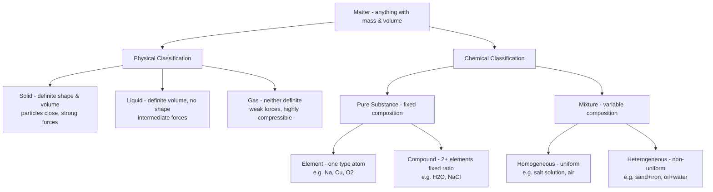
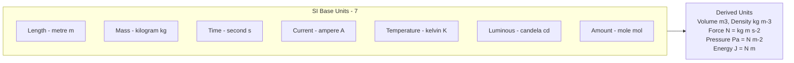
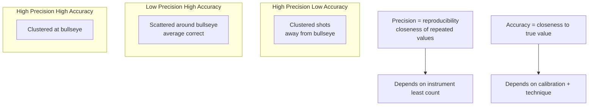
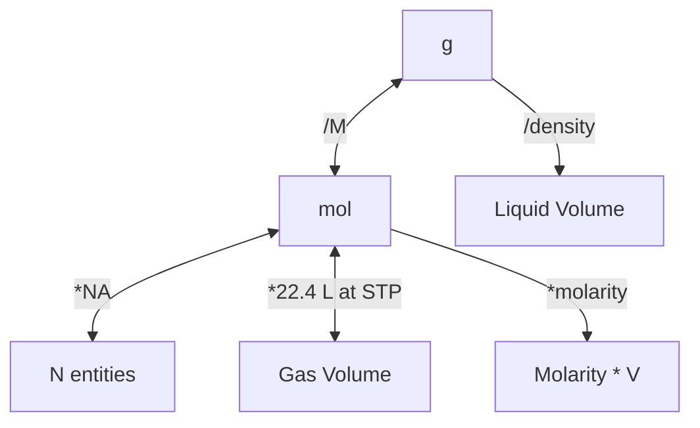
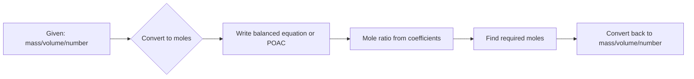
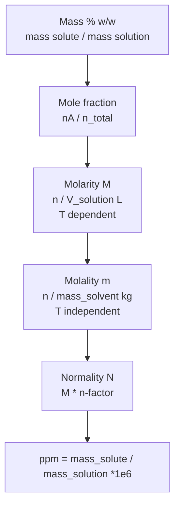

# Some Basic Concepts of Chemistry — JEE Main + Advanced Notes

> **Sources merged into these notes**
> | Source | File |
> |---|---|
> | NCERT Class XI Chemistry (rationalised, 2023+), Unit 1 | [`kech101.pdf`](kech101.pdf) |
> | Allen module for this chapter | _not uploaded yet — drop it in this folder to enable 🅰 tags_ |
>
> NCERT Unit 1 (1.1–1.10) = Matter classification + SI units + significant figures + laws of combination + Dalton + atomic/molecular mass + mole + % composition + empirical/molecular formula + stoichiometry + limiting reagent + concentration terms. This `notes.md` serves as **complete basics-to-Advanced** notes: every NCERT point is kept with its section number in brackets, and every JEE Advanced extension is marked 🆇. ⚠ = traps that decide marks.

## Contents

- [Part A — Matter, Properties, Units and Measurements](#part-a--matter-properties-units-and-measurements)
  1. [Importance of chemistry and nature of matter (1.1–1.3)](#1-importance-of-chemistry-and-nature-of-matter-11-13)
  2. [Properties of matter and measurement, SI base units (1.4–1.5)](#2-properties-of-matter-and-measurement-si-base-units-14-15)
  3. [Uncertainty, scientific notation, significant figures, precision vs accuracy (1.5)](#3-uncertainty-scientific-notation-significant-figures-precision-vs-accuracy-15)
  4. [Dimensional analysis and interconversion of units (1.5)](#4-dimensional-analysis-and-interconversion-of-units-15)
- [Part B — Laws of Chemical Combination and Dalton's Atomic Theory](#part-b--laws-of-chemical-combination-and-daltons-atomic-theory)
  5. [Law of conservation of mass and definite proportions (1.6.1–1.6.2)](#5-law-of-conservation-of-mass-and-definite-proportions-161-162)
  6. [Law of multiple proportions and Gay-Lussac's gaseous volumes (1.6.3–1.6.4)](#6-law-of-multiple-proportions-and-gay-lussacs-gaseous-volumes-163-164)
  7. [Avogadro's law and Dalton's atomic theory (1.6.5–1.7)](#7-avogadros-law-and-daltons-atomic-theory-165-17)
- [Part C — Atomic Mass, Molecular Mass, Mole Concept](#part-c--atomic-mass-molecular-mass-mole-concept)
  8. [Atomic mass, average atomic mass, isotopic abundance (1.7.1–1.7.2)](#8-atomic-mass-average-atomic-mass-isotopic-abundance-171-172)
  9. [Molecular mass and formula mass (1.7.3–1.7.4)](#9-molecular-mass-and-formula-mass-173-174)
  10. [Mole concept and molar masses — Avogadro constant (1.8)](#10-mole-concept-and-molar-masses--avogadro-constant-18)
  11. [Mole map and advanced mole calculations 🆇](#11-mole-map-and-advanced-mole-calculations-)
- [Part D — Percentage, Empirical Formula, Stoichiometry](#part-d--percentage-empirical-formula-stoichiometry)
  12. [Percentage composition (1.9)](#12-percentage-composition-19)
  13. [Empirical and molecular formula (1.9.1)](#13-empirical-and-molecular-formula-191)
  14. [Stoichiometry and balancing — the POAC principle (1.10)](#14-stoichiometry-and-balancing--the-poac-principle-110)
  15. [Limiting reagent and yield — purity, excess, sequential reactions (1.10.1)](#15-limiting-reagent-and-yield--purity-excess-sequential-reactions-1101)
  16. [Concentration terms in solutions — mass %, mole fraction, molarity, molality (1.10.2)](#16-concentration-terms-in-solutions--mass--mole-fraction-molarity-molality-1102)
  17. [Advanced concentration interconversions and density problems 🆇](#17-advanced-concentration-interconversions-and-density-problems-)
- [Part E — Advanced Corner, Patterns and Revision](#part-e--advanced-corner-patterns-and-revision)
  18. [Master formula bank (print this)](#18-master-formula-bank-print-this)
  19. [Worked problem patterns — JEE Advanced favourites](#19-worked-problem-patterns--jee-advanced-favourites)
  20. [The 20 traps examiners use](#20-the-20-traps-examiners-use)
  21. [Quick Revision Sheet](#21-quick-revision-sheet)

---

# Part A — Matter, Properties, Units and Measurements

## 1. Importance of chemistry and nature of matter (1.1–1.3)

Chemistry = study of preparation, properties, structure, reactions of material substances. NCERT opens with history: philosopher's stone (paras) converting base metals to gold, elixir of life for immortality — led to Alchemy and Iatrochemistry 1300–1600 CE, modern chemistry 18th century Europe. Indian contribution: Rasayan Shastra — Mohenjodaro/Harappa baked bricks, glazed pottery, gypsum cement containing lime + sand + traces of $\ce{CaCO3}$, faience glass, metallurgy Cu, Sn, As for hardness, Nagarjuna Rasratnakar mercury compounds, extraction of Au Ag Sn Cu, Chakrapani $\ce{HgS}$ and soap from mustard oil + alkalies.

Matter = anything that has mass and occupies space. Three physical states due to different particle arrangements.

| State | Shape | Volume | Compressibility | Density |
|---|---|---|---|---|
| Solid | definite | definite | negligible | high |
| Liquid | indefinite (takes vessel) | definite | small | intermediate |
| Gas | indefinite | indefinite | high | low |

Chemical classification:
- **Element**: simplest form, cannot be broken chemically. 118 known. Atoms or molecules ($\ce{O2}$, $\ce{P4}$, $\ce{S8}$).
- **Compound**: two or more elements in fixed mass ratio. Properties different from constituent elements. $\ce{H2O}$ 11.11% H, 88.89% O always.
- **Mixture**: variable composition, components retain properties, separable by physical methods.

Mixture vs compound test: mixture can have variable composition, no fixed melting point, components retain identity.

Physical vs chemical property: physical can be measured without changing composition (colour, mass, density, b.p.), chemical requires chemical change (acidity, combustibility).

## 2. Properties of matter and measurement, SI base units (1.4–1.5)

Measurement = comparison with standard. Two systems historically: English (FPS) and Metric (CGS, MKS). SI = International System of Units, 1960, 7 base units.

| Physical quantity | Symbol | SI unit | Definition |
|---|---|---|---|
| Length | $l$ | metre $m$ | distance light travels in 1/299792458 s |
| Mass | $m$ | kilogram $kg$ | Planck constant fixed $h=6.62607015e-34$ J s |
| Time | $t$ | second $s$ | 9192631770 periods of Cs-133 radiation |
| Temperature | $T$ | kelvin $K$ | triple point of water 273.16 K → Boltzmann constant |
| Amount | $n$ | mole $mol$ | $6.02214076e23$ entities |
| Current | $I$ | ampere $A$ | charge flow |
| Luminous intensity | $I_v$ | candela $cd$ | |

Derived: Volume $m^3$, $1 L = 1 dm^3 = 10^{-3} m^3 = 1000 mL$, $1 cm^3 = 1 mL$. Density $kg m^{-3}$ but common $g cm^{-3}$; $1 g cm^{-3} = 1000 kg m^{-3}$.

Prefixes (NCERT Table 1.1):

| Prefix | Symbol | Factor | Prefix | Symbol | Factor |
|---|---|---|---|---|---|
| yotta | Y | $10^{24}$ | deci | d | $10^{-1}$ |
| zetta | Z | $10^{21}$ | centi | c | $10^{-2}$ |
| exa | E | $10^{18}$ | milli | m | $10^{-3}$ |
| peta | P | $10^{15}$ | micro | $\mu$ | $10^{-6}$ |
| tera | T | $10^{12}$ | nano | n | $10^{-9}$ |
| giga | G | $10^{9}$ | pico | p | $10^{-12}$ |
| mega | M | $10^{6}$ | femto | f | $10^{-15}$ |
| kilo | k | $10^{3}$ | atto | a | $10^{-18}$ |

JEE asks: $1 \mathring{A} = 10^{-10} m = 10^{-8} cm = 100 pm$, $1 nm = 10^{-9} m = 10 \mathring{A}$.

## 3. Uncertainty, scientific notation, significant figures, precision vs accuracy (1.5)

Every measurement has uncertainty = least count. Scientific notation: $N \times 10^n$ where $1 \le N < 10$.

Rules for significant figures:

1. All non-zero digits significant.
2. Zeros between non-zero significant.
3. Leading zeros (0.0025) not significant.
4. Trailing zeros in decimal significant (500.0 = 4, 0.002500 = 4).
5. Trailing zeros in non-decimal ambiguous: $126000$ may be 3,4,5,6 — write as $1.26 \times 10^5$ (3), $1.260 \times 10^5$ (4).
6. Exact numbers infinite sig fig (2 atoms, 10 eggs).

Operations:
- Addition/subtraction: result has same decimal places as term with least decimal places. $12.11 + 18.0 + 1.012 = 31.1$ (18.0 has 1 decimal).
- Multiplication/division: result has same sig figs as term with least sig figs. $2.5 \times 1.25 = 3.1$ (2 sig figs).

Rounding:
- If last digit >5, increase preceding. 1.386 → 1.39 (3 sig figs).
- If <5, leave. 1.384 → 1.38.
- If =5, check: if preceding odd → increase, even → leave (even rule). 1.385 → 1.38 (3 becomes even), 1.375 → 1.38.

Precision vs accuracy (NCERT Fig 1.5):

- Precision = how close repeated measurements are to each other. High precision = low random error.
- Accuracy = how close to true value. High accuracy = low systematic error.

JEE trap ⚠: Good precision does not guarantee good accuracy (instrument may be mis-calibrated).

## 4. Dimensional analysis and interconversion of units (1.5)

Factor-label method: multiply by conversion factors = 1.

Example: $1 inch = 2.54 cm$, $1 L = 10^{-3} m^3$, $1 atm = 101325 Pa = 760 mmHg$.

Problem: Convert $5.0 g cm^{-3}$ to $kg m^{-3}$: $5.0 \frac{g}{cm^3} \times \frac{10^{-3} kg}{1 g} \times \frac{10^6 cm^3}{1 m^3} = 5000 kg m^{-3}$.

JEE Advanced uses dimensional consistency to check formulas: e.g., pressure $= force/area = (mass \times acceleration)/area = M L T^{-2} / L^2 = M L^{-1} T^{-2}$, same as energy density $J m^{-3}$.

---

# Part B — Laws of Chemical Combination and Dalton's Atomic Theory

## 5. Law of conservation of mass and definite proportions (1.6.1–1.6.2)

**Lavoisier 1789 — Law of conservation of mass**: In a chemical reaction, total mass of reactants = total mass of products. Atoms are neither created nor destroyed. Holds for chemical reactions, fails for nuclear reactions where mass converts to energy $E=mc^2$ (🆇).

Example: $\ce{CaCO3 -> CaO + CO2}$: 100 g $\ce{CaCO3}$ → 56 g CaO + 44 g $\ce{CO2}$ = 100 g.

**Proust 1799 — Law of definite proportions (constant composition)**: A given compound always contains same elements in same mass ratio, regardless of source or preparation.

$\ce{H2O}$: 2 g H + 16 g O → 18 g water; mass ratio H:O = 1:8 always. 11.11% H, 88.89% O. If sample shows different %, impure or different compound.

JEE uses this to check purity.

## 6. Law of multiple proportions and Gay-Lussac's gaseous volumes (1.6.3–1.6.4)

**Dalton 1803 — Law of multiple proportions**: When two elements form more than one compound, masses of one element combining with fixed mass of other are in ratio of small whole numbers.

Example: Carbon + oxygen → $\ce{CO}$ and $\ce{CO2}$. Fixed 12 g C combines with 16 g O in CO and 32 g O in $\ce{CO2}$. Ratio O masses = 16:32 = 1:2.

Other classic: $\ce{N2O}$, $\ce{NO}$, $\ce{N2O3}$, $\ce{NO2}$, $\ce{N2O5}$: with 28 g $\ce{N2}$, O masses = 16,32,48,64,80 → ratio 1:2:3:4:5.

**Gay-Lussac 1808 — Law of gaseous volumes**: When gases combine, they do so in volumes in simple ratio, measured at same T,P, and volume of products also in simple ratio if gaseous.

$\ce{H2(g) + Cl2(g) -> 2HCl(g)}$: 1 vol + 1 vol → 2 vols (ratio 1:1:2).

$\ce{2H2 + O2 -> 2H2O(g)}$: 2 vols + 1 vol → 2 vols.

Limitation: Not for solids/liquids.

This led to Avogadro.

## 7. Avogadro's law and Dalton's atomic theory (1.6.5–1.7)

**Avogadro 1811**: Equal volumes of gases at same T,P contain equal number of molecules (or moles). $V \propto n$ at fixed T,P.

At STP (0°C 1 atm) 1 mol any gas = 22.4 L (old), at SATP 1 bar 0°C? NCERT uses 22.7 L at 1 bar. JEE uses 22.4 L at STP unless stated. At 25°C 1 atm = 24.45 L, at 27°C = 24.6 L.

Consequence: Gay-Lussac's law explained because volume ratio = mole ratio.

$\ce{2H2 + O2 -> 2H2O}$: 2n + 1n → 2n, so 2V + 1V → 2V.

**Dalton's atomic theory (1808)** — 5 postulates:

1. Matter made of indivisible atoms.
2. Atoms of given element identical in mass and properties, different elements different.
3. Compounds formed when atoms combine in small whole number ratio.
4. Chemical reaction = rearrangement of atoms, atoms neither created nor destroyed.
5. Atoms of different elements combine to form compounds.

Limitations 🆇: Atoms divisible into subatomic (e-, p, n), isotopes (same element different mass) exist, isobars (different elements same mass), allotropes ($\ce{O2}$ vs $\ce{O3}$ same element different properties), complex organic needs large ratios, mass not conserved in nuclear.

Modern atomic theory retains rearrangement idea.

---

# Part C — Atomic Mass, Molecular Mass, Mole Concept

## 8. Atomic mass, average atomic mass, isotopic abundance (1.7.1–1.7.2)

Atomic mass unit: Earlier $1/16$ of $^{16}O$, now $1/12$ of $^{12}C$ = 1 u = 1 Da = $1.66053906660 \times 10^{-27} kg$.

$^{12}C$ assigned exactly 12 u. $1 u = 931.5 MeV/c^2$.

Average atomic mass = weighted average of isotopes: $A_{avg} = \sum (fraction_i \times mass_i)$.

Example: Chlorine: $^{35}Cl$ 75.77% mass 34.9689, $^{37}Cl$ 24.23% mass 36.9659 → $0.7577 \times 34.9689 + 0.2423 \times 36.9659 = 35.45 u$.

Natural argon: $^{36}Ar$ 0.337% 35.96755, $^{38}Ar$ 0.063% 37.96272, $^{40}Ar$ 99.600% 39.9624 → $0.00337\times35.96755 + 0.00063\times37.96272 + 0.996\times39.9624 = 39.948$.

Gram atomic mass = atomic mass in grams = 1 mol atoms.

## 9. Molecular mass and formula mass (1.7.3–1.7.4)

Molecular mass = sum of atomic masses in molecule.

$\ce{C6H12O6}$: $6\times12.011 + 12\times1.008 + 6\times16.00 = 72.066 + 12.096 + 96.00 = 180.162 u$.

Formula mass for ionic compounds (no discrete molecules): e.g., $\ce{NaCl}$ = 23.0 + 35.5 = 58.5 u. Used instead of molecular mass because lattice not molecule.

Gram molecular mass = molecular mass in grams = 1 mol molecules.

## 10. Mole concept and molar masses — Avogadro constant (1.8)

Mole = SI base unit for amount. Definition (2019): 1 mol contains exactly $6.02214076 \times 10^{23}$ elementary entities. This is Avogadro constant $N_A$.

$N_A = 6.022 \times 10^{23} mol^{-1}$.

1 mol H atoms = $6.022e23$ atoms, mass 1.008 g.
1 mol $\ce{H2O}$ molecules = $6.022e23$ molecules, mass 18.02 g.
1 mol $\ce{NaCl}$ formula units = $6.022e23$ units, mass 58.5 g.

Molar mass = mass of 1 mol substance in g/mol, numerically equal to atomic/molecular/formula mass in u.

Relation: $mass = moles \times molar\ mass$, $moles = \frac{mass}{M} = \frac{N}{N_A} = \frac{V}{22.4 L}$ (STP gas).

Important: $1 u = 1.6605e-24 g$, $N_A \times 1 u = 1 g$.

Molar volume at STP: $22.4 L$ at 1 atm 0°C, $22.7 L$ at 1 bar 0°C (NCERT uses 22.7). At $25°C$ 1 atm $24.45 L$.

## 11. Mole map and advanced mole calculations 🆇

Advanced mole toolkit beyond NCERT:

**Mole of atoms vs molecules**: 1 mol $\ce{O2}$ contains 2 mol O atoms, 1 mol $\ce{O3}$ contains 3 mol O atoms.

**Number of atoms**: For $\ce{CaCO3}$: 1 mol contains 1 mol Ca + 1 mol C + 3 mol O = 5 mol atoms = $5 N_A$ atoms.

**POAC (Principle of Atom Conservation)**: Atoms conserved, so moles of element in reactants = moles in products. Useful for complex reactions without balancing.

Example: $x$ mol $\ce{CaCO3}$ → $y$ mol $\ce{CaO}$: Ca atoms conserved → $x = y$.

**Equivalent concept for mole problems**: For mixture, use total mass equation + mole balance.

**Tricks**:

- $1 g$ $\ce{H}$ = 1 mol H atoms, but $1 g$ $\ce{H2}$ = 0.5 mol $\ce{H2}$.
- Vapour density = $M/2$ (relative to $\ce{H2}$). So $M = 2 \times VD$.
- $D$-relative to air: $M = 29 \times D_{air}$.
- For eudiometry: gas mixture combustion uses volume ratios.

⚠ Trap: STP vs SATP, use correct volume. JEE 2020+ often uses $22.7 L$ at 1 bar. Read question.

---

# Part D — Percentage, Empirical Formula, Stoichiometry

## 12. Percentage composition (1.9)

Mass % of element = $\frac{mass\ of\ element\ in\ 1\ mol\ compound}{molar\ mass\ of\ compound} \times 100$.

Example: $\ce{H2O}$: $M=18.02$, H mass = $2.016$, %H = $2.016/18.02 \times 100 = 11.18%$, %O = $16/18.02 \times 100 = 88.79%$.

Ethanol $\ce{C2H5OH}$: $M=46.068$, C $24.02$ → $52.14%$, H $6.048$ → $13.13%$, O $16$ → $34.73%$.

JEE uses % to find purity: e.g., limestone sample 80% $\ce{CaCO3}$ → 100 g sample contains 80 g $\ce{CaCO3}$.

## 13. Empirical and molecular formula (1.9.1)

- **Empirical formula**: simplest whole number ratio of atoms. $\ce{C6H12O6}$ → $\ce{CH2O}$.
- **Molecular formula**: actual number. Molecular formula = $n \times$ empirical formula, where $n = \frac{Molecular\ mass}{Empirical\ formula\ mass}$.

Steps:

1. Take 100 g sample → % becomes grams.
2. Convert grams to moles: $moles = mass / atomic\ mass$.
3. Divide by smallest mole value → ratio.
4. If not whole, multiply by suitable integer (2,3,4) to make whole.
5. Write empirical formula.
6. Find empirical formula mass, divide molecular mass by it → $n$, multiply.

Example: 4.07% H, 24.27% C, 71.65% Cl, $M=98.96 g$.

100 g → 4.07 g H = $4.07/1.008=4.04$ mol, 24.27 g C = $24.27/12.01=2.021$ mol, 71.65 g Cl = $71.65/35.453=2.021$ mol. Divide by 2.021 → H 2, C1, Cl1 → $\ce{CH2Cl}$ empirical mass = $12.01+2.016+35.453=49.48$, $n=98.96/49.48=2$ → $\ce{C2H4Cl2}$.

⚠ Trap: For hydrates, water counted separately: $\ce{CuSO4.5H2O}$.

## 14. Stoichiometry and balancing — the POAC principle (1.10)

Stoichiometry = Greek stoicheion (element) + metron (measure) = calculation of masses/volumes of reactants/products.

Balanced equation gives mole ratio. Example: $\ce{CH4 + 2O2 -> CO2 + 2H2O}$.

- 1 mol $\ce{CH4}$ reacts with 2 mol $\ce{O2}$ → 1 mol $\ce{CO2}$ + 2 mol $\ce{H2O}$.
- 1 molecule $\ce{CH4}$ + 2 molecules $\ce{O2}$ → etc.
- $16 g$ $\ce{CH4}$ + $64 g$ $\ce{O2}$ → $44 g$ $\ce{CO2}$ + $36 g$ $\ce{H2O}$.
- $22.7 L$ $\ce{CH4}$ + $45.4 L$ $\ce{O2}$ → $22.7 L$ $\ce{CO2}$ + $45.4 L$ $\ce{H2O}$ (same T,P).

Balancing method: trial and error, start with most complex, balance C, then H, then O, then others, finally check. Cannot change subscripts.

Example: $\ce{C3H8 + 5O2 -> 3CO2 + 4H2O}$.

**POAC** 🆇: For element, moles in reactants = moles in products. For $\ce{C}$: moles C in fuel = moles $\ce{CO2}$ produced. For $\ce{H}$: moles H atoms in fuel = $2 \times$ moles $\ce{H2O}$.

This avoids balancing for many problems.

## 15. Limiting reagent and yield — purity, excess, sequential reactions (1.10.1)

When reactants not in stoichiometric ratio, one gets consumed first → limiting reagent (LR) limits product.

Steps:

1. Convert given masses to moles.
2. Divide moles by coefficient in balanced equation → smaller value = LR.
3. Product moles calculated from LR only.
4. Excess reagent leftover = initial - consumed.

Example: 50 kg $\ce{N2}$ + 10 kg $\ce{H2}$ → $\ce{NH3}$. $\ce{N2 + 3H2 -> 2NH3}$.

Moles $\ce{N2}$ = $50000/28 = 1785.7$ mol? Wait 50 kg = 50000 g → $50000/28=1785.7$ mol? Actually NCERT uses $17.86 \times 10^2$ mol for 50 kg? Let's recalc: 50 kg = 50000 g, /28 = 1785.7 mol = $17.86 \times 10^2$. $\ce{H2}$ 10 kg = 10000 g /2 = 5000 mol = $4.96 \times 10^3$ mol.

Required $\ce{H2}$ for $\ce{N2}$: $1785.7 \times 3 = 5357$ mol > 5000 available → $\ce{H2}$ LR.

$\ce{NH3}$ formed = $2/3 \times 5000 = 3333$ mol = $56.1 kg$.

**Yield** 🆇:

- Theoretical yield = calculated from LR.
- Actual yield = experimental.
- % yield = $\frac{actual}{theoretical} \times 100$.
- % purity = $\frac{mass\ pure}{mass\ impure} \times 100$.
- Sequential reactions: product of one becomes reactant of next → multiply yields or use POAC across steps.

Example: $\ce{CaCO3 -> CaO -> Ca(OH)2}$: 100 g $\ce{CaCO3}$ 80% pure, yield 90% each step.

## 16. Concentration terms in solutions — mass %, mole fraction, molarity, molality (1.10.2)

Four main (NCERT):

**1. Mass percent (w/w %)**: $\frac{mass\ solute}{mass\ solution} \times 100$.

Example: 2 g solute + 18 g water = 20 g solution → $10%$ w/w.

**2. Mole fraction ($\chi$)**: $\chi_A = \frac{n_A}{n_A + n_B + ...}$, $\sum \chi =1$. Dimensionless, temperature independent.

For binary: $\chi_A = \frac{n_A}{n_A + n_B}$.

**3. Molarity (M)**: moles solute per litre solution. $M = \frac{n_{solute}}{V_{solution\ in\ L}}$. Unit mol $L^{-1}$ or $M$. Temperature dependent (volume changes).

Preparation: $M_1 V_1 = M_2 V_2$ for dilution (moles conserved).

Example: 4 g NaOH in 250 mL: $n=4/40=0.1$ mol, $V=0.25 L$ → $M=0.1/0.25=0.4 M$.

**4. Molality (m)**: moles solute per kg solvent. $m = \frac{n_{solute}}{mass_{solvent\ in\ kg}}$. Temperature independent.

Example: 3 M NaCl density 1.25 $g mL^{-1}$: 1 L solution mass = $1250 g$, NaCl mass = $3 \times 58.5=175.5 g$, water = $1074.5 g$ = $1.0745 kg$, molality = $3/1.0745=2.79 m$.

Other terms 🆇:

- **Mass by volume (w/v %)**: $g$ solute per $100 mL$ solution.
- **ppm**: $mg$ solute per $kg$ solution = $10^6$ factor. For dilute aqueous, $1 ppm \approx 1 mg/L$.
- **Normality (N)**: equivalents per litre. $N = M \times n-factor$. $n-factor$ = acidity/basicity for acid/base, change in oxidation number for redox, charge for salt.
- **Formality**: for ionic compounds.
- **g/L**: mass per litre.

### Equivalent weight and normality 🆇

**Equivalent weight** $E = \frac{Molar\ mass}{n-factor}$.

- For acids: $n$-factor = basicity = number of replaceable $H^+$: $\ce{HCl}$ $1$, $\ce{H2SO4}$ $2$, $\ce{H3PO4}$ $3$.
- For bases: $n$-factor = acidity = number of $OH^-$: $\ce{NaOH}$ $1$, $\ce{Ca(OH)2}$ $2$.
- For salts: $n$-factor = total charge of cation or anion: $\ce{Na2CO3}$ $2$ ($2Na^+$), $\ce{Al2(SO4)3}$ $6$.
- For redox: $n$-factor = change in oxidation number per formula unit: $\ce{KMnO4}$ in acidic $Mn^{+7}→Mn^{+2}$ $n=5$, in neutral $Mn^{+7}→Mn^{+4}$ $n=3$, in alkaline $Mn^{+7}→Mn^{+6}$ $n=1$; $\ce{K2Cr2O7}$ $Cr^{+6}→Cr^{+3}$ $n=6$ per $\ce{K2Cr2O7}$ (2 Cr each 3 e-).
- For $\ce{H2O2}$ as oxidising $n=2$, as reducing $n=2$.

**Normality** $N = \frac{Number\ of\ equivalents}{Volume\ in\ L} = M × n-factor$.

$N_1 V_1 = N_2 V_2$ for titration (equivalents conserved).

Example: $0.1 M \ce{H2SO4}$ → $N = 0.1×2=0.2 N$, $0.1 M \ce{KMnO4}$ acidic → $N=0.5 N$.

## 17. Advanced concentration interconversions and density problems 🆇

Key formulas for JEE Advanced:

Let $d$ = density $g mL^{-1}$, $M$ = molarity, $m$ = molality, $M_2$ = molar mass solute, $\chi_2$ = mole fraction solute, $w$ = mass %.

- $m = \frac{1000 M}{1000 d - M M_2}$ (M to m).
- $M = \frac{1000 d m}{1000 + m M_2}$ (m to M).
- $\chi_2 = \frac{M M_1}{1000 d}$ approximately? Better: For binary water: $\chi_2 = \frac{m M_1}{1000 + m M_1}$ where $M_1$ = molar mass solvent (18 for water).
- Mass % $w = \frac{M M_2}{10 d}$? Actually $w = \frac{M \times M_2}{10 d}$ gives %? Check: $M$ mol/L, mass solute per L = $M M_2$, mass solution per L = $1000 d$, so $w = \frac{M M_2}{1000 d} \times 100 = \frac{M M_2}{10 d}$.

Example: 69% $\ce{HNO3}$ density 1.41 $g mL^{-1}$ → Molarity: 100 g solution contains 69 g $\ce{HNO3}$ = $69/63=1.095$ mol, volume = $100/1.41=70.92 mL$ = $0.07092 L$, $M=1.095/0.07092=15.44 M$.

Dilution law: $M_1 V_1 = M_2 V_2$ only if solute conserved, no reaction, volumes additive? Actually exact, but for mixing: $M_{mix} = \frac{M_1 V_1 + M_2 V_2}{V_1+V_2}$.

Mixing two solutions same solute: $M_{final} = \frac{M_1 V_1 + M_2 V_2}{V_1+V_2}$.

**Density trap**: Molarity changes with temperature because volume changes, molality does not. So for precise work, molality used.

**ppm to molality**: $15 ppm$ $\ce{CHCl3}$ by mass = $15 g$ per $10^6 g$ water = $15 mg$ per $kg$? Actually $15 ppm = 15 \times 10^{-6}$ mass fraction. Molality = $\frac{15e-3 g /119.38}{1 kg} = 1.26e-4 m$.

---

# Part E — Advanced Corner, Patterns and Revision

### Oleum labelling and ppb/ppt 🆇

**Oleum** = $\ce{H2SO4 + x SO3}$ = $\ce{H2S2O7}$ (pyrosulphuric) + excess $\ce{SO3}$. Labelled as % oleum = % free $\ce{SO3}$ in oleum.

- $100\%$ oleum = $104.5\%$ $\ce{H2SO4}$ equivalent? Actually 100 g oleum contains $x$ g free $\ce{SO3}$ + $(100-x)$ g $\ce{H2SO4}$.
- On adding water: $\ce{SO3 + H2O -> H2SO4}$, free $\ce{SO3}$ converts to $\ce{H2SO4}$.
- Total $\ce{H2SO4}$ after dilution: mass = $(100-x) + x * (98/80)$ because 80 g $\ce{SO3}$ → 98 g $\ce{H2SO4}$.
- % $\ce{H2SO4}$ strength = $\%~\ce{H2SO4} = (100-x) + 98x/80 = 100 + 18x/80$ over 100 g → e.g., $20\%$ oleum (20 g free $\ce{SO3}$) → $100 + 18*20/80 = 104.5\%$ $\ce{H2SO4}$ equivalent.

Formula: If oleum is $y\%$ free $\ce{SO3}$, total $\ce{H2SO4}$ obtained from 100 g oleum on complete hydrolysis = $100 + \frac{18y}{80}$ g.

**Example JEE Advanced**: 20% oleum, 100 g → free $\ce{SO3}$ = 20 g = 0.25 mol, gives 0.25 mol $\ce{H2SO4}$ = 24.5 g, plus 80 g existing → 104.5 g $\ce{H2SO4}$.

**ppb / ppt**: $\text{ppb} = \frac{\text{mass solute}}{\text{mass solution}} \times 10^9$, $\text{ppt} = \times 10^{12}$. For dilute aqueous, $1~\text{ppb} \approx 1~\mu g/L$. Used for trace impurities, water hardness trace metals.

**Water hardness**: Temporary hardness $\ce{Ca(HCO3)2}$, $\ce{Mg(HCO3)2}$ removed by boiling $\ce{Ca(HCO3)2 -> CaCO3↓ + CO2 + H2O}$, permanent hardness $\ce{CaCl2}$, $\ce{CaSO4}$, $\ce{MgCl2}$, $\ce{MgSO4}$ removed by Clark's method $\ce{Ca(OH)2}$ or zeolite. Hardness expressed as ppm $\ce{CaCO3}$ equivalent: $\text{ppm CaCO3} = \frac{\text{mass hardness salt} \times 100}{\text{molar mass salt}} \times \frac{1000}{\text{L solution}}$.

## 18. Master formula bank (print this)

**Mole conversions**:
- $n = \frac{m}{M} = \frac{N}{N_A} = \frac{V_{gas\ at\ STP}}{22.4 L} = \frac{V_{gas\ at\ 1\ bar\ 0C}}{22.7 L}$
- $M = 2 \times VD_{H2}$, $M = 29 \times D_{air}$
- Number of atoms in $x$ mol compound = $x \times$ atoms per formula $\times N_A$

**Average atomic mass**: $\bar{A} = \sum f_i A_i$, $f_i$ = fractional abundance

**% composition**: $\%E = \frac{n_E \times A_E}{M_{compound}} \times 100$

**Empirical formula**: 100 g basis → moles → divide by smallest → integerize

**Stoichiometry**: Use balanced coefficients as mole ratio. $ \frac{n_A}{\nu_A} = \frac{n_B}{\nu_B}$ at LR.

**POAC**: moles of element conserved.

**Limiting reagent**: Calculate $\frac{n_i}{\nu_i}$, smallest = LR.

**Yield**: $\% yield = \frac{actual}{theoretical} \times 100$, $\% purity = \frac{pure}{impure} \times 100$

**Concentration**:
- Mass % = $\frac{m_{solute}}{m_{solution}} \times 100$
- Mole fraction $\chi_A = \frac{n_A}{\sum n}$
- Molarity $M = \frac{n_{solute}}{V_{solution} L}$
- Molality $m = \frac{n_{solute}}{mass_{solvent} kg}$
- Normality $N = M \times n_f$, $n_f$ = basicity/acidity/ change in $e^-$
- $M_1 V_1 = M_2 V_2$ (dilution)
- $m = \frac{1000 M}{1000 d - M M_2}$
- $w\% = \frac{M M_2}{10 d}$

**Significant figures**: Addition → least decimal places, Multiplication → least sig figs.

## 19. Worked problem patterns — JEE Advanced favourites

**Pattern 1 — POAC without balancing**:
Combustion of hydrocarbon $\ce{CxHy}$ gives $\ce{CO2}$ and $\ce{H2O}$. Find x,y from masses.
Given $3.38 g$ $\ce{CO2}$ → $3.38/44=0.0768$ mol C, $0.690 g$ $\ce{H2O}$ → $0.690/18=0.0383$ mol $\ce{H2O}$ → $0.0766$ mol H atoms. Ratio C:H = 1:1 → empirical $\ce{CH}$. Vapour density gives $M=26$ → $\ce{C2H2}$.

**Pattern 2 — Mixture analysis**:
Mixture $\ce{Na2CO3 + NaHCO3}$ heated, weight loss due to $\ce{CO2}$ + $\ce{H2O}$. Use two equations: total mass + loss.

**Pattern 3 — Limiting reagent with % purity**:
$\ce{CaCO3 + 2HCl -> CaCl2 + CO2 + H2O}$. 25 mL 0.75 M HCl → $0.025 \times 0.75=0.01875$ mol HCl → needs $0.009375$ mol $\ce{CaCO3}$ → $0.9375 g$.

**Pattern 4 — Sequential yield**:
$\ce{2Al + 3Cl2 -> 2AlCl3}$. If Al 80% pure, yield 75%, find actual product.

**Pattern 5 — Molarity from density**:
Density 1.25 $g mL^{-1}$, 3 M NaCl → molality 2.79 m (solved earlier).

**Pattern 6 — Mole fraction to molarity**:
$\chi_{ethanol}=0.040$ in water, density water 1 $g mL^{-1}$ → Assume 1 mol total: $0.04$ mol ethanol $=1.84 g$, $0.96$ mol water $=17.28 g$, total mass $19.12 g$, volume ~$19.12 mL$ (density ~1) → $M=0.04/0.01912=2.09 M$.

**Pattern 7 — Significant figures in calculation**:
$0.02856 \times 298.15 \times 0.112 / 0.5785$ → least sig figs = 3 (0.112) → answer 3 sig figs = $1.65$.

## 20. The 20 traps examiners use

1. STP 22.4 L vs 22.7 L at 1 bar — read question.
2. Atomicity: $\ce{O2}$ vs O, $\ce{P4}$, $\ce{S8}$.
3. Formula mass vs molecular mass for ionic compounds.
4. Leading zeros not significant, trailing zeros ambiguous.
5. Precision ≠ accuracy.
6. Conservation of mass fails in nuclear, not chemical.
7. Definite proportions fails for non-stoichiometric compounds ($\ce{Fe_{0.93}O}$).
8. $\ce{NH4Cl}$ sublimation actually dissociation.
9. Mole of atoms vs molecules: 1 mol $\ce{H2O}$ has 2 mol H atoms.
10. Limiting reagent must be found via $n/\nu$, not just smallest $n$.
11. Molarity T-dependent, molality not.
12. $M_1 V_1 = M_2 V_2$ only for dilution, not for reaction where moles change.
13. ppm = $mg/kg$, not $g/L$ unless water density 1.
14. Empirical formula multiplication: if ratio 1.33 → multiply by 3, 1.5 → ×2, 1.25 → ×4.
15. Average atomic mass uses fractional abundance, not %.
16. Vapour density = $M/2$ only relative to $\ce{H2}$, not air.
17. Balancing: cannot change subscripts, only coefficients.
18. Yield and purity both reduce product.
19. Significant figures in addition vs multiplication different rules.
20. POAC requires element conservation, not molecule.

## 21. Quick Revision Sheet

**Matter**: Element one type, compound fixed ratio, mixture variable. Homogeneous uniform, heterogeneous non-uniform.

**SI**: 7 base: m kg s A K mol cd. Prefixes: $10^{24}$ Y to $10^{-18}$ a. $1 \mathring{A}=10^{-10} m$, $1 L=1 dm^3$.

**Significant figures**: Non-zero + zeros between + trailing decimal significant. Addition → least decimal, multiplication → least sig figs. Even rule for 5.

**Precision** = reproducibility (random error), **Accuracy** = closeness to true (systematic).

**Laws**: Conservation mass (Lavoisier) mass reactants = products. Definite proportions (Proust) same compound same ratio. Multiple proportions (Dalton) ratio small whole numbers. Gay-Lussac gaseous volumes simple ratio same T,P. Avogadro equal volumes equal moles.

**Dalton**: Matter atoms, same element same mass, compounds small whole number ratio, reaction rearrangement. Limitations: subatomic, isotopes, isobars, allotropes.

**Atomic mass**: $1 u = 1/12 ^{12}C = 1.6605e-27 kg$. Average = $\sum f_i A_i$.

**Mole**: $6.02214076e23$ entities. $n=m/M=N/N_A=V/22.4$.

**Mole map**: mass ↔ moles ↔ number ↔ gas volume.

**% composition**: $(mass\ element / M) \times 100$.

**Empirical**: 100 g → moles → divide by smallest → integerize. Molecular = $n \times$ empirical, $n=M_{mol}/M_{emp}$.

**Stoichiometry**: Coefficients = mole ratio. POAC: element moles conserved.

**Limiting reagent**: $\frac{n}{\nu}$ smallest = LR. Product from LR. % yield = actual/theoretical ×100.

**Concentration**: w/w % = $m_{solute}/m_{solution} \times 100$, $\chi_A=n_A/\sum n$, $M=n/V_L$, $m=n/mass_{solvent} kg$, $N=M \times n_f$, $M_1 V_1 = M_2 V_2$, $m = 1000M/(1000d - M M_2)$, $w\% = M M_2/(10 d)$.

**JEE Advanced extra**: POAC, mixture analysis, sequential yield, eudiometry, vapour density $M=2VD$, significant figure traps.

---
*Cross-links:* 
- Next: [Structure of Atom](../02-Structure-of-Atom/notes.md) — atomic structure builds on mole and atomic mass.
- Previous: None (first chapter).
- Related: [Equilibrium](../04-Equilibrium/notes.md) — uses mole and concentration; [Thermodynamics](../03-Thermodynamics/notes.md) — uses $n$; [Solutions](../07-Solutions/notes.md) — concentration terms revisited.
- Practical: [Salt Analysis](../../Practical-Chemistry/Salt-Analysis/notes.md) — uses stoichiometry and limiting reagent in qualitative analysis.
