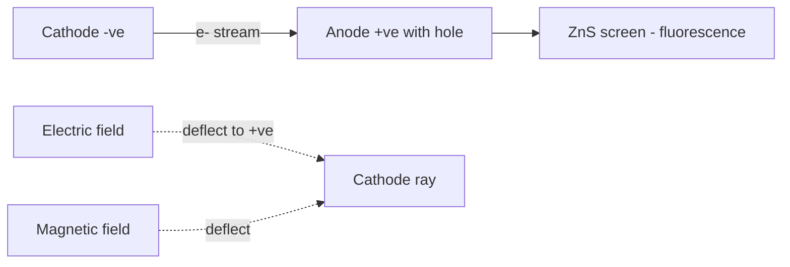
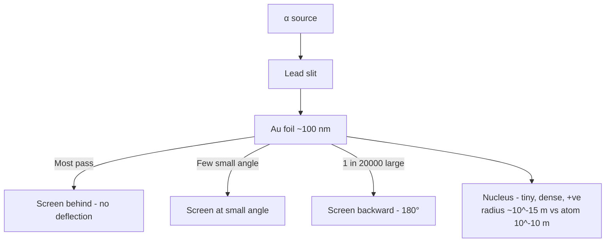
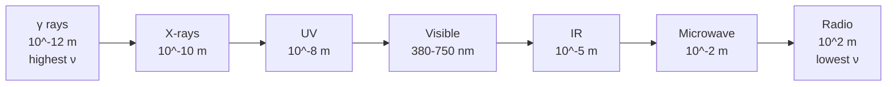
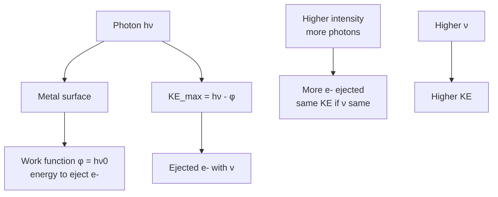
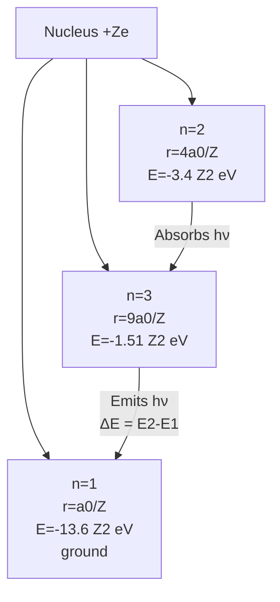
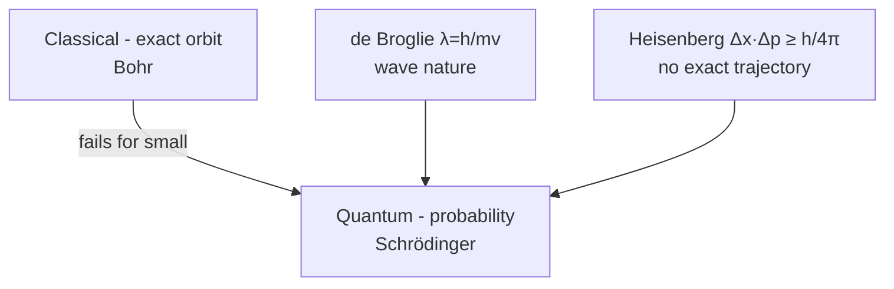
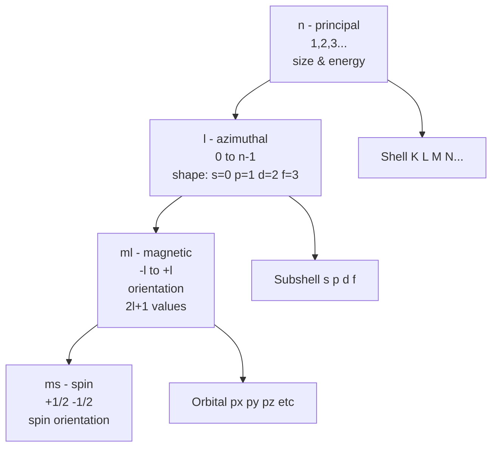
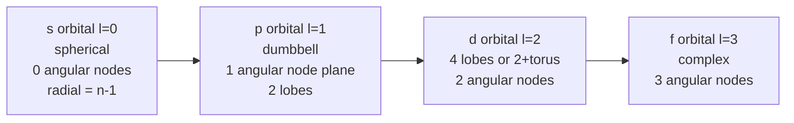

# Structure of Atom — JEE Main + Advanced Notes

> **Sources merged into these notes**
> | Source | File |
> |---|---|
> | NCERT Class XI Chemistry (rationalised, 2023+), Unit 2 | [`kech102.pdf`](kech102.pdf) |
> | Allen module for this chapter | _not uploaded yet — drop it in this folder to enable 🅰 tags_ |
>
> NCERT Unit 2 (2.1–2.6) = Discovery of subatomic particles + Thomson/Rutherford/Bohr models + EM radiation + Planck + photoelectric + atomic spectra + de Broglie + Heisenberg + quantum mechanical model + quantum numbers + orbital shapes + Aufbau/Pauli/Hund + electronic configuration. This notes.md is **complete basics-to-Advanced**: every NCERT point kept with § numbers, and every JEE Advanced extension marked 🆇. ⚠ = traps.

## Contents

- [Part A — Subatomic Particles and Early Atomic Models](#part-a--subatomic-particles-and-early-atomic-models)
  1. [Discovery of electron, proton, neutron — cathode rays, canal rays, Chadwick (2.1)](#1-discovery-of-electron-proton-neutron--cathode-rays-canal-rays-chadwick-21)
  2. [Thomson model and Rutherford α-scattering — nuclear model (2.2)](#2-thomson-model-and-rutherford-α-scattering--nuclear-model-22)
  3. [Atomic number, mass number, isotopes, isobars, isotones (2.2)](#3-atomic-number-mass-number-isotopes-isobars-isotones-22)
- [Part B — Wave Nature, Quantum Theory and Atomic Spectra](#part-b--wave-nature-quantum-theory-and-atomic-spectra)
  4. [Electromagnetic radiation — wave parameters c = νλ (2.3.1)](#4-electromagnetic-radiation--wave-parameters-c--νλ-231)
  5. [Planck's quantum theory — E = hν and black body radiation (2.3.2)](#5-plancks-quantum-theory--e--hν-and-black-body-radiation-232)
  6. [Photoelectric effect — Einstein equation and work function (2.3.3)](#6-photoelectric-effect--einstein-equation-and-work-function-233)
  7. [Line spectra — hydrogen spectrum and Rydberg formula (2.3.4)](#7-line-spectra--hydrogen-spectrum-and-rydberg-formula-234)
  8. [Bohr's model for H-atom — postulates, radius, energy, velocity (2.4)](#8-bohrs-model-for-h-atom--postulates-radius-energy-velocity-24)
  9. [Bohr's explanation of H-spectrum and limitations (2.4.1–2.4.2)](#9-bohrs-explanation-of-h-spectrum-and-limitations-241-242)
- [Part C — Towards Quantum Mechanical Model](#part-c--towards-quantum-mechanical-model)
  10. [de Broglie relation — λ = h/mv and experimental verification (2.5)](#10-de-broglie-relation--λ--hmv-and-experimental-verification-25)
  11. [Heisenberg uncertainty principle — Δx·Δp ≥ h/4π (2.5)](#11-heisenberg-uncertainty-principle--δxδp--h4π-25)
  12. [Quantum mechanical model — Schrodinger equation, ψ and |ψ|² (2.6)](#12-quantum-mechanical-model--schrodinger-equation-ψ-and-ψ²-26)
  13. [Quantum numbers — n, l, m, s — meaning and allowed values (2.6.1)](#13-quantum-numbers--n-l-m-s--meaning-and-allowed-values-261)
  14. [Shapes of orbitals — s, p, d, f — radial and angular nodes (2.6.2)](#14-shapes-of-orbitals--s-p-d-f--radial-and-angular-nodes-262)
  15. [Energies of orbitals — (n+l) rule and stability (2.6.3)](#15-energies-of-orbitals--nl-rule-and-stability-263)
  16. [Rules for filling — Aufbau, Pauli, Hund — electronic configuration (2.6.4)](#16-rules-for-filling--aufbau-pauli-hund--electronic-configuration-264)
- [Part D — Advanced Corner, Patterns and Revision](#part-d--advanced-corner-patterns-and-revision)
  17. [Master formula bank — Bohr, Rydberg, de Broglie, Heisenberg, quantum numbers](#17-master-formula-bank--bohr-rydberg-de-broglie-heisenberg-quantum-numbers)
  18. [Worked problem patterns — JEE Advanced favourites](#18-worked-problem-patterns--jee-advanced-favourites)
  19. [The 20 traps examiners use](#19-the-20-traps-examiners-use)
  20. [Quick Revision Sheet](#20-quick-revision-sheet)

---

# Part A — Subatomic Particles and Early Atomic Models

## 1. Discovery of electron, proton, neutron — cathode rays, canal rays, Chadwick (2.1)

Dalton's atom indivisible failed to explain electrical charging by rubbing.

**Cathode rays — discovery of electron**:

Faraday 1830: electricity through electrolyte → chemical reactions at electrodes → particulate nature of electricity.

1850s: discharge tube — glass tube with two metal electrodes, evacuated to low pressure ~$10^{-4}$ atm, high voltage ~10000 V. Current flows as stream from cathode to anode → cathode rays. If anode perforated and behind coated with ZnS phosphor → bright spot where rays strike.

Properties:

- Travel in straight lines in absence of field (shadow of object).
- Not visible but cause fluorescence of ZnS, affect photographic plate, heat object.
- Deflected by electric field towards positive → negatively charged.
- Deflected by magnetic field → behaviour like negative charge.
- Characteristics independent of material of electrodes and gas → electrons are universal constituent.

**Charge to mass ratio — J.J. Thomson 1897**: Using perpendicular E and B fields. When only E → hit at A, only B → at C, balanced E+B → at B (straight). $e/m_e = 1.758820 \times 10^{11} C kg^{-1}$.

**Charge — Millikan oil drop 1906-14**: Oil droplets mist, charge by X-rays, fall under gravity vs electric field. Found $e = -1.602176 \times 10^{-19} C$. Mass $m_e = e / (e/m) = 9.1094 \times 10^{-31} kg$.

**Canal rays — discovery of proton**:

Modified cathode ray tube with perforated cathode, positive rays passing through canals towards cathode → anode rays or canal rays.

Properties:

- Mass depends on gas → positively charged gaseous ions.
- $e/m$ depends on gas.
- Some carry multiple fundamental charge units.
- Behaviour opposite to cathode rays in fields.
- Smallest and lightest from $\ce{H2}$ → proton, $e = +1.602e-19 C$, mass $1.6726e-27 kg \approx 1837 m_e$. Characterised 1919 by Rutherford.

**Neutron — Chadwick 1932**: Bombarding thin Be sheet by α-particles → electrically neutral particles mass slightly > proton emitted: $\ce{^9Be + ^4He -> ^12C + ^1n}$. Mass $1.6749e-27 kg$, charge 0.

| Particle | Symbol | Charge $C$ | Mass $kg$ | Mass $u$ | Discovered |
|---|---|---|---|---|---|
| Electron | $e^-$ | $-1.602e-19$ | $9.109e-31$ | 0.000548 | Thomson 1897 |
| Proton | $p^+$ | $+1.602e-19$ | $1.6726e-27$ | 1.00727 | Rutherford 1919 |
| Neutron | $n$ | 0 | $1.6749e-27$ | 1.00866 | Chadwick 1932 |

## 2. Thomson model and Rutherford α-scattering — nuclear model (2.2)

**Thomson plum pudding 1898**: Atom = sphere of positive charge radius ~$10^{-10} m$, electrons embedded like seeds in watermelon, to make atom neutral. Could explain neutrality but not scattering.

**Rutherford experiment 1911**: α-particles ($\ce{He^{2+}}$) from radioactive source, directed at thin gold foil ~100 nm (~400 atoms thick), surrounded by circular ZnS screen.

Observations:

- Most α passed undeflected → atom mostly empty space.
- Small fraction deflected by small angles.
- ~1 in 20000 deflected by >90°, some bounced back → positive charge and mass concentrated in tiny centre.

**Rutherford nuclear model**:

- Positive charge and most mass in nucleus, radius ~$10^{-15} m$ vs atom $10^{-10} m$ → volume ratio ~$10^{-15}$.
- Electrons revolve around nucleus in circular orbits, like solar system, electrostatic attraction balanced by centrifugal.
- Atom neutral: nuclear charge = electron charge.

Drawbacks:

- Cannot explain stability: revolving electron accelerates, should radiate EM energy continuously, spiral into nucleus in $10^{-8} s$ → atom collapses.
- Cannot explain line spectra, why only certain frequencies.

## 3. Atomic number, mass number, isotopes, isobars, isotones (2.2)

- **Atomic number $Z$** = number of protons in nucleus = number of electrons in neutral atom. Moseley showed $Z$ is fundamental. All atoms of same element same $Z$.

### Moseley's law 🆇 — $\sqrt{\nu} = a(Z-b)$

Henry Moseley 1913 studied characteristic X-ray spectra (Kα, Kβ) of elements bombarded by electrons. Found frequency $\nu$ of Kα X-ray ∝ $(Z-1)^2$.

**Moseley's law**: $\sqrt{\nu} = a(Z-b)$ where $a$ = proportionality constant (Rydberg-like), $b$ = screening constant (~1 for Kα, ~7.4 for Lα).

For Kα: $\nu = R_\infty c (Z-1)^2 (1/1^2 - 1/2^2) = \frac{3}{4} R_\infty c (Z-1)^2$ → $\sqrt{\nu} \propto (Z-1)$.

**Importance**: Established $Z$ (not atomic weight) as basis of periodic table, predicted missing elements (43,61,72,75). Used to determine $Z$ from X-ray frequency.

**JEE Advanced use**: Given $\nu_{K\alpha}$ for two elements, find $Z$ ratio: $\frac{\sqrt{\nu_1}}{\sqrt{\nu_2}} = \frac{Z_1-1}{Z_2-1}$.

**X-ray notation**: K series (n=2→1), L series (n=3→1,3→2), etc. $K_{\alpha}$ is $2→1$, $K_{\beta}$ $3→1$.

**Example**: $\nu_{K\alpha}$ for $Z=20$ is $3.0\times10^{18}$ Hz, find $Z$ for $\nu=6.8\times10^{18}$ Hz: $\sqrt{6.8/3.0} = (Z-1)/19$ → $Z≈30$.
- **Mass number $A$** = protons + neutrons = $Z + N$.
- Notation: $\ce{^A_Z X}$ e.g., $\ce{^12_6 C}$, often $\ce{^12C}$.

Isotopes: same $Z$, different $A$ (different $N$). e.g., $\ce{^1H}$ protium, $\ce{^2H}$ deuterium D, $\ce{^3H}$ tritium T; $\ce{^35Cl}$ and $\ce{^37Cl}$; $\ce{^12C}$ $\ce{^13C}$ $\ce{^14C}$. Same chemical properties (same $Z$) but different physical (mass). Average atomic mass uses isotopic abundance.

Isobars: same $A$, different $Z$ → different elements. e.g., $\ce{^40Ar}$, $\ce{^40K}$, $\ce{^40Ca}$ all $A=40$. Chemical properties different.

Isotones: same number of neutrons $N$. e.g., $\ce{^14C}$ ($N=8$) and $\ce{^16O}$ ($N=8$).

Isoelectronic: same number of electrons. e.g., $\ce{N^{3-}}$, $\ce{O^{2-}}$, $\ce{F-}$, $\ce{Na+}$, $\ce{Mg^{2+}}$, $\ce{Al^{3+}}$ all 10 e-.

Isodiaphers: same $N-Z$ (difference neutron-proton) or same isotopic number.

---

# Part B — Wave Nature, Quantum Theory and Atomic Spectra

## 4. Electromagnetic radiation — wave parameters c = νλ (2.3.1)

James Maxwell 1870: light = EM wave, oscillating electric and magnetic fields perpendicular, perpendicular to propagation.

Wave parameters:

- **Wavelength $\lambda$**: distance between two consecutive crests/troughs. Units $m$, $nm$ ($10^{-9}$), $\mathring{A}$ ($10^{-10}$).
- **Frequency $\nu$**: number of waves passing point per second. $Hz = s^{-1}$.
- **Velocity $c$**: $c = \nu \lambda$. In vacuum $c = 2.99792458 \times 10^8 m s^{-1} \approx 3.0e8$.
- **Wavenumber $\bar{\nu}$**: reciprocal of wavelength in $cm^{-1}$: $\bar{\nu} = 1/\lambda$ (in cm). Used in spectroscopy.
- **Amplitude**: height of crest.

Electromagnetic spectrum (increasing $\lambda$, decreasing $\nu$):

$\gamma$-rays < X-rays < UV < Visible (380-750 nm, VIBGYOR) < IR < Microwave < Radio.

Visible: Violet 380-450 nm, Blue 450-495, Green 495-570, Yellow 570-590, Orange 590-620, Red 620-750.

⚠ Trap: Energy ∝ $\nu$ ∝ $1/\lambda$ ∝ $\bar{\nu}$.

## 5. Planck's quantum theory — E = hν and black body radiation (2.3.2)

Black body = ideal body absorbs and emits all frequencies. When heated, emits radiation. At low T, mostly IR, at higher T, visible, at very high T, more blue. Classical wave theory predicted intensity → ∞ at short $\lambda$ (UV catastrophe), failed.

Planck 1900: Energy emitted or absorbed not continuous but in discrete packets called quanta. For light frequency $\nu$, quantum energy $E = h \nu$, where $h$ = Planck constant $6.62607015 \times 10^{-34} J s$.

For $n$ quanta: $E = n h \nu$, $n = 1,2,3...$ integer.

Smallest packet = photon (for light). Energy ∝ frequency.

$E = h \nu = h c / \lambda = h c \bar{\nu}$.

Example: Calculate energy of photon $\lambda=500 nm$: $E = hc/\lambda = (6.626e-34 \times 3e8)/5e-7 = 3.97e-19 J = 2.48 eV$.

## 6. Photoelectric effect — Einstein equation and work function (2.3.3)

Hertz 1887: When UV light strikes metal surface, electrons ejected — photoelectrons.

Observations (Lenard):

- Need minimum frequency $\nu_0$ threshold, below no emission, regardless of intensity.
- Number of photoelectrons ∝ intensity (at $\nu > \nu_0$).
- Kinetic energy of photoelectrons ∝ frequency, independent of intensity.
- No time lag.

Classical wave theory failed: wave energy ∝ intensity, should depend on intensity, not frequency, and should have time lag for weak intensity.

Einstein 1905 (Nobel 1921): Light behaves as particle — photon with energy $h\nu$. When photon hits electron, energy used: part to overcome attraction to metal (work function $\phi = h \nu_0$) + remaining as kinetic energy.

$h \nu = \phi + \frac{1}{2} m_e v^2 = h \nu_0 + KE_{max}$.

$KE_{max} = h(\nu - \nu_0) = h c (1/\lambda - 1/\lambda_0)$.

If $\nu < \nu_0$, $KE$ negative → no emission.

Threshold wavelength $\lambda_0 = hc / \phi$.

Graphs for JEE:

- $KE_{max}$ vs $\nu$: straight line slope $h$, intercept $-\phi$, x-intercept $\nu_0$.
- Photoelectric current vs intensity: linear through origin (at fixed $\nu > \nu_0$).
- Current vs stopping potential.

Work function values: e.g., Cs 1.9 eV, Na 2.3 eV, etc.

## 7. Line spectra — hydrogen spectrum and Rydberg formula (2.3.4)

White light through prism → continuous spectrum (rainbow). Gas in discharge tube at low pressure, high voltage → emits light, through prism → discrete lines → line emission spectrum. Absorption spectrum = continuous with dark lines where gas absorbs.

Hydrogen spectrum: several series:

- Lyman: UV, $n_1=1$, $n_2=2,3...$ 
- Balmer: Visible, $n_1=2$, $n_2=3,4...$ (first line $H_\alpha$ 656 nm red)
- Paschen: IR, $n_1=3$, $n_2=4,5...$
- Brackett: IR, $n_1=4$
- Pfund: IR, $n_1=5$

Rydberg formula (empirical 1890, later explained by Bohr):

$\bar{\nu} = R_H \left( \frac{1}{n_1^2} - \frac{1}{n_2^2} \right)$, $R_H = 109677 cm^{-1} = 1.09677 \times 10^7 m^{-1}$.

$\frac{1}{\lambda} = R_H Z^2 \left( \frac{1}{n_1^2} - \frac{1}{n_2^2} \right)$ for hydrogen-like species, $Z$ = atomic number.

For H, $Z=1$.

## 8. Bohr's model for H-atom — postulates, radius, energy, velocity (2.4)

Niels Bohr 1913, based on Planck quantization, explained H spectrum quantitatively. Postulates:

1. Electron moves around nucleus in circular orbits of fixed radius and energy — stationary states, allowed orbits, arranged concentrically.
2. Energy does not change with time in stationary state, but electron can jump from lower to higher by absorbing energy, or higher to lower by emitting energy. $\Delta E = E_2 - E_1 = h \nu$.
3. Frequency of radiation absorbed/emitted when transition between two states differing by $\Delta E$: $\nu = \Delta E / h$ — Bohr's frequency rule.
4. Angular momentum quantized: $m_e v r = n h / 2\pi$, $n=1,2,3...$ principal quantum number.

Derivations 🆇 for JEE Advanced:

Using Coulomb attraction = centripetal force: $\frac{Z e^2}{4 \pi \epsilon_0 r^2} = \frac{m_e v^2}{r}$ and $m_e v r = n h / 2\pi$.

Solving:

- Radius: $r_n = \frac{n^2 a_0}{Z}$, where $a_0 = \frac{\epsilon_0 h^2}{\pi m_e e^2} = 52.9 pm = 0.529 \mathring{A}$ Bohr radius (for H, $n=1$).
- Energy: $E_n = -\frac{R_H h c Z^2}{n^2} = -13.6 \frac{Z^2}{n^2} eV = -2.18 \times 10^{-18} \frac{Z^2}{n^2} J$.
- Velocity: $v_n = \frac{Z e^2}{2 \epsilon_0 h} \frac{1}{n} = 2.18 \times 10^6 \frac{Z}{n} m s^{-1}$ (for H, $n=1$, $v = c/137$).
- $r_n \propto n^2/Z$, $E_n \propto -Z^2/n^2$, $v_n \propto Z/n$.

Ground state H: $n=1$, $r=0.529 \mathring{A}$, $E=-13.6 eV$, most stable, most negative.

Ionization energy = energy needed to go from $n=1$ to $n=\infty$ ($E_\infty=0$): $IE = 13.6 Z^2 eV$.

Hydrogen-like ions: $\ce{He+}$ $Z=2$, $\ce{Li^{2+}}$ $Z=3$, $\ce{Be^{3+}}$ $Z=4$.

Negative sign meaning: energy of electron in atom lower than free electron at rest (zero at $n=\infty$). More negative = more stable, closer to nucleus.

## 9. Bohr's explanation of H-spectrum and limitations (2.4.1–2.4.2)

When electron jumps from higher $n_2$ to lower $n_1$, emits photon: $\Delta E = E_{n2} - E_{n1} = h \nu$.

Using $E_n = -R_H hc Z^2 / n^2$:

$\Delta E = R_H h c Z^2 \left( \frac{1}{n_1^2} - \frac{1}{n_2^2} \right) = h \nu$

$\nu = R_H c Z^2 \left( \frac{1}{n_1^2} - \frac{1}{n_2^2} \right) = 3.29 \times 10^{15} Z^2 \left( \frac{1}{n_1^2} - \frac{1}{n_2^2} \right) Hz$

$\bar{\nu} = R_H Z^2 \left( \frac{1}{n_1^2} - \frac{1}{n_2^2} \right)$ matches Rydberg empirical.

Series: $n_1$ fixed, $n_2$ variable > $n_1$.

- Lyman: $n_1=1$, UV, $n_2=2 \to \infty$, $\lambda$ 91.2 nm limit to 121.6 nm.
- Balmer: $n_1=2$, Visible, $H_\alpha$ $n=3\to2$ 656.3 nm red, $H_\beta$ $4\to2$ 486 nm, limit 364.6 nm.
- Paschen: $n_1=3$, IR, limit 1875 nm.

Intensity ∝ number of atoms undergoing same transition.

**Limitations of Bohr**:

- Failed for multi-electron atoms (He, etc.) — only works for single electron species.
- Could not explain Zeeman effect (splitting in magnetic field) and Stark effect (electric field).
- Could not explain fine structure (doublet) — need elliptical orbits and spin.
- Could not explain shape of molecules, formation of bonds.
- De Broglie and Heisenberg showed angular momentum quantization not fully correct, orbits not well-defined.

---

# Part C — Towards Quantum Mechanical Model

## 10. de Broglie relation — λ = h/mv and experimental verification (2.5)

de Broglie 1924: Matter has dual nature — particle and wave. If light can behave as particle, electron can behave as wave.

Wavelength associated with particle mass $m$, velocity $v$: $\lambda = \frac{h}{m v} = \frac{h}{p}$.

For electron: $\lambda = \frac{h}{m_e v}$.

If accelerated through potential $V$, $KE = eV = \frac{1}{2} m v^2$ → $v = \sqrt{2 e V / m}$ → $\lambda = \frac{h}{\sqrt{2 m e V}} = \frac{12.27}{\sqrt{V}} \mathring{A}$ (V in volts).

Example: Electron accelerated 100 V → $\lambda = 12.27/\sqrt{100}=1.227 \mathring{A}$ comparable to X-rays, can show diffraction.

Experimental verification: Davisson-Germer 1927 — electron beam on Ni crystal shows diffraction pattern like X-rays, confirming wave nature.

For macroscopic objects, $\lambda$ negligible (e.g., ball $100 g$, $10 m/s$ → $\lambda = 6.6e-34 m$).

Bohr's quantization can be derived from de Broglie: For circular orbit to be stationary, circumference must be integral multiple of wavelength: $2 \pi r = n \lambda = n h / m v$ → $m v r = n h / 2\pi$ — Bohr's postulate.

## 11. Heisenberg uncertainty principle — Δx·Δp ≥ h/4π (2.5)

Werner Heisenberg 1927: Impossible to measure simultaneously exact position and exact momentum of small particle like electron.

$\Delta x \cdot \Delta p_x \ge \frac{h}{4 \pi}$ or $\ge \frac{\hbar}{2}$ where $\hbar = h/2\pi$.

$\Delta x$ = uncertainty in position, $\Delta p$ = uncertainty in momentum.

Similarly $\Delta E \cdot \Delta t \ge h/4\pi$.

Implications:

- Bohr orbits with exact $r$ and $v$ not possible — electron cannot have defined trajectory.
- Need probabilistic model — quantum mechanics.
- For macroscopic, uncertainties negligible.

Example: If $\Delta x = 1 \mathring{A} = 1e-10 m$ for electron, $\Delta v \ge h/(4\pi m \Delta x) \approx 5.8e5 m/s$ — large.

## 12. Quantum mechanical model — Schrodinger equation, ψ and |ψ|² (2.6)

Erwin Schrödinger 1926: Based on wave-particle duality, proposed wave equation:

$\hat{H} \psi = E \psi$, where $\hat{H}$ = Hamiltonian operator (kinetic + potential), $\psi$ = wave function, $E$ = energy.

$\psi$ itself no physical meaning, but $|\psi|^2$ = probability density of finding electron at point in space.

Orbital = region in space where probability of finding electron is high (~90-95%).

Solutions for H-atom give quantized energies same as Bohr but with orbital shapes, not orbits.

Important: $\psi$ can be positive or negative (phase), $|\psi|^2$ always positive.

Radial probability distribution: $4\pi r^2 |\psi|^2$ vs $r$ gives probability of finding electron at distance $r$ regardless of direction. For 1s, max at $a_0$.

## 13. Quantum numbers — n, l, m, s — meaning and allowed values (2.6.1)

Four quantum numbers needed to describe electron in atom:

**1. Principal $n$**: $n = 1,2,3... \infty$. Determines size and energy of orbital. $n$ = shell. Energy $\propto -1/n^2$ for H, but for multi-electron, also depends on $l$. Larger $n$ → larger orbital, higher energy, farther from nucleus. Number of orbitals in shell = $n^2$.

**2. Azimuthal / angular momentum $l$**: $l = 0$ to $n-1$. Determines shape of orbital and subshell, also orbital angular momentum. $l=0$ s, $1$ p, $2$ d, $3$ f, $4$ g. Letter: s sharp, p principal, d diffuse, f fundamental (historical spectral lines). Energy for multi-electron depends on $n+l$. Number of subshells in shell = $n$.

**3. Magnetic $m_l$**: $m_l = -l$ to $+l$ including 0, total $2l+1$ values. Determines orientation of orbital in space under magnetic field. For s $l=0$, $m=0$ one orientation. p $l=1$, $m=-1,0,+1$ three orientations $p_x, p_y, p_z$. d $l=2$, five orientations, f seven.

**4. Spin $m_s$**: $m_s = +1/2$ or $-1/2$. Electron spin clockwise/anticlockwise, spin angular momentum $= \sqrt{s(s+1)} h/2\pi$, $s=1/2$. Two electrons in same orbital must have opposite spin (Pauli).

Allowed combinations:

- $n=1$: $l=0$, $m_l=0$ → 1s (1 orbital)
- $n=2$: $l=0$ → 2s ($m=0$), $l=1$ → 2p ($m=-1,0,1$) → total 1+3=4 orbitals = $n^2$
- $n=3$: 3s, 3p (3), 3d (5) → 9 orbitals
- $n=4$: 4s,4p,4d,4f → 16 orbitals

JEE trap ⚠: $l$ cannot be ≥ $n$. e.g., 1p, 2d, 3f not allowed.

## 14. Shapes of orbitals — s, p, d, f — radial and angular nodes (2.6.2)

**s-orbitals** ($l=0$): Spherical, non-directional, $m=0$ only. 1s,2s,3s... size increases. 1s has no radial node, 2s has 1 radial node (spherical shell where probability zero), 3s has 2 radial nodes. Radial nodes = $n-l-1$, angular nodes = $l$, total nodes = $n-1$.

**p-orbitals** ($l=1$): Dumbbell shape, two lobes with nodal plane at nucleus. Directional along axes: $p_x$, $p_y$, $p_z$. Each has 1 angular node (nodal plane). 2p has 0 radial nodes, 3p has 1 radial node.

**d-orbitals** ($l=2$): 5 types: $d_{xy}$, $d_{yz}$, $d_{xz}$, $d_{x^2-y^2}$, $d_{z^2}$. Four have 4 lobes with 2 nodal planes, $d_{z^2}$ has 2 lobes + torus. Each has 2 angular nodes.

**f-orbitals** ($l=3$): 7 types, complex shapes, 3 angular nodes.

**Nodes**:

- Radial node = spherical surface where $|\psi|^2=0$, occurs due to $n$.
- Angular node = plane or cone where $|\psi|^2=0$, occurs due to $l$.
- Total nodes = $n-1$ = radial + angular.
- Radial = $n-l-1$, Angular = $l$.

Examples:

- 1s: $n=1,l=0$ → radial 0, angular 0, total 0.
- 2s: $n=2,l=0$ → radial 1, angular 0, total 1.
- 2p: $n=2,l=1$ → radial 0, angular 1, total 1.
- 3d: $n=3,l=2$ → radial 0, angular 2, total 2.
- 4f: $n=4,l=3$ → radial 0, angular 3, total 3.
- 4d: $n=4,l=2$ → radial 1, angular 2, total 3.

**Radial probability**: For 1s, maximum at $a_0$. For 2s, two maxima with node between. For 2p, one maximum farther than 1s.

## 15. Energies of orbitals — (n+l) rule and stability (2.6.3)

For H-atom (single electron): Energy depends only on $n$: $E_n = -13.6/n^2 eV$. So 2s = 2p, 3s=3p=3d.

For multi-electron atoms: Energy depends on $n$ and $l$ due to shielding and penetration. Lower $(n+l)$ → lower energy. If same $(n+l)$, lower $n$ → lower energy. This is $(n+l)$ rule or Aufbau order.

Order: 1s (1) < 2s (2) < 2p (3) < 3s (3) < 3p (4) < 4s (4) < 3d (5) < 4p (5) < 5s (5) < 4d (6) < 5p (6) < 6s (6) < 4f (7) < 5d (7) < 6p (7) < 7s (7) < 5f (8) < 6d (8) < 7p (8)...

But actual order for filling: 1s 2s 2p 3s 3p 4s 3d 4p 5s 4d 5p 6s 4f 5d 6p 7s 5f 6d 7p.

Explanation: s penetrates closer to nucleus than p, p more than d, so for same $n$, s lower energy than p than d.

Stability: Half-filled and fully-filled subshells extra stable due to symmetrical distribution and high exchange energy.

Exchange energy = energy released when electrons with same spin exchange positions. More parallel spins → more exchange energy → more stability.

Examples: Cr $Z=24$ expected $[Ar] 4s^2 3d^4$ but actual $[Ar] 4s^1 3d^5$ (half-filled d). Cu $Z=29$ expected $4s^2 3d^9$ but $4s^1 3d^{10}$ (full d).

## 16. Rules for filling — Aufbau, Pauli, Hund — electronic configuration (2.6.4)

**Aufbau principle**: Electrons fill orbitals in order of increasing energy (lowest first), using $(n+l)$ rule.

**Pauli exclusion principle**: No two electrons in same atom can have same set of four quantum numbers. An orbital can hold max 2 electrons with opposite spins. So $s$ max 2, $p$ max 6, $d$ max 10, $f$ max 14.

**Hund's rule of maximum multiplicity**: For degenerate orbitals (same energy, e.g., three p, five d), electrons fill singly first with parallel spins before pairing, to maximize total spin and exchange energy.

Example: $p^2$: $p_x^1 p_y^1$ not $p_x^2$. $p^3$: $p_x^1 p_y^1 p_z^1$ half-filled stable. $p^4$: $p_x^2 p_y^1 p_z^1$.

Electronic configuration notation: $1s^2 2s^2 2p^6$ etc. For $Z=11$ Na: $1s^2 2s^2 2p^6 3s^1$ or $[Ne] 3s^1$.

**Exceptions** 🆇:

- Cr: $[Ar] 3d^5 4s^1$ not $3d^4 4s^2$
- Cu: $[Ar] 3d^{10} 4s^1$ not $3d^9 4s^2$
- Mo: $[Kr] 4d^5 5s^1$
- Ag: $[Kr] 4d^{10} 5s^1$
- Au: $[Xe] 4f^{14} 5d^{10} 6s^1$
- Also Nb, Ru, Rh, Pd ($4d^{10}$), Pt etc due to stability and relativistic effects.

**Configuration of ions**: Remove electrons from highest $n$ first, not highest energy. For transition metals, remove $ns$ before $(n-1)d$. Example: Fe $Z=26$ $[Ar] 4s^2 3d^6$, $\ce{Fe^{2+}}$ $[Ar] 3d^6$, not $4s^2 3d^4$.

**Magnetic properties**: Unpaired electrons → paramagnetic (attracted to magnetic field), all paired → diamagnetic (repelled). Magnetic moment $\mu = \sqrt{n(n+2)} BM$ (Bohr magneton), $n$ = number of unpaired e-.

---

# Part D — Advanced Corner, Patterns and Revision

## 17. Master formula bank — Bohr, Rydberg, de Broglie, Heisenberg, quantum numbers

**Bohr model** (H-like, $Z$):

- $r_n = \frac{n^2 a_0}{Z}$, $a_0 = 0.529 \mathring{A} = 52.9 pm$
- $E_n = -13.6 \frac{Z^2}{n^2} eV = -2.18e-18 \frac{Z^2}{n^2} J = -R_H h c \frac{Z^2}{n^2}$
- $v_n = 2.18e6 \frac{Z}{n} m/s$
- $IE = 13.6 Z^2 eV$ (from $n=1$ to $\infty$)
- Angular momentum $m v r = n h/2\pi$

**Rydberg**:

- $\frac{1}{\lambda} = R_H Z^2 \left( \frac{1}{n_1^2} - \frac{1}{n_2^2} \right)$, $R_H = 1.09677e7 m^{-1} = 109677 cm^{-1}$
- $\nu = 3.29e15 Z^2 \left( \frac{1}{n_1^2} - \frac{1}{n_2^2} \right) Hz$
- Series: Lyman $n_1=1$ UV, Balmer $n_1=2$ Visible, Paschen $n_1=3$ IR, Brackett $n_1=4$, Pfund $n_1=5$
- Number of lines from $n_2$ to $n_1$: $\frac{(n_2-n_1)(n_2-n_1+1)}{2}$

**Photoelectric**:

- $h \nu = \phi + KE_{max}$, $\phi = h \nu_0 = h c / \lambda_0$
- $KE_{max} = e V_0$ (stopping potential)

**de Broglie**:

- $\lambda = h / m v = h / p$
- For electron accelerated $V$: $\lambda = \frac{12.27}{\sqrt{V}} \mathring{A}$ (V in volts)
- Bohr quantization from de Broglie: $2 \pi r = n \lambda$

**Heisenberg**:

- $\Delta x \cdot \Delta p \ge h/4\pi$, $\Delta E \cdot \Delta t \ge h/4\pi$
- $\Delta x \cdot \Delta v \ge h/(4\pi m)$

**Quantum numbers**:

- $n = 1,2,3...$, $l = 0$ to $n-1$, $m_l = -l$ to $+l$, $m_s = \pm 1/2$
- Orbitals per shell = $n^2$, per subshell = $2l+1$
- Nodes: total $n-1$, radial $n-l-1$, angular $l$
- $(n+l)$ rule: lower $n+l$ lower energy, if same, lower $n$ lower
- Pauli: max 2 e- per orbital opposite spin
- Hund: maximize unpaired before pairing
- Magnetic moment $\mu = \sqrt{n(n+2)} BM$

## 18. Worked problem patterns — JEE Advanced favourites

**Pattern 1 — Bohr radius/energy**:

Find $r$ and $E$ for $\ce{He+}$ $n=2$: $r = n^2 a_0 / Z = 4*0.529/2=1.058 \mathring{A}$, $E = -13.6*4/4 = -13.6 eV$.

**Pattern 2 — Rydberg wavelength**:

$\ce{He+}$ $n=3 \to 2$: $1/\lambda = R_H *4*(1/4 -1/9)= R_H*4*5/36= R_H*20/36$, $\lambda = 36/(20 R_H)=164 nm$.

**Pattern 3 — Photoelectric**:

Work function $2.0 eV$, photon $3.5 eV$ → $KE=1.5 eV$, $v = \sqrt{2 KE/m}$.

**Pattern 4 — de Broglie**:

Electron $v=1e6 m/s$ → $\lambda = h/mv = 6.626e-34/(9.11e-31*1e6)=7.27e-10 m=7.27 \mathring{A}$.

**Pattern 5 — Heisenberg**:

Uncertainty in position $0.1 \mathring{A}$ for electron → $\Delta v \ge h/(4\pi m \Delta x)=5.8e6 m/s$.

**Pattern 6 — Quantum numbers**:

Which set invalid? $n=2,l=2$ invalid because $l$ must < $n$. $n=3,l=2,m=3$ invalid because $|m| \le l$.

**Pattern 7 — Nodes**:

3p: $n=3,l=1$ → radial $1$, angular $1$, total $2$.

**Pattern 8 — Electronic configuration**:

Cr $24$: $[Ar] 4s^1 3d^5$ has 6 unpaired → $\mu = \sqrt{6*8}=6.93 BM$. Cu $29$: $4s^1 3d^{10}$ 1 unpaired → $1.73 BM$.

**Pattern 9 — Number of spectral lines**:

Electron falls from $n=5$ to $n=1$: lines = $(5-1)(5)/2? Actually $(n2-n1)(n2-n1+1)/2 = (4*5)/2=10$ lines. If includes all intermediate? Yes 10.

**Pattern 10 — Ionization energy**:

$IE_1$ for H-like: $13.6 Z^2 eV$. For $\ce{Li^{2+}}$ $Z=3$ → $122.4 eV$.

## 19. The 20 traps examiners use

1. $e/m$ depends on particle, but $e$ same magnitude for $p$ and $e$.
2. Most α pass undeflected, not all deflected.
3. Thomson model cannot explain scattering.
4. Atomic number = protons = electrons in neutral, not neutrons.
5. Isotopes same $Z$, isobars same $A$, isotones same $N$.
6. $c = \nu \lambda$, $\nu$ in $s^{-1}$, $\lambda$ in $m$.
7. $E = h \nu$, not $h \lambda$.
8. Photoelectric: threshold frequency, not intensity, decides emission.
9. $KE_{max}$ vs $\nu$ slope $h$, not $\phi$.
10. Rydberg $R_H$ in $cm^{-1}$ vs $m^{-1}$ factor 100.
11. Bohr only for H-like, not multi-electron.
12. $r_n \propto n^2/Z$, $E_n \propto -Z^2/n^2$, $v_n \propto Z/n$ — inverse relations.
13. Negative energy means bound, more negative = more stable.
14. de Broglie $\lambda = h/mv$, not $h v$.
15. Heisenberg $\Delta x \cdot \Delta p \ge h/4\pi$, not $\Delta x \cdot \Delta v$.
16. Quantum numbers: $l < n$, $|m_l| \le l$, $m_s = \pm 1/2$ only.
17. Nodes: total $n-1$, not $n$. Radial $n-l-1$.
18. $(n+l)$ rule order: 4s before 3d for filling, but for ionization, remove 4s first.
19. Cr and Cu exceptions due to half/full stability.
20. Magnetic moment $\mu = \sqrt{n(n+2)}$, $n$ = unpaired, not total electrons.

## 20. Quick Revision Sheet

**Subatomic**: Electron cathode rays $e/m=1.76e11$, $e=1.602e-19$, $m=9.11e-31$; proton canal rays $+1.602e-19$, $1.67e-27$; neutron Chadwick neutral $1.67e-27$.

**Models**: Thomson plum pudding positive sphere with e- embedded; Rutherford nuclear atom mostly empty, nucleus tiny dense positive, electrons revolve, fails stability and spectra.

**Atomic terms**: $Z$ = protons, $A$ = $p+n$, isotopes same $Z$ diff $A$, isobars same $A$ diff $Z$, isotones same $N$.

**EM**: $c=\nu\lambda$, $E=h\nu=hc/\lambda$, spectrum $\gamma$ < X < UV < Visible 380-750 nm < IR < Microwave < Radio.

**Planck**: $E=n h \nu$, quanta.

**Photoelectric**: $h\nu = \phi + KE_{max}$, $\phi = h\nu_0$, $KE$ ∝ $\nu$, number ∝ intensity, threshold $\nu_0$.

**H spectrum**: Rydberg $\bar{\nu}=R_H Z^2(1/n_1^2 -1/n_2^2)$, Lyman $n1=1$ UV, Balmer $n1=2$ Visible, Paschen $n1=3$ IR.

**Bohr**: Postulates stationary orbits, $mvr=n h/2\pi$, $\Delta E = h\nu$. $r_n=n^2 a_0/Z$, $E_n=-13.6 Z^2/n^2 eV$, $v_n=2.18e6 Z/n$, $IE=13.6 Z^2 eV$. Limitations: only H-like, no Zeeman/Stark, no shapes.

**de Broglie**: $\lambda = h/mv$, $12.27/\sqrt{V} \mathring{A}$, $2\pi r = n\lambda$.

**Heisenberg**: $\Delta x \Delta p \ge h/4\pi$, no exact trajectory.

**Quantum mechanical**: Schrödinger $\hat{H}\psi=E\psi$, $|\psi|^2$ probability density, orbital = high probability region.

**Quantum numbers**: $n=1..$, $l=0..n-1$ (s0 p1 d2 f3), $m_l=-l..+l$ ($2l+1$ orientations), $m_s=±1/2$. Orbitals per shell $n^2$.

**Orbital shapes**: s spherical 0 angular nodes, p dumbbell 1 angular node, d 4 lobes or 2+torus 2 angular nodes, f complex 3 angular nodes. Nodes: total $n-1$, radial $n-l-1$, angular $l$.

**Energies**: H-like depends only $n$, multi-electron $(n+l)$ rule lower $n+l$ lower, if same lower $n$ lower. Order 1s 2s 2p 3s 3p 4s 3d 4p 5s 4d 5p 6s 4f 5d...

**Filling**: Aufbau lowest energy first, Pauli max 2 per orbital opposite spin, Hund maximize unpaired. Exceptions Cr $4s^1 3d^5$, Cu $4s^1 3d^{10}$ etc due to half/full stability, exchange energy.

**Magnetic**: $\mu = \sqrt{n(n+2)} BM$, $n$ unpaired, paramagnetic if unpaired, diamagnetic if all paired.

---
*Cross-links:*
- Previous: [Some Basic Concepts](../01-Some-Basic-Concepts-of-Chemistry/notes.md) — mole concept used for atomic mass.
- Next: [Thermodynamics](../03-Thermodynamics/notes.md) — energy and $E_n$ connects to $\Delta H$.
- Related: [Equilibrium](../04-Equilibrium/notes.md) — uses energy; [Chemical Bonding](../../Inorganic-Chemistry/02-Chemical-Bonding-and-Molecular-Structure/notes.md) — orbital shapes and configuration used for bonding.
- Practical: Uses of isotopes in analysis.
