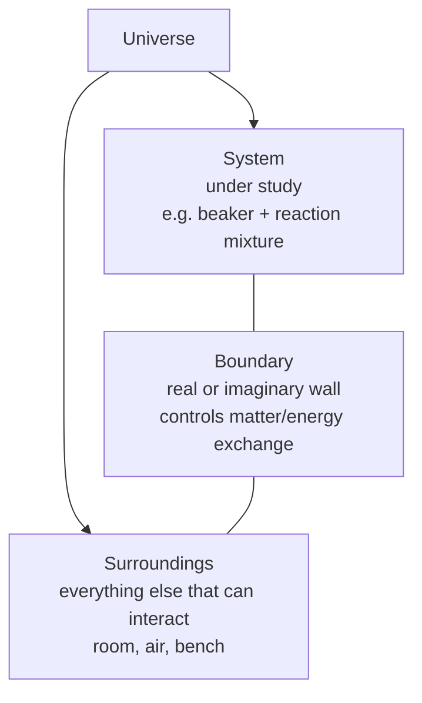
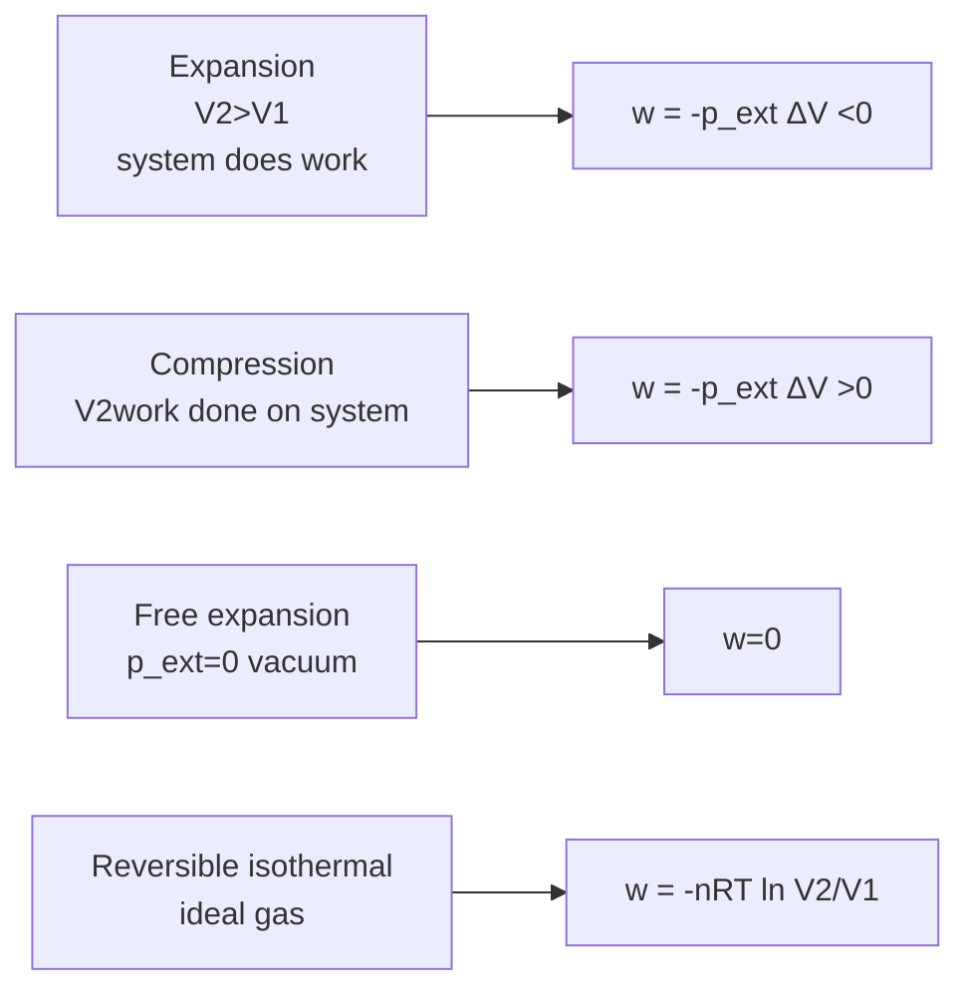
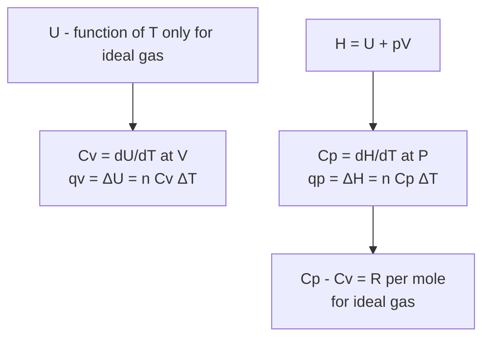
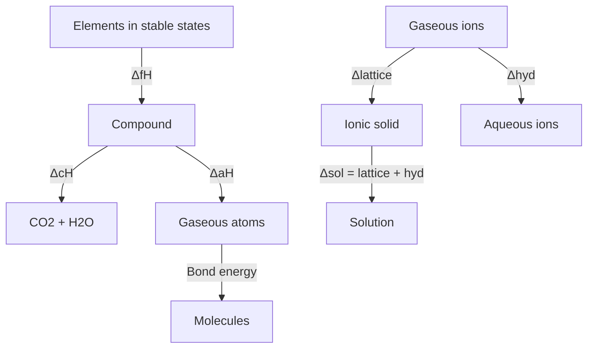
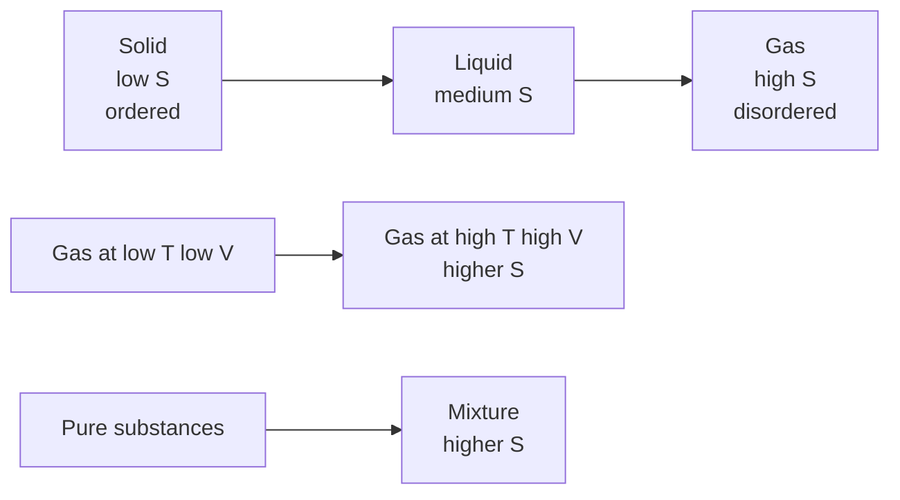

# Thermodynamics — JEE Main + Advanced Notes

> **Sources merged into these notes**
> | Source | File |
> |---|---|
> | NCERT Class XI Chemistry (rationalised, 2023+), Unit 5 | [`kech105.pdf`](kech105.pdf) |
> | Allen module for this chapter | _not uploaded yet — drop it in this folder to enable 🅰 tags_ |
>
> NCERT Unit 5 (5.1–5.7) = System/surroundings, types of systems, state functions, internal energy U, work, heat, first law ΔU = q + w, enthalpy H = U + pV, ΔH vs ΔU, heat capacity Cp/Cv, measurement ΔU and ΔH via calorimetry, standard states, enthalpy of reaction, phase transformation, formation, Hess's law, extensive/intensive, spontaneous/non-spontaneous, entropy S, second law, Gibbs energy G = H - TS, ΔG and spontaneity, ΔG and equilibrium constant. This notes.md is **complete basics-to-Advanced**: NCERT points with § numbers, JEE Advanced extensions marked 🆇, ⚠ = traps.

## Contents

- [Part A — Fundamental Terms and First Law](#part-a--fundamental-terms-and-first-law)
  1. [System, surroundings, boundary, universe and types of systems (5.1.1–5.1.2)](#1-system-surroundings-boundary-universe-and-types-of-systems-511-512)
  2. [State of system, state functions vs path functions (5.1.3)](#2-state-of-system-state-functions-vs-path-functions-513)
  3. [Internal energy U as state function and adiabatic work (5.1.4)](#3-internal-energy-u-as-state-function-and-adiabatic-work-514)
  4. [Work — pressure-volume work and sign conventions (5.1.4a)](#4-work--pressure-volume-work-and-sign-conventions-514a)
  5. [Heat and first law of thermodynamics ΔU = q + w (5.2)](#5-heat-and-first-law-of-thermodynamics-δu--q--w-52)
- [Part B — Enthalpy and Heat Capacities](#part-b--enthalpy-and-heat-capacities)
  6. [Enthalpy H = U + pV, ΔH vs ΔU relation (5.3)](#6-enthalpy-h--u--pv-δh-vs-δu-relation-53)
  7. [Heat capacity Cp, Cv, Cp - Cv = R for ideal gas (5.3)](#7-heat-capacity-cp-cv-cp---cv--r-for-ideal-gas-53)
  8. [Measurement of ΔU and ΔH — calorimetry, bomb calorimeter (5.4)](#8-measurement-of-δu-and-δh--calorimetry-bomb-calorimeter-54)
- [Part C — Enthalpy Changes and Hess's Law](#part-c--enthalpy-changes-and-hesss-law)
  9. [Standard states and standard enthalpy of reaction ΔrH° (5.5)](#9-standard-states-and-standard-enthalpy-of-reaction-δrh-55)
  10. [Enthalpy of phase transformation — fusion, vaporisation, sublimation (5.5)](#10-enthalpy-of-phase-transformation--fusion-vaporisation-sublimation-55)
  11. [Standard enthalpy of formation ΔfH°, thermochemical equations (5.5)](#11-standard-enthalpy-of-formation-δfh-thermochemical-equations-55)
  12. [Hess's law of constant heat summation (5.6)](#12-hesss-law-of-constant-heat-summation-56)
  13. [Enthalpy of combustion, atomisation, bond enthalpy, lattice, hydration 🆇 (5.5–5.6)](#13-enthalpy-of-combustion-atomisation-bond-enthalpy-lattice-hydration--55-56)
  14. [Extensive vs intensive properties (5.7 intro)](#14-extensive-vs-intensive-properties-57-intro)
- [Part D — Spontaneity, Entropy and Gibbs Energy](#part-d--spontaneity-entropy-and-gibbs-energy)
  15. [Spontaneous and non-spontaneous processes (5.7)](#15-spontaneous-and-non-spontaneous-processes-57)
  16. [Entropy S — second law, ΔS = q_rev/T, entropy change calculations (5.7)](#16-entropy-s--second-law-δs--q_revT-entropy-change-calculations-57)
  17. [Gibbs energy G = H - TS, ΔG = ΔH - TΔS and spontaneity (5.7)](#17-gibbs-energy-g--h---ts-δg--δh---tδs-and-spontaneity-57)
  18. [ΔG and equilibrium constant ΔG° = -RT ln K (5.7)](#18-δg-and-equilibrium-constant-δg--rt-ln-k-57)
  19. [Third law and absolute entropy 🆇](#19-third-law-and-absolute-entropy-)
- [Part E — Advanced Corner, Patterns and Revision](#part-e--advanced-corner-patterns-and-revision)
  20. [Master formula bank (print this)](#20-master-formula-bank-print-this)
  21. [Worked problem patterns — JEE Advanced favourites](#21-worked-problem-patterns--jee-advanced-favourites)
  22. [The 20 traps examiners use](#22-the-20-traps-examiners-use)
  23. [Quick Revision Sheet](#23-quick-revision-sheet)

---

# Part A — Fundamental Terms and First Law

## 1. System, surroundings, boundary, universe and types of systems (5.1.1–5.1.2)

Thermodynamics = study of energy transformations between different forms, macroscopic systems with large number of molecules, not microscopic few molecules, deals with initial and final equilibrium states, not rate or path mechanism.

- **System**: part of universe under observation (e.g., reactants in beaker).
- **Surroundings**: rest of universe that can interact with system, practically neighbourhood of system.
- **Boundary**: wall separating system and surroundings, real or imaginary, may be rigid/flexible, conducting/non-conducting, permeable/impermeable.
- **Universe** = System + Surroundings.

Types of systems by matter and energy exchange:

| Type | Matter exchange | Energy exchange | Example |
|---|---|---|---|
| Open | Yes | Yes | Reactants in open beaker, cup of tea |
| Closed | No | Yes | Reactants in closed conducting vessel (copper/steel) |
| Isolated | No | No | Reactants in thermos flask, insulated sealed vessel |

Open system boundary imaginary enclosing beaker. Closed system boundary real conducting but impermeable. Isolated system boundary adiabatic and impermeable.

JEE trap ⚠: Universe is isolated system.

## 2. State of system, state functions vs path functions (5.1.3)

State of system described by measurable macroscopic properties: pressure $p$, volume $V$, temperature $T$, amount $n$, composition. Called state variables or state functions.

State function = property whose value depends only on state of system, not on how it is reached. Change $\Delta$ depends only on initial and final states, not path.

Path function = depends on path.

| State functions | Path functions |
|---|---|
| $p, V, T, n, U, H, S, G, A$ | $q$ (heat), $w$ (work) |
| $\Delta U, \Delta H, \Delta S, \Delta G$ independent of path | $q$ and $w$ path dependent, but $q+w = \Delta U$ state function |

To define state of gas, need only 2 of $p,V,T$ (ideal gas $pV=nRT$) plus composition.

State of surroundings cannot be fully specified, not needed.

## 3. Internal energy U as state function and adiabatic work (5.1.4)

Internal energy $U$ = total energy of system = sum of chemical, electrical, mechanical, etc. energies of molecules (translational, rotational, vibrational, electronic, nuclear, intermolecular). Absolute $U$ cannot be measured, only $\Delta U$.

Joule 1840-50 experiments: For adiabatic system (no heat exchange, adiabatic wall), change in state by doing work always same $\Delta U$ regardless of how work done.

Example: Water in insulated beaker (adiabatic). Initial state A $T_A$, $U_A$.

- Path 1: Mechanical work 1 kJ by rotating paddles → state B $T_B$, $\Delta T = T_B - T_A$, $\Delta U = U_B - U_A$.
- Path 2: Electrical work 1 kJ via immersion rod → same $\Delta T$ and $\Delta U$.

Thus $U$ is state function, $\Delta U$ depends only on initial and final, not path, for adiabatic work.

For adiabatic process, $q=0$, $\Delta U = w_{ad}$.

## 4. Work — pressure-volume work and sign conventions (5.1.4a)

Work = energy transfer that can be used to raise weight in surroundings.

In chemistry, mainly pressure-volume work due to expansion/compression against external pressure.

$w = -p_{ext} \Delta V$ for irreversible, $w = -nRT \ln(V_2/V_1)$ for reversible isothermal ideal gas.

Sign convention (chemistry, IUPAC):

- $w$ negative when work done **by** system on surroundings (expansion, $\Delta V >0$ → $w <0$).
- $w$ positive when work done **on** system by surroundings (compression, $\Delta V <0$ → $w >0$).

Physics convention opposite, but JEE follows chemistry: $w = -p_{ext} \Delta V$.

Other types of work: electrical work $w = -nFE$, etc.

- Irreversible work: $w_{irr} = -p_{ext} (V_2 - V_1)$.
- Reversible work (max work): $w_{rev} = -nRT \ln(V_2/V_1) = -2.303 nRT \log(V_2/V_1)$.
- Free expansion against vacuum: $p_{ext}=0$ → $w=0$.
- No volume change (isochoric): $\Delta V=0$ → $w=0$.

## 5. Heat and first law of thermodynamics ΔU = q + w (5.2)

Heat $q$ = energy transfer due to temperature difference. Flows from high $T$ to low $T$. $q$ positive when heat absorbed by system (endothermic), negative when released (exothermic) — chemistry sign.

First law = law of conservation of energy: Energy cannot be created nor destroyed, total energy of universe constant. For system, change in internal energy equals heat added plus work done on system.

$\Delta U = q + w$

- Isolated system: $q=0$, $w=0$ → $\Delta U=0$.
- For finite change: $\Delta U = U_2 - U_1$.
- For infinitesimal: $dU = dq + dw$.

Other forms: $q = \Delta U - w$, $w = \Delta U - q$.

First law is state function relation: $q$ and $w$ path dependent but sum $q+w$ path independent.

Applications:

- If system does work ($w$ negative) and absorbs heat ($q$ positive), $\Delta U$ may be positive, negative or zero.

Example: Isothermal expansion of ideal gas: $\Delta U=0$ (U depends only on T for ideal gas), so $q = -w$.

---

# Part B — Enthalpy and Heat Capacities

## 6. Enthalpy H = U + pV, ΔH vs ΔU relation (5.3)

Most chemical reactions carried out at constant pressure (open to atmosphere) not constant volume. Need new state function enthalpy.

Definition: $H = U + pV$ (state function, since $U,p,V$ state functions).

At constant pressure, $q_p = \Delta H$.

Derivation: $\Delta H = \Delta U + \Delta(pV) = \Delta U + p\Delta V + V\Delta p$. At constant pressure, $\Delta p=0$ → $\Delta H = \Delta U + p\Delta V = q_p$ (since $q_p = \Delta U - w = \Delta U + p_{ext}\Delta V$).

Relation $\Delta H$ vs $\Delta U$:

For reaction involving gases: $\Delta H = \Delta U + \Delta n_g RT$, where $\Delta n_g = \sum n_{g, products} - \sum n_{g, reactants}$ (only gases).

Proof: $pV = n_g RT$ for ideal gas, solids/liquids volume negligible → $\Delta(pV) \approx \Delta n_g RT$.

If $\Delta n_g =0$ → $\Delta H = \Delta U$.

If $\Delta n_g >0$ (more gas moles products) → $\Delta H > \Delta U$.

If $\Delta n_g <0$ → $\Delta H < \Delta U$.

Example: $\ce{CH4(g) + 2O2(g) -> CO2(g) + 2H2O(l)}$: $\Delta n_g = 1 -3 = -2$ → $\Delta H = \Delta U -2RT$.

## 7. Heat capacity Cp, Cv, Cp - Cv = R for ideal gas (5.3)

Heat capacity = heat required to raise temperature by 1°C or 1K.

- At constant volume: $C_V = \left( \frac{\partial U}{\partial T} \right)_V = \frac{q_V}{\Delta T}$, $q_V = \Delta U$.
- At constant pressure: $C_P = \left( \frac{\partial H}{\partial T} \right)_P = \frac{q_P}{\Delta T}$, $q_P = \Delta H$.

For $n$ moles: molar heat capacities $C_{V,m}$, $C_{P,m}$.

For ideal gas: $C_P - C_V = R$ (per mole), $C_P - C_V = nR$ for $n$ moles.

For ideal gas, $U$ depends only on $T$, so $\Delta U = n C_V \Delta T$, $\Delta H = n C_P \Delta T$.

Specific heat = heat capacity per gram.

$C_P$ always > $C_V$ because at constant pressure, heat used for expansion work as well as raising $U$.

For solids/liquids, $C_P \approx C_V$ because $\Delta V$ small.

JEE Advanced: $C_P/C_V = \gamma$ = adiabatic exponent. For monoatomic ideal gas $C_V = 3/2 R$, $C_P=5/2 R$, $\gamma=5/3=1.66$. Diatomic at room T $C_V=5/2 R$, $C_P=7/2 R$, $\gamma=1.4$.

## 8. Measurement of ΔU and ΔH — calorimetry, bomb calorimeter (5.4)

**Measurement of $\Delta U$**: At constant volume, $q_V = \Delta U$. Use bomb calorimeter — strong steel vessel (bomb) immersed in water bath, reaction carried out inside bomb at constant volume, temperature rise of water measured.

$\Delta U = q_V = -C_{cal} \Delta T$, where $C_{cal}$ = heat capacity of calorimeter (including water, bomb, etc.) determined by burning known mass of benzoic acid.

Example: Bomb calorimeter $C_{cal}= 10 kJ K^{-1}$, $\Delta T =2 K$ → $q_V = -20 kJ$ → $\Delta U = -20 kJ$ for amount reacted.

**Measurement of $\Delta H$**: At constant pressure, $q_P = \Delta H$. Use coffee-cup calorimeter (constant pressure, open), simple insulated cup with thermometer. For reactions in solution.

$\Delta H = q_P = -m c \Delta T$, where $m$ = mass of solution, $c$ = specific heat.

Relation: $\Delta H = \Delta U + \Delta n_g RT$, so from $\Delta U$ (bomb) can get $\Delta H$.

---

# Part C — Enthalpy Changes and Hess's Law

## 9. Standard states and standard enthalpy of reaction ΔrH° (5.5)

Enthalpy change depends on conditions $T,p$, physical states.

Standard state: pure substance at 1 bar pressure (recent IUPAC, earlier 1 atm). For solution, 1 M concentration, 1 bar.

- Standard state of liquid ethanol at 298 K = pure liquid ethanol at 1 bar.
- Standard state of solid iron at 500 K = pure iron at 1 bar at 500 K.
- Standard state of gas = pure gas at 1 bar behaving ideally.
- Reference state of element = most stable allotrope at 25°C (298 K) and 1 bar: $\ce{H2}$ gas, $\ce{O2}$ gas, $\ce{C}$ graphite, $\ce{S}$ rhombic, etc.

Standard enthalpy of reaction $\Delta_r H°$ = enthalpy change when reaction occurs with all reactants and products in standard states at specified $T$ (usually 298 K). Denoted with superscript $°$.

$\Delta_r H° = \sum a_i H°_m(products) - \sum b_i H°_m(reactants)$, where $a_i,b_i$ stoichiometric coefficients.

## 10. Enthalpy of phase transformation — fusion, vaporisation, sublimation (5.5)

Phase change at constant $T$ and $p$ (melting point, boiling point) involves enthalpy change.

- **Enthalpy of fusion** $\Delta_{fus} H°$: heat required to melt 1 mol solid to liquid at melting point, standard pressure. Endothermic positive. Example: $\ce{H2O(s) -> H2O(l)}$, $\Delta_{fus} H° = 6.00 kJ mol^{-1}$ at 273 K.
- **Enthalpy of vaporisation** $\Delta_{vap} H°$: heat required to vaporise 1 mol liquid to gas at boiling point. Endothermic. $\ce{H2O(l) -> H2O(g)}$, $\Delta_{vap} H° = 40.79 kJ mol^{-1}$ at 373 K, $44.01 kJ mol^{-1}$ at 298 K.
- **Enthalpy of sublimation** $\Delta_{sub} H°$: solid → vapour directly. $\ce{CO2(s) -> CO2(g)}$ dry ice, $\Delta_{sub} H° = 25.2 kJ mol^{-1}$ at 195 K; naphthalene $73.0 kJ mol^{-1}$. $\Delta_{sub} H = \Delta_{fus} H + \Delta_{vap} H$ (Hess).

Strength of intermolecular forces determines magnitude: water strong H-bonds → high $\Delta_{vap} H$, acetone weaker dipole-dipole → lower.

Measurement: $\Delta_{vap} U = \Delta_{vap} H - p\Delta V = \Delta_{vap} H - \Delta n_g RT$. For $\ce{H2O(l) -> H2O(g)}$, $\Delta n_g=1$ → $\Delta_{vap} U = \Delta_{vap} H - RT$.

Example: 18 g water film $1 mol$ at 298 K $\Delta_{vap} H=44.01 kJ$, $\Delta_{vap} U =44.01 -2.48=41.53 kJ$.

## 11. Standard enthalpy of formation ΔfH°, thermochemical equations (5.5)

**Standard molar enthalpy of formation** $\Delta_f H°$: enthalpy change when 1 mol compound formed from its elements in most stable states at 1 bar, 298 K.

Symbol $\Delta_f H°$, subscript f = formation.

Examples:

- $\ce{H2(g) + 1/2 O2(g) -> H2O(l)}$, $\Delta_f H° = -285.8 kJ mol^{-1}$
- $\ce{C(graphite) + 2H2(g) -> CH4(g)}$, $\Delta_f H° = -74.81 kJ mol^{-1}$
- $\ce{2C(graphite) + 3H2(g) + 1/2 O2(g) -> C2H5OH(l)}$, $\Delta_f H° = -277.7 kJ mol^{-1}$

By convention, $\Delta_f H°$ of element in reference state = 0.

Enthalpy of reaction from formation: $\Delta_r H° = \sum \nu_i \Delta_f H°(products) - \sum \nu_i \Delta_f H°(reactants)$.

Example: $\ce{CaCO3(s) -> CaO(s) + CO2(g)}$: $\Delta_r H° = [\Delta_f H°(CaO) + \Delta_f H°(CO2)] - \Delta_f H°(CaCO3) = (-635.1 -393.5) - (-1206.9) = +178.3 kJ mol^{-1}$ endothermic.

**Thermochemical equation**: Balanced chemical equation plus $\Delta_r H°$ value and physical states (including allotropic). Coefficients refer to moles, not molecules, $\Delta_r H°$ units $kJ mol^{-1}$ refers to reaction as written.

Example: $\ce{C2H5OH(l) + 3O2(g) -> 2CO2(g) + 3H2O(l)}$, $\Delta_r H° = -1367 kJ mol^{-1}$ means for 1 mol ethanol as written, 1367 kJ released.

Conventions:

- Coefficients = moles.
- $\Delta_r H°$ refers to number of moles specified.
- Physical states must be specified.

## 12. Hess's law of constant heat summation (5.6)

Germain Hess 1840: Enthalpy change for a reaction is same whether reaction occurs in one step or several steps (since $H$ state function). So if reaction can be expressed as sum of other reactions, $\Delta_r H°$ = sum of $\Delta_r H°$ of those reactions.

Application: Calculate $\Delta_f H°$ or $\Delta_r H°$ for reactions that cannot be measured directly.

Example: Formation of $\ce{CO2}$ from $\ce{C}$ and $\ce{O2}$ can be direct or via $\ce{CO}$: $\ce{C + O2 -> CO2}$ $\Delta H = -393.5$, $\ce{C + 1/2 O2 -> CO}$ $\Delta H = -110.5$, $\ce{CO + 1/2 O2 -> CO2}$ $\Delta H = -283.0$, sum = $-393.5$.

Useful for Born-Haber cycle for lattice enthalpy.

## 13. Enthalpy of combustion, atomisation, bond enthalpy, lattice, hydration 🆇 (5.5–5.6)

Beyond NCERT, JEE Advanced needs:

- **Enthalpy of combustion** $\Delta_c H°$: enthalpy change when 1 mol substance burnt completely in $\ce{O2}$ to $\ce{CO2(g)}$ and $\ce{H2O(l)}$ (for organic). Always exothermic. Used to calculate calorific value. Example: $\ce{CH4(g) + 2O2 -> CO2 + 2H2O}$, $\Delta_c H° = -890 kJ mol^{-1}$.

- **Enthalpy of atomisation** $\Delta_a H°$: enthalpy change when 1 mol substance dissociated into gaseous atoms. Example: $\ce{CH4(g) -> C(g) + 4H(g)}$, $\Delta_a H° = +1665 kJ mol^{-1}$. For elements, atomisation = sublimation for solids.

- **Bond enthalpy** $\Delta_{bond} H°$: average enthalpy change when 1 mol of a particular bond broken in gas phase to give atoms. Mean values, not exact for polyatomic because bond environment changes. $\Delta_r H° \approx \sum BE(reactants) - \sum BE(products)$ (bonds broken - bonds formed). Example: $\ce{H2 -> 2H}$, $BE = 435.8 kJ$, $\ce{Cl2 -> 2Cl}$ $242 kJ$, $\ce{HCl -> H+Cl}$ $431 kJ$.

- **Lattice enthalpy** $\Delta_{lattice} H°$: enthalpy change when 1 mol ionic solid formed from gaseous ions: $\ce{Na+(g) + Cl-(g) -> NaCl(s)}$, $\Delta_{lattice} H° = -787 kJ mol^{-1}$ (exothermic). Reverse = lattice dissociation. Born-Haber cycle uses Hess to calculate.

- **Hydration enthalpy** $\Delta_{hyd} H°$: enthalpy change when 1 mol gaseous ions dissolved in water: $\ce{Na+(g) -> Na+(aq)}$, exothermic due to ion-dipole.

- **Enthalpy of solution** $\Delta_{sol} H°$: solid + water → solution. $\Delta_{sol} H° = \Delta_{lattice} H° + \Delta_{hyd} H°$ (with signs).

- **Enthalpy of neutralisation**: $\ce{H+ + OH- -> H2O}$, $\Delta_n H° = -55.84 kJ mol^{-1}$ for strong acid-strong base. Less negative for weak acid/base due to dissociation energy.

### Kirchhoff's law — temperature dependence of ΔH and ΔS 🆇

**Kirchhoff's law**: Enthalpy change varies with temperature due to difference in heat capacities.

$Δ_r H_{T2} = Δ_r H_{T1} + ∫_{T1}^{T2} Δ_r C_P dT$ ≈ $Δ_r H_{T1} + Δ_r C_P (T2-T1)$ if $Δ_r C_P$ constant.

Where $Δ_r C_P = ∑ν C_P(products) - ∑ν C_P(reactants)$.

Similarly $Δ_r S_{T2} = Δ_r S_{T1} + ∫_{T1}^{T2} Δ_r C_P / T dT$ ≈ $Δ_r S_{T1} + Δ_r C_P ln(T2/T1)$.

And $Δ_r G$ temperature dependence via Gibbs-Helmholtz: $(∂(ΔG/T)/∂T)_P = -ΔH/T^2$.

Example: $Δ_r H°_{298}= -100 kJ$, $Δ_r C_P = -50 J/K$, find $Δ_r H°_{400}= -100kJ + (-0.05 kJ/K)(102K)= -105.1 kJ$.

### Carnot cycle and second law efficiency 🆇

**Carnot cycle** = ideal reversible heat engine with 4 steps between hot reservoir $T_H$ and cold $T_C$ ($T_H>T_C$):

1. Isothermal reversible expansion at $T_H$: $q_H$ absorbed, $w_1 = -nR T_H \ln(V_2/V_1)$, $\Delta U=0$, $\Delta S = q_H/T_H = nR \ln(V_2/V_1)$.
2. Adiabatic reversible expansion: $T_H \to T_C$, $q=0$, $w_2 = \Delta U = nC_V (T_C-T_H)$, $\Delta S=0$.
3. Isothermal reversible compression at $T_C$: $q_C$ released (negative), $w_3 = -nR T_C \ln(V_4/V_3)$, $\Delta S = q_C/T_C$.
4. Adiabatic reversible compression: $T_C \to T_H$, $q=0$, $w_4 = nC_V (T_H-T_C)$, $\Delta S=0$.

Net $w = q_H + q_C$, efficiency $\eta = \frac{|w|}{q_H} = 1 - \frac{T_C}{T_H}$ (Kelvin scale). Maximum possible efficiency for any engine operating between $T_H$, $T_C$ (Carnot theorem). $\eta=100\%$ only if $T_C=0$ K impossible.

$\Delta S_{total}=0$ for reversible Carnot, $>0$ for irreversible.

**Example**: $T_H=500$ K, $T_C=300$ K → $\eta=1-300/500=0.4=40\%$ max.

### Polytropic process 🆇 — $pV^x = constant$

General process $pV^x = C$ where $x$ = polytropic exponent.

- $x=0$ → $p=const$ isobaric
- $x=1$ → $pV=const$ isothermal (ideal gas, $T$ const)
- $x=\gamma=C_P/C_V$ → adiabatic reversible $pV^{\gamma}=const$
- $x=\infty$ → $V=const$ isochoric

Work: $w = \frac{p_2V_2 - p_1V_1}{1-x}$ for $x\neq1$, $w=-nRT\ln(V_2/V_1)$ for $x=1$.

Molar heat capacity in polytropic: $C = C_V + \frac{R}{1-x}$ (for ideal gas). For adiabatic $x=\gamma$, $C=0$ (no heat).

### Joule-Thomson effect 🆇

Free expansion of real gas through porous plug/throttle valve at constant enthalpy (isoenthalpic, $H=const$).

- Ideal gas: $T$ unchanged on free expansion ($Joule's law$, $U$ depends only on $T$).
- Real gas: $T$ may decrease (cooling) or increase (heating) depending on inversion temperature $T_i$.

Joule-Thomson coefficient $\mu_{JT} = (\partial T/\partial p)_H$.

- $\mu_{JT}>0$ → cooling on expansion ($T$ drops), occurs when $T<T_i$
- $\mu_{JT}<0$ → heating, $T>T_i$
- $\mu_{JT}=0$ at inversion temperature $T_i = 2a/Rb$ for van der Waals gas (approx).

$T_i$ max = $2a/Rb$, $T_{i,lower}$ relation. For $H_2$ and He, $T_i$ very low (~40 K for $H_2$, ~20 K for He) → at room T they heat on expansion (used in liquefaction after pre-cooling).

Liquefaction methods: Linde's process uses JT cooling with regenerative heat exchange.

## 14. Extensive vs intensive properties (5.7 intro)

- **Extensive**: depends on amount of substance, additive when system divided. Examples: mass, volume, $U, H, S, G, n, C_P, q, w$.
- **Intensive**: independent of amount, not additive. Examples: $p, T, density, concentration, molar properties ($C_{P,m}, V_m$), $p, T$ etc.

Molar property = extensive / $n$ → intensive.

---

# Part D — Spontaneity, Entropy and Gibbs Energy

## 15. Spontaneous and non-spontaneous processes (5.7)

Spontaneous process = occurs on its own without external work, natural tendency, may be fast or slow, but thermodynamically favoured. Non-spontaneous needs external work.

Examples spontaneous: Water flows downhill, heat flows hot to cold, $\ce{NaCl}$ dissolves in water, $\ce{CH4}$ burns in $\ce{O2}$, ice melts above 0°C, gas expands into vacuum.

Non-spontaneous reverse: Water uphill, heat cold to hot, etc. can be made to occur by coupling with spontaneous (refrigerator).

Spontaneity ≠ rate. Spontaneous may be very slow (e.g., $\ce{H2 + O2}$ mixture at room T, $\Delta G$ negative but kinetic barrier high, needs spark). Catalyst affects rate, not spontaneity ($\Delta G$).

Criteria for spontaneity needs second law.

## 16. Entropy S — second law, ΔS = q_rev/T, entropy change calculations (5.7)

First law tells energy conservation but not direction. Why does heat flow hot to cold, not reverse, though energy conserved both ways? Need second law and entropy.

**Entropy $S$** = measure of disorder or randomness or number of microstates. State function, extensive. Units $J K^{-1} mol^{-1}$.

Second law: Total entropy of universe (system + surroundings) increases for spontaneous process: $\Delta S_{universe} = \Delta S_{system} + \Delta S_{surroundings} >0$ for spontaneous, $=0$ at equilibrium, $<0$ non-spontaneous.

Definition: For reversible process, $\Delta S = q_{rev}/T$. For infinitesimal, $dS = dq_{rev}/T$.

Entropy change calculations:

- **Isothermal reversible expansion of ideal gas**: $\Delta S = nR \ln(V_2/V_1) = nR \ln(p_1/p_2) = q_{rev}/T$.
- **Heating/cooling at constant pressure**: $\Delta S = n C_P \ln(T_2/T_1)$.
- **At constant volume**: $\Delta S = n C_V \ln(T_2/T_1)$.
- **Phase transition at $T_{trans}$**: $\Delta S = \Delta H_{trans}/T_{trans}$. Example: Fusion $\Delta_{fus} S = \Delta_{fus} H / T_f$, vaporisation $\Delta_{vap} S = \Delta_{vap} H / T_b$. Trouton's rule: $\Delta_{vap} S \approx 85 J K^{-1} mol^{-1}$ for many liquids (non-H-bonded).
- **Chemical reaction**: $\Delta_r S° = \sum S°(products) - \sum S°(reactants)$.

Entropy increases when:

- Solid → liquid → gas (disorder increases).
- Number of gas moles increases.
- Volume increases, temperature increases.
- Mixing of gases.

Third law (see §19) gives absolute $S$.

## 17. Gibbs energy G = H - TS, ΔG = ΔH - TΔS and spontaneity (5.7)

To avoid calculating $\Delta S_{surroundings}$, Gibbs introduced free energy $G = H - TS$ (state function, extensive). For system at constant $T,P$.

$\Delta G = \Delta H - T \Delta S$ (at constant $T$).

At constant $T,P$, $\Delta G = -T \Delta S_{universe}$. So:

- $\Delta G <0$ → $\Delta S_{universe} >0$ → spontaneous.
- $\Delta G =0$ → equilibrium.
- $\Delta G >0$ → non-spontaneous, reverse spontaneous.

For reaction, $\Delta_r G = \sum G(products) - \sum G(reactants)$.

$\Delta G$ also equals maximum non-expansion work (electrical work) obtainable: $w_{max, non-PV} = \Delta G$.

**Temperature dependence of spontaneity**:

| $\Delta H$ | $\Delta S$ | $\Delta G = \Delta H - T\Delta S$ | Spontaneity |
|---|---|---|---|
| -ve (exothermic) | +ve (disorder ↑) | -ve at all T | Spontaneous at all T |
| +ve (endothermic) | -ve (disorder ↓) | +ve at all T | Non-spontaneous at all T |
| -ve | -ve | -ve at low T, +ve at high T | Spontaneous low T, non-spont high T |
| +ve | +ve | +ve at low T, -ve at high T | Non-spont low T, spontaneous high T |

Crossover temperature $T = \Delta H / \Delta S$ where $\Delta G=0$.

Example: $\ce{H2O(l) -> H2O(g)}$: $\Delta H = +40.7 kJ$, $\Delta S = +109 J/K$ → $T = 373 K$ boiling point, above spontaneous evaporation.

## 18. ΔG and equilibrium constant ΔG° = -RT ln K (5.7)

For reaction at any condition: $\Delta_r G = \Delta_r G° + RT \ln Q$, where $Q$ = reaction quotient.

At equilibrium, $\Delta_r G =0$, $Q = K$ → $\Delta_r G° = -RT \ln K = -2.303 RT \log K$.

Also $\Delta_r G° = -n F E°_{cell}$ (electrochemistry link).

Relation:

- If $K >1$ → $\Delta_r G° <0$ → products favoured at equilibrium.
- If $K <1$ → $\Delta_r G° >0$ → reactants favoured.
- If $K =1$ → $\Delta_r G° =0$.

Temperature dependence: van't Hoff equation: $\frac{d \ln K}{dT} = \frac{\Delta_r H°}{RT^2}$, integrated $\ln(K_2/K_1) = -\Delta_r H°/R (1/T_2 -1/T_1)$.

## 19. Third law and absolute entropy 🆇

Third law: Entropy of perfect crystalline solid at 0 K = 0. As $T \to 0$, $S \to 0$ because perfect order.

This allows absolute entropies $S°$ at 298 K to be determined by integrating $C_P/T$ from 0 K to 298 K plus phase transition entropies.

$S°$ values tabulated: $S°$ for elements not zero (unlike $\Delta_f H°$), because absolute.

Standard molar entropy $S°_{m}$.

$\Delta_r S° = \sum S°(products) - \sum S°(reactants)$.

---

# Part E — Advanced Corner, Patterns and Revision

## 20. Master formula bank (print this)

**First law**: $\Delta U = q + w$, $w = -p_{ext} \Delta V$ (irreversible), $w_{rev} = -nRT \ln(V_2/V_1)$, free expansion $w=0$, isochoric $w=0$.

**Enthalpy**: $H = U + pV$, $\Delta H = \Delta U + \Delta n_g RT$, $q_V = \Delta U$, $q_P = \Delta H$.

**Heat capacities**: $C_V = (\partial U/\partial T)_V$, $C_P = (\partial H/\partial T)_P$, $C_P - C_V = R$ per mole ideal gas, $C_P/C_V = \gamma$, monoatomic $C_V=3/2 R$, diatomic $5/2 R$.

**Calorimetry**: $\Delta U = -C_{cal} \Delta T$ (bomb), $\Delta H = -m c \Delta T$ (coffee cup).

**Standard states**: 1 bar, 298 K, pure form. $\Delta_f H°(element, ref)=0$.

**Enthalpy changes**:

- $\Delta_r H° = \sum \nu \Delta_f H°(prod) - \sum \nu \Delta_f H°(react)$
- $\Delta_r H° = \sum BE(react) - \sum BE(prod)$
- $\Delta_{sub} H = \Delta_{fus} H + \Delta_{vap} H$
- $\Delta_{sol} H = \Delta_{lattice} H + \Delta_{hyd} H$
- $\Delta_n H° (strong acid-base) = -55.84 kJ mol^{-1}$

**Hess's law**: $\Delta_r H°$ same regardless of path, additive.

**Entropy**:

- $\Delta S = q_{rev}/T$
- Isothermal ideal gas: $\Delta S = nR \ln(V_2/V_1) = nR \ln(p_1/p_2)$
- Heating: $\Delta S = n C_P \ln(T_2/T_1)$ at P, $n C_V \ln(T_2/T_1)$ at V
- Phase: $\Delta_{trans} S = \Delta_{trans} H / T_{trans}$
- Reaction: $\Delta_r S° = \sum S°(prod) - \sum S°(react)$

**Gibbs**:

- $G = H - TS$, $\Delta G = \Delta H - T\Delta S$ (const T)
- $\Delta G <0$ spontaneous, $=0$ equilibrium, $>0$ non-spont
- $\Delta_r G° = -RT \ln K = -2.303 RT \log K$
- $\Delta_r G = \Delta_r G° + RT \ln Q$
- $\Delta_r G° = \Delta_r H° - T \Delta_r S°$
- van't Hoff: $\ln(K_2/K_1) = -\Delta_r H°/R (1/T_2 -1/T_1)$

**Third law**: $S=0$ at 0 K perfect crystal, $S°$ absolute not zero for elements.

## 21. Worked problem patterns — JEE Advanced favourites

**Pattern 1 — Work calculation**:

1 mol ideal gas expands reversible isothermal 298 K from 1 L to 10 L: $w = -nRT \ln(10) = -1*8.314*298*2.303*1 = -5708 J$. Irreversible against $p_{ext}=1$ bar: $w = -p_{ext} \Delta V = -1e5 Pa *9e-3 m3 = -900 J$.

**Pattern 2 — ΔH vs ΔU**:

$\ce{N2(g) + 3H2(g) -> 2NH3(g)}$, $\Delta n_g =2-4=-2$, $\Delta H = \Delta U -2RT$. If $\Delta U = -100 kJ$, $\Delta H = -100 -2*8.314*298/1000 = -104.96 kJ$.

**Pattern 3 — Calorimetry**:

Bomb calorimeter $C=10 kJ/K$, 1 g benzoic acid $\Delta U = -26.4 kJ/g$ causes $\Delta T=2.64 K$. Then unknown sample 0.5 g causes $\Delta T=1.2 K$ → $q_V = -12 kJ$ → $\Delta U = -24 kJ/g$.

**Pattern 4 — Hess's law**:

Given $\ce{C + O2 -> CO2}$ $\Delta H=-393.5$, $\ce{CO + 1/2 O2 -> CO2}$ $\Delta H=-283.0$ → $\ce{C + 1/2 O2 -> CO}$ $\Delta H = -393.5 - (-283.0)= -110.5 kJ$.

**Pattern 5 — Bond enthalpy**:

$\ce{CH4 + 2O2 -> CO2 + 2H2O}$, given BE: C-H 413, O=O 498, C=O 804, O-H 463. $\Delta_r H = [4*413 +2*498] - [2*804 +4*463] = [1652+996]-[1608+1852]=2648-3460=-812 kJ$ (approx, actual -890 due to mean values).

**Pattern 6 — Entropy change**:

1 mol ideal gas isothermal expansion $V1=1 L$ to $V2=10 L$: $\Delta S = R \ln10 = 19.14 J/K$.

Heating water $0°C$ to $100°C$: $\Delta S = m c \ln(T2/T1) = 18g *4.18 J/gK * \ln(373/273)=...$

**Pattern 7 — Spontaneity crossover**:

Reaction $\Delta H = +100 kJ$, $\Delta S = +200 J/K$ → $T_{eq}= \Delta H/\Delta S=500 K$, spontaneous above 500 K.

**Pattern 8 — ΔG° and K**:

$\Delta_r G° = -50 kJ$ at 298 K → $K = exp(-ΔG°/RT)= exp(50000/(8.314*298))= exp(20.18)=5.8e8$ large, products favoured.

**Pattern 9 — van't Hoff**:

Given $K1=10$ at $T1=300 K$, $\Delta_r H°=+50 kJ$, find $K2$ at $400 K$: $\ln(K2/10)= -50000/8.314*(1/400-1/300)= -6013*(-0.000833)=5.01$, $K2=10*exp(5.01)=1500$.

## 22. The 20 traps examiners use

1. Sign convention: chemistry $w=-pΔV$, work by system negative.
2. $q_V = ΔU$, $q_P = ΔH$, not interchangeable.
3. $ΔH = ΔU + Δn_g RT$, only gases, Δn_g = products - reactants gaseous.
4. $C_P - C_V = R$ per mole ideal gas only, not for solids/liquids.
5. Bomb calorimeter gives ΔU, not ΔH.
6. Standard state 1 bar now, not 1 atm (difference small but JEE may use 1 bar).
7. $Δ_f H°(element, ref)=0$, but $S°$ not zero.
8. Hess's law: reverse reaction sign flips, multiply reaction multiply ΔH.
9. Bond enthalpy: mean values, approximate, for gaseous species only.
10. Extensive vs intensive: $U,H,S,G,V,n$ extensive, $p,T,density$ intensive.
11. Spontaneous ≠ fast, catalyst does not affect ΔG.
12. $ΔS_{universe} = ΔS_{sys}+ΔS_{surr}$, $ΔS_{surr} = -ΔH_{sys}/T$ for constant T,P.
13. $ΔG = -T ΔS_{universe}$ at constant T,P, not at constant V.
14. $ΔG <0$ spontaneous, but $ΔG° <0$ means K>1, not necessarily spontaneous under non-standard conditions (need Q).
15. $Δ_r G° = -RT ln K$, $K$ dimensionless (activities), careful with $K_p$ vs $K_c$.
16. $Δ_{vap} S = Δ_{vap} H / T_b$, Trouton's rule ~85 J/K/mol.
17. Third law: perfect crystal at 0 K S=0, imperfect (CO, ice) residual entropy >0.
18. Work: free expansion $w=0$, reversible work max magnitude.
19. $ΔU$ for ideal gas depends only on T, zero for isothermal, but for real gas not.
20. $ΔG = ΔH - TΔS$ only at constant T, $ΔG° = ΔH° - TΔS°$ approx if ΔH°,ΔS° T-independent.

## 23. Quick Revision Sheet

**Terms**: System (open/closed/isolated), surroundings, boundary, universe = system+surroundings. State functions $p,V,T,U,H,S,G$, path functions $q,w$.

**First law**: $ΔU = q + w$, $w = -p_{ext} ΔV$, $w_{rev} = -nRT ln(V2/V1)$, $w_{free}=0$, $ΔU$ state function.

**Enthalpy**: $H=U+pV$, $q_V=ΔU$, $q_P=ΔH$, $ΔH=ΔU+Δn_g RT$, $Δn_g$ gaseous only.

**Heat capacities**: $C_V=(∂U/∂T)_V$, $C_P=(∂H/∂T)_P$, $C_P-C_V=R$ ideal gas, $γ=C_P/C_V$, monoatomic $3/2 R,5/2 R,1.66$, diatomic $5/2 R,7/2 R,1.4$.

**Calorimetry**: Bomb $ΔU=-C_{cal}ΔT$, coffee cup $ΔH=-m c ΔT$.

**Standard states**: 1 bar, 298 K, pure. $Δ_f H°(element)=0$.

**Enthalpy changes**: $Δ_r H°=∑νΔ_f H°(prod)-∑νΔ_f H°(react)$, $Δ_{sub}=Δ_{fus}+Δ_{vap}$, $Δ_{sol}=Δ_{lattice}+Δ_{hyd}$, $Δ_n H°=-55.84 kJ$ strong acid-base.

**Hess**: $Δ_r H$ path independent, additive.

**Extensive**: $U,H,S,G,V,n$, intensive: $p,T,density$.

**Spontaneity**: Spontaneous occurs on its own, may be slow, catalyst no effect on ΔG.

**Entropy**: $S$ disorder, $ΔS=q_{rev}/T$, $ΔS=nR ln(V2/V1)$, $nC_P ln(T2/T1)$, $Δ_{trans}S=Δ_{trans}H/T_{trans}$, $Δ_r S°=∑S°(prod)-∑S°(react)$, $ΔS_{univ}=ΔS_{sys}+ΔS_{surr}>0$ spontaneous.

**Gibbs**: $G=H-TS$, $ΔG=ΔH-TΔS$ const T, $ΔG=-TΔS_{univ}$ const T,P, $ΔG<0$ spontaneous, $=0$ equilibrium, $>0$ non-spont. $Δ_r G°=-RT ln K$, $Δ_r G=Δ_r G°+RT ln Q$, $K>1$ $ΔG°<0$.

**Temperature dependence**: $ΔH$ -ve $ΔS$ +ve spontaneous all T; $ΔH$ +ve $ΔS$ -ve non-spont all T; $ΔH$ -ve $ΔS$ -ve spontaneous low T; $ΔH$ +ve $ΔS$ +ve spontaneous high T. $T_{eq}=ΔH/ΔS$.

**Third law**: $S=0$ at 0 K perfect crystal, $S°$ absolute.

---
*Cross-links:*
- Previous: [Structure of Atom](../02-Structure-of-Atom/notes.md) — energy levels $E_n$ connects to ΔH.
- Next: [Equilibrium](../04-Equilibrium/notes.md) — ΔG° = -RT ln K, van't Hoff.
- Related: [Chemical Bonding](../../Inorganic-Chemistry/02-Chemical-Bonding-and-Molecular-Structure/notes.md) — bond enthalpies; [Solutions](../07-Solutions/notes.md) — entropy of mixing; [Electrochemistry](../08-Electrochemistry/notes.md) — ΔG° = -nFE°.
- Practical: Calorimetry experiments.
