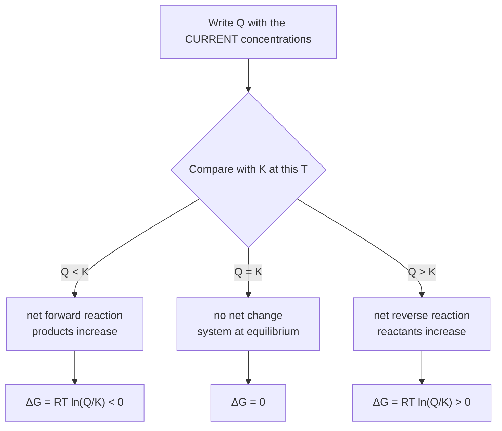
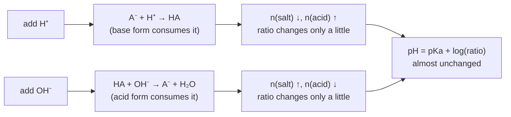

# Chemical & Ionic Equilibrium — JEE Main + Advanced Notes

> **Sources merged into these notes**
> | Source | File |
> |---|---|
> | NCERT Class XI Chemistry (rationalised, 2023+), Unit 6 | [`kech106.pdf`](kech106.pdf) |
> | Allen module for this chapter | _not uploaded yet — drop it in this folder to enable 🅰 tags_ |
>
> NCERT keeps **physical, chemical and ionic equilibrium in one unit** (6.1–6.8 =
> equilibria & chemical equilibrium; 6.9–6.13 = ionic equilibrium). This single `notes.md`
> therefore serves as both the *chemical equilibrium* and the *ionic equilibrium* notes, with
> **Part A/B** = chemical and **Part C** = ionic. Section numbers in brackets are NCERT's, so
> `6.8.3` means "read that page of the PDF too". 🆇 = beyond NCERT, needed for JEE Advanced.
> ⚠ = the traps that decide marks.

## Contents

- [Part A — What "Equilibrium" Means (physical systems)](#part-a--what-equilibrium-means-physical-systems)
  1. [The equilibrium idea and its seven general characteristics](#1-the-equilibrium-idea-and-its-seven-general-characteristics-615)
  2. [Solid–liquid, liquid–vapour and solid–vapour equilibria](#2-solidliquid-liquidvapour-and-solidvapour-equilibria-611613)
  3. [Equilibrium in dissolution: solids and gases in liquids](#3-equilibrium-in-dissolution-solids-and-gases-in-liquids-614)
- [Part B — Chemical Equilibrium](#part-b--chemical-equilibrium-6268)
  4. [Dynamic equilibrium and how NCERT proves it](#4-dynamic-equilibrium-and-how-ncert-proves-it-62)
  5. [Law of chemical equilibrium and Kc](#5-law-of-chemical-equilibrium-and-kc-63)
  6. [Kc, Kp, Kx, Kn — converting between them](#6-kc-kp-kx-kn--converting-between-them-641--in-parts)
  7. [Homogeneous vs heterogeneous equilibria](#7-homogeneous-vs-heterogeneous-equilibria-6465)
  8. [Applications of K: extent, direction, ICE tables](#8-applications-of-k-extent-direction-ice-tables-66)
  9. [K, Q and ΔG — the thermodynamic spine (and van't Hoff)](#9-k-q-and-δg--the-thermodynamic-spine-67--in-part)
  10. [Le Chatelier's principle — all five factors](#10-le-chateliers-principle--all-five-factors-68)
  11. [α from vapour density, average M and total pressure](#11-α-from-vapour-density-average-m-and-total-pressure-)
  12. [Advanced equilibrium toolkit](#12-advanced-equilibrium-toolkit-)
- [Part C — Ionic Equilibrium in Solution](#part-c--ionic-equilibrium-in-solution-69613)
  13. [Electrolytes, and the three acid–base theories](#13-electrolytes-and-the-three-acidbase-theories-69610)
  14. [Kw, the pH scale, and when water's own ions matter](#14-kw-the-ph-scale-and-when-waters-own-ions-matter-61116112)
  15. [Ka, Kb and the Ostwald dilution law](#15-ka-kb-and-the-ostwald-dilution-law-61136114)
  16. [Ka · Kb = Kw, and what makes an acid strong](#16-ka--kb--kw-and-what-makes-an-acid-strong-61156117)
  17. [Polyprotic acids and controlling an ion by pH](#17-polyprotic-acids-and-controlling-an-ion-by-ph-6116)
  18. [Common-ion effect](#18-common-ion-effect-6118)
  19. [Hydrolysis of salts and the pH of salt solutions](#19-hydrolysis-of-salts-and-the-ph-of-salt-solutions-6119)
  20. [Buffer solutions](#20-buffer-solutions-612)
  21. [Indicators and titration curves](#21-indicators-and-titration-curves-) — 🆇
  22. [Solubility equilibrium and Ksp](#22-solubility-equilibrium-and-ksp-613)
- [Part D — Advanced Corner, Patterns and Revision](#part-d--advanced-corner-patterns-and-revision)
  23. [Master formula bank (print this)](#23-master-formula-bank-print-this)
  24. [Worked problem patterns](#24-worked-problem-patterns)
  25. [The 20 traps examiners use](#25-the-20-traps-examiners-use)
  26. [Quick Revision Sheet](#26-quick-revision-sheet)

---

# Part A — What "Equilibrium" Means (physical systems)

Equilibrium in Unit 6 is introduced on **physical** processes first because the *same four
ideas* — a closed system, two opposing rates, constant macroscopic properties, and a fixed
ratio of "concentrations" — then transfer untouched to chemical and ionic equilibria. Do not
skip Part A: JEE Main's "which of these is a physical equilibrium / what happens to the
vapour pressure when…" questions come straight from 6.1.

## 1. The equilibrium idea and its seven general characteristics (6.1.5)

```
   reversible process in a CLOSED system at CONSTANT T
        forward rate  ─────────►
        ◄─────────────  backward rate
        when the two become equal:  ⇌   (no net change, everything still moving)
```

**General characteristics of an equilibrium (physical *or* chemical) — NCERT's list:**

1. It occurs only in a **closed system** at a **given temperature** (an open vessel can never
   reach equilibrium — the vapour escapes).
2. Both opposing processes continue at **equal rates** → equilibrium is **dynamic**, not static.
3. The measurable (macroscopic) properties — pressure, concentration, density, colour,
   refractive index, … — become **constant in time**.
4. The extent of the physical process has **reached its maximum**, and a **definite ratio**
   of "concentrations" (or pressures) is attained, which is the equilibrium constant.
5. A **catalyst does not change the position** of equilibrium; it shortens the time to reach
   it (it accelerates the forward and reverse reactions equally).
6. At equilibrium **ΔG = 0** (no free energy left to drive either direction) and
   **Q = K** (Part B §9).
7. If the system is disturbed, it responds so as to **partly undo** the disturbance
   (Le Chatelier, §10).

> **⚠ Common misconceptions NCERT explicitly attacks:**
> - "Reaction stops at equilibrium." ✘ — rates are equal, not zero.
> - "At equilibrium, concentrations of reactants and products are equal." ✘ — they are
>   **constant**, and generally *not* equal (that would make K = 1).
> - "Adding a catalyst increases the yield." ✘ — no effect on K, so no effect on yield.
> - "A reaction with a huge K still needs balancing conditions" — K says *how far*, never
>   *how fast*.

### Table 6.1 — the four physical equilibria in one glance

| Process | What stays constant | Equilibrium constant |
|---|---|---|
| `H₂O(l) ⇌ H₂O(g)` | `p_H₂O` at a given T | `Kp = p_H₂O/p°` (i.e. = 1 at the normal b.p.) |
| `H₂O(s) ⇌ H₂O(l)` | melting point at constant pressure | `K = 1` at m.p. (both phases pure, activities 1) |
| `Sugar(s) ⇌ Sugar(aq)` | concentration of solute at a given T | `K = [sugar(aq)]/1 M` (saturation) |
| `CO₂(g) ⇌ CO₂(aq)` | `[CO₂(aq)]/[CO₂(g)]` at a given T | Henry-type constant `K_H` (§3) |

## 2. Solid–liquid, liquid–vapour and solid–vapour equilibria (6.1.1–6.1.3)

### (a) Solid ⇌ liquid — melting/freezing

```
   ice + water in an INSULATED flask, 273.15 K, 1 bar
   rate of melting = rate of freezing  →  no change in ice/water ratio
   ⇒ melting point = temperature at which the two phases are in equilibrium at 1 bar
      ⇔  K = 1, ΔG = 0
```

- Both phases are **pure**, so there is no "concentration" term — the only variables are
  T and p. Hence the equilibrium is a **line** on the phase diagram (Clausius–Clapeyron).
- ⚠ Increasing pressure on ice **lowers** the m.p. (ice is less dense than water), the
  anomaly of water; for every other substance, higher pressure raises the m.p.
- Volatile-liquid point: at the melting point, vapour pressure of solid = vapour pressure of
  liquid (that is the *same* statement in p-language).

### (b) Liquid ⇌ vapour — vapour pressure (NCERT's Fig 6.1)

```
  (i) open dish        molecules escape, never equilibrate  → all evaporates
  (ii) closed vessel    evaporation rate = condensation rate  → p becomes constant
                        = EQUILIBRIUM VAPOUR PRESSURE (saturation vapour pressure)
  (iii) more liquid added at same T  →  p RETURNS to the same value (only time changes)
  (iv) gas (e.g. N₂) admitted above the liquid at constant T → p_H₂O unchanged
```

Key quantitative facts:

- Equilibrium constant is `Kp = p_H₂O / p°` — with a **pure liquid**, activity = 1, so the
  pressure of the *vapour* is the whole constant. **Vapour pressure is independent of the
  amount of liquid**, and depends only on T and the liquid's nature.
- Volatility: at a given T, a liquid with weaker intermolecular forces has a **higher**
  vapour pressure. ⚠ Hence "adding a non-volatile solute lowers the vapour pressure"
  (relative lowering = mole fraction of solute → the colligative link to Class XII Unit 1).
- Boiling point: the T at which `p_H₂O = p_atm` → then `Kp = 1`.
  At high altitude `p_atm` is lower → lower boiling point (cooking in a pressure cooker is the
  same idea in reverse: raise p → raise T → food cooks faster). ⚠ asked as a Le Chatelier
  question: boiling is endothermic so adding heat at constant p just moves more vapour.
- The graph examiners use:

```
   p_vapour                          rate
     ▲  time to equilibrium          ▲  f = forward, b = backward
     │        __________ constant p   │      f ╲
     │      ／                         │         ╲______╱‾‾‾‾‾‾  f = b  ← equilibrium
     │    ／                            │       b ╱
     │  ／                             │         ╱
     └──────────── time                 └──────────────── time
        (a) pressure levels off            (b) the two RATES meet, they do not vanish
```

### (c) Solid ⇌ vapour — sublimation

`H₂O(s) ⇌ H₂O(g)`; same treatment with `Kp = p_sublimation/p°`. Camphor, naphthalene, I₂,
NH₄Cl (which *appears* to sublime but dissociates: `NH₄Cl ⇌ NH₃ + HCl`, and both gases
recombine on a cold surface — ⚠ that is a **chemical** equilibrium, not sublimation).
At the **triple point** solid, liquid and vapour coexist: `p_fusion line`, `p_vap(line)` of
ice and of water meet; there, T and p are both fixed (F = C − P + 2 = 1 − 3 + 2 = 0 →
invariant 🆇, the reason the triple point of water defines the kelvin).

## 3. Equilibrium in dissolution: solids and gases in liquids (6.1.4)

### (a) Solid in liquid (saturated solution)

```
   Sugar(s) ⇌ Sugar(aq)          K = [sugar(aq)]/[sugar(s)] ; solid activity = 1
   ⇒ K = [sugar(aq)]/c°   →   at a fixed T the CONCENTRATION of a saturated solution
     is fixed = solubility. Add more solid → nothing changes except undissolved excess.
```

Effect of T: dissolution of most solids is endothermic → **solubility increases with T**
(Le Chatelier, §10.4). NaCl barely changes (ΔH_soln ≈ +3.9 kJ mol⁻¹ — small);
Ce₂(SO₄)₃ decreases; a gas always decreases with T (§below).

### (b) Gas in liquid — and why a soda bottle fizzes

```
   CO₂(g) ⇌ CO₂(aq)      ΔH < 0 (dissolving a gas is exothermic)
   K_H = [CO₂(aq)]/[CO₂(g)] = 0.034 mol L⁻¹ bar⁻¹  (298 K)
   ↑p_CO₂  →  more dissolves ✔ (Henry's law: [gas] ∝ p, i.e. p = K_H·x)
   ↑T      →  gas escapes   (bubbles come out of warm water before it boils)
```

Two laws to keep apart 🆇:
- **Henry's law** `p = K_H x` (x = mole fraction) — K_H **increases** with T, so at fixed p,
  x falls → gases are less soluble when warm. Large K_H ⇒ *less* soluble gas.
- **Raoult's/Henry's contrast:** for the gas over the solution, the equilibrium is
  characterised by a *single ratio*; that ratio is what we later call K.

⚠ Applications that appear as questions: (i) **anoxic** divers use He-diluted O₂ because
N₂'s high solubility in blood → "bends" on decompression; (ii) **thermoxin** / "thermal
pollution" from power plants lowers dissolved O₂ → fish kills; (iii) soft drinks are bottled
at high `p_CO₂` and cold; (iv) **temporary hardness** vanishes on boiling:
`Ca²⁺ + 2HCO₃⁻ → CaCO₃↓ + CO₂↑ + H₂O` — the reaction runs to completion only because the
CO₂ **escapes** (an open system can never rest at equilibrium — characteristic 1 in reverse).

---

# Part B — Chemical Equilibrium (6.2–6.8)

## 4. Dynamic equilibrium and how NCERT proves it (6.2)

**Statement.** For a reversible reaction `A + B ⇌ C + D`: as products accumulate the forward
rate falls and the backward rate rises; the point where they are equal is the **chemical
equilibrium**, and it is reached **from either side** with the *same* final composition.

**Three proofs of the dynamic nature (all three are asked):**

```
 (1) NCERT Fig 6.3 — the isotope/radioactivity trick:
     saturated solution + a crystal of the SAME solute, radioactively labelled
     → after some time the RADIATION is found in the SOLUTION and the added
       material in the crystal, while the CRYSTAL'S SIZE did not change.
     ⇒ dissolution and crystallisation both keep happening; they just cancel.

 (2) CuSO₄ (anhydrous, white) / CuSO₄·5H₂O (blue) in a CLOSED tube (NCERT's demo):
     on heating, the hydrated half gives off steam that the white half captures →
     colours swap. Same molecules, two directions, no net change overall.

 (3) N₂O₄ (colourless) ⇌ 2NO₂ (brown): compress the syringe → colour first
     deepens (concentration doubles) then FADES (equilibrium shifts to fewer moles)
     — a shift that can only be explained by a live forward/backward pair.
```

**Reactions classified by the *extent* at equilibrium (NCERT's three groups):**

| Group | Example (298 K) | Kc |
|---|---|---|
| (i) go **nearly to completion** | `H₂ + Cl₂ → 2HCl`; strong acid + strong base | 10¹⁰ and above |
| (ii) form only **small amounts of product** | `N₂ + O₂ → 2NO`? (298 K); `3O₂ → 2O₃` (10⁻⁵⁴-ish) | 10⁻¹⁰ and below |
| (iii) **comparable** amounts of both | `H₂ + I₂ ⇌ 2HI`; `PCl₅ ⇌ PCl₃ + Cl₂`; esterification | ~10⁻² … 10² |

⚠ *Optimisation of conditions* (yield) is a **thermodynamic** question, but *whether the
industry can reach that state in a reasonable time* is **kinetics** — the tension that gives
Haber-process conditions their compromise (§10.6).

## 5. Law of chemical equilibrium and Kc (6.3)

**Guldberg & Waage (law of mass action, 1864):** at constant temperature the rate of a
reaction is proportional to the *active masses* of the reactants. Applying it to both
directions of an **elementary** reaction and equating the rates:

```
   aA + bB ⇌ cC + dD
   r_f = k_f[A]^a[B]^b            r_b = k_b[C]^c[D]^d
   at equilibrium r_f = r_b  ⇒  Kc = k_f/k_b = [C]^c[D]^d / ([A]^a[B]^b)     (6.7)
```

For `aA + bB ⇌ cC + dD` in gases, the pressure form is
`Kp = (p_C^c p_D^d)/(p_A^a p_B^b)`.

**NCERT's own numerical proof of "K is a constant" (Table 6.2, H₂ + I₂ ⇌ 2HI at 721 K):**
three experiments with *different* initial ratios all give the *same* value:

```
   three runs, three different starting ratios, and [HI]²/([H₂][I₂]) comes out
   ≈ 50 EVERY time  (NCERT's Table 6.2)
   ⇒ Kc does not care how you started; only T matters.   (Kc ≈ 50 at 721 K)
```

**Properties of Kc (each one is an MCQ option):**

1. Depends **only on temperature** — not on starting concentrations, not on pressure,
   not on catalyst, not on volume, not on inert gas, not on the direction you write it from
   (only on T and on the *stoichiometric equation*).
2. It is **dimensionless** when written with activities; with concentrations it carries
   `(mol L⁻¹)^Δn` — ⚠ JEE quotes units for Δn ≠ 0 sometimes; NCERT treats K as
   dimensionless (standard state = 1 M). Know both conventions and use what the question uses.
3. `K_forward = 1/K_reverse`; `K` for an equation ×n = `(K)^n` (**NCERT Table 6.4**) —
   because the rate constants raise to the power.
4. For a sequence `A→B (K₁)`, `B→C (K₂)`: `A→C` has `K = K₁K₂`. (Same as ΔG additivity.)
5. K relates to kinetics only through `K = k_f/k_b`, never through either k alone. A **large**
   K can still be a **slow** reaction (diamond → graphite; `N₂ + 3H₂`).
6. K **does not tell you the composition** unless you also supply a mass balance — which is
   why every real question is "K + ICE table + something you measured".

> **⚠ Activity note (NCERT's footnote):** "strictly speaking **activity** should be used
> instead of concentration; it is directly proportional to concentration and equals it in
> dilute solution." So Kc drifts slightly with ionic strength — in JEE-land, dilute ⇒ fine.

## 6. Kc, Kp, Kx, Kn — converting between them (6.4.1) 🆇 in parts

```
  ideal gas:  p_i V = n_i RT   ⇒  p_i = (n_i/V)RT = [i]·RT

  Kp = Π p_i^ν  = Π ([i]RT)^ν  = Kc · (RT)^Σν
  ─────────────────────────────────────────────────────────
        Kp = Kc (RT)^Δn            Δn = Σν(products) − Σν(reactants)   (gases only!)
  ─────────────────────────────────────────────────────────
  R = 0.0821 L atm mol⁻¹ K⁻¹ when Kp is expressed in atm
  R = 0.08314 L bar mol⁻¹ K⁻¹ when Kp is expressed in bar  (NCERT's newer exercises use bar)
  ⚠ 1 bar vs 1 atm: if p° = 1 bar, use R = 0.08314 L bar mol⁻¹ K⁻¹  (NCERT uses bar in
     some exercises — e.g. "Kp = 2.0×10¹⁰/bar"; the number changes with the unit chosen.)

  Δn = 0  ⇒  Kp = Kc      (H₂+I₂⇌2HI, CO+H₂O⇌CO₂+H₂, esterification, FeO+CO⇌Fe+CO₂)
  Δn = −1 for 2NO ⇌ N₂O₄, so THAT one does shift with pressure — not a Δn = 0 case
  Δn > 0  ⇒  Kp > Kc            (PCl₅⇌PCl₃+Cl₂, CaCO₃⇌CaO+CO₂)
  Δn < 0  ⇒  Kp < Kc            (N₂+3H₂⇌2NH₃: Δn = −2 ⇒ Kp = Kc(RT)⁻²)
```

**The other two constants people write** (🆇 — appear in Advanced "express Kp in terms of…"):

```
  mole fractions x_i and total pressure P:
       Kx = Π x_i^ν                     (NOT constant when P changes!)
       Kp = Kx · P^Δn                                  (Σν = Δn)
  total moles n_i (instead of concentrations) — Kn is NOT a constant, but is handy:
       p_i = n_iRT/V  ⇒  Kp = Kn · (RT/V)^Δn = Kn · (P/n_total)^Δn
       i.e.  Kn = Kp · (V/RT)^Δn
  ⚠ only Kp and Kc are temperature-only constants; Kx, Kn, and the "concentrations in
    moles" form all depend on P or V. Derive, never memorise, these two lines.
```

**Standard worked set:**

```
 (1) N₂(g) + 3H₂(g) ⇌ 2NH₃(g)     Δn = 2 − 4 = −2   ⇒ Kp = Kc(RT)⁻²
 (2) PCl₅(g) ⇌ PCl₃(g) + Cl₂(g)   Δn = +1            ⇒ Kp = Kc(RT)   ; Kp = Kx·P
 (3) 2SO₂ + O₂ ⇌ 2SO₃            Δn = −1            ⇒ Kp = Kc(RT)⁻¹
 (4) FeO(s) + CO(g) ⇌ Fe(s) + CO₂(g)  Δn = 0 (solids excluded!) ⇒ Kp = Kc = p_CO₂/p_CO
 (5) NH₄HS(s) ⇌ NH₃(g) + H₂S(g)   Δn = +2 (solid ignored) ⇒ Kp = Kc(RT)²
 (6) 2NO(g) + O₂(g) ⇌ 2NO₂(g)      Δn = −1
```

⚠ **(4) and (5) show the rule:** Δn counts **gaseous** moles only — solids and pure liquids
are not in K at all (§7).

## 7. Homogeneous vs heterogeneous equilibria (6.4–6.5)

**Homogeneous** — everything in one phase (all gas, or all in solution). Most JED problems.
`N₂ + 3H₂ ⇌ 2NH₃`, `H₂ + I₂ ⇌ 2HI`, `CH₃COOH + C₂H₅OH ⇌ ester + water`, all acid–base ones.

**Heterogeneous** — different phases present. The rule:

```
   a PURE SOLID or PURE LIQUID does not appear in K
   reason: its activity = 1 (its "concentration" = ρ/M is fixed by its own nature,
           independent of how much you take)   →  NCERT's answer to "why can solids and
           liquids be ignored" (Q6.7)
```

```
   CaCO₃(s) ⇌ CaO(s) + CO₂(g)          Kp = p_CO₂      ← "decomposition pressure"
   NH₄HS(s) ⇌ NH₃(g) + H₂S(g)          Kp = p_NH₃ · p_H₂S
     if only the solid was taken: p_NH₃ = p_H₂S = P_total/2 ⇒ Kp = P_total²/4
   C(s) + CO₂(g) ⇌ 2CO(g)              Kp = p_CO²/p_CO₂
   AgCl(s) ⇌ Ag⁺ + Cl⁻                  Ksp = [Ag⁺][Cl⁻]  → this is 6.13, Part C §22
   H₂O(l) ⇌ H₂O(g)                      Kp = p_H₂O
```

- ⚠ **Adding more solid changes nothing** as long as *some* solid remains — this is the single
  most-tested heterogeneous fact (it appears as "which of these shifts the equilibrium":
  adding CaCO₃(s) → no shift; removing some CaO(s) → **no shift either**! Both are pure solids.
  The equilibrium dies only when a solid is **used up**).
- ⚠ `Kp = p_CO₂` for carbonates is why **decomposition temperature** is defined by
  `p_CO₂ = p_atm`, and why CaCO₃ decomposes readily in a vacuum or in a sweep of N₂.
- **NH₄HS case — the classic:** if *only* solid NH₄HS is taken, `p_NH₃ = p_H₂S = P_total/2`,
  so `Kp = (P/2)² = P²/4` → `P = 2√Kp`. If instead some NH₃ is already present, the two
  partial pressures are **unequal** and you must solve `p_NH₃·p_H₂S = Kp` with the mass
  balance. ⚠ Forgetting the factor ¼ (or writing `Kp = P²`) is a top-3 error.
- **Decomposition of solid ammonium chloride** `NH₄Cl(s) ⇌ NH₃ + HCl`: `Kp = P²/4`,
  with m = 2 the average molar mass of the vapour is M_avg = 53.5/(1+α) (→ 26.75 when α = 1)
  — exactly the vapour-density method of §11, and the reason "the apparent molecular mass
  of ammonium chloride vapour" is a question at all.

## 8. Applications of K: extent, direction, ICE tables (6.6)

### (a) Predicting the extent (6.6.1)

```
   K » 1 (e.g. 10¹⁰)  → products dominate; reaction "goes to completion"
   K ≈ 10⁻³…10³       → appreciable amounts of both
   K « 1 (10⁻¹⁰)      → reactants dominate; practically no reaction
   NCERT Fig 6.6: extent of reaction vs Kc is a rising S-curve
   ⚠ "extent" ≠ "rate": K says nothing about time.
```

### (b) Predicting the *direction*: reaction quotient Q (6.6.2)

```
   Q has the SAME form as K but uses the concentrations at ANY moment (usually initial).

        Q < K   →  ratio too small  → move FORWARD  (ΔG < 0)
        Q = K   →  at equilibrium    (ΔG = 0)
        Q > K   →  ratio too large   → move BACKWARD (ΔG > 0)
```



The single-line version to remember:

```
   ΔG = RT ln(Q/K)          (🆇 very useful: it makes both the direction and the
                             magnitude of the driving force obvious)
   Q → 0 ⇒ ΔG → −∞ (a fresh mixture always reacts forward)
   Q = K ⇒ ΔG = 0
```

**NCERT's worked numbers (so you match the book):**

```
 Problem 6.3  PCl₅ ⇌ PCl₃ + Cl₂ at 500 K, [PCl₃]=[Cl₂]=1.59 M, [PCl₅]=1.41 M
   Kc = (1.59)(1.59)/1.41 = 1.79                      (NCERT's answer)

 Problem 6.4  CO + H₂O ⇌ CO₂ + H₂,  Kc = 4.24 at 800 K, start 0.10 M CO & 0.10 M H₂O
   Δn = 0 so the volume cancels:  x²/(0.10 − x)² = 4.24 → x/(0.10−x) = 2.06
   x = 0.067 M ⇒ [CO₂] = [H₂] = 0.067 M ;  [CO] = [H₂O] = 0.033 M
   ⚡ trick: when Δn = 0 and the stoichiometry is 1:1:1:1, take the SQUARE ROOT first.

 Q6.19  PCl₅ ⇌ PCl₃ + Cl₂ at 473 K, [PCl₅] = 0.05 M, Kc = 8.3×10⁻³
   [PCl₃] = [Cl₂] = √(0.05 × 8.3×10⁻³) = 2.04×10⁻² M

 Q6.18 esterification CH₃COOH + C₂H₅OH ⇌ ester + H₂O, 293 K:
   1.00 mol acid, 0.18 mol alcohol, 0.171 mol ester at eq
   Kc = (0.171)²/((1.00−0.171)(0.18−0.171)) = 3.9  (volume cancels, Δn = 0 for moles)
   (iii) with 0.5 mol alcohol & 1.0 mol acid giving 0.214 mol ester:
       Q = (0.214)²/((0.5−0.214)(1.0−0.214)) = 0.0458/0.2321 = 0.197 < 3.9
       ⇒ equilibrium NOT reached, reaction still going forward.  ← exactly the
         "compare Q with K" question type.

 Q6.20  FeO(s) + CO ⇌ Fe(s) + CO₂, Kp = 0.265 at 1050 K, p_CO = 1.4, p_CO₂ = 0.80
   Q = 0.80/1.4 = 0.571 > Kp ⇒ shifts LEFT; let y = p_CO₂ consumed:
   (0.80 − y)/(1.4 + y) = 0.265 ⇒ y = 0.34 ⇒ p_CO₂ = 0.46 atm, p_CO = 1.74 atm
```

### (c) Calculating equilibrium concentrations — the ICE discipline (6.6.3)

```
  Row I  : initial amounts (in MOLES if V is fixed; in Molarity if asked for Kc)
  Row C  : change, with signs and coefficients — always −a·x, −b·x, +c·x, +d·x
  Row E  : equilibrium = I + C
  Then:  substitute into K, solve, and CHECK: 0 ≤ x ≤ (limiting reagent)
```

Four habits that save time and marks:

1. **Work in moles inside the ICE table** if the vessel volume is given, and convert to
   molarity only in the final K expression — that way one volume factor `V^Δn` handles
   everything and Δn = 0 cases need no volume at all.
2. **Use partial pressures in moles × (RT/V)** if both Kp and T are given, or use
   `p_i = x_i P_total` when P_total is fixed at equilibrium.
3. **Approximation rule (the "5 % rule"):** dropping `x` against an initial concentration is
   legal only if `x < 5 %` of it. Fast pre-check for the common `A ⇌ B + C` type, where
   `K = cα²/(1−α)` and `α ≈ √(K/c)`: the drop is safe when **c/K > 400**. Otherwise **solve
   the quadratic** — and when Δn = 0 with 1:1:1:1 stoichiometry, take the **square root** of
   both sides instead (NCERT's Problem 6.4 above).
4. **If K is huge** (>10⁵), don't solve from scratch: assume **complete reaction**, then let
   the mixture come back by a tiny amount (the "go all the way, then back" trick) —
   this is what makes ionic-equilibrium and complex-formation problems easy (Part C §22).

## 9. K, Q and ΔG — the thermodynamic spine (6.7) 🆇 in part

**NCERT 6.7 is the bridge to Unit 5 (thermodynamics) — memorise the four-line version:**

```
   ΔG = ΔG° + RT ln Q                    (6.21)   ← any moment
   at equilibrium:  ΔG = 0 and Q = K  ⇒  ΔG° = −RT ln K      (6.22)
   ⇔  ln K = −ΔG°/RT = −ΔH°/RT + ΔS°/R
   ⇔  ΔG = RT ln(Q/K)                    (🆇)     ← direction in one line
```

```
   ΔG° < 0 → K > 1  → products favoured at standard state
   ΔG° = 0 → K = 1
   ΔG° > 0 → K < 1  → reactants favoured
   ⚠ ΔG° (standard) tells you about the 1 M / 1 bar STARTING mixture, not about
     whether YOUR mixture reacts — that is ΔG (no °), i.e. Q vs K.
```

Numbers worth having: at 298 K, `RT = 2.478 kJ mol⁻¹`, and

```
   ΔG° = −5.708 kJ mol⁻¹ per factor of 10 in K    (2.303RT = 5.708 kJ at 298 K)
   so ΔG° = −20 kJ mol⁻¹ ⇒ log K = 20/5.708 = 3.5 ⇒ K ≈ 3×10³
      ΔG° = +20 kJ mol⁻¹ ⇒ K ≈ 3×10⁻⁴
```

**van't Hoff equation — the temperature law for K (🆇 but NCERT uses it in 6.8.4):**

```
   d(ln K)/dT = ΔH°/(RT²)                     (differential form)
   ln(K₂/K₁) = (ΔH°/R)(1/T₁ − 1/T₂)          (integrated, ΔH° assumed T-independent)
   2.303 log(K₂/K₁) = (ΔH°/R)(T₂ − T₁)/(T₁T₂)

   endothermic (ΔH° > 0): K ↑ with T   — slope of ln K vs 1/T is −ΔH°/R < 0
   exothermic  (ΔH° < 0): K ↓ with T
   ⚠ identical SHAPE to the Arrhenius ln k vs 1/T plot — the difference is that
     the van't Hoff slope uses ΔH° (a STATE function difference), while
     Arrhenius uses Eₐ (a barrier). Both give "hot favours the endothermic
     direction", which is Le Chatelier's T-rule in formula form.
```

```
     ln K                            ln K
       │  ΔH°>0 (K rises with T)        │  ΔH°<0 (K falls with T)
       │      ／                        │        ＼
       │   ／                           │           ＼
       └──────── 1/T                    └──────── 1/T
        slope = −ΔH°/R < 0              slope = −ΔH°/R > 0
```

**Two-way use in problems:** (i) given ΔH° and K at one T, find K at another;
(ii) given K at two temperatures, extract ΔH° (Advanced 2019-style); (iii) given
ΔfH° and S° data, get ΔG° then K. And note: **ΔG (not ΔG°) = 0 at equilibrium** —
a question that inverts these two claims.

## 10. Le Chatelier's principle — all five factors (6.8)

> **If a system at equilibrium is subjected to a stress, the equilibrium shifts in the
> direction that **partly counteracts** the stress.** ("partly" — never fully: the added
> substance is *always* still in excess at the new state.)

For rigor, always check the shift by comparing **Q against the unchanged K** — this
algorithm catches every case, including the ones where the verbal reasoning is ambiguous.

### (10.1) Concentration — add reactant / remove product

```
  add A   → Q drops (denominator up) → Q < K → shifts FORWARD ✔
  remove C → Q drops → shifts FORWARD ✔ (this is why continuous removal of product works)
  ⚠ the NEW equilibrium still has MORE A than before (the "partly" rule),
    but less than right after the addition.
  Quantitative habit: for 1:1 stoichiometry, adding 1 mol of A when K=1 shifts
  enough to consume about (√…) — do not guess; write ICE and solve.
  For a PURE solid/liquid, "adding more" changes nothing (§7).
```

### (10.2) Pressure / volume (only matters when Δn_gas ≠ 0)

```
  compress (V ↓, P ↑)  → shifts to the side with FEWER GASEOUS moles  → Δn_gas < 0 direction
  expand   (V ↑, P ↓)  → shifts to MORE gaseous moles
  reasoning via Q:  Q_p = Kx·P^Δn; at fixed composition, raising P raises the
                    P^Δn factor, so if Δn<0, Q > K → shifts forward.
  Δn_gas = 0 → pressure/volume change does NOT shift (Kp = Kc): H₂+I₂⇌2HI,
              CO+H₂O⇌CO₂+H₂ and esterification (Δn = 0, pressure-insensitive). 2NO⇌N₂O₄
              has Δn = −1, so pressure DOES shift that one.
  ⚠ Halving the volume: Q changes by factor 2^Δn, and the shift only PARTLY
    restores the original. For N₂O₄ ⇌ 2NO₂ compression → colour first darker,
    then lighter than "double" (the classic NCERT Fig question).
```

### (10.3) Inert gas — the one everyone gets wrong (6.8.3)

```
  AT CONSTANT VOLUME: add He/Ar/N₂ → total P rises, but each partial pressure
    p_i = n_iRT/V is UNCHANGED ⇒ Q unchanged ⇒ NO SHIFT, α unchanged.
  AT CONSTANT PRESSURE (movable piston): the volume must increase to keep P fixed
    ⇒ all p_i (and all concentrations) fall ⇒ Q falls for a reaction with Δn_gas > 0
    ⇒ shift to the side with MORE gaseous moles (i.e. it INCREASES the degree of
    dissociation of PCl₅, N₂O₄, NH₃…).
  ∴ "adding an inert gas always shifts the equilibrium" is FALSE — it depends on
    which constraint holds. ⚠ This is a JEE-Main and Advanced favourite in the same year.
  ⚠ "inert" means inert **to this reaction**: H₂ and CO are never diluents in the
   equilibria above (they are reagents), and He/Ar are the safe textbook choices.
```

### (10.4) Temperature — the only factor that changes K itself

```
  heat is a "reagent":  endothermic direction is favoured by raising T.
     ΔH° > 0 (forward absorbs heat)  →  T↑ ⇒ K↑  (van't Hoff)
     ΔH° < 0                          →  T↑ ⇒ K↓
  examples with sign of ΔH°:
     N₂ + O₂ ⇌ 2NO        ΔH = +180.5 kJ → high T needed (lightning/internal combustion)
     N₂ + 3H₂ ⇌ 2NH₃      ΔH = −92.4 kJ  → LOW T favours yield, but rate dies → 700 K
     2SO₂ + O₂ ⇌ 2SO₃     ΔH = −196 kJ   → ~700 K with V₂O₅
     PCl₅ ⇌ PCl₃ + Cl₂     ΔH > 0        → heating increases dissociation
     dimerisation 2NO₂ ⇌ N₂O₄  ΔH < 0   → heating turns gas BROWN (Le Chatelier + colour)
  ⚠ "For an exothermic reaction a higher temperature increases the yield" — FALSE:
     higher T increases the *rate* of both directions (so equilibrium arrives sooner) but
     *decreases* K, so the equilibrium yield of product falls. Yield-vs-rate is the pair
     Le Chatelier questions are really testing.
```

### (10.5) Catalyst

```
  lowers Eₐ for BOTH directions by the same amount ⇒ K unchanged, ΔH unchanged,
  ΔG unchanged ⇒ NO shift; only the TIME to reach equilibrium falls.
  Consequence for industry: a catalyst lets you run at a LOWER T, and since
  low T favours the exothermic product, a catalyst INDIRECTLY raises the yield
  by making a cooler, slower-looking process viable. ⚠ that sentence is a favourite
  assertion–reason.
```

### (10.6) Industrial case studies (asked as "why these conditions")

```
 HABER PROCESS   N₂ + 3H₂ ⇌ 2NH₃,  ΔH° = −92.4 kJ mol⁻¹, Δn = −2
   ◦ low T favours NH₃ thermodynamically, but below ~600 K the rate is hopeless
     ⇒ compromise: ~700 K, 200–300 atm, finely divided Fe catalyst promoted with
       K₂O/Al₂O₃ (promoters improve the catalyst's activity — they do NOT change K)
   ◦ high P: 4 mol gas → 2 mol gas, so pressure genuinely raises the yield; the
     ceiling is set by liquefying NH₃ (it condenses at ~40 °C under 10 atm → remove it,
     which pulls the equilibrium forward) and by steel costs/safety
   ◦ unreacted N₂ and H₂ are recycled, and 1:3 feed is kept near stoichiometric
   ◦ Mo and W are not the catalyst — Fe (from magnetite) with promoters is

 CONTACT PROCESS  2SO₂ + O₂ ⇌ 2SO₃, ΔH° = −196 kJ mol⁻¹, Δn = −1
   ◦ 400–450 °C, 1–2 atm only (already ~99 % conversion; extra P not worth it)
   ◦ V₂O₅ catalyst; SO₃ absorbed in conc. H₂SO₄ (not water → mist of acid)

 OTHER YIELD-CONTROL TRICKS
   ◦ PCl₅ manufacture: excess Cl₂ (cheap reactant) pushes forward
   ◦ ester hydrolysis: excess water pushes to acid + alcohol (Le Chatelier via Q)
   ◦ the limekiln runs §7's equilibrium BACKWARD: `CaCO₃ ⇌ CaO + CO₂` needs a high T
     (ΔH° > 0) *and* venting of the CO₂ — an open system can never sit at equilibrium, so
     decomposition goes to completion
   ◦ NaHCO₃ in the Solvay process precipitates because it is the least soluble
     salt present → removing a product drives the reaction
```

> **⚠ The one-line summary that survives every Le Chatelier question:**
> **T changes K. Concentration, pressure and inert-gas-at-constant-P change Q.
> A catalyst changes neither.** A shift is just the system walking back toward the
> same K after Q was nudged.

## 11. α from vapour density, average M and total pressure 🆇

The **dissociation** trio (write the ICE row, then use the relation you are given):

```
  A  ⇌  products, starting with 1 mol, degree of dissociation α, stoichiometric
  factor m (moles of gas after dissociation per mole before, e.g. PCl₅→PCl₃+Cl₂: m = 2)

  total moles at equilibrium = 1 − α + mα = 1 + α(m − 1)
  ───────────────────────────────────────────────────────────────
  (i) VAPOUR DENSITY at fixed T and p:  D ∝ M, so
        α = (D_initial/D_equilibrium − 1)/(m − 1) = (D_i − D_e)/(D_e(m − 1))
     for m = 2 (PCl₅, N₂O₄, NH₄Cl, SO₂Cl₂):   α = D_i/D_e − 1
  (ii) AVERAGE MOLAR MASS  M_avg = M_initial/(1 + α(m − 1))
        ⇒  α = (M_initial/M_avg − 1)/(m − 1)
  (iii) TOTAL PRESSURE at fixed V, T: P_eq/P_initial = 1 + α(m − 1)
        ⇒ α = (P_eq/P_i − 1)/(m − 1)     (measured pressure rise! easiest of the three)
  ───────────────────────────────────────────────────────────────
  and for  A ⇌ B + C  (m = 2) in a vessel of fixed V with P_total known:
        Kp = (α²/(1−α²)) · P_total        ← derive it, don't memorise it
        Kp = α²P/(1−α²)    ;  if α « 1, Kp ≈ α²P
```

**Association** (the reverse trick — dimerisation of benzoic acid in benzene, NO → N₂O₄,
CH₃COOH in benzene, Al₂Cl₆):

```
   2A ⇌ A₂ , starting 1 mol A with degree of association α
   n_A = 1 − α,  n_A₂ = α/2,  n_total = 1 − α/2   (fewer particles → M_avg RISES)
   M_avg = M/(1 − α/2)   ⇒   α = 2(1 − M/M_avg)          [association: M_avg > M]
   Kp = p_A₂/p_A² = (α/2)(1 − α/2) / [ (1 − α)² P ]      ← straight from the mole fractions
   Kc = (α/2V)/( (1−α)/V )² = αV / (2(1−α)²)   ⚠ Kc for association grows with V
```

⚠ **Vapour-density questions are the same thing**: `M = 2 × VD` (H₂ basis) or
`M = 2 × (vapour density on the H₂ scale)` and `M = 28.97 × (vapour density on the air scale)`; the observed VD falls on dissociation (more particles), and
rises on association. Benzoic acid in **benzene** gives an apparent M ≈ 244 (dimer) →
α ≈ 1 → that is the standard "why does the colligative-property method fail / why is the
observed ΔT_b too small" question, and it is an *equilibrium* question in disguise.

## 12. Advanced equilibrium toolkit 🆇

**(a) Simultaneous equilibria (one vessel, two reactions sharing a species).**
Write both K expressions using *the same* unknown concentrations; the shared species appears
in both, so the two equations close the system together with the mass balance.
Typical 1: `A ⇌ B (K₁)` and `B ⇌ C (K₂)` in one vessel ⇒ `[C]/[A] = K₁K₂`.
Typical 2 (the iron-ore pair): `FeO(s) + CO ⇌ Fe(s) + CO₂` with `Kp = p_CO₂/p_CO` **fixed**
— so whatever else happens, that *ratio* is pinned; adding CO₂ forces CO to appear, and the
total pressure is free. Always ask "which ratio is pinned?" before writing algebra.
Typical 3: `PCl₅ ⇌ PCl₃ + Cl₂` in a vessel that *also* contains `2Cl₂? ⇌ ? ` — i.e. a
source/sink for Cl₂ (Cu turning Cl₂ into CuCl₂(s)): the second equilibrium is
"K = ∞", so it simply removes Cl₂ until it runs out; then the first one re-equilibrates.

**(b) Equilibrium constant of a sum of reactions:**
multiply K's for added equations; `Kⁿ` for a multiplied equation; `1/K` for a reversed one
(NCERT's Table 6.4 is only these three rules — but combining them solves everything, e.g.
`ΔG°` route: add ΔG°'s, which is safer than manipulating K's when coefficients differ).

**(c) The "two-step" trick for huge K.** For `Ag⁺ + Cl⁻ ⇌ AgCl(s)`,
`K = 1/Ksp = 1/(1.8×10⁻¹⁰) = 5.6×10⁹`: assume precipitation is **complete**, then let the
solid re-dissolve just enough to satisfy Ksp. Never grind out
`(0.10 − x)(0.10 − x)·? ` with K = 10⁹ — you lose all precision; set
`[Ag⁺] = [Cl⁻] = √Ksp = 1.34×10⁻⁵` for the saturated-with-no-excess case, or
`[Ag⁺] = Ksp/[Cl⁻]_excess` when one ion is in excess.

**(d) Effect of dilution on α for gas reactions** — `Kp = Kx·P^Δn`, so at fixed T and P
the *mole-fraction* quotient `Kx = Kp P^−Δn` is what you compare; lowering P raises α
whenever Δn > 0 (and raising V at fixed n does the same by lowering each p_i).
Do it once, generically, for `A ⇌ mB` (start 1 mol, degree α):

```
   n_A = 1 − α ;  n_B = mα ;  n_tot = 1 + α(m − 1)
   p_A = (1−α)P/n_tot ;  p_B = mαP/n_tot
   Kp = p_B^m/p_A = [ (mα)^m / (1−α) ] · [ P / (1 + α(m−1)) ]^(m−1)
   m = 2 check:  Kp = [4α²/(1−α)] · [P/(1+α)] = α²P/(1−α²)  ✔ same as §11
   α « 1 shortcut:  Kp ≈ m^m α^(m−1)? … →  α ≈ ( Kp / (m^m P^(m−1)) )^(1/(m−1))
```


**(e) Degree of dissociation from the measured average molar mass** — `PCl₅` vapour
(M = 208.5, m = 2): `M_avg = 208.5/(1 + α)` ⇒ `α = 208.5/M_avg − 1`. Same for
`N₂O₄ ⇌ 2NO₂` (M = 92, m = 2, `M_avg = 92/(1+α)`), and for `SO₂Cl₂ ⇌ SO₂ + Cl₂`.
If instead the **total pressure** was measured in a rigid vessel, use
`P_eq/P_initial = 1 + α(m − 1)` — same formula, different observable.

**(f) One criterion for every equilibrium.** Build the *current-state* quotient Q and
compare with the constant K of that particular equilibrium:

| Equilibrium | Q | precipitates / proceeds when |
|---|---|---|
| solubility | `[M]^x[X]^y` | `Q > Ksp` |
| ionic (acid) | `[H⁺][X⁻]/[HX]` | `Q > Ka` → the ions **associate** into unionised HX |
| complex formation | `[ML]/([M][L])` | `Q > K_f` → complex dissociates |
| gas reaction | `Πp^ν` | `Q > Kp` → shifts to reactants |
| redox (cell) | via Nernst: `E = E° − (RT/nF)ln Q` | `Q < K` ⇔ `E > 0` → forward |

Advanced papers deliberately mix two rows of this table in one question (e.g. "will Fe(OH)₃
precipitate from a buffer of pH 4?"), because the *only* new skill required is the
Q-vs-K comparison.

**(g) Temperature vs K sign test.** If a question gives K at two temperatures, you can read
the sign of ΔH° off it *without any arithmetic*: K rising with T ⇒ ΔH° > 0.

**(h) "Equilibrium partial pressure of a gas over a solution"** — combine `p = K_H x`
with a reaction quotient; e.g. CO₂ over carbonated water, or O₂ in blood (Henry +
equilibrium binding), a real JEE Advanced style multi-part.

---

# Part C — Ionic Equilibrium in Solution (6.9–6.13)

Everything here is **the same machinery as Part B** with three changes: the solvent is water,
its own ions matter (Kw), and the constants are tiny (10⁻⁵–10⁻¹⁴), so *approximations* and
*logarithms* replace algebra. One idea rules the whole part: **Q vs K, plus mass balance
plus charge balance.**

## 13. Electrolytes, and the three acid–base theories (6.9–6.10)

**Strong vs weak electrolytes (6.9):**

| | Strong electrolytes | Weak electrolytes |
|---|---|---|
| ionisation | ≈ 100 %, single arrow | partial, `⇌`, Ostwald law |
| examples | strong acids (HCl, HBr, HI, HNO₃, HClO₄, conc H₂SO₄ first H⁺), strong bases (group-1 hydroxides, Ca/Sr/Ba(OH)₂), **all soluble salts** | HX (HF, HCN, H₂S, HCOOH, CH₃COOH…), NH₃/amines, water, most oxoacids of non-metals |
| K | very large (not tabulated) | Ka, Kb 10⁻²…10⁻¹⁴ |
| conductance | Λm rises slowly with dilution (ionic-interference reason) | Λm rises steeply (α-rises reason) → see Electrochemistry §10 |

⚠ `BaSO₄`, `AgCl`, `PbSO₄` etc. are **strong electrolytes** — whatever little dissolves is
fully ionised. "Insoluble ⇒ weak electrolyte" is a false statement (it links Ksp to Ka
wrongly, and that error is a standard assertion–reason trap).

### The three definitions (6.10.1–6.10.3)

```
 ARRHENIUS (1887)   acid → H⁺(aq) in water ;  base → OH⁻(aq)
   ✘ cannot explain: (i) the acidic behaviour of dry HCl gas, or of HCl in benzene
     (no H⁺ exists without water), (ii) acids that contain no hydrogen at all (BF₃, AlCl₃),
     (iii) bases that contain no hydroxide (NH₃, Na₂CO₃),
     (iv) why H⁺(aq) really exists as H₃O⁺/H₅O₂⁺/H₉O₄⁺ (hydrated proton!),
     (v) neutralisation without water formation: NH₃ + HCl → NH₄Cl (gas phase).

 BRØNSTED–LOWRY (1923)  acid = proton DONOR ; base = proton ACCEPTOR
   always a PAIR:  HA + B⁻ ⇌ A⁻ + HB      (conjugate base A⁻ of HA; conjugate acid HB of B⁻)
   ✔ explains NH₃ as a base, and acid–base reactions in any solvent (liquid NH₃, acetic acid).
   ⚠ proton transfer only — nothing else. So "acid + base → salt + water" is NOT general.

 LEWIS (1923)   acid = electron-pair ACCEPTOR ; base = electron-pair DONOR
   ✔ the most general: no proton needed at all.
   Lewis acids: BF₃, BCl₃, AlCl₃, FeCl₃, ZnCl₂, SO₃, CO₂ (via C), SiF₄ (accepts F⁻ →
                [SiF₆]²⁻), carbocations R⁺, H⁺, and every metal cation (Ag⁺, Cu²⁺, Fe³⁺).
   Lewis bases: :NH₃, H₂O, OH⁻, CN⁻, CO, halides, :PPh₃, C₂H₄ (π-base), carbanions, ethers.
   ⚠ BF₃ + NH₃ → F₃B←NH₃ is a Lewis adduct with NO proton transfer — the reaction that
     kills Arrhenius. And in `CO₂ + OH⁻ → HCO₃⁻` the acid is CO₂ (accepts the pair).
```

**Rank of generality: Lewis ⊃ Brønsted ⊃ Arrhenius.** Every Arrhenius acid is a Brønsted
acid; every Brønsted acid is a **Lewis** acid only in the sense that H⁺ accepts the pair.

**Conjugate-pair law (the useful half of 6.10.2):** *stronger the acid, weaker its conjugate
base* (and vice versa). Hence among `Cl⁻, Br⁻, I⁻` (conjugate bases of strong acids) none is
basic in water, while `F⁻` (conj. base of HF, Ka 3.5×10⁻⁴) hydrolyses measurably; and
`NH₂⁻`, `H⁻`, `R⁻`, `OH⁻` are monstrous bases because NH₃, H₂, RH, H₂O are hopeless acids.

**Amphiprotic / amphoteric species (NCERT Q6.39):** *amphiprotic* = donates **and** accepts
a proton, so it must carry an H **and** have a lone pair:
`H₂O, HCO₃⁻, HS⁻, HSO₃⁻, H₂PO₄⁻, HPO₄²⁻, HC₂O₄⁻, H₂O₂, NH₃` (in liquid ammonia it
goes both ways — `→ NH₂⁻` when it donates, `→ NH₄⁺` when it accepts), and the
amino-acid zwitterions `⁻O₂C–CHR–NH₃⁺`.
**Amphoteric** is the broader word: reacts with both acid and base. The **amphoteric
hydroxides** Al(OH)₃, Zn(OH)₂, Pb(OH)₂, Sn(OH)₂, Cr(OH)₃, Be(OH)₂/BeO, Ga(OH)₃ dissolve in
both, and in alkali they do it by *accepting* OH⁻ — `Al(OH)₃ + OH⁻ → [Al(OH)₄]⁻` —
which is Lewis-acid behaviour. So every amphiprotic species is amphoteric, while Al(OH)₃'s
reaction with base is best described as Lewis acidity (NCERT 6.10.3 makes exactly this point
about the non-protonic cases).

> **⚠ Lewis acids are not always Brønsted acids, and vice versa.** `H⁺` is a Lewis acid but
> is not itself a Brønsted acid — it is the thing that gets donated, and it has no lone pair
> to give back. `BF₃`, `AlCl₃`, `FeCl₃`, `SO₃` are Lewis acids with no proton at all;
> `NH₃`, `H₂O`, `CO` (through C) and `CN⁻` are Lewis bases. The adducts `BF₃·NH₃` and
> `[Al(OH)₄]⁻` contain no proton transfer whatsoever — that is exactly why Lewis theory
> is the one that survives to JEE Advanced.
> **NCERT Q6.36** asks which of `H₂O, BF₃, H⁺, NH₄⁺` are Lewis acids → **BF₃ and H⁺**.
> `H₂O` is a Lewis *base* (and amphoteric); `NH₄⁺` is a Brønsted acid but has no vacant
> orbital, so it is not a Lewis acid — the pair H₂O/NH₄⁺ is exactly the distinction being tested.

## 14. Kw, the pH scale, and when water's own ions matter (6.11.1–6.11.2)

```
   2H₂O(l) ⇌ H₃O⁺(aq) + OH⁻(aq)          (auto-/self-ionisation; water is amphiprotic)
   K = [H₃O⁺][OH⁻]/[H₂O] ; [H₂O] folded into the constant (pure liquid, activity = 1)
   ─────────────────────────────────────────────────────────────────
   Kw = [H⁺][OH⁻] = 1.0×10⁻¹⁴ at 298 K    (6.27/6.28)
   ─────────────────────────────────────────────────────────────────
   neutral ⟺ [H⁺] = [OH⁻] (NOT pH = 7 in general!)
   Kw is an EQUILIBRIUM constant → it applies to pure water, dilute acids, dilute bases
   and salt solutions alike. That single sentence solves a dozen questions.
```

**Kw rises steeply with T** (auto-ionisation is endothermic, ΔH° ≈ +55.8 kJ mol⁻¹ →
van't Hoff §9):

| T / K | 273 | 298 | 310 (body) | 323 | 373 |
|---|---|---|---|---|---|
| Kw | 1.1×10⁻¹⁵ | 1.0×10⁻¹⁴ | 2.7×10⁻¹⁴ | 5.5×10⁻¹⁴ | 5.1×10⁻¹³ |
| pH of *neutral* water | 7.47 | **7.00** | **6.78** | 6.63 | 6.14 |

- ⚠ **NCERT Q6.65** is exactly this: at 310 K, Kw = 2.7×10⁻¹⁴ → `[H⁺] = √Kw = 1.64×10⁻⁷`,
  pH = **6.78** — and the water is still **neutral** (not acidic!). "pH < 7 must be acidic"
  is only true at 298 K.
- Boiling water has pH ≈ 6.1 yet is neutral; the litmus test simply responds to
  `[H⁺] vs [OH⁻]`, not to the number 7.
- pKw = pH + pOH (always); pH + pOH = 14 **only at 298 K**.

### The pH scale

```
   pH = −log₁₀[H⁺]  (Sørensen, 1909)      pOH = −log[OH⁻]      pH + pOH = pKw
   [H⁺] = 10^(−pH) = antilog(−pH)
   practical: [H⁺] = 10^(−pH) with pH = 3.4 → [H⁺] = 10⁰·⁶ × 10⁻⁴ = 3.98×10⁻⁵
              (split off the −4 first, then take the antilog of +0.6) ⚠ this arithmetic is
              asked in JEE Main as "concentration of H⁺ in a soft drink of pH 3.8" (Q6.41).
   pH scale is unbounded: conc. HCl ≈ −1.0 (Table 6.5 lists conc. HCl at ~−1!), sat. NaOH ~15.
   measurement: pH paper (Table 6.5 has its colour strips), universal indicator (rough),
   pH meter (exact: a glass electrode whose emf is linear in pH → link to
   Electrochemistry §4, Nernst), and the fact that pH changes by 1 unit per 10× in [H⁺].
```

**The dilution rules to have instant:**

```
   strong acid, 10× dilution     → pH + 1          (until ~10⁻⁶ M, then water takes over)
   weak acid,   10× dilution     → pH + 0.5        ([H⁺] = √(Ka c) ∝ √c)
   strong base, 10× dilution     → pH − 1
   weak base,   10× dilution     → pH − 0.5
   INFINITE dilution of any acid → pH → 7 from BELOW; of any base → 7 from ABOVE.
   ⚠ the "pH of 10⁻⁸ M HCl = 6" answer is WRONG. NCERT's Problem (6.19-ish) does it properly:
```

```
 1.0×10⁻⁸ M HCl — both sources of H⁺ must be counted:
   let x = [OH⁻] = [H⁺] contributed by water
   [H⁺] = 10⁻⁸ + x  ;  Kw = (10⁻⁸ + x)(x) = 10⁻¹⁴
   x² + 10⁻⁸x − 10⁻¹⁴ = 0  →  x = 9.5×10⁻⁸ = [OH⁻]  →  pOH = 7.02,  pH = 6.98 ✔ (NCERT)
 Rule of thumb: whenever the acid/base is ≤ 10⁻⁶ M, solve the quadratic (or use the
 charge-balance shortcut below); never ignore water.
```

**Two universal balances — the "correct" method for anything messy 🆇:**

```
 CHARGE balance (solution is neutral):  Σ c_i z_i = 0
     e.g. NaHCO₃: [Na⁺] + [H⁺] = [HCO₃⁻] + 2[CO₃²⁻] + [OH⁻]
     e.g. NH₄Cl:  [NH₄⁺] + [H⁺] = [Cl⁻] + [OH⁻]
 MATERIAL balance: total analytical concentration = sum of all forms containing that element
     e.g. c(H₃PO₄) = [H₃PO₄]+[H₂PO₄⁻]+[HPO₄²⁻]+[PO₄³⁻]
 For a pure weak acid of analysis concentration c the charge balance is
 [H⁺] = [A⁻] + [OH⁻]; combining it with Ka and Kw gives the EXACT cubic
     [H⁺]³ + Ka[H⁺]² − (Kw + Ka c)[H⁺] − Ka Kw = 0
 and its practical closed-form replacement is the one-line 🆇 shortcut
     [H⁺] = √(Ka c + Kw)
 which correctly becomes √(Kac) for an ordinary solution and √(Kw) = 10⁻⁷ at infinite dilution.
     ✔ that one formula handles weak acid at any dilution, and reduces to √(Kac) when
       Ka c » Kw and to √(Kw) when c → 0. (For a strong acid: [H⁺] = (c + √(c²+4Kw))/2.)
```

### Mixing acids and bases (the #1 numerical in JEE Main)

```
 STRONG + STRONG, same-type → [H⁺]_R = (N₁V₁ + N₂V₂)/(V₁+V₂)   (use H⁺ equivalents)
 STRONG ACID + STRONG BASE  → excess: [H⁺] = (N_aV_a − N_bV_b)/(V_a+V_b)  if acid in excess
                              [OH⁻] = (N_bV_b − N_aV_a)/(V_a+V_b)          if base in excess
 WEAK + STRONG → first NEUTRALISE stoichiometrically (moles!), then whatever is left is
   either a BUFFER (weak acid + its salt) or a SALT solution (hydrolysis) — see §19/§20.
 ⚠ never add pH values, never average pH; only moles and equivalents add.
```

## 15. Ka, Kb and the Ostwald dilution law (6.11.3–6.11.4)

```
   HA + H₂O ⇌ H₃O⁺ + A⁻            Ka = [H⁺][A⁻]/[HA]          (6.30)
   BOH ⇌ B⁺ + OH⁻  (or NH₃ + H₂O ⇌ NH₄⁺ + OH⁻)  Kb = [B⁺][OH⁻]/[BOH]   (6.33)
   start c, ionisation α:   Ka = cα²/(1−α)          ← Ostwald's dilution law  (6.29)
   if α « 1:  α = √(Ka/c)  →  α ∝ √(1/c) : diluting 10× raises α by √10 ≈ 3.16×
   percent dissociation = α × 100                                     (6.32)
```

**Derived formula set for a single solution (write it, don't memorise it):**

| Solution | [H⁺] or [OH⁻] | pH (298 K) |
|---|---|---|
| strong acid, conc c | c | −log c |
| weak acid, c, Ka | `√(Ka c)` | ½(pKa − log c) |
| weak base, c, Kb | `[OH⁻] = √(Kb c)` | 14 − ½(pKb − log c) |
| exact weak acid (any dilution) | `√(Ka c + Kw)` | from that |

```
 worked (NCERT Problem 6.20-style): 0.08 M HOCl, Ka = 2.5×10⁻⁵
   x = √(Ka c) = √(2.5×10⁻⁵ × 0.08) = 1.41×10⁻³ → pH = 2.85, α = 1.41×10⁻³/0.08 = 1.76 % ✔
   self-consistency check: x/c = 1.8 % < 5 % ⇒ the √ approximation was legal.
 NCERT (Q6.47-style) reverse use: pH of 0.01 M acid is 4.15 → [H⁺] = 7.1×10⁻⁵,
   Ka = [H⁺]²/(c − [H⁺]) ≈ (7.08×10⁻⁵)²/0.01 = 5.0×10⁻⁷, α = 0.71 %.
```

⚠ **Degree of ionisation of a weak acid DECREASES on adding its salt (common ion) or a
strong acid**, and **increases on dilution or on adding base**. Both directions come out of
`Ka = cα²/(1−α)` with Ka fixed — T is the only thing that moves Ka (and Kb, Kw, Ksp, Kh…).

**NCERT's own data — Table 6.6 (Ka of weak acids, 298 K):**

| Acid | Ka | | Base | Kb |
|---|---|---|---|---|
| HF | 3.5×10⁻⁴ | | (CH₃)₂NH | 5.4×10⁻⁴ |
| HNO₂ | 4.5×10⁻⁴ | | (C₂H₅)₃N | 6.45×10⁻⁵ |
| HCOOH | 1.8×10⁻⁴ | | NH₃ / NH₄OH | 1.77×10⁻⁵ |
| niacin | 1.5×10⁻⁵ | | quinine | 1.10×10⁻⁶ |
| CH₃COOH | 1.74×10⁻⁵ | | pyridine | 1.77×10⁻⁹ |
| C₆H₅COOH | 6.5×10⁻⁵ | | C₆H₅NH₂ (aniline) | 4.27×10⁻¹⁰ |
| HClO | 3.0×10⁻⁸ | | urea | 1.3×10⁻¹⁴ (a *very* weak base) |
| HCN | 4.9×10⁻¹⁰ | | | |
| C₆H₅OH (phenol) | 1.3×10⁻¹⁰ | | | |

Acidity order read off Table 6.6 (larger Ka = stronger acid):
`HNO₂ (4.5×10⁻⁴) > HF (3.5×10⁻⁴) > HCOOH (1.8×10⁻⁴) > C₆H₅COOH (6.5×10⁻⁵) > CH₃COOH
(1.74×10⁻⁵) > niacin (1.5×10⁻⁵) > HClO (3.0×10⁻⁸) > HCN (4.9×10⁻¹⁰) > C₆H₅OH (1.3×10⁻¹⁰)`.
⚠ Two inversions versus memory: NCERT puts **HF above HCOOH**, and **acetic marginally above
niacin** — always rank from the table printed in the question, not from a table you memorised.

## 16. Ka · Kb = Kw, and what makes an acid strong (6.11.5–6.11.7)

```
 conjugate pair HA / A⁻:   Ka × Kb = Kw                    (6.35)
   proof: Ka·Kb = ([H⁺][A⁻]/[HA])·([HA][OH⁻]/[A⁻]) = [H⁺][OH⁻] = Kw
   ⇒ pKa + pKb = pKw = 14 (298 K)
   ⇒ every Ka you are given is also a Kb you own for free.
   e.g. acetate: Kb = 10⁻¹⁴/1.74×10⁻⁵ = 5.75×10⁻¹⁰  → CH₃COONa solution is only mildly basic
       F⁻: Kb = 10⁻¹⁴/3.5×10⁻⁴ = 2.9×10⁻¹¹ → NaF is very nearly neutral ⚠ (contrast NaCN)
       CN⁻: Kb = 2.04×10⁻⁵ → NaCN is strongly basic (and that is why it hydrolyses to smell
            of HCN, and why HCN/NaCN buffers only work in base).
```

**Factors affecting acid strength (6.11.7) — the four mechanisms:**

```
 1. H–A BOND STRENGTH (dominates DOWN a group)   bond length↑ → easier to lose H⁺
      HI > HBr > HCl > HF   (and H₂Te > H₂Se > H₂S > H₂O ;  PH₃ < H₂S < HCl as acids)
      ⚠ H–X bond enthalpies: HF 567 > HCl 431 > HBr 366 > HI 298 kJ mol⁻¹. Acidity rises
        as the bond weakens, so HI is the strongest hydrohalic acid even though F is the most
        electronegative — which is exactly why "acid strength follows electronegativity" is
        FALSE down a group (it is only true across a period).
 2. POLARITY / ENHANCED POLARISATION (dominates ACROSS a period)
      CH₄ < NH₃ < H₂O < HF   ;   SiH₄ < PH₃ < H₂S < HCl
 3. STABILITY OF THE CONJUGATE BASE — the "why" behind most organic orders:
      (a) the negative charge sits better on a bigger / more electronegative atom, and
          better still when it is **shared**: acetate spreads it over two oxygens, so
          carboxylic acids (pKa ≈ 5) beat alcohols (pKa ≈ 16) by ~10¹¹ — same element (O),
          same number of O atoms, entirely different stability of A⁻;
      (b) RESONANCE: phenol (pKa 10) beats cyclohexanol (16) because PhO⁻ is delocalised;
          phenol is a WEAKER acid than carbonic acid, so bubbling CO₂ through sodium
          phenoxide liberates phenol (`PhONa + CO₂ + H₂O → PhOH + NaHCO₃`, and the
          industrial Kolbe–Schmitt carboxylation pushes this to the salicylate under
          pressure/heat); this is also why phenol does not turn litmus red and does not
          react with NaHCO₃ — whereas every carboxylic acid does (that pair of tests is the
          standard "distinguish phenol from benzoic acid" answer);
      (c) –I (inductive) groups, count and proximity: CCl₃COOH (0.7) > CHCl₂COOH (1.3) >
          ClCH₂COOH (2.9) > CH₃COOH (4.76) ; FCH₂COOH > ClCH₂COOH > BrCH₂COOH > ICH₂COOH ;
          and the effect DECAYS with distance (2-chloropropanoic 2.8 vs 3-chloro 4.0);
      (d) HYBRIDISATION: s-character ↑ → more electronegative C → more acidic
          HC≡CH (pKa 25) > H₂C=CH₂ (44) > CH₄ (50). Consequence: NaNH₂ (conjugate acid
          NH₃, pKa 38) deprotonates a terminal alkyne, but NaOH (H₂O, 15.7) or NaOEt
          (EtOH, 16) cannot — an equilibrium that favours the WEAKER acid does not run.
          "Why can't hydroxide make an acetylide?" is this rule in question form;
      (e) aromatic ring substituents for phenols/benzoic acids: –NO₂, –CN, –CHO, –COOH,
          –X are acid-strengthening (o, p strongest for phenols via −M), –OCH₃, –CH₃,
          –NH₂ weaken. p-nitrophenol (7.15) > o-nitrophenol (7.23) > m-nitrophenol (8.28)
          > phenol (9.99): o-nitrophenol is held back by INTRAMOLAR H-bonding (also why it
          steam-volatilises and is less soluble — same cause, two consequences).
 4. SOLVENT — "strong" is always relative to the solvent: hydration of A⁻ (and of H⁺ as
      H₃O⁺) is what makes ionisation pay off in water. In the more basic solvent liquid NH₃
      even HF ionises completely; in glacial acetic acid (a poor ionising solvent) even HClO₄
      and HCl are only weakly ionised — that "leveling vs differentiating" behaviour of
      solvents is why non-aqueous titrations exist. ⚠ "HCl is a strong acid" is an
      abbreviated statement; complete it with "in water".
```

**Oxoacid strength — two reliable rules 🆇:**

```
 (i) same central atom, more O = stronger:  HClO₄ > HClO₃ > HClO₂ > HClO
     reason: extra =O pulls electron density (–I) AND the anion is resonance-stabilised.
 (ii) same O-count, more EN central atom = stronger:  HClO₄ > H₂SO₄ > H₃PO₄ > H₄SiO₄
 (iii) PAULING's RULE for (HO)ₘE(=O)ₙ :  pKa₁ ≈ 8 − 5n   (n = number of oxo groups)
       n = 3 → HClO₄ pKa ≈ −7 (strong)      n = 2 → H₂SO₄, HNO₃ ≈ −2 (strong)
       n = 1 → H₃PO₄, H₂SO₃, HClO₂ ≈ +3     n = 0 → H₃BO₃? , HClO, H₂? ≈ 8 (weak)
       ⚠ valid for the FIRST ionisation only. Carbonic acid (HO)₂C=O has n = 1 → Pauling
       predicts pKa₁ ≈ 3, which is the value for genuine H₂CO₃; the tabulated "Ka₁ = 4.3×10⁻⁷"
       is an **apparent** constant that also counts dissolved CO₂ (only ~0.2 % of it is
       hydrated), so the two numbers refer to different species (see §17 and §20 on blood).
 (iv) oxoacids of the same element in the SAME state are also ordered by OH count when
      comparing basicity: H₃PO₃ (P +3, one P–H) is dibasic, H₃PO₂ monobasic — the
      H on P never ionises, so "number of OH groups = basicity", NOT "number of H atoms".
```

## 17. Polyprotic acids and controlling an ion by pH (6.11.6)

```
 H₂A:   H₂A ⇌ H⁺ + HA⁻     Ka₁
        HA⁻  ⇌ H⁺ + A²⁻    Ka₂          generally Ka₁/Ka₂ ≈ 10³–10⁵
 H₃A:   Ka₁ » Ka₂ » Ka₃   (≈10⁵ apart each)
 why:  (a) removing H⁺ from an already negative ion costs electrostatic work;
       (b) statistical factor 2 vs 1 (Ka₁/Ka₂ ≈ 4 from statistics alone);
       (c) the monoanion is stabilised by resonance/symmetry.
 ⇒ PRACTICAL CONSEQUENCE: only Ka₁ matters for the pH of an H₂S / H₂CO₃ / H₂C₂O₄ solution.
   (⚠ JEE Main sometimes wants you to *notice* this and use only Ka₁; H₂SO₄ is the exception,
    where the first H⁺ is a strong-acid step and the second has Ka₂ = 1.2×10⁻².)
```

**The amphiprotic-anion formula (huge time-saver):** for a solution of `NaHA` alone,

```
   [H⁺] ≈ √(Ka₁·Ka₂)      →      pH = ½(pKa₁ + pKa₂)     (independent of concentration)
   NaHCO₃: ½(6.35 + 10.33) = 8.34  ✔ basic, as the pH of baking soda says
   NaH₂PO₄: ½(pKa₁ + pKa₂) = ½(2.15 + 7.20) = 4.68 → acidic ✔ (as NaH₂PO₄ indeed is)
   NaHSO₃: ½(1.86 + 7.18) = 4.52 → acidic ✔   (bisulphite solutions are acid salts)
   Na₂HPO₄: the √(Ka₂Ka₃) form is NOT usable here (Ka₃ is far too small, and hydrolysis
            dominates) → use the Ka-vs-Kb comparison of §19 instead. ⚠ that is the exception
            worth remembering, because "pH = ½(pKa₁+pKa₂)" is otherwise a universal shortcut.
```

**Controlling `[S²⁻]` with pH — the reason Part IV/V of salt analysis works (and NCERT Q6.73):**

```
 H₂S:  Ka₁Ka₂ = [H⁺]²[S²⁻]/[H₂S]      ⇒   [S²⁻] = Ka₁Ka₂[H₂S]/[H⁺]²
   NCERT's values: Ka₁ = 9.1×10⁻⁸, Ka₂ = 1.2×10⁻¹⁵ ⇒ Ka₁Ka₂ = 1.1×10⁻²²;
   saturated H₂S ≈ 0.1 M, so [S²⁻] ≈ 1.1×10⁻²³/[H⁺]².
      pH 1 (0.1 M HCl, NCERT Q6.73):  [S²⁻] ≈ 1×10⁻²¹ M
         a 0.01 M metal ion then precipitates only if Ksp < (0.01)(10⁻²¹) = 10⁻²³
         → the almost-insoluble sulphides: CuS, HgS, PbS, CdS, As₂S₃, Sb₂S₃, SnS  ⇒ GROUP II
      pH 9 (NH₄OH/NH₄Cl):            [S²⁻] ≈ 1×10⁻⁵ M
         threshold Ksp < 10⁻⁷ → ZnS, MnS, NiS, CoS, FeS now also exceed their Ksp ⇒ GROUP IV
      ⇒ [S²⁻] ∝ 1/[H⁺]²: a 10-unit change of pH swings the sulphide ion by 10²⁰.
         That is the whole reason the analysis groups are separated by pH, not by reagent.
   ⚠ That is why H₂S is passed in acid for group II and the medium must be made basic (with
     NH₄OH) for group IV, and why excess HCl must be avoided (it also complexes some ions).
```

Same lever, other anions: carbonate precipitations (group V, `(NH₄)₂CO₃` in ammoniacal
medium), phosphate (group V with `(NH₄)₂HPO₄`), oxalate (Ca²⁺ precipitated as CaC₂O₄ only in
**acetate-buffered** medium — otherwise the acid from `(NH₄)₂C₂O₄` dissolves it). 🆇
Quantitative version: `[C₂O₄²⁻] = Ka₁Ka₂[H₂C₂O₄]/[H⁺]²` with Ka₁ = 5.6×10⁻²,
Ka₂ = 5.4×10⁻⁵ → at pH 4 the oxalate ion is scarce, which is exactly why the buffer is needed.

## 18. Common-ion effect (6.11.8)

> Adding an ion that is **already a product of the equilibrium** pushes `Q` above `K`, so the
> equilibrium shifts backwards. Three places it shows up, one principle:

```
 (1) ionisation of a weak acid:  CH₃COOH ⇌ H⁺ + CH₃COO⁻
     + CH₃COONa (or + HCl) → [CH₃COO⁻] or [H⁺] up → α of the acid COLLAPSES
     numeric: 0.1 M CH₃COOH alone → α = √(1.74×10⁻⁵/0.1) = 1.32 %, pH 2.88
     in 0.1 M HCl: [H⁺] ≈ 0.1 (from the HCl), so [A⁻] = Ka·c_HA/[H⁺] = 1.74×10⁻⁵,
     α = 1.74×10⁻⁴ = 0.017 %   →  ionisation suppressed ~76-fold while pH fell by 2.9 units
 (2) ionisation of a weak base: NH₃ + H₂O ⇌ NH₄⁺ + OH⁻ ; adding NH₄Cl (or NaOH)
     suppresses NH₃'s ionisation → [OH⁻] falls → this is why NH₃ kept alkaline with NH₄Cl
     has a far smaller [OH⁻] than NH₃ alone, and why Mg²⁺ is not thrown down as Mg(OH)₂ in
     group III/IV analysis (see §19 and §22).
 (3) solubility of a sparingly soluble salt: AgCl in NaCl/AgNO₃ → S falls sharply
     (→ §22, and NCERT 6.13.2 "the salt will be precipitated till once again Ksp = Qsp")
```

⚠ Also: **addition of a common ion raises the pH of a weak-acid solution but lowers the pH of
a weak base's**; and it always **lowers the degree of ionisation while Ka stays put**. Students
routinely invert the last two clauses — write Ka-fixed, α-falls.

## 19. Hydrolysis of salts and the pH of salt solutions (6.11.9)

**Mechanism:** the ion that comes from the **weak** partner steals/restores a proton from
water, so water's own equilibrium is unbalanced:

```
  A⁻ + H₂O ⇌ HA + OH⁻      (anion hydrolysis → BASIC)      Kh = Kw/Ka
  BH⁺ + H₂O ⇌ B + H₃O⁺     (cation hydrolysis → ACIDIC)    Kh = Kw/Kb
  no hydrolysis → NEUTRAL (both parents strong: NaCl, KNO₃, BaCl₂, Na₂SO₄, NaClO₄)
  ⚠ the reaction that "creates" OH⁻ or H⁺ is the REVERSE of ionisation of the weak
    species, hence Kh = Kw/K — never the other way round.
```

**The four cases (c = salt concentration, 298 K):**

| Salt type | Example | pH | degree of hydrolysis h |
|---|---|---|---|
| **SA + SB** | NaCl, KNO₃, BaCl₂ | **7.00** (independent of c) | 0 |
| **WA + SB** | CH₃COONa, NaCN, Na₂CO₃, NaF | `½(pKw + pKa + log c)` → **> 7** | `√(Kw/(Ka·c))` |
| **SA + WB** | NH₄Cl, CuSO₄, FeCl₃, AlCl₃, ZnCl₂ | `½(pKw − pKb − log c)` → **< 7** | `√(Kw/(Kb·c))` |
| **WA + WB** | CH₃COONH₄, NH₄CN, (NH₄)₂CO₃, Al₂S₃ | `7 + ½(pKa − pKb)` (≈ **independent of c**) | `√(Kw/(Ka·Kb))` |

```
 Derivation to keep in your head (WA + SB, c M of NaA):
   A⁻ + H₂O ⇌ HA + OH⁻ ;  h = degree of hydrolysis
   Kh = c²h²/(c(1−h)) ≈ ch² = Kw/Ka   →  h = √(Kw/(Ka c))
   [OH⁻] = ch = √(Kw c/Ka)  → pOH = ½(pKw − pKa − log c) → pH = ½(pKw + pKa + log c) ✔
 same skeleton for SA + WB (swap Ka→Kb, OH→H).
```

**Worked examples with NCERT's constants:**

```
 0.1 M CH₃COONa (Ka = 1.74×10⁻⁵):  pH = ½(14 + 4.76 + (−1)) = 8.88 ; h = √(10⁻¹⁴/(1.74×10⁻⁵·0.1)) = 2.4×10⁻⁵
 0.1 M NH₄Cl  (Kb = 1.77×10⁻⁵, pKb = 4.75):  pH = ½(pKw − pKb − log c)
     = ½(14 − 4.75 − (−1)) = 5.13
 0.01 M NH₄Cl: pH = ½(14 − 4.75 − (−2)) = 5.63   ← each 10× dilution raises pH by 0.5
 ⚠ signs: − log c with c < 1 is a PLUS. Write the formula, then substitute.
 0.1 M Na₂CO₃: use Ka₂ (HCO₃⁻, 4.8×10⁻¹¹) → pH = ½(14 + 10.32 − 1) = 11.66 (strongly basic)
 NaCN 0.1 M: Ka(HCN) = 4.9×10⁻¹⁰ → pH = ½(14 + 9.31 − 1) = 11.16 — and it hydrolyses
   enough to release HCN (⚠ "NaCN solution smells of HCN" and "never acidify cyanide
   solutions — HCN is lethal" — one line, one reason).
 CH₃COONH₄: pKa = pKb = 4.76 → pH = 7.00 EXACTLY, yet h = √(10⁻¹⁴/3.03×10⁻¹⁰) = 5.7×10⁻³
   → 0.57 % hydrolysed, ~100× more than plain acetate or plain ammonium salts.
   ⚠ "neutral pH" ≠ "no hydrolysis". This is the trap in this whole section.
 NH₄CN: pH = 7 + ½(9.31 − 4.75) = 9.28 → BASIC (CN⁻ hydrolyses more than NH₄⁺).
 AlCl₃, FeCl₃, CuSO₄, ZnCl₂ solutions are acidic and *cloudy* (hydrolysis to the
   hydroxide/oxide) — hence these salts must be dissolved in the corresponding dilute acid.
 the general **acid-salt test** (better than any formula): for an amphiprotic `HA⁻`,
   compare its own acidity (Ka₂) with its basicity (Kb = Kw/Ka₁); the larger wins.
     H₂PO₄⁻: Ka₂ = 6.3×10⁻⁸  vs Kb = 10⁻¹⁴/7.1×10⁻³ = 1.4×10⁻¹² → acidic ✔
     HPO₄²⁻: Ka₃ = 4.2×10⁻¹³ vs Kb = 10⁻¹⁴/6.3×10⁻⁸ = 1.6×10⁻⁷  → basic ✔
     HCO₃⁻:  Ka₂ = 4.8×10⁻¹¹ vs Kb = 10⁻¹⁴/4.3×10⁻⁷ = 2.3×10⁻⁸  → basic ✔
     HSO₃⁻:  Ka₂ = 6.4×10⁻⁸  vs Kb = 10⁻¹⁴/1.4×10⁻² = 7×10⁻¹³  → acidic ✔
     HC₂O₄⁻: Ka₂ = 5.4×10⁻⁵  vs Kb = 1.8×10⁻¹³               → acidic ✔
   one test, every acid salt — and it also proves NaH₂PO₄ and Na₂HPO₄ must differ 🆇
```

**Practical corollaries NCERT states and JEE asks:** basic solutions can't be made by simply
"dissolving a base" — `FeCl₃ + 3H₂O ⇌ Fe(OH)₃ + 3HCl` (used for the colloidal "ferric
hydroxide sol" in Surface Chemistry!), hot water drives hydrolysis forward (that's why
`Fe³⁺` precipitates on boiling, and why `SnCl₂`/`SbCl₃` give basic chlorides on dilution with
water); `Al³⁺`/`Fe³⁺` salts are used as flocculants for the same reason; `Na₂CO₃` cleans
grease because hydrolysis supplies OH⁻ (saponification); washing with soap (a salt of a weak
acid) makes water alkaline; and in qualitative analysis, group III hydroxides are precipitated
with NH₄OH **plus NH₄Cl** precisely so that [OH⁻] stays below the precipitation threshold
of Mg²⁺ (and of Mn²⁺, Zn²⁺, Ni²⁺) — those are deliberately left for groups IV and V (§22).

## 20. Buffer solutions (6.12)

**Definition:** an aqueous solution that resists a change of pH on adding small amounts of
strong acid or base, or on dilution. Usually a mixture of a **weak acid + its salt with a
strong base** (acidic buffer, pH < 7) or a **weak base + its salt with a strong acid**
(basic buffer, pH > 7).

```
 acidic: CH₃COOH + CH₃COONa (pH ≈ 4.7 range)     H₂CO₃ + NaHCO₃ (pH 6.4 in blood? )
         HCOOH/HCOONa (pH 3.75), K hydrogen phthalate (pH 4.0), acetate (pH 4.76),
         KH₂PO₄/Na₂HPO₄ (pH 7.2), Tris·HCl/Tris (pH 8.1, biochemistry's favourite)
 basic : NH₄OH + NH₄Cl (pH ≈ 9.25)               (widely used in group III/IV analysis)
 ⚠ NOT buffers: (i) HCl + NaCl — no weak component to mop up added H⁺ or OH⁻;
   (ii) a stoichiometric strong-acid + strong-base mixture (nothing held in reserve, so one
   drop swings the pH by several units); (iii) CH₃COONa ALONE (it neutralises added acid only,
   by hydrolysis, and does nothing to added base); (iv) NaOH + NaCl.
   ✔ buffers: NH₄OH + NH₄NO₃, CH₃COOH + CH₃COONa, and CH₃COOH + CH₃COONH₄ too (but its
   capacity toward added base is limited, since NH₄⁺ is a very feeble acid).
```

**Henderson–Hasselbalch equation (derive it in 30 seconds):**

```
   HA ⇌ H⁺ + A⁻;   Ka = [H⁺][A⁻]/[HA]
   → [H⁺] = Ka [HA]/[A⁻] = Ka · (n_acid/n_salt)   (same volume → moles may be used!)
   ────────────────────────────────────────────────────────────────
   pH = pKa + log([salt]/[acid]) = pKa + log(n_A⁻/n_HA)
   pOH = pKb + log([salt]/[base])   for the basic type
   ────────────────────────────────────────────────────────────────
   · pH = pKa when [salt] = [acid]           (the "half-neutralisation point")
   · useful range = pKa ± 1  (ratio 10 : 1 → 1 : 10)
   · the equation is meaningless for a STRONG acid (Ka huge → pKa « 0 → ratio irrelevant)
   · it uses equilibrium concentrations but they ≈ the analytical ones, because
     both HA and A⁻ suppress each other's ionisation/hydrolysis (self-validating;
     if you need rigor, correct with x from charge balance)
```

**How a buffer actually works (NCERT asks the mechanism, both directions):**

```
   CH₃COOH/CH₃COO⁻ + H⁺(added)  →  H⁺ + CH₃COO⁻ → CH₃COOH     (base form eats the acid)
   CH₃COOH/CH₃COO⁻ + OH⁻(added) →  OH⁻ + CH₃COOH → CH₃COO⁻ + H₂O  (acid form eats the base)
   → the RATIO changes only slightly, so pH changes only slightly.
   Dilution: both concentrations fall by the same factor → ratio (and pH) unchanged.
   ⚠ but BUFFER CAPACITY (how many moles it can absorb) falls on dilution — the two
     statements coexist, and the "pH of a buffer does not change on dilution" line has
     limits: at extreme dilution the salt hydrolysis and water's H⁺/OH⁻ take over and the
     formula (and pH) drifts toward 7.
```



**Buffer capacity β and maximum buffering:**

```
   β = moles of strong acid or base needed per litre per pH unit (or per 1 % of pH)
   β is MAXIMUM at pH = pKa (ratio 1:1) and falls off toward the pKa ± 1 edges.
   β ∝ total concentration of the buffer pair: 0.1 M/0.1 M buffer has 10× the capacity
     of 0.01 M/0.01 M, at the SAME initial pH. ⚠ that is the standard "two buffers, same
     pH, different capacity" question.
   for a basic buffer the same rule with pKb (max buffering at pOH = pKb).
```

**Designing a buffer (6.12.1 — NCERT's worked method, worth reproducing exactly):**
to make a buffer of pH 4.76 with acetic acid (pKa = 4.76), take **equimolar** CH₃COOH and
CH₃COONa. For a pH 5.35 buffer: `log(salt/acid) = 5.35 − 4.76 = 0.59` → ratio = 3.89, i.e.
3.89 mol of acetate per 1 mol of acid. So the *recipe* is always: choose a weak acid whose
pKa is within ±1 of the target pH, then set the ratio with the Henderson equation.

Three patterns of buffer *numericals* (they are all the same two steps: neutralise, then log):

```
 (i)  directly mixing: mix 50 mL of 0.1 M CH₃COOH with 50 mL of 0.1 M CH₃COONa
      → equimolar → pH = pKa = 4.74 (NCERT uses 4.74/4.76 — use the value given)
 (ii) PARTIAL neutralisation (acid + less base → you *make* the salt):
      100 mL 0.2 M CH₃COOH + 50 mL 0.2 M NaOH:
        n_HA = 20 mmol, n_OH = 10 mmol → after reaction: 10 mmol HA + 10 mmol A⁻
        → pH = pKa + log(10/10) = 4.74   (this is "half-equivalence")
      100 mL 0.2 M CH₃COOH + 75 mL 0.2 M NaOH → 5 mmol HA, 15 mmol A⁻ → pH = 4.74 + log 3 = 5.22
 (iii) adding strong acid/base to an EXISTING buffer (capacity question):
      1 L of 0.1 M CH₃COOH/0.1 M CH₃COONa; add 0.02 mol HCl (as gas, ΔV ≈ 0):
        pH = 4.74 + log((0.10 − 0.02)/(0.10 + 0.02)) = 4.74 + log(0.08/0.12) = 4.74 − 0.176 = 4.56
      add 0.09 mol NaOH instead: salt 0.19, acid 0.01 → pH = 4.74 + log 19 = 6.02 → the
      buffer is EXHAUSTED (acid used up) → beyond that, pH runs away. ⚠ "which addition
      destroys the buffer" = "which runs n of one component to ≈0".
```

**Biological and everyday buffers (NCERT mentions blood):**

```
  blood:  the apparent constant of the CO₂/HCO₃⁻ pair is pKa′ = 6.1 (it lumps dissolved
     CO₂ with H₂CO₃), so with the physiological ratio [HCO₃⁻]/[CO₂] = 20/1:
     pH = 6.1 + log 20 = 6.1 + 1.3 = **7.4** ✔ — the body regulates the RATIO, not the
     absolute amounts: the lungs set the acid term (breathe out CO₂ → pH up), the kidneys
     set the base term (re-generate HCO₃⁻). Hyperventilation → alkalosis; breath-holding → acidosis;
     acidosis is treated with NaHCO₃. ⚠ a favourite assertion–reason: "blood is a buffer
     whose acid component is regulated by the lungs".)
  intracellular: phosphate H₂PO₄⁻/HPO₄²⁻ (pKa 7.2) — perfect pKa for physiology.
  also: the "buffer" in eye drops, in buffers of injection solutions, in
        fermentation media, in photographic fixers, in shampoos (pH 5.5).
```

## 21. Indicators and titration curves 🆇

> NCERT's Unit 6 mentions indicators only in passing (and says "you will study buffer systems
> in higher classes"), but JEE asks both. Here is the compact version.

**An indicator is itself a weak acid (or base) whose two forms have different colours:**

```
   HIn ⇌ H⁺ + In⁻      K_In = [H⁺][In⁻]/[HIn]
   → pH = pK_In + log([In⁻]/[HIn])   ← same Henderson shape
   the eye sees the "pure" colour when the ratio is ≥ 10:1 → pH = pK_In ± 1 = the
   TRANSITION INTERVAL (that is why no indicator changes colour at exactly one pH).
```

| Indicator | pK_In (≈) | Colour (acid → base) | Range | Used for |
|---|---|---|---|---|
| methyl orange | 3.7 | red → yellow | 3.1–4.4 | SA↔WB, SA↔SB |
| methyl red | 5.1 | red → yellow | 4.2–6.3 | SA↔WB |
| bromothymol blue | 7.0 | yellow → blue | 6.0–7.6 | SA↔SB |
| phenolphthalein | 9.4 | colourless → pink | 8.3–10.0 | WA↔SB |
| litmus | ~6.5 | red → blue | 5–8 | rough only |

**Titration-curve logic (0.1 M vs 0.1 M, 25 mL acid start):**

```
   pH
   13│                          ┌────────  SB vs SA: after 50 mL, excess OH⁻ dominates
      │                    ┌───┘
   10│─ ─ ─ ─ ─ ─ ─ ─ ─ ┌─┘─ ─ ─ ─ ─ ─ ─ ─ ─   phenolphthalein range (WA↔SB endpoint ~8.7)
    9│                 ┌─┘
    7│─ ─ ─ ─ ─ ─ ┌────●   SA↔SB equivalence pH = 7, vertical jump spans 4→10
    5│            │  ┌─ ─  methyl red range
    3│───┐        │  │
    2│   └────────┴──┴──┐        weak-acid curve starts higher (2.87) and has a
    1│  SA↔SB start 1.00 │       BUFFER REGION (flat, pH = pKa at half-neutralisation)
     └──┬────────────────────
      0   12.5   25   37.5   50  mL base added
        (half-eq) (eq pt)      (buffer zone → sharp rise at eq)
```

```
 strong acid + strong base     : eq pt pH 7.0 ; jump 4–10 ; ANY of MR/BTB/PP works
 weak acid + strong base       : eq pt BASIC (salt of WA+SB, ≈8.7 for acetate) → phenolphthalein
                                 ⚠ methyl orange would change colour long before the eq pt
 weak base + strong acid       : eq pt ACIDIC (≈5.3 for NH₄Cl) → methyl red / methyl orange
 polyprotic (H₃PO₄ + NaOH)     : TWO usable jumps (to H₂PO₄⁻ with MR, to HPO₄²⁻ with PP);
                                 the third (PO₄³⁻, pKa₃ 12.4) has no break → not titratable
 very weak acid (Ka < 10⁻⁹, e.g. H₃BO₃, phenol, HCN) → NO sharp inflection → cannot be
                                 titrated directly in water (⚠ this is why boric acid is
                                 titrated after adding mannite, which makes it a stronger acid)
```

⚠ The "which indicator is suitable" question is answered by **the pH at the equivalence
point**, not by the pH range of the acid or base — compute the salt's hydrolysis pH (§19)
first, then pick the indicator whose interval contains it.

## 22. Solubility equilibrium and Ksp (6.13)

```
 M_xA_y(s) ⇌ x M^p+ + y A^q−         Ksp = [M^p+]^x [A^q−]^y     (6.43/6.44)
 with molar solubility S:  Ksp = (xS)^x (yS)^y = x^x y^y S^(x+y)
 ⇒  S = (Ksp/(x^x · y^y))^(1/(x+y))                                (6.45, NCERT's own form)
 ⚠ pure solid's "concentration" is folded into K — the same reason as §7.
   NCERT: BaSO₄ Ksp = 1.1×10⁻¹⁰ → S = √Ksp = 1.05×10⁻⁵ mol L⁻¹ ✔
   NCERT's A₂X₃ example: Ksp = 1.1×10⁻²³ → Ksp = 108S⁵ → S = 1.0×10⁻⁵ ✔
   zirconium phosphate Zr₃(PO₄)₄: Ksp = 3³·4⁴·S⁷ = 6912 S⁷ (NCERT's extreme example)
```

| Formula type | examples | Ksp ↔ S |
|---|---|---|
| MX | AgCl, BaSO₄, NiS | `Ksp = S²`, `S = √Ksp` |
| MX₂ / M₂X | CaF₂, PbCl₂, Ag₂CrO₄ | `Ksp = 4S³`, `S = (Ksp/4)^⅓` |
| MX₃ | Fe(OH)₃, Al(OH)₃ | `Ksp = 27S⁴`, `S = (Ksp/27)^¼` |
| M₃X | Ag₃PO₄ | `Ksp = (3S)³(S) = 27S⁴` — same 27, different reason |
| M₂X₃ | `M₂X₃` salts of hydrolysable anions (Al₂S₃, Al₂(CO₃)₃) **cannot be made in water at all** — hydrolysis is complete | `Ksp = 108S⁵` |
| M₃X₂ | Ca₃(PO₄)₂, Ag₃AsO₄ | `Ksp = (3S)³(2S)² = 108S⁵` — also 108 |

⚠ **"Compare solubilities from Ksp only when the cation:anion ratio is the same."**
Ag₂CrO₄ (Ksp 1.1×10⁻¹², S = 6.5×10⁻⁵) is **more** soluble than AgCl (Ksp 1.8×10⁻¹⁰,
S = 1.34×10⁻⁵) even though its Ksp is *smaller* — NCERT's Q6.68 asks for exactly this ratio
comparison. Always convert to S before ranking.

### Precipitation criterion (the Q vs Ksp test)

```
   Qsp = [M^p+]^x[A^q−]^y  using the CURRENT (mixed, diluted) concentrations
   Qsp < Ksp → unsaturated, no ppt (more solid can dissolve)
   Qsp = Ksp → saturated, at equilibrium
   Qsp > Ksp → supersaturated → precipitation until Qsp = Ksp again
   ⚠ "equal volumes are mixed" → every concentration is HALVED first (that factor
     of 2^Δn is the arithmetic trap in NCERT Q6.69 on cupric iodate, Ksp = 7.4×10⁻⁸).
   ⚠ NCERT Q6.71 asks for the *maximum* concentration of equimolar FeSO₄ and Na₂S that can
     be mixed without FeS precipitating. Since mixing equal volumes halves everything,
     `[Fe²⁺] = [S²⁻] = c/2`, so set `(c/2)² = Ksp(FeS) = 6.3×10⁻¹⁸` → c = 5.0×10⁻⁹ M.
     The technique for every "no precipitation" question is the same: **set Q = Ksp and solve
     for the limiting quantity** (concentration, dilution factor, or minimum volume of water
     needed — NCERT Q6.72 for AgCl is the same algebra with mass instead of concentration).
```

### The four levers on solubility (all Q-vs-Ksp, all JEE favourites)

```
 (1) COMMON ION: AgCl in 0.1 M NaCl → S = Ksp/0.1 = 1.8×10⁻⁹ M (≈ 7×10⁴× less).
     NCERT 6.13.2 does this with AgCl + NaCl (the "precipitated till Ksp = Qsp again" line)
     and Ni(OH)₂ in 0.10 M NaOH → S = 2.0×10⁻¹⁵/0.01 = 2.0×10⁻¹³ M ✔ (NCERT's number).
 (2) pH — for any salt whose anion is basic (S²⁻, CO₃²⁻, C₂O₄²⁻, CrO₄²⁻, OH⁻, F⁻, CN⁻,
     benzoate…): acid dissolves it. For MX with a monoprotic conjugate acid:
        S = √( Ksp (1 + [H⁺]/Ka) )
     NCERT Q6.70 in this form: silver benzoate, Ksp 2.5×10⁻¹³, Ka(C₆H₅COOH) 6.46×10⁻⁵,
     pH 3.19 → [H⁺]/Ka = 10 → S = √(2.5×10⁻¹³ × 11) = 1.66×10⁻⁶ vs 5.0×10⁻⁷ in pure water
     ⇒ ≈3.3× more soluble in the buffer. (Every step is the formula above.)
 (3) COMPLEX formation — the other classic: AgCl dissolves in NH₃ because
        Ag⁺ + 2NH₃ ⇌ [Ag(NH₃)₂]⁺  (K_f ≈ 1.6×10⁷) removes free Ag⁺, Q < Ksp, more AgCl
     dissolves; the net K = Ksp·K_f ≈ 2.9×10⁻³, so S ≈ [NH₃]√(KspK_f) ≈ 0.05 M in 1 M NH₃.
     Same logic: AgBr dissolves in conc. NH₃? (only partially), AgI only in CN⁻/thiosulphate
     (photography's fixer), Al(OH)₃ and Zn(OH)₃? in excess OH⁻ (amphoterism = hydroxo-complex
     formation, §13), Cu(OH)₂ deep blue in excess NH₃ (Schweizer's reagent), Ni²⁺ with
     DMG (the classic gravimetric estimate).
 (4) diverse salt effect: solubility rises a little in an unrelated electrolyte (e.g.
     KNO₃) because activity coefficients fall. Outside NCERT, but it is the reason for the
     assertion "AgCl is slightly more soluble in KNO₃ solution than in pure water".
```

### Selective precipitation — the analysis-group logic 🆇

```
  Fe³⁺ and Mg²⁺ in one solution, both 0.1 M; OH⁻ is the precipitant. (Use the values the
  question supplies; these are the standard ones: Ksp[Fe(OH)₃] ≈ 4×10⁻³⁸,
  Ksp[Mg(OH)₂] ≈ 5.6×10⁻¹².)
   Fe³⁺ starts to ppt at [OH⁻] = (Ksp/[Fe³⁺])^⅓ = (4×10⁻³⁸/0.1)^⅓ = 7.4×10⁻¹³ → pH 1.87
   Fe³⁺ is "complete" ([Fe³⁺] ≤ 10⁻⁵) at [OH⁻] = (4×10⁻³⁸/10⁻⁵)^⅓ = 1.6×10⁻¹¹ → pH 3.2
   Mg²⁺ starts to ppt at [OH⁻] = (Ksp/[Mg²⁺])^½ = (5.6×10⁻¹²/0.1)^½ = 7.5×10⁻⁶ → pH 8.87
   ⇒ in the window pH 3.5 → 8.8 the iron is quantitatively out and the magnesium is
     untouched → separation. (Numbers are for Ksp[Fe(OH)₃] ≈ 4×10⁻³⁸ and
     Ksp[Mg(OH)₂] ≈ 5.6×10⁻¹² — ALWAYS substitute the values the question gives.)
   ⚠ THIS is why group III hydroxides are ppt'd at pH 7–8 (NH₄OH + NH₄Cl) and why
     NH₄Cl is added first: it holds [OH⁻] below Mg(OH)₂'s threshold. The buffer of §20
     and the Ksp of §22 are the same idea used as a separation.
  Analogous: sulphide selectivity by pH (§17), CrO₄²⁻/Ba²⁺ vs Ca²⁺, AgCl before Ag₂CrO₄
  Analogous: sulphide selectivity by pH (§17); BaCrO₄ before SrCrO₄ in group V; and
  Mohr's method for chloride, quantitatively: with [CrO₄²⁻] ≈ 5×10⁻³ M, red Ag₂CrO₄ begins
  at [Ag⁺] = √(1.1×10⁻¹²/5×10⁻³) = 1.5×10⁻⁵ M, and at that [Ag⁺] the chloride left in
  solution is Ksp/[Ag⁺] = 1.8×10⁻¹⁰/1.5×10⁻⁵ = 1.2×10⁻⁵ M — 99.9 % already down. That
  arithmetic IS the answer to "why K₂CrO₄ works as the indicator", and the same arithmetic
  decides whether two ions can be separated by fractional precipitation.
  Quantitative criterion for "can I separate them?": the two [precipitant] thresholds must
  differ by ≥ 10²–10³ while the first ion is still ≤10⁻⁵ M.
```

---

# Part D — Advanced Corner, Patterns and Revision

## 23. Master formula bank (print this)

```
 EQUILIBRIUM CONSTANT
   Kc = Π[products]^ν/Π[reactants]^ν          Kp = Kc(RT)^Δn        Δn = Δn_gas only
   K(reversed) = 1/K   ·   K(n× equation) = Kⁿ   ·   K(sum) = K₁K₂
   units of Kc: (mol L⁻¹)^Δn  (NCERT treats K as dimensionless via activities)

 EXTENT / DIRECTION
   Q < K forward ;  Q = K equilibrium ;  Q > K  backward
   ΔG = ΔG° + RT lnQ ;  ΔG° = −RT lnK ;  ΔG = RT ln(Q/K)
   log K = −ΔG°/2.303RT = nE°/0.0591 (electrochemistry) = −ΔH°/2.303RT + ΔS°/2.303R

 TEMPERATURE
   ln(K₂/K₁) = (ΔH°/R)(1/T₁ − 1/T₂)      ΔG° = ΔH° − TΔS°  ⇒  T_inv = ΔH°/ΔS° (K = 1 there)

 DEGREE OF DISSOCIATION (A ⇌ m products, start 1 mol)
   n_tot = 1 + α(m−1) ;  M_avg = M/(1+α(m−1)) ;  P_eq/P_i = 1 + α(m−1) (rigid vessel)
   α = (M/M_avg − 1)/(m−1) = (D_i/D_e − 1)/(m−1)
   A ⇌ B + C at total pressure P:  Kp = α²P/(1−α²) ≈ α²P for small α
 ASSOCIATION 2A ⇌ A₂:  M_avg = M/(1−α/2) ; Kc = αV/(2(1−α)²)

 IDEAL-GAS CONVERSIONS
   [i] = p_i/RT ;  p_i = x_i P ;  Kp = Kx·P^Δn ;  Kp = Kn·(RT/V)^Δn

 ACIDS AND BASES
   Kw = [H⁺][OH⁻]  (1.0×10⁻¹⁴ @298 K; ↑ with T)      pH + pOH = pKw
   pH = −log[H⁺] ;  [H⁺] = 10^(−pH)
   Ka = cα²/(1−α)  → α = √(Ka/c) ;  [H⁺] = √(Ka c) ;  pH = ½(pKa − log c)
   Kb analogous with OH⁻ ;  Ka·Kb = Kw (conjugate pair) ⇒ pKa + pKb = pKw
   exact weak acid: [H⁺] = √(Ka c + Kw) ;  strong acid at any dilution:
                    [H⁺] = ½(c + √(c² + 4Kw))
   mixture (strong): [H⁺] = (N_aV_a − N_bV_b)/(V_a+V_b) (acid in excess; else use OH⁻)
   amphiprotic HA⁻: [H⁺] = √(Ka₁Ka₂) → pH = ½(pKa₁ + pKa₂)
   polyprotic: [S²⁻] = Ka₁Ka₂[H₂S]/[H⁺]²  (general: [Aⁿ⁻] = (ΠKa)[HₙA]/[H⁺]ⁿ)
   SALT HYDROLYSIS  Kh = Kw/K(parent)
     WA+SB: pH = ½(pKw + pKa + log c) ; h = √(Kw/(Ka c))
     SA+WB: pH = ½(pKw − pKb − log c) ; h = √(Kw/(Kb c))
     WA+WB: pH = ½(pKw + pKa − pKb)   ; h = √(Kw/(Ka Kb))   (pH independent of c)
     SA+SB: pH = 7
   BUFFER: pH = pKa + log(n_salt/n_acid) ; max capacity at pH = pKa ; range pKa ± 1
   INDICATOR: pH = pK_In + log([In⁻]/[HIn]) ; transition interval pK_In ± 1
   TITRATION: pH at half-equivalence = pKa (weak acid/base) ;
              pH at equivalence = hydrolysis pH of the salt alone (recompute with c/2!)
   SOLUBILITY: Ksp = x^x y^y S^(x+y) ; S = (Ksp/x^x y^y)^(1/(x+y))
              precipitate iff Qsp > Ksp ;  S(pH) = √(Ksp(1+[H⁺]/Ka)) for MX of a weak acid
              S with complexing agent: net K = Ksp·Kf ;  AgCl in NH₃: S ≈ [NH₃]√(KspKf)
              selective ppt: threshold [precipitant] = (Ksp/[cation])^(1/stoich)
```

## 24. Worked problem patterns

**P1 — PCl₅ dissociation, three data routes (the archetypal question).**
`PCl₅(g) ⇌ PCl₃(g) + Cl₂(g)` at 500 K in a rigid 10 L vessel; 1 mol of PCl₅ is taken
and the equilibrium pressure turns out to be **1.25 ×** the initial pressure. Find α, Kc, Kp.

```
 n_tot = 1 + α ; P_eq/P_i = 1 + α  (rigid vessel, fixed T)  ⇒ if P rose by 25 %, α = 0.25
 concentrations: [PCl₅] = 0.75/10, [PCl₃] = [Cl₂] = 0.25/10
 Kc = (0.025)(0.025)/0.075 = 8.3×10⁻³   ← compare: this is exactly NCERT Q6.19's number
 Kp = Kc(RT)^1 = 8.3×10⁻³ × 0.0821 × 500 = 0.34
 (if instead the question says "α = 0.25 at 1 atm total", use Kp = α²P/(1−α²) =
  0.0625/0.9375 = 0.0667 — the two forms are NOT interchangeable unless you know
  whether P is the INITIAL or the EQUILIBRIUM pressure. ⚠ the #1 error in this pattern.)
```

**P2 — Le Chatelier with numbers: "how much more dissociates on adding Cl₂".**
Same vessel at α = 0.25, then 0.5 mol Cl₂ is injected at fixed V, T.
```
 new [Cl₂]₀ = 0.025 + 0.05 = 0.075 ; let the back-reaction consume x:
 Kc = (0.025−x)(0.075−x)/((0.075? )+x) …  → set up:
 [PCl₃] = 0.025 − x, [Cl₂] = 0.075 − x, [PCl₅] = 0.075 + x, and 8.3×10⁻³ = product/reactant
 ⇒ x ≈ 0.0146 → α falls from 0.25 to 0.106 ✔ (the added common ion pushes the equilibrium
 back, exactly the §18 logic — a gas-phase common-ion effect.)
```

**P3 — K from ΔG°, then equilibrium composition.** For `N₂ + 3H₂ ⇌ 2NH₃`, ΔfG°(NH₃,g) =
−16.5 kJ mol⁻¹ at 298 K → ΔG° = −33 kJ mol⁻¹ → `log K = 33/5.708 = 5.78` → K ≈ 6×10⁵.
⚠ Then ask: "why does a mixture of N₂ and H₂ sit unchanged on the bench?" → kinetics, not
thermodynamics (K large ≠ fast). Also compute the **crossover T** where K = 1:
both ΔH° (−92.4 kJ) and ΔS° (−198 J K⁻¹) are negative, so `ΔG° = ΔH° − TΔS°` changes sign at
`T = ΔH°/ΔS° ≈ 467 K`: **below** 467 K, ΔG° < 0 and K > 1; **above** it, ΔG° > 0 and K < 1.
The process is run at ~700 K — i.e. deliberately at a temperature where K < 1 — and the lost
yield is bought back with pressure (Δn = −2) plus a catalyst plus recycling. That single
number (467 K) is the whole "why 700 K *and* 200 atm" argument in one line. 🆇

**P4 — pH of a mixture (the most common JEE Main ionic question).**
```
 50 mL 0.1 M HCl + 30 mL 0.1 M NaOH → excess H⁺ = (5−3) mmol = 2 mmol / 80 mL
   [H⁺] = 0.025 → pH = 1.60
 50 mL 0.1 M CH₃COOH + 30 mL 0.1 M NaOH → 5 mmol acid, 3 mmol OH → 2 mmol HA + 3 mmol A⁻
   → BUFFER: pH = 4.74 + log(3/2) = 4.92
 50 mL 0.1 M CH₃COOH + 50 mL 0.1 M NaOH → 0.05 M CH₃COONa (⚠ concentration HALVED)
   → pH = ½(pKw + pKa + log c) = ½(14 + 4.74 + (−1.30)) = 8.72 (the equivalence-point pH)
 50 mL pH 3 acid + 50 mL pH 4 acid → [H⁺] = (10⁻³ + 10⁻⁴)/2 = 5.5×10⁻⁴ → pH = 3.26
   ⚠ never average pH values; average the [H⁺].
 50 mL 0.01 M H₂SO₄ + 50 mL 0.01 M NaOH: N(H₂SO₄) = 0.02 → meq H⁺ = 1.0, meq OH⁻ = 0.5
   → excess H⁺ = 0.5 mmol/100 mL = 5×10⁻³ → pH = 2.30  (⚠ diprotic strong acid: N = 2M)
```

**P5 — pH at equivalence and indicator choice (Advanced 2-mark question).**
0.1 M NH₃ 25 mL titrated with 0.1 M HCl → at equivalence 50 mL total, so
`c(NH₄Cl) = 2.5 mmol/50 mL = 0.05 M`:
```
 pH = ½(pKw − pKb − log c) = ½(14 − 4.75 − (−1.30)) = ½(10.55) = 5.28
 ⚠ mind the signs: −log c is a PLUS for c < 1. And 5.28 sits inside methyl red's
    (4.2–6.3) interval but far below phenolphthalein's (8.3–10) → methyl red is the indicator.
 (b) what fraction is protonated at pH 7.4?  pH = pKa(NH₄⁺) + log([NH₃]/[NH₄⁺])
     7.4 = 9.25 + log r → r = 0.0141 → 1.4 % free base, 98.6 % NH₄⁺.  ← "fraction in each
     form" questions are one Henderson line; this is also how you compute α-fractions (§17).
```

**P6 — Hydrolysis + Ksp combined (the salt-analysis question).**
"Can 0.05 M Mg²⁺ be kept unprecipitated in a solution that is 0.1 M in NH₃ and
0.1 M in NH₄Cl?" (Kb = 1.8×10⁻⁵, Ksp[Mg(OH)₂] = 5.6×10⁻¹²)
```
 buffer: pOH = pKb + log([NH₄⁺]/[NH₃]) = 4.75 + log 1 = 4.75
   ⇒ [OH⁻] = 10⁻⁴·⁷⁵ = 1.8×10⁻⁵ M
 Q = [Mg²⁺][OH⁻]² = 0.05 × (1.78×10⁻⁵)² = 1.6×10⁻¹¹ > 5.6×10⁻¹² ⇒ IT DOES PRECIPITATE.
 To prevent it, [OH⁻] must stay < √(5.6×10⁻¹²/0.05) = 1.06×10⁻⁵ → pOH > 4.98 →
   need log([salt]/[base]) > 0.23 → at least 1.7× more NH₄Cl than NH₃.
 ⇒ this single calculation is the reason group III is ppt'd with NH₄OH + excess NH₄Cl, and
   why Mg²⁺ is separated into group V as MgNH₄PO₄. (⚠ JEE Advanced has asked exactly this
   style with Mn²⁺ and Fe³⁺ instead.)
```

**P7 — "Which way does it go?" with Q vs K for a gas reaction.**
`2NOCl ⇌ 2NO + Cl₂`, `Kc = 1.6×10⁻⁵` at 350 K — given [NOCl] = 0.5, [NO] = 0.2, [Cl₂] = 0.1:
Q = (0.2)²(0.1)/(0.5)² = 0.016 vs K = 1.6×10⁻⁵ → Q » K → reaction runs **backward**; the
system can't be at equilibrium with that much NO. (Pattern: always compute Q first, even if
the question asks for equilibrium amounts — it tells you the sign of x before you solve.)

**P8 — Solubility + complex ion (the "does it dissolve?" question).**
```
 AgCl in 1.0 M NH₃: net AgCl + 2NH₃ ⇌ [Ag(NH₃)₂]⁺ + Cl⁻, K = Ksp·Kf = 1.8×10⁻¹⁰ × 1.6×10⁷
 = 2.9×10⁻³.  With S dissolved: [complex] = [Cl⁻] = S, [NH₃] = 1 − 2S:
   S²/(1−2S)² = 2.9×10⁻³ → S/(1−2S) = 0.0539 → S = 0.0247 M  (≈ 3.5 g L⁻¹ — dissolves!)
 AgBr in 1.0 M NH₃ (Kf same, Ksp 5.0×10⁻¹³): S = 0.0011 M → only just; AgI? Ksp 8×10⁻¹⁷
 → 1.7×10⁻⁴ M → "insoluble in ammonia" — and that is the ENTIRE basis of the
 classical AgCl/AgBr/AgI separation with NH₃ and the fixer (thiosulphate, whose Kf is
 larger). ⚠ "why does AgCl dissolve in dilute NH₃ but AgI does not" = this arithmetic.
```

**P9 — van't Hoff two-temperature problem (Advanced favourite).**
`K = 1.00×10⁻⁵ at 298 K and 2.00×10⁻³ at 323 K` for `N₂O₄ ⇌ 2NO₂`:
```
 Kc = 0.11 at 298 K and Kc = 1.80 at 373 K (a realistic pair for N₂O₄ ⇌ 2NO₂):
 2.303 log(K₂/K₁) = (ΔH°/R)(T₂−T₁)/(T₁T₂)
 log(1.80/0.11) = log 16.36 = 1.214  → 2.303 × 1.214 = 2.795
 (T₂−T₁)/(T₁T₂) = 75/(298×373) = 6.75×10⁻⁴
 ⇒ ΔH° = 2.795 × 8.314 / 6.75×10⁻⁴ = 3.44×10⁴ J mol⁻¹ ≈ +34 kJ mol⁻¹
 (literature ≈ +57 kJ for the pure dissociation — the discrepancy is the ⚠ teaching point:
  Kc vs Kp vs Kx must all be at the SAME standard state before you feed them to van't Hoff;
  convert Kc → Kp with (RT)^Δn first, then take the ratio.)
```
*(the pattern, not the made-up numbers, is the point: two K's → ΔH°; then a third T → K.)*

**P10 — "α from density" and the apparent molar mass.**
```
 PCl₅ vapour at 200 °C and 1 atm has an apparent M = 160 (M_true = 208.5):
   m = 2 → M_avg = M/(1+α) → 1 + α = 208.5/160 = 1.303 → α = 0.303
   Kp = α²P/(1−α²) = 0.0918/(1−0.0918) = 0.101 (at P = 1 atm)
   Kx = Kp/P = 0.101 ; Kc = Kp/(RT) = 0.101/(0.0821×473) = 2.6×10⁻³
 ⚠ four constants, one measurement: the question usually asks for a *different* one than
   the one you computed. Write which (Kp, Kc, Kx, α) before calculating.
```

**P11 — Buffer made by *partial* neutralisation with a strong base, then diluted.**
```
 0.2 mol CH₃COOH + 0.1 mol NaOH in 1 L → 0.1 acid + 0.1 salt → pH = pKa = 4.74
 Dilute to 10 L: ratio unchanged → pH still 4.74 (Henderson uses a RATIO) but β ↓ 10×.
 Add 0.05 mol HCl to the 1 L buffer: acid 0.15, salt 0.05 → pH = 4.74 + log(1/3) = 4.26
 Add 0.1 mol NaOH: acid 0.1 mol is exactly consumed → the buffer is DEAD; the solution is
   0.2 M acetate with no excess strong base, so pH comes from hydrolysis alone:
   pH = ½(14 + 4.74 + log 0.2) = ½(17.44) = 9.02 — and one further drop of NaOH then
   sends the pH past 12, because there is nothing left to absorb it.
   ⚠ "the pH jumps from 4.74 to ~13" is the expected qualitative answer for "buffer exceeded".
```

**P12 — Solubility product from a measured pH (a real Advanced type).**
```
 A saturated solution of M(OH)₂ has pH 9.5 → pOH = 4.5 → [OH⁻] = 3.16×10⁻⁵ = 2S
   → S = 1.58×10⁻⁵ → Ksp = 4S³ = 1.6×10⁻¹⁴.
 → S = 1.58×10⁻⁵ ; Ksp = 4S³ = 1.5×10⁻¹⁴.
 Variant with a carbonate: pH of 0.1 M Na₂CO₃ = 11.66 (§19) → work backwards to Kh → Ka₂.
 Variant with hydrolysis: "the pH of a saturated solution of Mg(OH)₂ is 10.5" →
 [OH⁻] = 3.16×10⁻⁴, S = 1.58×10⁻⁴, Ksp = 4S³ = 1.6×10⁻¹¹ ✔
 ⚠ for M(OH)₂, [OH⁻] = 2S; forgetting the 2 (or its square) is the standard slip.
```

## 25. The 20 traps examiners use

| # | Trap | Correct version |
|---|---|---|
| 1 | "At equilibrium the reaction stops / concentrations are equal" | rates equal, concentrations **constant** and generally unequal |
| 2 | "K depends on initial concentration, pressure, catalyst" | only **T**; K changes with T alone (§5, §10) |
| 3 | "Adding a catalyst increases the yield" | no effect on K; only faster arrival |
| 4 | "Adding inert gas always shifts" | only at **constant pressure** (and then toward more moles of gas) |
| 5 | "Kp = Kc always / Kp = Kc(RT)^Δn with Δn including solids" | gases only in Δn (§6–7) |
| 6 | Including pure solids/liquids in K | activity = 1 → omit them (NCERT Q6.7) |
| 7 | Writing `Kp = P²` for NH₄HS/PCl₅-type where the two pressures are not equal | `Kp = P²/4` from stoichiometry when only solid is taken |
| 8 | Using ΔG° = 0 instead of ΔG = 0 at equilibrium | ΔG = 0, ΔG° = −RT lnK (they are different quantities) |
| 9 | "K > 1 means the reaction is fast" | thermodynamics ≠ kinetics |
| 10 | Ignoring water's ions at low concentration (10⁻⁸ M HCl → "pH 6") | solve the quadratic: pH 6.98 |
| 11 | "pH = 7 means neutral, always" | neutral ⟺ [H⁺] = [OH⁻]; at 310 K neutral pH = 6.78 |
| 12 | "A salt solution is neutral" | check the parents: CH₃COONa basic, NH₄Cl acidic, CH₃COONH₄ ≈ 7 but hydrolysed |
| 13 | Forgetting that concentrations halve at equivalence (mixing equal volumes) | recompute c = n/V_total in every pH-after-mixing problem |
| 14 | Averaging pH on mixing | average **[H⁺]** (moles), never pH |
| 15 | Using a small-x approximation when K is not « c | check `x/c < 5 %`; else solve the quadratic (or take a square root when Δn = 0) |
| 16 | "Buffer resists any amount of acid" | capacity is finite; when one component is used up the pH runs away |
| 17 | "Dilution changes a buffer's pH" | pH ≈ unchanged (ratio), capacity ↓ — but at extreme dilution it drifts to 7 |
| 18 | "Insoluble salts are weak electrolytes" | BaSO₄/AgCl are **strong** electrolytes: what dissolves is fully ionised |
| 19 | Comparing solubilities directly from Ksp for different stoichiometries | convert to S first (Ag₂CrO₄ vs AgCl) |
| 20 | "Ka changes when you add the salt / dilute" | Ka, Kb, Kw, Ksp, Kh change **only with T**; α, pH, solubility are what move |

## 26. Quick Revision Sheet

- **Physical equilibrium:** closed system, equal rates, constant macroscopic properties,
  `Kp = p_H₂O` for a pure liquid/solid ↔ vapour, solubility ratio constant at fixed T;
  gases dissolve better at high p and low T (Henry, `p = K_H x`, K_H ↑ with T).
- **Chemical equilibrium:** `Kc = Π[ ]^ν`; `Kp = Kc(RT)^Δn` (gas moles only); reversed → 1/K,
  ×n → Kⁿ, sum → product; solids/liquids omitted (activity 1); `Q vs K` decides direction;
  `ΔG° = −RT lnK`, `ΔG = RT ln(Q/K)`; `ln(K₂/K₁) = (ΔH°/R)(1/T₁−1/T₂)`.
- **Le Chatelier:** T is the only factor that changes K. Concentration/pressure/inert-gas-at-
  const-P shift Q. Catalyst: nothing. Inert gas at constant volume: nothing.
- **α measurements:** `M_avg = M/(1+α(m−1))`; `Kp = α²P/(1−α²)` for A ⇌ B + C; association
  has `M_avg = M/(1−α/2)`. Vapour density ∝ M.
- **Ionic:** `Kw = 10⁻¹⁴ @298 K`, pKw = pH + pOH; strong/weak electrolyte distinction;
  `Ka = cα²/(1−α)`, `α = √(Ka/c)`, `pH = ½(pKa − log c)`; `Ka·Kb = Kw`; pH of salt = ½(pKw ±
  pK ± log c) per the four-case table; buffers `pH = pKa + log(salt/acid)`, max capacity at
  ratio 1:1, range pKa ± 1; `Qsp > Ksp` precipitates; `S = (Ksp/x^x y^y)^{1/(x+y)}`.
- **Acid strength:** bond strength down a group (HI > HBr > HCl > HF), EN across a period,
  resonance-stabilised conjugate base (carboxylate ≫ alkoxide, phenoxide > alkoxide but
  < H₂CO₃), −I groups by count and proximity, hybridisation (sp > sp² > sp³), Pauling
  `pKa₁ ≈ 8 − 5n` for (HO)ₘE(=O)ₙ.
- **Polyprotic:** Ka₁ » Ka₂ » Ka₃ (only Ka₁ matters for pH); `[S²⁻] = Ka₁Ka₂[H₂S]/[H⁺]²`
  is the pH-controlled lever behind the analysis groups; amphiprotic `pH = ½(pKa₁+pKa₂)`.
- **Titration:** pH at half-equivalence = pKa; pH at equivalence = salt-hydrolysis pH with
  the diluted concentration; pick the indicator whose interval contains that pH.
- Every question in this chapter reduces to **three equations**: the K expression, a mass
  balance, and (for ionic systems) a charge balance. Write those three lines first — that is
  the whole method.

---

*Cross-links:*

- [Redox Reactions (Unit 7)](../05-Redox-Reactions/notes.md) — the E°/ΔG/K triangle, and why 'K large' never means 'fast'.
- [Thermodynamics (Unit 5)](../03-Thermodynamics/README.md) — ΔG, ΔH, ΔS and the derivation behind §9.
- [Electrochemistry (Class XII Unit 2)](../08-Electrochemistry/notes.md) — Nernst, `log K = nE°/0.0591`, Ksp from emf, and the conductometric evidence behind weak electrolytes (§15).
- [Solutions (Class XII Unit 1)](../07-Solutions/README.md) — Henry's law and Raoult's law as the physical-equilibrium cases of §3.
- [Salt Analysis (Practical)](../../Practical-Chemistry/Salt-Analysis/notes.md) — where §17 (§22's pH-controlled precipitation) is actually used in the lab.
