# Redox Reactions — JEE Main + Advanced Notes

> **Sources merged into these notes**
> | Source | File |
> |---|---|
> | NCERT Class XI Chemistry (rationalised, reprint 2026-27), Unit 7 | [`kech201.pdf`](kech201.pdf) |
> | Allen module for this chapter | _not uploaded yet — drop it in this folder and the 🅰 tags below get filled in_ |
>
> Section numbers `7.x` follow NCERT Unit 7 exactly, so the PDF and these notes read side by
> side; "NCERT eq. 7.n" and "Problem 7.n" point at the book's own numbered equations and solved
> problems. 🆇 = extra point needed for **JEE Advanced** that NCERT does not spell out.
> ⚠ = a trap that actually appears in papers.
>
> **Study layer:** [chapter map](figures/redox-map.md) (opens as a mindmap in Obsidian) ·
> [flashcards](cards.md) · [structure gallery + source](figures/structures.md) ·
> [compound library](../../docs/COMPOUND-LIBRARY.md).
> Formatting follows [the rulebook](../../docs/NOTE-FORMATTING-RULEBOOK.md).

**Reading reactions on Android:** Obsidian’s built-in MathJax/mhchem typesets the
`$\ce{…}$` reactions in Reading view; no ChemEdit or desktop plugin is needed. Long
equations can be swiped horizontally. Oxidation-state explanations remain ordinary text.
Some schematic diagrams and calculations retain monospaced formatting.

## Contents

- [Part A — The Three Languages of Redox](#part-a--the-three-languages-of-redox)
  - [1. Classical idea: gain/loss of oxygen and hydrogen (7.1)](#1-classical-idea-gainloss-of-oxygen-and-hydrogen-71)
  - [2. Electronic concept: electron transfer (7.2)](#2-electronic-concept-electron-transfer-72)
  - [3. Competitive electron transfer — who wins? (7.2.1)](#3-competitive-electron-transfer--who-wins-721)
  - [4. Oxidation number: definition and the rule set (7.3)](#4-oxidation-number-definition-and-the-rule-set-73)
  - [5. Assigning O.S. in the nasty species (the memorise-this list)](#5-assigning-os-in-the-nasty-species-the-memorise-this-list)
  - [6. Oxidation number ≠ formal charge ≠ real charge 🆇](#6-oxidation-number--formal-charge--real-charge-)
- [Part B — Classifying and Balancing](#part-b--classifying-and-balancing)
  - [7. Types of redox reactions (7.3.1)](#7-types-of-redox-reactions-731)
  - [8. Oxidising and reducing agents from oxidation states](#8-oxidising-and-reducing-agents-from-oxidation-states)
  - [9. Balancing by the oxidation-number method (7.3.2 a)](#9-balancing-by-the-oxidation-number-method-732-a)
  - [10. Balancing by the ion–electron (half-reaction) method (7.3.2 b)](#10-balancing-by-the-ionelectron-half-reaction-method-732-b)
  - [11. n-factor, equivalent weight, normality 🆇](#11-n-factor-equivalent-weight-normality-)
- [Part C — Redox in the Lab and in the Cell](#part-c--redox-in-the-lab-and-in-the-cell)
  - [12. Redox titrations: permanganate, dichromate, iodometry (7.3.3)](#12-redox-titrations-permanganate-dichromate-iodometry-733)
  - [13. Limitations of the oxidation-number concept (7.3.4)](#13-limitations-of-the-oxidation-number-concept-734)
  - [14. Redox couples and electrode processes: the Daniell cell (7.4)](#14-redox-couples-and-electrode-processes-the-daniell-cell-74)
  - [15. Standard electrode potentials — NCERT Table 7.1 (7.4)](#15-standard-electrode-potentials--ncert-table-71-74)
  - [16. Everything Table 7.1 lets you predict 🆇](#16-everything-table-71-lets-you-predict-)
- [Part D — JEE Advanced Corner](#part-d--jee-advanced-corner)
  - [17. Latimer diagrams and the disproportionation test 🆇](#17-latimer-diagrams-and-the-disproportionation-test-)
  - [18. Oxidation-state map of the p-block](#18-oxidation-state-map-of-the-p-block)
  - [19. Species bank: structures, O.S. and reactions that decide the question](#19-species-bank-structures-os-and-reactions-that-decide-the-question)
  - [20. Worked problem patterns](#20-worked-problem-patterns)
  - [21. NCERT exercise gems worth re-doing](#21-ncert-exercise-gems-worth-re-doing)
  - [22. Quick Revision Sheet](#22-quick-revision-sheet)

---

# Part A — The Three Languages of Redox

NCERT's summary calls its approach a **"three tier conceptualisation"**: **classical (O/H)** →
**electronic (e⁻)** → **oxidation number (book-keeping)**. Every JEE question is *asked* in the
third language, but the *reasoning* is usually done in the second.

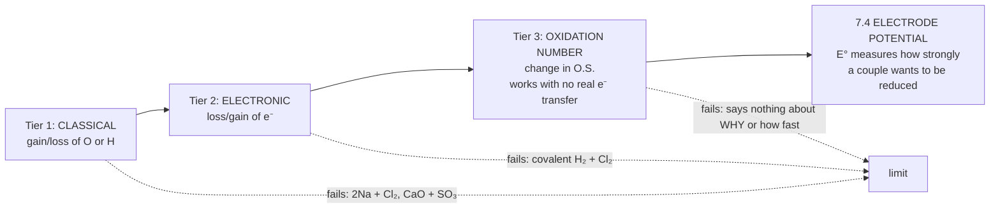
*Each tier widens the one before it; the dotted arrows are where each tier breaks down (§1, §2, §13).*

## 1. Classical idea: gain/loss of oxygen and hydrogen (7.1)

| Term | Classical definition (NCERT's widening sequence) |
|---|---|
| **Oxidation** | addition of **oxygen** → removal of **hydrogen** → addition of any **electronegative** element → removal of an **electropositive** element |
| **Reduction** | removal of **oxygen** → addition of **hydrogen** → removal of an **electronegative** element → addition of an **electropositive** element |

NCERT's own examples:

- $\ce{2Mg + O2  ->  2MgO}$ — Mg oxidised       (O added)
- $\ce{CH4 + 2O2  ->  CO2 + 2H2O}$ — CH₄ oxidised      (H replaced by O)
- $\ce{2H2S + O2  ->  2S + 2H2O}$ — H₂S oxidised      (H removed)
- $\ce{Mg + F2 -> MgF2}$ and $\ce{Mg + S -> MgS}$ — Mg oxidised (electronegative element added)
- $\ce{2HgO  ->  2Hg + O2}$ — HgO reduced       (O removed)
- $\ce{2FeCl3 + H2  ->  2FeCl2 + 2HCl}$ — FeCl₃ reduced     (electronegative Cl removed)
- $\ce{CH2=CH2 + H2 -> CH3-CH3}$ — ethene reduced (H added)
- $\ce{2HgCl2 + SnCl2 -> Hg2Cl2 + SnCl4}$ — HgCl₂ reduced (electropositive Hg added)
- SnCl₂ oxidised    (electronegative Cl added)


**Etymology:** *reduction* comes from Latin *reducere*, "to lead back": the ore is led back to
the metal (and it loses mass as oxygen leaves).

> **⚠ Where tier 1 fails:** in $\ce{2Na + Cl2  ->  2NaCl}$ there is no oxygen or hydrogen at all, yet it
> is redox. And the reverse error: $\ce{CaO + SO3  ->  CaSO4}$ "adds oxygen" to CaO but is **not redox**
> (no O.S. changes). "Oxygen moved, so it must be redox" is a **wrong** argument.

## 2. Electronic concept: electron transfer (7.2)

| Term | Electronic definition |
|---|---|
| **Oxidation** | **loss** of electrons → species becomes more positive |
| **Reduction** | **gain** of electrons → species becomes less positive |
| **Oxidant (oxidising agent)** | electron **acceptor** → is itself **reduced** |
| **Reductant (reducing agent)** | electron **donor** → is itself **oxidised** |

NCERT's model reaction, $\ce{2Na + Cl2  ->  2NaCl}$, split into halves:

- $\ce{2Na(s)  ->  2Na^{+}(g) + 2e^{-}}$ — oxidation half   (Na is the REDUCTANT)
- $\ce{Cl2(g) + 2e^{-}  ->  2Cl^{-}(g)}$ — reduction half   (Cl₂ is the OXIDANT)


The classic JEE illustration, `FeCl₃ + KI`:

- **Molecular:** $\ce{2FeCl3 + 2KI -> 2FeCl2 + I2 + 2KCl}$
- **Net ionic (write this first):** $\ce{2Fe^{3+} + 2I^- -> 2Fe^{2+} + I2}$
- I⁻ loses one electron per ion: **reductant**, oxidised.
- Fe³⁺ gains one electron: **oxidant**, reduced.

`CuSO₄ + KI` (NCERT eq. 7.59), the one students get wrong because a **precipitate** also forms:

- $\ce{2Cu^{2+} + 4I^- -> Cu2I2(s) + I2}$
- Cu²⁺ → Cu⁺: reduced (blue solution → white CuI precipitate).
- I⁻ → ½I₂: oxidised (brown liberated iodine).

> **⚠ Mnemonics that never fail:** **OIL RIG** (Oxidation Is Loss, Reduction Is Gain) and
> **"the agent is named for what it *does*, not for what happens to it"**: the oxidant *is
> reduced*, the reductant *is oxidised*. Half the objective questions are just this swap.

**Both halves happen together.** Electrons cannot float free in solution, so e⁻ lost = e⁻ gained.
This electron book-keeping powers every titration calculation in §12.

## 3. Competitive electron transfer — who wins? (7.2.1)

NCERT's experiment (Fig. 7.1), the **origin of the electrochemical series**:

```
   Beaker A: Zn strip in Cu(NO₃)₂(aq)      Beaker B: Cu strip in Zn²⁺(aq)
   ┌──────────────────────────────┐        ┌──────────────────────────────┐
   │ blue colour fades            │        │ no change                    │
   │ Zn dissolves, red Cu coats   │        │ Cu cannot push e⁻ onto Zn²⁺  │
   │ the strip (redox occurs)     │        │                              │
   └──────────────────────────────┘        └──────────────────────────────┘
   Zn + Cu²⁺ → Zn²⁺ + Cu      ✔ spontaneous  (Zn is the better reductant)   NCERT eq. 7.15
   Cu + Zn²⁺ → no reaction    ✘
```

General form: $\ce{M1 + N^{2+}  ->  M1^{2+} + N}$ occurs **only if M₁ loses electrons more readily than N**.
One reaction ranks two metals; pairwise tests build the activity series:

```
   reducing strength (tendency to lose e⁻) falls  ───────────────────────────────►
   Li > K > Ba > Ca > Na > Mg > Al > Mn > Zn > Cr > Fe > Co > Ni > Sn > Pb > (H₂)
      > Cu > Ag ≈ Hg > Pt > Au
```

Same logic for **non-metals**, the halogens:

- $\ce{Cl2 + 2Br^{-}  ->  2Cl^{-} + Br2}$ — ✔   ⇒ oxidising power Cl₂ > Br₂
- $\ce{Br2 + 2I^{-}   ->  2Br^{-} + I2}$ — ✔   ⇒ oxidising power Br₂ > I₂
- ∴ oxidising power:            F₂ > Cl₂ > Br₂ > I₂
- reducing power of halides:  I⁻ > Br⁻ > Cl⁻ > F⁻   (reverse!)


The same ladder decides whether Fe²⁺ can be oxidised:

- ✔ $\ce{2Fe^{2+} + Br2 -> 2Fe^{3+} + 2Br^-}$ — Br₂ is strong enough.
- ✘ Fe²⁺ + I₂: **no reaction**; instead Fe³⁺ oxidises I⁻.

> **⚠ Rule:** **stronger reductant + stronger oxidant → weaker reductant + weaker oxidant.**
> Every spontaneous displacement runs "downhill" on both ladders at once. If a proposed
> reaction puts a strong reductant on the product side, reject it.

## 4. Oxidation number: definition and the rule set (7.3)

**Oxidation number (O.N.)** is the *apparent* charge an atom carries **after every shared
electron pair is assigned to the more electronegative partner**. It is a book-keeping charge,
not a measured one: NCERT says it is used "to keep track of electrons" (see §13).

So **oxidation = increase in O.N.; reduction = decrease in O.N.**, and a reaction is redox
if and only if at least one element's O.N. rises while another's falls.

### The rules (apply in this order: a later rule never overrides an earlier one)

| # | Rule | Notes / examples |
|---|---|---|
| 1 | Free element (any allotrope) = **0** | Na, H₂, O₂, O₃, P₄, S₈, Cl₂, graphite |
| 2 | Monoatomic ion = its charge | Na⁺ +1, Al³⁺ +3, N³⁻ −3, Fe³⁺ +3 |
| 3 | **Fluorine = −1** in every compound | OF₂: O = **+2** · O₂F₂: O = **+1** · ClF₃: Cl +3 |
| 4 | **Group 1 = +1, Group 2 = +2** in compounds | Li₃N: Li +1, N −3 |
| 5 | **H = +1** with non-metals; **−1** in metal hydrides | HCl +1 · NaH, CaH₂, LiAlH₄, NaBH₄: H −1 |
| 6 | **O = −2** normally | peroxide −1 · superoxide −½ · ozonide −⅓ · OF₂ +2 |
| 7 | Sum of O.N. = **charge on the species** | neutral → 0; ion → its charge |
| 8 | An **X–X bond** contributes 0 to each atom | S₈: 0 · O–O in H₂O₂ ⇒ O = −1 |
| 9 | More electronegative atom takes the pair | **NCl₃**: N **−3**, Cl **+1** (see box) |
| 10 | Everything else: solve with rule 7 | MnO₄⁻ +7 · MnO₄²⁻ +6 · MnO₂ +4 · Cr₂O₇²⁻ +6 |

> **⚠ Rule 9 trap, NCl₃:** the reflex "Cl is always −1" fails here, and the electronegativity
> scales disagree: Pauling puts Cl (3.16) slightly above N (3.04), while Allred–Rochow puts N
> (3.07) well above Cl (2.83). JEE settles it with the chemistry: hydrolysis gives
> $\ce{NCl3 + 3H2O  ->  NH3 + 3HOCl}$, **with no O.S. changes**, so N is **−3** and Cl **+1**. (Contrast
> PCl₃ → H₃PO₃ + HCl, where P is +3 and Cl is −1.)

### Fixed-value ions worth knowing cold

| Element | Common species | The tricky ones |
|---|---|---|
| N | NO₃⁻ +5 · NO₂⁻ +3 · NH₄⁺ −3 | NH₂OH −1 · N₂H₄ −2 · HN₃ −⅓ (avg) |
| S | SO₄²⁻ +6 · SO₃²⁻ +4 · H₂S −2 | S₂O₃²⁻ +2 (avg) · S₄O₆²⁻ +2.5 (avg) |
| Cl | ClO⁻ +1 · ClO₃⁻ +5 · ClO₄⁻ +7 | ClO₂⁻ +3 · ClO₂ +4 |
| C | CO₃²⁻ +4 · HCO₃⁻ +4 · CO +2 | C₂O₄²⁻ +3 · CN⁻ C +2, N −3 |
| P | PO₄³⁻ +5 · HPO₄²⁻ +5 | H₂PO₂⁻ +1 · HPO₃²⁻ +3 |
| Mn, Cr, Fe | MnO₄⁻ +7 · Cr₂O₇²⁻ +6 | [Fe(CN)₆]⁴⁻ +2 · [Fe(CN)₆]³⁻ +3 · FeO₄²⁻ +6 |

> **⚠ The single most common error:** treating an *average* O.N. as if every atom carried it.
> `Na₂S₂O₃` → S = +2 on average, but structurally one S is **−2** and the other **+6** (§5).
> In the thiosulphate–iodine titration the *average* is what the electron count sees
> (+2 → +2.5 in S₄O₆²⁻), which is why `n = 1` per thiosulphate.

## 5. Assigning O.S. in the nasty species (the memorise-this list)

These are the JEE-standard "hard" species. **You must see the bonds, not just the formula.**
In every drawing below the **red numbers are oxidation states**, worked out from the bonds
(each bond's electrons go to the more electronegative atom; bonds between like atoms count 0).
O at the ordinary −2 and H at +1 are left unlabelled, so every red number is something to learn.

**Peroxide and superoxide oxygen: O is not −2**

| H₂SO₅ · S +6 | H₂S₂O₈ · S +6 | CrO₅ · Cr +6 | KO₂ · O −½ avg |
|---|---|---|---|
| 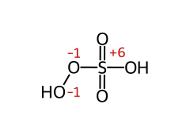 | 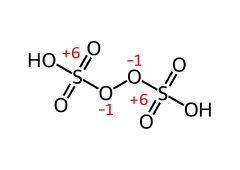 | 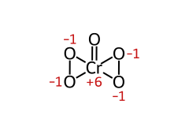 | 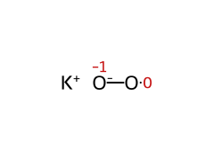 |

**Contrast: no O–O bond, and oxygen made positive by fluorine**

| H₂S₂O₇ · S +6 | Cr₂O₇²⁻ · Cr +6 | OF₂ · O +2 | O₂F₂ · O +1 |
|---|---|---|---|
| 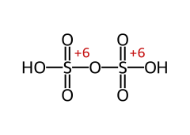 | 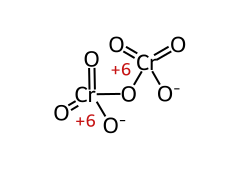 | 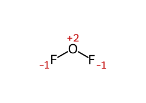 | 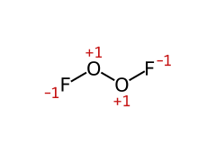 |

**One element, inequivalent atoms: the average hides them**

| S₂O₃²⁻ · +6, −2 (avg +2) | S₄O₆²⁻ · +5, 0 (avg +2.5) | HN₃ · −1, +1 (avg −⅓) | I₃⁻ · 0, −1 (avg −⅓) |
|---|---|---|---|
| 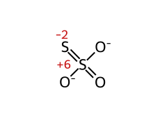 | 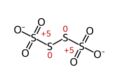 | 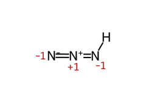 | 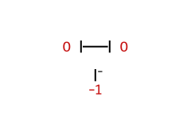 |

**Two environments of one element, and a hydride**

| NH₄NO₃ · N −3 and +5 | CaOCl₂ · Cl +1 and −1 | NaBH₄ · B +3, H −1 |
|---|---|---|
| 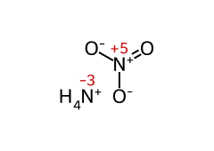 | 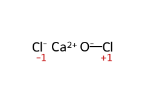 | 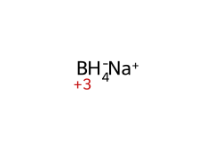 |

**Phosphorus oxyacids: count the P–H bonds (they are not acidic)**

| H₃PO₂ · P +1 · monobasic | H₃PO₃ · P +3 · dibasic | H₃PO₄ · P +5 · tribasic |
|---|---|---|
| 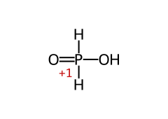 | 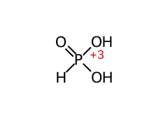 | 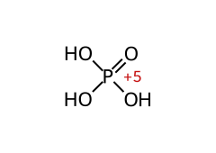 |

| H₄P₂O₅ · P +3 (P–O–P) | H₄P₂O₆ · P +4 (P–P) | H₄P₂O₇ · P +5 (P–O–P) |
|---|---|---|
| 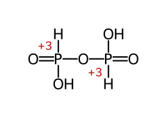 | 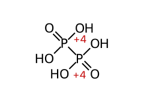 | 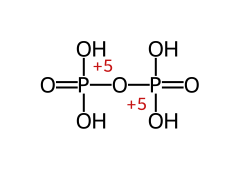 |

*Generated from [`figures/structures.md`](figures/structures.md) by `scripts/render_structures.py`
(RDKit), which also checks every value against that table. Each SVG carries its molfile, so in
Obsidian the **ChemEdit** plugin opens it in the Ketcher editor; the same file also has a live
**Chem** gallery (rulebook R18–R19).*

The arithmetic that proves the peroxide cases:

```
H₂SO₅   2H(+1) + S + 3O(−2) + 2O(−1, peroxide) = 0   ⇒ S = +6   (blind "all O = −2" gives +8: impossible)
H₂S₂O₈  2H(+1) + 2S + 6O(−2) + 2O(−1)          = 0   ⇒ S = +6   (not +7)
CrO₅    Cr + 1O(−2) + 4O(−1)                   = 0   ⇒ Cr = +6  (not +10)
```

| Species | O.S. of the marked element | Why (the point of the question) |
|---|---|---|
| `Na₂S₂O₃` S | **+2 avg** (−2, +6) | non-equivalent S atoms |
| `Na₂S₄O₆` S | **+2.5 avg** (0, +5) | S–S bonds contribute 0 |
| `H₂SO₅`, `H₂S₂O₈` S | **+6** | peroxide O = −1 |
| `CrO₅` Cr | **+6** | four peroxide O |
| `KI₃` I | **−⅓ avg** (0, 0, −1) | I₃⁻ = I₂ + I⁻ (NCERT Ex. 7.2) |
| `HN₃` N | **−⅓ avg** | fractional values are allowed |
| `NH₂OH` N | **−1** | O takes N's pair; H gives N its pair |
| `N₂H₄` N | **−2** | N–N bond contributes 0 |
| `NH₄NO₃` N | **−3 and +5** (avg +1) | two N in different environments ⚠ |
| `Fe₃O₄` Fe | **+8⁄3 avg** (+2, +3, +3) | it is `FeO·Fe₂O₃` |
| `Mn₃O₄` Mn | **+8⁄3 avg** (+2, +3, +3) | `MnO·Mn₂O₃` |
| `Pb₃O₄` Pb | **+8⁄3 avg** (+2, +2, +4) | `2PbO·PbO₂` (NCERT Problem 7.7) |
| `KO₂` O | **−½** | superoxide: one unpaired e⁻, paramagnetic |
| `O₂F₂` / `OF₂` O | **+1 / +2** | F always wins |
| `NO₂`, `N₂O₄` N | **+4** in both | odd-electron NO₂ dimerises |
| `NO⁺` / `NO⁻` N | **+3 / +1** | the species charge is not zero |
| `ClO₂` / `ClO₂⁻` / `ClO₂⁺` Cl | **+4 / +3 / +5** | same formula, different charge |
| `C₆H₁₂O₆` glucose C | **0 avg** | 6C + 12(+1) + 6(−2) = 0 |
| `C₁₂H₂₂O₁₁` sucrose C | **0 avg** | same book-keeping as glucose |
| `C₆H₆` benzene C | **−1** | each C carries one H |
| `CH₃CH₂OH` C | **−3 and −1** (avg −2) | NCERT Ex. 7.2 |
| `CH₃COOH` C | **−3 and +3** (avg 0) | NCERT Ex. 7.2 |
| `CaOCl₂` Cl | **+1 and −1** | it is `Ca(OCl)Cl`: mixed, not +0 avg |
| `Mg₂Si` Si | **−4** | the metal is the electropositive partner |
| `Na₂[Fe(CN)₅NO]` Fe | **+2** (NO as NO⁺) | 2(+1) + Fe + 5(−1) + (+1) = 0 |
| `H₂[PdCl₄]` Pd | **+2** | rule 7 on the complex ion |
| `K₂HPO₃` P | **+3** | phosphorous acid is dibasic (one P–H) |
| `H₃PO₂ / H₃PO₃ / H₃PO₄` P | **+1 / +3 / +5** | basicity 1 / 2 / 3 as well |
| `H₄P₂O₅` pyrophosphorous P | **+3** | P–O–P bridge, two P–H |
| `H₄P₂O₆` hypophosphoric P | **+4** | a **P–P** bond, contributes 0 |
| `H₄P₂O₇` pyrophosphoric P | **+5** | NCERT Ex. 7.1 |
| `NaBH₄` / `LiAlH₄` | B / Al **+3**, H **−1** | hydrides |
| `Al₄C₃` / `CaC₂` C | **−4** / **−1** | methide / acetylide `[C≡C]²⁻` |
| `FeO₄²⁻` ferrate Fe | **+6** | very strong oxidant |
| `XeF₂ / XeF₄ / XeF₆` Xe | **+2 / +4 / +6** | hydrolysis gives XeO₃ (+6) |
| `Na₄XeO₆` perxenate Xe | **+8** | oxidises F⁻ to F₂ (NCERT Ex. 7.16) |

> **⚠ The brown-ring complex `[Fe(H₂O)₅NO]²⁺`:** the JEE/NCERT-era answer is **Fe +1 with
> NO⁺**. It forms from Fe²⁺ + neutral NO, so an electron has moved from NO to Fe: that step
> *is* redox. (Spectroscopy suggests Fe(III)–NO⁻ instead; in an exam, write +1.) Contrast
> nitroprusside, `[Fe(CN)₅NO]²⁻`, where Fe is +2 with NO⁺.

> **⚠ Structural O.S. vs algebraic average: when each is asked**
> "Find the oxidation number of S in Na₂S₂O₃" → **+2 (average)**, the NCERT answer.
> "Find the oxidation states of the two sulphur atoms" → **−2 and +6**. This split is a
> convention: strict bond-counting gives +4/0 on the S=S Lewis structure and +5/−1 on the
> S–S⁻ one, while only the average +2 is the same in every structure. JEE keys use −2/+6.
> For **balancing** and **equivalent weights**, use the *average*: electrons are counted for
> the whole formula unit.

### O.S. of carbon in organic molecules (NCERT Ex. 7.2, 7.7, 7.12, 7.13)

Organic redox is asked **per carbon**, not per molecule. For one carbon atom, add:

| Bond from that carbon to… | Contribution to its O.S. |
|---|---|
| H | **−1** per bond (C is more electronegative) |
| O, N, halogen | **+1 per bond** (C=O counts **+2**, C≡N **+3**) |
| another C | **0** |
| a formal charge on that C | add it (a carbanion C⁻ gets −1 extra) |

**The one-carbon ladder: each step up is a 2-electron oxidation**

| CH₄ · C −4 | CH₃OH · C −2 | HCHO · C 0 | HCOOH · C +2 | CO₂ · C +4 |
|---|---|---|---|---|
| 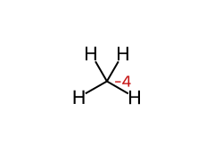 | 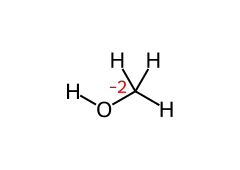 | 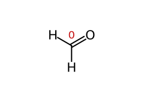 | 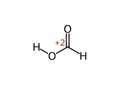 | 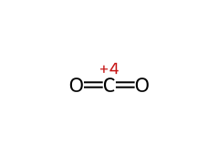 |
| alkane | alcohol | aldehyde | carboxylic acid | fully oxidised |

Burning methane climbs the whole ladder at once: C −4 → +4, **8 e⁻ per carbon**. Reading the
ladder backwards gives the reductions: LiAlH₄ takes an acid to a primary alcohol (+3 → −1 for
the functional C in RCOOH → RCH₂OH).

**Three NCERT reactions, carbon by carbon**

| Reaction | Before | After | What changed |
|---|---|---|---|
| Ethanol → acetic acid by acidified dichromate (orange → green, the old breathalyser test) | 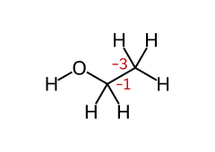 | 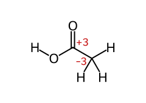 | CH₂OH carbon −1 → +3 (**4 e⁻**); CH₃ stays −3. $\ce{3CH3CH2OH + 2Cr2O7^{2-} + 16H^{+}  ->  3CH3COOH + 4Cr^{3+} + 11H2O}$ |
| Toluene → benzoate by alkaline KMnO₄ (NCERT Ex. 7.12a) | 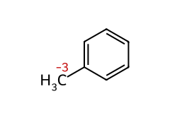 | 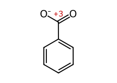 | CH₃ carbon −3 → +3 (**6 e⁻**); ring C unchanged. Two MnO₄⁻ (+7 → +4, 3 e⁻ each) supply them |
| Hydroquinone → p-benzoquinone, the photographic developer (NCERT Ex. 7.13a) | 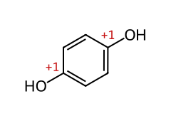 | 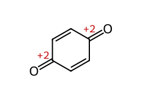 | the two C–O carbons +1 → +2 (**2 e⁻** in total), which reduce 2Ag⁺ (from AgBr) to 2Ag |

> **Shortcut for any CₓHᵧO_z species of charge q:** the sum of the carbon O.S. is
> **q − y + 2z**. So between two compounds, electrons lost = (H removed) + 2 × (O added) −
> (extra negative charge). Check: toluene C₇H₈ → benzoate C₇H₅O₂⁻ gives 3 + 4 − 1 = **6 e⁻**.
> Glucose C₆H₁₂O₆: 0 − 12 + 12 = 0, so the average C is **0**.

> **⚠ Average vs individual carbon:** ethanol's average C is −2 and acetic acid's is 0, a
> change of +2 *per carbon* but **+4 per molecule**, all on one carbon. Use the per-molecule
> figure (4) as the n-factor, never the per-carbon average (§11).

## 6. Oxidation number ≠ formal charge ≠ real charge 🆇

| Aspect | Oxidation number | Formal charge | Actual (partial) charge |
|---|---|---|---|
| Rule | bonding pairs → **more EN atom, entirely** | bonding pairs → **split equally** | from experiment / calculation |
| Needs EN? | yes | no | — |
| Example: CO | C **+2**, O **−2** | C **−1**, O **+1** | small dipole, C end slightly negative |
| Used for | redox book-keeping | best Lewis structure | reactivity, dipoles |

```
   CO:   :C≡O:     formal charge  C(−1) O(+1)   → the lone pair on C bonds to metals
                   O.N.           C(+2) O(−2)   → the number redox book-keeping uses
```

**Why JEE likes this:** in `Ni(CO)₄` and `Fe(CO)₅` the metal is at **0**, because CO is a
neutral ligand. O.N. can also be **negative** for a metal: `Na[Co(CO)₄]` (Co **−1**),
`Na₂[Fe(CO)₄]` (Fe **−2**). ⚠ "The O.S. of an element in a compound can be zero or fractional
but never…": no such limit exists. Carbonyls prove 0 and negative, `Fe₃O₄` proves fractional.

---

# Part B — Classifying and Balancing

## 7. Types of redox reactions (7.3.1)

NCERT sorts redox reactions into **four** categories. JEE Advanced also uses two extra lenses
(🆇), shown dotted:

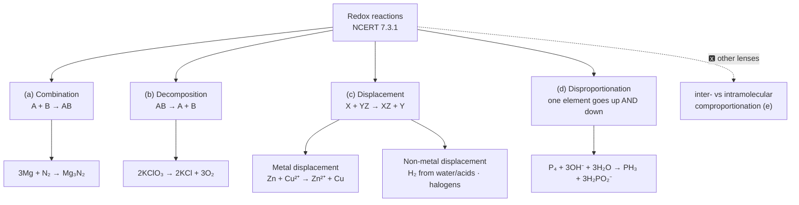
*NCERT's four categories, each with the book's own example. The dotted branch is extra
vocabulary JEE Advanced also uses (§7e).*

### (a) Combination: A + B → C

Redox **only if A or B (or both) is an element**. Every combustion in O₂ qualifies:

- $\ce{C + O2  ->  CO2}$ — C 0 → +4
- $\ce{3Mg + N2  ->  Mg3N2}$ — Mg 0 → +2, N 0 → −3
- $\ce{CH4 + 2O2  ->  CO2 + 2H2O}$ — C −4 → +4


### (b) Decomposition: C → A + B

Redox **only if at least one product is an element**:

- $\ce{2H2O  ->  2H2 + O2}$ — H +1 → 0, O −2 → 0
- $\ce{2NaH  ->  2Na + H2}$ — Na +1 → 0, H −1 → 0
- $\ce{2KClO3  ->  2KCl + 3O2}$ — Cl +5 → −1, O −2 → 0
- $\ce{2Pb(NO3)2  ->  2PbO + 4NO2 + O2}$ — N +5 → +4, O −2 → 0        (NCERT Problem 7.6)
  (NH₄)₂Cr₂O₇ → N₂ + 4H₂O + Cr₂O₃ N −3 → 0, Cr +6 → +3      (the "volcano" demo)


> **⚠ Not every decomposition is redox:** $\ce{CaCO3  ->  CaO + CO2}$ has no O.S. change at all.

### (c) Displacement: X + YZ → XZ + Y

**Metal displacement** (the basis of much metallurgy):

- $\ce{CuSO4 + Zn  ->  Cu + ZnSO4}$ — (NCERT eq. 7.29)
- $\ce{V2O5 + 5Ca  ->  2V + 5CaO}$
- $\ce{TiCl4 + 2Mg  ->  Ti + 2MgCl2}$ — (Kroll process)
- $\ce{Cr2O3 + 2Al  ->  Al2O3 + 2Cr}$ — (thermite / aluminothermy)


**Non-metal displacement**, mostly hydrogen and halogens:

- $\ce{2Na + 2H2O -> 2NaOH + H2}$ — cold water; very active metal
- $\ce{Mg + 2H2O -> Mg(OH)2 + H2}$ — hot water; less active metals need heat/steam
- $\ce{3Fe + 4H2O -> Fe3O4 + 4H2}$ — steam; ⚠ NCERT eq. 7.36 writes Fe₂O₃; the real product is Fe₃O₄
- ✔ $\ce{Zn + 2HCl -> ZnCl2 + H2}$; ✘ Cu + HCl: no reaction (Cu is below H₂).
- ✔ $\ce{Cl2 + 2KBr -> 2KCl + Br2}$; ✘ Br₂ + KCl: no reaction.
- $\ce{2F2 + 2H2O  ->  4HF + O2}$ — F₂ displaces O from water itself


> **⚠ Why F₂ cannot be used to displace Cl⁻/Br⁻ from their aqueous salts** (NCERT): it
> attacks the **water** first (last line above). The halide displacement order is therefore
> quoted from Cl₂ downwards.

### (d) Disproportionation: the ⭐ of JEE

One element in an **intermediate** O.S. rises and falls at the same time:

**Obsidian reaction view:** [rendered equations, one per screen](figures/reactions.md). Reactions throughout this chapter now use Obsidian’s built-in typesetting; GitHub may show
`\ce` as source code.

- **Hydrogen peroxide:** $\ce{2H2O2  ->  2H2O + O2}$
  - **O.S.:** O: −1 → −2 and 0.
- **Phosphorus in alkali:** $\ce{P4 + 3OH^{-} + 3H2O  ->  PH3 + 3H2PO2^{-}}$
  - **O.S.:** P: 0 → −3 and +1. *(NCERT eq. 7.46; ⚠ classic)*
- **Sulphur in alkali:** $\ce{S8 + 12OH^{-}  ->  4S^{2-} + 2S2O3^{2-} + 6H2O}$
  - **O.S.:** S: 0 → −2 and +2 **on average** in thiosulphate. *(NCERT eq. 7.47)*
- **Chlorine in cold alkali:** $\ce{Cl2 + 2OH^{-}  ->  Cl^{-} + ClO^{-} + H2O}$
  - **O.S.:** Cl: 0 → −1 and +1. *(NCERT eq. 7.48)*
- **Chlorine in hot alkali:** $\ce{3Cl2 + 6OH^{-}  ->  5Cl^{-} + ClO3^{-} + 3H2O}$
  - **O.S.:** Cl: 0 → −1 and +5.
- **Hypochlorite on standing/heating:** $\ce{3ClO^{-}  ->  ClO3^{-} + 2Cl^{-}}$
  - **O.S.:** Cl: +1 → +5 and −1.
- **Chlorate:** $\ce{4ClO3^{-}  ->  Cl^{-} + 3ClO4^{-}}$
  - **O.S.:** Cl: +5 → −1 and +7. *(NCERT Problem 7.5)*
- **Copper(I):** $\ce{2Cu^{+}  ->  Cu^{2+} + Cu}$
  - **O.S.:** Cu: +1 → +2 and 0. *(E° 0.52 > 0.15 V; §17)*
- **Manganate(VI) in acid:** $\ce{3MnO4^{2-} + 4H^{+}  ->  2MnO4^{-} + MnO2 + 2H2O}$
  - **O.S.:** Mn: +6 → +7 and +4.
- **Manganese(III):** $\ce{2Mn^{3+} + 2H2O  ->  Mn^{2+} + MnO2 + 4H^{+}}$
  - **O.S.:** Mn: +3 → +2 and +4. *(NCERT Ex. 7.21)*
- **Nitrogen dioxide in alkali:** $\ce{2NO2 + 2OH^{-}  ->  NO2^{-} + NO3^{-} + H2O}$
  - **O.S.:** N: +4 → +3 and +5. *(NCERT Problem 7.6)*
- **Nitrogen dioxide in water:** $\ce{3NO2 + H2O  ->  2HNO3 + NO}$
  - **O.S.:** N: +4 → +5 and +2.
- **Chlorine dioxide in alkali:** $\ce{2ClO2 + 2OH^{-}  ->  ClO2^{-} + ClO3^{-} + H2O}$
  - **O.S.:** Cl: +4 → +3 and +5.
- **Cyanogen in alkali:** $\ce{(CN)2 + 2OH^{-}  ->  CN^{-} + CNO^{-} + H2O}$
  - **O.S.:** C: +3 → +2 and +4. *(NCERT Ex. 7.20)*

**Who *cannot* disproportionate (NCERT Problem 7.5):** a species already at its **highest**
or **lowest** O.S. `ClO₄⁻` (Cl +7) cannot, while ClO⁻, ClO₂⁻ and ClO₃⁻ can. **Fluorine**
cannot either, having no positive O.S. to rise to: $\ce{2F2 + 2OH^{-}  ->  2F^{-} + OF2 + H2O}$ (NCERT
eq. 7.49) is plain reduction of F (O goes −2 → +2), not disproportionation.

### (e) 🆇 Two more lenses JEE Advanced uses

| Lens | Meaning | Example |
|---|---|---|
| **Intermolecular** | oxidant and reductant are **different species** | $\ce{2KMnO4 + 16HCl  ->  2KCl + 2MnCl2 + 5Cl2 + 8H2O}$ |
| **Intramolecular** | oxidised and reduced atoms sit in the **same formula unit** (but are *different* elements) | $\ce{2KClO3  ->  2KCl + 3O2}$ · $\ce{(NH4)2Cr2O7  ->  N2 + Cr2O3 + 4H2O}$ |
| **Comproportionation** (synproportionation) | reverse of disproportionation: two O.S. of one element → one intermediate | see below |

- $\ce{2H2S + SO2  ->  3S + 2H2O}$ — S −2 and +4 → 0
- $\ce{NH4NO2  ->  N2 + 2H2O}$ — N −3 and +3 → 0   (also intramolecular)
- $\ce{NO + NO2 + H2O  ->  2HNO2}$ — N +2 and +4 → +3
- $\ce{IO3^{-} + 5I^{-} + 6H^{+}  ->  3I2 + 3H2O}$ — I +5 and −1 → 0   (the iodate standard, §12c)
- $\ce{3Mn^{2+} + 2MnO4^{-} + 2H2O  ->  5MnO2 + 4H^{+}}$ — Mn +2 and +7 → +4
- $\ce{Cl^{-} + ClO^{-} + 2H^{+}  ->  Cl2 + H2O}$ — Cl −1 and +1 → 0


> **⚠ Two consequences asked as "reason" questions:** (1) the Mn²⁺ + MnO₄⁻ reaction is why a
> permanganate titration with **too little acid** turns turbid brown (MnO₂) instead of
> colourless; (2) the Cl⁻ + ClO⁻ reaction is why **bleach + acid releases toxic Cl₂**.

> **⚠ Not every combination/decomposition is redox:** $\ce{CaO + CO2  ->  CaCO3}$ ✘,
> $\ce{NH3 + HCl  ->  NH4Cl}$ ✘, $\ce{CaCO3  ->  CaO + CO2}$ ✘, but $\ce{2HI  ->  H2 + I2}$ ✔ (H +1 → 0, I −1 → 0).
> **Check the O.N., not the pattern** (sieve in §20, P6).

## 8. Oxidising and reducing agents from oxidation states

**The master rule (this single line answers a dozen questions):**

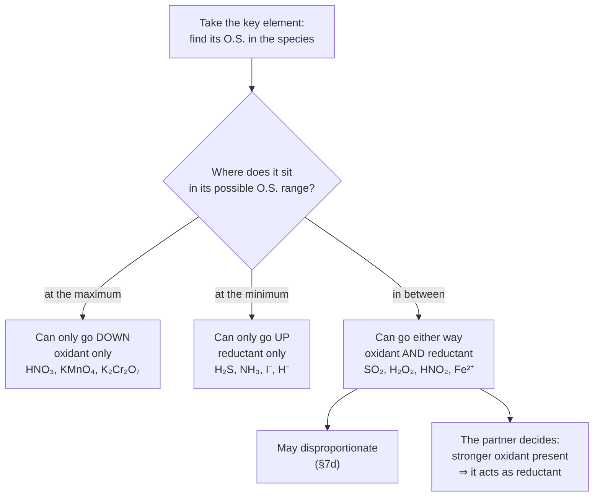
*Position in the O.S. range decides the possible roles; E° (§15) decides which role actually
happens with a given partner.*

| Element (O.S. range) | Only reductant | Both | Only oxidant |
|---|---|---|---|
| **S** (−2 … +6) | H₂S, S²⁻ | S, SO₂, SO₃²⁻, HSO₃⁻, S₂O₃²⁻ | H₂SO₄ (conc.), SO₃ · peroxo S₂O₈²⁻ (via its O–O) |
| **N** (−3 … +5) | NH₃, NH₄⁺, N³⁻ | N₂, NO, HNO₂, NO₂, N₂O₄ | HNO₃, NO₃⁻, N₂O₅ |
| **Cl** (−1 … +7) | HCl, Cl⁻ | Cl₂, HOCl, HClO₂, ClO₃⁻ | HClO₄, ClO₄⁻ |
| **O** (−2 … +2) | H₂O, O²⁻ (weakly) | H₂O₂, O₂²⁻ | O₃ in practice (only F can oxidise O) |
| **Fe** (0 … +3; +6 rare) | Fe | Fe²⁺ | Fe³⁺ · FeO₄²⁻ (+6, very strong) |
| **Mn** (0 … +7) | Mn | Mn²⁺ (weak reductant), MnO₂, MnO₄²⁻ | **MnO₄⁻** |
| **Sn** (0 … +4) | Sn | Sn²⁺ (good reductant) | Sn⁴⁺ (weak) |
| **I** (−1 … +7) | I⁻, HI | I₂, IO₃⁻ | IO₄⁻, H₅IO₆ |

Consequences NCERT and JEE both drill:

- **Why SO₂ and H₂O₂ are both, but O₃ and HNO₃ only oxidants** (NCERT Ex. 7.8): S (+4) and
  O (−1) are intermediate. N in HNO₃ is at its maximum (+5). O in O₃ is formally 0, but
  oxygen can only be driven positive by fluorine, so ozone behaves as an oxidant only.
- **SO₂** decolourises acidified KMnO₄ and turns K₂Cr₂O₇ orange → green (as **reductant**,
  S +4 → +6), yet with H₂S it is the **oxidant** ($\ce{SO2 + 2H2S  ->  3S + 2H2O}$).
- **H₂O₂** is an oxidant toward $\ce{PbS  ->  PbSO4}$, Fe²⁺, I⁻, NO₂⁻, SO₃²⁻, and a reductant toward
  MnO₄⁻, Cr₂O₇²⁻, O₃, Cl₂ and PbO₂ (`PbO₂ + H₂O₂ → PbO + H₂O + O₂↑`). It also
  **disproportionates** ($\ce{2H2O2  ->  2H2O + O2}$, E° = +1.10 V, §17): thermodynamically eager but
  kinetically slow, so MnO₂, light and dust catalyse it. Commercial H₂O₂ is stabilised (e.g.
  with acetanilide) and stored in dark, wax-lined bottles.
- **Conc. H₂SO₄** oxidises Cu, C, S, Br⁻ and I⁻, but **not** Fe/Al/Cr (a dense oxide film
  passivates them) and not Au/Pt. It cannot dry H₂S, HBr or HI, because they reduce it.
  **NCERT Ex. 7.12(b):** with a chloride it only gives **HCl** (Cl⁻ is too weak a reductant),
  with a bromide it gives **Br₂** ($\ce{2HBr + H2SO4  ->  Br2 + SO2 + 2H2O}$).
- **HNO₃** oxidises almost all metals except Au and Pt (aqua regia, 3HCl : 1HNO₃, needed).
  `Cu + HNO₃`: conc. → NO₂ (N +5 → +4); dilute → NO (+5 → +2); very dilute HNO₃ with Zn →
  NH₄NO₃ (+5 → −3, the **8-electron jump** behind "moles of HNO₃ reduced" questions).
- **HCl is a reductant, never a safe acid for KMnO₄:** its Cl⁻ is oxidised to Cl₂, consuming
  permanganate (§12a).
- ⚠ **FeI₃ does not exist** (Fe³⁺ oxidises I⁻, §16), whereas FeBr₃ does. **CuI₂ does not
  exist** either ($\ce{2Cu^{2+} + 4I^{-}  ->  2CuI + I2}$), while CuCl₂ and CuBr₂ do. **AgF₂** (Ag²⁺) is a
  monster oxidant, while AgF is stable (NCERT Ex. 7.10).
- **Excess reagent decides the product** (NCERT Ex. 7.11): **excess reductant** pushes the
  oxidant to its **lowest** accessible O.S.; **excess oxidant** pushes the reductant to its
  **highest**.
  - $\ce{2HgCl2 + SnCl2  ->  Hg2Cl2 + SnCl4}$ (limited SnCl₂: Hg stops at +1), but with excess SnCl₂,
    $\ce{Hg2Cl2 + SnCl2  ->  2Hg + SnCl4}$ (down to 0).
  - `P + Cl₂`: limited Cl₂ → PCl₃, excess → PCl₅. `C + O₂`: limited O₂ → CO, excess → CO₂.
  - ⚠ **Ceiling set by E°, not stoichiometry:** `Fe + I₂` gives **FeI₂ only**, however much
    I₂ is used, because I₂ (0.54 V) cannot push Fe²⁺ to Fe³⁺ (0.77 V).

> **⚠ Halogens + alkali: which product?**
> **Cl₂:** cold, dilute → Cl⁻ + ClO⁻; hot, concentrated → Cl⁻ + ClO₃⁻.
> **Br₂:** hypobromite survives only near 0 °C; at room temperature it goes on to BrO₃⁻.
> **I₂:** hypoiodite IO⁻ disproportionates almost instantly at any temperature, so the product
> is iodate directly: $\ce{3I2 + 6OH^{-}  ->  5I^{-} + IO3^{-} + 3H2O}$.
> **F₂:** cannot disproportionate (no positive O.S.); it gives OF₂ or O₂ (§7d).

## 9. Balancing by the oxidation-number method (7.3.2 a)

Which method should you use? Both work; the choice is about speed and safety:

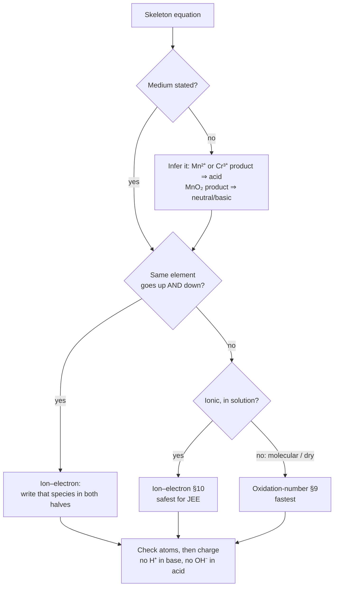
*Both methods must give the same equation; the final atom-and-charge check is not optional.*

**NCERT's steps for the O.N. method:**

1. Write the skeleton (ionic form where possible) and assign O.N. to every atom.
2. Identify the element oxidised and the element reduced.
3. Compute the O.N. change **per formula unit** (multiply by the number of those atoms in it).
4. Cross-multiply so that the total increase equals the total decrease.
5. Balance **charge** with H⁺ (acid) or OH⁻ (base).
6. Balance **H** with H₂O, then check O. A redox equation that balances atoms but not charge
   is wrong.

**Worked: NCERT Problem 7.8 (acid), dichromate + sulphite:**

- **Skeleton:** $\ce{Cr2O7^{2-} + SO3^{2-} -> Cr^{3+} + SO4^{2-}}$
- Cr: +6 → +3; decrease 3 × 2 Cr = 6 per dichromate.
- S: +4 → +6; increase 2 per sulphite. Ratio: 1 Cr₂O₇²⁻ : 3 SO₃²⁻.
- Charge: LHS −8, RHS 0; add 8H⁺ on the left, then 4H₂O on the right.
- **Balanced:** $\ce{Cr2O7^{2-} + 3SO3^{2-} + 8H^+ -> 2Cr^{3+} + 3SO4^{2-} + 4H2O}$
- Check: Cr 2|2, S 3|3, O 16|16, H 8|8; charge 0|0.


**Worked: NCERT Problem 7.9 (base), permanganate + bromide:**

- $\ce{MnO4^{-} + Br^{-}  ->  MnO2 + BrO3^{-}}$
- Mn: +7 → +4   decrease 3
- Br: −1 → +5   increase 6                        ⇒ 2 MnO₄⁻ : 1 Br⁻
- charge: LHS −3, RHS −1  ⇒ add 2OH⁻ on the right; then 1H₂O on the left
- $\ce{2MnO4^{-} + Br^{-} + H2O  ->  2MnO2 + BrO3^{-} + 2OH^{-}}$
- atoms: O 8+1 = 9 | 4+3+2 = 9 · H 2|2 ✔   charge: −3 | −3 ✔


**For comparison, the reaction NCERT balances by the half-reaction method (eq. 7.50), done
here by O.N.:**

- $\ce{Fe^{2+} + Cr2O7^{2-}  ->  Fe^{3+} + Cr^{3+}}$ — (acid)
- Fe: +2 → +3 (increase 1); Cr: +6 → +3 (decrease 3 × 2). Ratio 6 Fe²⁺ : 1 Cr₂O₇²⁻.
- $\ce{6Fe^{2+} + Cr2O7^{2-} + 14H^{+}  ->  6Fe^{3+} + 2Cr^{3+} + 7H2O}$
  charge: 12 − 2 + 14 = +24 | 18 + 6 = +24 ✔


⚠ The O.N. method gets clumsy for **disproportionation** (the same species is both oxidant and
reductant): write it twice on the left, or switch to ion–electron.

## 10. Balancing by the ion–electron (half-reaction) method (7.3.2 b)

| Step | Acidic medium | Basic medium |
|---|---|---|
| 1 | Split into oxidation and reduction halves | same |
| 2 | Balance all atoms except O and H | same |
| 3 | O: add **H₂O** to the side short of O | same |
| 4 | H: add **H⁺** to the side short of H | same, **then** add as many OH⁻ as there are H⁺ to **both** sides; turn H⁺ + OH⁻ into H₂O |
| 5 | Charge: add **e⁻** to the more positive side | same |
| 6 | Multiply the halves so the e⁻ cancel; add them | same |
| 7 | Cancel common H₂O / H⁺; check atoms **and** charge | same; **no H⁺** may remain |

*NCERT Problem 7.10 uses exactly this basic-medium route (step 4).*

**Half-reaction bank: memorise these; they cover ~90 % of papers:**

| Half-reaction | Medium / role | e⁻ |
|---|---|---:|
| $\ce{MnO4^{-} + 8H^{+} + 5e^{-}  ->  Mn^{2+} + 4H2O}$ | acid | 5 |
| $\ce{MnO4^{-} + 2H2O + 3e^{-}  ->  MnO2 + 4OH^{-}}$ | neutral / faintly alkaline | 3 |
| $\ce{MnO4^{-} + e^{-}  ->  MnO4^{2-}}$ | strongly alkaline | 1 |
| $\ce{Cr2O7^{2-} + 14H^{+} + 6e^{-}  ->  2Cr^{3+} + 7H2O}$ | acid | 6 |
| $\ce{CrO4^{2-} + 4H2O + 3e^{-}  ->  Cr(OH)3 + 5OH^{-}}$ | alkaline | 3 |
| $\ce{H2O2 + 2H^{+} + 2e^{-}  ->  2H2O}$ | H₂O₂ as oxidant, acid | 2 |
| $\ce{HO2^{-} + H2O + 2e^{-}  ->  3OH^{-}}$ | H₂O₂ as oxidant, base | 2 |
| $\ce{H2O2  ->  O2 + 2H^{+} + 2e^{-}}$ | H₂O₂ as reductant | 2 |
| $\ce{O2 + 4H^{+} + 4e^{-}  ->  2H2O}$ | acid | 4 |
| $\ce{O2 + 2H2O + 4e^{-}  ->  4OH^{-}}$ | neutral/basic (corrosion) | 4 |
| $\ce{NO3^{-} + 4H^{+} + 3e^{-}  ->  NO + 2H2O}$ | dilute HNO₃ | 3 |
| $\ce{ClO^{-} + H2O + 2e^{-}  ->  Cl^{-} + 2OH^{-}}$ | bleach, base | 2 |
| $\ce{C2O4^{2-}  ->  2CO2 + 2e^{-}}$ | oxalate as reductant | 2 |
| $\ce{2I^{-}  ->  I2 + 2e^{-}}$ | iodide as reductant | 2 |
| $\ce{2S2O3^{2-}  ->  S4O6^{2-} + 2e^{-}}$ | thiosulphate + I₂ | 2 |
| $\ce{SO2 + 2H2O  ->  SO4^{2-} + 4H^{+} + 2e^{-}}$ | SO₂ as reductant | 2 |
| $\ce{Fe^{2+}  ->  Fe^{3+} + e^{-}}$ | ferrous as reductant | 1 |

**Worked, basic medium: NCERT Problem 7.10, $\ce{MnO4^{-} + I^{-}  ->  MnO2 + I2}$:**

- **ox** $\ce{2I^{-}  ->  I2 + 2e^{-}}$ — (× 3)
- **red** $\ce{MnO4^{-} + 4H^{+} + 3e^{-}  ->  MnO2 + 2H2O}$ — (acid form first)
- + 4OH⁻ both sides:  MnO₄⁻ + 2H₂O + 3e⁻ → MnO₂ + 4OH⁻      (× 2)
- **add** $\ce{6I^{-} + 2MnO4^{-} + 4H2O  ->  3I2 + 2MnO2 + 8OH^{-}}$
- atoms: O 8+4 = 12 | 4+8 = 12 · H 8|8 ✔    charge: −8 | −8 ✔   no H⁺ ✔


**🆇 JEE variant: excess alkaline permanganate pushes iodide on to iodate:**

- **ox** $\ce{I^{-} + 6OH^{-}  ->  IO3^{-} + 3H2O + 6e^{-}}$ — (I: −1 → +5 ⇒ 6e⁻, ⚠ not 5)
- **red** $\ce{MnO4^{-} + 2H2O + 3e^{-}  ->  MnO2 + 4OH^{-}}$ — (× 2)
- add and cancel 3H₂O, 6OH⁻:
- $\ce{2MnO4^{-} + I^{-} + H2O  ->  2MnO2 + IO3^{-} + 2OH^{-}}$
- atoms: O 9 | 9 · H 2 | 2 ✔     charge: −3 | −3 ✔


⚠ **Medium decides the stoichiometry.** Same reagents in **acid**:
$\ce{2MnO4^{-} + 10I^{-} + 16H^{+}  ->  2Mn^{2+} + 5I2 + 8H2O}$. So MnO₄⁻ : I⁻ is **1 : 5** in acid, **1 : 3** in
base (→ I₂), and **2 : 1** with excess alkaline permanganate (→ IO₃⁻). This is why every
balancing question must state the medium.

**Disproportionation done properly (`Cl₂ + OH⁻`):**

- **red** $\ce{Cl2 + 2e^{-}  ->  2Cl^{-}}$
- **ox (cold)** $\ce{Cl2 + 4OH^{-}  ->  2ClO^{-} + 2H2O + 2e^{-}}$ — (Cl: 0 → +1)
- **Cold, dilute (add and halve):** $\ce{Cl2 + 2OH^- -> Cl^- + ClO^- + H2O}$
- **ox (hot)** $\ce{Cl2 + 12OH^{-}  ->  2ClO3^{-} + 6H2O + 10e^{-}}$ — (Cl: 0 → +5)
- **Hot, concentrated (red × 5, add and halve):** $\ce{3Cl2 + 6OH^- -> 5Cl^- + ClO3^- + 3H2O}$
- check: 5 Cl gain 5e⁻ in total; 1 Cl loses 5e⁻ ✔


**NCERT Ex. 7.19(a) in the same way:** $\ce{P4 + 3OH^{-} + 3H2O  ->  PH3 + 3H2PO2^{-}}$ (the question
prints `HPO₂⁻`; the product is hypophosphite, `H₂PO₂⁻`).

> **⚠ The two checks that catch every slip:** atoms of **each** element, then total
> **charge**. In basic medium H⁺ must not survive in the final equation; in acidic medium OH⁻
> must not. Also watch for a missing H₂O or a ½ coefficient that was never doubled. Most
> "which equation is balanced?" MCQ options fail one of these tests.

## 11. n-factor, equivalent weight, normality 🆇

Everything in §12 hangs on this.

| Quantity | Expression |
|---|---|
| n-factor of an oxidant/reductant | e⁻ gained or lost **per formula unit**, in *that* reaction |
| Equivalent weight | `E = M / n` |
| Normality | `N = n × molarity` = equivalents per litre |
| End point | `N₁V₁ = N₂V₂` (equivalents of oxidant = equivalents of reductant) |

**How to get n in each case:**

| Species | Change | n (M → E) |
|---|---|---|
| `KMnO₄` | acid: Mn +7 → +2 | **5** (158 → 31.6) |
| `KMnO₄` | neutral / faintly alkaline: → MnO₂ | **3** (158 → 52.7) |
| `KMnO₄` | strongly alkaline: → MnO₄²⁻ | **1** (158 → 158) |
| `K₂Cr₂O₇` | Cr₂O₇²⁻ → 2Cr³⁺ (2 Cr × 3) | **6** (294 → 49) |
| `H₂C₂O₄·2H₂O` | 2C: +3 → +4 | **2** (126 → 63) |
| `Na₂C₂O₄` | same | **2** (134 → 67) |
| Mohr's salt `FeSO₄·(NH₄)₂SO₄·6H₂O` | Fe²⁺ → Fe³⁺ | **1** (392 → 392) |
| `FeC₂O₄` | Fe²⁺ → Fe³⁺ **and** C₂O₄²⁻ → 2CO₂ | **3** (144 → 48) |
| `Fe₂(C₂O₄)₃` | only the 3 oxalates (Fe is already +3) | **6** |
| `Na₂S₂O₃` | with I₂: → ½S₄O₆²⁻ | **1** (158 → 158) |
| `Na₂S₂O₃` | with Cl₂/Br₂: → SO₄²⁻ | **8** (158 → 19.75) |
| `H₂O₂` | → O₂ (reductant) or → H₂O (oxidant) | **2** either way (34 → 17) |
| `I₂` | I₂ → 2I⁻ | **2** (254 → 127) |
| `SO₂` | S +4 → +6 | **2** (64 → 32) |
| `H₂S` | → S / → SO₄²⁻ | **2** / **8** |
| `SnCl₂` | Sn²⁺ → Sn⁴⁺ | **2** |
| `HNO₃` | → NO₂ / NO / N₂O / NH₄⁺ | **1 / 3 / 4 / 8** |
| `KClO₃` | → KCl (Cl +5 → −1) | **6** (122.5 → 20.4) |
| `KIO₄` | → IO₃⁻ / → I⁻ | **2** / **8** |
| `Zn` | Zn → Zn²⁺ | **2** (65.4 → 32.7) |

**NCERT Ex. 7.14** is exactly the thiosulphate pair: I₂, the weaker oxidant, stops at
tetrathionate (n = 1); Br₂, the stronger, drives S all the way to sulphate (n = 8).

**For non-redox (acid–base, metathesis) reactions the n-factor means charge exchanged:**

| Type | n = | Examples |
|---|---|---|
| Acid | replaceable H⁺ actually given | HCl 1 · H₂SO₄ 2 · **H₃PO₂ 1** · **H₃PO₃ 2** · H₃PO₄ 3 · H₃BO₃ 1 (Lewis acid) |
| Base | OH⁻ available | NaOH 1 · Ca(OH)₂ 2 |
| Salt | total cation (or anion) charge replaced | BaCl₂ 2 · K₄[Fe(CN)₆] 4 · AgNO₃ 1 |
| Salt, stepwise | depends on the end point | Na₂CO₃ → NaHCO₃: 1 · Na₂CO₃ → CO₂: 2 |

> **⚠ A species has no unique n-factor:** it depends on the reaction quoted. Always ask
> "n for **which** reaction?"

**Arithmetic shortcuts:**

| Want | Formula |
|---|---|
| Strength (g L⁻¹) | `N × E` |
| Equivalents | `N × V(L)` = `mass / E` = `meq / 1000` |
| Mixing (same type) | `N = (N₁V₁ + N₂V₂)/(V₁ + V₂)` |
| Mixing (acid + base) | `N = \|N₁V₁ − N₂V₂\|/(V₁ + V₂)` (the one in excess wins) |
| Dilution | `N₁V₁ = N₂V₂` (also for molarity) |
| % purity | `N_titrant × V_titrant(L) × E_analyte / mass_sample × 100` |

> **⚠ Normality is a trap-laden shortcut.** For JEE Advanced, prefer *moles + electron
> balance*: write the two half-reactions, take the LCM of electrons and read off mole ratios.
> Use the n-factor as a fast check, not as the reasoning.

---

# Part C — Redox in the Lab and in the Cell

## 12. Redox titrations: permanganate, dichromate, iodometry (7.3.3)

NCERT's point: acid–base titrations need a pH indicator; redox titrations need a **redox
indicator**, and NCERT describes **three** ways of getting one: (i) a **self-indicating**
reagent (MnO₄⁻), (ii) an **added indicator** that the titrant oxidises just after the
equivalence point (Cr₂O₇²⁻ + diphenylamine), (iii) **liberated iodine + starch** (Cu²⁺ + I⁻,
then thiosulphate). Pick the method with this chart:

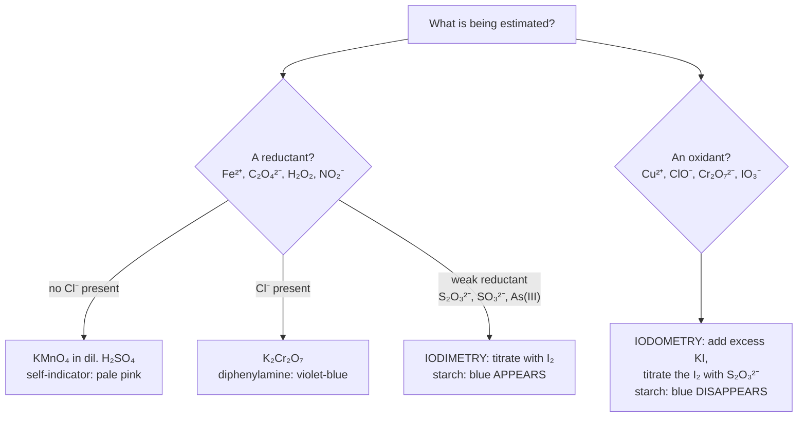
*Choosing the titration. Permanganate is the default for reductants, dichromate when chloride
would be oxidised, and iodine chemistry for weak reductants and for almost every oxidant.*

### (a) Permanganate titrations: the self-indicator

- **Textbook oxygen bookkeeping (not a free-oxygen mechanism):**
  $\ce{2KMnO4 + 3H2SO4 -> K2SO4 + 2MnSO4 + 3H2O + 5[O]}$ (5[O] per 2 mol).
- **Colour:** purple MnO₄⁻ → almost colourless Mn²⁺. One excess drop gives a permanent
  pale **pink** endpoint; no indicator needed.

Titrant in the burette: KMnO₄ acidified with **dilute H₂SO₄**. Analytes:

| Analyte | Net ionic equation (acid medium) | MnO₄⁻ : analyte |
|---|---|---|
| Fe²⁺ (Mohr's salt) | $\ce{MnO4^{-} + 5Fe^{2+} + 8H^{+}  ->  Mn^{2+} + 5Fe^{3+} + 4H2O}$ | 1 : 5 |
| oxalate C₂O₄²⁻ | $\ce{2MnO4^{-} + 5C2O4^{2-} + 16H^{+}  ->  2Mn^{2+} + 10CO2 + 8H2O}$ | 2 : 5 |
| H₂O₂ | $\ce{2MnO4^{-} + 5H2O2 + 6H^{+}  ->  2Mn^{2+} + 5O2 + 8H2O}$ | 2 : 5 |
| NO₂⁻ | $\ce{2MnO4^{-} + 5NO2^{-} + 6H^{+}  ->  2Mn^{2+} + 5NO3^{-} + 3H2O}$ | 2 : 5 |
| SO₃²⁻ | $\ce{2MnO4^{-} + 5SO3^{2-} + 6H^{+}  ->  2Mn^{2+} + 5SO4^{2-} + 3H2O}$ | 2 : 5 |
| Cl⁻, Br⁻, I⁻ | oxidised as well, so **never** titrate KMnO₄ in HCl/HBr/HI | not usable |

**The "reason" questions:**

- ⚠ **Why dilute H₂SO₄ and never HCl or HNO₃?** Cl⁻ is itself oxidised
  ($\ce{2MnO4^{-} + 10Cl^{-} + 16H^{+}  ->  2Mn^{2+} + 5Cl2 + 8H2O}$), consuming extra permanganate: **high
  titre**. HNO₃ is an oxidising acid and pre-oxidises part of the analyte (Fe²⁺ → Fe³⁺):
  **low titre**. Only dilute H₂SO₄ is inert to both partners.
- ⚠ **Too little acid** → brown turbidity of MnO₂ (`MnO₄⁻` stops at +4, or comproportionates
  with Mn²⁺, §7e): the n-factor changes from 5 towards 3 and the result is wrong.
- ⚠ **Why warm the oxalate to 60–70 °C?** The MnO₄⁻/C₂O₄²⁻ reaction is slow at room
  temperature and is **autocatalysed by its product Mn²⁺**: the first drops decolourise slowly,
  the rest fast. **Overheating** (boiling) decomposes some oxalic acid
  ($\ce{H2C2O4  ->  CO + CO2 + H2O}$) before it is titrated, so **less KMnO₄ is needed: low titre**.
  This is a kinetics question, not an equilibrium one.
- ⚠ **Why is KMnO₄ not a primary standard?** It is never obtained 100 % pure, and traces of
  MnO₂ catalyse its decomposition in solution, especially in light. It is **standardised
  against** a primary standard: **sodium oxalate** (or oxalic acid dihydrate, E = 63),
  **As₂O₃**, or **Mohr's salt** (E = 392, n = 1).
- **Iron in an ore:** dissolve in HCl, reduce all Fe³⁺ to Fe²⁺ with **SnCl₂**, destroy the
  excess Sn²⁺ with **HgCl₂** (`Sn²⁺ + 2HgCl₂ → Sn⁴⁺ + Hg₂Cl₂↓ + 2Cl⁻`, a silky white
  precipitate), then titrate. Because the solution now contains Cl⁻, add the
  **Zimmermann–Reinhardt reagent** (MnSO₄ + H₃PO₄ + H₂SO₄): the Mn²⁺ lowers the MnO₄⁻
  potential so Cl⁻ is not oxidised, and the H₃PO₄ complexes the yellow Fe³⁺ so the pink end
  point is visible.

### (b) Dichromate titrations: the steadier oxidant

- **Textbook oxygen bookkeeping:** $\ce{K2Cr2O7 + 4H2SO4 -> K2SO4 + Cr2(SO4)3 + 4H2O + 3[O]}$
- **Reduction half-reaction:** $\ce{Cr2O7^{2-} + 14H^+ + 6e^- -> 2Cr^{3+} + 7H2O}$
  (E° = +1.33 V; permanganate +1.51 V).
- **With Fe²⁺:** $\ce{Cr2O7^{2-} + 6Fe^{2+} + 14H^+ -> 2Cr^{3+} + 6Fe^{3+} + 7H2O}$ (1 : 6).

- K₂Cr₂O₇ **is a primary standard**: obtainable very pure, **not** hygroscopic (unlike
  Na₂Cr₂O₇, which is why the potassium salt is used), can be dried by heating, and its
  solution keeps indefinitely.
- The orange → green change is **not sharp enough** to see, so a redox indicator is added.
  NCERT: **diphenylamine** is oxidised "just after the equivalence point to produce an intense
  blue colour". In the flask the end point is **green → violet-blue**. (Ferroin, red → pale
  blue, is the alternative.)
- **Works in HCl:** E°(Cr₂O₇²⁻/Cr³⁺) = 1.33 V < E°(Cl₂/Cl⁻) = 1.36 V, so dilute Cl⁻ is not
  oxidised. That is dichromate's main advantage over permanganate.
- **COD (chemical oxygen demand)** of waste water uses excess dichromate refluxed in conc.
  H₂SO₄ (Ag₂SO₄ catalyst), with **HgSO₄ added to tie up Cl⁻** as HgCl₂, since chloride *would*
  be oxidised under those harsh conditions. The unused dichromate is back-titrated with Mohr's
  salt.

### (c) Iodometry and iodimetry (thiosulphate)

```
IODIMETRY (direct):   titrate the ANALYTE (a reductant) with standard I₂
                      S₂O₃²⁻, SO₃²⁻, H₂S, Sn²⁺, As(III), vitamin C
                      end point: first excess I₂ → blue APPEARS
IODOMETRY (indirect): add excess KI to the OXIDANT, liberate I₂, titrate that I₂ with
                      standard Na₂S₂O₃. Used for Cu²⁺, Cr₂O₇²⁻, MnO₄⁻, ClO⁻, IO₃⁻, Fe³⁺, H₂O₂
                      end point: last I₂ consumed → blue DISAPPEARS

   oxidant + I⁻ → I₂ (held in solution as I₃⁻, i.e. KI₃)
   I₂ + 2S₂O₃²⁻ → 2I⁻ + S₄O₆²⁻                           (NCERT eq. 7.60)
   indicator: FRESH STARCH, added near the end point (pale straw colour); added early, the
              starch–iodine complex holds I₂ and releases it slowly, so the end point drags
```

Standard iodometric systems (memorise the **electron** count):

| Oxidant | Reaction with I⁻ | Oxidant : S₂O₃²⁻ |
|---|---|---|
| Cu²⁺ | `2Cu²⁺ + 4I⁻ → Cu₂I₂↓ + I₂` (NCERT eq. 7.59) | **1 : 1** (Cu gains only 1 e⁻) |
| Cr₂O₇²⁻ | $\ce{Cr2O7^{2-} + 6I^{-} + 14H^{+}  ->  2Cr^{3+} + 3I2 + 7H2O}$ | 1 : 6 |
| IO₃⁻ | $\ce{IO3^{-} + 5I^{-} + 6H^{+}  ->  3I2 + 3H2O}$ | 1 : 6 |
| MnO₄⁻ | $\ce{2MnO4^{-} + 10I^{-} + 16H^{+}  ->  2Mn^{2+} + 5I2 + 8H2O}$ | 1 : 5 |
| ClO⁻ | $\ce{ClO^{-} + 2I^{-} + 2H^{+}  ->  Cl^{-} + I2 + H2O}$ | 1 : 2 |
| H₂O₂ | $\ce{H2O2 + 2I^{-} + 2H^{+}  ->  I2 + 2H2O}$ | 1 : 2 |
| Fe³⁺ | $\ce{2Fe^{3+} + 2I^{-}  ->  2Fe^{2+} + I2}$ | 1 : 1 |
| O₃ | $\ce{O3 + 2I^{-} + H2O  ->  O2 + I2 + 2OH^{-}}$ | 1 : 2 |

⚠ **Copper assay details:** keep the pH mildly acidic (acetic acid/acetate). In strong acid
air oxidises I⁻ (high titre); in alkali Cu(OH)₂ precipitates (low titre). **KSCN** is added
near the end point: CuSCN, being less soluble, replaces CuI and releases the I₂ adsorbed on
the precipitate, sharpening the end point.

**"Available chlorine" of bleaching powder, the classic industrial calculation:**

- **acidify** $\ce{OCl^{-} + Cl^{-} + 2H^{+}  ->  Cl2 + H2O}$ — (comproportionation +1, −1 → 0)
- **assay** $\ce{OCl^{-} + 2I^{-} + 2H^{+}  ->  Cl^{-} + I2 + H2O}$
- I₂ + 2S₂O₃²⁻ → 2I⁻ + S₄O₆²⁻
- ⇒ 1 mol CaOCl₂ ≡ 1 mol Cl₂ ≡ 1 mol I₂ ≡ 2 mol S₂O₃²⁻
- "available chlorine" = the Cl₂ that acid can liberate
- pure CaOCl₂ (M ≈ 127) → 70.9 / 127 = 55.8 % at most  (commercial: 25–35 %)
- mass of available Cl₂ = N(thio) × V(L) × 35.45 g     (E of Cl₂ = 70.9 / 2)


### (d) Which titration, which indicator: one table to remember

| Titration | Indicator | End point |
|---|---|---|
| Fe²⁺ / C₂O₄²⁻ / H₂O₂ vs **KMnO₄** | none (self) | colourless → **permanent pale pink** |
| Fe²⁺ vs **K₂Cr₂O₇** | diphenylamine (or its sulphonate) | green → **violet-blue** |
| reductant vs **I₂** (iodimetry) | starch | colourless → **blue appears** |
| oxidant + KI vs **S₂O₃²⁻** (iodometry) | starch | blue → **colourless** |
| Fe²⁺ vs **Ce⁴⁺** (cerimetry, E° ≈ 1.44 V in H₂SO₄) | ferroin | red → pale blue |

> **⚠ Why cerimetry over permanganate (🆇):** Ce⁴⁺ → Ce³⁺ is a clean **one-electron** change
> with no intermediate O.S., its solutions are stable, and it can be used in the presence of
> Cl⁻.

## 13. Limitations of the oxidation-number concept (7.3.4)

**What NCERT actually says (one paragraph):** the concept of redox is still evolving, and
"in recent past" **oxidation is visualised as a decrease in electron density**, and
**reduction as an increase in electron density**, around the atom(s) involved. This is the
fourth language: it covers covalent reactions where no electron visibly changes hands.

**The standard limitations list (🆇 — assertion–reason material):**

1. **O.N. is book-keeping, not a measured charge.** S in H₂SO₄ is +6 by the rules, but the
   real partial charge on S is far smaller.
2. **Fractional / average values** appear (Fe₃O₄ +8⁄3, S₄O₆²⁻ +2.5, HN₃ −⅓, KO₂ −½), although no
   atom loses a fraction of an electron.
3. **Blind rules fail on O–O bonds.** "O = −2" gives S = +8 in H₂SO₅ and H₂S₂O₈, which is
   impossible (S has 6 valence electrons). You must look at the structure (NCERT Ex. 7.5
   calls this "the fallacy").
4. **Inequivalent atoms are hidden** by one number: the two N of NH₄NO₃ (−3, +5), the two S
   of thiosulphate, the three Fe of Fe₃O₄.
5. **O.N. cannot rank oxidants.** MnO₄⁻ (+7) is stronger than ClO₄⁻ (+7) in practice, and F
   is −1 in every compound yet F₂ is the strongest oxidant. You need **E°** (§15).
6. **O.N. says nothing about rate.** Fe²⁺ + Tl³⁺ is slow despite a large driving force: the
   one-electron path passes through the unstable **Tl²⁺ (6s¹)**. O.N. tells you *whether* a
   change is possible, never *how fast*.
7. **Assignments can be convention-bound.** NCl₃ (§4) and B₂H₆ (§21, Ex. 7.3c) depend on
   which electronegativity scale you trust.

## 14. Redox couples and electrode processes: the Daniell cell (7.4)

NCERT's key move: **separate the two half-reactions in space and make the electrons travel
through a wire.** Zn in CuSO₄ gives only heat; the same reaction split into two beakers gives
electrical work, and each half-cell develops a measurable potential.

A **redox couple** is the oxidised and reduced form of the same species, written **Ox/Red**
(oxidised form first): `Zn²⁺/Zn`, `Cu²⁺/Cu`, `Fe³⁺/Fe²⁺`, `MnO₄⁻/Mn²⁺`, `Cl₂/Cl⁻`, `H⁺/H₂`.

```
   ┌───────────────┐   salt bridge   ┌───────────────┐
   │ Zn rod in     │   (U-tube, KCl  │ Cu rod in     │
   │ ZnSO₄(aq)     │   or NH₄NO₃     │ CuSO₄(aq)     │
   │               │   set in agar)  │               │
   │ Zn → Zn²⁺+2e⁻ │   ~~~~~‖~~~~~   │ Cu²⁺+2e⁻ → Cu │
   │ OXIDATION     │   ions migrate  │ REDUCTION     │
   │ ANODE (−)     │   to close the  │ CATHODE (+)   │
   └───────┬───────┘   circuit       └───────┬───────┘
           └──── e⁻ ───► (V) ───► ───────────┘        E°cell = 1.10 V
   electrons flow Zn → Cu through the wire;
   conventional current flows Cu → Zn (NCERT Fig. 7.3)
```

**Anode vs cathode: the only definition that never fails**

| Aspect | Anode | Cathode |
|---|---|---|
| Process | **oxidation**, always | **reduction**, always |
| Galvanic (Daniell) cell | Zn, **negative** | Cu, **positive** |
| Electrolytic cell | **positive** | **negative** |
| Ions migrating towards it | anions | cations |

> **⚠ Electrode sign is not the definition; the reaction is.** A galvanic anode is negative
> because it *pushes out* electrons; an electrolytic anode is positive because it is wired to
> the + terminal. Mnemonic **"AN OX, RED CAT"** (anode = oxidation, reduction = cathode)
> holds in both.

**Functions of the salt bridge (asked directly):**

1. It **completes the circuit**: ions migrate through it, so current can flow.
2. It **keeps each half-cell electrically neutral**. Without it, charge would build up at
   once (excess Zn²⁺ on one side, excess SO₄²⁻ on the other) and the current would stop.
3. It **prevents mixing**, so Cu²⁺ never meets the Zn rod directly (that would only waste the
   reaction as heat).
4. It **minimises the liquid-junction potential**. That is why its electrolyte has cation and
   anion of near-equal limiting molar conductivity: λ°(K⁺) = 73.5, λ°(Cl⁻) = 76.3
   S cm² mol⁻¹; also KNO₃, NH₄NO₃.

⚠ **Why not KCl with Ag⁺ or Pb²⁺?** It precipitates AgCl/PbCl₂ in the bridge, so use
**KNO₃ or NH₄NO₃**. ⚠ **Why not NaCl?** λ°(Na⁺) = 50.1 ≠ λ°(Cl⁻) = 76.3, which gives a large
junction potential. ⚠ **Why agar?** It sets the electrolyte as a **jelly**: solutions cannot
flow through, but ions still diffuse.

**What builds up at each electrode:** ions leaving (or depositing on) the rod create a charge
separation between metal and solution, an **electrical double layer**. Its potential difference
is the **electrode potential**. It can only be measured *relative to another electrode*, hence
the SHE (§15) and Class XII Electrochemistry.

## 15. Standard electrode potentials — NCERT Table 7.1 (7.4)

**Definition (all conditions matter):** the potential of a half-cell when every species is at
**unit concentration (activity) ≈ 1 M**, gases at **1 bar**, **T = 298 K**, written for the
**reduction** half-reaction and measured against the **standard hydrogen electrode**, whose
E° is defined as **0.00 V**.

NCERT's reading notes: a **negative E°** means the couple is a **stronger reducing agent** than
H⁺/H₂; a **positive E°** means it is a **weaker** one.

### Table 7.1 — the numbers JEE actually quotes (reduction, 298 K)

| E° / V | Half-reaction (Ox + ne⁻ → Red) | Note |
|---:|---|---|
| +2.87 | $\ce{F2(g) + 2e^{-}  ->  2F^{-}}$ | strongest oxidant |
| +1.81 | $\ce{Co^{3+} + e^{-}  ->  Co^{2+}}$ | ⚠ stronger than MnO₄⁻: aqueous Co³⁺ oxidises water |
| +1.78 | $\ce{H2O2 + 2H^{+} + 2e^{-}  ->  2H2O}$ | H₂O₂ as oxidant |
| +1.51 | $\ce{MnO4^{-} + 8H^{+} + 5e^{-}  ->  Mn^{2+} + 4H2O}$ | — |
| +1.40 | $\ce{Au^{3+} + 3e^{-}  ->  Au(s)}$ | — |
| +1.36 | $\ce{Cl2(g) + 2e^{-}  ->  2Cl^{-}}$ | — |
| +1.33 | $\ce{Cr2O7^{2-} + 14H^{+} + 6e^{-}  ->  2Cr^{3+} + 7H2O}$ | below Cl₂: works in HCl |
| +1.23 | $\ce{O2(g) + 4H^{+} + 4e^{-}  ->  2H2O}$ | — |
| +1.23 | $\ce{MnO2(s) + 4H^{+} + 2e^{-}  ->  Mn^{2+} + 2H2O}$ | Cl₂ lab preparation from MnO₂ + conc. HCl |
| +1.09 | $\ce{Br2 + 2e^{-}  ->  2Br^{-}}$ | — |
| +0.97 | $\ce{NO3^{-} + 4H^{+} + 3e^{-}  ->  NO(g) + 2H2O}$ | why HNO₃ dissolves Cu and Ag |
| +0.92 | $\ce{2Hg^{2+} + 2e^{-}  ->  Hg2^{2+}}$ | — |
| +0.80 | $\ce{Ag^{+} + e^{-}  ->  Ag(s)}$ | — |
| +0.77 | $\ce{Fe^{3+} + e^{-}  ->  Fe^{2+}}$ | — |
| +0.68 | $\ce{O2(g) + 2H^{+} + 2e^{-}  ->  H2O2}$ | — |
| +0.54 | $\ce{I2(s) + 2e^{-}  ->  2I^{-}}$ | — |
| +0.52 | $\ce{Cu^{+} + e^{-}  ->  Cu(s)}$ | — |
| +0.34 | $\ce{Cu^{2+} + 2e^{-}  ->  Cu(s)}$ | — |
| +0.22 | $\ce{AgCl(s) + e^{-}  ->  Ag(s) + Cl^{-}}$ | — |
| +0.10 | $\ce{AgBr(s) + e^{-}  ->  Ag(s) + Br^{-}}$ | — |
| 0.00 | $\ce{2H^{+} + 2e^{-}  ->  H2(g)}$ | the reference, by definition |
| −0.13 | $\ce{Pb^{2+} + 2e^{-}  ->  Pb(s)}$ | — |
| −0.14 | $\ce{Sn^{2+} + 2e^{-}  ->  Sn(s)}$ | — |
| −0.25 | $\ce{Ni^{2+} + 2e^{-}  ->  Ni(s)}$ | — |
| −0.44 | $\ce{Fe^{2+} + 2e^{-}  ->  Fe(s)}$ | — |
| −0.74 | $\ce{Cr^{3+} + 3e^{-}  ->  Cr(s)}$ | — |
| −0.76 | $\ce{Zn^{2+} + 2e^{-}  ->  Zn(s)}$ | — |
| −0.83 | $\ce{2H2O + 2e^{-}  ->  H2(g) + 2OH^{-}}$ | H₂ in base: why Zn and Al dissolve in NaOH |
| −1.66 | $\ce{Al^{3+} + 3e^{-}  ->  Al(s)}$ | — |
| −2.36 | $\ce{Mg^{2+} + 2e^{-}  ->  Mg(s)}$ | — |
| −2.71 | $\ce{Na^{+} + e^{-}  ->  Na(s)}$ | — |
| −2.87 | $\ce{Ca^{2+} + 2e^{-}  ->  Ca(s)}$ | — |
| −2.93 | $\ce{K^{+} + e^{-}  ->  K(s)}$ | — |
| −3.05 | $\ce{Li^{+} + e^{-}  ->  Li(s)}$ | strongest reductant in water (see below) |

*Going up the table, the left-hand species are stronger **oxidants**; going down, the
right-hand species are stronger **reductants**.*

**Reading rules:**

- **Higher E° ⇒ stronger oxidant** (left side). Oxidising power:
  `F₂ > MnO₄⁻ > Cl₂ > Cr₂O₇²⁻ > MnO₂ > Br₂ > Fe³⁺ > I₂`.
- **Lower (more negative) E° ⇒ stronger reductant** (right side). Reducing power of metals:
  `Li > K > Ca > Na > Mg > Al > Zn > Cr > Fe > Ni > Sn > Pb > (H₂) > Cu > Ag > Au`.
- Metals with **E° < 0** reduce H⁺, so they liberate H₂ from dilute (non-oxidising) acids.
- ⚠ **E° is intensive.** Multiplying a half-reaction does **not** multiply E°:
  $\ce{2H^{+} + 2e^{-}  ->  H2}$ and $\ce{H^{+} + e^{-}  ->  ½H2}$ both have 0.00 V, and Fe³⁺/Fe²⁺ stays +0.77 V even when
  written ×6 in a dichromate balance. **ΔG° does multiply**, so always combine through
  ΔG° = −nFE° (§17).

### 🆇 Why lithium tops the table: the hydration argument

E°(Li⁺/Li) = −3.05 V is the most negative value, so **in water** Li is the strongest reductant,
even though its atom gives up its electron **least** readily of the alkali metals. The cycle
explains it:

| Step (kJ mol⁻¹, approx.) | Li | Cs | Favours |
|---|---:|---:|---|
| Sublimation $\ce{M(s)  ->  M(g)}$ | +161 | +76 | Cs |
| Ionisation $\ce{M(g)  ->  M^{+}(g) + e^{-}}$ | +520 | +376 | Cs |
| Hydration $\ce{M^{+}(g)  ->  M^{+}(aq)}$ | −506 | −276 | **Li, by far** |

*Hydration enthalpies from NCERT's s-block table. The tiny Li⁺ is hydrated so strongly that
it more than pays back the larger sublimation and ionisation costs.*

- In the **gas phase** (ionisation alone) the order at the top reverses: Cs > Rb > K > Na > Li.
  "Electrochemical series ≠ reactivity series in every medium" is the Advanced caveat.
- ⚠ **Li nevertheless reacts less vigorously with water than Na or K.** E° is thermodynamics;
  the reaction rate is kinetics. Li is hard and high-melting, so it does not melt into a
  fresh, fast-reacting ball on the water surface.

## 16. Everything Table 7.1 lets you predict 🆇

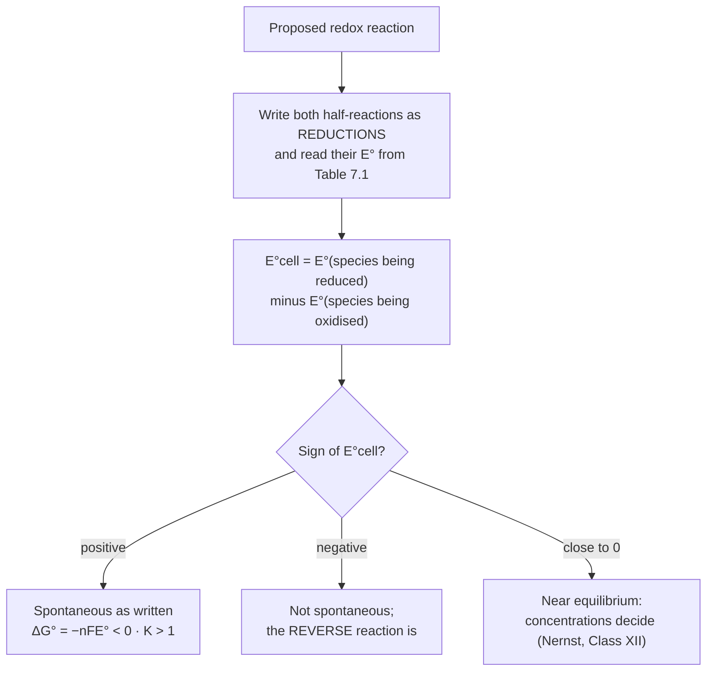
*The single test behind every Table 7.1 question: reduction potential of the would-be oxidant
minus that of the would-be reductant.*

**The four question types (NCERT Ex. 7.26–7.30 are exactly these):**

```
(1) "Is the reaction feasible?"   (NCERT Ex. 7.26)
    (a) Fe³⁺ + I⁻   : 0.77 − 0.54    = +0.23 V  ✔   (⇒ FeI₃ cannot exist)
    (b) Ag⁺ + Cu    : 0.80 − 0.34    = +0.46 V  ✔
    (c) Fe³⁺ + Cu   : 0.77 − 0.34    = +0.43 V  ✔   (FeCl₃ etches copper circuit boards)
    (d) Ag + Fe³⁺   : 0.77 − 0.80    = −0.03 V  ✘   (the reverse, Ag⁺ + Fe²⁺, is feasible)
    (e) Br₂ + Fe²⁺  : 1.09 − 0.77    = +0.32 V  ✔
    and by contrast: Fe³⁺ + Br⁻ : 0.77 − 1.09 = −0.32 V ✘  (⇒ FeBr₃ is stable)

(2) Displacement order   (NCERT Ex. 7.28: Al, Cu, Fe, Mg, Zn)
    sort by E°: Mg (−2.36) < Al (−1.66) < Zn (−0.76) < Fe (−0.44) < Cu (+0.34)
    each metal displaces every metal to its right from a solution of its salt
    ⇒ Mg > Al > Zn > Fe > Cu

(3) Rank reducing power   (NCERT Ex. 7.29, using the values printed in the question)
    K⁺/K −2.93, Mg²⁺/Mg −2.37, Cr³⁺/Cr −0.74, Hg²⁺/Hg +0.79, Ag⁺/Ag +0.80
    increasing reducing power:  Ag < Hg < Cr < Mg < K
    ⚠ Hg and Ag differ by only 0.01 V: read the numbers, not your memory

(4) Depict a cell and find E°   (NCERT Ex. 7.30: Zn + 2Ag⁺ → Zn²⁺ + 2Ag)
    (−) Zn(s) | Zn²⁺(aq) ‖ Ag⁺(aq) | Ag(s) (+)
    anode Zn (negative) · cathode Ag · E°cell = 0.80 − (−0.76) = +1.56 V
    current carriers: electrons in the external wire, ions in the solutions and salt bridge
```

**Other one-line predictions:**

- ⚠ **Metals above H₂ displace H₂ from acids, but not from HNO₃**, because NO₃⁻ (+0.97 V) is
  a better oxidant than H⁺ and nitrogen oxides form instead. Two exceptions JEE likes:
  (i) **very dilute (~2 %) HNO₃ with Mg or Mn does give H₂**; (ii) very dilute HNO₃ with Zn
  reduces nitrate all the way to **NH₄NO₃** (N +5 → −3, 8 e⁻).
- **Storage:** CuSO₄ solution cannot be kept in a **zinc** pot (Zn reduces Cu²⁺) or an **iron**
  one (−0.44 < +0.34). A copper vessel is safe. AgNO₃ cannot be kept in a copper vessel.
- **Non-metals:** F₂ oxidises water ($\ce{2F2 + 2H2O  ->  4HF + O2}$, 2.87 > 1.23); Cl₂ oxidises Br⁻
  and I⁻; Br₂ oxidises I⁻ but not Cl⁻.
- **Extraction:** metals with strongly negative E° (Na, K, Ca, Mg, Al) come only from
  **electrolysis of fused salts**, because water is reduced first in solution (−0.83 V). Cu,
  Ag and Hg can be won by chemical reduction or displacement.
- **Which ion disproportionates:** use the Latimer test in §17.
- **Why aqueous Co³⁺ is rare:** at +1.81 V it oxidises water. Co(III) survives only in
  complexes such as [Co(NH₃)₆]³⁺ (see the d-block and coordination notes).

---

# Part D — JEE Advanced Corner

## 17. Latimer diagrams and the disproportionation test 🆇

A **Latimer diagram** lists one element's species in **decreasing oxidation state**, left to
right, with the standard **reduction** potential of each step written on the link.

```
ACID (pH 0), E° / V
 chlorine:  ClO₄⁻ ─1.20─ ClO₃⁻ ─1.18─ HClO₂ ─1.65─ HOCl ─1.63─ Cl₂ ─1.36─ Cl⁻
             +7           +5           +3           +1         0         −1
 manganese: MnO₄⁻ ─0.56─ MnO₄²⁻ ─2.26─ MnO₂ ─0.95─ Mn³⁺ ─1.51─ Mn²⁺ ─(−1.18)─ Mn
 iron:      FeO₄²⁻ ─≈2.20─ Fe³⁺ ─0.77─ Fe²⁺ ─(−0.44)─ Fe
 copper:    Cu²⁺ ─0.153─ Cu⁺ ─0.521─ Cu
 oxygen:    O₂ ─0.68─ H₂O₂ ─1.78─ H₂O

BASE (pH 14), E° / V
 chlorine:  ClO₄⁻ ─0.37─ ClO₃⁻ ─0.30─ ClO₂⁻ ─0.68─ ClO⁻ ─0.42─ Cl₂ ─1.36─ Cl⁻
```

### Test A — will the middle species disproportionate?

```
A species disproportionates spontaneously  ⇔  E°(link on its RIGHT) > E°(link on its LEFT)
(E°cell of the disproportionation = E°right − E°left)

 Cu⁺     : 0.521 > 0.153  ✔  2Cu⁺ → Cu²⁺ + Cu                     E° = +0.368 V
 MnO₄²⁻  : 2.26  > 0.56   ✔  3MnO₄²⁻ + 4H⁺ → 2MnO₄⁻ + MnO₂ + 2H₂O  E° = +1.70 V
 Mn³⁺    : 1.51  > 0.95   ✔  2Mn³⁺ + 2H₂O → Mn²⁺ + MnO₂ + 4H⁺     (NCERT Ex. 7.21)
 H₂O₂    : 1.78  > 0.68   ✔  2H₂O₂ → 2H₂O + O₂                    E° = +1.10 V (slow: kinetics)
 Fe²⁺    : −0.44 < 0.77   ✘  stable, which is why Fe²⁺ is an ordinary ion
 acid:  HClO₂ 1.65 > 1.18 ✔ disproportionates · HOCl 1.63 < 1.65 ✘ · Cl₂ 1.36 < 1.63 ✘
 base:  Cl₂   1.36 > 0.42 ✔ ⇒ Cl₂ + 2OH⁻ → Cl⁻ + ClO⁻ + H₂O (bleach formation, §7d)
        ClO₂⁻ 0.68 > 0.30 ✔
```

⚠ **The medium flips the answer for Cl₂:** stable in acid (1.36 < 1.63), disproportionates in
base (1.36 > 0.42). That is exactly why chlorine water is kept acidic and bleach is made in
alkali.

**ClO⁻ in base, a two-link test:** ClO⁻ has no disproportionation to its *neighbours*
(0.42 < 0.68). But combine links first (Test B): E°(ClO⁻/Cl⁻) = (0.42 + 1.36)/2 = 0.89 V and
E°(ClO₃⁻/ClO⁻) = (2×0.30 + 2×0.68)/4 = 0.49 V. Since 0.89 > 0.49,
$\ce{3ClO^{-}  ->  ClO3^{-} + 2Cl^{-}}$ is spontaneous (E° ≈ +0.40 V). It is slow at room temperature and fast
when hot: bleach loses strength on storage, and hot alkali gives chlorate (§7d).

⚠ **Perchlorate is thermodynamically a good oxidant (1.20 V) but kinetically inert:** a
symmetric ClO₄⁻ tetrahedron has no easy path for oxygen transfer. So dilute HClO₄ and
KClO₄ are handled routinely, while chlorates and chlorites are touchy.

### Test B — combining steps: never add E°, add ΔG°

```
E°(overall) = (n₁E°₁ + n₂E°₂) / (n₁ + n₂)          (because ΔG° = −nFE° is additive)

 Cu²⁺/Cu    = (1×0.153 + 1×0.521)/2        = +0.337 ≈ +0.34 V   ✔ matches Table 7.1
 Fe³⁺/Fe    = (1×0.77 + 2×(−0.44))/3       = −0.037 V
 MnO₄⁻/MnO₂ = (1×0.56 + 2×2.26)/3          = +1.69 V
 MnO₂/Mn²⁺  = (1×0.95 + 1×1.51)/2          = +1.23 V            ✔ matches Table 7.1
 MnO₄⁻/Mn²⁺ = (3×1.69 + 2×1.23)/5          = +1.51 V            ✔ matches Table 7.1
```

⚠ An option equal to "0.77 + (−0.44) = 0.33 V" for Fe³⁺/Fe is the trap answer.

### Frost (oxidation-state) diagram: the fastest qualitative picture

```
plot  n·E° (for element → that state, ∝ −ΔG°/F)  against oxidation number n
· the LOWER a point, the more STABLE that state
· a point ABOVE the line joining its two neighbours → it disproportionates
· a point BELOW that line → its neighbours comproportionate into it
· slope of a segment = E° of that couple: a steep segment means a strong oxidant
Mn in acid:  the minimum is Mn²⁺, so every higher state oxidises down to Mn²⁺
Mn in base:  the minimum moves to MnO₂, which is why neutral/alkaline KMnO₄ stops at brown MnO₂
Cl in acid:  the minimum is Cl⁻, so every positive O.S. of chlorine is an oxidant
```

## 18. Oxidation-state map of the p-block

| Group | Highest O.S. | Lower state that grows stable down the group | JEE-level consequence |
|---|---|---|---|
| 13 | +3 | +1 (Tl⁺ most stable) | Tl³⁺ is an oxidant; In⁺ disproportionates |
| 14 | +4 | +2 (Pb²⁺) | Sn²⁺ is a reductant; **PbO₂** (Pb +4) is an oxidant |
| 15 | +5 | +3 (Bi³⁺) | **NaBiO₃** (Bi +5) oxidises Mn²⁺ to MnO₄⁻ |
| 16 | +6 | +4 | H₂SeO₄ is a **stronger** oxidant than H₂SO₄ |
| 17 | +7 | +5, +1 … | oxidising power of per-halates: **Br > I > Cl** (see below) |

- **(i) Inert-pair effect (why):** down groups 13–15 the ns² pair is held more tightly (poor
  shielding by the filled d and f shells), so the **group O.S. − 2** state gains stability and
  the group O.S. becomes oxidising. Observable result: "the highest state of the heaviest
  member is an oxidant" (Tl³⁺, Pb⁴⁺, Bi⁵⁺).
- **(ii) The middle-row anomaly (🆇):** the 4p elements, just after the first d-block
  contraction, hold their highest state *less* comfortably than both neighbours. Hence
  **perbromate (BrO₄⁻/BrO₃⁻ ≈ 1.85 V) > periodate (H₅IO₆/IO₃⁻ ≈ 1.60 V) > perchlorate
  (ClO₄⁻/ClO₃⁻ 1.20 V)**. Perbromate was not made until 1968. The same pattern makes selenic
  acid a stronger oxidant than sulphuric acid, and As(V) more oxidising than P(V).
  ⚠ So "oxidising power of the highest state rises steadily down a group" is **wrong** for
  groups 16–17.
- **(iii) Period-2 caps:** with no valence d orbitals, N forms at most **four** covalent bonds
  (`NF₅ ✘`, `NCl₅ ✘`, but `PCl₅ ✔`). N reaches +5 only in oxo-species (HNO₃, NO₃⁻, N₂O₅).
  Likewise O never reaches +6 (its maximum is +2, in OF₂) and F never goes positive at all.
  ⚠ "Maximum O.S. = group number" is *not* universal in the p-block.

## 19. Species bank: structures, O.S. and reactions that decide the question

| Species / reaction | Fact that solves the problem | Watch out |
|---|---|---|
| **H₂O₂ as oxidant** (acid: $\ce{H2O2 + 2H^{+} + 2e^{-}  ->  2H2O}$, 1.78 V; base: $\ce{HO2^{-} + H2O + 2e^{-}  ->  3OH^{-}}$, 0.88 V) | $\ce{PbS  ->  PbSO4}$ (restoring blackened oil paintings), $\ce{Fe^{2+}  ->  Fe^{3+}}$, $\ce{I^{-}  ->  I2}$, $\ce{NO2^{-}  ->  NO3^{-}}$, $\ce{SO3^{2-}  ->  SO4^{2-}}$, $\ce{Mn^{2+}  ->  MnO2}$ (in base) | n = 2 either way |
| **H₂O₂ as reductant** ($\ce{H2O2  ->  O2 + 2H^{+} + 2e^{-}}$) | reduces MnO₄⁻, Cr₂O₇²⁻, O₃, Cl₂, HOCl, PbO₂, Ag₂O | **O₂ always evolves**: effervescence is the proof |
| **BaO₂** | `BaO₂ + H₂SO₄ → BaSO₄↓ + H₂O₂` (old lab preparation of H₂O₂) | $\ce{2BaO + O2  <=>  2BaO2}$: forms near 773 K, gives O₂ back near 1073 K (Brin process) |
| **Na₂O₂ + cold water** | $\ce{Na2O2 + 2H2O  ->  2NaOH + H2O2}$ | warm water: H₂O₂ decomposes to O₂ |
| **KO₂** (O = −½) | $\ce{4KO2 + 2CO2  ->  2K2CO3 + 3O2}$ | removes CO₂ **and** returns O₂: breathing apparatus, submarines |
| **O₃ vs I⁻** | $\ce{O3 + 2I^{-} + H2O  ->  O2 + I2 + 2OH^{-}}$ | the iodometric estimation of ozone |
| **SO₂ bleaching** | $\ce{SO2 + 2H2O  ->  SO4^{2-} + 4H^{+} + 2e^{-}}$ releases [H], which **reduces** the dye | **temporary**: air re-oxidises the dye. Cl₂ bleaches by **oxidation** (permanent) |
| **Cl₂ + cold dilute NaOH** | $\ce{Cl2 + 2NaOH  ->  NaCl + NaOCl + H2O}$ | never mix bleach with acid (Cl₂ gas, §7e) or with ammonia (chloramines) |
| **Antichlor** (NCERT Ex. 7.23) | $\ce{SO2 + Cl2 + 2H2O  ->  H2SO4 + 2HCl}$ | thiosulphate also works: $\ce{S2O3^{2-} + 4Cl2 + 5H2O  ->  2SO4^{2-} + 8Cl^{-} + 10H^{+}}$ |
| **NaBH₄, LiAlH₄** | hydride donors: H⁻ (−1) is oxidised to +1 while the substrate is reduced | NaBH₄ is milder and survives water and alcohols |
| **HI + conc. H₂SO₄** | $\ce{8HI + H2SO4  ->  4I2 + H2S + 4H2O}$ | HI (and HBr) cannot be made from NaX + conc. H₂SO₄; HCl can |
| **Fe³⁺ + SCN⁻** | `[Fe(SCN)]²⁺` blood-red: **complexation, not redox** | JEE's favourite "not a redox reaction" option |
| **CuSO₄ + KI** | white CuI + brown I₂ (NCERT eq. 7.59) | 1 Cu²⁺ ≡ 1 S₂O₃²⁻ |
| **Manganate on acidifying** | green MnO₄²⁻ → purple MnO₄⁻ + brown MnO₂ | E° = +1.70 V (§17) |
| **ClO₂** (Cl +4) | odd-electron, explosive yellow gas; bleaches wood pulp and treats water | disproportionates in alkali: ClO₂⁻ + ClO₃⁻ |
| **SnCl₂ + HgCl₂** | `2HgCl₂ + SnCl₂ → Hg₂Cl₂↓ (white) + SnCl₄`, then $\ce{Hg2Cl2 + SnCl2  ->  2Hg (grey-black) + SnCl4}$ | **two** redox steps: the white → grey test for Hg²⁺ (salt analysis) |
| **Lindlar: C₂H₂ + H₂ → C₂H₄** | C goes −1 → −2: a reduction by O.N., though nothing looks like e⁻ transfer | O.N. is what makes organic redox countable |

## 20. Worked problem patterns

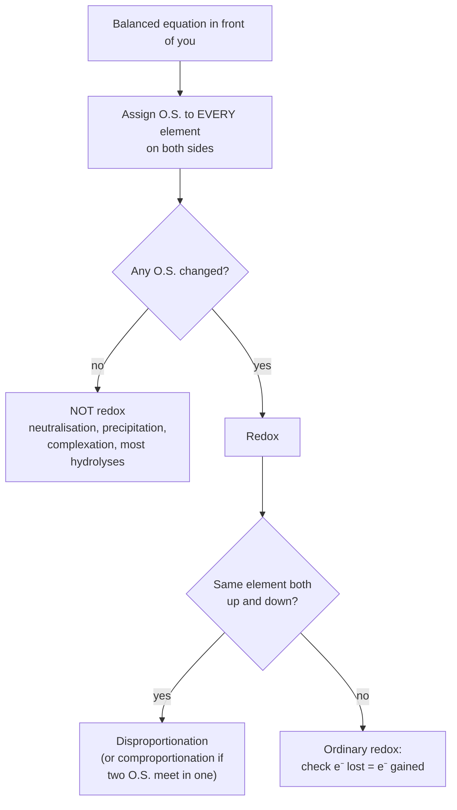
*The "is it redox?" sieve (P6): the only reliable test is an O.S. change.*

**P1 · "Which O.S. does the oxidant reach?" (NCERT Ex. 7.11 style)**

> Excess Zn is added to FeCl₃ solution. What is the final iron species?

Excess **reductant** pushes the oxidant (Fe³⁺) to its **lowest accessible** state:
$\ce{2Fe^{3+} + Zn  ->  2Fe^{2+} + Zn^{2+}}$ (0.77 − (−0.76) = +1.53 V), then with more Zn
$\ce{Fe^{2+} + Zn  ->  Fe + Zn^{2+}}$ (−0.44 − (−0.76) = +0.32 V, still spontaneous). So **Fe²⁺ first,
then Fe(s)**. With limited Zn, only Fe²⁺.

**P2 · Balancing and mole ratio in one go**

> `xMnO₄⁻ + yC₂O₄²⁻ + zH⁺ → xMn²⁺ + 2yCO₂ + (z/2)H₂O`. Find x : y : z.

Electrons: Mn gains 5, each oxalate loses 2 ⇒ LCM 10 ⇒ **x = 2, y = 5**. Charge:
−2 − 10 + z = +4 ⇒ **z = 16**, and H₂O = 8.
$\ce{2MnO4^{-} + 5C2O4^{2-} + 16H^{+}  ->  2Mn^{2+} + 10CO2 + 8H2O}$. So 1 mol KMnO₄ oxidises 2.5 mol oxalate.

**P3 · Titration arithmetic**

> 0.316 g of a sample containing oxalic acid needs 28.5 mL of 0.1 N KMnO₄ (acid medium).
> Find the % w/w of H₂C₂O₄·2H₂O.

```
meq KMnO₄ = 28.5 × 0.1 = 2.85 meq = meq of oxalic acid
mass      = 2.85 × 10⁻³ × 63 (E = 126/2) = 0.1796 g   ⇒  0.1796 / 0.316 = 56.8 %
mole check: 0.1 N KMnO₄ (n = 5) is 0.02 M, so 28.5 mL holds 0.57 mmol MnO₄⁻;
            × 5/2 = 1.425 mmol oxalic acid × 126 = 0.1796 g   ✔ same answer
```

**P4 · Limiting reagent in a redox step (NCERT Ex. 7.25, Ostwald process)**

> Maximum mass of NO from 10.00 g NH₃ and 20.00 g O₂?

- $\ce{4NH3 + 5O2 -> 4NO + 6H2O}$ (N loses 5 e⁻; O₂ gains 4 e⁻; LCM 20).
- NH₃: 10.00/17 = 0.588 mol; would need 0.735 mol O₂.
- O₂: 20.00/32 = 0.625 mol < 0.735 mol, so **O₂ limits**.
- NO: 0.625 × 4/5 = 0.500 mol → **15.0 g**.
- Ostwald chain: NH₃ (−3) → NO (+2) → NO₂ (+4) → HNO₃ (+5): 8 e⁻ per N overall.

**P5 · Latimer to K (Advanced style)**

> Given E°(Cu²⁺/Cu⁺) = +0.153 V and E°(Cu⁺/Cu) = +0.521 V, find K for $\ce{2Cu^{+}  <=>  Cu^{2+} + Cu}$ at
> 298 K.

E°cell = 0.521 − 0.153 = +0.368 V, n = 1 ⇒ log K = 0.368/0.0591 = 6.23 ⇒ **K ≈ 1.7 × 10⁶**.
Aqueous Cu⁺ is therefore hopeless, and Cu(I) chemistry lives in insoluble solids (CuCl, CuI,
Cu₂O) or complexes.

**P6 · "Is it redox?" (the sieve above)**

⚠ **Looks non-redox but IS redox:** $\ce{Cl2 + H2O  ->  HCl + HOCl}$ (disproportionation);
$\ce{2NO2 + H2O  ->  HNO3 + HNO2}$ (N +4 → +5 and +3), and the same for N₂O₄; $\ce{2HI  ->  H2 + I2}$.

⚠ **Looks redox but is NOT:** $\ce{CaO + SO3  ->  CaSO4}$, `CO₂ + NaOH`, `BF₃ + F⁻`, `NH₄Cl + NaOH`,
`CaCO₃ + HCl`, `CaC₂ + H₂O`, `NCl₃ + H₂O` (§4), $\ce{2CrO4^{2-} + 2H^{+}  ->  Cr2O7^{2-} + H2O}$ (Cr stays +6),
and `Fe³⁺ + SCN⁻`.

## 21. NCERT exercise gems worth re-doing

| NCERT Ex. | Essence of the answer |
|---|---|
| 7.1 O.N. of the underlined atoms | NaH₂PO₄ P **+5** · NaHSO₄ S **+6** · H₄P₂O₇ P **+5** · K₂MnO₄ Mn **+6** · CaO₂ O **−1** · NaBH₄ B **+3** · H₂S₂O₇ S **+6** · KAl(SO₄)₂·12H₂O S **+6** |
| 7.2 KI₃, H₂S₄O₆, Fe₃O₄, ethanol, acetic acid | averages −⅓, +2.5, +8⁄3, −2, 0 **hide inequivalent atoms**: I (0, 0, −1); S (+5, 0, 0, +5); Fe (+2, +3, +3); C (−3, −1); C (−3, +3) (§5) |
| 7.3 Justify that these are redox | show an O.N. change in each. ⚠ (c) `4BCl₃ + 3LiAlH₄ → 2B₂H₆ + …`: the NCERT key takes B **+3 → −3** (H in B₂H₆ treated as +1). By Pauling EN (H 2.20 > B 2.04) B stays +3, so this is a convention question (§13) |
| 7.4 $\ce{H2O + F2  ->  HF + HOF}$ | in HOF: H +1, F −1, so **O = 0**. O is oxidised (−2 → 0), F reduced (0 → −1) |
| 7.5 S in H₂SO₅, Cr in Cr₂O₇²⁻, N in NO₃⁻ | **+6, +6, +5**. "The fallacy": blind rules give +8 for S, because H₂SO₅ has a peroxide O–O. All three are drawn in §5 (NO₃⁻ inside NH₄NO₃) |
| 7.6 formulas | HgCl₂, NiSO₄, SnO₂, Tl₂SO₄, Fe₂(SO₄)₃, Cr₂O₃ |
| 7.7 C from −4 to +4, N from −3 to +5 | C: CH₄ −4, C₂H₆ −3, CH₃OH −2, C₂H₂ −1, HCHO 0, CO +2, H₂C₂O₄ +3, CO₂ +4 · N: NH₃ −3, N₂H₄ −2, NH₂OH −1, N₂ 0, N₂O +1, NO +2, N₂O₃ +3, NO₂ +4, N₂O₅ +5. The one-carbon ladder is drawn in §5 |
| 7.8 SO₂, H₂O₂ both roles; O₃, HNO₃ only oxidants | intermediate vs extreme O.S. (§8) |
| 7.9 why write $\ce{6CO2 + 12H2O  ->  C6H12O6 + 6H2O + 6O2}$ | all the O₂ comes from **water**, not CO₂; in `O₃ + H₂O₂` one O₂ comes from each. Technique: **¹⁸O isotope tracer** |
| 7.10 AgF₂ strong oxidant | Ag²⁺ (d⁹) is unstable and grabs an electron to become Ag⁺ (stable d¹⁰) |
| 7.11 excess reagent decides the product | three illustrations: HgCl₂ + SnCl₂, P + Cl₂, C + O₂ (§8) |
| 7.12(a) toluene → benzoic acid | alcoholic KMnO₄ because toluene dissolves in alcohol: $\ce{C6H5CH3 + 2MnO4^{-}  ->  C6H5COO^{-} + 2MnO2 + OH^{-} + H2O}$ (C −3 → +3, 6 e⁻ = 2 × 3; drawn in §5) |
| 7.12(b) conc. H₂SO₄ + Cl⁻ vs Br⁻ | Cl⁻ gives only HCl (too weak a reductant); Br⁻ is oxidised to Br₂ (§8) |
| 7.13 identify oxidant and reductant | (a) AgBr / hydroquinone (photographic developer; drawn in §5) · (b) [Ag(NH₃)₂]⁺ / HCHO (Tollens') · (c) Cu²⁺ / HCHO (Fehling's) · (d) H₂O₂ / N₂H₄ · (e) PbO₂ / Pb (lead–acid cell, a comproportionation) |
| 7.14 thiosulphate with I₂ vs Br₂ | the stronger oxidant Br₂ takes S to +6 (SO₄²⁻); I₂ stops at S₄O₆²⁻ (§11) |
| 7.15 F₂ best oxidant, HI best reductant | E°(X₂/X⁻): 2.87 > 1.36 > 1.09 > 0.54, so reducing power runs I⁻ > Br⁻ > Cl⁻ > F⁻ |
| 7.16 $\ce{XeO6^{4-} + 2F^{-} + 6H^{+}  ->  XeO3 + F2 + 3H2O}$ | it happens, so perxenate (Xe +8) is a **stronger oxidant than F₂** |
| 7.17 H₃PO₂ reduces Ag⁺ and Cu²⁺; benzaldehyde reduces only Ag⁺ | **Ag⁺ is a stronger oxidant than Cu²⁺** (0.80 vs 0.34 V) |
| 7.18 balance by ion–electron | (a) Problem 7.10 (§10) · (b) $\ce{2MnO4^{-} + 5SO2 + 2H2O + H^{+}  ->  2Mn^{2+} + 5HSO4^{-}}$ · (c) $\ce{H2O2 + 2Fe^{2+} + 2H^{+}  ->  2Fe^{3+} + 2H2O}$ · (d) $\ce{Cr2O7^{2-} + 3SO2 + 2H^{+}  ->  2Cr^{3+} + 3SO4^{2-} + H2O}$ |
| 7.19 balance in basic medium | (a) $\ce{P4 + 3OH^{-} + 3H2O  ->  PH3 + 3H2PO2^{-}}$ · (b) $\ce{3N2H4 + 4ClO3^{-}  ->  6NO + 4Cl^{-} + 6H2O}$ · (c) $\ce{Cl2O7 + 4H2O2 + 2OH^{-}  ->  2ClO2^{-} + 4O2 + 5H2O}$ |
| 7.20 $\ce{(CN)2 + 2OH^{-}  ->  CN^{-} + CNO^{-} + H2O}$ | cyanogen is a **pseudohalogen** and disproportionates like Cl₂ (C +3 → +2 and +4) |
| 7.21 Mn³⁺ disproportionation | $\ce{2Mn^{3+} + 2H2O  ->  Mn^{2+} + MnO2 + 4H^{+}}$ (§17) |
| 7.22 Cs, Ne, I, F | only negative: **F** · only positive: **Cs** · both: **I** · neither: **Ne** |
| 7.23 removing excess Cl₂ | $\ce{SO2 + Cl2 + 2H2O  ->  H2SO4 + 2HCl}$ (§19) |
| 7.24 who can disproportionate | non-metals: **P, S, Cl** · metals: **Cu, Mn, In** (Cu⁺, Mn³⁺/MnO₄²⁻, In⁺) |
| 7.25 Ostwald limiting reagent | **15.0 g NO** (§20 P4) |
| 7.26 feasibility with Table 7.1 | ✔ ✔ ✔ ✘ ✔ (§16) |
| 7.27 electrolysis products | (i) AgNO₃, Ag electrodes: Ag deposits, Ag anode dissolves · (ii) AgNO₃, Pt: Ag and O₂ · (iii) dil. H₂SO₄, Pt: H₂ and O₂ · (iv) CuCl₂, Pt: Cu and Cl₂. Full logic in [Electrochemistry](../08-Electrochemistry/notes.md) |
| 7.28 displacement order | **Mg > Al > Zn > Fe > Cu** |
| 7.29 increasing reducing power | **Ag < Hg < Cr < Mg < K** |
| 7.30 Zn/Ag⁺ cell | Zn is negative; electrons carry current in the wire, ions in solution; E° = 1.56 V (§16) |

## 22. Quick Revision Sheet

- **Three tiers:** classical (O/H) → electronic (e⁻) → oxidation number. Only O.N. is
  universal; always check **e⁻ lost = e⁻ gained**.
- **Oxidant is reduced; reductant is oxidised.** OIL RIG; AN OX, RED CAT.
- Priority rules: F always −1; peroxide O −1, superoxide −½; H −1 in metal hydrides; sum =
  charge; X–X bonds count 0.
- Averages allowed: Fe₃O₄ +8⁄3, S₄O₆²⁻ +2.5, HN₃ −⅓, KI₃ −⅓. But **H₂SO₅, H₂S₂O₈ → S +6;
  CrO₅ → Cr +6**.
- Mixed atoms: Na₂S₂O₃ (−2, +6), NH₄NO₃ (−3, +5), CaOCl₂ (+1, −1). Brown ring: Fe +1, NO⁺.
- At maximum O.S. → only oxidant; minimum → only reductant; in between → both (SO₂, H₂O₂,
  HNO₂, Fe²⁺).
- Excess reductant → oxidant's **lowest** state; excess oxidant → reductant's **highest**.
  E° can cap it (Fe + I₂ → FeI₂ only).
- NCERT's four types: combination, decomposition, displacement (metal / non-metal),
  **disproportionation**. Extra lenses: intra- vs intermolecular, comproportionation.
- Must-know disproportionations: P₄ + OH⁻, S₈ + OH⁻, Cl₂ + OH⁻ (cold → ClO⁻, hot → ClO₃⁻),
  MnO₄²⁻, Mn³⁺, Cu⁺, NO₂. F₂ and ClO₄⁻ cannot.
- **Balancing:** O.N. method for molecular equations; ion–electron for ions, base and
  disproportionation. Finish with atoms **and** charge; no H⁺ in base.
- Medium changes stoichiometry: MnO₄⁻ : I⁻ = 1 : 5 (acid), 1 : 3 (base → I₂), 2 : 1 (→ IO₃⁻).
- **n-factor:** MnO₄⁻ 5 / 3 / 1 (acid / neutral / strongly alkaline); Cr₂O₇²⁻ 6; C₂O₄²⁻ 2;
  FeC₂O₄ 3; Mohr's salt 1; S₂O₃²⁻ 1 (I₂) or 8 (Cl₂, Br₂); H₂O₂ 2; KClO₃ → KCl 6.
- **KMnO₄:** self-indicator; dil. H₂SO₄ only; warm oxalate 60–70 °C (Mn²⁺ autocatalysis;
  overheating gives a low titre); not a primary standard.
- **K₂Cr₂O₇:** primary standard; diphenylamine (green → violet-blue); usable in HCl
  (1.33 < 1.36 V).
- **Iodine:** iodometry (oxidant + KI, titrate I₂ with S₂O₃²⁻, blue disappears) vs iodimetry
  (titrate with I₂, blue appears). 1 Cu²⁺ ≡ 1 S₂O₃²⁻.
- **Daniell cell:** Ox/Red couples; anode = oxidation (− in galvanic cells); salt bridge
  completes the circuit, keeps neutrality, prevents mixing. KNO₃ with Ag⁺.
- **E°:** reduction, 1 M, 1 bar, 298 K vs SHE = 0. Intensive: never multiply it. Higher →
  stronger oxidant (F₂ +2.87); lower → stronger reductant (Li −3.05, thanks to hydration).
- **E°cell = E°(reduced species) − E°(oxidised species) > 0** ⇔ ΔG° < 0 ⇔ K > 1. Fe³⁺
  oxidises I⁻ but not Br⁻.
- **HNO₃** gives NO or NO₂, not H₂, except very dilute acid with Mg or Mn. Very dilute acid
  with Zn → NH₄NO₃.
- **O.N. limits:** book-keeping only; averages; fails on O–O bonds; hides inequivalent atoms;
  cannot rank oxidants; silent on rate.
- **Latimer:** disproportionates if E°right > E°left. Cl₂ is stable in acid and
  disproportionates in base. Combine links with n-weighted E° (ΔG°), never a plain sum.
- **p-block:** inert pair → Tl³⁺, Pb⁴⁺, Bi⁵⁺ oxidise. Per-halate power Br > I > Cl
  (middle-row anomaly).

---

*Cross-links:* [Equilibrium (Unit 6)](../04-Equilibrium/notes.md), for ΔG° = −RT ln K, the
thermodynamic side of E° · [Electrochemistry (Class XII Unit 2)](../08-Electrochemistry/notes.md),
where §14–§17 become quantitative (Nernst, Faraday, electrolysis) ·
[The d- and f-Block Elements](../../Inorganic-Chemistry/07-The-d-and-f-Block-Elements/notes.md),
for the preparation and chemistry of KMnO₄ and K₂Cr₂O₇ behind §12 ·
[Salt Analysis](../../Practical-Chemistry/Salt-Analysis/notes.md), for the redox confirmatory
tests (Hg²⁺ with SnCl₂, the brown ring).
