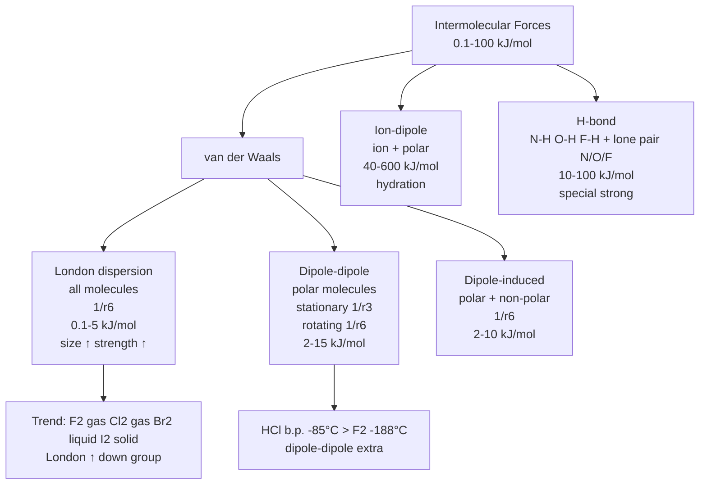
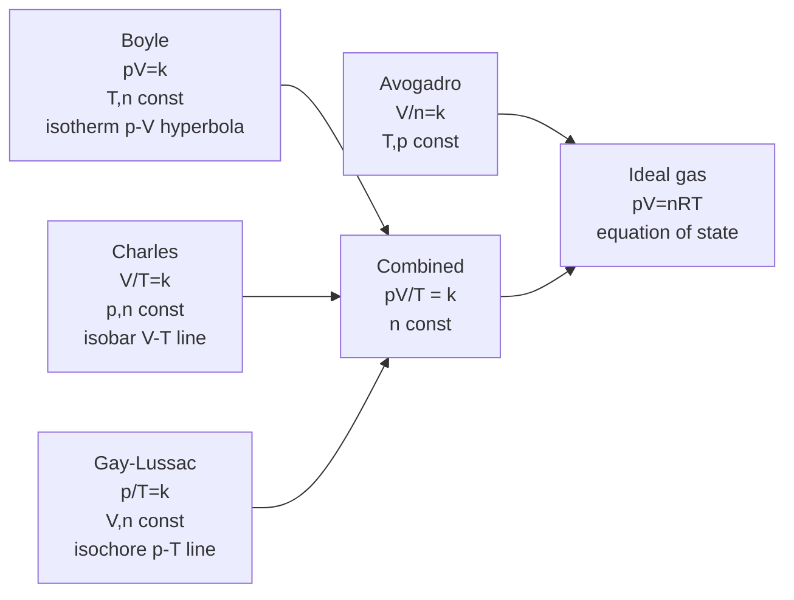
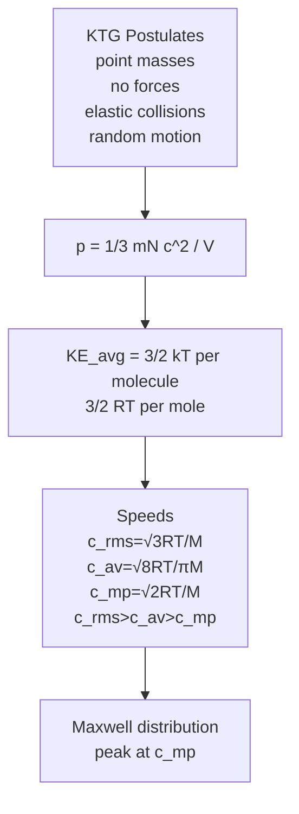
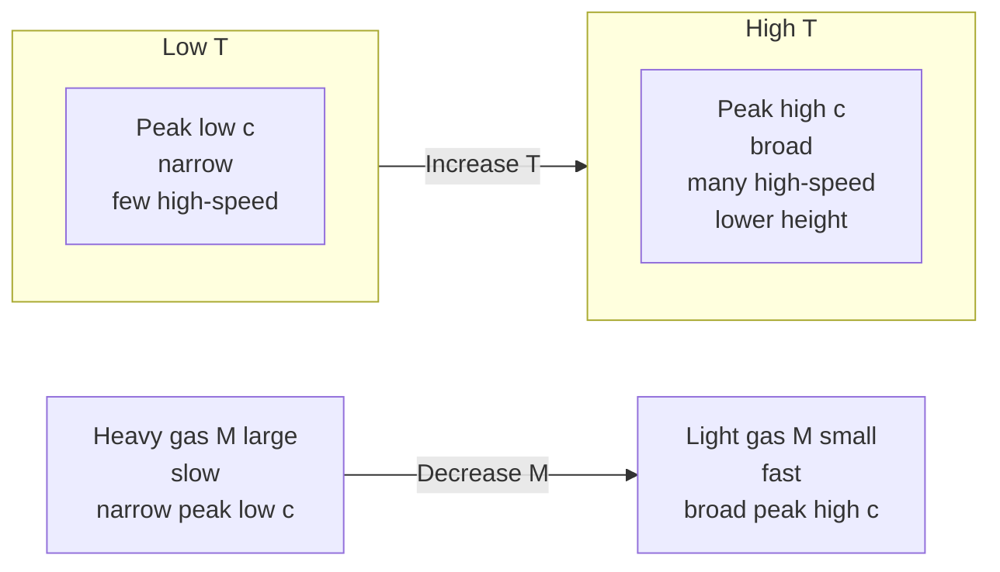
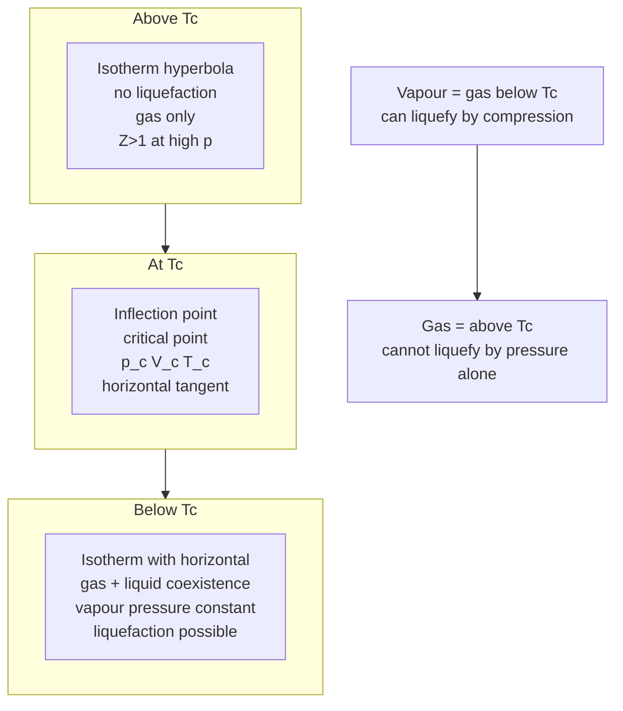

# States of Matter — JEE Advanced Notes

> **Sources merged into these notes**
> | Source | File |
> |---|---|
> | NCERT Class XI Chemistry legacy 2018-19, Unit 5 (States of Matter) | [`kech105-legacy.pdf`](kech105-legacy.pdf) |
> | Allen module for this chapter | _not uploaded yet — drop it in this folder to enable 🅰 tags_ |
>
> NCERT legacy Unit 5 (5.1–5.11) = Intermolecular forces vs thermal energy + gas laws Boyle Charles Gay-Lussac Avogadro + ideal gas equation + Dalton's partial pressures + kinetic molecular theory + Maxwell-Boltzmann + behaviour of real gases + van der Waals + liquefaction + critical constants + liquid properties vapour pressure surface tension viscosity. This notes.md is **complete basics-to-Advanced**: NCERT points kept with § numbers, JEE Advanced extensions marked 🆇, ⚠ = traps. Note: Rationalised NCERT removed this chapter, but JEE Advanced syllabus retains full gaseous state, KTG, real gases and liquid state.

## Contents

- [Part A — Intermolecular Forces vs Thermal Energy](#part-a--intermolecular-forces-vs-thermal-energy)
  1. [Intermolecular forces — London, dipole-dipole, dipole-induced, ion-dipole, H-bond (5.1)](#1-intermolecular-forces--london-dipole-dipole-dipole-induced-ion-dipole-h-bond-51)
  2. [Thermal energy and balance determining physical state (5.2–5.3)](#2-thermal-energy-and-balance-determining-physical-state-52-53)
- [Part B — Gaseous State — Gas Laws and Ideal Gas](#part-b--gaseous-state--gas-laws-and-ideal-gas)
  3. [Boyle's law — pV = constant at constant T,n — isotherms (5.5.1)](#3-boyles-law--pv--constant-at-constant-tn--isotherms-551)
  4. [Charles' law — V/T = constant at constant p,n — absolute zero (5.5.2)](#4-charles-law--vt--constant-at-constant-pn--absolute-zero-552)
  5. [Gay-Lussac's law — p/T = constant at constant V,n — isochores (5.5.3)](#5-gay-lussacs-law--pt--constant-at-constant-vn--isochores-553)
  6. [Avogadro law — V/n = constant at constant T,p — molar volume (5.5.4)](#6-avogadro-law--vn--constant-at-constant-tp--molar-volume-554)
  7. [Ideal gas equation pV = nRT and combined gas law (5.6)](#7-ideal-gas-equation-pv--nrt-and-combined-gas-law-56)
  8. [Dalton's law of partial pressures and aqueous tension (5.7)](#8-daltons-law-of-partial-pressures-and-aqueous-tension-57)
  9. [Graham's law of diffusion and effusion 🆇](#9-grahams-law-of-diffusion-and-effusion-)
  10. [Eudiometry and gas mixture problems 🆇](#10-eudiometry-and-gas-mixture-problems-)
- [Part C — Kinetic Theory of Gases (KTG)](#part-c--kinetic-theory-of-gases-ktg)
  11. [Kinetic molecular theory — postulates and pressure derivation (5.8)](#11-kinetic-molecular-theory--postulates-and-pressure-derivation-58)
  12. [Kinetic energy and molecular speeds — rms, average, most probable (5.8)](#12-kinetic-energy-and-molecular-speeds--rms-average-most-probable-58)
  13. [Maxwell-Boltzmann distribution of speeds 🆇 (5.8)](#13-maxwell-boltzmann-distribution-of-speeds--58)
  14. [Collision parameters — mean free path, collision frequency, collision number 🆇](#14-collision-parameters--mean-free-path-collision-frequency-collision-number-)
- [Part D — Real Gases and Liquefaction](#part-d--real-gases-and-liquefaction)
  15. [Behaviour of real gases — compressibility factor Z (5.9)](#15-behaviour-of-real-gases--compressibility-factor-z-59)
  16. [van der Waals equation — (p + a n²/V²)(V - nb) = nRT (5.9)](#16-van-der-waals-equation--p--a-n²v²v---nb--nrt-59)
  17. [Boyle temperature and inversion temperature 🆇](#17-boyle-temperature-and-inversion-temperature-)
  18. [Liquefaction of gases — critical constants, Andrews isotherms, continuity (5.10)](#18-liquefaction-of-gases--critical-constants-andrews-isotherms-continuity-510)
  19. [Joule-Thomson effect and methods of liquefaction 🆇](#19-joule-thomson-effect-and-methods-of-liquefaction-)
- [Part E — Liquid State](#part-e--liquid-state)
  20. [Properties of liquids — vapour pressure, surface tension, viscosity (5.11)](#20-properties-of-liquids--vapour-pressure-surface-tension-viscosity-511)
  21. [Advanced liquid concepts — capillary action and applications 🆇](#21-advanced-liquid-concepts--capillary-action-and-applications-)
- [Part F — Advanced Corner, Patterns and Revision](#part-f--advanced-corner-patterns-and-revision)
  22. [Master formula bank (print this)](#22-master-formula-bank-print-this)
  23. [Worked problem patterns — JEE Advanced favourites](#23-worked-problem-patterns--jee-advanced-favourites)
  24. [The 20 traps examiners use](#24-the-20-traps-examiners-use)
  25. [Quick Revision Sheet](#25-quick-revision-sheet)

---

# Part A — Intermolecular Forces vs Thermal Energy

## 1. Intermolecular forces — London, dipole-dipole, dipole-induced, ion-dipole, H-bond (5.1)

Intermolecular forces = forces between molecules (between, not within covalent bonds). Intramolecular = covalent bonds 200-800 $kJ mol^{-1}$. Intermolecular = 0.1-100 $kJ mol^{-1}$.

Types:

**a) London dispersion / dispersion forces**: Present in ALL atoms/molecules, even non-polar. Due to instantaneous dipole — momentary unsymmetrical electron cloud in atom A → instantaneous dipole → induces dipole in neighbour B → attraction. First proposed by Fritz London.

- Energy ∝ $1/r^6$, $r$ = distance between molecules.
- Important only at short distances ~500 pm.
- Magnitude ∝ polarisability (ease of distorting electron cloud). Larger size, more electrons → more polarisable → stronger London.
- Example trend: $\ce{F2}$ gas b.p. -188°C, $\ce{Cl2}$ gas -34°C, $\ce{Br2}$ liquid 59°C, $\ce{I2}$ solid 184°C — London increases down group.

**b) Dipole-dipole**: Between polar molecules with permanent dipole. Partial charges $δ+$ $δ-$ attract.

- Stationary polar molecules (solid): energy ∝ $1/r^3$.
- Rotating polar molecules (liquid/gas, dipoles rotating): energy ∝ $1/r^6$ (Keen to average).
- Stronger than London but weaker than ion-ion. Cumulative with London.
- Example: $\ce{HCl}$ $δ+$ H of one attracts $δ-$ Cl of other. $\ce{HCl}$ b.p. -85°C vs $\ce{F2}$ -188°C — polar has higher b.p. due to dipole-dipole + London.

**c) Dipole-induced dipole**: Polar molecule with permanent dipole induces dipole in non-polar by deforming its electron cloud.

- Energy ∝ $1/r^6$.
- Depends on dipole moment of polar and polarisability of non-polar.
- Example: $\ce{H2O}$ and $\ce{O2}$ — polar water induces dipole in $\ce{O2}$, helps $\ce{O2}$ dissolve in water (small solubility).
- Also $\ce{I2}$ in water low, but in presence of polar?

**d) Ion-dipole**: Ion + polar molecule. Not van der Waals but important. Example: $\ce{Na+}$ + $\ce{H2O}$ — ion-dipole attraction causes hydration, dissolution of ionic compounds. Strength depends on charge density of ion and dipole moment.

**e) Hydrogen bonding**: Special strong dipole-dipole when H bonded to highly electronegative N,O,F interacts with lone pair of N,O,F of other molecule. Energy 10-100 $kJ mol^{-1}$ — significantly stronger than other van der Waals (0.1-10 $kJ mol^{-1}$). Determines high b.p. of $\ce{H2O}$, $\ce{HF}$, $\ce{NH3}$, structure of proteins, DNA double helix.

Species like Cl can also show weak H-bonding but NCERT limits to N,O,F.

**Repulsive forces**: At very close distances, electron clouds and nuclei repel. Magnitude rises very rapidly as distance decreases. Reason liquids/solids hard to compress — molecules already close, further compression increases repulsion sharply.



## 2. Thermal energy and balance determining physical state (5.2–5.3)

Thermal energy = energy of body arising from motion of atoms/molecules. Directly proportional to temperature, measure of average kinetic energy. Responsible for thermal motion.

Balance:

- Intermolecular forces try to bring molecules together, favour solid/liquid.
- Thermal energy tries to separate molecules, favour gas.

- Low T, strong intermolecular forces → thermal energy low → solid (forces dominate).
- Moderate T, moderate forces → liquid (balance).
- High T, weak forces → gas (thermal dominates).

Example: $\ce{H2O}$: at low T ice (H-bonds hold lattice), at moderate T liquid (H-bonds partially broken, molecules mobile), at high T steam (H-bonds broken, free).

Predominance of thermal over intermolecular → gas. Predominance of intermolecular over thermal → solid. Intermediate → liquid.

---

# Part B — Gaseous State — Gas Laws and Ideal Gas

## 3. Boyle's law — pV = constant at constant T,n — isotherms (5.5.1)

Robert Boyle 1662: At constant temperature and amount, pressure of fixed amount of gas inversely proportional to volume.

$p ∝ 1/V$ → $pV = k_1$ constant depends on $T,n$.

$p_1 V_1 = p_2 V_2$.

Graphs at constant T (isotherms):

- $p$ vs $V$: rectangular hyperbola.
- $p$ vs $1/V$: straight line through origin slope $k_1$.
- $pV$ vs $p$: horizontal line (for ideal gas $pV$ constant).
- $V$ vs $1/p$: straight line through origin.

Example: Balloon 2.27 L at 1 bar, bursts at 0.2 bar, $T$ constant → $V_2 = p_1 V_1 / p_2 = 1×2.27/0.2 = 11.35 L$ max before burst.

## 4. Charles' law — V/T = constant at constant p,n — absolute zero (5.5.2)

Jacques Charles 1787, Gay-Lussac: At constant pressure and amount, volume directly proportional to absolute temperature.

$V ∝ T$ → $V/T = k_2$ → $V_1/T_1 = V_2/T_2$, $T$ in Kelvin.

$V_t = V_0 (1 + t/273.15)$, $V_0$ at 0°C, $t$ in °C.

Kelvin scale: $T(K) = t(°C) + 273.15$, absolute zero = -273.15°C where $V=0$ hypothetical (all gases liquefy before). $0°C = 273.15 K$.

Isobar = $V-T$ graph at constant $p$, straight line, extrapolates to zero at -273.15°C, slopes different at different $p$ but all meet at -273.15°C.

Example: 2 L at 23.4°C (296.4 K) → at 26.1°C (299.1 K) at same $p$ → $V_2 = 2×299.1/296.4 = 2.018 L$.

## 5. Gay-Lussac's law — p/T = constant at constant V,n — isochores (5.5.3)

Joseph Gay-Lussac: At constant volume and amount, pressure directly proportional to absolute temperature.

$p ∝ T$ → $p/T = k_3$ → $p_1/T_1 = p_2/T_2$.

Isochore = $p-T$ graph at constant $V$, straight line through origin in Kelvin.

Explains tyre pressure increase on hot summer day, decrease on cold morning.

## 6. Avogadro law — V/n = constant at constant T,p — molar volume (5.5.4)

Amedeo Avogadro 1811: Equal volumes of all gases at same $T,p$ contain equal number of molecules (moles).

$V ∝ n$ → $V/n = k_4$.

1 mol any gas at STP (new IUPAC 0°C 1 bar) = 22.71098 L, old STP 0°C 1 atm = 22.413996 L, SATP 25°C 1 bar = 24.789 L, at 25°C 1 atm = 24.45 L.

Molar volume $V_m = V/n$.

Density $d = m/V = M/V_m = pM/RT$ → $M = dRT/p$, $d ∝ M$ at same $T,p$.

Number of moles $n = m/M$.

## 7. Ideal gas equation pV = nRT and combined gas law (5.6)

Combine three laws:

At const $T,n$: $V ∝ 1/p$ Boyle
At const $p,n$: $V ∝ T$ Charles
At const $p,T$: $V ∝ n$ Avogadro

Thus $V ∝ nT/p$ → $V = R nT/p$ → $pV = nRT$.

$R$ = universal gas constant, same for all gases.

Values:

- $R = 8.314 J K^{-1} mol^{-1} = 8.314 Pa m^3 K^{-1} mol^{-1} = 8.314×10^{-2} bar L K^{-1} mol^{-1} = 0.082057 L atm K^{-1} mol^{-1} = 1.987 cal K^{-1} mol^{-1} = 0.08314 bar L$.

Equation of state: describes state of gas.

Combined gas law for fixed $n$: $p_1 V_1 / T_1 = p_2 V_2 / T_2 = nR$ constant. If $n$ varies: $p_1 V_1 / n_1 T_1 = p_2 V_2 / n_2 T_2 = R$.

If $T,p,n$ known, $V$ can be calculated.



## 8. Dalton's law of partial pressures and aqueous tension (5.7)

John Dalton 1801: For mixture of non-reacting gases, total pressure = sum of partial pressures each gas would exert if alone at same $T,V$.

$p_{total} = p_1 + p_2 + p_3 + ...$

Partial pressure $p_i = χ_i p_{total}$, $χ_i = n_i / n_{total}$ mole fraction.

Also $p_i = n_i RT / V$.

Aqueous tension = vapour pressure of water when gas collected over water. $p_{dry\ gas} = p_{total} - p_{H_2O}$.

Example: $\ce{O2}$ collected over water at 20°C total 1 bar, $p_{H_2O}=2.34 kPa$ → $p_{O2}=100-2.34=97.66 kPa$.

Dalton's law only for non-reacting gases, ideal behaviour.

## 9. Graham's law of diffusion and effusion 🆇

Thomas Graham 1833: Rate of diffusion/effusion of gas inversely proportional to square root of molar mass (or density) at same $T,p$.

$r ∝ 1/√M$ → $r_1/r_2 = √{M_2/M_1} = √{d_2/d_1}$.

Diffusion = mixing of gases due to random motion (e.g., perfume spreads). Effusion = escape through small hole (pinhole) into vacuum.

Time taken for same volume to diffuse/effuse $t ∝ √M$ → $t_1/t_2 = √{M_1/M_2}$.

Example: $\ce{H2}$ $M=2$ diffuses 4 times faster than $\ce{O2}$ $M=32$ because $√{32/2}=√16=4$.

For mixture, lighter gas diffuses faster, so remaining mixture becomes richer in heavier gas — used for separation of isotopes ($\ce{^{235}UF6}$ vs $\ce{^{238}UF6}$).

## 10. Eudiometry and gas mixture problems 🆇

Eudiometry = analysis of gas mixtures involving combustion, using volume relationships (Gay-Lussac law).

Example: Mixture $\ce{CH4 + H2}$ burnt with $\ce{O2}$, volume of $\ce{CO2}$ produced gives $\ce{CH4}$ amount.

Method:

- Write balanced combustion: $\ce{CH4 + 2O2 -> CO2 + 2H2O(l)}$, volume of $\ce{CO2}$ = volume of $\ce{CH4}$ (same $T,p$).
- $\ce{2H2 + O2 -> 2H2O(l)}$, $\ce{H2}$ volume does not give $\ce{CO2}$.
- So $\ce{CO2}$ volume directly gives $\ce{CH4}$.

General approach: Use $pV=nRT$ to convert volumes to moles at same $T,p$ → mole ratio = volume ratio.

For gas mixture with reaction, use POAC or ICE table with volumes.

---

# Part C — Kinetic Theory of Gases (KTG)

## 11. Kinetic molecular theory — postulates and pressure derivation (5.8)

Kinetic theory explains gas laws based on molecular motion. Postulates:

1. Gas consists of large number of tiny particles (atoms/molecules) identical, volume negligible compared to total volume (point masses).
2. No forces between particles except during collisions (ideal, no attraction/repulsion).
3. Particles in constant random motion, collisions with walls cause pressure.
4. Collisions elastic (no net energy loss, kinetic energy conserved).
5. Average kinetic energy proportional to absolute temperature: $KE_{avg}=3/2 k_B T$ per molecule, $3/2 RT$ per mole, where $k_B$ = Boltzmann constant $1.3806×10^{-23} J/K = R/N_A$.
6. At any $T$, distribution of speeds, but average $KE$ same for all gases.

Derivation of pressure (for JEE Advanced):

Consider $N$ molecules mass $m$ in cube side $l$, volume $V=l^3$. Molecule moving with velocity components $c_x, c_y, c_z$. Collision with wall perpendicular to $x$ → change in momentum $Δp=2 m c_x$, time between collisions $2l/c_x$, force = $Δp/Δt = m c_x^2 / l$. Summing over all molecules and averaging, using $c^2 = c_x^2 + c_y^2 + c_z^2$ and isotropy $\overline{c_x^2}= \overline{c_y^2}= \overline{c_z^2}= \overline{c^2}/3$.

$p = \frac{1}{3} \frac{m N \overline{c^2}}{V} = \frac{1}{3} \frac{M \overline{c^2}}{V_m}$ where $M$ = molar mass.

Thus $pV = 1/3 m N \overline{c^2} = 2/3 N × (1/2 m \overline{c^2}) = 2/3 N × KE_{avg}$.

But $pV = nRT = N k_B T$ → $KE_{avg} = 3/2 k_B T$ per molecule, $3/2 RT$ per mole. Proved.

## 12. Kinetic energy and molecular speeds — rms, average, most probable (5.8)

From $pV = 1/3 m N \overline{c^2} = nRT$:

- $\overline{c^2} = 3RT/M$ → root mean square speed $c_{rms} = √{\overline{c^2}} = √{3RT/M} = √{3k_B T/m} = √{3p/d}$ where $d$ = density.

- Average speed $c_{av} = √{8RT/πM}$ (from Maxwell distribution integration).

- Most probable speed $c_{mp} = √{2RT/M}$ (speed at which maximum fraction of molecules).

Relation: $c_{mp} : c_{av} : c_{rms} = 1 : 1.128 : 1.224$ → $c_{rms} > c_{av} > c_{mp}$.

- $c_{mp} = 0.816 c_{rms}$, $c_{av} = 0.921 c_{rms}$.

Kinetic energy per molecule $= 1/2 m c_{rms}^2? Actually $1/2 m \overline{c^2} = 3/2 k_B T$, but $1/2 m c_{rms}^2 = 3/2 k_B T$ same because $c_{rms}^2 = \overline{c^2}$.

$KE_{avg}$ same for all gases at same $T$, but speeds inversely proportional to $√M$ — lighter gases faster.

Example: $\ce{O2}$ at 27°C (300 K) $M=0.032 kg/mol$, $c_{rms}=√{3×8.314×300/0.032}=483 m/s$, $\ce{H2}$ $M=0.002 kg/mol$ $c_{rms}=1930 m/s$ 4 times faster.



## 13. Maxwell-Boltzmann distribution of speeds 🆇 (5.8)

James Maxwell and Boltzmann: At given $T$, molecules have distribution of speeds, not all same. Fraction of molecules with speed between $c$ and $c+dc$:

$f(c) dc = 4π (m/2πk_B T)^{3/2} c^2 e^{-mc^2/2k_B T} dc$

Plot $f(c)$ vs $c$: starts at 0, rises to max at $c_{mp}$, then decays, asymmetric with tail to high speeds, area = 1 (total fraction).

Effect of $T$: As $T$ increases, peak shifts to higher speed, broadens, height decreases, area constant. More molecules have high speeds at high $T$, more fraction can overcome activation energy.

Effect of $M$: Lighter gas broader, higher speeds, peak at higher $c$, lower height. Heavier gas narrower, peak at lower $c$.

Formulas:

- $c_{mp} = √{2RT/M}$
- $c_{av} = √{8RT/πM} = 1.128 c_{mp}$
- $c_{rms} = √{3RT/M} = 1.224 c_{mp}$

$KE_{avg}$ same for all gases at same $T$, but speeds inversely proportional to $√M$.



## 14. Collision parameters — mean free path, collision frequency, collision number 🆇

Advanced KTG for JEE Advanced:

- **Collision diameter $d$**: distance between centres at collision, approx molecular diameter.
- **Mean free path $λ$**: average distance travelled between two successive collisions.

$λ = \frac{k_B T}{√2 π d^2 p} = \frac{RT}{√2 π d^2 N_A p}$

For air at STP, $λ ≈ 66 nm$.

$λ ∝ T/p$, $λ ∝ 1/(d^2 p)$ — increases with $T$, decreases with $p$ and molecular size.

- **Collision frequency $Z_1$**: number of collisions per molecule per second.

$Z_1 = \frac{c_{av}}{λ} = √2 π d^2 c_{av} (N/V)$

- **Collision number $Z_{11}$**: total collisions per unit volume per second between like molecules.

$Z_{11} = \frac{1}{2} (N/V) Z_1 = \frac{1}{√2} π d^2 c_{av} (N/V)^2$

- **Collision with wall**: number of collisions per unit area per second $Z_w = \frac{1}{4} (N/V) c_{av}$.

These explain pressure, diffusion, viscosity.

---

# Part D — Real Gases and Liquefaction

## 15. Behaviour of real gases — compressibility factor Z (5.9)

Ideal gas assumptions fail at high pressure and low temperature:

- At high $p$, volume of molecules not negligible compared to total volume.
- At low $T$, high $p$, intermolecular forces not negligible.

Deviation measured by compressibility factor $Z = pV / nRT = pV_m / RT$.

- For ideal gas, $Z=1$ at all $T,p$.
- For real gases, $Z ≠ 1$.

Plot $Z$ vs $p$ at constant $T$ (0°C):

- At low $p$, $Z ≈ 1$ (ideal behaviour).
- At moderate $p$, $Z <1$ for most gases (attractive forces dominate, $pV < nRT$, easier to compress, $p$ less than ideal due to attraction pulling molecules back).
- At high $p$, $Z >1$ (repulsive, finite volume dominates, $pV > nRT$, harder to compress).
- For $\ce{H2}$, $\ce{He}$ at 0°C, $Z >1$ even at low $p$ because very small, weak attractive, repulsive dominates always.

Boyle temperature $T_B$: temperature at which real gas behaves ideally over wide $p$ range, $Z ≈ 1$ at moderate $p$. Above $T_B$, $Z>1$, below $T_B$, $Z<1$ at moderate $p$.

$T_B = a/Rb$ for van der Waals gas.

## 16. van der Waals equation — (p + a n²/V²)(V - nb) = nRT (5.9)

Johannes van der Waals 1873 Nobel 1910 corrected ideal gas equation for real gases:

- Correction for attractive forces: pressure reduced because molecules attract each other, pulling back from walls. Effective pressure $p_{ideal} = p_{real} + a n^2 / V^2$, where $a$ measures strength of attractive forces (larger $a$ → stronger attraction, easier to liquefy, higher $T_c$).
- Correction for finite volume: volume available for movement less than total volume because molecules have finite size, excluded volume. $V_{ideal} = V_{real} - nb$, where $b$ = excluded volume ~4 times actual volume of molecules (for 1 mol, $b = 4 N_A × (4/3 π r^3)$), measure of size.

Equation: $\left(p + \frac{a n^2}{V^2}\right)(V - nb) = nRT$.

For 1 mol: $\left(p + \frac{a}{V_m^2}\right)(V_m - b) = RT$.

Units: $a$ in $L^2 bar mol^{-2}$ or $Pa m^6 mol^{-2}$, $b$ in $L mol^{-1}$ or $m^3 mol^{-1}$.

Larger $a$ → more deviation, easier liquefaction. $\ce{NH3}$ $a=4.17$, $\ce{CO2}$ $a=3.59$, $\ce{H2}$ $a=0.244$, $\ce{He}$ $a=0.034$ $L^2 bar mol^{-2}$.

At low $p$, $V$ large, $a n^2/V^2$ negligible, $V-nb ≈ V$ → ideal.

At high $p$, $V$ small, $b$ significant, $Z>1$.

```mermaid
flowchart LR
    Ideal[pV=nRT<br>no forces<br>point masses<br>Z=1] -->|Correct for attraction<br>p_ideal = p_real + a n2/V2| Pcorr[(p + a n2/V2)]
    Ideal -->|Correct for volume<br>V_ideal = V_real - nb| Vcorr[(V - nb)]
    Pcorr & Vcorr --> VDW[(p + a n2/V2)(V - nb)=nRT<br>real gas<br>Z≠1]
```

## 17. Boyle temperature and inversion temperature 🆇

**Boyle temperature $T_B$**: $T$ at which $Z=1$ over wide $p$ range, real gas behaves ideally at moderate $p$. Below $T_B$, $Z<1$ initially then $>1$ at high $p$. Above $T_B$, $Z>1$ always.

For van der Waals: $T_B = a / Rb$.

**Inversion temperature $T_i$**: Temperature below which gas cools on Joule-Thomson expansion (free expansion through porous plug), above which gas warms on expansion. Related to $T_B$.

For van der Waals: $T_i = 2a / Rb = 2 T_B$.

For $\ce{H2}$ and $\ce{He}$, $T_i$ very low (~200 K and 40 K), so at room T they warm on expansion, need pre-cooling to liquefy.

Relation: $T_B = 27/8 T_c = 3.375 T_c$ for vdW, $T_i = 27/4 T_c = 6.75 T_c$.

## 18. Liquefaction of gases — critical constants, Andrews isotherms, continuity (5.10)

Gases can be liquefied by cooling and/or compression.

Thomas Andrews 1869 studied $\ce{CO2}$ isotherms ($p-V$ at constant $T$):

- At high $T$ (above critical), isotherms hyperbolic like ideal, no liquefaction however high $p$, $p$ increases continuously as $V$ decreases.
- At low $T$, isotherm shows horizontal region where gas and liquid coexist, $p$ constant = vapour pressure, as $V$ decreases, gas condenses to liquid at constant $p$.
- At critical temperature $T_c$, horizontal region just disappears, inflection point, $p-V$ curve has point of inflection with horizontal tangent.

Critical constants:

- **Critical temperature $T_c$**: temperature above which gas cannot be liquefied by pressure alone, however high $p$. Highest $T$ at which liquid can exist.
- **Critical pressure $p_c$**: minimum pressure required to liquefy gas at $T_c$.
- **Critical volume $V_c$**: volume occupied by 1 mol gas at $T_c$, $p_c$.

For van der Waals gas: $T_c = 8a/27Rb$, $p_c = a/27b^2$, $V_c = 3b$, $Z_c = p_c V_c / RT_c = 3/8 =0.375$ (real $Z_c$ ~0.27-0.29).

Gases with low $T_c$ ($\ce{H2}$ 33.2 K, $\ce{He}$ 5.2 K, $\ce{N2}$ 126 K, $\ce{O2}$ 154 K) hard to liquefy, need very low T. Gases with high $T_c$ ($\ce{CO2}$ 304.1 K, $\ce{NH3}$ 405.5 K, $\ce{H2O}$ 647 K) easy to liquefy.

Continuity of state: gaseous and liquid states continuous, no sharp boundary above $T_c$, can go from gas to liquid without passing through two-phase region by going around critical point (e.g., heat gas above $T_c$, compress, cool below $T_c$).

Vapour vs gas: Vapour = gas below $T_c$, can be liquefied by compression alone at that $T$. Gas = above $T_c$, cannot be liquefied by compression alone.



## 19. Joule-Thomson effect and methods of liquefaction 🆇

**Joule-Thomson effect**: When real gas expands adiabatically through porous plug or valve from high $p$ to low $p$, temperature changes (unlike ideal gas $T$ constant).

- If gas cools on expansion → positive Joule-Thomson effect, $μ_{JT} = (∂T/∂p)_H >0$, occurs below inversion temperature $T_i$.
- If gas warms → negative effect, $μ_{JT}<0$, above $T_i$.

Most gases at room T have $T < T_i$ (except $\ce{H2}$, $\ce{He}$) → cool on expansion → used for liquefaction.

Methods:

- **Linde's method**: Compression, cooling, Joule-Thomson expansion, recirculation.
- **Claude's method**: Includes isentropic expansion doing work.

For $\ce{H2}$ and $\ce{He}$, $T_i$ low, so at room T they warm on expansion, must be pre-cooled below $T_i$ using liquid $\ce{N2}$ or liquid $\ce{H2}$ before Joule-Thomson can cool further.

---

# Part E — Liquid State

## 20. Properties of liquids — vapour pressure, surface tension, viscosity (5.11)

Liquids have intermediate properties between solid and gas, definite volume but no definite shape.

**Vapour pressure**: At given $T$, liquid in closed vessel evaporates until equilibrium $\ce{liquid <=> vapour}$, pressure exerted by vapour = equilibrium vapour pressure, depends only on $T$ and nature of liquid, not amount of liquid or vessel volume (as long as some liquid present). Increases with $T$ exponentially (Clausius-Clapeyron).

Boiling point = $T$ where vapour pressure = external pressure. Normal boiling point where vapour pressure = 1 atm (1.013 bar). At high altitude $p_{ext}$ lower → lower b.p., cooking difficult. In pressure cooker $p_{ext}$ higher → higher b.p., faster cooking.

**Surface tension $γ$**: Liquid surface tends to contract to minimum area due to unbalanced intermolecular forces at surface (molecules at surface attracted inward, no outward attraction). Force per unit length ($N m^{-1}$) or energy per unit area ($J m^{-2}$). Causes spherical drops (minimum area for given volume), capillary rise, meniscus, insects walking on water.

$γ$ decreases with $T$, zero at $T_c$ (no difference liquid-vapour). Water high surface tension due to H-bonding (0.0728 $N m^{-1}$ at 20°C) vs organic liquids lower.

**Viscosity $η$**: Resistance to flow, due to friction between layers. Units $Pa s$ or poise ($1 P = 0.1 Pa s$). $F = η A (du/dx)$, Newton's law, $du/dx$ = velocity gradient.

$η$ decreases with $T$ for liquids (molecules move easier, less friction). For gases, $η$ increases with $T$ (more collisions).

Water low viscosity, honey high. Stronger intermolecular forces → higher viscosity. Hydrogen bonding increases viscosity.

## 21. Advanced liquid concepts — capillary action and applications 🆇

- **Capillary action**: Rise/fall of liquid in narrow tube due to surface tension and adhesion vs cohesion.

$h = \frac{2γ \cosθ}{r ρ g}$

where $h$ = rise, $γ$ = surface tension, $θ$ = contact angle, $r$ = radius of capillary, $ρ$ = density, $g$ = gravity.

If adhesion > cohesion (water-glass), $θ<90°$, $\cosθ$ positive → rise, concave meniscus. If cohesion > adhesion (Hg-glass), $θ>90°$, $\cosθ$ negative → fall, convex meniscus.

- **Effect of temperature**: $γ$ and $η$ both decrease with $T$ for liquids.
- **Vapour pressure lowering**: colligative property, will be studied in Solutions $p_{solution}=χ_{solvent} p°_{solvent}$.
- **Applications**: Surface tension in detergents (reduce $γ$), viscosity in lubricants, capillary in plants water transport.

---

# Part F — Advanced Corner, Patterns and Revision

## 22. Master formula bank (print this)

**Gas laws**:

- Boyle: $p_1 V_1 = p_2 V_2$ (T,n const) isotherm $p-V$ hyperbola
- Charles: $V_1/T_1 = V_2/T_2$ (p,n const) isobar $V-T$ line, $T(K)=t(°C)+273.15$, absolute zero -273.15°C
- Gay-Lussac: $p_1/T_1 = p_2/T_2$ (V,n const) isochore $p-T$ line
- Avogadro: $V_1/n_1 = V_2/n_2$ (T,p const) molar volume 22.71 L at 1 bar STP, 22.4 L at 1 atm, 24.79 L SATP 25°C 1 bar
- Combined: $p_1 V_1 / T_1 = p_2 V_2 / T_2$ (n const), $p_1 V_1 / n_1 T_1 = p_2 V_2 / n_2 T_2$
- Ideal: $pV = nRT$, $R=8.314 J/mol K=0.0821 L atm/mol K=0.08314 bar L/mol K=1.987 cal$
- Dalton: $p_{total}=∑p_i$, $p_i=χ_i p_{total}$, $χ_i=n_i/n_{total}$, aqueous tension $p_{dry}=p_{total}-p_{H2O}$
- Graham: $r_1/r_2 = √{M_2/M_1}=√{d_2/d_1}$, $t_1/t_2=√{M_1/M_2}$, lighter diffuses faster
- Density: $d= pM/RT$, $M= dRT/p$

**Kinetic theory**:

- $pV=1/3 mN \overline{c^2}=1/3 M \overline{c^2}/V_m? Actually $pV=1/3 mN \overline{c^2}$
- $KE_{avg}=3/2 k_B T$ per molecule, $3/2 RT$ per mole
- $c_{rms}=√{3RT/M}=√{3k_B T/m}=√{3p/d}$, $c_{av}=√{8RT/πM}$, $c_{mp}=√{2RT/M}$, $c_{rms}>c_{av}>c_{mp}$, ratio $1.224:1.128:1$, $c_{mp}=0.816 c_{rms}$, $c_{av}=0.921 c_{rms}$
- Maxwell distribution $f(c)=4π(m/2πkT)^{3/2} c^2 e^{-mc^2/2kT}$
- Mean free path $λ = k_B T / √2 π d^2 p = RT / √2 π d^2 N_A p$, $λ ∝ T/p$, $λ ∝ 1/(d^2 p)$
- Collision frequency $Z_1 = c_{av}/λ$, collision number $Z_{11}=1/√2 π d^2 c_{av} (N/V)^2$, wall collisions $Z_w=1/4 (N/V) c_{av}$

**Real gases**:

- $Z=pV_m/RT$, ideal $Z=1$, $Z<1$ attractive dominates moderate p, $Z>1$ repulsive high p, $\ce{H2 He}$ $Z>1$ even low p
- van der Waals: $(p+a n^2/V^2)(V-nb)=nRT$, for 1 mol $(p+a/V_m^2)(V_m-b)=RT$, $a$ attraction $L^2 bar/mol^2$, $b$ volume $L/mol$
- Boyle temp $T_B=a/Rb$, inversion $T_i=2a/Rb=2T_B$, $T_B=27/8 T_c=3.375 T_c$, $T_i=27/4 T_c=6.75 T_c$
- Critical: $T_c=8a/27Rb$, $p_c=a/27b^2$, $V_c=3b$, $Z_c=3/8=0.375$ vdW, real ~0.27-0.29
- Joule-Thomson $μ_{JT}=(∂T/∂p)_H$, cooling below $T_i$, warming above $T_i$, $\ce{H2 He}$ low $T_i$ need pre-cooling

**Liquid**:

- Vapour pressure $p_{vap}$ increases with T, b.p. when $p_{vap}=p_{ext}$, Clausius-Clapeyron $ln p = -Δ_{vap}H/RT + const$
- Surface tension $γ$ force/length $N/m$, $γ$ ↓ with T zero at $T_c$, capillary $h=2γ cosθ/rρg$, concave if adhesion>cohesion $θ<90°$ rise, convex if cohesion>adhesion $θ>90°$ fall
- Viscosity $η$, $F=η A du/dx$, liquids $η$ ↓ with T, gases $η$ ↑ with T

## 23. Worked problem patterns — JEE Advanced favourites

**Pattern 1 — Combined gas law**:

2 L at 1 bar 27°C (300 K) to 0.5 bar 127°C (400 K): $V_2= p_1 V_1 T_2 / p_2 T_1 =1×2×400/0.5×300=5.33 L$.

**Pattern 2 — Ideal gas density and molar mass**:

Find M from density 1.5 g/L at 1 bar 300 K: $M= dRT/p =1.5×0.08314×300/1=37.4 g/mol$.

**Pattern 3 — Dalton's law with aqueous tension**:

$\ce{O2}$ collected over water at 27°C total 1.2 bar, $p_{H2O}=0.035 bar$ → $p_{O2}=1.165 bar$, moles $n=pV/RT$.

**Pattern 4 — Graham's law**:

$\ce{H2}$ and $\ce{O2}$ diffusion: $r_{H2}/r_{O2}=√{32/2}=4$, $\ce{H2}$ 4 times faster, time ratio inverse $t_{O2}/t_{H2}=4$.

Isotope separation $\ce{^{235}UF6}$ $M=349$ vs $\ce{^{238}UF6}$ $M=352$: $r_{235}/r_{238}=√{352/349}=1.0043$ slight enrichment per stage.

**Pattern 5 — Kinetic speeds**:

Calculate $c_{rms}$ for $\ce{O2}$ at 27°C: $M=0.032 kg/mol$, $c_{rms}=√{3×8.314×300/0.032}=483 m/s$, $c_{mp}=0.816×483=394 m/s$, $c_{av}=0.921×483=445 m/s$.

**Pattern 6 — Maxwell distribution effect**:

At higher T, fraction with $c > c_{threshold}$ increases exponentially, explains rate increase with T.

**Pattern 7 — van der Waals and critical constants**:

Given $a=3.59 L^2 bar/mol^2$, $b=0.0427 L/mol$ for $\ce{NH3}$, find $T_c=8a/27Rb=8×3.59/(27×0.08314×0.0427)=299 K$? Actually $R=0.08314$ → $T_c≈ 405 K$ (use correct units). $p_c=a/27b^2=3.59/(27×0.0427^2)=72.9 bar$.

**Pattern 8 — Real gas Z**:

At 500 bar, $Z=1.2$, find $V_m=ZRT/p=1.2×0.08314×300/500=0.0599 L/mol$ vs ideal $0.0499 L/mol$.

**Pattern 9 — Eudiometry**:

Mixture $\ce{CH4 + H2}$ 10 mL burnt with excess $\ce{O2}$, contraction 15 mL, $\ce{CO2}$ 5 mL produced → $\ce{CH4}=5 mL$ (since $\ce{CH4}$ gives 1 vol $\ce{CO2}$), $\ce{H2}=5 mL$ remaining.

**Pattern 10 — Mean free path**:

Air at STP $d≈0.36 nm$, $p=1 bar$, $T=300 K$, $λ = kT/√2 π d^2 p ≈ 66 nm$.

## 24. The 20 traps examiners use

1. $T$ must be Kelvin for gas laws, not °C.
2. $R$ value must match units of $p,V$ — $0.0821 L atm$ vs $0.08314 bar L$ vs $8.314 J$.
3. STP new IUPAC 1 bar 22.71 L, old 1 atm 22.4 L, SATP 24.79 L — check question.
4. Dalton's law only for non-reacting gases, not for $\ce{NH3 + HCl}$.
5. Aqueous tension subtract for gas collected over water $p_{dry}=p_{total}-p_{H2O}$.
6. $p_i=χ_i p_{total}$ only for ideal mixture, mole fraction $χ_i=n_i/n_{total}$.
7. Graham's law rate ∝ $1/√M$, time ∝ $√M$ — inverse.
8. $c_{rms}>c_{av}>c_{mp}$, not equal, ratio $1.224:1.128:1$.
9. $KE_{avg}$ same for all gases at same T, but speeds depend on M $c∝1/√M$.
10. $Z=1$ ideal, $Z<1$ attractive dominates moderate p, $Z>1$ repulsive high p, $\ce{H2 He}$ $Z>1$ even low p.
11. van der Waals $a$ for attraction larger easier liquefaction, $b$ for volume, $a$ ↑ $T_c$ ↑.
12. $T_B=a/Rb$, $T_c=8a/27Rb$, $T_B=27/8 T_c=3.375 T_c$, $T_i=2T_B=27/4 T_c=6.75 T_c$.
13. Critical point above $T_c$ cannot liquefy by pressure alone, vapour below $T_c$ can.
14. $V_c=3b$ for vdW, not $b$, $Z_c=3/8=0.375$ ideal vdW real ~0.28.
15. Surface tension decreases with T zero at $T_c$, viscosity liquids decreases with T gases increases.
16. $pV=nRT$ only for ideal, for real use vdW $(p+a n^2/V^2)(V-nb)=nRT$.
17. Density $d=pM/RT$, $M=dRT/p$, $d∝M$ at same T,p.
18. Mean free path $λ∝T/p$ $λ∝1/(d^2 p)$, collision frequency $Z_1=c_{av}/λ$.
19. Joule-Thomson cooling below $T_i$, warming above, $\ce{H2 He}$ low $T_i$ need pre-cooling.
20. Eudiometry volume ratio = mole ratio only at same T,p, water liquid volume negligible.

## 25. Quick Revision Sheet

**Intermolecular**: London dispersion all molecules $1/r^6$ size ↑ polarisability ↑ strength ↑ b.p. ↑; dipole-dipole polar $1/r^3$ stationary $1/r^6$ rotating; dipole-induced polar+non-polar $1/r^6$; ion-dipole ion+polar hydration; H-bond N-H O-H F-H + lone pair N/O/F 10-100 kJ special strong.

**Thermal**: KE ∝ T, balance determines state: low T strong forces solid, moderate liquid, high T weak forces gas.

**Gas laws**: Boyle $pV=k$ isotherm $p-V$ hyperbola, Charles $V/T=k$ isobar $V-T$ line absolute zero -273.15°C, Gay-Lussac $p/T=k$ isochore $p-T$ line, Avogadro $V/n=k$ molar volume 22.71 L 1 bar STP 22.4 L 1 atm 24.79 L SATP, combined $pV/T=k$, ideal $pV=nRT$ $R=8.314 J=0.0821 L atm=0.08314 bar L$, Dalton $p_{total}=∑p_i$ $p_i=χ_i p_{total}$ aqueous tension $p_{dry}=p_{total}-p_{H2O}$, Graham $r∝1/√M$ $t∝√M$ lighter faster.

**KTG**: Postulates point masses no forces elastic random motion, $pV=1/3 mN \overline{c^2}$, $KE_{avg}=3/2 k_B T$ per molecule $3/2 RT$ per mole, $c_{rms}=√{3RT/M}=√{3p/d}$, $c_{av}=√{8RT/πM}$, $c_{mp}=√{2RT/M}$, $c_{rms}>c_{av}>c_{mp}$ ratio $1.224:1.128:1$, Maxwell distribution peak at $c_{mp}$ broadens shifts high with T and low M, mean free path $λ=kT/√2 π d^2 p$ $∝T/p$, collision frequency $Z_1=c_{av}/λ$.

**Real**: $Z=pV_m/RT$ $Z=1$ ideal $Z<1$ attractive moderate p $Z>1$ repulsive high p $\ce{H2 He}$ $Z>1$ always, $T_B=a/Rb$, vdW $(p+a n^2/V^2)(V-nb)=nRT$ $a$ attraction $b$ volume, critical $T_c=8a/27Rb$ $p_c=a/27b^2$ $V_c=3b$ $Z_c=3/8$, vapour below $T_c$ can liquefy by pressure gas above $T_c$ cannot, Andrews isotherms horizontal gas+liquid coexistence below $T_c$ inflection at $T_c$, continuity of state, Joule-Thomson $μ_{JT}=(∂T/∂p)_H$ cooling below $T_i=2a/Rb=2T_B$ warming above, $\ce{H2 He}$ low $T_i$ need pre-cooling, Linde Claude methods.

**Liquid**: Vapour pressure $p_{vap}$ ↑ with T b.p. when $p_{vap}=p_{ext}$, surface tension $γ$ force/length $N/m$ $γ$ ↓ with T zero at $T_c$ capillary $h=2γ cosθ/rρg$ rise if adhesion>cohesion $θ<90°$ concave fall if cohesion>adhesion $θ>90°$ convex, viscosity $η$ resistance $F=η A du/dx$ liquids $η$ ↓ with T gases $η$ ↑ with T.

---
*Cross-links:*
- Previous: [Some Basic Concepts](../01-Some-Basic-Concepts-of-Chemistry/notes.md) — mole $n$ and $R$; [Thermodynamics](../03-Thermodynamics/notes.md) — $U$ depends only on T for ideal gas, $ΔU=0$ isothermal.
- Next: [Equilibrium](../04-Equilibrium/notes.md) — $K_p$ vs $K_c$ uses $pV=nRT$ $K_p=K_c(RT)^{Δn_g}$; [Solutions](../07-Solutions/notes.md) — vapour pressure lowering $p=χ p°$.
- Related: [Chemical Kinetics](../09-Chemical-Kinetics/notes.md) — collision theory uses KTG collision frequency and Maxwell distribution for activation energy.
- Practical: Gas collection over water, determination of molar mass via $d=pM/RT$, eudiometry experiments.
