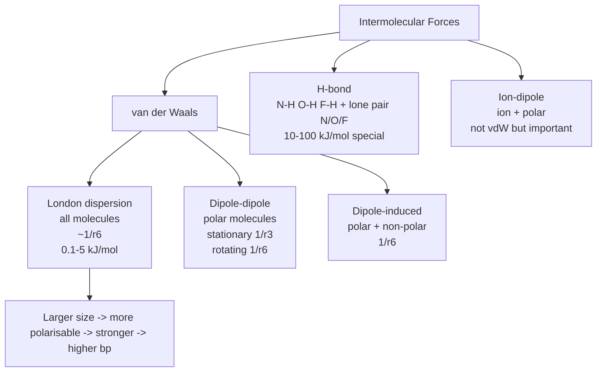
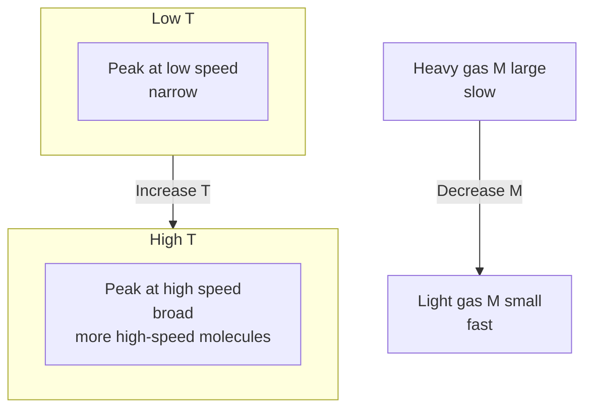

# States of Matter — JEE Advanced Notes

> **Sources merged into these notes**
> | Source | File |
> |---|---|
> | NCERT Class XI Chemistry legacy 2018-19, Unit 5 (States of Matter) | [`kech105-legacy.pdf`](kech105-legacy.pdf) |
> | Allen module for this chapter | _not uploaded yet — drop it in this folder to enable 🅰 tags_ |
>
> NCERT legacy Unit 5 (5.1–5.10) = Intermolecular forces vs thermal energy + gas laws Boyle Charles Gay-Lussac Avogadro + ideal gas equation + Dalton's law partial pressures + kinetic molecular theory + behaviour of real gases van der Waals + liquefaction of gases + liquid properties vapour pressure surface tension viscosity. This notes.md is **complete basics-to-Advanced**: NCERT points with § numbers, JEE Advanced extensions marked 🆇, ⚠ = traps. Note: In rationalised NCERT, States of Matter removed from Class XI, but JEE Advanced still includes full gaseous and liquid state.

## Contents

- [Part A — Intermolecular Forces and Thermal Energy](#part-a--intermolecular-forces-and-thermal-energy)
  1. [Intermolecular forces — London, dipole-dipole, dipole-induced, H-bond (5.1)](#1-intermolecular-forces--london-dipole-dipole-dipole-induced-h-bond-51)
  2. [Thermal energy and balance determining state (5.2–5.3)](#2-thermal-energy-and-balance-determining-state-52-53)
- [Part B — Gas Laws and Ideal Gas Equation](#part-b--gas-laws-and-ideal-gas-equation)
  3. [Boyle's law — pV = constant at constant T,n (5.5.1)](#3-boyles-law--pv--constant-at-constant-tn-551)
  4. [Charles' law — V/T = constant at constant p,n, absolute zero (5.5.2)](#4-charles-law--vt--constant-at-constant-pn-absolute-zero-552)
  5. [Gay-Lussac's law — p/T = constant at constant V,n, isochores (5.5.3)](#5-gay-lussacs-law--pt--constant-at-constant-vn-isochores-553)
  6. [Avogadro law — V/n = constant at constant T,p, molar volume (5.5.4)](#6-avogadro-law--vn--constant-at-constant-tp-molar-volume-554)
  7. [Ideal gas equation pV = nRT and combined gas law (5.6)](#7-ideal-gas-equation-pv--nrt-and-combined-gas-law-56)
  8. [Dalton's law of partial pressures and mole fraction (5.7)](#8-daltons-law-of-partial-pressures-and-mole-fraction-57)
  9. [Graham's law of diffusion/effusion 🆇](#9-grahams-law-of-diffusioneffusion-)
- [Part C — Kinetic Molecular Theory and Real Gases](#part-c--kinetic-molecular-theory-and-real-gases)
  10. [Kinetic molecular theory — postulates and kinetic energy (5.8)](#10-kinetic-molecular-theory--postulates-and-kinetic-energy-58)
  11. [Maxwell-Boltzmann distribution of molecular speeds 🆇 (5.8)](#11-maxwell-boltzmann-distribution-of-molecular-speeds--58)
  12. [Behaviour of real gases — deviations from ideal (5.9)](#12-behaviour-of-real-gases--deviations-from-ideal-59)
  13. [van der Waals equation — (p + a n²/V²)(V - nb) = nRT (5.9)](#13-van-der-waals-equation--p--a-n²v²v---nb--nrt-59)
  14. [Liquefaction of gases — critical constants, Andrews isotherms, continuity (5.10)](#14-liquefaction-of-gases--critical-constants-andrews-isotherms-continuity-510)
- [Part D — Liquid State](#part-d--liquid-state)
  15. [Properties of liquids — vapour pressure, surface tension, viscosity (5.11)](#15-properties-of-liquids--vapour-pressure-surface-tension-viscosity-511)
  16. [Advanced liquid properties and applications 🆇](#16-advanced-liquid-properties-and-applications-)
- [Part E — Advanced Corner, Patterns and Revision](#part-e--advanced-corner-patterns-and-revision)
  17. [Master formula bank (print this)](#17-master-formula-bank-print-this)
  18. [Worked problem patterns — JEE Advanced favourites](#18-worked-problem-patterns--jee-advanced-favourites)
  19. [The 20 traps examiners use](#19-the-20-traps-examiners-use)
  20. [Quick Revision Sheet](#20-quick-revision-sheet)

---

# Part A — Intermolecular Forces and Thermal Energy

## 1. Intermolecular forces — London, dipole-dipole, dipole-induced, H-bond (5.1)

Intermolecular forces = forces between molecules (not within molecule covalent). Attractive forces = van der Waals forces (Johannes van der Waals). Include:

**a) London dispersion forces / dispersion forces**: Present in all atoms/molecules, even non-polar. Due to instantaneous dipole - induced dipole. Electron cloud momentarily unsymmetrical → instantaneous dipole → induces dipole in neighbour → attraction. Energy ∝ $1/r^6$, important only at short distances ~500 pm, magnitude depends on polarisability (size). Larger molecules more polarisable → stronger London → higher b.p. Example: $\ce{F2}$ gas, $\ce{Cl2}$ gas, $\ce{Br2}$ liquid, $\ce{I2}$ solid — London increases down group.

**b) Dipole-dipole forces**: Between polar molecules with permanent dipole. Partial charges $\delta+$ $\delta-$ interact. Strength stronger than London but weaker than ion-ion. Energy: between stationary polar molecules ∝ $1/r^3$, between rotating polar molecules ∝ $1/r^6$. Example: $\ce{HCl}$: $\delta+$ H of one attracts $\delta-$ Cl of other. Cumulative with London.

**c) Dipole-induced dipole**: Polar molecule induces dipole in non-polar by deforming electron cloud. Energy ∝ $1/r^6$. Depends on dipole moment of polar and polarisability of non-polar. Example: $\ce{H2O}$ and $\ce{O2}$.

**d) Ion-dipole**: Ion + polar molecule (e.g., $\ce{Na+}$ + $\ce{H2O}$) — not van der Waals but important for solubility, hydration.

**e) Hydrogen bonding**: Special strong dipole-dipole when H bonded to highly electronegative N,O,F interacts with lone pair of N,O,F of other molecule. Energy 10-100 $kJ mol^{-1}$, much stronger than other van der Waals (0.1-10 $kJ mol^{-1}$), weaker than covalent (200-800 $kJ mol^{-1}$). Determines structure of proteins, DNA, water high b.p.

Repulsive forces: At very close distances, electron clouds and nuclei repel, rises rapidly, reason liquids/solids hard to compress.



## 2. Thermal energy and balance determining state (5.2–5.3)

Thermal energy = energy due to motion of atoms/molecules, proportional to $T$, measure of average kinetic energy.

Intermolecular forces try to hold molecules together (favour solid/liquid), thermal energy tries to separate (favour gas).

Balance:

- Low T, high intermolecular forces → solid.
- Moderate T, moderate forces → liquid.
- High T, low forces → gas.

Predominance of thermal energy over intermolecular: gas. Predominance of intermolecular over thermal: solid. Intermediate: liquid.

---

# Part B — Gas Laws and Ideal Gas Equation

## 3. Boyle's law — pV = constant at constant T,n (5.5.1)

Robert Boyle 1662: At constant temperature and amount, pressure inversely proportional to volume.

$p \propto 1/V$ → $pV = k_1$ (constant depends on $T,n$).

$p_1 V_1 = p_2 V_2$.

Graph: $p$ vs $V$ hyperbolic, $p$ vs $1/V$ straight line through origin, $pV$ vs $p$ horizontal line (for ideal gas).

Example: Balloon 2.27 L at 1 bar, bursts at 0.2 bar → $V_2 = p_1 V_1 / p_2 = 1*2.27/0.2 = 11.35 L$ max.

Isotherm = $p-V$ curve at constant $T$.

## 4. Charles' law — V/T = constant at constant p,n, absolute zero (5.5.2)

Jacques Charles 1787, Gay-Lussac: At constant pressure and amount, volume directly proportional to absolute temperature.

$V \propto T$ → $V/T = k_2$ → $V_1/T_1 = V_2/T_2$.

$V_t = V_0 (1 + t/273.15)$, where $V_0$ at 0°C, $t$ in °C.

Kelvin scale: $T(K) = t(°C) + 273.15$, absolute zero = $-273.15°C$ where $V=0$ hypothetical (all gases liquefy before). $0°C = 273.15 K$.

Isobar = $V-T$ graph at constant $p$, straight line, extrapolates to zero at $-273.15°C$.

Example: 2 L at 23.4°C (296.4 K) → at 26.1°C (299.1 K) $V_2 = 2 *299.1/296.4 =2.018 L$.

## 5. Gay-Lussac's law — p/T = constant at constant V,n, isochores (5.5.3)

Joseph Gay-Lussac: At constant volume and amount, pressure directly proportional to absolute temperature.

$p \propto T$ → $p/T = k_3$ → $p_1/T_1 = p_2/T_2$.

Isochore = $p-T$ graph at constant $V$, straight line through origin in Kelvin.

Explains tyre pressure increase on hot day.

## 6. Avogadro law — V/n = constant at constant T,p, molar volume (5.5.4)

Amedeo Avogadro 1811: Equal volumes of all gases at same $T,p$ contain equal number of molecules.

$V \propto n$ → $V/n = k_4$.

1 mol any gas at STP (0°C 1 bar) = 22.71098 L (new IUPAC), at old STP 0°C 1 atm = 22.413996 L, at SATP 25°C 1 bar = 24.789 L.

Molar volume $V_m = V/n$.

Density $d = m/V = M/V_m = pM/RT$ → $M = dRT/p$, $d \propto M$ at same $T,p$.

## 7. Ideal gas equation pV = nRT and combined gas law (5.6)

Combine Boyle, Charles, Avogadro:

$V \propto nT/p$ → $V = R nT/p$ → $pV = nRT$.

$R$ = universal gas constant, same for all gases.

Values:

- $R = 8.314 J K^{-1} mol^{-1} = 8.314 Pa m^3 K^{-1} mol^{-1} = 8.314e-2 bar L K^{-1} mol^{-1} = 0.082057 L atm K^{-1} mol^{-1} = 1.987 cal K^{-1} mol^{-1}$.

Equation of state: describes state of gas.

Combined gas law: $p_1 V_1 / T_1 = p_2 V_2 / T_2$ for fixed $n$ (from $pV/T = nR$ constant).

If $n$ varies: $p_1 V_1 / n_1 T_1 = p_2 V_2 / n_2 T_2$.

## 8. Dalton's law of partial pressures and mole fraction (5.7)

John Dalton 1801: For non-reacting gas mixture, total pressure = sum of partial pressures each gas would exert if alone at same $T,V$.

$p_{total} = p_1 + p_2 + p_3 + ...$

Partial pressure $p_i = \chi_i p_{total}$, where $\chi_i = n_i / n_{total}$ mole fraction.

Also $p_i = n_i RT / V$.

Aqueous tension = vapour pressure of water in gas collected over water. $p_{dry\ gas} = p_{total} - p_{H2O}$.

Example: $\ce{O2}$ collected over water at 20°C, total 1 bar, $p_{H2O}=2.34 kPa$ → $p_{O2}=97.66 kPa$.

## 9. Graham's law of diffusion/effusion 🆇

Thomas Graham 1833: Rate of diffusion/effusion of gas inversely proportional to square root of molar mass (or density) at same $T,p$.

$r \propto 1/\sqrt{M}$ → $r_1/r_2 = \sqrt{M_2/M_1} = \sqrt{d_2/d_1}$.

Diffusion = mixing of gases due to random motion, effusion = escape through small hole.

Time taken $t \propto \sqrt{M}$ → $t_1/t_2 = \sqrt{M_1/M_2}$.

Example: $\ce{H2}$ diffuses 4 times faster than $\ce{O2}$ because $\sqrt{32/2}=4$.

---

# Part C — Kinetic Molecular Theory and Real Gases

## 10. Kinetic molecular theory — postulates and kinetic energy (5.8)

Kinetic theory explains gas laws based on molecular motion. Postulates:

1. Gas consists of large number of tiny particles (atoms/molecules) identical, volume negligible compared to total volume.
2. No forces between particles except during collisions (ideal).
3. Particles in constant random motion, collisions with walls cause pressure.
4. Collisions elastic (no energy loss).
5. Average kinetic energy proportional to absolute temperature: $KE_{avg} = 3/2 k_B T$ per molecule, $3/2 RT$ per mole, where $k_B$ = Boltzmann constant $1.38e-23 J/K$.
6. At any T, distribution of speeds, but average $KE$ same for all gases.

From kinetic theory: $pV = 1/3 m N \bar{c^2}$ where $\bar{c^2}$ = mean square speed.

Derivation gives $pV = nRT$.

Kinetic energy: $KE = 1/2 m \bar{c^2} = 3/2 k_B T$ per molecule.

Root mean square speed $c_{rms} = \sqrt{3RT/M} = \sqrt{3k_B T/m} = \sqrt{3p/d}$.

Average speed $c_{av} = \sqrt{8RT/\pi M}$, most probable $c_{mp} = \sqrt{2RT/M}$.

Relation: $c_{mp} : c_{av} : c_{rms} = 1 : 1.128 : 1.224$ → $c_{rms} > c_{av} > c_{mp}$.

## 11. Maxwell-Boltzmann distribution of molecular speeds 🆇 (5.8)

James Maxwell and Boltzmann: At given T, molecules have distribution of speeds, not all same.

Plot: fraction of molecules vs speed, peak at $c_{mp}$, asymmetric, tail to high speeds.

Effect of T: As T increases, peak shifts to higher speed, broadens, height decreases, area constant (total molecules). More molecules have high speeds at high T.

Effect of M: Lighter gas broader, higher speeds.

Formulas:

- $c_{mp} = \sqrt{2RT/M}$
- $c_{av} = \sqrt{8RT/\pi M} = 1.128 c_{mp}$
- $c_{rms} = \sqrt{3RT/M} = 1.224 c_{mp}$

$KE_{avg}$ same for all gases at same T, but speeds inversely proportional to $\sqrt{M}$.



## 12. Behaviour of real gases — deviations from ideal (5.9)

Ideal gas assumptions fail at high pressure and low temperature:

- At high $p$, volume of molecules not negligible compared to total volume.
- At low $T$, high $p$, intermolecular forces not negligible.

Deviation measured by compressibility factor $Z = pV / nRT = pV_m / RT$.

- For ideal gas, $Z=1$ at all $T,p$.
- For real gases, $Z \neq 1$.

Plot $Z$ vs $p$ at constant T:

- At low $p$, $Z \approx 1$.
- At moderate $p$, $Z <1$ for most gases (attractive forces dominate, $pV < nRT$, easier to compress).
- At high $p$, $Z >1$ (repulsive, volume finite, $pV > nRT$).
- For $\ce{H2}$, $\ce{He}$ at 0°C, $Z >1$ even at low $p$ because repulsive dominates, very small, weak attractive.

Boyle temperature $T_B$: temperature at which real gas behaves ideally over wide $p$ range, $Z \approx 1$. Above $T_B$, $Z>1$, below $T_B$, $Z<1$ at moderate $p$. $T_B = a/Rb$ for van der Waals gas.

## 13. van der Waals equation — (p + a n²/V²)(V - nb) = nRT (5.9)

Johannes van der Waals 1873 corrected ideal gas equation for real gases:

- Correction for attractive forces: pressure reduced because molecules attract each other, pulling back from walls. Effective pressure $p_{ideal} = p_{real} + a n^2 / V^2$, where $a$ measures strength of attractive forces (larger $a$ → stronger attraction, easier to liquefy).
- Correction for finite volume: volume available for movement less than total volume because molecules have finite size. $V_{ideal} = V_{real} - nb$, where $b$ = excluded volume ~4 times actual volume of molecules, measure of size.

Equation: $\left(p + \frac{a n^2}{V^2}\right)(V - nb) = nRT$.

For 1 mol: $\left(p + \frac{a}{V_m^2}\right)(V_m - b) = RT$.

Units: $a$ in $L^2 bar mol^{-2}$ or $Pa m^6 mol^{-2}$, $b$ in $L mol^{-1}$.

Larger $a$ → more deviation, easier liquefaction. $\ce{NH3}$, $\ce{CO2}$ large $a$, $\ce{H2}$, $\ce{He}$ small $a$.

At low $p$, $V$ large, $a n^2/V^2$ negligible, $V-nb \approx V$ → ideal.

At high $p$, $V$ small, $b$ significant.

```mermaid
flowchart LR
    Ideal[pV=nRT<br>no forces<br>point masses] -->|Correct for attraction| Pcorr[(p + a n2/V2)]
    Ideal -->|Correct for volume| Vcorr[(V - nb)]
    Pcorr & Vcorr --> VDW[(p + a n2/V2)(V - nb)=nRT<br>real gas]
```

## 14. Liquefaction of gases — critical constants, Andrews isotherms, continuity (5.10)

Gases can be liquefied by cooling and/or compression.

Thomas Andrews 1869 studied $\ce{CO2}$ isotherms ($p-V$ at constant $T$):

- At high $T$ (above critical), isotherms hyperbolic like ideal, no liquefaction however high $p$.
- At low $T$, isotherm shows horizontal region where gas and liquid coexist, $p$ constant = vapour pressure.
- At critical temperature $T_c$, horizontal region just disappears, inflection point.

Critical constants:

- **Critical temperature $T_c$**: temperature above which gas cannot be liquefied by pressure alone, however high $p$.
- **Critical pressure $p_c$**: minimum pressure required to liquefy gas at $T_c$.
- **Critical volume $V_c$**: volume occupied by 1 mol gas at $T_c$, $p_c$.

For van der Waals gas: $T_c = 8a/27Rb$, $p_c = a/27b^2$, $V_c = 3b$, $Z_c = p_c V_c / RT_c = 3/8 =0.375$ (real $Z_c$ ~0.27-0.29).

Gases with low $T_c$ ($\ce{H2}$ 33 K, $\ce{He}$ 5.2 K) hard to liquefy, need very low T. Gases with high $T_c$ ($\ce{CO2}$ 304 K, $\ce{NH3}$ 405 K) easy to liquefy.

Continuity of state: gaseous and liquid states continuous, no sharp boundary above $T_c$, can go from gas to liquid without passing through two-phase region by going around critical point.

Vapour vs gas: Vapour = gas below $T_c$, can be liquefied by compression alone. Gas = above $T_c$, cannot be liquefied by compression alone.

Liquefaction methods: cooling via Joule-Thomson effect (expansion causes cooling if below inversion temperature).

---

# Part D — Liquid State

## 15. Properties of liquids — vapour pressure, surface tension, viscosity (5.11)

Liquids have intermediate properties.

**Vapour pressure**: At given $T$, liquid in closed vessel evaporates until equilibrium $liquid \rightleftharpoons vapour$, pressure exerted by vapour = equilibrium vapour pressure, depends only on $T$ and nature of liquid, not amount. Increases with $T$. Boiling point = $T$ where vapour pressure = external pressure. Normal boiling point where vapour pressure = 1 atm (1.013 bar).

**Surface tension $\gamma$**: Liquid surface tends to contract to minimum area due to unbalanced intermolecular forces at surface (molecules at surface attracted inward). Force per unit length or energy per unit area. Units $N m^{-1}$ or $J m^{-2}$. Causes spherical drops, capillary rise, meniscus. Decreases with $T$, zero at $T_c$. Water high surface tension due to H-bonding (0.0728 $N m^{-1}$ at 20°C).

**Viscosity $\eta$**: Resistance to flow, due to friction between layers. Units $Pa s$ or poise. Decreases with $T$ for liquids (molecules move easier). Gases viscosity increases with $T$. Water low viscosity, honey high. Stronger intermolecular forces → higher viscosity.

Relation: $F = \eta A (du/dx)$, Newton's law.

## 16. Advanced liquid properties and applications 🆇

- **Capillary action**: Rise/fall of liquid in narrow tube due to surface tension and adhesion vs cohesion. $h = 2\gamma \cos\theta / r \rho g$.
- **Effect of temperature**: $\gamma$ and $\eta$ both decrease with $T$ for liquids.
- **Vapour pressure lowering**: colligative property, will be studied in Solutions.
- **Boiling point elevation**: Higher $T_c$ liquids have higher b.p.

---

# Part E — Advanced Corner, Patterns and Revision

## 17. Master formula bank (print this)

**Gas laws**:

- Boyle: $p_1 V_1 = p_2 V_2$ (T,n const)
- Charles: $V_1/T_1 = V_2/T_2$ (p,n const), $T$ in Kelvin, $T(K)=t(°C)+273.15$
- Gay-Lussac: $p_1/T_1 = p_2/T_2$ (V,n const)
- Avogadro: $V_1/n_1 = V_2/n_2$ (T,p const)
- Combined: $p_1 V_1 / T_1 = p_2 V_2 / T_2$ (n const), $p_1 V_1 / n_1 T_1 = p_2 V_2 / n_2 T_2$
- Ideal: $pV = nRT$, $R=8.314 J/mol K=0.0821 L atm/mol K=0.08314 bar L/mol K$
- Dalton: $p_{total}=∑p_i$, $p_i=χ_i p_{total}$, $χ_i=n_i/n_{total}$
- Graham: $r_1/r_2 = √(M_2/M_1)=√(d_2/d_1)$, $t_1/t_2=√(M_1/M_2)$
- Density: $d= pM/RT$, $M= dRT/p$

**Kinetic theory**:

- $pV=1/3 mN c_{rms}^2$
- $KE_{avg}=3/2 k_B T$ per molecule, $3/2 RT$ per mole
- $c_{rms}=√(3RT/M)=√(3p/d)$, $c_{av}=√(8RT/πM)$, $c_{mp}=√(2RT/M)$, $c_{rms}>c_{av}>c_{mp}$, ratio $1.224:1.128:1$

**Real gases**:

- $Z=pV_m/RT$, ideal $Z=1$, $Z<1$ attractive dominates, $Z>1$ repulsive dominates
- van der Waals: $(p+a n^2/V^2)(V-nb)=nRT$, for 1 mol $(p+a/V_m^2)(V_m-b)=RT$
- Boyle temp $T_B=a/Rb$
- Critical: $T_c=8a/27Rb$, $p_c=a/27b^2$, $V_c=3b$, $Z_c=3/8=0.375$ vdW, real ~0.28

**Liquid**:

- Vapour pressure $p_{vap}$ increases with T, b.p. when $p_{vap}=p_{ext}$
- Surface tension $\gamma$ force/length, $h=2γ cosθ/rρg$ capillary
- Viscosity $\eta$, $F=η A du/dx$, decreases with T for liquids

## 18. Worked problem patterns — JEE Advanced favourites

**Pattern 1 — Combined gas law**:

2 L at 1 bar 27°C (300 K) to 0.5 bar 127°C (400 K): $V2= p1 V1 T2 / p2 T1 =1*2*400/0.5*300=5.33 L$.

**Pattern 2 — Ideal gas density**:

Find M from density 1.5 g/L at 1 bar 300 K: $M= dRT/p =1.5*0.08314*300/1=37.4 g/mol$.

**Pattern 3 — Dalton's law**:

Mixture $\ce{N2}$ 0.5 mol, $\ce{O2}$ 0.3 mol total pressure 2 bar: $χ_{N2}=0.5/0.8=0.625$, $p_{N2}=1.25 bar$, $p_{O2}=0.75 bar$.

**Pattern 4 — Graham**:

$\ce{H2}$ and $\ce{O2}$ diffusion: $r_{H2}/r_{O2}=√(32/2)=4$, $\ce{H2}$ 4 times faster, time ratio inverse.

**Pattern 5 — Kinetic speeds**:

Calculate $c_{rms}$ for $\ce{O2}$ at 27°C: $M=0.032 kg/mol$, $c_{rms}=√(3*8.314*300/0.032)=483 m/s$.

**Pattern 6 — van der Waals**:

Given $a=3.59 L^2 bar/mol2$, $b=0.0427 L/mol$ for $\ce{NH3}$, find $T_c=8a/27Rb=8*3.59/(27*0.08314*0.0427)=299 K$? Actually $R=0.08314$ → $T_c≈ 405 K$ (check units).

**Pattern 7 — Critical constants**:

Given $T_c$ and $p_c$, find $a,b$: $b=V_c/3$, $a=27 b^2 p_c$.

**Pattern 8 — Real gas Z**:

At 500 bar, $Z=1.2$, find $V_m=ZRT/p=1.2*0.08314*300/500=0.06 L/mol$ vs ideal $0.05 L/mol$.

## 19. The 20 traps examiners use

1. $T$ must be Kelvin for gas laws, not °C.
2. $R$ value must match units of $p,V$.
3. STP new IUPAC 1 bar 22.71 L, old 1 atm 22.4 L — check question.
4. Dalton's law only for non-reacting gases.
5. Aqueous tension subtract for gas collected over water.
6. $p_i=χ_i p_{total}$ only for ideal mixture.
7. Graham's law rate ∝ $1/√M$, time ∝ $√M$.
8. $c_{rms}>c_{av}>c_{mp}$, not equal.
9. $KE_{avg}$ same for all gases at same T, but speeds depend on M.
10. $Z=1$ ideal, $Z<1$ attractive dominates (moderate p), $Z>1$ repulsive (high p).
11. van der Waals $a$ for attraction, $b$ for volume, larger $a$ easier liquefaction.
12. $T_B=a/Rb$, $T_c=8a/27Rb$, $T_B > T_c$ ($T_B=27/8 T_c=3.375 T_c$).
13. Critical point: above $T_c$ cannot liquefy by pressure alone.
14. Vapour vs gas: vapour below $T_c$, gas above $T_c$.
15. $V_c=3b$ for vdW, not $b$.
16. Surface tension decreases with T, zero at $T_c$.
17. Viscosity liquids decreases with T, gases increases with T.
18. $pV=nRT$ only for ideal, for real use vdW.
19. Density $d=pM/RT$, $M=dRT/p$.
20. Isotherm, isobar, isochore names: isotherm $p-V$ at const T, isobar $V-T$ at const p, isochore $p-T$ at const V.

## 20. Quick Revision Sheet

**Intermolecular**: London dispersion all molecules $1/r^6$ size ↑ strength ↑; dipole-dipole polar $1/r^3$ stationary $1/r^6$ rotating; dipole-induced polar+non-polar $1/r^6$; H-bond N-H O-H F-H + lone pair 10-100 kJ; ion-dipole.

**Thermal**: KE ∝ T, balance determines state.

**Gas laws**: Boyle $pV=k$, Charles $V/T=k$, Gay-Lussac $p/T=k$, Avogadro $V/n=k$, combined $pV/T=k$, ideal $pV=nRT$, $R=8.314 J=0.0821 L atm$, Dalton $p_{total}=∑p_i$, $p_i=χ_i p_{total}$, Graham $r∝1/√M$.

**Kinetic**: Postulates point masses no forces elastic collisions $KE=3/2 kT$, $pV=1/3 mN c_{rms}^2$, $c_{rms}=√(3RT/M)$, $c_{av}=√(8RT/πM)$, $c_{mp}=√(2RT/M)$, $c_{rms}>c_{av}>c_{mp}$, distribution broadens with T.

**Real**: $Z=pV_m/RT$, $Z=1$ ideal, $Z<1$ attractive, $Z>1$ repulsive, $T_B=a/Rb$, vdW $(p+a n^2/V^2)(V-nb)=nRT$, $a$ attraction, $b$ volume, critical $T_c=8a/27Rb$, $p_c=a/27b^2$, $V_c=3b$, $Z_c=3/8$, vapour below $T_c$ can liquefy by pressure, gas above $T_c$ cannot.

**Liquid**: Vapour pressure $p_{vap}$ T↑ p↑, b.p. when $p_{vap}=p_{ext}$, surface tension $\gamma$ force/length, $γ$ ↓ with T zero at $T_c$, viscosity $\eta$ resistance to flow $F=η A du/dx$, liquids $\eta$ ↓ with T, gases $\eta$ ↑ with T, capillary $h=2γ cosθ/rρg$.

---
*Cross-links:*
- Previous: [Some Basic Concepts](../01-Some-Basic-Concepts-of-Chemistry/notes.md) — mole and $R$; [Thermodynamics](../03-Thermodynamics/notes.md) — $U$ depends only on T for ideal gas.
- Next: [Equilibrium](../04-Equilibrium/notes.md) — $K_p$ vs $K_c$ uses $pV=nRT$; [Solutions](../07-Solutions/notes.md) — vapour pressure lowering.
- Related: [Chemical Kinetics](../09-Chemical-Kinetics/notes.md) — collision theory uses kinetic theory.
- Practical: Gas collection over water, determination of molar mass via $d=pM/RT$.
