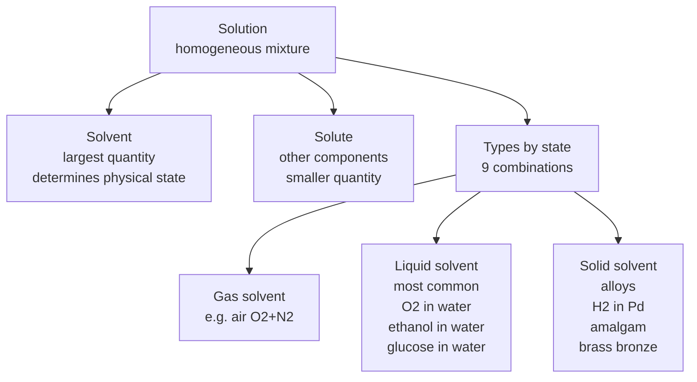
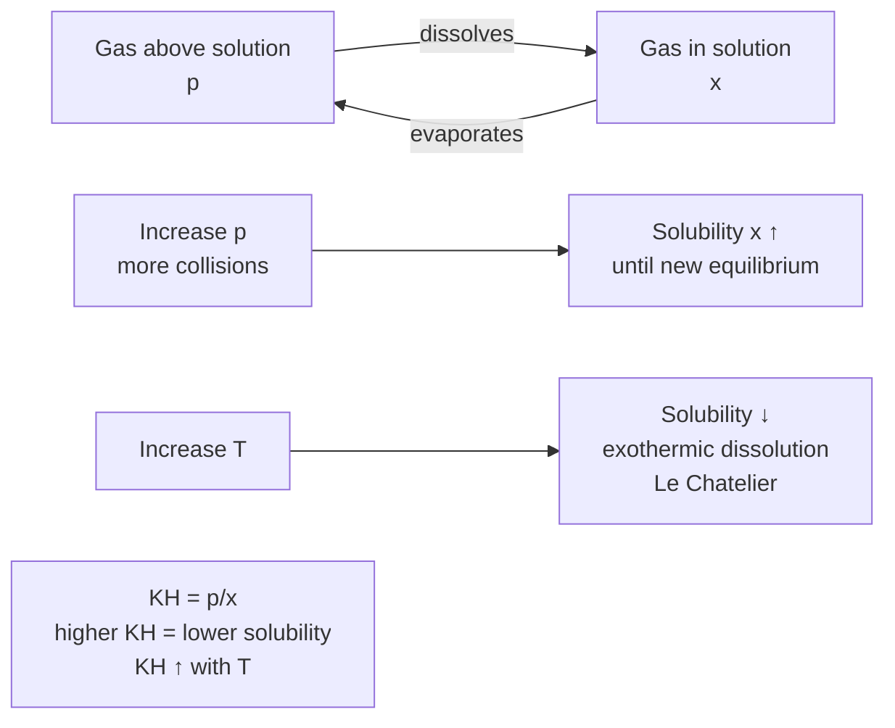
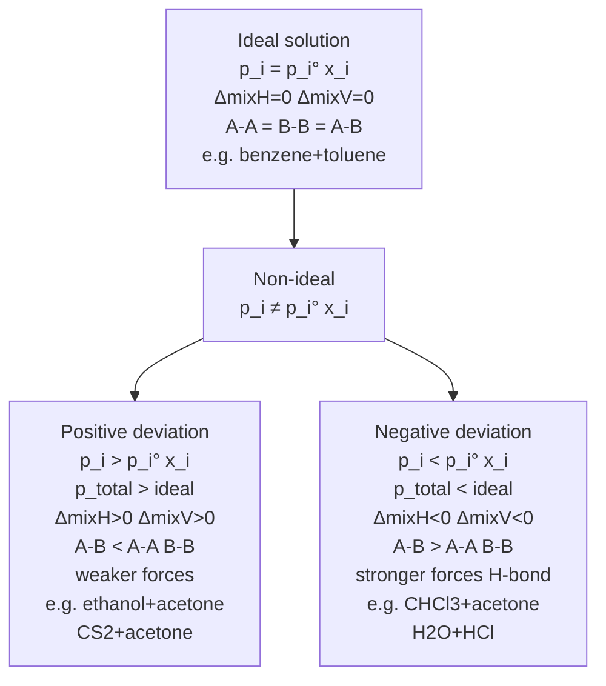
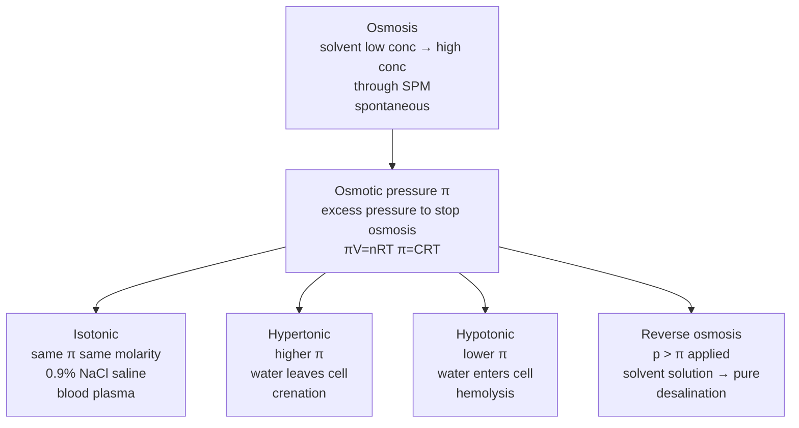

# Solutions — JEE Main + Advanced Notes

> **Sources merged into these notes**
> | Source | File |
> |---|---|
> | NCERT Class XII Chemistry (rationalised, 2023+), Unit 1 | [`lech101.pdf`](lech101.pdf) |
> | Allen module for this chapter | _not uploaded yet — drop it in this folder to enable 🅰 tags_ |
>
> NCERT Unit 1 (1.1–1.7) = Types of solutions + expressing concentration + solubility solid/liquid/gas + Henry's law + vapour pressure liquid-liquid solutions + Raoult's law + ideal/non-ideal + azeotropes + colligative properties relative lowering vapour pressure, elevation boiling point, depression freezing point, osmotic pressure + abnormal colligative van't Hoff factor. This notes.md is **complete basics-to-Advanced**: NCERT points with § numbers, JEE Advanced extensions marked 🆇, ⚠ = traps.

## Contents

- [Part A — Types of Solutions and Concentration](#part-a--types-of-solutions-and-concentration)
  1. [Types of solutions — solid/liquid/gas solute/solvent (1.1)](#1-types-of-solutions--solidliquidgas-solutesolvent-11)
  2. [Expressing concentration — mass %, volume %, ppm, mole fraction, molarity, molality (1.2)](#2-expressing-concentration--mass--volume--ppm-mole-fraction-molarity-molality-12)
  3. [Interconversions of concentration terms 🆇](#3-interconversions-of-concentration-terms-)
- [Part B — Solubility and Henry's Law](#part-b--solubility-and-henrys-law)
  4. [Solubility of solid in liquid — factors (1.3.1)](#4-solubility-of-solid-in-liquid--factors-131)
  5. [Solubility of gas in liquid — Henry's law $p = K_H x$ (1.3.2)](#5-solubility-of-gas-in-liquid--henrys-law-p--k_h-x-132)
  6. [Applications of Henry's law — scuba, soda, anoxia 🆇 (1.3.2)](#6-applications-of-henrys-law--scuba-soda-anoxia--132)
- [Part C — Vapour Pressure of Liquid Solutions](#part-c--vapour-pressure-of-liquid-solutions)
  7. [Vapour pressure of liquid-liquid solutions — Raoult's law (1.4.1)](#7-vapour-pressure-of-liquid-liquid-solutions--raoults-law-141)
  8. [Ideal solutions — conditions and properties (1.4.1)](#8-ideal-solutions--conditions-and-properties-141)
  9. [Non-ideal solutions — positive and negative deviations (1.4.2)](#9-non-ideal-solutions--positive-and-negative-deviations-142)
  10. [Azeotropes — minimum and maximum boiling (1.4.2)](#10-azeotropes--minimum-and-maximum-boiling-142)
  11. [Vapour pressure of solutions of solids in liquids — Raoult's law for non-volatile solute (1.4.3)](#11-vapour-pressure-of-solutions-of-solids-in-liquids--raoults-law-for-non-volatile-solute-143)
- [Part D — Colligative Properties](#part-d--colligative-properties)
  12. [Colligative properties — introduction and relative lowering vapour pressure (1.5.1)](#12-colligative-properties--introduction-and-relative-lowering-vapour-pressure-151)
  13. [Elevation of boiling point $ΔT_b = K_b m$ (1.5.2)](#13-elevation-of-boiling-point-δt_b--k_b-m-152)
  14. [Depression of freezing point $ΔT_f = K_f m$ (1.5.3)](#14-depression-of-freezing-point-δt_f--k_f-m-153)
  15. [Osmotic pressure $π = CRT$ — van't Hoff law, isotonic, reverse osmosis (1.5.4)](#15-osmotic-pressure-π--crt--vanthoff-law-isotonic-reverse-osmosis-154)
  16. [Abnormal colligative properties — van't Hoff factor $i$ (1.6)](#16-abnormal-colligative-properties--vanthoff-factor-i-16)
  17. [Degree of dissociation and association from $i$ 🆇 (1.6)](#17-degree-of-dissociation-and-association-from-i--16)
- [Part E — Advanced Corner, Patterns and Revision](#part-e--advanced-corner-patterns-and-revision)
  18. [Master formula bank (print this)](#18-master-formula-bank-print-this)
  19. [Worked problem patterns — JEE Advanced favourites](#19-worked-problem-patterns--jee-advanced-favourites)
  20. [The 20 traps examiners use](#20-the-20-traps-examiners-use)
  21. [Quick Revision Sheet](#21-quick-revision-sheet)

---

# Part A — Types of Solutions and Concentration

## 1. Types of solutions — solid/liquid/gas solute/solvent (1.1)

Solution = homogeneous mixture of two or more components, composition and properties uniform throughout.

Component with largest quantity = solvent, determines physical state. Other components = solutes. Binary solution = two components.

Types (Table 1.1 NCERT):

| Type | Solute | Solvent | Example |
|---|---|---|---|
| Gaseous solutions | Gas | Gas | Mixture $\ce{O2 + N2}$ air |
|  | Liquid | Gas | Chloroform mixed with $\ce{N2}$ gas |
|  | Solid | Gas | Camphor in $\ce{N2}$ gas |
| Liquid solutions | Gas | Liquid | $\ce{O2}$ dissolved in water |
|  | Liquid | Liquid | Ethanol dissolved in water |
|  | Solid | Liquid | Glucose dissolved in water |
| Solid solutions | Gas | Solid | $\ce{H2}$ in Pd (hydrogen storage) |
|  | Liquid | Solid | Amalgam Hg with Na |
|  | Solid | Solid | Cu dissolved in Au (alloys), brass Cu+Zn, bronze Cu+Sn |

## 2. Expressing concentration — mass %, volume %, ppm, mole fraction, molarity, molality (1.2)

Several ways:

**i) Mass percentage w/w**: $Mass\% = \frac{Mass\ of\ component}{Total\ mass\ of\ solution}×100$.

Example: 10% glucose in water by mass → 10 g glucose in 90 g water, total 100 g solution. Used industrial.

**ii) Volume percentage V/V**: $Volume\% = \frac{Volume\ of\ component}{Total\ volume\ of\ solution}×100$.

Example: 10% ethanol solution → 10 mL ethanol in water total 100 mL. Used liquids, 35% v/v ethylene glycol antifreeze lowers freezing point to 255.4 K.

**iii) Mass by volume w/V**: Mass of solute in 100 mL solution, used medicine/pharmacy.

**iv) Parts per million ppm**: When solute trace quantities, $ppm = \frac{Number\ of\ parts\ of\ component}{Total\ parts\ of\ all\ components}×10^6$, can be mass/mass, volume/volume, mass/volume.

$1 ppm = 1 mg/kg$ for dilute aqueous ≈ $1 mg/L$. Example: 1 ppm fluoride in water prevents tooth decay, 1.5 ppm mottled teeth, high poisonous. Sea water 5.8 ppm dissolved $\ce{O2}$ = $6×10^{-3} g$ per 1030 g sea water. Pollutants expressed ppm.

**v) Mole fraction $x$**: $x_i = \frac{n_i}{∑n_i}$, sum of all mole fractions =1, dimensionless, temperature independent, useful for vapour pressure.

Binary: $x_A = n_A/(n_A+n_B)$, $x_B = n_B/(n_A+n_B)$, $x_A+x_B=1$.

Example: 20% ethylene glycol $\ce{C2H6O2}$ by mass, 100 g solution 20 g glycol $M=62$ → $0.322 mol$, 80 g water $4.444 mol$ → $x_{glycol}=0.322/(0.322+4.444)=0.068$, $x_{water}=0.932$.

**vi) Molarity $M$**: $M = \frac{Moles\ of\ solute}{Volume\ of\ solution\ in\ L}$, $mol L^{-1}$ or $M$, temperature dependent (volume changes with T).

Example: 0.25 M NaOH → 0.25 mol NaOH in 1 L solution. 5 g NaOH in 450 mL: $n=5/40=0.125 mol$, $V=0.45 L$ → $M=0.125/0.45=0.278 M$.

**vii) Molality $m$**: $m = \frac{Moles\ of\ solute}{Mass\ of\ solvent\ in\ kg}$, $mol kg^{-1}$ or $m$, temperature independent (mass not T dependent).

Example: 1.00 m KCl → 1 mol (74.5 g) KCl in 1 kg water. 2.5 g ethanoic acid $\ce{CH3COOH}$ $M=60$ → $0.0417 mol$ in 75 g benzene $0.075 kg$ → $m=0.0417/0.075=0.556 m$.

Mass%, ppm, mole fraction, molality independent of T, molarity depends on T.

## 3. Interconversions of concentration terms 🆇

Key formulas for JEE Advanced:

Let $d$ = density $g mL^{-1}$, $M$ = molarity, $m$ = molality, $M_2$ = molar mass solute, $M_1$ = molar mass solvent, $χ_2$ = mole fraction solute, $w$ = mass %.

- $m = \frac{1000 M}{1000 d - M M_2}$ (M to m)
- $M = \frac{1000 d m}{1000 + m M_2}$ (m to M)
- $χ_2 = \frac{m M_1}{1000 + m M_1}$ for binary water $M_1=18$
- $w\% = \frac{M M_2}{10 d}$ (since mass solute per L = $M M_2$, mass solution per L = $1000 d$, $w\% = M M_2 /10d$)
- $M = \frac{10 d w\%}{M_2}$
- ppm to molarity: $ppm (mg/L) ≈ M × M_2 ×1000$ for dilute aqueous.

Example: 3 M NaCl density 1.25 $g mL^{-1}$: mass solution 1 L =1250 g, NaCl mass 3×58.5=175.5 g, water 1074.5 g=1.0745 kg, molality 3/1.0745=2.79 m.

---

# Part B — Solubility and Henry's Law

## 4. Solubility of solid in liquid — factors (1.3.1)

Solubility = maximum amount that can be dissolved in specified amount of solvent at specified T,P.

Factors:

- **Nature of solute and solvent**: Like dissolves like, polar solutes in polar solvents (ionic, H-bonding), non-polar in non-polar (London). Example: NaCl ionic in water polar, naphthalene non-polar in benzene non-polar.
- **Temperature**: Most solids solubility increases with T (endothermic dissolution), some decreases (exothermic e.g., $\ce{Ce2(SO4)3}$, $\ce{Ca(OH)2}$). Le Chatelier: if dissolution endothermic, T↑ solubility↑.
- **Pressure**: No effect on solubility of solids in liquids (solids/liquids incompressible).

## 5. Solubility of gas in liquid — Henry's law $p = K_H x$ (1.3.2)

Gases dissolve in liquids, solubility depends on nature, T, P.

Consider system: lower part solution, upper part gaseous system at pressure $p$ and $T$, dynamic equilibrium rate gas entering = leaving.

Increase pressure over solution by compressing gas to smaller volume → more gaseous particles per unit volume striking surface → more entering → solubility increases until new equilibrium.

Henry's law (William Henry 1803, Dalton independently): At constant $T$, solubility of gas in liquid directly proportional to partial pressure of gas above surface.

Forms:

- $p = K_H x$, where $p$ = partial pressure of gas in vapour phase, $x$ = mole fraction of gas in solution, $K_H$ = Henry's law constant (depends on nature of gas, solvent, T). Different gases different $K_H$ at same $T$.
- Alternatively $x = p/K_H$, higher $K_H$ lower solubility at given $p$.
- Also $C = k_H p$ where $C$ = concentration $mol/L$, $k_H$ = Henry constant $=1/K_H$? Actually $K_H$ in bar, $k_H$ in $mol L^{-1} bar^{-1}$ reciprocal.

$K_H$ values: For $\ce{N2}$ in water at 293 K $76.48 kbar$, $\ce{O2}$ $34.86 kbar$, $\ce{He}$ $144.97 kbar$, $\ce{H2}$ $69.16 kbar$, $\ce{CO2}$ $1.67 kbar$ at 298 K (more soluble lower $K_H$), formaldehyde $1.83×10^{-5} kbar$ very soluble.

$K_H$ increases with T → solubility decreases with T (dissolution exothermic).

## 6. Applications of Henry's law — scuba, soda, anoxia 🆇 (1.3.2)

- **Soda and soft drinks**: To increase solubility $\ce{CO2}$ in soft drinks, bottle sealed under high pressure ~3-4 bar, $p_{CO2}$ high → $x_{CO2}$ high, when opened $p$ decreases → bubbles.
- **Scuba diving**: Air at high pressure underwater, $p_{N2}$ high → more $\ce{N2}$ dissolves in blood. When diver comes to surface $p$ decreases, dissolved gases form bubbles in blood blocking capillaries → bends painful dangerous. To avoid, tanks diluted with He (11.7% He, 56.2% N2, 32.1% O2) He low solubility low $K_H$? Actually He high $K_H$ low solubility, less bends, also less toxic. Also use slow ascent.
- **High altitude anoxia**: At high altitude $p_{O2}$ less than ground, low $O_2$ in blood tissues → weakness, unable to think clearly, anoxia.
- **Aquatic life**: Cold water more $\ce{O2}$ solubility than warm, aquatic species comfortable in cold.

Example: $\ce{N2}$ bubbled through water at 293 K partial pressure 0.987 bar $K_H=76.48 kbar$ → $x=0.987/76480=1.29×10^{-5}$, 1 L water 55.5 mol → $n_{N2}=1.29e-5×55.5=7.16e-4 mol=0.716 mmol$.

---

# Part C — Vapour Pressure of Liquid Solutions

## 7. Vapour pressure of liquid-liquid solutions — Raoult's law (1.4.1)

Consider binary solution of two volatile liquids 1 and 2 in closed vessel, both evaporate, equilibrium vapour and liquid, total vapour pressure $p_{total}$ and partial $p_1$, $p_2$.

Raoult's law (Francois Marte Raoult 1886): For solution of volatile liquids, partial vapour pressure of each component directly proportional to its mole fraction in solution.

$p_1 ∝ x_1$ → $p_1 = p_1° x_1$, where $p_1°$ = vapour pressure of pure component 1 at same T.

Similarly $p_2 = p_2° x_2$.

Dalton's law for vapour: $p_{total}=p_1+p_2 = x_1 p_1° + x_2 p_2° = (1-x_2)p_1° + x_2 p_2° = p_1° + (p_2°-p_1°)x_2$.

Conclusions:

- $p_{total}$ varies linearly with mole fraction of one component.
- Minimum $p_{total}=p_1°$ if $p_1°<p_2°$ and $x_1=1$, maximum $p_2°$ if $x_2=1$.
- Plot $p_1$ or $p_2$ vs $x_1$, $x_2$ linear passing through origin and $p°$ at $x=1$, $p_{total}$ vs $x_2$ also linear between $p_1°$ and $p_2°$.

Composition of vapour phase in equilibrium: $y_1 = p_1/p_{total} = p_1° x_1 / p_{total}$, $y_2 = p_2° x_2 / p_{total}$, generally vapour richer in more volatile component (higher $p°$).

## 8. Ideal solutions — conditions and properties (1.4.1)

Ideal solution = obeys Raoult's law over entire range of concentration at given T.

Conditions:

- $p_i = p_i° x_i$ for all $i$, $0≤x_i≤1$.
- $Δ_{mix}H =0$ (no enthalpy change on mixing, no heat absorbed/released).
- $Δ_{mix}V =0$ (no volume change on mixing).
- Intermolecular forces A-A, B-B, A-B same strength.

Examples: Benzene + toluene (similar structure, similar London), n-hexane + n-heptane, bromoethane + chloroethane, $\ce{CCl4 + SiCl4}$.

Properties: $p_{total}$ linear between $p_1°$ and $p_2°$, no deviation.

## 9. Non-ideal solutions — positive and negative deviations (1.4.2)

Real solutions deviate from Raoult's law, $p_i ≠ p_i° x_i$.

**Positive deviation**: $p_i > p_i° x_i$, $p_{total} >$ ideal, $Δ_{mix}H >0$ endothermic, $Δ_{mix}V >0$ volume increase, A-B forces weaker than A-A and B-B, molecules escape easier.

Examples: Ethanol + acetone (ethanol H-bonds, acetone breaks H-bonds, weaker), $\ce{CS2 + acetone}$, $\ce{CCl4 + CHCl3}$? Actually negative, ethanol + water? Positive? Classic: ethanol + hexane, acetone + $\ce{CS2}$, acetone + ethanol, water + ethanol? Wait water+ethanol shows positive? Actually ethanol+water shows positive deviation? Let's recall: ethanol + acetone positive, $\ce{CS2 + acetone}$ positive, benzene + methanol positive, water + ethanol positive? Actually ethanol+water negative? Check: chloroform + acetone negative due to H-bond.

**Negative deviation**: $p_i < p_i° x_i$, $p_{total} <$ ideal, $Δ_{mix}H <0$ exothermic, $Δ_{mix}V <0$ volume decrease, A-B forces stronger than A-A and B-B, molecules held more tightly.

Examples: Chloroform + acetone (H-bond $\ce{CHCl3}$ H with acetone $\ce{C=O}$), $\ce{CHCl3 + C6H6}$, $\ce{H2O + HCl}$, $\ce{H2O + HNO3}$, $\ce{CH3COOH + pyridine}$, phenol + aniline.

## 10. Azeotropes — minimum and maximum boiling (1.4.2)

Azeotrope = constant boiling mixture, mixture of liquids that boils at constant temperature with same composition in liquid and vapour, cannot be separated by fractional distillation.

- **Minimum boiling azeotrope**: Formed by solutions with large positive deviation, $p_{total}$ maximum, b.p. minimum lower than both pure components. Example: Ethanol + water 95.6% ethanol 4.4% water b.p. 78.2°C lower than ethanol 78.37°C and water 100°C, $\ce{CS2 + acetone}$, benzene + ethanol, etc. Vapour richer? Actually at azeotrope $y_i=x_i$.

- **Maximum boiling azeotrope**: Formed by solutions with large negative deviation, $p_{total}$ minimum, b.p. maximum higher than both pure. Example: $\ce{H2O + HCl}$ 20.2% HCl b.p. 108.5°C higher than water 100°C and HCl -85°C? Actually HCl gas, but azeotrope $\ce{HNO3 + H2O}$ 68% $\ce{HNO3}$ b.p. 120.2°C, chloroform + acetone max? No.

Azeotropes are non-ideal, $Δ_{mix}H$ and $Δ_{mix}V$ significant.

## 11. Vapour pressure of solutions of solids in liquids — Raoult's law for non-volatile solute (1.4.3)

If solute non-volatile (e.g., glucose, NaCl), its vapour pressure negligible, only solvent volatile.

Raoult's law: $p_1 = p_1° x_1$, where $x_1$ = mole fraction solvent, $p_1$ = vapour pressure of solution, $p_1°$ = vapour pressure pure solvent.

Since $x_1 <1$, $p_1 < p_1°$ → vapour pressure lowering.

Relative lowering: $(p_1° - p_1)/p_1° = x_2 = mole\ fraction\ solute = n_2/(n_1+n_2)$ for dilute $n_2<<n_1$ ≈ $n_2/n_1$.

This is colligative property — depends on number of solute particles, not nature.

---

# Part D — Colligative Properties

## 12. Colligative properties — introduction and relative lowering vapour pressure (1.5.1)

Colligative properties = properties of solutions that depend on number of solute particles, not nature, for dilute solutions with non-volatile solute.

Four colligative:

1. Relative lowering vapour pressure
2. Elevation boiling point
3. Depression freezing point
4. Osmotic pressure

**Relative lowering vapour pressure**: $(p_1°-p_1)/p_1° = x_2 = n_2/(n_1+n_2)$ ≈ $n_2/n_1$ for dilute.

From Raoult: $p_1 = p_1° x_1 = p_1° (1-x_2)$ → $p_1°-p_1 = p_1° x_2$ → $(p_1°-p_1)/p_1° = x_2$.

Useful to find molar mass: $x_2 = (w_2/M_2)/(w_1/M_1 + w_2/M_2)$ ≈ $w_2 M_1 / w_1 M_2$ dilute → $M_2 = w_2 M_1 / w_1 × p_1°/(p_1°-p_1)$.

## 13. Elevation of boiling point $ΔT_b = K_b m$ (1.5.2)

Boiling point = $T$ where vapour pressure = external pressure. Since solution vapour pressure lower than pure solvent, need higher $T$ to make $p_1 = p_{ext}$ → boiling point elevation.

$ΔT_b = T_b(solution) - T_b°(pure\ solvent) = K_b m$, where $K_b$ = ebullioscopic constant / molal elevation constant $K K g mol^{-1}$, $m$ = molality.

$K_b = \frac{R T_b°^2 M_1}{Δ_{vap}H} /1000$? Actually $K_b = R T_b°^2 M_1 / 1000 Δ_{vap}H$, $M_1$ molar mass solvent $kg/mol$.

For water $K_b=0.512 K kg mol^{-1}$.

Molar mass from $ΔT_b$: $M_2 = \frac{1000 K_b w_2}{ΔT_b w_1}$ where $w_2$ mass solute, $w_1$ mass solvent.

## 14. Depression of freezing point $ΔT_f = K_f m$ (1.5.3)

Freezing point = $T$ where vapour pressure of solid and liquid equal. Solution vapour pressure lower, so freezing point lower than pure solvent.

$ΔT_f = T_f° - T_f = K_f m$, $K_f$ = cryoscopic constant / molal depression constant $K kg mol^{-1}$.

$K_f = \frac{R T_f°^2 M_1}{Δ_{fus}H} /1000$.

For water $K_f=1.86 K kg mol^{-1}$, for benzene $K_f=5.12$.

Applications: Antifreeze ethylene glycol lowers freezing point water to 255.4 K at 35% v/v, NaCl on icy roads, etc.

Molar mass: $M_2 = \frac{1000 K_f w_2}{ΔT_f w_1}$.

## 15. Osmotic pressure $π = CRT$ — van't Hoff law, isotonic, reverse osmosis (1.5.4)

Osmosis = spontaneous flow of solvent from low concentration (pure solvent) to high concentration (solution) through semipermeable membrane (SPM) that allows solvent but not solute.

Osmotic pressure $π$ = excess pressure that must be applied to solution side to prevent osmosis, i.e., to stop solvent flow.

van't Hoff law (analogous to ideal gas $pV=nRT$): $πV = nRT$ or $π = CRT$, where $C$ = molarity $mol L^{-1}$, $R$ gas constant, $T$ Kelvin.

For dilute solutions, $π = (n_2/V)RT = molarity × RT$.

If two solutions have same osmotic pressure at same T → isotonic, same molarity. If different, higher $π$ hypertonic, lower hypotonic. Solvent flows from hypotonic to hypertonic.

**Isotonic**: 0.9% w/V NaCl (normal saline) isotonic with blood plasma 0.9 g NaCl per 100 mL, 5% dextrose isotonic, used intravenous.

If RBC placed in hypertonic (more concentrated) → water leaves cell → shrinks crenation. In hypotonic (less concentrated) → water enters → swells burst hemolysis.

**Reverse osmosis**: If pressure greater than osmotic pressure applied to solution side, solvent flows from solution to pure solvent opposite to osmosis, used for desalination sea water, water purification.

Molar mass from $π$: $M_2 = \frac{w_2 RT}{π V}$.

Advantage: $π$ large even for dilute, measurable at room T, useful for macromolecules proteins polymers.

## 16. Abnormal colligative properties — van't Hoff factor $i$ (1.6)

Colligative properties measured sometimes abnormal — observed value different from calculated assuming no dissociation/association, due to solute dissociating or associating in solution.

van't Hoff factor $i$ = measure of extent of association/dissociation.

$i = \frac{Observed\ colligative\ property}{Calculated\ colligative\ property\ assuming\ no\ dissociation/association} = \frac{Normal\ molar\ mass}{Observed\ molar\ mass}$

- For dissociation: $i>1$, more particles → colligative ↑, observed molar mass ↓.
- For association: $i<1$, fewer particles → colligative ↓, observed molar mass ↑.
- For no dissociation/association: $i=1$.

Incorporate $i$ in formulas:

- Relative lowering: $(p_1°-p_1)/p_1° = i x_2$
- Elevation: $ΔT_b = i K_b m$
- Depression: $ΔT_f = i K_f m$
- Osmotic: $π = i CRT$

## 17. Degree of dissociation and association from $i$ 🆇 (1.6)

**Dissociation**: e.g., $\ce{NaCl -> Na+ + Cl-}$, $\ce{KCl}$, $\ce{MgCl2}$, acids, etc.

Let $α$ = degree of dissociation (0 to 1), $n$ = number of particles formed from 1 formula unit.

Initially 1 mol, at equilibrium: $1-α$ undissociated, $nα$ particles from dissociation, total particles = $1-α + nα = 1 + (n-1)α$.

$i = \frac{Total\ particles}{Initial\ particles} = 1 + (n-1)α$ → $α = (i-1)/(n-1)$.

For $\ce{NaCl}$ $n=2$, $α=(i-1)/1=i-1$, if $i=1.9$, $α=0.9$ 90% dissociated.

For $\ce{MgCl2}$ $n=3$, $α=(i-1)/2$.

For $\ce{K4[Fe(CN)6]}$ $n=5$ etc.

**Association**: e.g., benzoic acid dimerises in benzene via H-bonding $2\ce{C6H5COOH} ⇌ (\ce{C6H5COOH})2$, acetic acid dimer.

Let $α$ = degree of association, $n$ = number of molecules associating to form 1 associated species.

Initially 1 mol, total after association: $1-α$ remaining + $α/n$ associated → total = $1-α+α/n = 1 - α(1-1/n)$.

$i = 1 - α(1-1/n)$ → $α = (1-i)/(1-1/n) = n(1-i)/(n-1)$.

For dimerisation $n=2$, $i = 1 - α/2$ → $α = 2(1-i)$.

Example: Benzoic acid dimerises 80% ($α=0.8$) → $i=1-0.8/2=0.6$, observed molar mass = normal / i = $122/0.6=203.3$ close to dimer 244? Actually 122×2=244, observed 203 due to partial.

Molar mass abnormal: $M_{obs}=M_{normal}/i$.

---

# Part E — Advanced Corner, Patterns and Revision

## 18. Master formula bank (print this)

**Concentration**:

- Mass% w/w = $mass\ solute / mass\ solution ×100$
- Volume% V/V = $volume\ solute / volume\ solution ×100$
- ppm = $parts\ solute / total\ parts ×10^6$ $1 ppm=1 mg/kg≈1 mg/L$ dilute aqueous
- Mole fraction $x_i=n_i/∑n_i$, $∑x_i=1$, T independent
- Molarity $M=n_{solute}/V_{solution} L$ $mol L^{-1}$, T dependent, $M_1V_1=M_2V_2$ dilution
- Molality $m=n_{solute}/mass_{solvent} kg$ $mol kg^{-1}$, T independent
- Interconversions: $m=1000M/(1000d-MM_2)$, $M=1000dm/(1000+mM_2)$, $w\%=MM_2/10d$, $x_2=mM_1/(1000+mM_1)$

**Solubility**:

- Solid in liquid: Like dissolves like, T↑ solubility↑ if endothermic $Δ_{sol}H>0$
- Gas in liquid: Henry $p=K_H x$, $K_H$ $bar$, $x=p/K_H$, $K_H$ ↑ with T → solubility ↓, higher $K_H$ lower solubility

**Raoult's law**:

- Volatile-volatile: $p_i=p_i° x_i$, $p_{total}=x_1p_1°+x_2p_2°=p_1°+(p_2°-p_1°)x_2$ linear
- Vapour composition $y_i=p_i/p_{total}=p_i°x_i/p_{total}$, vapour richer in more volatile higher $p°$
- Non-volatile solute: $p_1=p_1°x_1$, $(p_1°-p_1)/p_1°=x_2=n_2/(n_1+n_2)≈n_2/n_1$ dilute

**Ideal vs non-ideal**:

- Ideal: $p_i=p_i°x_i$ all $x$, $Δ_{mix}H=0$ $Δ_{mix}V=0$ A-A=B-B=A-B e.g., benzene+toluene
- Positive deviation: $p_i>p_i°x_i$ $p_{total}>$ ideal $Δ_{mix}H>0$ $Δ_{mix}V>0$ A-B<A-A B-B weaker e.g., ethanol+acetone $\ce{CS2+acetone}$
- Negative deviation: $p_i<p_i°x_i$ $p_{total}<$ ideal $Δ_{mix}H<0$ $Δ_{mix}V<0$ A-B>A-A B-B stronger H-bond e.g., $\ce{CHCl3+acetone}$ $\ce{H2O+HCl}$ $\ce{H2O+HNO3}$
- Azeotrope constant boiling $y_i=x_i$ cannot separate by distillation: min boiling positive deviation b.p.<both pure e.g., ethanol+water 95.6% 78.2°C, max boiling negative deviation b.p.>both pure e.g., $\ce{H2O+HCl}$ 20.2% 108.5°C

**Colligative** (dilute non-volatile solute):

- Relative lowering: $(p_1°-p_1)/p_1°=x_2=i x_2$ with $i$
- Elevation: $ΔT_b=K_b m$, $K_b=R T_b°^2 M_1/1000Δ_{vap}H$, water $0.512 K kg/mol$, $M_2=1000K_b w_2/ΔT_b w_1$
- Depression: $ΔT_f=K_f m$, $K_f=R T_f°^2 M_1/1000Δ_{fus}H$, water $1.86$, $M_2=1000K_f w_2/ΔT_f w_1$
- Osmotic: $πV=nRT$, $π=CRT$, $π=iCRT$, $M_2=w_2RT/πV$, isotonic same $π$ same $C$, hypertonic higher $π$ water leaves cell crenation, hypotonic lower $π$ water enters hemolysis, reverse osmosis $p>π$ desalination

**van't Hoff factor**:

- $i=Observed\ colligative / Calculated\ (no\ dissociation/association)=M_{normal}/M_{obs}$
- $i>1$ dissociation more particles $M_{obs}<M_{normal}$, $i<1$ association fewer particles $M_{obs}>M_{normal}$, $i=1$ no effect
- Dissociation $n$ particles from 1: $i=1+(n-1)α$ → $α=(i-1)/(n-1)$
- Association $n$ molecules →1: $i=1-α(1-1/n)$ → $α=n(1-i)/(n-1)$, dimer $n=2$ $i=1-α/2$ $α=2(1-i)$
- With $i$: $ΔT_b=iK_b m$, $ΔT_f=iK_f m$, $π=iCRT$, $(p°-p)/p°=i x_2$

## 19. Worked problem patterns — JEE Advanced favourites

**Pattern 1 — Concentration interconversion**:

20% ethylene glycol by mass 100 g solution 20 g glycol 0.322 mol 80 g water 4.444 mol $x_{glycol}=0.068$ $x_{water}=0.932$.

**Pattern 2 — Henry's law**:

$\ce{N2}$ $K_H=76.48 kbar$ $p=0.987 bar$ → $x=0.987/76480=1.29e-5$ 1 L water 55.5 mol → $n=7.16e-4 mol=0.716 mmol$.

**Pattern 3 — Raoult's law total pressure**:

Benzene $p°=100 mmHg$ toluene $p°=40 mmHg$ $x_{benzene}=0.6$ → $p_{benzene}=60$, $p_{toluene}=16$, $p_{total}=76 mmHg$, $y_{benzene}=60/76=0.789$ vapour richer in benzene more volatile.

**Pattern 4 — Ideal vs non-ideal identification**:

Given $Δ_{mix}H$ positive → positive deviation → min boiling azeotrope, $Δ_{mix}H$ negative → negative deviation → max boiling azeotrope.

**Pattern 5 — Relative lowering**:

Glucose $w_2=10 g$ $M_2=180$ in water $w_1=90 g$ $M_1=18$ $n_2=0.0556$ $n_1=5$ $x_2=0.011$ → $(p°-p)/p°=0.011$ → $p=0.989 p°$.

**Pattern 6 — Elevation boiling point**:

$w_2=10 g$ solute $M_2=100$ in $w_1=100 g$ water $m=1 mol/kg$ $K_b=0.512$ → $ΔT_b=0.512 K$ → b.p. $100.512°C$, $M_2=1000K_b w_2/ΔT_b w_1$.

**Pattern 7 — Depression freezing point**:

Same as above $K_f=1.86$ → $ΔT_f=1.86 K$ → f.p. $-1.86°C$, antifreeze 35% ethylene glycol $m≈$? $ΔT_f$ lowers to 255.4 K.

**Pattern 8 — Osmotic pressure**:

$w_2=1 g$ polymer $M_2=50000$ in $V=0.1 L$ $T=300 K$ → $π=nRT/V= (1/50000)×0.08314×300/0.1=0.00499 bar=499 Pa$ measurable, while $ΔT_b$ tiny.

Isotonic: 0.9% NaCl 0.9 g per 100 mL $M=58.5$ → $M=0.154 M$ $i≈2$ → $π=iCRT=2×0.154×0.08314×310=7.94 bar$ same as blood.

**Pattern 9 — van't Hoff factor dissociation**:

$\ce{NaCl}$ $0.1 m$ $i=1.9$ → $α=(1.9-1)/(2-1)=0.9$ 90% dissociated, $ΔT_f=iK_f m=1.9×1.86×0.1=0.353 K$.

$\ce{MgCl2}$ $n=3$ $i=2.7$ → $α=(2.7-1)/2=0.85$.

**Pattern 10 — van't Hoff factor association**:

Benzoic acid in benzene dimerises $n=2$ observed $M_{obs}=244$? Normal 122 $i=122/244=0.5$ → $α=2(1-0.5)=1$ 100% dimerised. If $M_{obs}=180$ $i=122/180=0.678$ → $α=2(1-0.678)=0.644$ 64.4% dimerised.

**Pattern 11 — Azeotrope**:

Ethanol+water 95.6% ethanol min boiling 78.2°C cannot get 100% ethanol by distillation, need molecular sieves.

## 20. The 20 traps examiners use

1. Mass% w/w vs V/V vs w/V vs ppm — check units, ppm $mg/kg$ vs $mg/L$.
2. Mole fraction $x_i=n_i/∑n_i$ sum=1 T independent, molarity T dependent.
3. $m=1000M/(1000d-MM_2)$ interconversion needs density $d$.
4. Henry $p=K_H x$ $K_H$ in bar, higher $K_H$ lower solubility, $K_H$ ↑ with T solubility ↓.
5. Henry's law only for dilute gases, not for highly soluble $\ce{NH3 HCl}$ which react.
6. Raoult's law $p_i=p_i°x_i$ for volatile-volatile, $p_1=p_1°x_1$ for non-volatile solute.
7. Ideal solution $Δ_{mix}H=0$ $Δ_{mix}V=0$ A-A=B-B=A-B, $p_{total}$ linear.
8. Positive deviation $p_i>p_i°x_i$ $Δ_{mix}H>0$ $Δ_{mix}V>0$ A-B weaker e.g., ethanol+acetone, min boiling azeotrope b.p.<both.
9. Negative deviation $p_i<p_i°x_i$ $Δ_{mix}H<0$ $Δ_{mix}V<0$ A-B stronger H-bond e.g., $\ce{CHCl3+acetone}$, max boiling azeotrope b.p.>both.
10. Azeotrope $y_i=x_i$ constant boiling cannot separate by fractional distillation.
11. Colligative depends on number of particles, not nature, only dilute non-volatile solute.
12. $(p°-p)/p°=x_2$ relative lowering = mole fraction solute, $x_2=n_2/(n_1+n_2)≈n_2/n_1$ dilute.
13. $ΔT_b=K_b m$ $ΔT_f=K_f m$ $K_b$ $K_f$ $K kg/mol$, water $K_b=0.512$ $K_f=1.86$, $m$ molality not molarity.
14. $π=CRT$ $π=iCRT$ van't Hoff law, $C$ molarity, $R=0.08314 bar L$ or $8.314 J$, $π$ large even dilute.
15. Isotonic same $π$ same $C$, hypertonic higher $π$ water leaves cell crenation, hypotonic lower $π$ water enters hemolysis, 0.9% NaCl saline isotonic with blood.
16. Reverse osmosis $p>π$ applied solution→pure desalination.
17. van't Hoff factor $i=Observed/Calculated=M_{normal}/M_{obs}$, $i>1$ dissociation $M_{obs}<M_{normal}$, $i<1$ association $M_{obs}>M_{normal}$.
18. Dissociation $i=1+(n-1)α$ $α=(i-1)/(n-1)$, $n$ particles from 1, $\ce{NaCl}$ $n=2$ $α=i-1$.
19. Association $i=1-α(1-1/n)$ $α=n(1-i)/(n-1)$, dimer $n=2$ $i=1-α/2$ $α=2(1-i)$.
20. With $i$ colligative $ΔT_b=iK_b m$ $ΔT_f=iK_f m$ $π=iCRT$ $(p°-p)/p°=i x_2$.

## 21. Quick Revision Sheet

**Types**: Solution homogeneous, solvent largest determines state, solute others, 9 types gas/liquid/solid solute/solvent, alloys brass Cu+Zn bronze Cu+Sn $\ce{H2}$ in Pd.

**Concentration**: Mass% w/w $mass\ solute/mass\ solution×100$, Volume% V/V, w/V mass per 100 mL, ppm $parts/total×10^6$ $1 ppm=1 mg/kg≈1 mg/L$, mole fraction $x_i=n_i/∑n_i$ $∑x=1$ T independent, molarity $M=n/V L$ $mol L^{-1}$ T dependent $M_1V_1=M_2V_2$, molality $m=n/mass\ solvent\ kg$ T independent, interconversions $m=1000M/(1000d-MM_2)$ $w\%=MM_2/10d$.

**Solubility**: Like dissolves like, solid in liquid T↑ solubility↑ if endothermic, pressure no effect, gas in liquid Henry $p=K_H x$ $K_H$ $bar$ $x=p/K_H$ $K_H$ ↑ with T solubility ↓ higher $K_H$ lower solubility, applications soda high $p_{CO2}$, scuba bends $\ce{N2}$ bubbles He dilution, anoxia low $p_{O2}$ high altitude, cold water more $\ce{O2}$.

**Raoult**: Volatile-volatile $p_i=p_i°x_i$ $p_{total}=x_1p_1°+x_2p_2°$ linear $p_1°+(p_2°-p_1°)x_2$, vapour $y_i=p_i/p_{total}=p_i°x_i/p_{total}$ richer in more volatile higher $p°$, non-volatile solute $p_1=p_1°x_1$ $(p°-p)/p°=x_2$.

**Ideal vs non-ideal**: Ideal $p_i=p_i°x_i$ all $x$ $Δ_{mix}H=0$ $Δ_{mix}V=0$ A-A=B-B=A-B e.g., benzene+toluene, positive deviation $p_i>p_i°x_i$ $p_{total}>$ ideal $Δ_{mix}H>0$ $Δ_{mix}V>0$ A-B weaker e.g., ethanol+acetone min boiling azeotrope b.p.<both e.g., ethanol+water 95.6% 78.2°C, negative deviation $p_i<p_i°x_i$ $p_{total}<$ ideal $Δ_{mix}H<0$ $Δ_{mix}V<0$ A-B stronger H-bond e.g., $\ce{CHCl3+acetone}$ max boiling azeotrope b.p.>both e.g., $\ce{H2O+HCl}$ 20.2% 108.5°C, azeotrope $y_i=x_i$ constant boiling cannot separate by distillation.

**Colligative** (dilute non-volatile solute number of particles):

- Relative lowering $(p°-p)/p°=x_2=n_2/(n_1+n_2)≈n_2/n_1$ $M_2=w_2M_1/w_1×p°/(p°-p)$
- Elevation $ΔT_b=K_b m$ $K_b=R T_b°^2 M_1/1000Δ_{vap}H$ water 0.512 $M_2=1000K_b w_2/ΔT_b w_1$
- Depression $ΔT_f=K_f m$ $K_f=R T_f°^2 M_1/1000Δ_{fus}H$ water 1.86 $M_2=1000K_f w_2/ΔT_f w_1$ antifreeze ethylene glycol
- Osmotic $πV=nRT$ $π=CRT$ $π=iCRT$ $M_2=w_2RT/πV$ isotonic same $π$ same $C$ 0.9% NaCl saline blood, hypertonic higher $π$ water leaves crenation, hypotonic lower $π$ water enters hemolysis, reverse osmosis $p>π$ desalination

**Abnormal van't Hoff factor**: $i=Observed/Calculated=M_{normal}/M_{obs}$, $i>1$ dissociation more particles $M_{obs}<M_{normal}$, $i<1$ association fewer $M_{obs}>M_{normal}$, with $i$ $ΔT_b=iK_b m$ $ΔT_f=iK_f m$ $π=iCRT$ $(p°-p)/p°=i x_2$, dissociation $n$ particles $i=1+(n-1)α$ $α=(i-1)/(n-1)$, association $n$→1 $i=1-α(1-1/n)$ $α=n(1-i)/(n-1)$ dimer $i=1-α/2$ $α=2(1-i)$.

---
*Cross-links:*
- Previous: [Some Basic Concepts](../01-Some-Basic-Concepts-of-Chemistry/notes.md) — concentration terms mass% mole fraction molarity molality; [States of Matter](../06-States-of-Matter/notes.md) — vapour pressure, Dalton $p_i=χ_i p_{total}$, Henry's law gas solubility.
- Next: [Electrochemistry](../08-Electrochemistry/notes.md) — $ΔG°=-nFE°$ uses $i$ for colligative? Actually $E_{cell}$ depends on concentration via Nernst.
- Related: [Equilibrium](../04-Equilibrium/notes.md) — Henry's law equilibrium $p=K_H x$, Raoult's law vapour-liquid equilibrium; [Thermodynamics](../03-Thermodynamics/notes.md) — $Δ_{mix}H$, $Δ_{mix}V$, $ΔT_b$, $ΔT_f$ from $ΔS$, $π$ from $ΔG$.
- Practical: Determination of molar mass via colligative, desalination reverse osmosis, antifreeze, saline isotonic.
