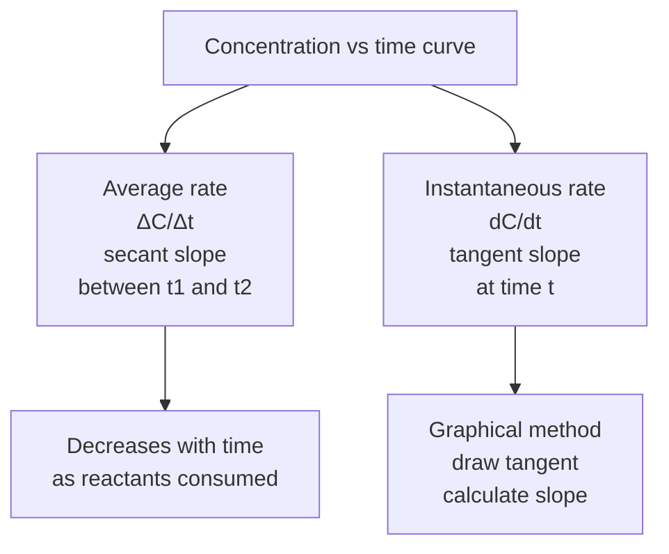
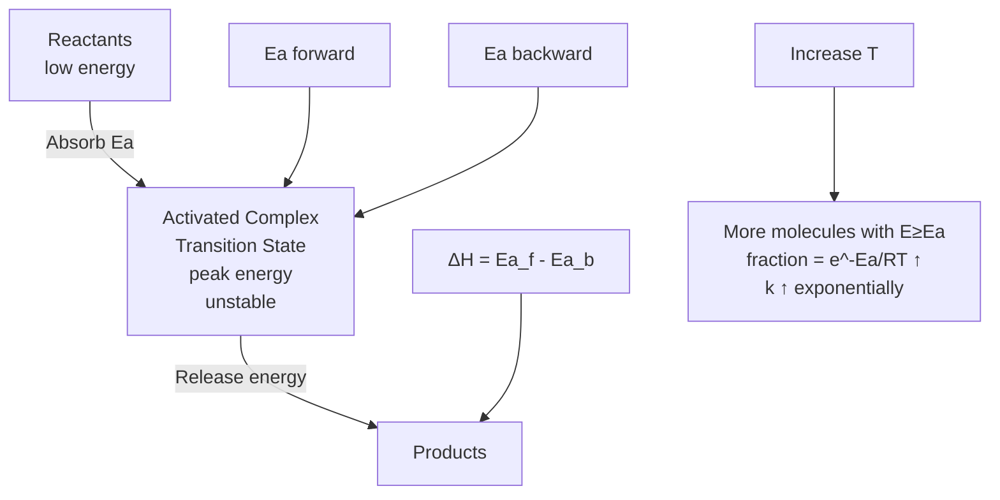
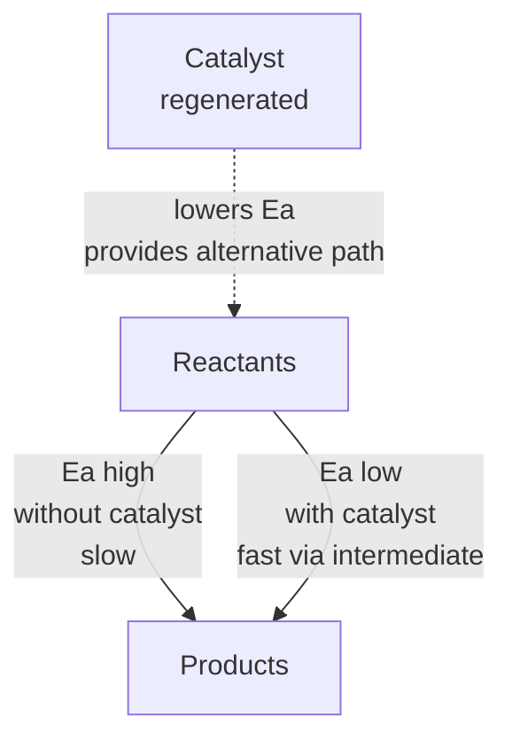

# Chemical Kinetics — JEE Main + Advanced Notes

> **Sources merged into these notes**
> | Source | File |
> |---|---|
> | NCERT Class XII Chemistry (rationalised, 2023+), Unit 3 | [`lech103.pdf`](lech103.pdf) |
> | Allen module for this chapter | _not uploaded yet — drop it in this folder to enable 🅰 tags_ |
>
> NCERT Unit 3 (3.1–3.5) = Rate of reaction average/instantaneous + factors affecting rate + rate law + order/molecularity + elementary/complex + integrated rate laws zero/first order + half-life + pseudo first order + temperature dependence Arrhenius + collision theory. This notes.md is **complete basics-to-Advanced**: NCERT points with § numbers, JEE Advanced extensions marked 🆇, ⚠ = traps. Thermodynamics tells feasibility ($ΔG<0$) and extent (equilibrium), kinetics tells speed and mechanism.

## Contents

- [Part A — Rate of Reaction and Factors](#part-a--rate-of-reaction-and-factors)
  1. [Rate of chemical reaction — average and instantaneous (3.1)](#1-rate-of-chemical-reaction--average-and-instantaneous-31)
  2. [Factors influencing rate of reaction (3.2)](#2-factors-influencing-rate-of-reaction-32)
- [Part B — Rate Law, Order and Molecularity](#part-b--rate-law-order-and-molecularity)
  3. [Rate law and rate constant (3.2)](#3-rate-law-and-rate-constant-32)
  4. [Order of reaction and molecularity — elementary vs complex (3.2)](#4-order-of-reaction-and-molecularity--elementary-vs-complex-32)
  5. [Zero order reactions — integrated law and half-life (3.3)](#5-zero-order-reactions--integrated-law-and-half-life-33)
  6. [First order reactions — integrated law and half-life (3.3)](#6-first-order-reactions--integrated-law-and-half-life-33)
  7. [Second order and nth order reactions 🆇](#7-second-order-and-nth-order-reactions-)
  8. [Pseudo first order reactions (3.3)](#8-pseudo-first-order-reactions-33)
- [Part C — Temperature Dependence and Collision Theory](#part-c--temperature-dependence-and-collision-theory)
  9. [Temperature dependence — Arrhenius equation $k = A e^{-E_a/RT}$ (3.4)](#9-temperature-dependence--arrhenius-equation-k--a-e-e_art-34)
  10. [Activation energy and Arrhenius plot $ln k$ vs $1/T$ (3.4)](#10-activation-energy-and-arrhenius-plot-ln-k-vs-1t-34)
  11. [Collision theory — threshold energy, orientation, effective collisions (3.5)](#11-collision-theory--threshold-energy-orientation-effective-collisions-35)
  12. [Effect of catalyst on rate and $E_a$ 🆇](#12-effect-of-catalyst-on-rate-and-e_a-)
  13. [Reaction mechanisms — rate determining step and steady state 🆇](#13-reaction-mechanisms--rate-determining-step-and-steady-state-)
- [Part D — Advanced Corner, Patterns and Revision](#part-d--advanced-corner-patterns-and-revision)
  14. [Master formula bank (print this)](#14-master-formula-bank-print-this)
  15. [Worked problem patterns — JEE Advanced favourites](#15-worked-problem-patterns--jee-advanced-favourites)
  16. [The 20 traps examiners use](#16-the-20-traps-examiners-use)
  17. [Quick Revision Sheet](#17-quick-revision-sheet)

---

# Part A — Rate of Reaction and Factors

## 1. Rate of chemical reaction — average and instantaneous (3.1)

Chemical kinetics = branch of chemistry dealing with rate of reaction and mechanism, word kinesis = movement. Thermodynamics tells feasibility $ΔG<0$ and extent $K$, kinetics tells speed and how to alter.

Example: Diamond → graphite $ΔG<0$ feasible, but rate extremely slow at room T, so diamond appears forever. $2H_2 + O_2 → 2H_2O$ $ΔG<0$ but mixture stable at room T, needs spark (activation energy).

Some reactions fast: ionic precipitation $\ce{Ag+ + Cl- -> AgCl(s)}$ instantaneous. Some slow: rusting $\ce{4Fe + 3O2 -> 2Fe2O3}$ months. Some moderate: inversion cane sugar, hydrolysis starch.

**Rate definition**: Change in concentration of reactant or product per unit time, volume constant.

For hypothetical $\ce{R -> P}$, $[R]_1$, $[P]_1$ at $t_1$, $[R]_2$, $[P]_2$ at $t_2$, $Δt=t_2-t_1$, $Δ[R]=[R]_2-[R]_1$ negative, $Δ[P]=[P]_2-[P]_1$ positive.

Average rate: $r_{av} = -Δ[R]/Δt = +Δ[P]/Δt$.

Units: concentration time$^{-1}$ = $mol L^{-1} s^{-1}$, for gaseous $atm s^{-1}$ or $bar s^{-1}$.

Instantaneous rate: rate at particular moment, $Δt→0$, $r_{inst} = -d[R]/dt = +d[P]/dt$, obtained by drawing tangent to concentration vs time curve and slope.

For reaction with stoichiometric coefficients not 1: e.g., $2HI(g) → H_2(g) + I_2(g)$, rate of disappearance of HI is twice formation of $H_2$, so to make equal divide by coefficient:

Rate = $-1/2 d[HI]/dt = +d[H_2]/dt = +d[I_2]/dt$.

General: For $aA + bB → cC + dD$, Rate = $-1/a d[A]/dt = -1/b d[B]/dt = +1/c d[C]/dt = +1/d d[D]/dt$.

For gaseous at constant T, concentration ∝ partial pressure, so rate can be expressed as rate of change in partial pressure.



## 2. Factors influencing rate of reaction (3.2)

Four main factors NCERT:

1. **Concentration**: Rate ∝ concentration (usually), higher concentration more collisions → faster. Rate law quantifies.
2. **Temperature**: Most reactions accelerated by increase in T, rate constant nearly doubled for 10°C rise. Arrhenius equation.
3. **Catalyst**: Increases rate by providing alternative pathway with lower $E_a$, not consumed, does not affect $ΔG$ or $K$, only rate, affects both forward and reverse equally.
4. **Nature of reactants**: Ionic reactions fast, covalent slow, physical state, surface area.

Additional 🆇: Pressure (for gases, ∝ concentration), surface area (heterogeneous), light (photochemical), solvent.

---

# Part B — Rate Law, Order and Molecularity

## 3. Rate law and rate constant (3.2)

Rate law = expression of rate as function of concentration of reactants, determined experimentally, not from stoichiometric equation.

For reaction $aA + bB →$ products, rate law: $Rate = k [A]^x [B]^y$, where $x,y$ are orders with respect to A,B, determined experimentally, may be 0,1,2, fractional, negative, not necessarily equal to stoichiometric coefficients $a,b$.

$k$ = rate constant or specific reaction rate, proportionality constant, depends on $T$, catalyst, not on concentration. Units depend on overall order.

Overall order $n = x + y$.

Example: $\ce{2NO + O2 -> 2NO2}$, experimentally $Rate = k [NO]^2 [O2]^1$, overall order 3, order w.r.t NO is 2, w.r.t O2 is 1.

## 4. Order of reaction and molecularity — elementary vs complex (3.2)

**Order**: Sum of powers of concentration terms in rate law, experimental, can be 0,1,2,3, fractional, zero, negative, for overall reaction and for each reactant.

**Molecularity**: Number of reacting species (atoms, ions, molecules) colliding simultaneously in elementary reaction (single step), theoretical, always integer, cannot be zero, cannot be fractional, cannot be >3 (rare 3, trimolecular, low probability of 3 colliding simultaneously), cannot be determined for complex reaction (overall).

**Elementary reaction**: Single step, completes in one collision, order = molecularity, rate law from stoichiometry.

**Complex reaction**: Multiple steps (elementary steps), overall order not equal molecularity, mechanism with intermediates, rate determined by slowest step (rate determining step RDS).

Examples:

- Elementary: $\ce{H2 + I2 -> 2HI}$ (if elementary, rate = $k[H2][I2]$, molecularity 2 bimolecular).
- Complex: $\ce{2NO + O2 -> 2NO2}$ mechanism 2 steps, etc.

Difference table:

| Order | Molecularity |
|---|---|
| Experimental | Theoretical |
| Can be 0, fractional, negative | Always integer, ≥1 |
| For overall and elementary | Only for elementary |
| Can be >3 | Cannot be >3 (practically) |
| Determined from rate law | From mechanism |

```mermaid
flowchart TB
    Reaction[Reaction] --> Elem[Elementary<br>single step<br>order = molecularity<br>rate from stoichiometry]
    Reaction --> Complex[Complex<br>multiple steps<br>mechanism<br>intermediates<br>RDS slowest]
    Complex --> RDS[Rate = rate of RDS<br>using intermediates<br>steady state approximation]
    Order[Order<br>experimental<br>0,1,2, fractional] --> RateLaw[Rate law<br>Rate = k [A]^x [B]^y]
    Mol[Molecularity<br>theoretical<br>1 unimolecular<br>2 bimolecular<br>3 trimolecular] --> Elem
```

## 5. Zero order reactions — integrated law and half-life (3.3)

Zero order: Rate independent of concentration, $Rate = k [R]^0 = k$.

Differential: $-d[R]/dt = k$.

Integrated: $[R] = [R]_0 - kt$.

Plot $[R]$ vs $t$ straight line slope $-k$, intercept $[R]_0$.

Units of $k$: $mol L^{-1} s^{-1}$ (conc time$^{-1}$).

Half-life $t_{1/2}$: time when $[R]=[R]_0/2$ → $t_{1/2} = [R]_0 / 2k$, directly proportional to initial concentration, inversely to $k$.

Examples: Photochemical reactions $\ce{H2 + Cl2 ->[hv] 2HCl}$ rate = $k$ (light intensity constant), decomposition of $\ce{NH3}$ on Pt surface, $\ce{2NH3 ->[Pt] N2 + 3H2}$, enzyme reactions saturated.

## 6. First order reactions — integrated law and half-life (3.3)

First order: Rate ∝ concentration of one reactant, $Rate = k[R]^1$.

Differential: $-d[R]/dt = k[R]$.

Integrated: $ln[R] = ln[R]_0 - kt$ or $log[R] = log[R]_0 - kt/2.303$.

Or $k = 2.303/t log([R]_0/[R])$, $[R]=[R]_0 e^{-kt}$.

Plot $ln[R]$ vs $t$ straight line slope $-k$, intercept $ln[R]_0$.

Units of $k$: $time^{-1}$ = $s^{-1}$.

Half-life: $t_{1/2} = ln2 / k = 0.693/k$, independent of initial concentration, constant for first order.

Examples: Radioactive decay $N=N_0 e^{-λt}$, hydrolysis of ester with water excess, inversion cane sugar, decomposition $\ce{N2O5}$, $\ce{H2O2}$, $\ce{SO2Cl2}$.

Time for 99% completion: $t_{99\%}=2.303/k log(100/1)=4.606/k = 6.64 t_{1/2}$? Actually $t_{99\%}=6.64 t_{1/2}$? Let's calculate: $t_{99\%}=2.303/k log(100)=4.605/k$, $t_{1/2}=0.693/k$ → $t_{99\%}=6.64 t_{1/2}$. $t_{99.9\%}=10 t_{1/2}$ (since $log1000=3$).

Pressure data for first order gaseous: $\ce{N2O5(g) -> 2NO2(g) + 1/2 O2(g)}$, total pressure $p_t = p_{N2O5} + p_{NO2} + p_{O2}$, $p_{N2O5}=1.5 -2p_t$? Actually derived: initial $p_0=0.5 atm$, at time $t$ $p_t=0.5+x$, $p_{N2O5}=0.5-2x=1.5-2p_t$, $k=2.303/t log(p_0/p_{N2O5})$.

## 7. Second order and nth order reactions 🆇

**Second order**: Rate ∝ $[R]^2$ or $[A][B]$.

Case 1: $2R →$ products or $R →$ with rate = $k[R]^2$.

Differential: $-d[R]/dt = k[R]^2$, integrated: $1/[R] = 1/[R]_0 + kt$, plot $1/[R]$ vs $t$ straight line slope $k$.

Half-life: $t_{1/2}=1/k[R]_0$, inversely proportional to initial concentration.

Units: $L mol^{-1} s^{-1}$ = $M^{-1} s^{-1}$.

Case 2: $A + B →$ products rate = $k[A][B]$, if $[A]_0=[B]_0$ same as above, if different: $k=2.303/t([A]_0-[B]_0) log([B]_0[A]/[A]_0[B])$.

Examples: $\ce{2NO2 -> 2NO + O2}$, $\ce{CH3COOC2H5 + NaOH ->}$ saponification.

**nth order**: General $Rate=k[R]^n$, integrated: $(1/(n-1))(1/[R]^{n-1} -1/[R]_0^{n-1})=kt$ for $n≠1$.

Units: $(mol L^{-1})^{1-n} time^{-1}$.

**Table for JEE**:

| Order | Differential | Integrated | Plot linear | $t_{1/2}$ | Units $k$ |
|---|---|---|---|---|---|
| 0 | $-dR/dt=k$ | $[R]=[R]_0-kt$ | $[R]$ vs $t$ | $[R]_0/2k$ | $M s^{-1}$ |
| 1 | $-dR/dt=kR$ | $ln R=ln R_0-kt$ | $lnR$ vs $t$ | $0.693/k$ | $s^{-1}$ |
| 2 | $-dR/dt=kR^2$ | $1/R=1/R_0+kt$ | $1/R$ vs $t$ | $1/kR_0$ | $M^{-1}s^{-1}$ |

## 8. Pseudo first order reactions (3.3)

Reactions which are higher order (e.g., second order) but behave as first order because one reactant in large excess, its concentration not altered much.

Example: Hydrolysis ethyl acetate $\ce{CH3COOC2H5 + H2O ->[H+] CH3COOH + C2H5OH}$, rate = $k[ester][H2O]$, but water large excess ~55.5 M, constant, so rate = $k'[ester]$ where $k'=k[H2O]$, pseudo first order.

Inversion cane sugar: $\ce{C12H22O11 + H2O ->[H+] C6H12O6 + C6H12O6}$, rate = $k[sugar][H2O]$, water excess → rate = $k'[sugar]$, $k'$ pseudo first order constant.

So $k_{pseudo}=k_{real}×[excess]$.

---

# Part C — Temperature Dependence and Collision Theory

## 9. Temperature dependence — Arrhenius equation $k = A e^{-E_a/RT}$ (3.4)

Most reactions accelerated by increase in $T$, rate constant nearly doubled for 10°C rise (temperature coefficient ≈2).

Arrhenius 1889: $k = A e^{-E_a/RT}$

- $A$ = Arrhenius factor / frequency factor / pre-exponential factor, constant specific to reaction, units same as $k$, related to collision frequency and orientation.
- $E_a$ = activation energy $J mol^{-1}$, minimum energy required for reaction.
- $R$ = gas constant $8.314 J mol^{-1} K^{-1}$.
- $T$ = absolute temperature $K$.
- $e^{-E_a/RT}$ = fraction of molecules with energy ≥ $E_a$ (Boltzmann factor).

Physical meaning: Only molecules with energy ≥ $E_a$ can cross barrier and react.

For reaction $\ce{H2 + I2 -> 2HI}$, molecules collide to form unstable intermediate activated complex, energy required to form = $E_a$, then decomposes to products, some energy released, final $ΔH$ depends on reactants/products.

Potential energy vs reaction coordinate diagram: Reactants → peak activated complex (transition state) with $E_a$ → products, $ΔH = E_a(forward) - E_a(backward)$.

If $ΔH<0$ exothermic, $E_a(forward) < E_a(backward)$? Actually $E_a(f) = E_a(b) + ΔH$? For exothermic $ΔH$ negative, $E_a(f) < E_a(b)$.

## 10. Activation energy and Arrhenius plot $ln k$ vs $1/T$ (3.4)

Taking ln: $ln k = -E_a/RT + ln A$.

Plot $ln k$ vs $1/T$ straight line slope $-E_a/R$, intercept $ln A$.

If two rate constants $k_1$ at $T_1$, $k_2$ at $T_2$:

$ln(k_2/k_1) = -E_a/R (1/T_2 -1/T_1) = E_a/R (1/T_1 -1/T_2)$

$log(k_2/k_1) = E_a/2.303R (1/T_1 -1/T_2)$

This used to calculate $E_a$ from two $k$ at different $T$.

Maxwell-Boltzmann distribution: Fraction of molecules with energy $E$ vs $E$, peak at most probable kinetic energy, tail to high $E$, area constant. As $T$ increases, peak shifts higher $E$, broadens, more molecules have $E ≥ E_a$, fraction $e^{-E_a/RT}$ increases, rate increases exponentially.

Temperature coefficient: $k_{T+10}/k_T ≈ 2-3$ for many reactions.



## 11. Collision theory — threshold energy, orientation, effective collisions (3.5)

Collision theory explains rate based on molecular collisions.

Postulates:

1. Reaction occurs due to collisions between reactant molecules.
2. Number of collisions per unit volume per second = collision frequency $Z_{AB}$.
3. Not all collisions effective — only those with energy ≥ threshold energy $E_{threshold}$ and proper orientation.

- **Threshold energy**: Minimum energy colliding molecules must have to form activated complex.
- **Activation energy** $E_a = E_{threshold} - E_{average\ of\ reactants}$.

- **Orientation factor**: Even if energy sufficient, molecules must be oriented properly to form bonds. Example: $\ce{NO2 + NO2 ->}$ etc., need correct alignment.

Effective collisions = collisions with $E ≥ E_a$ and proper orientation → lead to products.

Rate = $Z_{AB} × f × p$, where $f = e^{-E_a/RT}$ fraction with sufficient energy, $p$ = steric factor / probability factor / orientation factor (0 to 1).

Arrhenius factor $A = p Z_{AB}$.

For simple gaseous reactions, collision theory works, but for complex, $p$ very small.

## 12. Effect of catalyst on rate and $E_a$ 🆇

Catalyst = substance that increases rate without being consumed, provides alternative pathway with lower $E_a$.

- Catalyst lowers $E_a$ for both forward and backward equally, so $k$ increases for both, $K$ unchanged (since $K=k_f/k_b$ both increase same factor), $ΔG$ unchanged, equilibrium position unchanged, only reaches faster.
- Catalyst does not change $ΔH$, $ΔG$, $ΔS$, $K$, only $E_a$ and rate.
- Catalyst forms intermediate with reactants, then decomposes.

Energy profile: Without catalyst high peak $E_a$, with catalyst lower peak(s) via intermediate, same reactants and products energy.

Example: $\ce{2H2O2 -> 2H2O + O2}$ uncatalysed $E_a=75 kJ/mol$, with $I^-$ catalyst $E_a=56 kJ/mol$, with catalase enzyme $E_a=8 kJ/mol$ — huge rate increase.



## 13. Reaction mechanisms — rate determining step and steady state 🆇

Complex reactions have mechanism with elementary steps, intermediates.

**Rate determining step (RDS)**: Slowest step, rate of overall reaction = rate of RDS.

Example: $\ce{2NO + O2 -> 2NO2}$ mechanism:
Step1: $\ce{NO + NO ->[k1] N2O2}$ fast equilibrium
Step2: $\ce{N2O2 + O2 ->[k2] 2NO2}$ slow RDS → rate = $k_2[N2O2][O2]$, but $[N2O2]=K[NO]^2$ from step1 equilibrium → rate = $k[NO]^2[O2]$.

**Steady state approximation (SSA)**: For reactive intermediate, rate of formation = rate of consumption, concentration nearly constant, $d[intermediate]/dt≈0$.

Use to derive rate law for complex mechanisms.

Example: $\ce{2A + B -> C}$ mechanism: $A + B ->[k1] AB$ (slow), $AB + A ->[k2] C$ (fast) → rate = $k_1[A][B]$.

Chain reactions: Initiation, propagation, termination.

---

# Part D — Advanced Corner, Patterns and Revision

## 14. Master formula bank (print this)

**Rate definitions**:

- Average: $r_{av}= -Δ[R]/Δt = +Δ[P]/Δt$, for $aA+bB→cC+dD$ Rate = $-1/a d[A]/dt = -1/b d[B]/dt = +1/c d[C]/dt = +1/d d[D]/dt$
- Instantaneous: $r_{inst}= -d[R]/dt = +d[P]/dt$, tangent slope
- Units: $M s^{-1}$ for rate, $k$ units $(M)^{1-n} s^{-1}$ for nth order

**Rate law**: $Rate = k[A]^x[B]^y$, $x,y$ orders experimentally, overall $n=x+y$, $k$ rate constant depends on $T$, catalyst.

**Order vs molecularity**: Order experimental can be 0,1,2,3,fractional,negative, for overall and each; molecularity theoretical integer ≥1 ≤3 for elementary only, order=molecularity for elementary.

**Integrated laws**:

- Zero: $-dR/dt=k$, $R=R_0-kt$, $[R]$ vs $t$ linear slope $-k$, $t_{1/2}=R_0/2k$, $k$ $M s^{-1}$
- First: $-dR/dt=kR$, $lnR=lnR_0-kt$, $k=2.303/t log(R_0/R)$, $R=R_0 e^{-kt}$, $lnR$ vs $t$ linear, $t_{1/2}=0.693/k$ independent of $R_0$, $k$ $s^{-1}$
- Second (type $2R$): $-dR/dt=kR^2$, $1/R=1/R_0+kt$, $1/R$ vs $t$ linear, $t_{1/2}=1/kR_0$, $k$ $M^{-1}s^{-1}$
- Second (type $A+B$ $A_0≠B_0$): $k=2.303/t(A_0-B_0) log(B_0 A / A_0 B)$
- nth $n≠1$: $(1/(n-1))(1/R^{n-1}-1/R_0^{n-1})=kt$
- Pseudo first: $Rate=k'[R]$ where $k'=k[excess]$, e.g., ester hydrolysis water excess

**Half-life**:

- Zero: $R_0/2k$ ∝ $R_0$
- First: $0.693/k$ independent $R_0$
- Second: $1/kR_0$ ∝ $1/R_0$
- $t_{99\%}=2.303/k log100=4.606/k=6.64 t_{1/2}$ first order, $t_{99.9\%}=6.909/k=10 t_{1/2}$

**Arrhenius**:

- $k=A e^{-E_a/RT}$, $A$ frequency factor same units as $k$, $E_a$ activation energy $J/mol$
- $ln k = -E_a/RT + ln A$, plot $ln k$ vs $1/T$ slope $-E_a/R$ intercept $ln A$
- $ln(k_2/k_1)= -E_a/R (1/T_2-1/T_1)=E_a/R(1/T_1-1/T_2)$, $log(k_2/k_1)=E_a/2.303R(1/T_1-1/T_2)$
- $e^{-E_a/RT}$ = fraction with $E≥E_a$, $T$ ↑ fraction ↑ exponentially, $k$ ↑, $k_{T+10}/k_T≈2$
- $ΔH = E_a(f) - E_a(b)$

**Collision theory**:

- Rate = $Z_{AB} × e^{-E_a/RT} × p$, $Z_{AB}$ collision frequency, $p$ steric/orientation factor 0-1, $A=pZ_{AB}$
- Effective collisions = energy ≥ $E_a$ + proper orientation
- $E_a = E_{threshold} - E_{avg\ reactants}$

**Catalyst**:

- Lowers $E_a$ for both forward and backward equally, increases $k_f$ and $k_b$ same factor, $K=k_f/k_b$ unchanged, $ΔG$, $ΔH$, $K$ unchanged, only rate ↑, equilibrium reached faster, forms intermediate, regenerated.

**Mechanism**:

- RDS slowest step, rate = rate of RDS, intermediates steady state $d[intermediate]/dt≈0$, use equilibrium of fast steps before RDS.

## 15. Worked problem patterns — JEE Advanced favourites

**Pattern 1 — Rate from concentration data**:

$R→P$, $[R]$ 0.03 M to 0.02 M in 25 min → average rate = $-(0.02-0.03)/25=0.0004 M/min=6.67e-6 M/s$.

**Pattern 2 — Rate law determination**:

Given experiments: $[A]$ double rate double → first order w.r.t A, $[B]$ double rate quadruple → second order w.r.t B → overall 3, rate = $k[A][B]^2$.

**Pattern 3 — Zero order**:

$R_0=0.1 M$, $k=0.001 M/s$, time for 50% → $t_{1/2}=0.1/(2×0.001)=50 s$.

**Pattern 4 — First order $k$ and $t_{1/2}$**:

First order $k=1.15e-3 s^{-1}$, 5 g to 3 g → $t=2.303/k log(5/3)=2.303/1.15e-3×0.2218=444 s$, $t_{1/2}=0.693/1.15e-3=602 s$.

**Pattern 5 — First order pressure data**:

$\ce{N2O5}$ initial 0.5 atm, total pressure at 100 s 0.512 atm → $p_{N2O5}=1.5-2p_t=0.476 atm$, $k=2.303/100 log(0.5/0.476)=4.98e-4 s^{-1}$.

**Pattern 6 — Second order**:

$2R→P$, $R_0=0.5 M$, $k=0.02 M^{-1}s^{-1}$, $t_{1/2}=1/(0.02×0.5)=100 s$.

**Pattern 7 — Pseudo first order**:

Ester hydrolysis $[H2O]=55.5 M$, $k_{real}=1e-4 M^{-1}s^{-1}$, $k_{pseudo}=55.5×1e-4=5.55e-3 s^{-1}$.

**Pattern 8 — Arrhenius $E_a$ from two $k$**:

$k_1=1e-3 s^{-1}$ at 300 K, $k_2=2e-3 s^{-1}$ at 310 K → $ln2= -E_a/R(1/310-1/300)=E_a/R×(10/93000)$ → $E_a=0.693×8.314×93000/10=53.6 kJ/mol$.

**Pattern 9 — Temperature coefficient**:

Rate doubles for 10°C rise, $E_a≈53 kJ/mol$ (approx).

**Pattern 10 — Catalyst effect**:

Uncatalysed $E_a=100 kJ$, catalysed $E_a=50 kJ$, $k_{cat}/k_{uncat}=e^{(100-50)kJ/RT}=e^{50000/(8.314×300)}=e^{20}=4.8e8$ times faster.

**Pattern 11 — Mechanism RDS**:

$2NO+O2→2NO2$ mechanism fast equilibrium $2NO⇌N2O2$ $K=[N2O2]/[NO]^2$, slow $N2O2+O2→2NO2$ rate=$k2[N2O2][O2]=k2K[NO]^2[O2]=k[NO]^2[O2]$.

## 16. The 20 traps examiners use

1. Rate = $-Δ[R]/Δt$ positive, $Δ[R]$ negative so minus sign needed.
2. For $aA+bB→$ Rate = $-1/a d[A]/dt$ divide by coefficient to make equal.
3. Rate law from experiment, not stoichiometry, order may ≠ coefficients.
4. Order experimental can be 0, fractional, negative, molecularity integer 1-3 only for elementary.
5. Zero order $t_{1/2}=R_0/2k$ ∝ $R_0$, first order $t_{1/2}=0.693/k$ independent $R_0$, second $t_{1/2}=1/kR_0$ ∝ $1/R_0$.
6. Units $k$: zero $M s^{-1}$, first $s^{-1}$, second $M^{-1}s^{-1}$, nth $(M)^{1-n}s^{-1}$.
7. First order $lnR$ vs $t$ linear, zero $[R]$ vs $t$ linear, second $1/R$ vs $t$ linear.
8. $t_{99\%}=6.64 t_{1/2}$ first order, $t_{99.9\%}=10 t_{1/2}$.
9. Pseudo first order $k_{pseudo}=k_{real}[excess]$, water 55.5 M.
10. Arrhenius $k=A e^{-E_a/RT}$, $A$ same units as $k$, $E_a$ $J/mol$, $R=8.314$.
11. $ln k$ vs $1/T$ slope $-E_a/R$, intercept $ln A$, $log(k_2/k_1)=E_a/2.303R(1/T_1-1/T_2)$.
12. $e^{-E_a/RT}$ fraction with $E≥E_a$, $T$ ↑ fraction ↑ exponentially.
13. $ΔH=E_a(f)-E_a(b)$, exothermic $E_a(f)<E_a(b)$.
14. Collision theory $Rate=Z_{AB} e^{-E_a/RT} p$, $p$ steric factor 0-1.
15. Catalyst lowers $E_a$ both forward and backward equally, $K$ unchanged, $ΔG$ unchanged, only rate ↑.
16. Catalyst does not change $ΔH$, $ΔS$, $K$, equilibrium position, only $E_a$ and $k$.
17. RDS slowest step, rate = rate of RDS, use steady state $d[intermediate]/dt≈0$.
18. For gaseous first order pressure data $p_{reactant}=...$ derive correctly $p_t$ relation.
19. Temperature coefficient ≈2 for 10°C rise, but exact via Arrhenius.
20. $A$ frequency factor includes collision frequency and orientation, $p$ steric factor.

## 17. Quick Revision Sheet

**Rate**: Average $r_{av}=-Δ[R]/Δt=+Δ[P]/Δt$, instantaneous $r_{inst}=-d[R]/dt$ tangent slope, for $aA+bB→cC+dD$ Rate=$-1/a d[A]/dt=-1/b d[B]/dt=+1/c d[C]/dt=+1/d d[D]/dt$, units $M s^{-1}$ or $atm s^{-1}$.

**Factors**: Concentration ↑ rate ↑, temperature ↑ rate ↑ $k_{T+10}/k_T≈2$, catalyst ↑ rate by lowering $E_a$, nature of reactants ionic fast, surface area, pressure for gases, light.

**Rate law**: $Rate=k[A]^x[B]^y$, $x,y$ orders experimentally, overall $n=x+y$, $k$ rate constant depends on $T$, catalyst, units $(M)^{1-n}s^{-1}$.

**Order vs molecularity**: Order experimental 0,1,2,3,fractional,negative, for overall and each; molecularity theoretical integer 1-3 for elementary only, order=molecularity for elementary.

**Zero order**: $Rate=k$, $[R]=[R]_0-kt$, $[R]$ vs $t$ linear slope $-k$, $t_{1/2}=R_0/2k∝R_0$, $k$ $M s^{-1}$, examples photochemical $\ce{H2+Cl2->hv}$, $\ce{NH3}$ on Pt.

**First order**: $Rate=k[R]$, $lnR=lnR_0-kt$, $k=2.303/t log(R_0/R)$, $R=R_0 e^{-kt}$, $lnR$ vs $t$ linear, $t_{1/2}=0.693/k$ independent $R_0$, $k$ $s^{-1}$, $t_{99\%}=4.606/k=6.64 t_{1/2}$ $t_{99.9\%}=6.909/k=10 t_{1/2}$, examples radioactive decay, $\ce{N2O5}$, $\ce{H2O2}$, $\ce{SO2Cl2}$, ester hydrolysis excess water, inversion cane sugar.

**Second order**: $Rate=k[R]^2$ or $k[A][B]$, $1/R=1/R_0+kt$, $1/R$ vs $t$ linear, $t_{1/2}=1/kR_0∝1/R_0$, $k$ $M^{-1}s^{-1}$, $A+B$ $A_0≠B_0$ $k=2.303/t(A_0-B_0)log(B_0A/A_0B)$.

**Pseudo first**: Higher order but behaves first order due to large excess, $k_{pseudo}=k_{real}[excess]$, water 55.5 M.

**Arrhenius**: $k=A e^{-E_a/RT}$, $A$ frequency factor same units as $k$, $E_a$ activation energy, $e^{-E_a/RT}$ fraction with $E≥E_a$, $ln k=-E_a/RT+ln A$, plot $ln k$ vs $1/T$ slope $-E_a/R$ intercept $ln A$, $ln(k_2/k_1)=-E_a/R(1/T_2-1/T_1)$, $log(k_2/k_1)=E_a/2.303R(1/T_1-1/T_2)$, $T$ ↑ $k$ ↑ exponentially, $k_{T+10}/k_T≈2$.

**Potential energy diagram**: Reactants → peak activated complex $E_a$ → products, $ΔH=E_a(f)-E_a(b)$.

**Collision theory**: Collisions cause reaction, $Z_{AB}$ collision frequency, only effective collisions with $E≥E_a$ threshold and proper orientation, $Rate=Z_{AB} e^{-E_a/RT} p$, $p$ steric factor 0-1, $A=pZ_{AB}$, $E_a=E_{threshold}-E_{avg}$.

**Catalyst**: Provides alternative path lower $E_a$, $E_a$ ↓ both forward and backward equally, $k_f$ and $k_b$ ↑ same factor, $K=k_f/k_b$ unchanged, $ΔG$, $ΔH$, $K$, equilibrium position unchanged, only rate ↑ faster equilibrium, regenerated, forms intermediate.

**Mechanism**: Complex multiple steps intermediates, RDS slowest step rate = rate of RDS, steady state $d[intermediate]/dt≈0$, use equilibrium of fast steps before RDS to express intermediate concentration.

---
*Cross-links:*
- Previous: [Thermodynamics](../03-Thermodynamics/notes.md) — $ΔG<0$ feasibility vs rate, $E_a$ vs $ΔH$; [Equilibrium](../04-Equilibrium/notes.md) — $K=k_f/k_b$, $ΔG°=-RT ln K$; [Solutions](../07-Solutions/notes.md) — concentration terms for rate law.
- Next: [Electrochemistry](../08-Electrochemistry/notes.md) — $ΔG°=-nFE°$ and rate; [Surface Chemistry](../11-Surface-Chemistry/notes.md) — heterogeneous catalysis, adsorption.
- Related: [States of Matter](../06-States-of-Matter/notes.md) — KTG collision frequency $Z_{AB}$, Maxwell distribution for $e^{-E_a/RT}$; [Structure of Atom](../02-Structure-of-Atom/notes.md) — $E_a$ vs photon energy.
- Practical: Determination of $k$ via pressure, titration, colorimetry, $t_{1/2}$ methods.
