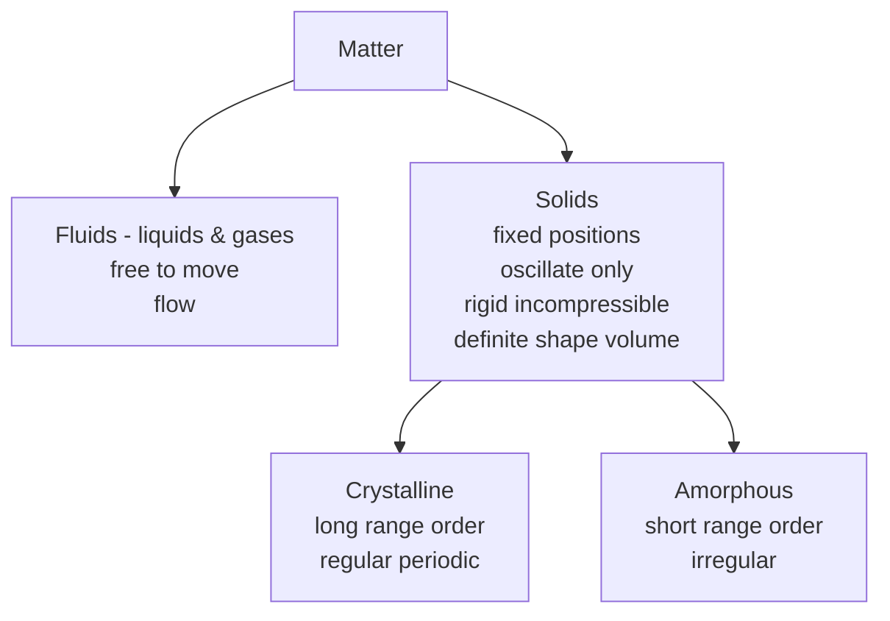
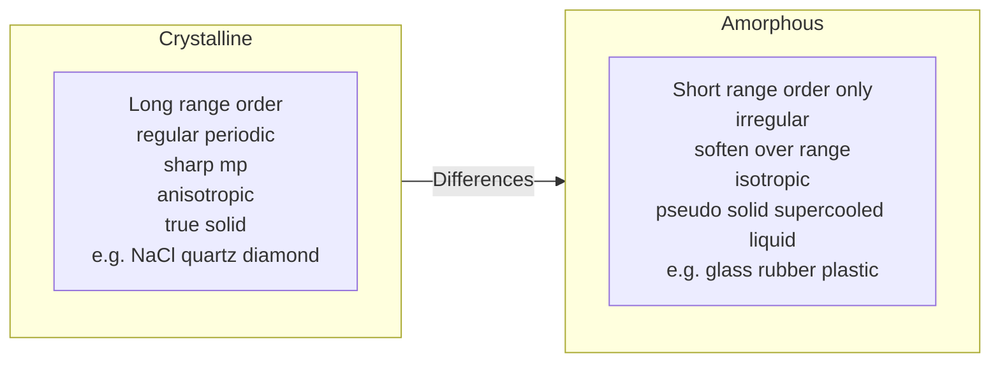
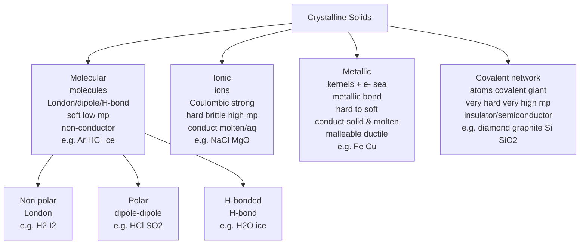
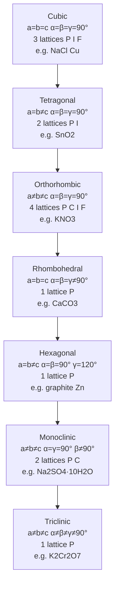
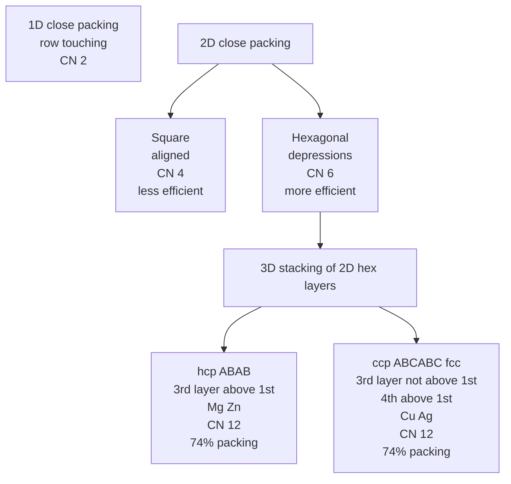
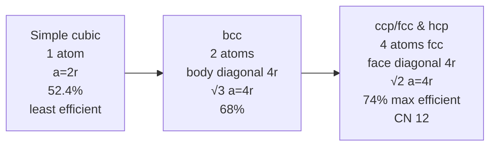
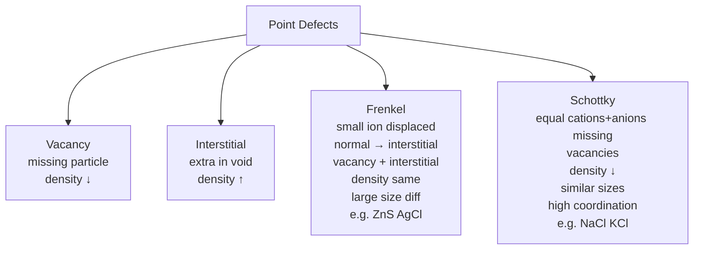
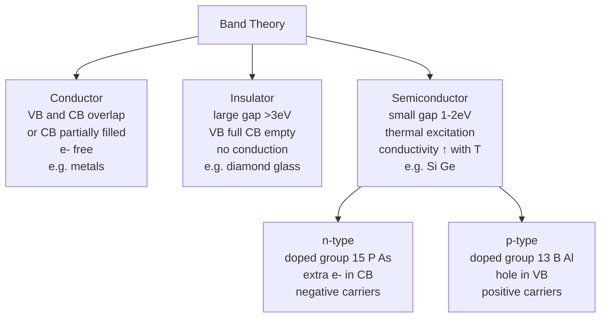
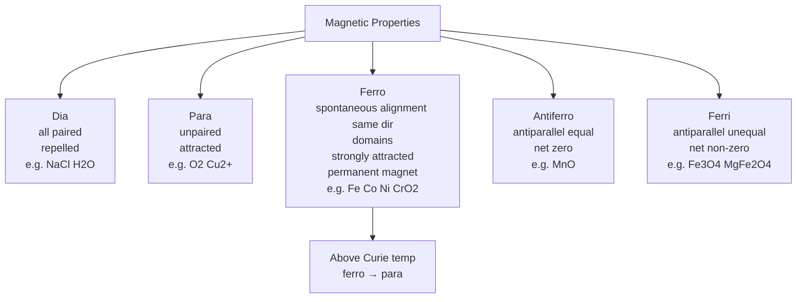

# The Solid State — JEE Advanced Notes

> **Sources merged into these notes**
> | Source | File |
> |---|---|
> | NCERT Class XII Chemistry legacy 2018-19, Unit 1 (The Solid State) | [`lech101-legacy.pdf`](lech101-legacy.pdf) |
> | Allen module for this chapter | _not uploaded yet — drop it in this folder to enable 🅰 tags_ |
>
> NCERT legacy Unit 1 (1.1–1.11) = General characteristics solid state + amorphous vs crystalline + classification crystalline solids + crystal lattice + unit cell + 7 crystal systems + 14 Bravais lattices + close packing hcp/ccp + voids tetrahedral/octahedral + packing efficiency + calculations density $d=zM/a^3N_A$ + imperfections point defects Frenkel Schottky + electrical properties band theory conductors insulators semiconductors doping + magnetic properties. This notes.md is **complete basics-to-Advanced**: NCERT points with § numbers, JEE Advanced extensions marked 🆇, ⚠ = traps. Proper Obsidian plugin usage: Mermaid flowcharts for classification/lattices/packing/defects, $\ce{}$ for formulas, ChemEdit SVG for structures (diamond/graphite).

## Contents

- [Part A — General Characteristics and Classification](#part-a--general-characteristics-and-classification)
  1. [General characteristics of solid state (1.1)](#1-general-characteristics-of-solid-state-11)
  2. [Amorphous vs crystalline solids — long vs short range order (1.2)](#2-amorphous-vs-crystalline-solids--long-vs-short-range-order-12)
  3. [Classification of crystalline solids — molecular, ionic, metallic, covalent (1.3)](#3-classification-of-crystalline-solids--molecular-ionic-metallic-covalent-13)
- [Part B — Crystal Lattice and Unit Cell](#part-b--crystal-lattice-and-unit-cell)
  4. [Crystal lattice and unit cell — parameters (1.4–1.5)](#4-crystal-lattice-and-unit-cell--parameters-1415)
  5. [Seven crystal systems and 14 Bravais lattices (1.5)](#5-seven-crystal-systems-and-14-bravais-lattices-15)
  6. [Number of atoms per unit cell — primitive, bcc, fcc, end-centred (1.6)](#6-number-of-atoms-per-unit-cell--primitive-bcc-fcc-end-centred-16)
- [Part C — Close Packing and Voids](#part-c--close-packing-and-voids)
  7. [Close packing in one and two dimensions (1.6)](#7-close-packing-in-one-and-two-dimensions-16)
  8. [Close packing in three dimensions — hcp ABAB and ccp ABCABC (1.6)](#8-close-packing-in-three-dimensions--hcp-abab-and-ccp-abcabc-16)
  9. [Tetrahedral and octahedral voids — location and number (1.6.1)](#9-tetrahedral-and-octahedral-voids--location-and-number-161)
  10. [Radius ratio rules and formula of compound from voids 🆇 (1.6.1)](#10-radius-ratio-rules-and-formula-of-compound-from-voids--161)
  11. [Packing efficiency — simple cubic 52.4%, bcc 68%, hcp/ccp 74% (1.7)](#11-packing-efficiency--simple-cubic-524-bcc-68-hcpccp-74-17)
  12. [Calculations involving unit cell dimensions $d=zM/a^3N_A$ (1.8)](#12-calculations-involving-unit-cell-dimensions-dzma3na-18)
- [Part D — Imperfections and Properties](#part-d--imperfections-and-properties)
  13. [Imperfections in solids — point defects vacancy interstitial (1.9)](#13-imperfections-in-solids--point-defects-vacancy-interstitial-19)
  14. [Frenkel and Schottky defects — comparison (1.9)](#14-frenkel-and-schottky-defects--comparison-19)
  15. [Impurity defects and non-stoichiometric defects 🆇 (1.9)](#15-impurity-defects-and-non-stoichiometric-defects--19)
  16. [Electrical properties — band theory conductors insulators semiconductors doping (1.10)](#16-electrical-properties--band-theory-conductors-insulators-semiconductors-doping-110)
  17. [Magnetic properties — dia, para, ferro, antiferro, ferri 🆇 (1.11)](#17-magnetic-properties--dia-para-ferro-antiferro-ferri--111)
- [Part E — Advanced Corner, Patterns and Revision](#part-e--advanced-corner-patterns-and-revision)
  18. [Master formula bank (print this)](#18-master-formula-bank-print-this)
  19. [Worked problem patterns — JEE Advanced favourites](#19-worked-problem-patterns--jee-advanced-favourites)
  20. [The 20 traps examiners use](#20-the-20-traps-examiners-use)
  21. [Quick Revision Sheet](#21-quick-revision-sheet)

---

# Part A — General Characteristics and Classification

## 1. General characteristics of solid state (1.1)

Solids = most surrounded, used more than liquids/gases, properties depend on constituent particles and binding forces. Study of structure important for designing new materials high-T superconductors, magnetic materials, biodegradable polymers, biocompatible implants.

Liquids and gases called fluids due to ability to flow, molecules free to move. In solids constituent particles have fixed positions and can only oscillate about mean positions → rigidity.

Characteristics:

- Definite mass, volume and shape.
- Intermolecular distances short.
- Intermolecular forces strong.
- Constituent particles atoms/molecules/ions fixed positions, oscillate about mean.
- Incompressible and rigid.
- High density.

*Fluids flow, solids do not; and solids split into crystalline (long-range order) and amorphous (short-range only).*

## 2. Amorphous vs crystalline solids — long vs short range order (1.2)

**Crystalline solids**: Large number of small crystals, each definite characteristic geometrical shape, arrangement of constituent particles ordered, long range order regular pattern repeats periodically over entire crystal. Examples: $\ce{NaCl}$, quartz, diamond, metals Fe Cu Ag, non-metals S P I2, compounds $\ce{ZnS}$ naphthalene. Properties: sharp melting point, anisotropic (physical properties like electrical resistance refractive index different along different directions due to different arrangement), true solids, definite heat of fusion, cleavage plain smooth surfaces when cut.

**Amorphous solids**: Greek amorphos = no form, particles irregular shape, only short range order regular repeating pattern over short distances only, scattered, disordered between, structure similar to liquids. Examples: glass, rubber, plastics, amorphous Si photovoltaic. Properties: soften over range of temperature can be moulded blown, pseudo solids or super cooled liquids (glass flows very slowly, old window panes thicker at bottom), isotropic (properties same along all directions due to irregular arrangement), no definite heat of fusion, cleavage irregular surfaces.

Quartz vs quartz glass: quartz crystalline long range order, quartz glass amorphous short range order, both almost identical local structure but long range differs.

*The crystalline/amorphous distinction, and why a glass is really a supercooled liquid.*

## 3. Classification of crystalline solids — molecular, ionic, metallic, covalent (1.3)

Based on nature of intermolecular forces / binding forces:

**a) Molecular solids**: Molecules constituent particles, further sub-divided:

- **Non-polar molecular**: Atoms e.g., Ar He or molecules non-polar covalent $\ce{H2 Cl2 I2}$, held by weak London dispersion, soft, non-conductors, low mp, usually liquid/gas at room T.
- **Polar molecular**: Molecules polar covalent $\ce{HCl SO2}$, dipole-dipole stronger than London, soft non-conductors, mp higher than non-polar yet mostly gases/liquids at room T, solid $\ce{SO2}$ solid $\ce{NH3}$.
- **Hydrogen bonded molecular**: Polar covalent H-F O-H N-H strong H-bonding e.g., $\ce{H2O}$ ice, non-conductors, volatile liquids or soft solids.

**b) Ionic solids**: Ions constituent, strong electrostatic Coulombic forces, hard brittle, high mp, conduct in molten/aqueous but not solid (ions not free in solid, free in molten), e.g., $\ce{NaCl MgO ZnS CaF2}$.

**c) Metallic solids**: Metal atoms positive kernels in sea of delocalised electrons, metallic bond, hard to soft, mp moderate to high, conductors in solid and molten (electrons free), malleable ductile, e.g., Fe Cu Ag Au.

**d) Covalent / network solids**: Atoms linked by covalent bonds throughout crystal, giant molecules, very hard, very high mp, insulators to semiconductors, e.g., diamond, graphite, Si, $\ce{SiC}$ quartz $\ce{SiO2}$.

Diamond: $sp^3$ each C bonded to 4 C tetrahedral network hard, graphite: $sp^2$ layers hexagonal sheets with delocalised pi electrons conducting within layers, soft.

*Four classes of crystalline solid, each with its bonding, its mechanical behaviour and its conductivity.*

---

# Part B — Crystal Lattice and Unit Cell

## 4. Crystal lattice and unit cell — parameters (1.4–1.5)

Crystal lattice = regular arrangement of points in space representing positions of constituent particles.

Unit cell = smallest repeating unit of crystal lattice which when repeated in 3D generates entire crystal.

Unit cell parameters:

- 3 edge lengths $a,b,c$.
- 3 angles between edges $α$ angle between $b$ and $c$, $β$ between $a$ and $c$, $γ$ between $a$ and $b$.

Lattice defined by 6 parameters $a,b,c,α,β,γ$.

## 5. Seven crystal systems and 14 Bravais lattices (1.5)

Seven crystal systems based on edge lengths and angles:

| System | $a,b,c$ | $α,β,γ$ | Examples |
|---|---|---|---|
| Cubic | $a=b=c$ | $α=β=γ=90°$ | $\ce{NaCl}$, diamond, Cu |
| Tetragonal | $a=b≠c$ | $α=β=γ=90°$ | $\ce{SnO2}$, $\ce{TiO2}$ |
| Orthorhombic | $a≠b≠c$ | $α=β=γ=90°$ | $\ce{KNO3}$, $\ce{BaSO4}$ |
| Rhombohedral/Trigonal | $a=b=c$ | $α=β=γ≠90°$ | $\ce{CaCO3}$ calcite, HgS cinnabar |
| Hexagonal | $a=b≠c$ | $α=β=90°$, $γ=120°$ | graphite, Zn, Mg |
| Monoclinic | $a≠b≠c$ | $α=γ=90°$, $β≠90°$ | $\ce{Na2SO4·10H2O}$, monoclinic S |
| Triclinic | $a≠b≠c$ | $α≠β≠γ≠90°$ | $\ce{K2Cr2O7}$, $\ce{CuSO4·5H2O}$ |

Bravais lattices: 14 possible lattice types based on centering.

Centering types:

- Primitive P: particles only at corners.
- Body-centred I: corners + one at body centre.
- Face-centred F: corners + one at each face centre.
- End-centred C: corners + one at two opposite faces (C-centred).

Distribution among 7 systems gives 14 Bravais lattices: Cubic 3 (P,I,F), Tetragonal 2 (P,I), Orthorhombic 4 (P,C,I,F), Rhombohedral 1 (P), Hexagonal 1 (P), Monoclinic 2 (P,C), Triclinic 1 (P).

*The seven crystal systems with their lattice parameters, and the 14 Bravais lattices they generate.*

## 6. Number of atoms per unit cell — primitive, bcc, fcc, end-centred (1.6)

Contribution of particle at corner = $1/8$ shared by 8 unit cells, at face centre = $1/2$ shared by 2, at body centre = $1$ fully inside, at edge centre = $1/4$ shared by 4.

- **Primitive cubic P**: 8 corners × $1/8$ = 1 atom per unit cell.
- **Body-centred cubic bcc I**: 8 corners × $1/8$ + 1 body centre ×1 = 1+1=2 atoms.
- **Face-centred cubic fcc / ccp F**: 8 corners ×$1/8$ + 6 faces ×$1/2$ =1+3=4 atoms.
- **End-centred C**: 8 corners ×$1/8$ + 2 faces ×$1/2$ =1+1=2 atoms.

For ionic compounds, count separately for cations and anions.

Example: $\ce{NaCl}$ fcc: $\ce{Cl-}$ at corners+faces =4, $\ce{Na+}$ at edges+body centre =12×1/4+1=4 → 4 formula units per unit cell $z=4$.

---

# Part C — Close Packing and Voids

## 7. Close packing in one and two dimensions (1.6)

Close packing = most efficient arrangement to minimize empty space.

- **One dimension**: Spheres in row touching each other, coordination number 2.
- **Two dimensions**: Two types:
  - Square close packing: rows aligned, second row exactly above first, coordination 4, less efficient.
  - Hexagonal close packing: second row in depressions of first, each sphere touches 2 in same row and 2 in adjacent rows? Actually coordination 6 in plane, more efficient, 60° arrangement.

Hexagonal 2D more efficient than square.

## 8. Close packing in three dimensions — hcp ABAB and ccp ABCABC (1.6)

Two 2D hexagonal layers stacked in 3D:

- **hcp hexagonal close packed ABAB**: First layer A, second layer B in depressions of A, third layer A again exactly above first, pattern ABAB... Example: Mg Zn. Coordination 12.

- **ccp cubic close packed ABCABC / fcc**: First layer A, second B in depressions, third layer C in depressions of B not above A, fourth layer A again above first, pattern ABCABC... Example: Cu Ag Au Al. Coordination 12, also 74% packing efficiency same as hcp, both most efficient.

Both hcp and ccp have 74% space filled, 26% voids.

*Close packing built up in three stages, ending in hcp ABAB and ccp ABCABC — both 74% and both CN 12.*

## 9. Tetrahedral and octahedral voids — location and number (1.6.1)

When particles close packed, voids = empty spaces.

- **Tetrahedral void**: Formed by 4 spheres, 3 in one layer and 1 in adjacent layer, shape tetrahedron. Size smaller. Number of tetrahedral voids = 2 × number of close packed particles. In ccp unit cell 4 atoms → 8 tetrahedral voids. Each small cube of ccp divided into 8 small cubes each has 1 tetrahedral void at alternate corners.

- **Octahedral void**: Formed by 6 spheres, 3 in one layer and 3 in adjacent, shape octahedron. Size larger than tetrahedral. Number of octahedral voids = number of close packed particles. In ccp 4 atoms → 4 octahedral voids: 1 at body centre + 12 edges ×1/4 =1+3=4.

In ionic solids, bigger ions usually anions form close packed structure, smaller cations occupy voids. If cation small → tetrahedral voids, if bigger → octahedral voids. Fraction occupied depends on formula.

Example: $\ce{NaCl}$: $\ce{Cl-}$ ccp 4 per unit cell, $\ce{Na+}$ occupies all octahedral voids 4 → formula $\ce{NaCl}$ $z=4$.

$\ce{ZnS}$ zinc blende: $\ce{S^{2-}}$ ccp 4, $\ce{Zn^{2+}}$ occupies half tetrahedral voids 4? Actually 8 tetrahedral voids, half 4 occupied → $\ce{ZnS}$.

## 10. Radius ratio rules and formula of compound from voids 🆇 (1.6.1)

Radius ratio $r^+/r^-$ determines coordination number and void type.

Rules:

| $r^+/r^-$ range | CN | Void / Structure |
|---|---|---|
| <0.155 | 2 | Linear |
| 0.155–0.225 | 3 | Triangular planar |
| 0.225–0.414 | 4 | Tetrahedral |
| 0.414–0.732 | 6 | Octahedral |
| 0.732–1.0 | 8 | Cubic / bcc |

Derivation from geometry.

Formula from voids:

- If Y forms ccp/hcp and X occupies all octahedral voids → number octahedral = number Y → X:Y =1:1 → XY.
- If X occupies all tetrahedral voids → tetrahedral =2×Y → X:Y=2:1 → $X_2Y$.
- If X occupies half tetrahedral → $X:Y=1:1$? Actually 2×1/2=1 → XY.
- If X occupies 2/3 tetrahedral in hcp B: tetrahedral=2×B, occupied 2/3×2=4/3 → $A_{4/3}B$ → $A_4B_3$.

Examples:

- Compound formed by X and Y, Y ccp, X all octahedral → XY.
- B hcp, A occupies 2/3 tetrahedral → $A_4B_3$ (since tetrahedral 2 per B, 2×2/3=4/3 A per B).

## 11. Packing efficiency — simple cubic 52.4%, bcc 68%, hcp/ccp 74% (1.7)

Packing efficiency = % of total space filled by particles = $\frac{Volume\ occupied\ by\ particles\ in\ unit\ cell}{Total\ volume\ of\ unit\ cell}×100$.

- **hcp and ccp/fcc**: Most efficient 74%.

Derivation ccp: Unit cell edge $a$, face diagonal $b=√2 a =4r$ (4 radii along face diagonal) → $a=2√2 r$. Volume cube $a^3=(2√2 r)^3=16√2 r^3$. 4 spheres volume $4×4/3 πr^3=16/3 πr^3$. Efficiency = $(16/3 πr^3)/(16√2 r^3)×100= π/(3√2)×100=74\%$.

- **bcc**: 68%.

Derivation bcc: Body diagonal $c=√3 a =4r$ → $a=4r/√3$. Volume $a^3=(4r/√3)^3=64r^3/(3√3)$. 2 spheres volume $2×4/3 πr^3=8/3 πr^3$. Efficiency = $(8/3 πr^3)/(64r^3/(3√3))×100= √3π/8×100=68\%$.

- **Simple cubic**: 52.4%.

Derivation sc: Edge $a=2r$, volume $a^3=8r^3$, 1 sphere $4/3 πr^3$, efficiency = $(4/3 πr^3)/8r^3×100= π/6×100=52.36\%$.

Thus ccp/hcp > bcc > sc in packing efficiency.

*Packing efficiency from the unit-cell geometry: 52.4%, 68% and 74%.*

### Bragg's law — X-ray diffraction for crystal structure 🆇

W.L. Bragg 1913: X-rays reflected from crystal lattice planes interfere.

**Bragg's law**: $n\lambda = 2d \sin\theta$

- $n$ = order of diffraction (1,2,3...), integer
- $\lambda$ = wavelength of X-ray
- $d$ = interplanar spacing between parallel lattice planes (e.g., $d_{100}$, $d_{110}$)
- $\theta$ = glancing angle (angle between incident ray and crystal plane, not normal; complement of angle of incidence in optics)

Derivation: Path difference between rays reflected from two successive planes = $2d\sin\theta$, constructive interference when path difference = $n\lambda$.

**Uses**:
- Determine $d$ from known $\lambda$, $\theta$: $d = n\lambda/(2\sin\theta)$
- Determine crystal structure, $a$ for cubic: $d_{hkl} = a/\sqrt{h^2+k^2+l^2}$
- Determine Avogadro's number: from $a$ via $d=zM/a^3N_A$

**Example**: First order ($n=1$) reflection from $d=200$ pm planes at $\theta=15°$, $\lambda=2d\sin\theta=2*200*\sin15°=103.5$ pm.

**Powder method**: Debye-Scherrer, Laue.

JEE Advanced often asks: Given $\lambda=154$ pm (Cu Kα), $\theta=14.2°$ for $\ce{NaCl}$ (200) planes, find $a$ etc.

## 12. Calculations involving unit cell dimensions $d=zM/a^3N_A$ (1.8)

Density of unit cell = density of substance.

Mass of unit cell = number of atoms $z$ × mass of one atom $m = z×M/N_A$, $M$ molar mass, $N_A$ Avogadro.

Volume of unit cell = $a^3$ for cubic, $a^2c$ etc.

Density $d = \frac{Mass\ of\ unit\ cell}{Volume} = \frac{zM}{a^3 N_A}$ for cubic.

Thus $a^3 = zM / d N_A$, $z = d a^3 N_A / M$, $M = d a^3 N_A / z$, $N_A = zM / d a^3$.

Out of 5 parameters $d,z,M,a,N_A$, if 4 known 5th can be determined. Used to determine $N_A$ accurately from X-ray diffraction $a$, density $d$, molar mass $M$, $z$.

Example: Element bcc cell edge 288 pm density 7.2 $g/cm^3$ how many atoms in 208 g? Volume $a^3=(288×10^{-10} cm)^3=2.39×10^{-23} cm^3$, mass unit cell $d×V=7.2×2.39e-23=1.72e-22 g$, atoms per cell bcc $z=2$ → mass one atom =1.72e-22/2=8.6e-23 g, moles 208 g /M? Actually $M = d a^3 N_A /z$ → $M=7.2×2.39e-23×6.022e23/2=51.8 g/mol$ → 208 g =4.01 mol → $4.01×N_A=2.42×10^{24}$ atoms.

---

# Part D — Imperfections and Properties

## 13. Imperfections in solids — point defects vacancy interstitial (1.9)

Perfect crystal only at 0 K, at $T>0$ defects due to disorder, imperfections affect properties.

Point defects = irregularities around a point or atom.

- **Vacancy defect**: Some lattice sites vacant, missing particle, density decreases, created when substance heated.
- **Interstitial defect**: Some constituent particles occupy interstitial site (void), density increases.

Both lower density? Vacancy decreases density, interstitial increases.

## 14. Frenkel and Schottky defects — comparison (1.9)

**Frenkel defect**: Smaller ion (usually cation) displaced from normal site to interstitial site, creates vacancy at original site and interstitial at new, no change in density, occurs in ionic solids with large size difference between cation and anion, ions with low coordination, e.g., $\ce{ZnS}$, $\ce{AgCl}$, $\ce{AgBr}$, $\ce{AgI}$.

**Schottky defect**: Equal number of cations and anions missing from lattice sites, creates vacancies, density decreases, occurs in highly ionic compounds with high coordination number, similar sizes cation/anion, e.g., $\ce{NaCl}$, $\ce{KCl}$, $\ce{CsCl}$, $\ce{AgBr}$.

Comparison table:

| Feature | Frenkel | Schottky |
|---|---|---|
| What | Cation displaced to interstitial | Equal cations+anions missing |
| Density | No change | Decreases |
| Size difference | Large difference (small cation) | Similar sizes |
| Coordination | Low coordination | High coordination |
| Examples | $\ce{ZnS AgCl AgBr AgI}$ | $\ce{NaCl KCl CsCl AgBr}$ |
| Effect | Conductivity ↑ dielectric constant ↑ | Conductivity ↑ |

$\ce{AgBr}$ shows both Frenkel and Schottky.

*Frenkel versus Schottky defects — whether density changes is the quickest way to tell them apart.*

## 15. Impurity defects and non-stoichiometric defects 🆇 (1.9)

**Impurity defect**: Foreign particles occupy lattice sites. Example: $\ce{NaCl}$ with $\ce{SrCl2}$ impurity: $\ce{Sr^{2+}}$ replaces $\ce{Na+}$, to maintain neutrality one $\ce{Na+}$ vacancy per $\ce{Sr^{2+}}$, increases vacancy.

**Non-stoichiometric defects**: Ratio of cations/anions not exactly as per formula due to defects.

- **Metal excess defect**:
  - **Anion vacancy**: Anion missing, extra electrons trapped in vacancy to maintain neutrality, electrons called F-centres (Farben centres) colour centres, e.g., $\ce{NaCl}$ heated in Na vapour → yellow colour due to F-centre, $\ce{KCl}$ violet, $\ce{LiCl}$ pink. Metal excess due to anion vacancies.
  - **Extra cations in interstitial**: Extra cations + electrons in interstitial, e.g., $\ce{ZnO}$ heated loses $\ce{O2}$ → $\ce{Zn^{2+}}$ + 2e- in interstitial, yellow when hot white when cold, non-stoichiometric $\ce{Zn_{1+x}O}$.

- **Metal deficiency defect**: Metal less than stoichiometric, common in transition metals variable oxidation.

  - Cation vacancy + extra charge on other cation: e.g., $\ce{FeO}$ actually $\ce{Fe_{0.93}O}$ to $\ce{Fe_{0.95}O}$, some $\ce{Fe^{2+}}$ missing, two $\ce{Fe^{2+}}$ replaced by $\ce{Fe^{3+}}$ to balance, $\ce{FeO}$ non-stoichiometric.
  - Extra anions in interstitial: rare due to large anion size.

## 16. Electrical properties — band theory conductors insulators semiconductors doping (1.10)

Based on electrical conductivity:

- **Conductors**: $10^4$ to $10^7 Ω^{-1} m^{-1}$, metals conduct via delocalised electrons.
- **Insulators**: $10^{-20}$ to $10^{-10} Ω^{-1} m^{-1}$, e.g., wood rubber glass.
- **Semiconductors**: $10^{-6}$ to $10^4 Ω^{-1} m^{-1}$, intermediate, e.g., Si Ge, conductivity increases with T and doping.

Band theory: Valence band filled, conduction band empty, gap = band gap.

- Conductors: Valence and conduction bands overlap or conduction band partially filled, electrons free to move.
- Insulators: Large band gap >3 eV, no electrons in conduction band.
- Semiconductors: Small band gap ~1-2 eV, some electrons thermally excited from valence to conduction, conductivity increases with T.

**Doping**: Adding impurity to increase conductivity.

- **n-type**: Si (group 14, 4 valence e-) doped with group 15 e.g., P, As (5 valence e-) → extra electron in conduction band, negative charge carriers.
- **p-type**: Si doped with group 13 e.g., B, Al (3 valence e-) → electron deficiency hole in valence band, positive hole carriers.

$n$-type and $p$-type used in diodes, transistors.

*Band theory in one diagram: overlap gives conductors, a small gap gives semiconductors, a large gap gives insulators.*

## 17. Magnetic properties — dia, para, ferro, antiferro, ferri 🆇 (1.11)

Magnetic properties due to electrons.

- **Diamagnetic**: Repelled by magnetic field, all electrons paired, no unpaired, e.g., $\ce{NaCl}$, $\ce{TiO2}$, $\ce{H2O}$, benzene. Weak.
- **Paramagnetic**: Attracted by magnetic field, unpaired electrons, e.g., $\ce{O2}$, $\ce{Cu^{2+}}$, $\ce{Fe^{3+}}$, $\ce{TiO}$, $\ce{VO}$. Permanent magnetic moment due to spin, but random orientation without field.
- **Ferromagnetic**: Strongly attracted, spontaneous alignment of magnetic moments in same direction even without field, domains aligned, e.g., Fe, Co, Ni, $\ce{CrO2}$. Permanent magnets.
- **Antiferromagnetic**: Magnetic moments aligned antiparallel equal magnitude cancel net zero, e.g., $\ce{MnO}$.
- **Ferrimagnetic**: Magnetic moments antiparallel unequal magnitude net non-zero, e.g., $\ce{Fe3O4}$ magnetite, ferrites $\ce{MgFe2O4}$, $\ce{ZnFe2O4}$.

Transition: Ferromagnetic and ferrimagnetic become paramagnetic on heating above Curie temperature.

*Five magnetic behaviours distinguished by what the unpaired electrons do with each other.*

---

# Part E — Advanced Corner, Patterns and Revision

## 18. Master formula bank (print this)

**Unit cell**:

- Corner contribution $1/8$, face $1/2$, body $1$, edge $1/4$.
- Primitive P: $8×1/8=1$ atom, bcc I: $1+1=2$, fcc F: $1+3=4$, end-centred C: $1+1=2$.
- Density $d = zM / a^3 N_A$ cubic, $d = zM / V_{cell} N_A$ general, $z$ formula units per cell, $M$ molar mass, $a$ edge, $N_A$ Avogadro.
- $a^3 = zM / d N_A$, $z = d a^3 N_A / M$, $M = d a^3 N_A / z$.

**Packing efficiency**:

- sc: $a=2r$, efficiency $π/6=52.36\%$, CN 6.
- bcc: $√3 a=4r$ $a=4r/√3$, efficiency $√3π/8=68\%$, CN 8.
- fcc/ccp/hcp: $√2 a=4r$ $a=2√2 r$, efficiency $π/(3√2)=74\%$, CN 12, max efficient, 26% voids.
- Voids: tetrahedral = $2×$ atoms, octahedral = $1×$ atoms, total voids per fcc 8 tetrahedral +4 octahedral.

**Radius ratio**:

- $r^+/r^-$ <0.155 CN2 linear, 0.155-0.225 CN3 triangular, 0.225-0.414 CN4 tetrahedral, 0.414-0.732 CN6 octahedral, 0.732-1.0 CN8 cubic.

**Formula from voids**:

- Y ccp/hcp, X all octahedral → XY (octahedral = Y).
- Y ccp, X all tetrahedral → $X_2Y$ (tetrahedral=2Y).
- Y ccp, X half tetrahedral → XY.
- B hcp, A 2/3 tetrahedral → $A_{4/3}B$ → $A_4B_3$.

**Defects**:

- Frenkel: small ion displaced normal→interstitial, vacancy+interstitial, density same, large size diff low coordination e.g., $\ce{ZnS AgCl AgBr AgI}$.
- Schottky: equal cations+anions missing vacancies, density ↓, similar sizes high coordination e.g., $\ce{NaCl KCl CsCl AgBr}$.
- $\ce{AgBr}$ both.
- Metal excess: anion vacancy + e- trapped F-centre colour e.g., $\ce{NaCl}$ yellow $\ce{KCl}$ violet, extra cations interstitial e.g., $\ce{ZnO}$ yellow hot white cold $\ce{Zn_{1+x}O}$.
- Metal deficiency: cation vacancy + higher oxidation e.g., $\ce{Fe_{0.93}O}$ $\ce{Fe^{2+}}$ missing $\ce{Fe^{3+}}$ present.

**Electrical**:

- Conductors $10^4-10^7 Ω^{-1}m^{-1}$, insulators $10^{-20}-10^{-10}$, semiconductors $10^{-6}-10^4$.
- Band: conductors VB+CB overlap, insulators large gap >3eV, semiconductors small gap 1-2eV conductivity ↑ with T.
- n-type: group 14 Si Ge doped group 15 P As extra e- in CB negative carriers, p-type doped group 13 B Al hole in VB positive carriers.

**Magnetic**:

- Dia all paired repelled e.g., $\ce{NaCl TiO2 H2O}$, para unpaired attracted e.g., $\ce{O2 Cu^{2+} Fe^{3+}}$, ferro spontaneous same dir domains strongly attracted permanent magnet Fe Co Ni $\ce{CrO2}$, antiferro antiparallel equal net zero $\ce{MnO}$, ferri antiparallel unequal net non-zero $\ce{Fe3O4}$, Curie temp ferro→para.

## 19. Worked problem patterns — JEE Advanced favourites

**Pattern 1 — Number of atoms per unit cell**:

Primitive 1, bcc 2, fcc 4, end-centred 2. For $\ce{NaCl}$ fcc $\ce{Cl-}$ 4, $\ce{Na+}$ edges+body 12×1/4+1=4 → $z=4$ formula units.

**Pattern 2 — Density calculation**:

Element bcc $a=288 pm=2.88×10^{-8} cm$, $d=7.2 g/cm^3$, $M=?$ $M=d a^3 N_A /z =7.2×(2.88e-8)^3×6.022e23/2=51.8 g/mol$.

**Pattern 3 — Packing efficiency**:

sc 52.4%, bcc 68%, fcc/hcp 74% max. Derive $a=2r$ sc, $√3 a=4r$ bcc, $√2 a=4r$ fcc.

**Pattern 4 — Formula from voids**:

Y ccp, X all octahedral → XY (octahedral =Y). B hcp, A 2/3 tetrahedral → tetrahedral 2 per B → $2×2/3=4/3$ A per B → $A_4B_3$.

**Pattern 5 — Radius ratio**:

$r^+=100 pm$, $r^-=200 pm$, ratio 0.5 → CN6 octahedral.

**Pattern 6 — Frenkel vs Schottky**:

Given $\ce{ZnS}$ small $\ce{Zn^{2+}}$ large $\ce{S^{2-}}$ size diff large → Frenkel. $\ce{NaCl}$ similar sizes → Schottky.

**Pattern 7 — F-centres colour**:

$\ce{NaCl}$ heated in Na vapour yellow due to F-centre e- trapped anion vacancy, $\ce{KCl}$ violet, $\ce{ZnO}$ yellow hot white cold due to interstitial $\ce{Zn^{2+}}$+e-.

**Pattern 8 — Non-stoichiometric $\ce{FeO}$**:

$\ce{Fe_{0.93}O}$: Let Fe total $0.93$ per O, charge balance $2×0.93=1.86$ positive needed $2$ from O, so some $\ce{Fe^{3+}}$: Let $x$ $\ce{Fe^{2+}}$, $y$ $\ce{Fe^{3+}}$, $x+y=0.93$, $2x+3y=2$ → $x=0.79$, $y=0.14$ → $14\%$ $\ce{Fe^{3+}}$.

**Pattern 9 — Band theory doping**:

Si doped P n-type extra e-, doped B p-type hole. Conductivity ↑ with T for semiconductors.

**Pattern 10 — Magnetic**:

$\ce{O2}$ para 2 unpaired, $\ce{NaCl}$ dia all paired, Fe ferro domains, $\ce{MnO}$ antiferro antiparallel equal, $\ce{Fe3O4}$ ferri antiparallel unequal.

## 20. The 20 traps examiners use

1. Corner contribution $1/8$, face $1/2$, body $1$, edge $1/4$ — not $1$.
2. Primitive 1 atom, bcc 2, fcc 4, end-centred 2 — not 1 for all.
3. $d=zM/a^3N_A$ for cubic only, general $d=zM/V_{cell}N_A$.
4. $a=2r$ sc, $√3 a=4r$ bcc, $√2 a=4r$ fcc — mixed up.
5. Packing efficiency sc 52.4% bcc 68% fcc/hcp 74% max — not 100%.
6. CN sc 6, bcc 8, fcc/hcp 12 — not same.
7. Tetrahedral voids $2×$ atoms, octahedral $1×$ atoms — not equal.
8. Radius ratio determines CN and void type — check table.
9. Formula from voids: all octahedral XY, all tetrahedral $X_2Y$, half tetrahedral XY, 2/3 tetrahedral $A_4B_3$ — not 1:1 always.
10. Frenkel density same, Schottky density ↓ — opposite.
11. Frenkel large size diff small cation low coordination e.g., $\ce{ZnS AgCl}$, Schottky similar sizes high coordination e.g., $\ce{NaCl KCl}$.
12. $\ce{AgBr}$ shows both Frenkel and Schottky.
13. F-centre colour due to e- trapped anion vacancy metal excess, e.g., $\ce{NaCl}$ yellow, $\ce{KCl}$ violet, $\ce{ZnO}$ yellow hot.
14. Non-stoichiometric $\ce{FeO}$ actually $\ce{Fe_{0.93}O}$ metal deficiency.
15. Band theory: conductors overlap, insulators large gap >3eV, semiconductors small gap 1-2eV conductivity ↑ with T.
16. n-type doped group 15 extra e- negative carriers, p-type group 13 hole positive carriers — opposite.
17. Dia all paired repelled, para unpaired attracted, ferro spontaneous same dir strongly attracted permanent magnet, antiferro antiparallel equal net zero, ferri antiparallel unequal net non-zero.
18. Curie temp ferro→para on heating.
19. Amorphous vs crystalline: crystalline sharp mp anisotropic true solid long range, amorphous soften range isotropic pseudo solid supercooled short range.
20. Classification: molecular London/dipole/H-bond soft low mp non-conductor, ionic Coulombic hard brittle high mp conduct molten/aq, metallic kernels+e- sea conduct solid & molten malleable ductile, covalent network very hard very high mp e.g., diamond graphite.

## 21. Quick Revision Sheet

**General**: Solids rigid incompressible definite mass volume shape fixed positions oscillate only short distances strong forces.

**Amorphous vs crystalline**: Crystalline long range order regular periodic sharp mp anisotropic true solid definite heat fusion cleavage plain smooth e.g., $\ce{NaCl}$ quartz diamond; amorphous short range only irregular soften range isotropic pseudo solid supercooled liquids no definite heat fusion cleavage irregular e.g., glass rubber plastic quartz glass.

**Classification**: Molecular molecules London/dipole/H-bond soft low mp non-conductor e.g., Ar $\ce{HCl}$ ice; ionic ions Coulombic hard brittle high mp conduct molten/aq e.g., $\ce{NaCl MgO}$; metallic kernels+e- sea metallic bond hard to soft moderate to high mp conduct solid & molten malleable ductile e.g., Fe Cu; covalent network atoms covalent giant very hard very high mp insulator/semiconductor e.g., diamond graphite Si $\ce{SiO2}$.

**Crystal lattice & unit cell**: Lattice regular points, unit cell smallest repeating, parameters $a,b,c,α,β,γ$.

**Seven systems**: Cubic $a=b=c$ $α=β=γ=90°$ $\ce{NaCl}$ Cu, tetragonal $a=b≠c$ $α=β=γ=90°$ $\ce{SnO2}$, orthorhombic $a≠b≠c$ $α=β=γ=90°$ $\ce{KNO3}$, rhombohedral $a=b=c$ $α=β=γ≠90°$ $\ce{CaCO3}$, hexagonal $a=b≠c$ $α=β=90°$ $γ=120°$ graphite Zn Mg, monoclinic $a≠b≠c$ $α=γ=90°$ $β≠90°$ $\ce{Na2SO4·10H2O}$, triclinic $a≠b≠c$ $α≠β≠γ≠90°$ $\ce{K2Cr2O7}$.

**Bravais 14**: P primitive corners only, I body-centred corners+body, F face-centred corners+faces, C end-centred corners+2 faces.

**Atoms per cell**: Corner $1/8$, face $1/2$, body $1$, edge $1/4$, P 1, I 2, F 4, C 2, $\ce{NaCl}$ fcc 4 formula units.

**Close packing**: 1D row touching CN2, 2D square aligned CN4 less efficient, hexagonal depressions CN6 more efficient, 3D hcp ABAB Mg Zn CN12 74%, ccp ABCABC fcc Cu Ag CN12 74% max efficient.

**Voids**: Tetrahedral 4 spheres smaller number $2×$ atoms, octahedral 6 spheres larger number $1×$ atoms, fcc 4 atoms 8 tetrahedral 4 octahedral (1 body+12 edges×1/4), bigger anions ccp/hcp smaller cations in voids small→tetrahedral bigger→octahedral.

**Radius ratio**: <0.155 CN2 linear, 0.155-0.225 CN3 triangular, 0.225-0.414 CN4 tetrahedral, 0.414-0.732 CN6 octahedral, 0.732-1.0 CN8 cubic.

**Formula from voids**: Y ccp/hcp X all octahedral XY, all tetrahedral $X_2Y$, half tetrahedral XY, 2/3 tetrahedral $A_4B_3$.

**Packing efficiency**: sc $a=2r$ $π/6=52.4\%$ CN6, bcc $√3a=4r$ $√3π/8=68\%$ CN8, fcc/hcp $√2a=4r$ $π/(3√2)=74\%$ CN12 max 26% voids.

**Density**: $d=zM/a^3N_A$ cubic $d=zM/V_{cell}N_A$ general $a^3=zM/dN_A$ $z=d a^3 N_A/M$.

**Defects**: Point vacancy missing density↓ interstitial extra density↑, Frenkel small ion displaced normal→interstitial vacancy+interstitial density same large size diff low coordination $\ce{ZnS AgCl AgBr AgI}$, Schottky equal cations+anions missing vacancies density↓ similar sizes high coordination $\ce{NaCl KCl CsCl AgBr}$ $\ce{AgBr}$ both, impurity $\ce{Sr^{2+}}$ in $\ce{NaCl}$ one vacancy per $\ce{Sr^{2+}}$, metal excess anion vacancy+e- F-centre colour $\ce{NaCl}$ yellow $\ce{KCl}$ violet $\ce{LiCl}$ pink $\ce{ZnO}$ $\ce{Zn_{1+x}O}$ yellow hot, extra cations interstitial, metal deficiency cation vacancy+higher oxidation $\ce{Fe_{0.93}O}$ $\ce{Fe^{2+}}$ missing $\ce{Fe^{3+}}$ present.

**Electrical**: Conductors $10^4-10^7$ metals, insulators $10^{-20}-10^{-10}$ wood rubber glass, semiconductors $10^{-6}-10^4$ Si Ge conductivity↑ with T doping, band theory conductors VB+CB overlap, insulators large gap >3eV, semiconductors small gap 1-2eV, n-type group14 doped group15 P As extra e- CB negative carriers, p-type doped group13 B Al hole VB positive carriers.

**Magnetic**: Dia all paired repelled $\ce{NaCl TiO2 H2O}$, para unpaired attracted $\ce{O2 Cu^{2+} Fe^{3+}}$, ferro spontaneous same dir domains strongly attracted permanent magnet Fe Co Ni $\ce{CrO2}$, antiferro antiparallel equal net zero $\ce{MnO}$, ferri antiparallel unequal net non-zero $\ce{Fe3O4}$ $\ce{MgFe2O4}$, Curie temp ferro→para.

---
*Cross-links:*
- Previous: [Solutions](../07-Solutions/notes.md) — $d=zM/a^3N_A$ uses concentration and density; [States of Matter](../06-States-of-Matter/notes.md) — packing vs gas.
- Next: [Surface Chemistry](../11-Surface-Chemistry/notes.md) — adsorption on solids, defects affect catalysis; [Electrochemistry](../08-Electrochemistry/notes.md) — conductivity $κ$ uses band theory.
- Related: [Chemical Bonding](../../Inorganic-Chemistry/02-Chemical-Bonding-and-Molecular-Structure/notes.md) — covalent network diamond graphite; [p-Block](../../Inorganic-Chemistry/05-The-p-Block-Elements/notes.md) — Si doping.
- Practical: Determination of $N_A$ via X-ray diffraction $a$, density $d$, $M$, $z$.
