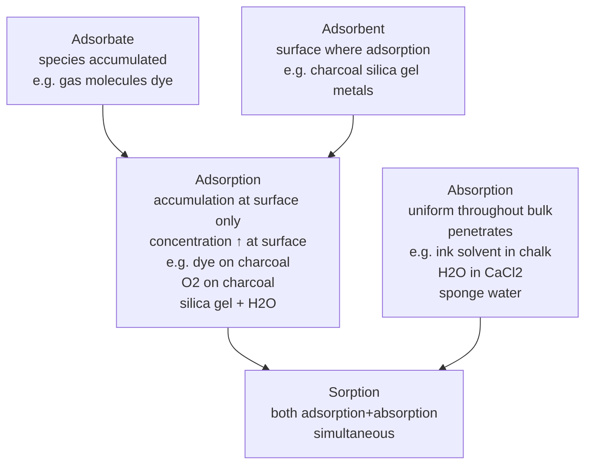
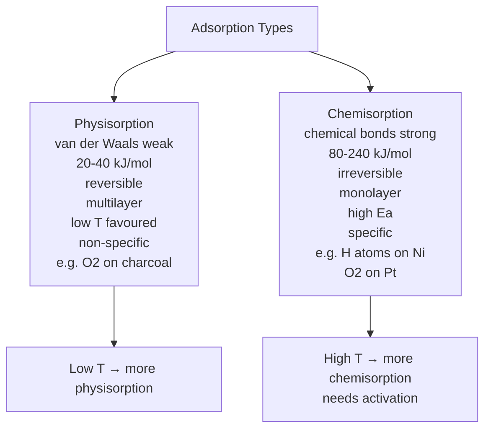
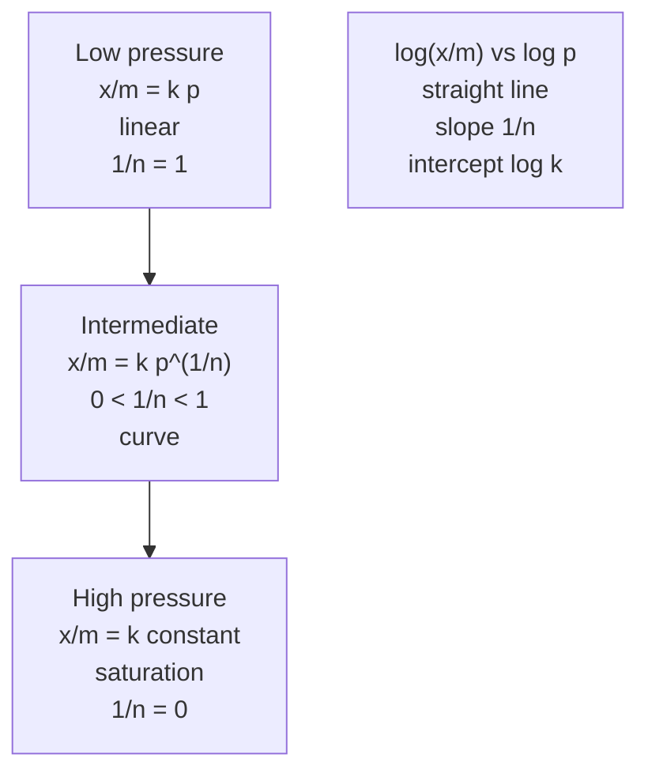
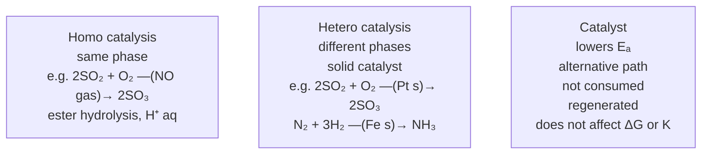
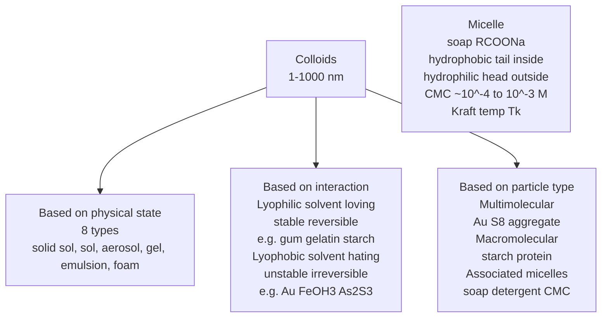
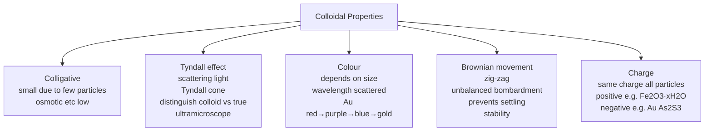
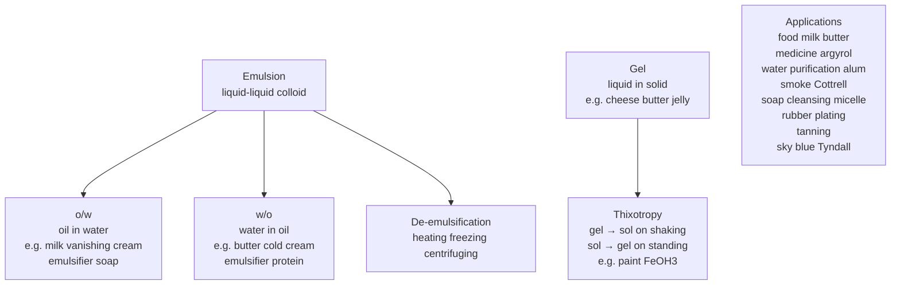

# Surface Chemistry — JEE Advanced Notes

> **Sources merged into these notes**
> | Source | File |
> |---|---|
> | NCERT Class XII Chemistry legacy 2018-19, Unit 5 (Surface Chemistry) | [`lech105-legacy.pdf`](lech105-legacy.pdf) |
> | Allen module for this chapter | _not uploaded yet — drop it in this folder to enable 🅰 tags_ |
>
> NCERT legacy Unit 5 (5.1–5.7) = Surface/interface phenomena + adsorption vs absorption + mechanism + heat of adsorption + physisorption vs chemisorption + factors affecting adsorption + Freundlich isotherm + adsorption from solutions + catalysis homogeneous/heterogeneous + shape-selective + enzyme catalysis + colloids types classification preparation purification properties Tyndall Brownian charge coagulation + emulsions + gels + applications. This notes.md is **complete basics-to-Advanced**: NCERT points with § numbers, JEE Advanced extensions marked 🆇, ⚠ = traps. Proper Obsidian plugin usage: Mermaid flowcharts for adsorption types, isotherms, catalysis, colloids classification, preparation, properties.

## Contents

- [Part A — Adsorption — Fundamentals and Types](#part-a--adsorption--fundamentals-and-types)
  1. [Interface and surface phenomena — significance (5.1)](#1-interface-and-surface-phenomena--significance-51)
  2. [Adsorption vs absorption vs sorption — adsorbate vs adsorbent (5.1.1)](#2-adsorption-vs-absorption-vs-sorption--adsorbate-vs-adsorbent-511)
  3. [Mechanism of adsorption — residual forces and heat of adsorption (5.1.2)](#3-mechanism-of-adsorption--residual-forces-and-heat-of-adsorption-512)
  4. [Types of adsorption — physisorption vs chemisorption (5.1.3)](#4-types-of-adsorption--physisorption-vs-chemisorption-513)
  5. [Factors affecting adsorption of gases on solids (5.1.4)](#5-factors-affecting-adsorption-of-gases-on-solids-514)
- [Part B — Adsorption Isotherms and from Solutions](#part-b--adsorption-isotherms-and-from-solutions)
  6. [Freundlich adsorption isotherm $x/m = k p^{1/n}$ (5.1.5)](#6-freundlich-adsorption-isotherm-xm--k-p1n-515)
  7. [Langmuir adsorption isotherm 🆇 — $θ = Kp/(1+Kp)$](#7-langmuir-adsorption-isotherm---θ--kp1kp)
  8. [Adsorption from solutions — Freundlich for solutions (5.1.6)](#8-adsorption-from-solutions--freundlich-for-solutions-516)
- [Part C — Catalysis](#part-c--catalysis)
  9. [Catalysis — homogeneous vs heterogeneous (5.2)](#9-catalysis--homogeneous-vs-heterogeneous-52)
  10. [Characteristics and mechanism of heterogeneous catalysis (5.2)](#10-characteristics-and-mechanism-of-heterogeneous-catalysis-52)
  11. [Shape-selective catalysis by zeolites (5.2)](#11-shape-selective-catalysis-by-zeolites-52)
  12. [Enzyme catalysis — characteristics and mechanism (5.2)](#12-enzyme-catalysis--characteristics-and-mechanism-52)
- [Part D — Colloids, Emulsions and Gels](#part-d--colloids-emulsions-and-gels)
  13. [Colloidal state — true solution vs colloid vs suspension (5.3)](#13-colloidal-state--true-solution-vs-colloid-vs-suspension-53)
  14. [Classification of colloids — based on physical state, nature of interaction, type of particles (5.4.1)](#14-classification-of-colloids--based-on-physical-state-nature-of-interaction-type-of-particles-541)
  15. [Preparation of colloids — chemical, Bredig arc, peptization (5.4.4)](#15-preparation-of-colloids--chemical-bredig-arc-peptization-544)
  16. [Purification of colloids — dialysis, electrodialysis, ultrafiltration (5.4.5)](#16-purification-of-colloids--dialysis-electrodialysis-ultrafiltration-545)
  17. [Properties of colloidal solutions — colligative, Tyndall, colour, Brownian, charge (5.4.6)](#17-properties-of-colloidal-solutions--colligative-tyndall-colour-brownian-charge-546)
  18. [Electrophoresis, electroosmosis, coagulation — Hardy-Schulze rule (5.4.6)](#18-electrophoresis-electroosmosis-coagulation--hardy-schulze-rule-546)
  19. [Emulsions — types o/w and w/o, emulsifiers, de-emulsification (5.5)](#19-emulsions--types-ow-and-wo-emulsifiers-de-emulsification-55)
  20. [Gels and applications of colloids (5.6–5.7)](#20-gels-and-applications-of-colloids-5657)
- [Part E — Advanced Corner, Patterns and Revision](#part-e--advanced-corner-patterns-and-revision)
  21. [Master formula bank (print this)](#21-master-formula-bank-print-this)
  22. [Worked problem patterns — JEE Advanced favourites](#22-worked-problem-patterns--jee-advanced-favourites)
  23. [The 20 traps examiners use](#23-the-20-traps-examiners-use)
  24. [Quick Revision Sheet](#24-quick-revision-sheet)

---

# Part A — Adsorption — Fundamentals and Types

## 1. Interface and surface phenomena — significance (5.1)

Surface chemistry = deals with phenomena at surfaces or interfaces. Interface represented by hyphen or slash e.g., solid-gas or solid/gas. No interface between gases due to complete miscibility. Bulk phases may be pure compounds or solutions. Interface normally few molecules thick but area depends on size of particles of bulk phases.

Many important phenomena occur at interfaces: corrosion, electrode processes, heterogeneous catalysis, dissolution, crystallisation, etc. Applications in industry, analytical work, daily life.

To study surface meticulously need really clean surface. Under very high vacuum $10^{-8}$ to $10^{-9}$ pascal ultra clean surfaces of metals possible. Solid materials with such clean surfaces need to be stored in vacuum otherwise covered by $\ce{O2}$ and $\ce{N2}$ from air.

Important chemicals produced industrially via reactions on surfaces of solid catalysts.

## 2. Adsorption vs absorption vs sorption — adsorbate vs adsorbent (5.1.1)

**Adsorption**: Accumulation of molecular species at surface rather than in bulk of solid or liquid. Substance concentrated only at surface, does not penetrate to bulk.

**Adsorbate**: Molecular species or substance which concentrates or accumulates at surface.

**Adsorbent**: Material on surface of which adsorption takes place.

Solids particularly finely divided state have large surface area → charcoal, silica gel, alumina gel, clay, colloids, metals finely divided act as good adsorbents.

Examples in action:

- Gas $\ce{O2 H2 CO Cl2 NH3 SO2}$ in closed vessel with powdered charcoal → pressure decreases, gas molecules concentrate at surface of charcoal.
- Solution organic dye methylene blue + animal charcoal shaken → filtrate turns colourless, dye accumulates on charcoal.
- Aqueous raw sugar passed over animal charcoal beds → colourless as colouring substances adsorbed.
- Air becomes dry in presence of silica gel because water molecules adsorbed.

**Desorption**: Process of removing adsorbed substance from surface.

**Absorption**: Substance uniformly distributed throughout bulk of solid, penetrates. Example: Chalk stick dipped in ink surface retains colour due to adsorption of coloured molecules while solvent goes deeper due to absorption, on breaking chalk white inside. Water vapours absorbed by anhydrous $\ce{CaCl2}$ but adsorbed by silica gel.

**Sorption**: Both adsorption and absorption simultaneously.

*Adsorption stops at the surface, absorption goes all the way through, and sorption means both at once.*

## 3. Mechanism of adsorption — residual forces and heat of adsorption (5.1.2)

Adsorption arises because surface particles of adsorbent not in same environment as inside bulk. Inside all forces mutually balanced, on surface particles not surrounded by atoms/molecules of their kind on all sides, possess unbalanced residual attractive forces. These forces responsible for attracting adsorbate particles.

Extent of adsorption increases with increase of surface area per unit mass at given $T,p$.

Heat of adsorption: During adsorption decrease in residual forces → decrease in surface energy appears as heat. Adsorption invariably exothermic, $ΔH$ negative.

When gas adsorbed freedom of movement restricted → entropy decreases $ΔS$ negative.

For spontaneous process at constant $T,p$, $ΔG$ negative, $ΔG = ΔH - TΔS$, $ΔH$ negative high magnitude makes $ΔG$ negative as $-TΔS$ positive. As adsorption proceeds $ΔH$ becomes less negative ultimately $ΔH = TΔS$ and $ΔG=0$ equilibrium attained.

## 4. Types of adsorption — physisorption vs chemisorption (5.1.3)

If accumulation due to weak van der Waals forces → **physical adsorption or physisorption**. If gas molecules held by chemical bonds covalent or ionic → **chemical adsorption or chemisorption**. Chemisorption involves high activation energy often referred as activated adsorption. Sometimes both occur simultaneously, physical at low T may pass into chemisorption as T increased. Example: $\ce{H2}$ on Ni first adsorbed by van der Waals, then dissociates to H atoms held by chemisorption.

| Feature | Physisorption | Chemisorption |
|---|---|---|
| Forces | Weak van der Waals | Strong chemical bonds covalent/ionic |
| Specificity | Lack of specificity, any gas on any surface, universal forces | Specific, only some gas on some surface |
| Nature of adsorbate | Easily liquefiable gases with higher critical T readily adsorbed, van der Waals stronger near critical T, e.g., 1g charcoal adsorbs more $\ce{SO2}$ (Tc 630K) than $\ce{CH4}$ (190K) than $\ce{H2}$ 4.5mL (33K) | Gases which can form chemical bonds |
| Reversible | Generally reversible, $Solid+Gas ⇌ Gas/Solid + Heat$, more gas adsorbed when pressure increased (Le Chatelier volume decreases), removed by decreasing pressure, exothermic so occurs readily at low T decreases with increasing T | Generally irreversible, not easily reversed |
| Surface area | Extent increases with surface area finely divided porous good adsorbents | Also increases with surface area |
| Enthalpy | Low 20-40 $kJ mol^{-1}$ weak forces | High 80-240 $kJ mol^{-1}$ strong bonds |
| Activation energy | Low, no activation | High activation often |
| Layers | Multilayer | Monolayer |
| Temperature | Low T favoured, decreases with T increase | High T initially increases then decreases, needs activation |

*Physisorption is weak, reversible and multilayer; chemisorption is strong, irreversible and monolayer.*

## 5. Factors affecting adsorption of gases on solids (5.1.4)

- **Nature of gas**: Easily liquefiable gases with high critical temperature Tc readily adsorbed because van der Waals forces stronger near Tc. $\ce{SO2}$ Tc 630K more adsorbed than $\ce{CH4}$ 190K than $\ce{H2}$ 33K.
- **Nature of adsorbent**: Porous finely divided large surface area good adsorbents charcoal silica gel alumina.
- **Surface area of adsorbent**: Extent increases with surface area, finely divided metals porous substances good.
- **Temperature**: Physisorption exothermic, favoured low T, decreases with T increase (Le Chatelier). Chemisorption initially increases with T due to activation then decreases.
- **Pressure**: At constant T, extent increases with pressure, more gas adsorbed when pressure increased volume decreases Le Chatelier.
- **Activation energy**: Chemisorption needs high activation.

---

# Part B — Adsorption Isotherms and from Solutions

## 6. Freundlich adsorption isotherm $x/m = k p^{1/n}$ (5.1.5)

At constant T, extent of adsorption $x/m$ (mass of adsorbate $x$ adsorbed per mass of adsorbent $m$) varies with pressure.

Freundlich 1909 empirical: $x/m = k p^{1/n}$ where $k,n$ constants $n>1$, $k$ depends on nature of adsorbate and adsorbent and T.

At low pressure $1/n=1$ → $x/m = k p$ linear. At high pressure $1/n=0$ → $x/m = k$ constant independent of p saturation. At intermediate $1/n$ between 0 and 1.

Taking log: $log(x/m) = log k + (1/n) log p$, plot $log(x/m)$ vs $log p$ straight line slope $1/n$ intercept $log k$.

For solutions: $x/m = k C^{1/n}$ where $C$ concentration, $log(x/m)=logk+1/n logC$.

Limitations: Fails at high pressure, no saturation limit theoretically but experimentally saturation observed.

*Freundlich's isotherm: linear at low pressure, saturating at high, and a straight line on a log–log plot.*

## 7. Langmuir adsorption isotherm 🆇 — $θ = Kp/(1+Kp)$

Irving Langmuir 1916 theoretical based on kinetic model:

Assumptions:

- Adsorption monolayer only.
- Surface has fixed number of sites, each site holds one molecule.
- All sites equivalent, no interaction between adsorbed molecules.
- Dynamic equilibrium: rate adsorption = rate desorption.

Derivation: Let $θ$ = fraction of surface covered, $1-θ$ = fraction vacant, $p$ = pressure.

Rate adsorption ∝ $p(1-θ)$, rate desorption ∝ $θ$, at equilibrium $k_a p(1-θ)=k_d θ$ → $θ = Kp/(1+Kp)$ where $K=k_a/k_d$ equilibrium constant.

$x/m = (x/m)_{max} × Kp/(1+Kp)$, $(x/m)_{max}$ monolayer capacity.

At low $p$, $Kp<<1$ → $θ≈Kp$ → $x/m∝p$ (like Freundlich with $1/n=1$). At high $p$, $Kp>>1$ → $θ≈1$ saturation.

Linear forms: $p/(x/m) = 1/(kK) + p/k$ or $1/(x/m)=1/k + 1/(kK p)$.

Langmuir explains chemisorption monolayer, better than Freundlich at high p.

For JEE Advanced: Langmuir used for heterogeneous catalysis rate laws.

## 8. Adsorption from solutions — Freundlich for solutions (5.1.6)

Solids can adsorb solutes from solutions, e.g., charcoal adsorbs dye methylene blue, acetic acid from aqueous solution, etc.

Freundlich isotherm for solutions: $x/m = k C^{1/n}$ where $C$ equilibrium concentration of solute in solution, $k,n$ constants.

Plot $log(x/m)$ vs $log C$ straight line.

Factors:

- Nature of adsorbate and adsorbent.
- Surface area adsorbent.
- Temperature: adsorption from solution usually decreases with T increase (exothermic).
- Concentration: $x/m$ increases with $C$.

Applications: Removal of colouring matter from sugar juice using animal charcoal, decolourisation, chromatography (adsorption), etc.

---

# Part C — Catalysis

## 9. Catalysis — homogeneous vs heterogeneous (5.2)

Catalyst = substance that increases rate without being consumed, provides alternative pathway lower $E_a$, regenerated.

**Homogeneous catalysis**: Reactants and catalyst same phase, e.g., $\ce{2SO2(g) + O2(g) ->[NO(g)] 2SO3(g)}$ lead chamber process $\ce{NO}$ gas catalyst, $\ce{CH3COOCH3 + H2O ->[H+ (aq)] CH3COOH + CH3OH}$ acid hydrolysis liquid phase.

**Heterogeneous catalysis**: Reactants and catalyst different phases, usually solid catalyst, reactants gases/liquids. Example: $\ce{2SO2(g) + O2(g) ->[Pt(s)] 2SO3(g)}$ contact process Pt solid, $\ce{N2(g) + 3H2(g) ->[Fe(s)] 2NH3(g)}$ Haber Fe solid, $\ce{4NH3(g) + 5O2(g) ->[Pt(s)] 4NO(g) + 6H2O(g)}$ Ostwald.

*Homogeneous versus heterogeneous catalysis — the phase is the only difference; neither changes ΔG or K.*

## 10. Characteristics and mechanism of heterogeneous catalysis (5.2)

Characteristics:

- Catalyst remains unchanged in mass and chemical composition at end, but physical state may change.
- Small amount sufficient.
- Catalyst does not start reaction, only accelerates.
- Catalyst does not affect equilibrium position $K$, $ΔG$, $ΔH$, only rate, affects both forward and reverse equally, equilibrium reached faster.
- Specific: particular catalyst for particular reaction.

Mechanism of heterogeneous catalysis (5 steps):

1. Diffusion of reactants to surface of catalyst.
2. Adsorption of reactant molecules on surface.
3. Chemical reaction on surface via intermediate formation.
4. Desorption of product molecules from surface.
5. Diffusion of products away from surface.

Example: $\ce{H2 + C2H4 ->[Ni] C2H6}$: $\ce{H2}$ adsorbs on Ni dissociates to H atoms chemisorbed, $\ce{C2H4}$ adsorbs, H atoms add to $\ce{C2H4}$ to form $\ce{C2H6}$ desorbs.

Rate law for heterogeneous catalysis often Langmuir-Hinshelwood: Rate ∝ $θ_A θ_B$ where $θ$ coverages.

## 11. Shape-selective catalysis by zeolites (5.2)

Zeolites = microporous aluminosilicates with 3D network of $\ce{SiO4}$ and $\ce{AlO4}$ tetrahedra, with pores and cavities of molecular dimensions 260-740 pm.

Shape-selective catalysis: Reaction selectivity depends on pore size and shape, only molecules with size less than pore can enter, react, products exit.

Example: ZSM-5 zeolite used in petrochemical: converts alcohols to gasoline, pores ~550 pm, allows only certain hydrocarbons.

Zeolites used as catalysts in cracking, isomerisation.

## 12. Enzyme catalysis — characteristics and mechanism (5.2)

Enzymes = biological catalysts proteins, highly specific, work at optimum T 298-310 K and pH 5-7.

Characteristics:

- Highly specific one enzyme for one reaction.
- Highly active small amount.
- Optimum T and pH.
- Increasing activity with T up to optimum then decreases due to denaturation.
- Activity increased by co-enzymes.
- Inhibited by poisons.

Mechanism lock and key: Enzyme E has active site, substrate S binds to active site forming ES complex, then forms products and enzyme regenerated.

$E + S ⇌ ES → E + P$

Example: Invertase converts cane sugar to glucose+fructose, zymase glucose to ethanol, diastase starch to maltose, urease urea to $\ce{NH3 + CO2}$.

Michaelis-Menten kinetics 🆇: Rate = $k_2 [E]_0 [S] / (K_M + [S])$, $K_M$ Michaelis constant.

---

# Part D — Colloids, Emulsions and Gels

## 13. Colloidal state — true solution vs colloid vs suspension (5.3)

Based on particle size:

- **True solution**: Particle size <1 nm ($10^{-9} m$), homogeneous, cannot be seen by ultramicroscope, passes through filter paper and semipermeable membrane, e.g., NaCl in water, sugar solution.
- **Colloidal solution**: Particle size 1-1000 nm ($10^{-9}$ to $10^{-6} m$), heterogeneous but appears homogeneous, visible by ultramicroscope Tyndall effect, passes through filter paper but not semipermeable membrane, e.g., milk, blood, gold sol.
- **Suspension**: Particle size >1000 nm (> $10^{-6} m$), heterogeneous visible, does not pass filter paper, settles, e.g., sand in water, chalk in water.

Colloids are intermediate.

## 14. Classification of colloids — based on physical state, nature of interaction, type of particles (5.4.1)

**A) Based on physical state of dispersed phase and dispersion medium**:

8 types (gas-gas no interface):

| Dispersed phase | Dispersion medium | Type | Example |
|---|---|---|---|
| Solid | Solid | Solid sol | Coloured glasses, gem stones |
| Solid | Liquid | Sol | Paints, gold sol, $\ce{Fe(OH)3}$ sol |
| Solid | Gas | Aerosol / smoke | Smoke, dust |
| Liquid | Solid | Gel | Cheese, butter, jellies |
| Liquid | Liquid | Emulsion | Milk, hair cream |
| Liquid | Gas | Aerosol | Fog, mist, cloud |
| Gas | Solid | Solid sol / foam? Actually gas in solid | Pumice stone, foam rubber |
| Gas | Liquid | Foam | Froth, whipped cream, soap lather |

**B) Based on nature of interaction between dispersed phase and dispersion medium**:

- **Lyophilic (solvent loving)**: Strong interaction dispersed phase + dispersion medium, stable, reversible (can be reconstituted by adding solvent), e.g., gum, gelatin, starch, rubber sols in water. Water as medium called hydrophilic.
- **Lyophobic (solvent hating)**: Weak interaction, unstable, irreversible (cannot be reconstituted), need stabilising, e.g., metals Au Ag, $\ce{Fe(OH)3}$, $\ce{As2S3}$ sols. Water as medium called hydrophobic.

**C) Based on type of particles of dispersed phase**:

- **Multimolecular colloids**: Large number of atoms/molecules aggregate to form colloidal size, e.g., gold sol Au atoms aggregate, sulphur sol $S_8$ molecules aggregate, held by van der Waals.
- **Macromolecular colloids**: Macromolecules themselves size colloidal, e.g., starch, cellulose, proteins, enzymes, nylon, etc.
- **Associated colloids / micelles**: Substances which at low concentration behave as normal strong electrolytes but at higher concentration aggregate to form colloidal size micelles, e.g., soaps and detergents.

Micelles: Soap $\ce{RCOONa}$ e.g., sodium stearate $\ce{C17H35COONa}$ has long hydrophobic hydrocarbon tail and hydrophilic polar head $\ce{COO-}$. At low concentration arranges on surface, at critical micelle concentration CMC ~$10^{-4}$ to $10^{-3} M$ forms aggregates with hydrophobic tails inside and hydrophilic heads outside ionic micelle.

CMC: concentration above which micelle formation starts, e.g., soap CMC ~$10^{-3} M$.

Kraft temperature $T_k$: Temperature above which micelles form.

*Colloids classified three ways: by the state of the two phases, by solvent affinity, and by particle size.*

## 15. Preparation of colloids — chemical, Bredig arc, peptization (5.4.4)

Methods: Condensation (small → colloidal) and dispersion (large → colloidal).

**a) Chemical methods** (condensation):

- Double decomposition: $\ce{As2O3 + 3H2S -> As2S3(sol) + 3H2O}$
- Oxidation: $\ce{SO2 + 2H2S -> 3S(sol) + 2H2O}$
- Reduction: $\ce{2AuCl3 + 3HCHO + 3H2O -> 2Au(sol) + 3HCOOH + 6HCl}$
- Hydrolysis: $\ce{FeCl3 + 3H2O -> Fe(OH)3(sol) + 3HCl}$

**b) Electrical disintegration or Bredig's Arc method** (dispersion + condensation): Colloidal sols of metals Au Ag Pt prepared, electric arc struck between metal electrodes immersed in dispersion medium, intense heat vapourises metal which condenses to colloidal size.

**c) Peptization**: Converting precipitate into colloidal sol by shaking with dispersion medium in presence of small amount of electrolyte peptizing agent. Precipitate adsorbs one ion of electrolyte develops charge breaks into colloidal size.

Example: Freshly prepared $\ce{Fe(OH)3}$ precipitate + small $\ce{FeCl3}$ → $\ce{Fe(OH)3}$ sol (adsorbs $\ce{Fe^{3+}}$ positive charge).

## 16. Purification of colloids — dialysis, electrodialysis, ultrafiltration (5.4.5)

Colloidal solutions prepared generally contain excessive electrolytes and soluble impurities, traces essential for stability but larger quantities coagulate, need to reduce impurities to minimum → purification.

**i) Dialysis**: Removing dissolved substance from colloidal solution by diffusion through suitable membrane. True solution ions/molecules pass through animal membrane bladder parchment paper cellophane sheet but not colloidal particles, membrane used for dialysis, apparatus dialyser, bag of suitable membrane containing colloidal solution suspended in vessel fresh water continuously flowing, molecules and ions diffuse out, pure colloidal left.

**ii) Electrodialysis**: Dialysis faster by applying electric field if dissolved impurity only electrolyte, colloidal solution in bag membrane pure water outside electrodes fitted, ions migrate to oppositely charged electrodes.

**iii) Ultrafiltration**: Separating colloidal particles from solvent and soluble solutes by specially prepared filters permeable to all except colloidal particles, ordinary filter paper pores too large colloidal passes, pores reduced by impregnating with collodion solution 4% nitrocellulose in alcohol+ether hardening by formaldehyde drying → ultra-filter paper, colloidal particles separated, then stirred with fresh dispersion medium to get pure sol, slow process speed up by pressure/suction.

## 17. Properties of colloidal solutions — colligative, Tyndall, colour, Brownian, charge (5.4.6)

**i) Colligative properties**: Colloidal particles bigger aggregates number of particles small compared to true solution at same concentration, values of colligative osmotic pressure lowering vapour pressure depression freezing point elevation boiling point small order compared to true solutions.

**ii) Tyndall effect**: If homogeneous true solution in dark observed in direction of light appears clear, observed at right angles appears dark. Colloidal solutions appear clear by transmitted light but show mild to strong opalescence when viewed at right angles to passage of light, path of beam illuminated by bluish light, bright cone called Tyndall cone, due to scattering of light by colloidal particles in all directions.

Tyndall observed during projection picture in cinema hall due to dust smoke. Conditions: diameter dispersed particles not much smaller than wavelength of light used, refractive indices dispersed phase and dispersion medium differ greatly.

Used to distinguish colloid vs true solution. Zsigmondy 1903 ultramicroscope uses Tyndall effect intense beam focused on colloidal solution observed with microscope at right angles, individual particles appear as bright stars against dark background, does not render actual particles visible only scattered light, no info size shape.

**iii) Colour**: Colour of colloidal solution depends on wavelength of light scattered by dispersed particles, wavelength depends on size and nature, also manner observer receives light. Example: Milk+water appears blue by reflected light red by transmitted, finest gold sol red as size increases purple then blue finally golden.

**iv) Brownian movement**: Colloidal solutions viewed under ultramicroscope particles in continuous zig-zag motion all over field, first observed by Robert Brown botanist, motion independent of nature of colloid but depends on size and viscosity smaller size lesser viscosity faster motion, due to unbalanced bombardment by molecules of dispersion medium, stirring effect prevents settling responsible for stability of sols.

**v) Charge on colloidal particles**: Colloidal particles always carry electric charge same on all particles in given sol may be positive or negative.

Positively charged sols: Hydrated metallic oxides $\ce{Al2O3·xH2O Cr2O3·xH2O Fe2O3·xH2O}$, basic dye stuffs methylene blue, haemoglobin blood, $\ce{TiO2}$ sol.

Negatively charged sols: Metals Cu Ag Au sols, metallic sulphides $\ce{As2S3 Sb2S3 CdS}$, acid dye eosin Congo red, starch gum gelatin clay charcoal etc.

Charge due to preferential adsorption of ions from solution or electron capture.

*The properties that identify a colloid: Tyndall scattering, the colour of gold sols, Brownian movement and the charge on the particles.*

## 18. Electrophoresis, electroosmosis, coagulation — Hardy-Schulze rule (5.4.6)

**Electrophoresis**: Movement of colloidal particles towards oppositely charged electrode under electric field, due to charge on particles. If particles move to cathode → negatively charged sol, to anode → positively charged.

**Electroosmosis**: Movement of dispersion medium under electric field when dispersed phase not allowed to move, opposite of electrophoresis. E.g., sol in U-tube with semipermeable membranes, particles cannot move, medium moves.

**Coagulation / precipitation**: Process of settling of colloidal particles, conversion of colloid to suspension.

Caused by:

- Boiling.
- Persistent dialysis (removes electrolyte stabilising).
- Mixing two oppositely charged sols (e.g., $\ce{Fe(OH)3}$ positive + $\ce{As2S3}$ negative → coagulation).
- Addition of electrolytes: Colloidal particles charged, electrolyte provides oppositely charged ions which neutralise charge → coagulation. Ion with opposite charge to sol effective.

**Hardy-Schulze rule**: Coagulating power of electrolyte depends on charge of ion opposite to sol charge, higher charge greater coagulating power.

For negative sol (e.g., $\ce{As2S3}$), coagulating power of cations: $\ce{Al^{3+} > Ba^{2+} > Na+}$.

For positive sol (e.g., $\ce{Fe(OH)3}$), coagulating power of anions: $\ce{[Fe(CN)6]^{4-} > PO4^{3-} > SO4^{2-} > Cl-}$.

Coagulation value = minimum concentration of electrolyte $mmol/L$ required to cause coagulation.

Protective colloids: Lyophilic sols protect lyophobic sols from coagulation, e.g., gelatin protects gold sol, gold number = mg of protective colloid required to prevent coagulation of 10 mL gold sol by 1 mL 10% NaCl.

## 19. Emulsions — types o/w and w/o, emulsifiers, de-emulsification (5.5)

Emulsion = colloidal system liquid dispersed phase in liquid dispersion medium, both liquids immiscible.

Types:

- **Oil in water o/w**: Oil dispersed in water, e.g., milk (fat in water), vanishing cream.
- **Water in oil w/o**: Water dispersed in oil, e.g., butter (water in fat), cold cream.

Emulsifier / emulsifying agent = substance that stabilises emulsion, reduces surface tension between oil and water, forms protective film around dispersed droplets, e.g., soaps, detergents, proteins, gums.

- Soaps stabilise o/w emulsion.
- Proteins, heavy metal salts of fatty acids, long chain alcohols stabilise w/o.

**De-emulsification**: Breaking emulsion into constituent liquids by heating, freezing, centrifuging, adding de-emulsifiers.

Applications: Milk, digestion of fats in intestine via bile (emulsifier), concentration of ores via froth flotation (oil emulsion), etc.

## 20. Gels and applications of colloids (5.6–5.7)

**Gels**: Colloidal system liquid in solid, e.g., cheese, butter, jellies, shoe polish, curd. Gels may be formed by cooling lyophilic sols, e.g., gelatin, agar. Some gels liquid on shaking become sol then again gel on standing → thixotropy (e.g., $\ce{Fe(OH)3}$ gel, paint), some sols become gel on standing → syneresis? Actually gel formation.

**Applications of colloids**:

- **Food**: Milk, butter, cheese, ice cream colloids.
- **Medicines**: Argyrol (silver sol) eye lotion, colloidal gold, $\ce{Ca}$ and $\ce{Au}$ injections, etc., colloidal medicines more effective due to large surface area easily assimilated.
- **Purification of water**: Alum coagulates mud particles.
- **Smoke precipitation**: Cottrell smoke precipitator coagulates smoke particles via electric field, removes carbon.
- **Sewage disposal**: Colloidal sewage coagulated by electrolytes.
- **Cleansing action of soap**: Soap forms micelles emulsifies oil.
- **Rubber plating**: Rubber latex negatively charged, article made anode, rubber deposited on anode.
- **Tanning**: Hides positively charged, tannin negatively charged colloid, coagulation hardens leather.
- **Photography**: $\ce{AgBr}$ in gelatin.
- **Blue colour of sky**: Tyndall effect due to dust colloidal particles scattering blue light.

*Emulsions and gels, and the thixotropy that makes toothpaste and ketchup behave as they do.*

---

# Part E — Advanced Corner, Patterns and Revision

## 21. Master formula bank (print this)

**Adsorption**:

- Adsorption = accumulation at surface, adsorbate = species accumulated, adsorbent = surface, absorption = uniform throughout bulk, sorption = both.
- Mechanism: residual forces unbalanced at surface, $ΔH$ negative exothermic, $ΔS$ negative restricted movement, $ΔG=ΔH-TΔS$ negative spontaneous, equilibrium when $ΔH=TΔS$.
- Physisorption van der Waals 20-40 $kJ/mol$ reversible multilayer low T non-specific easily liquefiable gases high Tc more adsorbed, chemisorption chemical bonds 80-240 $kJ/mol$ irreversible monolayer high Ea specific.
- Factors: nature of gas easily liquefiable high Tc more adsorbed, nature of adsorbent porous large area, surface area ↑ adsorption ↑, T↑ physisorption ↓ chemisorption ↑ initially then ↓, pressure ↑ adsorption ↑.

**Isotherms**:

- Freundlich: $x/m = k p^{1/n}$ $0<1/n<1$, $log(x/m)=logk+1/n logp$ straight line slope $1/n$ intercept $logk$, low $p$ $1/n=1$ $x/m=kp$ linear, high $p$ $1/n=0$ $x/m=k$ saturation, for solutions $x/m=kC^{1/n}$.
- Langmuir: $θ=Kp/(1+Kp)$ $θ$ fraction covered, $x/m=(x/m)_{max}Kp/(1+Kp)$, low $p$ $θ≈Kp$ $x/m∝p$, high $p$ $θ≈1$ saturation monolayer, linear $p/(x/m)=1/(kK)+p/k$.

**Catalysis**:

- Catalyst increases rate not consumed provides alternative path lower $E_a$, regenerated, small amount sufficient, does not start reaction only accelerates, does not affect $K$, $ΔG$, $ΔH$, only rate, affects both forward reverse equally equilibrium faster, specific.
- Homogeneous same phase e.g., $\ce{2SO2+O2->[NO(g)]2SO3}$ $\ce{CH3COOCH3+H2O->[H+ aq]}$, heterogeneous different phases solid catalyst e.g., $\ce{2SO2+O2->[Pt(s)]2SO3}$ $\ce{N2+3H2->[Fe(s)]2NH3}$ $\ce{4NH3+5O2->[Pt(s)]4NO+6H2O}$.
- Mechanism heterogeneous 5 steps: diffusion reactants to surface, adsorption, reaction via intermediate, desorption products, diffusion away, Langmuir-Hinshelwood Rate∝$θ_Aθ_B$.
- Shape-selective zeolites microporous aluminosilicates $\ce{SiO4 AlO4}$ pores 260-740 pm ZSM-5 550 pm only molecules size< pore can enter react products exit e.g., alcohols→gasoline cracking isomerisation.
- Enzyme biological catalysts proteins highly specific optimum T 298-310K pH 5-7, lock and key $E+S⇌ES→E+P$, examples invertase cane sugar→glucose+fructose zymase glucose→ethanol diastase starch→maltose urease urea→$\ce{NH3+CO2}$, Michaelis-Menten $Rate=k_2[E]_0[S]/(K_M+[S])$.

**Colloids**:

- Size: true <1nm homogeneous, colloidal 1-1000nm heterogeneous but appears homogeneous Tyndall, suspension >1000nm heterogeneous settles.
- Classification physical state 8 types solid sol coloured glasses, sol paints gold sol, aerosol smoke dust, gel cheese butter, emulsion milk, aerosol fog mist, solid sol pumice foam rubber, foam froth whipped cream.
- Interaction lyophilic solvent loving strong interaction stable reversible e.g., gum gelatin starch, lyophobic solvent hating weak interaction unstable irreversible e.g., metals Au Ag $\ce{Fe(OH)3 As2S3}$.
- Particle type multimolecular Au $S_8$ aggregate van der Waals, macromolecular starch cellulose proteins enzymes, associated micelles soap detergent CMC $10^{-4}-10^{-3}M$ hydrophobic tail inside hydrophilic head outside Kraft temp $T_k$.
- Preparation chemical double decomposition $\ce{As2O3+3H2S->As2S3(sol)+3H2O}$ oxidation $\ce{SO2+2H2S->3S+2H2O}$ reduction $\ce{2AuCl3+3HCHO+3H2O->2Au+3HCOOH+6HCl}$ hydrolysis $\ce{FeCl3+3H2O->Fe(OH)3+3HCl}$, Bredig arc dispersion+condensation electric arc metal electrodes vapourises condenses colloidal, peptization precipitate→sol by electrolyte peptizing agent adsorbs ion charge breaks $\ce{Fe(OH)3}$ + $\ce{FeCl3}$ → sol.
- Purification dialysis removing dissolved via diffusion through membrane animal bladder parchment cellophane true ions pass colloidal not dialyser bag in flowing water, electrodialysis faster electric field ions migrate to opposite electrodes, ultrafiltration separating colloidal via ultra-filter paper collodion 4% nitrocellulose alcohol+ether hardening formaldehyde colloidal left stirred with solvent.
- Properties colligative small due to few particles, Tyndall scattering light Tyndall cone distinguish colloid vs true ultramicroscope Zsigmondy 1903 bright stars, colour depends on size wavelength scattered Au red→purple→blue→gold milk+water blue reflected red transmitted, Brownian zig-zag unbalanced bombardment by dispersion medium prevents settling stability, charge same on all particles in sol positive $\ce{Al2O3·xH2O Fe2O3·xH2O}$ methylene blue haemoglobin $\ce{TiO2}$ negative Cu Ag Au $\ce{As2S3 Sb2S3 CdS}$ eosin Congo red starch gum gelatin clay charcoal, due to preferential adsorption.
- Electrophoresis movement colloidal particles to opposite electrode under electric field, electroosmosis movement dispersion medium when dispersed phase not allowed, coagulation settling conversion colloid→suspension by boiling persistent dialysis mixing oppositely charged sols $\ce{Fe(OH)3}$+$\ce{As2S3}$, addition electrolytes opposite charge effective, Hardy-Schulze rule coagulating power depends on charge opposite to sol higher charge greater power negative sol $\ce{Al^{3+}>Ba^{2+}>Na+}$ positive sol $\ce{[Fe(CN)6]^{4-}>PO4^{3-}>SO4^{2-}>Cl-}$, coagulation value minimum conc $mmol/L$ to cause coagulation, protective colloids lyophilic protect lyophobic e.g., gelatin protects gold sol gold number mg protective colloid to prevent coagulation 10mL gold sol by 1mL 10% NaCl.

**Emulsions**:

- Liquid-liquid colloid, o/w oil in water milk vanishing cream emulsifier soap, w/o water in oil butter cold cream emulsifier protein heavy metal salts fatty acids long chain alcohols, de-emulsification breaking into liquids heating freezing centrifuging de-emulsifiers.

**Gels**:

- Liquid in solid cheese butter jellies shoe polish curd, cooling lyophilic sols gelatin agar, thixotropy gel→sol on shaking sol→gel on standing e.g., $\ce{Fe(OH)3}$ paint.

**Applications**: Food milk butter cheese ice cream, medicines argyrol silver sol eye lotion colloidal gold, water purification alum coagulates mud, smoke Cottrell precipitator electric field, sewage electrolytes coagulate, soap cleansing micelle emulsification, rubber plating latex negative anode deposition, tanning hides positive tannin negative coagulation hardens leather, photography $\ce{AgBr}$ gelatin, sky blue Tyndall dust scattering.

## 22. Worked problem patterns — JEE Advanced favourites

**Pattern 1 — Physisorption vs chemisorption identification**:

Given $ΔH$ 25 $kJ/mol$ reversible multilayer low T → physisorption, $ΔH$ 150 $kJ/mol$ irreversible monolayer high Ea → chemisorption.

**Pattern 2 — Freundlich isotherm**:

Given $x/m=0.2$ at $p=0.1 atm$, $x/m=0.4$ at $p=0.4 atm$ → $log(x/m)=logk+1/n logp$ → $log0.2=logk+1/n log0.1$, $log0.4=logk+1/n log0.4$ subtract → $1/n=(log0.4-log0.2)/(log0.4-log0.1)=0.3010/(0.6021)=0.5$ → $n=2$.

**Pattern 3 — Langmuir**:

Given $θ=0.5$ at $p=1 atm$ → $0.5=K×1/(1+K)$ → $K=1 atm^{-1}$, at $p=2 atm$ $θ=2/3$.

**Pattern 4 — Hardy-Schulze**:

Negative sol $\ce{As2S3}$ coagulated by cations $\ce{Al^{3+}}$ most effective least coagulation value, order $\ce{Al^{3+}>Ba^{2+}>Na+}$.

Positive sol $\ce{Fe(OH)3}$ coagulated by anions $\ce{[Fe(CN)6]^{4-}}$ most effective.

**Pattern 5 — Gold number**:

Gold number gelatin 0.005 mg, albumin 0.1 mg → gelatin more protective smaller gold number.

**Pattern 6 — Micelle CMC**:

Soap CMC $10^{-3} M$, below CMC normal electrolyte, above CMC colloidal micelle, conductivity vs concentration plot break at CMC.

**Pattern 7 — Enzyme optimum**:

Enzyme activity vs T plot increases to optimum 310K then decreases due to denaturation, vs pH optimum 5-7.

**Pattern 8 — Catalysis does not affect K**:

Given $K=10$ without catalyst, with catalyst $K$ still 10, only $k_f$ and $k_b$ increase same factor.

**Pattern 9 — Tyndall vs true solution**:

True solution <1nm no Tyndall, colloidal 1-1000nm shows Tyndall cone, suspension >1000nm visible particles.

**Pattern 10 — Emulsion type**:

Milk o/w oil in water, butter w/o water in oil, vanishing cream o/w, cold cream w/o.

## 23. The 20 traps examiners use

1. Adsorption surface phenomenon concentration at surface, absorption uniform throughout bulk, sorption both.
2. Adsorbate species accumulated, adsorbent surface where adsorption.
3. Mechanism residual forces unbalanced at surface $ΔH$ negative exothermic $ΔS$ negative restricted $ΔG=ΔH-TΔS$ negative spontaneous equilibrium $ΔH=TΔS$.
4. Physisorption van der Waals 20-40 $kJ/mol$ reversible multilayer low T non-specific easily liquefiable high Tc more adsorbed, chemisorption chemical bonds 80-240 $kJ/mol$ irreversible monolayer high Ea specific.
5. Factors nature of gas easily liquefiable high Tc more adsorbed, surface area ↑ adsorption ↑, T↑ physisorption ↓, pressure ↑ adsorption ↑.
6. Freundlich $x/m=kp^{1/n}$ $0<1/n<1$ $log(x/m)=logk+1/n logp$ straight line slope $1/n$ intercept $logk$ fails high pressure no saturation.
7. Langmuir $θ=Kp/(1+Kp)$ monolayer saturation $θ=1$ high p, $θ≈Kp$ low p, assumptions fixed sites equivalent no interaction.
8. Adsorption from solutions $x/m=kC^{1/n}$ $log(x/m)=logk+1/n logC$.
9. Catalyst increases rate not consumed provides alternative path lower $E_a$ regenerated small amount does not start only accelerates does not affect $K$ $ΔG$ $ΔH$ only rate affects both forward reverse equally specific.
10. Homogeneous same phase e.g., $\ce{2SO2+O2->[NO(g)]}$, heterogeneous different phases solid catalyst e.g., $\ce{2SO2+O2->[Pt(s)]}$.
11. Mechanism heterogeneous 5 steps diffusion to surface adsorption reaction desorption diffusion away.
12. Shape-selective zeolites microporous aluminosilicates pores 260-740 pm ZSM-5 550 pm only size< pore can enter.
13. Enzyme biological proteins highly specific optimum T 298-310K pH 5-7 lock and key $E+S⇌ES→E+P$ examples invertase zymase diastase urease.
14. True <1nm colloidal 1-1000nm suspension >1000nm.
15. Classification physical state 8 types solid sol sol aerosol gel emulsion foam, interaction lyophilic stable reversible gum gelatin vs lyophobic unstable irreversible Au $\ce{Fe(OH)3}$, particle type multimolecular Au $S_8$ macromolecular starch protein associated micelles soap CMC.
16. Preparation chemical double decomposition oxidation reduction hydrolysis, Bredig arc electric arc vapourises condenses, peptization precipitate→sol electrolyte peptizing agent.
17. Purification dialysis diffusion through membrane true ions pass colloidal not, electrodialysis faster electric field, ultrafiltration ultra-filter paper collodion.
18. Properties colligative small, Tyndall scattering Tyndall cone distinguish ultramicroscope, colour size dependent Au red→blue, Brownian zig-zag unbalanced bombardment prevents settling, charge same on all particles positive $\ce{Fe2O3·xH2O}$ negative Au $\ce{As2S3}$, electrophoresis particles move to opposite electrode electroosmosis medium moves coagulation settling boiling dialysis mixing oppositely charged sols addition electrolytes Hardy-Schulze higher charge opposite to sol greater coagulating power negative sol $\ce{Al^{3+}>Ba^{2+}>Na+}$ positive sol $\ce{[Fe(CN)6]^{4-}>PO4^{3-}>SO4^{2-}>Cl-}$ gold number protective colloids.
19. Emulsions o/w oil in water milk vanishing cream soap emulsifier w/o water in oil butter cold cream protein emulsifier de-emulsification heating freezing centrifuging.
20. Gels liquid in solid cheese butter thixotropy gel→sol on shaking, applications food medicines argyrol water purification alum smoke Cottrell soap cleansing micelle rubber plating tanning sky blue Tyndall.

## 24. Quick Revision Sheet

**Surface/interface**: Few molecules thick area depends on particle size phenomena corrosion electrode heterogeneous catalysis dissolution crystallisation need ultra clean surface high vacuum $10^{-8}-10^{-9}$ Pa.

**Adsorption vs absorption**: Adsorption accumulation at surface only concentration ↑ at surface adsorbate species accumulated adsorbent surface e.g., dye on charcoal $\ce{O2}$ on charcoal silica+$\ce{H2O}$, absorption uniform throughout bulk penetrates e.g., ink solvent in chalk $\ce{H2O}$ in $\ce{CaCl2}$, sorption both, desorption removal.

**Mechanism**: Residual forces unbalanced at surface $ΔH$ negative exothermic $ΔS$ negative restricted $ΔG=ΔH-TΔS$ negative spontaneous equilibrium $ΔH=TΔS$.

**Types**: Physisorption van der Waals weak 20-40 $kJ/mol$ reversible multilayer low T non-specific easily liquefiable high Tc more adsorbed $\ce{SO2}$ 630K > $\ce{CH4}$ 190K > $\ce{H2}$ 33K, chemisorption chemical bonds strong 80-240 $kJ/mol$ irreversible monolayer high Ea specific e.g., H atoms on Ni $\ce{O2}$ on Pt $\ce{H2}$ on Ni first physisorption then chemisorption dissociation.

**Factors**: Nature gas easily liquefiable high Tc more adsorbed, nature adsorbent porous large area, surface area ↑ adsorption ↑, T↑ physisorption ↓ chemisorption ↑ initially then ↓, pressure ↑ adsorption ↑ Le Chatelier volume decreases.

**Freundlich**: $x/m=kp^{1/n}$ $0<1/n<1$ $log(x/m)=logk+1/n logp$ straight slope $1/n$ intercept $logk$ low $p$ $1/n=1$ $x/m=kp$ linear high $p$ $1/n=0$ $x/m=k$ saturation for solutions $x/m=kC^{1/n}$.

**Langmuir** 🆇: $θ=Kp/(1+Kp)$ $θ$ fraction covered monolayer fixed sites equivalent no interaction dynamic equilibrium $k_a p(1-θ)=k_d θ$ $x/m=(x/m)_{max}Kp/(1+Kp)$ low $p$ $θ≈Kp$ $x/m∝p$ high $p$ $θ≈1$ saturation.

**Catalysis**: Catalyst increases rate not consumed alternative path lower $E_a$ regenerated small amount does not start only accelerates does not affect $K$ $ΔG$ $ΔH$ only rate both forward reverse equally specific, homogeneous same phase $\ce{2SO2+O2->[NO(g)]2SO3}$ $\ce{CH3COOCH3+H2O->[H+]}$, heterogeneous different phases solid catalyst $\ce{2SO2+O2->[Pt(s)]2SO3}$ $\ce{N2+3H2->[Fe(s)]2NH3}$ $\ce{4NH3+5O2->[Pt(s)]4NO+6H2O}$, mechanism 5 steps diffusion to surface adsorption reaction via intermediate desorption diffusion away Langmuir-Hinshelwood Rate∝$θ_Aθ_B$, shape-selective zeolites microporous aluminosilicates $\ce{SiO4 AlO4}$ pores 260-740 pm ZSM-5 550 pm only size< pore enter e.g., alcohols→gasoline, enzyme biological proteins highly specific optimum T 298-310K pH 5-7 lock and key $E+S⇌ES→E+P$ examples invertase cane→glucose+fructose zymase glucose→ethanol diastase starch→maltose urease urea→$\ce{NH3+CO2}$ Michaelis-Menten.

**Colloids**: Size true <1nm homogeneous no Tyndall passes filter and SPM, colloidal 1-1000nm heterogeneous appears homogeneous Tyndall ultramicroscope passes filter not SPM, suspension >1000nm heterogeneous visible settles not filter, classification physical state 8 types solid sol coloured glasses sol paints gold sol aerosol smoke dust gel cheese butter emulsion milk foam froth etc, interaction lyophilic solvent loving strong interaction stable reversible gum gelatin starch vs lyophobic solvent hating weak unstable irreversible Au $\ce{Fe(OH)3 As2S3}$, particle type multimolecular Au $S_8$ aggregate van der Waals macromolecular starch cellulose proteins associated micelles soap detergent CMC $10^{-4}-10^{-3}M$ hydrophobic tail inside hydrophilic head outside Kraft temp $T_k$, preparation chemical double decomposition $\ce{As2O3+3H2S->As2S3}$ oxidation $\ce{SO2+2H2S->3S}$ reduction $\ce{AuCl3+HCHO->Au}$ hydrolysis $\ce{FeCl3+H2O->Fe(OH)3}$, Bredig arc electric arc vapourises condenses, peptization precipitate→sol electrolyte peptizing agent $\ce{Fe(OH)3}$+$\ce{FeCl3}$→sol, purification dialysis diffusion membrane true ions pass colloidal not dialyser bag flowing water electrodialysis faster electric field ions migrate ultrafiltration ultra-filter paper collodion 4% nitrocellulose alcohol+ether, properties colligative small few particles Tyndall scattering Tyndall cone distinguish ultramicroscope Zsigmondy bright stars colour size dependent Au red→purple→blue→gold milk blue reflected red transmitted Brownian zig-zag unbalanced bombardment prevents settling stability charge same on all particles positive $\ce{Al2O3·xH2O Fe2O3·xH2O}$ methylene blue haemoglobin $\ce{TiO2}$ negative Cu Ag Au $\ce{As2S3}$ etc preferential adsorption, electrophoresis particles→opposite electrode electroosmosis medium moves coagulation settling boiling dialysis mixing oppositely charged sols addition electrolytes Hardy-Schulze higher charge opposite to sol greater power negative sol $\ce{Al^{3+}>Ba^{2+}>Na+}$ positive sol $\ce{[Fe(CN)6]^{4-}>PO4^{3-}>SO4^{2-}>Cl-}$ gold number protective colloids gelatin protects gold sol.

**Emulsions**: Liquid-liquid colloid o/w oil in water milk vanishing cream emulsifier soap w/o water in oil butter cold cream emulsifier protein de-emulsification heating freezing centrifuging.

**Gels**: Liquid in solid cheese butter jellies thixotropy gel→sol on shaking sol→gel on standing $\ce{Fe(OH)3}$ paint, applications food milk butter medicines argyrol water purification alum smoke Cottrell soap cleansing micelle rubber plating tanning sky blue Tyndall.

---
*Cross-links:*
- Previous: [Solid State](../10-The-Solid-State/notes.md) — surface area of finely divided solids large adsorbents, defects affect adsorption; [Solutions](../07-Solutions/notes.md) — adsorption from solutions $x/m=kC^{1/n}$; [Chemical Kinetics](../09-Chemical-Kinetics/notes.md) — catalysis lowers $E_a$ $k=Ae^{-E_a/RT}$, Arrhenius, collision theory $Z_{AB}$, enzyme Michaelis-Menten.
- Next: [Metallurgy](../12-General-Principles-and-Processes-of-Isolation-of-Elements/notes.md) — adsorption in froth flotation, heterogeneous catalysis.
- Related: [Equilibrium](../04-Equilibrium/notes.md) — adsorption equilibrium $θ=Kp/(1+Kp)$, $ΔG=ΔH-TΔS$; [Electrochemistry](../08-Electrochemistry/notes.md) — electrophoresis electroosmosis.
- Practical: Bredig arc, dialysis, Tyndall effect, gold number, CMC determination.
