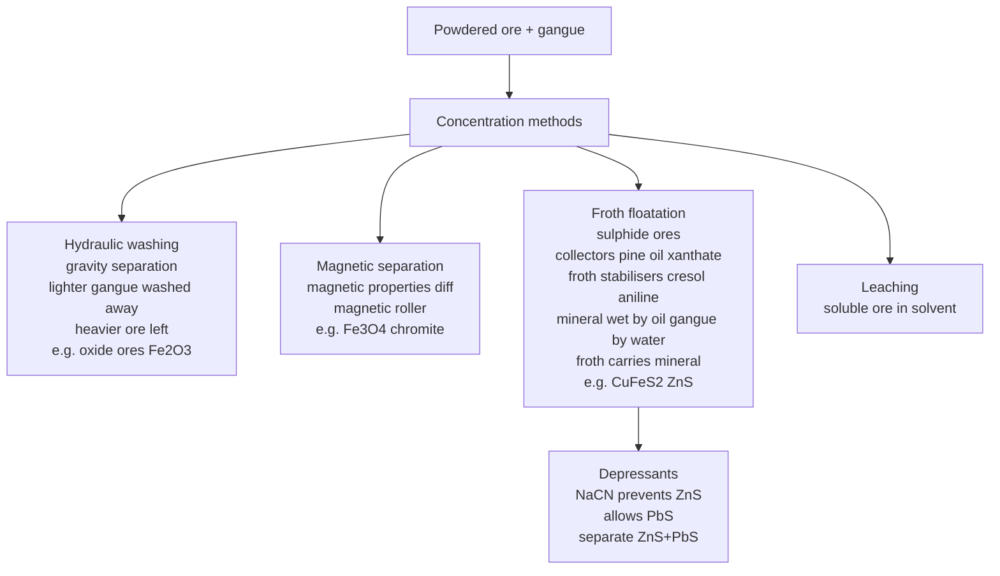
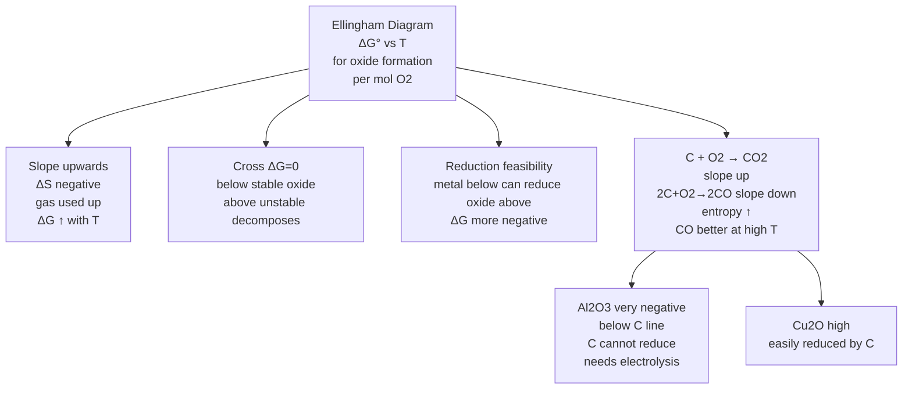
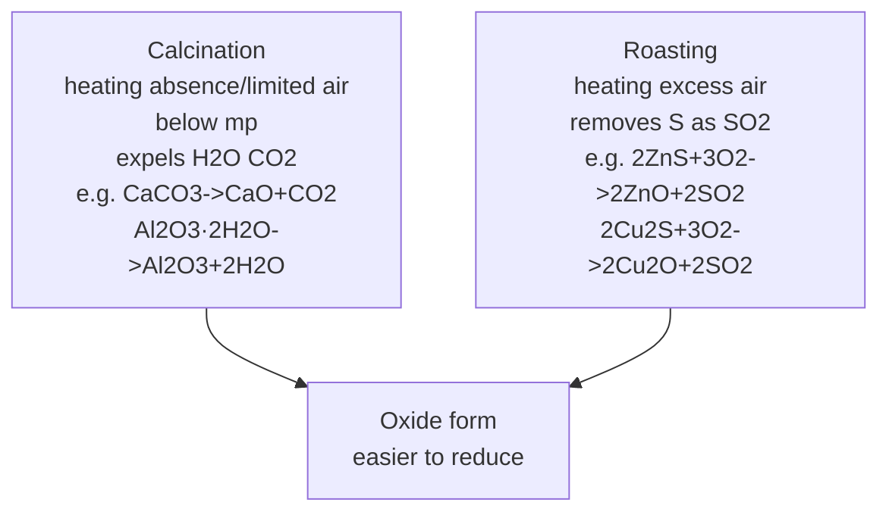
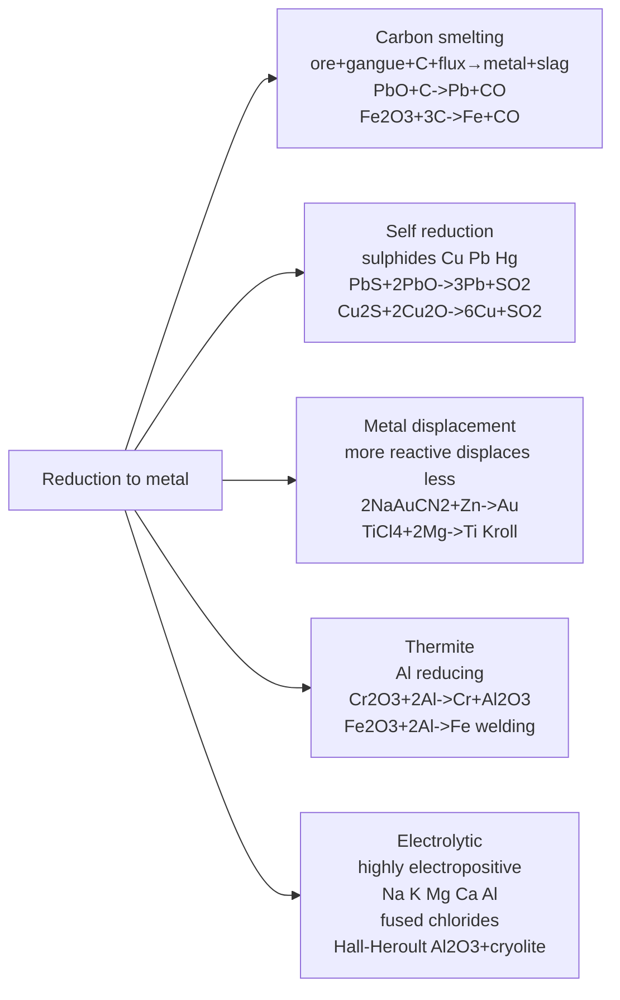
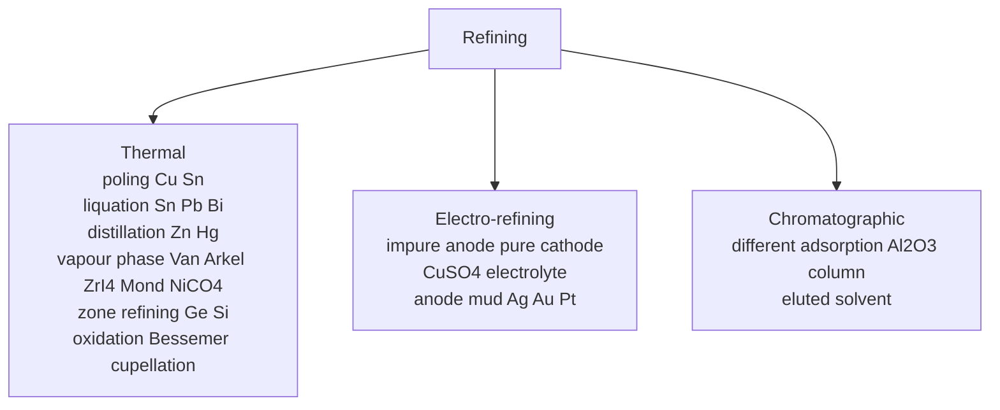
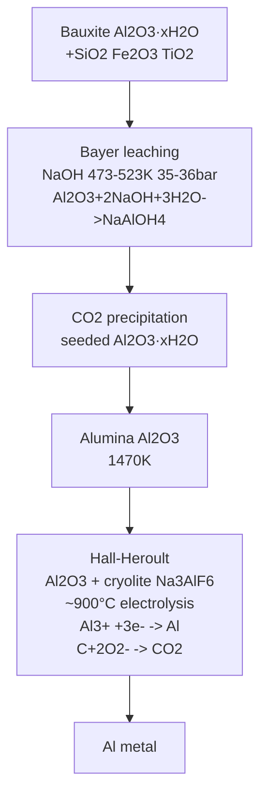
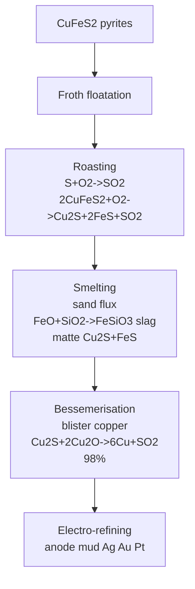

# General Principles and Processes of Isolation of Elements — JEE Advanced Notes

> **Sources merged into these notes**
> | Source | File |
> |---|---|
> | NCERT Class XII Chemistry legacy 2018-19, Unit 6 (Isolation of Elements) | [`lech106-legacy.pdf`](lech106-legacy.pdf) |
> | Allen module Metallurgy_Eng | [`5-JAEIC-Metallurgy_Eng.pdf.pdf`](5-JAEIC-Metallurgy_Eng.pdf.pdf) |
>
> NCERT legacy Unit 6 (6.1–6.8) = Minerals ores gangue + occurrence + concentration hydraulic washing magnetic separation froth floatation leaching + calcination roasting + thermodynamic principles Gibbs Ellingham diagram + reduction carbon self metal displacement electrolytic thermite + flux slag + refining thermal electro chromatographic + extraction Al Cu Zn Fe. This notes.md is **complete basics-to-Advanced**: NCERT points with § numbers, Allen module points merged, JEE Advanced extensions marked 🆇, ⚠ = traps. Proper Obsidian plugin usage: Mermaid flowcharts for steps, Ellingham, refining, $\ce{}$ for reactions.

## Contents

- [Part A — Minerals, Ores and Concentration](#part-a--minerals-ores-and-concentration)
  1. [Minerals, ores, gangue and occurrence of metals (6.1)](#1-minerals-ores-gangue-and-occurrence-of-metals-61)
  2. [Concentration — hydraulic washing, magnetic separation, froth floatation (6.2.1–6.2.3)](#2-concentration--hydraulic-washing-magnetic-separation-froth-floatation-621-623)
  3. [Leaching — alumina from bauxite, Ag and Au (6.2.4)](#3-leaching--alumina-from-bauxite-ag-and-au-624)
- [Part B — Conversion to Oxide and Thermodynamic Principles](#part-b--conversion-to-oxide-and-thermodynamic-principles)
  4. [Calcination and roasting — conversion to oxide (6.3)](#4-calcination-and-roasting--conversion-to-oxide-63)
  5. [Thermodynamics of reduction — Gibbs energy $ΔG = ΔH - TΔS$ (6.3)](#5-thermodynamics-of-reduction--gibbs-energy-δg--δh---tδs-63)
  6. [Ellingham diagram — features and applications (6.3)](#6-ellingham-diagram--features-and-applications-63)
  7. [Limitations of Ellingham and choice of reducing agent — C vs CO vs H2 🆇 (6.3)](#7-limitations-of-ellingham-and-choice-of-reducing-agent--c-vs-co-vs-h2--63)
- [Part C — Reduction to Metal](#part-c--reduction-to-metal)
  8. [Reduction by carbon — smelting, flux and slag (6.4)](#8-reduction-by-carbon--smelting-flux-and-slag-64)
  9. [Self reduction — Cu, Pb, Hg sulphides (6.4)](#9-self-reduction--cu-pb-hg-sulphides-64)
  10. [Metal displacement and thermite reduction (6.4)](#10-metal-displacement-and-thermite-reduction-64)
  11. [Electrolytic reduction — highly electropositive metals (6.4)](#11-electrolytic-reduction--highly-electropositive-metals-64)
- [Part D — Refining](#part-d--refining)
  12. [Refining — thermal methods poling, liquation, distillation, vapour phase (6.5)](#12-refining--thermal-methods-poling-liquation-distillation-vapour-phase-65)
  13. [Van Arkel and Mond's process — Ti Zr Ni (6.5)](#13-van-arkel-and-monds-process--ti-zr-ni-65)
  14. [Zone refining and chromatographic method (6.5)](#14-zone-refining-and-chromatographic-method-65)
  15. [Electro-refining (6.5)](#15-electro-refining-65)
- [Part E — Extraction of Individual Metals](#part-e--extraction-of-individual-metals)
  16. [Extraction of aluminium — Bayer, Hall-Heroult (6.6)](#16-extraction-of-aluminium--bayer-hall-heroult-66)
  17. [Extraction of copper — pyrometallurgical smelting and Bessemerisation (6.6)](#17-extraction-of-copper--pyrometallurgical-smelting-and-bessemerisation-66)
  18. [Extraction of zinc and iron — blast furnace (6.6)](#18-extraction-of-zinc-and-iron--blast-furnace-66)
  19. [Extraction of silver and gold — hydrometallurgy leaching 🆇 (6.6)](#19-extraction-of-silver-and-gold--hydrometallurgy-leaching--66)
- [Part F — Advanced Corner, Patterns and Revision](#part-f--advanced-corner-patterns-and-revision)
  20. [Master formula bank (print this)](#20-master-formula-bank-print-this)
  21. [Worked problem patterns — JEE Advanced favourites](#21-worked-problem-patterns--jee-advanced-favourites)
  22. [The 20 traps examiners use](#22-the-20-traps-examiners-use)
  23. [Quick Revision Sheet](#23-quick-revision-sheet)

---

# Part A — Minerals, Ores and Concentration

## 1. Minerals, ores, gangue and occurrence of metals (6.1)

Few elements occur free: C, S, Au, noble gases, Pt. Others combined form in earth's crust.

- **Minerals**: Naturally occurring chemical substances in earth's crust obtainable by mining, e.g., bauxite $\ce{AlO_x(OH)_{3-2x}}$, haematite $\ce{Fe2O3}$.
- **Ores**: Minerals viable to be used as source of metal, economically and chemically feasible, e.g., bauxite is ore of Al, haematite ore of Fe. All ores are minerals but not all minerals are ores.
- **Gangue**: Earthly or undesired materials contaminating ore e.g., sand, clays, limestone.

Abundance: Al most abundant metal 3rd most abundant element in crust 8.3% by weight major component many igneous minerals mica clays gemstones impure $\ce{Al2O3}$ ruby Cr impurity sapphire Co. Fe 2nd most abundant metal variety compounds essential biological. Principal ores:

| Metal | Ores | Composition |
|---|---|---|
| Al | Bauxite | $\ce{AlO_x(OH)_{3-2x}}$ 0<x<1 |
|  | Kaolinite clay | $\ce{Al2(OH)4Si2O5}$ |
| Fe | Haematite | $\ce{Fe2O3}$ |
|  | Magnetite | $\ce{Fe3O4}$ |
|  | Siderite | $\ce{FeCO3}$ |
|  | Iron pyrites | $\ce{FeS2}$ |
| Cu | Copper pyrites | $\ce{CuFeS2}$ |
|  | Malachite | $\ce{CuCO3·Cu(OH)2}$ |
|  | Cuprite | $\ce{Cu2O}$ |
|  | Copper glance | $\ce{Cu2S}$ |
| Zn | Zinc blende sphalerite | $\ce{ZnS}$ |
|  | Calamine | $\ce{ZnCO3}$ |
|  | Zincite | $\ce{ZnO}$ |

For extraction: bauxite chosen for Al, oxide ores for Fe (abundant no polluting $\ce{SO2}$ like pyrites), for Cu Zn any ore depending availability.

Steps of metallurgy:

1. Concentration of ore / dressing / benefaction — removal of gangue.
2. Isolation of metal from concentrated ore — conversion to oxide then reduction.
3. Purification of metal — refining.

Entire scientific and technological process = metallurgy.

## 2. Concentration — hydraulic washing, magnetic separation, froth floatation (6.2.1–6.2.3)

Concentration = removal of unwanted materials sand clays from ore, based on differences in physical properties.

**Hydraulic washing / gravity separation**: Based on differences in gravities ore vs gangue, upward stream running water washes powdered ore, lighter gangue washed away heavier ores left behind, e.g., oxide ores haematite heavier than sand.

**Magnetic separation**: Based on magnetic properties if either ore or gangue attracted by magnetic field, e.g., iron ores magnetic. Ground ore carried on conveyor belt passes over magnetic roller, magnetic particles attracted collected, non-magnetic separate. Example: $\ce{Fe3O4}$ magnetite, $\ce{FeCr2O4}$ chromite, $\ce{Mn}$ ores.

**Froth floatation**: Used for sulphide ores, based on preferential wetting. Powdered ore suspension made with water, collectors and froth stabilisers added. Collectors e.g., pine oils fatty acids xanthates enhance non-wettability of mineral particles, froth stabilisers e.g., cresols aniline stabilise froth. Mineral particles become wet by oils, gangue by water, rotating paddle agitates draws air, froth formed carries mineral particles light skimmed off dried for recovery.

Depressants used to separate two sulphide ores: e.g., ore containing $\ce{ZnS}$ and $\ce{PbS}$, depressant $\ce{NaCN}$ selectively prevents $\ce{ZnS}$ from coming to froth allows $\ce{PbS}$.

Washerwoman story: Mrs. Carrie Everson invented froth floatation observing copper compounds caught in soapsuds while sand fell to bottom.

## 3. Leaching — alumina from bauxite, Ag and Au (6.2.4)

Leaching = ore soluble in suitable solvent, impurity insoluble.

**a) Leaching alumina from bauxite** (Bayer process):

Bauxite contains $\ce{SiO2}$, iron oxides, $\ce{TiO2}$ impurities. Powdered ore digested with concentrated $\ce{NaOH}$ at 473-523 K 35-36 bar pressure, $\ce{Al2O3}$ leached as sodium aluminate and $\ce{SiO2}$ as sodium silicate leaving impurities behind:

$\ce{Al2O3(s) + 2NaOH(aq) + 3H2O(l) -> 2Na[Al(OH)4](aq)}$

Aluminate neutralised by passing $\ce{CO2}$ and hydrated $\ce{Al2O3}$ precipitated seeded with freshly prepared hydrated $\ce{Al2O3}$:

$\ce{2Na[Al(OH)4](aq) + CO2(g) -> Al2O3·xH2O(s) + 2NaHCO3(aq)}$

Sodium silicate remains in solution, hydrated alumina filtered dried heated to give pure $\ce{Al2O3}$:

$\ce{Al2O3·xH2O(s) ->[1470 K] Al2O3(s) + xH2O(g)}$

**b) Leaching Ag and Au** (hydrometallurgy):

Metal leached with dilute $\ce{NaCN}$ or $\ce{KCN}$ in presence of air $\ce{O2}$ forming complex:

$\ce{4M(s) + 8CN-(aq) + 2H2O(aq) + O2(g) -> 4[M(CN)2]-(aq) + 4OH-(aq)}$ $M=Ag, Au$

Metal obtained later by replacement with Zn:

$\ce{2[Ag(CN)2]-(aq) + Zn(s) -> [Zn(CN)4]^{2-}(aq) + 2Ag(s)}$

$\ce{2[Au(CN)2]-(aq) + Zn(s) -> [Zn(CN)4]^{2-}(aq) + 2Au(s)}$

---

# Part B — Conversion to Oxide and Thermodynamic Principles

## 4. Calcination and roasting — conversion to oxide (6.3)

Concentrated ore converted to oxide form easier to reduce.

**Calcination**: Heating ore in absence or limited air below melting point to expel water from hydrated oxide or $\ce{CO2}$ from carbonate, also removes volatile impurities.

$\ce{CaCO3 -> CaO + CO2}$

$\ce{Al2O3·2H2O -> Al2O3 + 2H2O}$

$\ce{Fe2O3·xH2O -> Fe2O3 + xH2O}$

$\ce{ZnCO3 -> ZnO + CO2}$

Done in reverberatory furnace.

**Roasting**: Heating ore in excess air to remove excess sulphur as $\ce{SO2}$, also removes As, Sb as volatile oxides, converts sulphide to oxide.

Metal sulphides + $\ce{O2}$ → metal oxide + $\ce{SO2}$.

$\ce{2ZnS + 3O2 -> 2ZnO + 2SO2}$

$\ce{2Cu2S + 3O2 -> 2Cu2O + 2SO2}$

$\ce{2PbS + 3O2 -> 2PbO + 2SO2}$

$\ce{S + O2 -> SO2}$

$\ce{4As + 3O2 -> 2As2O3}$ volatile

Roasting in reverberatory or blast furnace.

## 5. Thermodynamics of reduction — Gibbs energy $ΔG = ΔH - TΔS$ (6.3)

Extraction involves reduction of oxide to metal, need to check feasibility via Gibbs energy.

For spontaneous reaction $ΔG$ negative, $ΔG = ΔH - TΔS$.

Consider formation of oxide: $M + O_2 -> MO$, dioxygen gas used up, gases have higher entropy than liquids/solids, so entropy decreases $ΔS$ negative, $TΔS$ negative, $-TΔS$ positive, $ΔG$ becomes less negative with increase T, free energy increases with T.

Plot $ΔG°$ vs $T$ for formation of oxides for 1 mol $\ce{O2}$? Actually per mol $\ce{O2}$? Ellingham diagram uses 1 mol $\ce{O2}$ or 1 mol oxide? Usually per mol $\ce{O2}$.

## 6. Ellingham diagram — features and applications (6.3)

Ellingham diagram = plot $ΔG°$ vs $T$ for formation of oxides, sulphides, halides for 1 mol $\ce{O2}$, $\ce{S}$, etc.

Features for oxides:

- Graph for metal oxides slopes upwards because $ΔG$ increases with T (entropy decreases).
- Follows straight line unless phase change metal or oxide melts/vapourises → slope changes.
- When T raised point where graph crosses $ΔG=0$ line, below T oxide stable $ΔG$ negative, above T oxide unstable positive should decompose to metal + $\ce{O2}$.
- Any metal will reduce oxide of other metals which lie above it in diagram because $ΔG$ more negative by difference between two graphs at that T → reduction feasible.

Applications:

- Choose reducing agent and temperature: If $ΔG°$ for $C + O2 -> CO2$ lies below metal oxide line at given T, C can reduce metal oxide.
- At low T, $C + O2 -> CO2$ line below many oxides? Actually at high T $C + O2 -> CO$ line goes down (entropy increases because 1 gas → 1 gas? Actually $2C + O2 -> 2CO$ gas moles increase 1→2 entropy increase $ΔS$ positive $ΔG$ decreases with T slope negative), so CO better reducing agent at high T.
- For $\ce{Cu2O}$ reduction easy, $ΔG$ less negative, line high, easily reduced by C.
- For $\ce{Fe2O3}$ more negative, need higher T or stronger reducing agent.
- For $\ce{Al2O3}$ very negative, lies below C line up to high T, so C cannot reduce $\ce{Al2O3}$, need electrolysis.

## 7. Limitations of Ellingham and choice of reducing agent — C vs CO vs H2 🆇 (6.3)

Limitations:

- Based only on thermodynamics $ΔG$, indicates tendency whether reduction possible, not kinetics how fast.
- Interpretation $ΔG°=-RT lnK$ presumes reactants/products in equilibrium, may not hold.

Choice:

- **Carbon (coke)**: At low T $C + O2 -> CO2$ $ΔG$ negative but not very, at high T $2C+O2->2CO$ $ΔG$ becomes more negative slope negative, so CO better reducing agent at high T than C. At very high T CO reduces many oxides.
- **CO**: At moderate T CO good reducing agent, e.g., in blast furnace $\ce{Fe2O3 + 3CO -> 2Fe + 3CO2}$.
- **H2**: $2H2+O2->2H2O$ line slope? Entropy decreases gas moles 3→2? Actually 2+1→2 entropy decrease slightly, slope up small. $H_2$ can reduce some oxides but water formed may affect.
- Why $\ce{CO}$ favourable at certain T while coke better in some other cases: At low T $CO2$ formation more negative than CO, so C→$CO2$ favourable, at high T C→CO more negative due to entropy increase, so CO formation favourable.

For $\ce{ZnO}$: $C$ can reduce at high T above $T$ where C line below ZnO line.

For $\ce{Al2O3}$: $ΔG$ very negative below C line up to >2000°C, so C cannot reduce, need electrolysis.

For $\ce{Cu2O}$: Easily reduced even at low T.

---

# Part C — Reduction to Metal

## 8. Reduction by carbon — smelting, flux and slag (6.4)

Calcined/roasted ore reduced to metallic state via carbon reduction smelting.

Concentrated ore + reducing agent carbon + flux → metal + slag + gases.

$\ce{PbO + C -> Pb + CO}$

$\ce{Fe2O3 + 3C -> 2Fe + 3CO}$ (actually with CO)

Flux = substance added to remove gangue, acidic or basic.

- **Acidic flux**: $\ce{SiO2}$ removes basic impurity e.g., $\ce{CaO}$, $\ce{MgO}$, $\ce{FeO}$.
- **Basic flux**: $\ce{CaO}$, $\ce{MgO}$, $\ce{CaCO3}$ removes acidic impurity e.g., $\ce{SiO2}$, $\ce{P2O5}$.

Slag = fusible product formed by flux + gangue, e.g., $\ce{CaSiO3}$, $\ce{FeSiO3}$, $\ce{Ca3(PO4)2}$, floats on molten metal removed.

Examples:

- Acidic impurity $\ce{P2O5}$ + basic flux $\ce{CaO}$ → $\ce{Ca3(PO4)2}$ slag.
- Basic impurity $\ce{MgCO3}$ + acidic flux $\ce{SiO2}$ → $\ce{MgSiO3}$ slag + $\ce{CO2}$.
- $\ce{FeO + SiO2 -> FeSiO3}$ slag.

Smelting in blast furnace reverberatory.

## 9. Self reduction — Cu, Pb, Hg sulphides (6.4)

Sulphides of certain metals reduced to metal without additional reducing agent using self reduction, ores of Cu, Pb, Hg.

For Pb: Galena $\ce{PbS}$

Roasting: $\ce{2PbS + 3O2 ->[Roasting] 2PbO + 2SO2}$

Self reduction: $\ce{PbS + 2PbO ->[High T, no air] 3Pb + SO2}$

Overall: $\ce{2PbS + 3O2 -> 2PbO + 2SO2}$, $\ce{PbS + 2PbO -> 3Pb + SO2}$.

For Cu: $\ce{Cu2S}$

$\ce{2Cu2S + 3O2 -> 2Cu2O + 2SO2}$

$\ce{Cu2S + 2Cu2O -> 6Cu + SO2}$ (in Bessemer converter)

For Hg: $\ce{HgS}$ cinnabar roasting $\ce{HgS + O2 -> Hg + SO2}$.

## 10. Metal displacement and thermite reduction (6.4)

**Metal displacement**: More reactive metal displaces less reactive from its compound, e.g., $\ce{2Na[Au(CN)2] + Zn -> Na2[Zn(CN)4] + 2Au}$, $\ce{2Na[Ag(CN)2] + Zn -> Na2[Zn(CN)4] + 2Ag}$ sodium tetra cyanozincate, used for Ag Au extraction.

Also $\ce{TiCl4 + 2Mg -> Ti + 2MgCl2}$ Kroll process.

**Thermite reduction / Goldschmidt**: Al used as reducing agent for metals with very high melting points to be extracted from oxides, highly exothermic, e.g., $\ce{Cr2O3 + 2Al -> 2Cr + Al2O3}$, $\ce{3Mn3O4 + 8Al -> 9Mn + 4Al2O3}$, $\ce{Fe2O3 + 2Al -> 2Fe + Al2O3}$ thermite welding, $\ce{Al}$ has high affinity for oxygen, $ΔG$ for $\ce{Al2O3}$ very negative.

## 11. Electrolytic reduction — highly electropositive metals (6.4)

Used for highly electropositive metals Na K Mg Ca Al etc., which cannot be reduced by carbon due to very negative $ΔG$ of their oxides.

- **Na, K**: Electrolysis of fused chlorides $\ce{NaCl}$ with $\ce{CaCl2}$ to lower mp Downs process.
- **Mg**: Fused $\ce{MgCl2}$ Dow process.
- **Al**: Hall-Heroult electrolysis of $\ce{Al2O3}$ dissolved in cryolite $\ce{Na3AlF6}$ to lower mp and increase conductivity.

$ΔG° = -nFE°$, more negative $E°$ more difficult reduction, need electrolysis.

---

# Part D — Refining

## 12. Refining — thermal methods poling, liquation, distillation, vapour phase (6.5)

Refining = purification of metal.

**Thermal refining**:

- **Poling process**: For Cu & Sn, molten metal stirred with green wood poles, reducing gases $\ce{CH4}$ from wood reduce oxide impurities $\ce{Cu2O + C -> 2Cu + CO}$.
- **Liquation**: For Sn, Pb, Bi, based on low melting point metal, ore heated on sloping hearth, low mp metal melts flows down, high mp impurities remain.
- **Distillation**: For Zn & Hg low boiling metals, metal heated to vapourise, impurities non-volatile remain, vapour condensed.

**Vapour phase refining**:

- **Van Arkel method**: For Ti, Zr, Hf, B, ultra pure, based on formation and decomposition of volatile compound. $\ce{Zr + 2I2 -> ZrI4}$ volatile formed at 870K, decomposed at 2075K to pure Zr + $\ce{I2}$: $\ce{ZrI4 ->[2075K] Zr + 2I2}$.
- **Mond's process**: For Ni, $\ce{Ni + 4CO ->[330-350K] Ni(CO)4}$ volatile tetracarbonyl nickel, decomposed at 450-470K to pure Ni + CO: $\ce{Ni(CO)4 ->[450-470K] Ni + 4CO}$.

## 13. Van Arkel and Mond's process — Ti Zr Ni (6.5)

Already covered, vapour phase refining for ultra pure metals.

Van Arkel: Ti, Zr, Hf, B.

$\ce{Ti + 2I2 ->[870K] TiI4 ->[1675K] Ti + 2I2}$

$\ce{Zr + 2I2 ->[870K] ZrI4 ->[2075K] Zr + 2I2}$

Mond: Ni

$\ce{Ni + 4CO ->[330K] Ni(CO)4 ->[470K] Ni + 4CO}$

## 14. Zone refining and chromatographic method (6.5)

**Zone refining**: Based on fractional crystallisation, impurities more soluble in molten than solid, for Ge, Si, Ga, In ultra pure semiconductors.

Molten zone moved along rod, impurities concentrate in molten zone move to one end, pure metal crystallises, repeated.

**Chromatographic method**: Based on different components differently adsorbed on adsorbent, mixture in liquid or gaseous medium moved through adsorbent column $\ce{Al2O3}$, different components adsorbed at different levels, eluted by suitable solvent eluant, very useful for purification of elements in minute quantities impurities not very different chemical properties.

Types: paper chromatography, column chromatography, gas chromatography, etc.

## 15. Electro-refining (6.5)

Electrolysis: Impure metal anode, pure metal cathode, electrolyte soluble salt of metal.

Example: Cu electro-refining: anode impure Cu, cathode pure Cu, electrolyte $\ce{CuSO4}$ + $\ce{H2SO4}$, on passing current Cu dissolves from anode $\ce{Cu -> Cu^{2+} + 2e-}$ and deposits at cathode $\ce{Cu^{2+} + 2e- -> Cu}$, impurities anode mud contains $\ce{Ag, Au, Pt}$ precious.

Also for Al, Zn, etc.

---

# Part E — Extraction of Individual Metals

## 16. Extraction of aluminium — Bayer, Hall-Heroult (6.6)

**Concentration via Bayer** (leaching):

Bauxite $\ce{Al2O3·xH2O}$ with $\ce{SiO2 Fe2O3 TiO2}$ digested with $\ce{NaOH}$ 473-523K 35-36 bar:

$\ce{Al2O3 + 2NaOH + 3H2O -> 2Na[Al(OH)4]}$

$\ce{SiO2 + 2NaOH -> Na2SiO3 + H2O}$

$\ce{Na[Al(OH)4]}$ solution filtered, neutralised with $\ce{CO2}$ seeded with hydrated $\ce{Al2O3}$:

$\ce{2Na[Al(OH)4] + CO2 -> Al2O3·xH2O + 2NaHCO3}$

Hydrated alumina filtered dried heated 1470K → pure $\ce{Al2O3}$ alumina.

**Reduction via Hall-Heroult**:

$\ce{Al2O3}$ dissolved in cryolite $\ce{Na3AlF6}$ + fluorspar $\ce{CaF2}$ to lower mp from 2072°C to ~900°C and increase conductivity, electrolysed in carbon lined cell anode carbon, cathode carbon.

Cathode: $\ce{Al^{3+} + 3e- -> Al(l)}$

Anode: $\ce{C + 2O^{2-} -> CO2 + 4e-}$ carbon anodes burnt to $\ce{CO2}$ need replacement, also $\ce{2O^{2-} -> O2 + 4e-}$.

Overall: $\ce{2Al2O3 + 3C -> 4Al + 3CO2}$

Al collected at bottom.

## 17. Extraction of copper — pyrometallurgical smelting and Bessemerisation (6.6)

**Occurrence**: Free and combined, ores $\ce{CuFeS2}$ copper pyrites, $\ce{Cu2O}$ cuprite ruby copper, $\ce{Cu2S}$ copper glance, $\ce{CuCO3·Cu(OH)2}$ malachite, $\ce{2CuCO3·Cu(OH)2}$ azurite.

Extraction from sulphide ores two processes: pyrometallurgical dry for high grade ≥4% Cu, hydrometallurgical wet for low grade.

**Pyrometallurgical (smelting)**:

- **Concentration**: Froth floatation.
- **Roasting**: Heated strongly in air S As Sb removed volatile oxides, ore converted mixture cuprous and ferrous sulphides partially oxidised:

$\ce{S + O2 -> SO2}$

$\ce{2As2S3 + 9O2 -> 2As2O3 + 6SO2}$

$\ce{2CuFeS2 + O2 -> Cu2S + 2FeS + SO2}$

$\ce{2FeS + 3O2 -> 2FeO + 2SO2}$

- **Smelting**: Roasted ore mixed with sand flux and coke fuel heated in reverberatory blast furnace smelter, $\ce{FeS}$ oxidation further, $\ce{FeO + SiO2 -> FeSiO3}$ slag, $\ce{2Cu2S + 3O2 -> 2Cu2O + 2SO2}$, $\ce{Cu2O + FeS -> Cu2S + FeO}$, slag upper layer molten mass $\ce{Cu2S}$ + little $\ce{FeS}$ lower layer matte removed separate holes.

- **Bessemerisation**: Molten matte heated in Bessemer converter blast air mixed with sand blown, $\ce{FeS}$ oxidised to $\ce{FeO}$ slag, $\ce{Cu2S}$ to $\ce{Cu2O}$, self reduction $\ce{Cu2S + 2Cu2O -> 6Cu + SO2}$, blister copper obtained due to $\ce{SO2}$ bubbles, 98% pure.

- **Refining**: Electro-refining impure Cu anode pure Cu cathode $\ce{CuSO4}$ electrolyte, anode mud Ag Au Pt.

**Hydrometallurgical**: Leaching with acid bacteria, then $\ce{Cu^{2+}}$ solution with Fe $\ce{Cu^{2+} + Fe -> Fe^{2+} + Cu}$.

## 18. Extraction of zinc and iron — blast furnace (6.6)

**Zinc**:

Ores $\ce{ZnS}$ sphalerite, $\ce{ZnCO3}$ calamine, $\ce{ZnO}$ zincite.

Concentration froth floatation for sulphide, gravity for oxide.

Roasting: $\ce{2ZnS + 3O2 -> 2ZnO + 2SO2}$

Calcination: $\ce{ZnCO3 -> ZnO + CO2}$

Reduction: $\ce{ZnO + C -> Zn + CO}$ at 1673K, Zn vapour condensed.

Refining: Electro-refining or distillation.

**Iron**:

Ores $\ce{Fe2O3}$ haematite, $\ce{Fe3O4}$ magnetite, $\ce{FeCO3}$ siderite.

Concentration magnetic separation hydraulic washing.

Calcination: $\ce{Fe2O3·xH2O -> Fe2O3 + xH2O}$, $\ce{FeCO3 -> FeO + CO2}$ then $\ce{FeO}$ to $\ce{Fe2O3}$? Actually $\ce{Fe2O3}$.

Reduction in blast furnace:

Blast furnace tall, charge iron ore + coke + limestone $\ce{CaCO3}$ from top, hot air blast from bottom.

Reactions:

- $\ce{CaCO3 -> CaO + CO2}$ 900°C limestone decomposition.
- $\ce{C + O2 -> CO2}$ 1500°C coke burning.
- $\ce{CO2 + C -> 2CO}$ 1000°C Boudouard.
- $\ce{Fe2O3 + 3CO -> 2Fe + 3CO2}$ 500-800°C reduction by CO.
- $\ce{FeO + SiO2 -> FeSiO3}$ slag, $\ce{CaO + SiO2 -> CaSiO3}$ slag, $\ce{P2O5 + 3CaO -> Ca3(PO4)2}$ slag.
- Molten iron pig iron ~4% C collected bottom, slag floats.

Pig iron → cast iron → wrought iron → steel via Bessemerisation, etc.

## 19. Extraction of silver and gold — hydrometallurgy leaching 🆇 (6.6)

Already covered leaching:

$\ce{4Ag + 8CN- + 2H2O + O2 -> 4[Ag(CN)2]- + 4OH-}$

$\ce{4Au + 8CN- + 2H2O + O2 -> 4[Au(CN)2]- + 4OH-}$

Replacement with Zn:

$\ce{2[Ag(CN)2]- + Zn -> [Zn(CN)4]^{2-} + 2Ag}$

$\ce{2[Au(CN)2]- + Zn -> [Zn(CN)4]^{2-} + 2Au}$

Refining via cupellation, etc.

---

# Part F — Advanced Corner, Patterns and Revision

## 20. Master formula bank (print this)

**Terms**:

- Mineral naturally occurring chemical substance, ore viable mineral source of metal, gangue undesired earthly materials sand clays, metallurgy entire process isolation metal from ores.
- Concentration dressing benefaction removal gangue based on physical properties.
- Calcination heating ore in absence/limited air below mp expels water hydrated oxide $\ce{CaCO3->CaO+CO2}$ $\ce{Al2O3·2H2O->Al2O3+2H2O}$, roasting heating in excess air removes S as $\ce{SO2}$ $\ce{2ZnS+3O2->2ZnO+2SO2}$.

**Concentration methods**:

- Hydraulic washing gravity separation lighter gangue washed away heavier ore left e.g., oxide ores.
- Magnetic separation magnetic roller magnetic ore attracted e.g., $\ce{Fe3O4}$ chromite.
- Froth floatation sulphide ores collectors pine oil xanthates non-wettability mineral, froth stabilisers cresol aniline, mineral wet by oil gangue by water froth carries mineral, depressant $\ce{NaCN}$ prevents $\ce{ZnS}$ allows $\ce{PbS}$.
- Leaching soluble ore solvent: bauxite $\ce{Al2O3+2NaOH+3H2O->2Na[Al(OH)4]}$ $\ce{2Na[Al(OH)4]+CO2->Al2O3·xH2O+2NaHCO3}$ $\ce{Al2O3·xH2O->[1470K]Al2O3}$, Ag Au $\ce{4M+8CN-+2H2O+O2->4[M(CN)2]-+4OH-}$ $\ce{2[M(CN)2]-+Zn->[Zn(CN)4]^{2-}+2M}$.

**Thermodynamics**:

- $ΔG=ΔH-TΔS$, $ΔG°=-RT lnK$, $ΔG°=-nFE°$, spontaneous $ΔG<0$.
- Ellingham diagram $ΔG°$ vs $T$ for oxide formation per mol $\ce{O2}$ slope upwards $ΔS$ negative gas used up $ΔG$ ↑ with T, crosses $ΔG=0$ below stable oxide above unstable decomposes, metal below can reduce oxide above $ΔG$ more negative.
- C vs CO: $C+O2->CO2$ slope up, $2C+O2->2CO$ slope down entropy ↑ gas moles 1→2 $ΔG$ ↓ with T CO better at high T, $\ce{Cu2O}$ easily reduced, $\ce{Fe2O3}$ moderate, $\ce{Al2O3}$ very negative below C line cannot reduce by C needs electrolysis.
- Limitations thermodynamics only tendency not kinetics, assumes equilibrium.

**Reduction**:

- Carbon smelting: ore+gangue+C+flux → metal+slag+gases $\ce{PbO+C->Pb+CO}$ $\ce{Fe2O3+3C->2Fe+3CO}$, flux acidic $\ce{SiO2}$ removes basic impurity $\ce{CaO MgO FeO}$, basic flux $\ce{CaO}$ removes acidic $\ce{SiO2 P2O5}$, slag fusible $\ce{CaSiO3 FeSiO3 Ca3(PO4)2}$.
- Self reduction sulphides $\ce{Cu Pb Hg}$: $\ce{2PbS+3O2->2PbO+2SO2}$ $\ce{PbS+2PbO->3Pb+SO2}$, $\ce{2Cu2S+3O2->2Cu2O+2SO2}$ $\ce{Cu2S+2Cu2O->6Cu+SO2}$ Bessemer, $\ce{HgS+O2->Hg+SO2}$.
- Metal displacement $\ce{2Na[Au(CN)2]+Zn->Na2[Zn(CN)4]+2Au}$ $\ce{TiCl4+2Mg->Ti+2MgCl2}$ Kroll, thermite $\ce{Cr2O3+2Al->2Cr+Al2O3}$ $\ce{Fe2O3+2Al->2Fe+Al2O3}$ welding highly exothermic.
- Electrolytic reduction highly electropositive Na K Mg Ca Al: fused chlorides Downs Dow, $\ce{Al2O3}$ cryolite Hall-Heroult $\ce{2Al2O3+3C->4Al+3CO2}$.

**Refining**:

- Thermal: poling Cu Sn green wood $\ce{CH4}$ reduces $\ce{Cu2O}$, liquation Sn Pb Bi low mp melts flows down, distillation Zn Hg low b.p. vapourise condense, vapour phase Van Arkel Ti Zr Hf B $\ce{Zr+2I2->[870K]ZrI4->[2075K]Zr+2I2}$ Mond Ni $\ce{Ni+4CO->[330K]Ni(CO)4->[470K]Ni+4CO}$, zone refining Ge Si Ga In fractional crystallisation impurities more soluble in molten molten zone moves, oxidation Bessemerisation Fe cupellation Ag Au, amalgamation Ag Au.
- Electro-refining: impure anode pure cathode electrolyte soluble salt e.g., Cu anode impure cathode pure $\ce{CuSO4+H2SO4}$ anode mud Ag Au Pt.
- Chromatographic: different adsorption on $\ce{Al2O3}$ column different levels eluted by solvent eluant minute quantities.

**Individual**:

- Al: Bayer bauxite $\ce{NaOH}$ 473-523K 35-36 bar $\ce{Al2O3+2NaOH+3H2O->2Na[Al(OH)4]}$ $\ce{CO2}$ precipitation $\ce{Al2O3·xH2O}$ 1470K $\ce{Al2O3}$, Hall-Heroult $\ce{Al2O3}$ cryolite $\ce{Na3AlF6}$ $\ce{CaF2}$ ~900°C electrolysis $\ce{Al^{3+}+3e- ->Al(l)}$ anode $\ce{C+2O^{2-}->CO2+4e-}$ $\ce{2Al2O3+3C->4Al+3CO2}$.
- Cu: pyrites froth floatation roasting $\ce{S+O2->SO2}$ $\ce{2CuFeS2+O2->Cu2S+2FeS+SO2}$ $\ce{2FeS+3O2->2FeO+2SO2}$ smelting sand flux $\ce{FeO+SiO2->FeSiO3}$ slag matte $\ce{Cu2S+FeS}$, Bessemerisation $\ce{FeS}$ to $\ce{FeO}$ slag $\ce{Cu2S+2Cu2O->6Cu+SO2}$ blister copper 98% electro-refining anode mud Ag Au Pt.
- Zn: $\ce{ZnS}$ froth $\ce{2ZnS+3O2->2ZnO+2SO2}$ $\ce{ZnCO3->ZnO+CO2}$ $\ce{ZnO+C->Zn+CO}$ 1673K vapour condense.
- Fe: haematite magnetite magnetic hydraulic calcination $\ce{CaCO3->CaO+CO2}$ $\ce{C+O2->CO2}$ $\ce{CO2+C->2CO}$ $\ce{Fe2O3+3CO->2Fe+3CO2}$ slag $\ce{CaO+SiO2->CaSiO3}$ pig iron 4% C → steel Bessemer.
- Ag Au: leaching $\ce{4M+8CN-+2H2O+O2->4[M(CN)2]-+4OH-}$ Zn displacement $\ce{2[M(CN)2]-+Zn->[Zn(CN)4]^{2-}+2M}$.

## 21. Worked problem patterns — JEE Advanced favourites

**Pattern 1 — Concentration method choice**:

$\ce{Fe3O4}$ magnetic → magnetic separation, $\ce{ZnS}$ sulphide → froth floatation, $\ce{Al2O3}$ with $\ce{SiO2}$ → leaching Bayer, oxide ore heavy → hydraulic washing.

**Pattern 2 — Ellingham feasibility**:

Given Ellingham: At 1000K $ΔG°$ for $\ce{2Mg+O2->2MgO}$ -900 kJ, for $\ce{2Cu+O2->2Cu2O}$ -200 kJ, can Mg reduce $\ce{Cu2O}$? $ΔG$ for $\ce{2Mg+2Cu2O->2MgO+4Cu}$ = -900 - (-200) = -700 kJ negative feasible.

**Pattern 3 — C vs CO choice**:

At low T $C+O2->CO2$ $ΔG$ -400 kJ more negative than $2C+O2->2CO$ -300 kJ so $CO2$ formation favourable, at high T $2C+O2->2CO$ -500 kJ more negative than $CO2$ -400 kJ so CO favourable, so at high T CO better reducing agent.

**Pattern 4 — Flux and slag**:

Gangue $\ce{SiO2}$ acidic + basic flux $\ce{CaO}$ → $\ce{CaSiO3}$ slag, gangue $\ce{FeO}$ basic + acidic flux $\ce{SiO2}$ → $\ce{FeSiO3}$.

**Pattern 5 — Self reduction**:

$\ce{Cu2S}$ 10 mol gives? $\ce{Cu2S+2Cu2O->6Cu+SO2}$ 1 mol $\ce{Cu2S}$ gives 6 mol Cu? Actually 1 $\ce{Cu2S}$ +2 $\ce{Cu2O}$ →6 Cu, but overall matte etc.

**Pattern 6 — Thermite**:

$\ce{Fe2O3+2Al->2Fe+Al2O3}$ 1 mol $\ce{Fe2O3}$ 160 g gives 2 mol Fe 112 g, highly exothermic used welding.

**Pattern 7 — Hall-Heroult**:

$\ce{Al2O3}$ 102 g gives 54 g Al, with cryolite lower mp.

**Pattern 8 — Leaching Au**:

4 mol Au needs 8 mol $\ce{CN-}$ +1 mol $\ce{O2}$ +2 mol $\ce{H2O}$ → 4 mol complex, then Zn displacement 2 mol complex gives 2 mol Au per Zn.

**Pattern 9 — Refining method choice**:

Ti ultra pure → Van Arkel $\ce{ZrI4}$ decomposition, Ni → Mond $\ce{Ni(CO)4}$, Ge Si semiconductors → zone refining, Cu → electro-refining, Sn Pb Bi low mp → liquation, Zn Hg low b.p. → distillation, Cu Sn oxide impurity → poling.

**Pattern 10 — Density and $N_A$ from $d=zM/a^3N_A$** already in solid state but also used for ores.

## 22. The 20 traps examiners use

1. Mineral naturally occurring chemical substance, ore viable mineral economically feasible, all ores minerals not all minerals ores, gangue undesired.
2. Concentration dressing benefaction removal gangue based on physical properties.
3. Hydraulic washing gravity lighter gangue washed away heavier ore left oxide ores, magnetic separation magnetic roller $\ce{Fe3O4}$, froth floatation sulphide ores collectors pine oil xanthates non-wettability mineral wet by oil gangue by water froth carries mineral, depressant $\ce{NaCN}$ prevents $\ce{ZnS}$ allows $\ce{PbS}$.
4. Leaching soluble ore solvent bauxite $\ce{NaOH}$ 473-523K 35-36 bar $\ce{Al2O3+2NaOH+3H2O->2Na[Al(OH)4]}$ $\ce{CO2}$ precipitation, Ag Au $\ce{CN-}$ + $\ce{O2}$ complex then Zn displacement.
5. Calcination heating absence/limited air below mp expels $\ce{H2O}$ hydrated oxide $\ce{CO2}$ carbonate $\ce{CaCO3->CaO+CO2}$, roasting excess air removes S as $\ce{SO2}$ $\ce{2ZnS+3O2->2ZnO+2SO2}$.
6. $ΔG=ΔH-TΔS$ spontaneous $ΔG<0$, $ΔG°=-RT lnK$, $ΔG°=-nFE°$.
7. Ellingham $ΔG°$ vs $T$ per mol $\ce{O2}$ slope upwards $ΔS$ negative gas used up $ΔG$ ↑ with T crosses $ΔG=0$ below stable oxide above unstable decomposes metal below can reduce oxide above.
8. C vs CO: $C+O2->CO2$ slope up, $2C+O2->2CO$ slope down entropy ↑ gas moles 1→2 $ΔG$ ↓ with T CO better at high T, $\ce{Al2O3}$ very negative below C line cannot reduce by C needs electrolysis $\ce{Cu2O}$ easily reduced.
9. Limitations Ellingham thermodynamics only tendency not kinetics assumes equilibrium.
10. Carbon smelting ore+gangue+C+flux→metal+slag+gases $\ce{PbO+C->Pb+CO}$ flux acidic $\ce{SiO2}$ removes basic impurity basic flux $\ce{CaO}$ removes acidic impurity slag fusible $\ce{CaSiO3 FeSiO3}$.
11. Self reduction sulphides $\ce{Cu Pb Hg}$ without additional reducing agent $\ce{2PbS+3O2->2PbO+2SO2}$ $\ce{PbS+2PbO->3Pb+SO2}$ $\ce{Cu2S+2Cu2O->6Cu+SO2}$ Bessemer blister copper.
12. Metal displacement more reactive displaces less $\ce{2Na[Au(CN)2]+Zn->Na2[Zn(CN)4]+2Au}$ $\ce{TiCl4+2Mg->Ti+2MgCl2}$ Kroll, thermite Al reducing agent high mp metals $\ce{Cr2O3+2Al->2Cr+Al2O3}$ exothermic welding.
13. Electrolytic reduction highly electropositive Na K Mg Ca Al fused chlorides Downs Dow $\ce{Al2O3}$ cryolite Hall-Heroult.
14. Refining thermal poling Cu Sn green wood $\ce{CH4}$ reduces $\ce{Cu2O}$, liquation Sn Pb Bi low mp melts flows, distillation Zn Hg low b.p. vapourise condense, vapour phase Van Arkel Ti Zr Hf B $\ce{ZrI4}$ decomposition Mond Ni $\ce{Ni(CO)4}$ decomposition, zone refining Ge Si Ga In fractional crystallisation impurities more soluble in molten, electro-refining impure anode pure cathode $\ce{CuSO4}$ anode mud Ag Au Pt, chromatographic different adsorption $\ce{Al2O3}$ column.
15. Hall-Heroult $\ce{Al2O3}$ cryolite $\ce{Na3AlF6}$ $\ce{CaF2}$ ~900°C electrolysis $\ce{Al^{3+}+3e- ->Al}$ anode $\ce{C+2O^{2-}->CO2}$.
16. Copper pyrometallurgical high grade ≥4% froth floatation roasting $\ce{2CuFeS2+O2->Cu2S+2FeS+SO2}$ smelting $\ce{FeO+SiO2->FeSiO3}$ slag matte $\ce{Cu2S+FeS}$ Bessemerisation $\ce{Cu2S+2Cu2O->6Cu+SO2}$ blister copper 98% electro-refining.
17. Zinc $\ce{ZnS}$ $\ce{2ZnS+3O2->2ZnO+2SO2}$ $\ce{ZnO+C->Zn+CO}$ vapour condense, iron blast furnace $\ce{CaCO3->CaO+CO2}$ $\ce{C+O2->CO2}$ $\ce{CO2+C->2CO}$ $\ce{Fe2O3+3CO->2Fe+3CO2}$ slag $\ce{CaSiO3}$ pig iron 4% C.
18. Silver gold hydrometallurgy leaching $\ce{CN-}$ $\ce{O2}$ complex Zn displacement.
19. Flux and slag: acidic flux $\ce{SiO2}$ removes basic gangue, basic flux $\ce{CaO}$ removes acidic gangue, slag floats removed.
20. $d=zM/a^3N_A$ for cubic density calculation also used for ores.

## 23. Quick Revision Sheet

**Terms**: Mineral naturally occurring chemical substance obtainable mining, ore viable mineral source metal, gangue earthly undesired sand clays, metallurgy entire process isolation metal from ores 3 steps concentration isolation purification.

**Concentration**: Removal gangue based on physical properties, hydraulic washing gravity lighter gangue washed away heavier ore left oxide ores, magnetic separation magnetic roller magnetic ore attracted $\ce{Fe3O4}$ chromite, froth floatation sulphide ores collectors pine oil xanthates non-wettability mineral wet by oil gangue by water froth carries mineral depressant $\ce{NaCN}$ prevents $\ce{ZnS}$ allows $\ce{PbS}$ separate, leaching soluble ore solvent bauxite $\ce{Al2O3+2NaOH+3H2O->2Na[Al(OH)4]}$ 473-523K 35-36 bar $\ce{CO2}$ precipitation $\ce{Al2O3·xH2O}$ 1470K $\ce{Al2O3}$ Ag Au $\ce{4M+8CN-+2H2O+O2->4[M(CN)2]-+4OH-}$ Zn displacement $\ce{2[M(CN)2]-+Zn->[Zn(CN)4]^{2-}+2M}$.

**Calcination roasting**: Calcination heating absence/limited air below mp expels $\ce{H2O}$ hydrated oxide $\ce{CO2}$ carbonate $\ce{CaCO3->CaO+CO2}$ $\ce{Al2O3·2H2O->Al2O3+2H2O}$ $\ce{ZnCO3->ZnO+CO2}$, roasting excess air removes S as $\ce{SO2}$ $\ce{2ZnS+3O2->2ZnO+2SO2}$ $\ce{2Cu2S+3O2->2Cu2O+2SO2}$.

**Thermodynamics**: $ΔG=ΔH-TΔS$ spontaneous $ΔG<0$ $ΔG°=-RT lnK$ $ΔG°=-nFE°$, Ellingham $ΔG°$ vs $T$ per mol $\ce{O2}$ slope upwards $ΔS$ negative gas used up $ΔG$ ↑ with T crosses $ΔG=0$ below stable oxide above unstable decomposes metal below can reduce oxide above $ΔG$ more negative, C vs CO $C+O2->CO2$ slope up $2C+O2->2CO$ slope down entropy ↑ gas moles 1→2 $ΔG$ ↓ with T CO better at high T $\ce{Cu2O}$ easily reduced $\ce{Fe2O3}$ moderate $\ce{Al2O3}$ very negative below C line cannot reduce by C needs electrolysis, limitations thermodynamics only tendency not kinetics assumes equilibrium.

**Reduction**: Carbon smelting ore+gangue+C+flux→metal+slag+gases $\ce{PbO+C->Pb+CO}$ $\ce{Fe2O3+3C->2Fe+3CO}$ flux acidic $\ce{SiO2}$ removes basic impurity basic flux $\ce{CaO}$ removes acidic impurity slag fusible $\ce{CaSiO3 FeSiO3 Ca3(PO4)2}$, self reduction sulphides $\ce{Cu Pb Hg}$ without additional reducing $\ce{2PbS+3O2->2PbO+2SO2}$ $\ce{PbS+2PbO->3Pb+SO2}$ $\ce{Cu2S+2Cu2O->6Cu+SO2}$ Bessemer blister copper, metal displacement $\ce{2Na[Au(CN)2]+Zn->Na2[Zn(CN)4]+2Au}$ $\ce{TiCl4+2Mg->Ti+2MgCl2}$ Kroll thermite Al $\ce{Cr2O3+2Al->2Cr+Al2O3}$ $\ce{Fe2O3+2Al->2Fe+Al2O3}$ welding exothermic, electrolytic highly electropositive Na K Mg Ca Al fused chlorides Downs Dow $\ce{Al2O3}$ cryolite Hall-Heroult $\ce{2Al2O3+3C->4Al+3CO2}$.

**Refining**: Thermal poling Cu Sn green wood $\ce{CH4}$ reduces $\ce{Cu2O}$, liquation Sn Pb Bi low mp melts flows, distillation Zn Hg low b.p. vapourise condense, vapour phase Van Arkel Ti Zr Hf B $\ce{Zr+2I2->[870K]ZrI4->[2075K]Zr+2I2}$ Mond Ni $\ce{Ni+4CO->[330K]Ni(CO)4->[470K]Ni+4CO}$, zone refining Ge Si Ga In fractional crystallisation impurities more soluble in molten molten zone moves pure crystallises, oxidation Bessemerisation Fe cupellation Ag Au, amalgamation Ag Au, electro-refining impure anode pure cathode electrolyte soluble salt Cu anode impure cathode pure $\ce{CuSO4+H2SO4}$ anode mud Ag Au Pt, chromatographic different adsorption $\ce{Al2O3}$ column eluted solvent.

**Individual**: Al Bayer bauxite $\ce{NaOH}$ 473-523K 35-36 bar $\ce{Al2O3+2NaOH+3H2O->2Na[Al(OH)4]}$ $\ce{CO2}$ precipitation $\ce{Al2O3·xH2O}$ 1470K $\ce{Al2O3}$ Hall-Heroult $\ce{Al2O3}$ cryolite $\ce{Na3AlF6}$ $\ce{CaF2}$ ~900°C $\ce{Al^{3+}+3e- ->Al(l)}$ anode $\ce{C+2O^{2-}->CO2}$, Cu pyrites high grade ≥4% froth floatation roasting $\ce{2CuFeS2+O2->Cu2S+2FeS+SO2}$ smelting $\ce{FeO+SiO2->FeSiO3}$ slag matte $\ce{Cu2S+FeS}$ Bessemerisation $\ce{Cu2S+2Cu2O->6Cu+SO2}$ blister copper 98% electro-refining, Zn $\ce{ZnS}$ $\ce{2ZnS+3O2->2ZnO+2SO2}$ $\ce{ZnO+C->Zn+CO}$ vapour condense, Fe haematite magnetite $\ce{CaCO3->CaO+CO2}$ $\ce{C+O2->CO2}$ $\ce{CO2+C->2CO}$ $\ce{Fe2O3+3CO->2Fe+3CO2}$ slag $\ce{CaSiO3}$ pig iron 4% C → steel, Ag Au leaching $\ce{CN-}$ $\ce{O2}$ complex Zn displacement.

---
*Cross-links:*
- Previous: [Solid State](../10-The-Solid-State/notes.md) — $d=zM/a^3N_A$ density, defects F-centres, band theory conductors; [Solutions](../07-Solutions/notes.md) — leaching concentration; [Thermodynamics](../03-Thermodynamics/notes.md) — $ΔG=ΔH-TΔS$ Ellingham $ΔG°=-RT lnK$; [Electrochemistry](../08-Electrochemistry/notes.md) — $ΔG°=-nFE°$ electrolytic reduction Hall-Heroult, electro-refining.
- Next: None — last Physical chapter, all 12 Physical chapters now have notes.md.
- Related: [Equilibrium](../04-Equilibrium/notes.md) — $K$ and $ΔG°$; [Redox](../05-Redox-Reactions/notes.md) — $n$-factor for $\ce{KMnO4 K2Cr2O7}$ thermite.
- Practical: Froth floatation, magnetic separation, Bayer process, Hall-Heroult, Bessemer converter, Van Arkel Mond zone refining.
