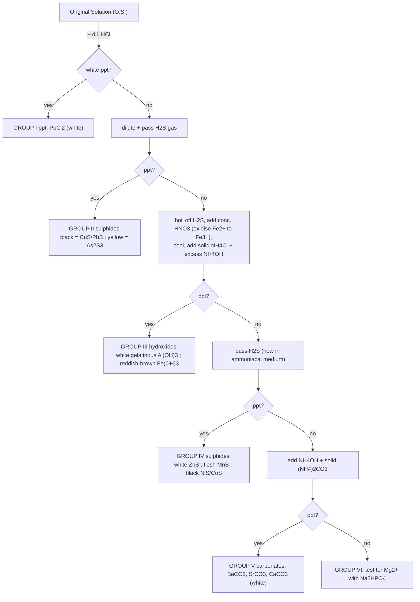

# Salt Analysis (Qualitative Analysis) — JEE Main + Advanced Notes

> **Sources merged into these notes**
> | Source | File |
> |---|---|
> | Allen — Salt Analysis Theory (JEE Main + Advanced, Enthusiast '26), 38 pp | [`Salt Analysis_Theory_26.pdf`](Salt%20Analysis_Theory_26.pdf) |
> | Allen — Reactions of Salt Analysis (reaction tables, Groups I–V), 10 pp | [`Reaction of Salt Analysis_Theory_26.pdf`](Reaction%20of%20Salt%20Analysis_Theory_26.pdf) |
>
> There is no NCERT chapter PDF for this topic — it belongs to the **practical chemistry**
> syllabus (NCERT Class XII practical manual). Points added beyond the two modules to close
> the JEE Main → Advanced gap are marked 🆇.

## Contents

- [Part 1 — Basics & Preliminary (Dry) Tests](#part-1--basics--preliminary-dry-tests)
  1. [What Salt Analysis Is](#1-what-salt-analysis-is)
  2. [The Bunsen Burner & Flame Zones](#2-the-bunsen-burner--flame-zones)
  3. [Colour & Dry-Heating Tests](#3-colour--dry-heating-tests)
  4. [Flame Test](#4-flame-test)
  5. [Borax Bead Test](#5-borax-bead-test)
  6. [Charcoal Cavity Test & Cobalt Nitrate Test](#6-charcoal-cavity-test--cobalt-nitrate-test)
- [Part 2 — Anions (Acid Radicals)](#part-2--anions-acid-radicals)
  7. [Group A — dilute H₂SO₄ Anions](#7-group-a--dilute-h₂so₄-anions)
  8. [Group B — concentrated H₂SO₄ Anions](#8-group-b--concentrated-h₂so₄-anions)
  9. [Group C — Sulphate & Phosphate](#9-group-c--sulphate--phosphate)
  10. [Anion Summary Chart](#10-anion-summary-chart)
- [Part 3 — Cations (Basic Radicals)](#part-3--cations-basic-radicals)
  11. [Original Solution & Group Scheme](#11-original-solution--group-scheme)
  12. [Group 0 — NH₄⁺](#12-group-0--nh₄⁺)
  13. [Group I — Pb²⁺](#13-group-i--pb²⁺)
  14. [Group II — Cu²⁺, Pb²⁺, As³⁺](#14-group-ii--cu²⁺-pb²⁺-as³⁺)
  15. [Group III — Al³⁺, Fe³⁺](#15-group-iii--al³⁺-fe³⁺)
  16. [Group IV — Zn²⁺, Mn²⁺, Ni²⁺, Co²⁺](#16-group-iv--zn²⁺-mn²⁺-ni²⁺-co²⁺)
  17. [Group V — Ba²⁺, Sr²⁺, Ca²⁺](#17-group-v--ba²⁺-sr²⁺-ca²⁺)
  18. [Group VI — Mg²⁺](#18-group-vi--mg²⁺)
- [Part 4 — Reagent-wise Reaction Tables (from the Reactions module)](#part-4--reagent-wise-reaction-tables)
  19. [Group-wise reagent tables](#19-group-wise-reagent-tables)
  20. [One reagent, many cations — K₄[Fe(CN)₆] and Na₂HPO₄](#20-one-reagent-many-cations)
- [Part 5 — JEE Corner](#part-5--jee-corner)
  21. [Why the scheme works — Ksp, common ion, pH control](#21-why-the-scheme-works)
  22. [Classic JEE reasoning questions](#22-classic-jee-reasoning-questions)
  23. [Quick Revision Sheet](#23-quick-revision-sheet)

---

# Part 1 — Basics & Preliminary (Dry) Tests

## 1. What Salt Analysis Is

- **Qualitative analysis** = identifying *what* is present (cation + anion of a salt or
  mixture of salts), not how much. In a salt, the **acid contributes the anion**, the
  **base contributes the cation** (CuSO₄: Cu²⁺ / SO₄²⁻).
- Scale: **macro** (0.1–0.5 g, ~20 mL), **semi-micro** (~0.05 g, ~1 mL), **micro**
  (still smaller).
- Detection relies on reactions perceptible to the senses: **(a)** precipitate formation,
  **(b)** colour change, **(c)** gas evolution.
- **Systematic analysis has three steps:**
  1. Preliminary examination of the solid salt and its solution (dry tests),
  2. Detection of **anions** (wet tests + confirmatory tests),
  3. Detection of **cations** (group analysis + confirmatory tests).
- Two governing principles: **Solubility Product (Ksp)** — precipitation occurs when
  ionic product exceeds Ksp — and the **Common Ion Effect**, used to control the ionic
  product.
- **Solubility & pH of the aqueous solution are clues:** basic solution → carbonate /
  sulphide type salt (hydrolysis); acidic → acid salt or salt of weak base + strong
  acid. Neutralise with Na₂CO₃ before testing anions if needed.
- **Extracts:** water extract (W.E.) if the salt dissolves in water; **sodium carbonate
  extract (S.C.E.)** if it does not.

```
Preparation of sodium carbonate extract:
1 g salt + ~3 g solid Na2CO3 + 15 mL distilled water → boil ~10 min → cool → filter.
Filtrate = sodium carbonate extract (S.C.E.)
```

🆇 **Ion list handled in the JEE practical syllabus (module's Experiment 1.1):**
- Cations: Pb²⁺, Cu²⁺, As³⁺, Al³⁺, Fe³⁺, Mn²⁺, Ni²⁺, Zn²⁺, Co²⁺, Ca²⁺, Sr²⁺, Ba²⁺,
  Mg²⁺, NH₄⁺
- Anions: CO₃²⁻, S²⁻, SO₃²⁻, SO₄²⁻, NO₂⁻, NO₃⁻, Cl⁻, Br⁻, I⁻, PO₄³⁻, CH₃COO⁻, C₂O₄²⁻
- *(The Reactions module extends the cation tables to Hg₂²⁺, Ag⁺, Hg²⁺, Cd²⁺, Bi³⁺,
  Cr³⁺, Fe²⁺ — the "extended" set that appears in JEE Advanced theory questions.)*

## 2. The Bunsen Burner & Flame Zones

- Parts: **base + gas tube → nipple/nozzle → burner tube with air vent → air
  regulator (sleeve)**.
- Air vent **closed** → large, **luminous** (yellow, smoky, cooler) flame — light comes
  from incandescent carbon particles.
- Air vent **open**, correct mix → **non-luminous blue flame** — hotter.

```
                  ┌─ (f) upper oxidising zone  (O2 excess; oxidations
                  │      not needing max temperature)
                  ├─ (e) upper reducing zone   (tip of blue cone; rich in
                  │      incandescent C → reduces oxide incrustations)
                  ├─ (d) HOTTEST portion / fusion zone (~⅓ height)
                  ├─ (c) lower oxidising zone  (oxidising borax/Na2CO3 beads)
                  ├─ (b) lower reducing zone   (weaker reduction of beads)
                  └─ (a) lowest temperature zone (volatile substances:
                         do they colour the flame?)
        Inner dark cone = unburnt gas + air (coldest; no combustion)
        Middle blue cone = incomplete combustion
        Outer purplish mantle = complete combustion (hottest region overall)
```

- **Striking back:** with vents fully open + too little gas, the flame travels down the
  tube and burns at the nozzle; tube becomes dangerously hot. Remedy: shut off, cool,
  relight with the vent partially open.
- Spirit lamp (capillary wick; non-luminous; extinguish by covering, never blowing) and
  the NCERT kerosene lamp are substitutes when gas is unavailable.

## 3. Colour & Dry-Heating Tests

### Salt colour → cation clues

| Colour of salt | Possible cation |
|---|---|
| Light green | Fe²⁺ |
| Yellowish brown | Fe³⁺ |
| Blue | Cu²⁺ |
| Bright green | Ni²⁺ |
| Blue / red-violet / pink | Co²⁺ |
| Light pink | Mn²⁺ |

🆇 White salt ⇒ Cu²⁺, Fe²⁺, Ni²⁺, Co²⁺, Mn²⁺ effectively absent (used in the specimen
record).

### Dry heating test (0.1 g salt in a dry test tube, ~1 min)

| Colour cold | Colour hot | Inference |
|---|---|---|
| Blue | White | **Cu²⁺** |
| Green | Dirty white/yellow | **Fe²⁺** |
| White | **Yellow** | **Zn²⁺** (yellow hot, white cold) |
| Pink | Blue | **Co²⁺** |

🆇 Other classics to remember: PbO (yellow hot / pale-yellow cold), Bi₂O₃ (yellow),
CdO (brown), Hg compounds give a metallic mirror/sublimate; NH₄⁺ salts sublime
(NH₄Cl).

## 4. Flame Test

**Procedure:** Pt wire loop → clean by dipping in conc. HCl and heating until the
non-luminous flame shows no colour → make a paste of the salt with conc. HCl on a watch
glass → dip loop → introduce into the oxidising flame → observe directly **and through
blue glass**.

| Naked eye | Through blue glass | Cation |
|---|---|---|
| Green with blue centre | same | **Cu²⁺** |
| Crimson red | Purple | **Sr²⁺** |
| Apple green | Bluish green | **Ba²⁺** |
| Brick red | Green(yellow) | **Ca²⁺** |

🆇 Add to memory: **Na⁺ golden yellow** (persists; masks K⁺), **K⁺ pale violet —
visible only through blue glass** (the glass absorbs sodium's yellow). Platinum is used
because it is non-volatile and gives no flame colour of its own.

## 5. Borax Bead Test

Only for **coloured salts**. Heat a Pt loop red-hot → dip in borax powder → reheat till
a **colourless transparent bead** forms (a coloured bead = dirty wire). Dip bead in the
dry salt, heat again, and note colours **hot & cold** in oxidising (non-luminous) and
reducing (luminous) flames.

**Chemistry:**

```
Na2B4O7·10H2O --Δ--> Na2B4O7 + 10 H2O
Na2B4O7       --Δ--> 2 NaBO2 (sodium metaborate) + B2O3 (boric anhydride)
CuSO4 + B2O3  --oxidising flame-->  Cu(BO2)2 (cupric metaborate, BLUE-GREEN) + SO3

Reducing flame:
2 Cu(BO2)2 + 2 NaBO2 + C → 2 CuBO2 (colourless cuprous metaborate) + Na2B4O7 + CO
or   further reduction → 2 Cu (metallic; red, opaque bead)
```

**Borax bead colour table:**

| Metal | Oxidising flame (cold/hot) | Reducing flame (cold/hot) |
|---|---|---|
| Cu²⁺ | Blue / Blue | Red opaque / Grey (metallic Cu) |
| Ni²⁺ | Reddish brown / Yellowish brown | Grey / Grey |
| Mn²⁺ | Light violet / Violet | Colourless / Colourless |
| Fe³⁺ | Yellow / (light) | Colourless / Green |

🆇 Cobalt gives a deep-blue bead in **both** flames — the classic confusion with Cu is
resolved by the reducing flame (Cu → red opaque, Co stays blue). **Microcosmic salt**
(Na(NH₄)HPO₄·4H₂O) behaves similarly via NaPO₃.

## 6. Charcoal Cavity Test & Cobalt Nitrate Test

- Salt + anhydrous Na₂CO₃ in a charcoal cavity, moistened with a drop of water, heated
  with a blow-pipe in the **reducing (luminous)** flame. Carbonates decompose to oxides
  (coloured residue); the charcoal carbon may reduce the oxide to metal.

```
CuSO4 + Na2CO3 → CuCO3 + Na2SO4 ;  CuCO3 → CuO + CO2 ;  CuO + C → Cu (red) + CO
ZnSO4 + Na2CO3 → ZnCO3 + Na2SO4 ;  ZnCO3 → ZnO (yellow hot, white cold) + CO2
```

| Observation in the cavity | Inference |
|---|---|
| Yellow residue when hot, grey metal when cold | **Pb²⁺** |
| White residue with **garlic odour** | **As³⁺** |
| Brown residue | **Cd²⁺** |
| Yellow hot, white cold | **Zn²⁺** |

### Cobalt nitrate test (only when the cavity residue is WHITE)

Add 2–3 drops Co(NO₃)₂ solution to the residue; heat strongly in the non-luminous
flame. Co(NO₃)₂ decomposes to CoO which colours the metal oxide:

```
2 Co(NO3)2 → 2 CoO + 4 NO2 + O2
CoO + ZnO   → CoO·ZnO   Rinmann's GREEN
CoO + MgO   → CoO·MgO   PINK
CoO + Al2O3 → CoO·Al2O3 THENARD'S BLUE
```

🆇 Same chemistry as "Rinmann's green" in the d-block notes. A **yellow-green incrustation**
in the charcoal cavity also points to Zn; Cd gives a brown incrustation.

# Part 2 — Anions (Acid Radicals)

Order of testing: **Step I — dilute H₂SO₄** (room temperature, then warming) →
**Step II — concentrated H₂SO₄** (cold, then warming) → **Step III — SO₄²⁻ and PO₄³⁻**
(wet tests). Use W.E. for soluble salts, S.C.E. for insoluble ones (except carbonate,
which is tested on the salt itself, since S.C.E. already contains CO₃²⁻).

## 7. Group A — dilute H₂SO₄ Anions

**Preliminary gas table (0.1 g salt + 1–2 mL dil. H₂SO₄):**

| Gas evolved | Properties of the gas | Anion |
|---|---|---|
| **CO₂** | colourless, odourless, brisk effervescence; turns lime water milky | **CO₃²⁻** |
| **H₂S** | rotten-egg smell; turns lead acetate paper black | **S²⁻** |
| **SO₂** | pungent, burning sulphur; turns acidified K₂Cr₂O₄ paper **green** | **SO₃²⁻** |
| **NO₂** | brown fumes; turns acidified KI + starch **blue** | **NO₂⁻** |
| **CH₃COOH vapours** | vinegar smell; turns blue litmus red | **CH₃COO⁻** |

### CO₃²⁻ — carbonate

```
Na2CO3 + H2SO4 → Na2SO4 + H2O + CO2↑ (brisk effervescence)
Ca(OH)2 + CO2 → CaCO3↓ + H2O        (lime water turns milky)
CaCO3 + CO2 + H2O → Ca(HCO3)2        (excess CO2: milkiness DISAPPEARS — soluble)
```

### S²⁻ — sulphide

- **Lead acetate paper:** Na₂S + H₂SO₄ → Na₂SO₄ + H₂S↑;
  (CH₃COO)₂Pb + H₂S → **PbS (black)** + 2 CH₃COOH.
- **Sodium nitroprusside test** (alkaline solution / S.C.E.):
  Na₂S + Na₂[Fe(CN)₅NO] → **Na₄[Fe(CN)₅NOS]** — **purple/violet** complex.

### SO₃²⁻ — sulphite

- BaCl₂ → **BaSO₃ (white)**, dissolves in dil. HCl evolving SO₂:
  BaSO₃ + 2 HCl → BaCl₂ + H₂O + SO₂.
- Decolourises **acidified KMnO₄** and turns acidified **K₂Cr₂O₇ green**:
  `K2Cr2O7 + H2SO4 + 3 SO2 → K2SO4 + Cr2(SO4)3 (green) + H2O`.
- 🆇 CO₂ and SO₂ **both** turn lime water milky — distinguish by smell (SO₂ suffocating)
  and by acidified K₂Cr₂O₇ paper (SO₂ turns it green; CO₂ doesn't).

### NO₂⁻ — nitrite

- With dil. H₂SO₄ + warming: reddish-brown NO₂ fumes via disproportionation:
  ```
  2 NaNO2 + H2SO4 → Na2SO4 + 2 HNO2
  3 HNO2 → HNO3 + 2 NO + H2O        (disproportionation)
  2 NO + O2 → 2 NO2                  (brown fumes)
  ```
- **KI + starch + CH₃COOH → blue** (liberated I₂–starch complex):
  ```
  NO2- + CH3COOH → HNO2 + CH3COO-
  2 HNO2 + 2 KI + 2 CH3COOH → 2 CH3COOK + 2 H2O + 2 NO + I2
  I2 + starch → blue
  ```
- **Griess–Ilosvay test:** acidified extract + sulphanilic acid (diazotised by HNO₂)
  + 1-naphthylamine → **red azo-dye**. Solution must be very dilute, otherwise the
  reaction stops at diazotisation.

### CH₃COO⁻ — acetate

- Vinegar smell with dil. H₂SO₄. **Ester test:** salt + ethanol + conc. H₂SO₄, warm →
  **fruity odour** of ethyl acetate:
  ```
  2 CH3COONa + H2SO4 → Na2SO4 + 2 CH3COOH
  CH3COOH + C2H5OH → CH3COOC2H5 (fruity) + H2O
  ```
- **Neutral FeCl₃ test:** **deep red** colour (complex
  [Fe₃(OH)₂(CH₃COO)₆]⁺), which on **boiling disappears with a brown-red precipitate**
  of iron(III) dihydroxyacetate, Fe(OH)₂(CH₃COO).
  🆇 *Neutral* FeCl₃ is prepared by adding dil. NaOH dropwise to FeCl₃ until a faint
  permanent precipitate of Fe(OH)₃ appears, then filtering.

## 8. Group B — concentrated H₂SO₄ Anions

**Preliminary table (0.1 g salt + 3–4 drops conc. H₂SO₄, cold then warm):**

| Gas/vapours | Identification | Anion |
|---|---|---|
| **HCl** | colourless, pungent; dense **white fumes** with NH₄OH rod | **Cl⁻** |
| **Br₂** | reddish-brown, pungent; intensified by MnO₂; solution turns red | **Br⁻** |
| **I₂** | violet vapours, turn starch paper blue; violet sublimate; denser with MnO₂ | **I⁻** |
| **NO₂** | brown fumes, dense with **Cu turnings**, solution turns blue (CuSO₄) | **NO₃⁻** |
| **CO + CO₂** | CO₂ turns lime water milky; the escaping gas **burns with a blue flame** (CO) | **C₂O₄²⁻** |

### Cl⁻ — chloride

1. **MnO₂ test:** greenish-yellow Cl₂ (pungent, bleaches):
   `MnO2 + 2 NaCl + 2 H2SO4 → Na2SO4 + MnSO4 + 2 H2O + Cl2`
2. **AgNO₃ test:** curdy **white AgCl**, soluble in NH₄OH:
   `NaCl + AgNO3 → AgCl↓ + NaNO3`;  `AgCl + 2 NH4OH → [Ag(NH3)2]Cl + 2 H2O`
3. **Chromyl chloride test (the classic):** salt + K₂Cr₂O₇ + conc. H₂SO₄, heat; pass
   the deep-red vapours through NaOH → **yellow solution** (Na₂CrO₄). Split it:
   - + CH₃COOH + lead acetate → **yellow PbCrO₄** confirms Cl⁻.
   - + dil. H₂SO₄ + amyl alcohol + H₂O₂, shake → organic layer turns **blue**
     (CrO₅ dissolves in amyl alcohol).
   ```
   4 NaCl + K2Cr2O7 + 6 H2SO4 → 2 KHSO4 + 4 NaHSO4 + 2 CrO2Cl2↑ + 3 H2O
   CrO2Cl2 + 4 NaOH → Na2CrO4 (yellow) + 2 NaCl + 2 H2O
   (CH3COO)2Pb + Na2CrO4 → PbCrO4↓ (yellow) + 2 CH3COONa
   CrO4^2- + 2 H+ + 2 H2O2 → CrO5 + 3 H2O
   ```
   ```
   CrO5 ("butterfly" — one Cr=O, four peroxo O's):
             O
            ║
        O — Cr — O     each wing-O pair is a peroxide (–O–O–)
        |   |          oxidation state of Cr is still +6
        O   O
   ```
   🆇 Br⁻/I⁻ give **no** chromyl-chloride-type test because HBr/HI are oxidised to
   Br₂/I₂ by the dichromate instead of forming volatile oxyhalides. CrO₂Cl₂ hydrolyses
   to chromate in water → it is an **acidic** oxide-chloride.

### Br⁻ — bromide

- conc. H₂SO₄: `2 NaBr + 2 H2SO4 → Br2 + SO2 + Na2SO4 + 2 H2O` (red-brown fumes,
  intensified by MnO₂; Br₂ turns starch paper **yellow**, not blue).
- **Layer test:** extract neutralised with dil. HCl + CCl₄/CHCl₃ + chlorine water
  dropwise, shake → **orange-brown organic layer** (Br₂ dissolves):
  `2 NaBr + Cl2 → 2 NaCl + Br2`.
- **AgNO₃:** pale-yellow **AgBr**, dissolves in NH₄OH *with difficulty*.

### I⁻ — iodide

- conc. H₂SO₄ gives violet I₂ (starch → **blue**), plus HI, SO₂, H₂S, S from side
  reactions:
  ```
  NaI + H2SO4 → NaHSO4 + HI
  2 HI + H2SO4 → I2 + SO2 + 2 H2O
  6 NaI + 4 H2SO4 → 3 I2 + S + 3 Na2SO4 + 4 H2O
  8 NaI + 5 H2SO4 → 4 I2 + H2S + 4 Na2SO4 + 4 H2O
  ```
  With MnO₂: `2 NaI + MnO2 + 2 H2SO4 → I2 + MnSO4 + Na2SO4 + 2 H2O`.
- **Layer test** as for Br⁻ → **violet organic layer** (`2 NaI + Cl2 → 2 NaCl + I2`).
  🆇 With *excess* chlorine water the violet colour **disappears again** — I₂ is
  oxidised further to colourless iodate IO₃⁻ (distinction from Br⁻, which stays
  orange-brown).
- **AgNO₃:** yellow **AgI**, *insoluble* in NH₄OH.

### NO₃⁻ — nitrate

- **Cu turnings + conc. H₂SO₄:** brown fumes intensify, solution turns blue:
  ```
  NaNO3 + H2SO4 → NaHSO4 + HNO3 ;  4 HNO3 → 4 NO2 + O2 + 2 H2O
  2 NaNO3 + 4 H2SO4 + 3 Cu → 3 CuSO4 (blue) + Na2SO4 + 4 H2O + 2 NO ;  2 NO + O2 → 2 NO2
  ```
- **Brown ring test:** salt solution + freshly prepared FeSO₄ + conc. H₂SO₄ added
  carefully down the side → **dark brown ring at the junction**:
  ```
  NaNO3 + H2SO4 → NaHSO4 + HNO3
  6 FeSO4 + 3 H2SO4 + 2 HNO3 → 3 Fe2(SO4)3 + 4 H2O + 2 NO
  FeSO4 + NO → [Fe(NO)]SO4   (nitroso ferrous sulphate — the brown ring)
  ```
  🆇 Modern notation of the ring complex: **[Fe(H₂O)₅(NO)]²⁺** — an Fe(I) nitrosyl;
  it is paramagnetic. NO₂⁻ interferes (it too gives NO); destroy nitrite with urea /
  NH₄Cl before the test. AgNO₃ solution is stored in dark bottles because light
  decomposes it (2 AgNO₃ → 2 Ag + 2 NO₂ + O₂).

### C₂O₄²⁻ — oxalate

- conc. H₂SO₄ → **CO₂ + CO** (CO burns with a blue flame):
  `Na2C2O4 + conc. H2SO4 → Na2SO4 + H2O + CO2↑ + CO↑`.
- **CaCl₂ test** (CH₃COOH-acidified extract): white **CaC₂O₄**, insoluble in ammonium
  oxalate/oxalic acid but soluble in dil. HCl/HNO₃.
- **KMnO₄ test:** CaC₂O₄ + dil. H₂SO₄ → H₂C₂O₄; warm with dilute KMnO₄ → pink colour
  discharged; evolved gas turns lime water milky:
  `2 KMnO4 + 3 H2SO4 + 5 H2C2O4 → 2 MnSO4 + K2SO4 + 8 H2O + 10 CO2`.

## 9. Group C — Sulphate & Phosphate

### SO₄²⁻

- **BaCl₂ test:** acidify with dil. HCl, add BaCl₂ → white **BaSO₄, insoluble in conc.
  HCl and conc. HNO₃** (distinguishes from BaSO₃ / BaCO₃):
  `Na2SO4 + BaCl2 → BaSO4↓ + 2 NaCl`.
- **Lead acetate test** (CH₃COOH-acidified): white **PbSO₄**:
  `Na2SO4 + (CH3COO)2Pb → PbSO4↓ + 2 CH3COONa`.

### PO₄³⁻

- **Ammonium molybdate test:** extract + conc. HNO₃ + (NH₄)₂MoO₄, boil →
  **canary-yellow** precipitate of ammonium phosphomolybdate
  **(NH₄)₃[P(Mo₃O₁₀)₄]** (each phosphate O replaced by a Mo₃O₁₀ group):
  `Na2HPO4 + 12 (NH4)2MoO4 + 23 HNO3 → (NH4)3[P(Mo3O10)4]↓ + 2 NaNO3 + 21 NH4NO3 + 12 H2O`.
- 🆇 AsO₄³⁻ gives the same yellow precipitate — a known interference; arsenate is
  removed/checked separately in the cation/anion scheme.

## 10. Anion Summary Chart

| Anion | dil. H₂SO₄ gas | conc. H₂SO₄ | Confirmatory test (signature) |
|---|---|---|---|
| CO₃²⁻ | CO₂ (odourless) | — | lime water milky, clears in excess CO₂ |
| S²⁻ | H₂S (rotten egg) | — | Pb-acetate paper black; Na-nitroprusside **violet** |
| SO₃²⁻ | SO₂ (burnt S) | — | BaSO₃ dissolves in HCl; decolourises acidified KMnO₄; K₂Cr₂O₇ → green |
| NO₂⁻ | NO₂ (brown) | — | KI-starch blue; Griess–Ilosvay red azo-dye |
| CH₃COO⁻ | CH₃COOH (vinegar) | — | ester (fruity) test; neutral FeCl₃ deep red → brown-red ppt on boiling |
| Cl⁻ | — | HCl (white fumes with NH₄OH) | AgCl white, soluble in NH₄OH; **chromyl chloride test → PbCrO₄ yellow / CrO₅ blue** |
| Br⁻ | — | Br₂ (red-brown) | layer test orange-brown; AgBr pale yellow, sparingly soluble in NH₄OH |
| I⁻ | — | I₂ (violet, starch blue) | layer test violet (vanishes in excess Cl₂ water); AgI yellow, insoluble in NH₄OH |
| NO₃⁻ | — | NO₂ with Cu turnings, blue solution | **brown ring** [Fe(H₂O)₅(NO)]²⁺ |
| C₂O₄²⁻ | — | CO + CO₂ | CaC₂O₄ white; decolourises warm acidified KMnO₄ + lime water milky |
| SO₄²⁻ | — | — | BaSO₄ white, insoluble in conc. HCl/HNO₃; PbSO₄ white |
| PO₄³⁻ | — | — | ammonium molybdate → canary yellow (NH₄)₃[P(Mo₃O₁₀)₄] |

# Part 3 — Cations (Basic Radicals)

## 11. Original Solution & Group Scheme

**Original solution (O.S.)** — dissolve the salt trying solvents **in this strict
order** (move to the next only if the previous fails, cold and hot):

```
1. distilled water (cold → hot)
2. dilute HCl (cold → hot)
3. concentrated HCl (hot)
4. dilute HNO3
5. aqua regia (conc. HCl : conc. HNO3 = 3 : 1)
```

A salt insoluble even in aqua regia is classed as insoluble. 🆇 O.S. is **never**
prepared in conc. HNO₃ or conc. H₂SO₄ (nitrate/sulphate would be introduced, and they
oxidise/hydrolyse ions); conc. HCl can't replace dil. HCl as Group-I reagent because
the high common-ion [Cl⁻] would precipitate even moderately soluble chlorides and the
acid suppresses later group precipitations.

### The six-group scheme

| Group | Cations | Group reagent | Precipitated as |
|---|---|---|---|
| 0 | NH₄⁺ | (tested separately with NaOH) | gas NH₃ |
| I | Pb²⁺ | **dil. HCl** | chlorides |
| II | Pb²⁺, Cu²⁺, As³⁺ | **H₂S in presence of dil. HCl** | sulphides |
| III | Al³⁺, Fe³⁺ | **NH₄OH in presence of NH₄Cl** | hydroxides |
| IV | Co²⁺, Ni²⁺, Mn²⁺, Zn²⁺ | **H₂S in presence of NH₄OH** | sulphides |
| V | Ba²⁺, Sr²⁺, Ca²⁺ | **(NH₄)₂CO₃ in presence of NH₄OH** | carbonates |
| VI | Mg²⁺ | none (no group reagent) | tested directly |



**Key procedural rules** (all asked as reasoning questions):
- **Boil off H₂S before Group III** — leftover H₂S would reduce Fe³⁺ back to Fe²⁺ and
  precipitate Group-IV sulphides early.
- **Heat with conc. HNO₃ before Group III** — converts Fe²⁺ to Fe³⁺ so iron
  precipitates completely as Fe(OH)₃ in Group III (Fe(OH)₂ needs much higher [OH⁻]).
- **NH₄Cl before NH₄OH in Group III** — the common ion NH₄⁺ suppresses NH₄OH
  ionisation so [OH⁻] stays low: only the *least soluble* hydroxides (Fe(OH)₃, Al(OH)₃)
  precipitate; Group IV–VI hydroxides stay in solution.
- **(NH₄)₂SO₄ must not replace NH₄Cl in Group III** — SO₄²⁻ would precipitate the
  Group-V sulphates prematurely.
- **Concentrate the solution before Group V**, and add NH₄OH before (NH₄)₂CO₃ to keep
  [CO₃²⁻] high enough.

## 12. Group 0 — NH₄⁺

- Salt + NaOH, heat → smell of NH₃; glass rod dipped in HCl held at the mouth →
  **dense white fumes** of NH₄Cl:
  ```
  (NH4)2SO4 + 2 NaOH → Na2SO4 + 2 NH3↑ + 2 H2O
  NH3 + HCl → NH4Cl (white fumes)
  ```
- **Nessler's reagent** (K₂[HgI₄] in KOH) → **brown precipitate** of basic mercury(II)
  amido-iodide:
  `2 K2[HgI4] + NH3 + 3 KOH → HgO·Hg(NH2)I↓ (brown) + 7 KI + 2 H2O`
- 🆇 NH₄⁺ is tested **first, on the solid salt**, because group reagents themselves
  contain NH₄⁺ salts.

## 13. Group I — Pb²⁺

- Dil. HCl → white **PbCl₂** (precipitates because PbCl₂ is only sparingly soluble in
  cold water); **soluble in hot water** — dissolve and split the hot solution:

| Test | Observation | Reaction |
|---|---|---|
| + KI | **yellow PbI₂**; soluble in boiling water, reappears on cooling as shining golden crystals | PbCl₂ + 2 KI → PbI₂↓ + 2 KCl |
| + K₂CrO₄ | **yellow PbCrO₄**, soluble in hot NaOH, insoluble in ammonium acetate | PbCl₂ + K₂CrO₄ → PbCrO₄↓ + 2 KCl;  PbCrO₄ + 4 NaOH → Na₂[Pb(OH)₄] + Na₂CrO₄ |
| + alcohol + dil. H₂SO₄ | **white PbSO₄**, soluble in ammonium acetate | PbCl₂ + H₂SO₄ → PbSO₄↓ + 2 HCl;  PbSO₄ + 4 CH₃COONH₄ → (NH₄)₂[Pb(CH₃COO)₄] + (NH₄)₂SO₄ |

## 14. Group II — Cu²⁺, Pb²⁺, As³⁺

- Pass **H₂S in acidic medium** (acid keeps [S²⁻] low, so only the least soluble
  sulphides fall): **black** ppt → CuS/PbS; **yellow** ppt → As₂S₃.
- **Split into IIA / IIB with yellow ammonium sulphide** ((NH₄)₂Sₓ):
  - ppt **insoluble** → **IIA (copper group**: Cu²⁺, Pb²⁺…);
  - ppt **dissolves** (yellow solution) → **IIB (arsenic group**: As³⁺…), as
    ammonium thioarsenate.

### Cu²⁺ (IIA)

```
3 CuS + 8 HNO3 → 3 Cu(NO3)2 + 2 NO + 3 S + 4 H2O      (ppt dissolves; long heating
S + 2 HNO3 → H2SO4 + 2 NO                               oxidises S → CuSO4, blue solution)
2 Cu2+ + SO4^2- + 2 NH3 + 2 H2O → Cu(OH)2·CuSO4↓ + 2 NH4+   (basic copper sulphate)
Cu(OH)2·CuSO4 + 8 NH3 → 2 [Cu(NH3)4]SO4 + 2 OH- + SO4^2-    (DEEP BLUE)
[Cu(NH3)4]SO4 + 4 CH3COOH → CuSO4 + 4 CH3COONH4
2 CuSO4 + K4[Fe(CN)6] → Cu2[Fe(CN)6]↓ (chocolate brown) + 2 K2SO4
```

- Signature tests: excess NH₄OH → **deep blue**; acidified + K₄[Fe(CN)₆] →
  **chocolate-brown** Cu₂[Fe(CN)₆].

### Pb²⁺ (IIA)

```
3 PbS + 8 HNO3 → 3 Pb(NO3)2 + 2 NO + 4 H2O + 3 S
Pb(NO3)2 + H2SO4 → PbSO4↓ (white) + 2 HNO3
→ dissolve in ammonium acetate, acidify with CH3COOH, split:
   + K2CrO4 → PbCrO4↓ (yellow) ;  + KI → PbI2↓ (yellow)
```

### As³⁺ (IIB)

```
As2S3 + 3 (NH4)2S → 2 (NH4)3AsS4 + S        (dissolves in yellow ammonium sulphide)
2 (NH4)3AsS4 + 6 HCl → As2S5↓ (yellow) + 3 H2S + 6 NH4Cl
3 As2S5 + 10 HNO3 + 4 H2O → 6 H3AsO4 + 10 NO + 15 S
H3AsO4 + 12 (NH4)2MoO4 + 21 HNO3 → (NH4)3[As(Mo3O10)4]↓ + 21 NH4NO3 + 12 H2O
                                          canary yellow
```

- Signature: arsenate gives the same **canary-yellow ammonium arsenomolybdate** as
  phosphate does with ammonium molybdate.

## 15. Group III — Al³⁺, Fe³⁺

- Reagent: solid **NH₄Cl + excess NH₄OH** (after HNO₃ oxidation of Fe²⁺).
  Gelatinous **white** ppt → Al(OH)₃; **reddish-brown** ppt → Fe(OH)₃.

### Al³⁺

- Dissolve ppt in dil. HCl, split:
  1. + NaOH → white gelatinous **Al(OH)₃**, **soluble in excess NaOH** (sodium meta
     aluminate): `AlCl3 + 3 NaOH → Al(OH)3 + 3 NaCl`; `Al(OH)3 + NaOH → NaAlO2 + 2 H2O`.
  2. **Lake test:** add blue litmus, then NH₄OH dropwise down the side → Al(OH)₃
     precipitates and **adsorbs the blue dye**, forming a blue floating "lake" in a
     colourless solution.

### Fe³⁺

- Fe(OH)₃ + 3 HCl → FeCl₃ + 3 H₂O. Split:
  1. + K₄[Fe(CN)₆] → **Prussian blue** (ferric ferrocyanide):
     `4 FeCl3 + 3 K4[Fe(CN)6] → Fe4[Fe(CN)6]3↓ + 12 KCl`
     Excess ferrocyanide gives **KFe[Fe(CN)₆]** — "soluble Prussian blue", a colloidal
     sol that cannot be filtered.
  2. + KSCN → **blood-red** `[Fe(H2O)5(SCN)]^2+` (written simply Fe(SCN)₃ in many
     books): `Fe3+ + SCN- → [Fe(SCN)]^2+`.

## 16. Group IV — Zn²⁺, Mn²⁺, Ni²⁺, Co²⁺

- Pass H₂S through the Group-III filtrate (now ammoniacal — high [S²⁻]). Ppt colour:
  **white** → ZnS; **flesh/buff** → MnS; **black** → NiS/CoS. Dissolve the ppt in
  dil. HCl (NiS/CoS need **aqua regia** once aged).

### Zn²⁺

```
ZnS + 2 HCl → ZnCl2 + H2S
ZnCl2 + 2 NaOH → Zn(OH)2↓ (white) ;  Zn(OH)2 + 2 NaOH → Na2ZnO2 + 2 H2O (soluble)
2 ZnCl2 + K4[Fe(CN)6] → Zn2[Fe(CN)6]↓ (white / bluish-white) + 4 KCl
```

### Mn²⁺

```
MnS + 2 HCl → MnCl2 + H2S
MnCl2 + 2 NaOH → Mn(OH)2↓ (white) →(air O2) MnO(OH)2 (brown, hydrated MnO2)
```

🆇 Stronger confirmatory: oxidise Mn²⁺ to purple MnO₄⁻ with **NaBiO₃** or PbO₂ in
HNO₃ (see d-block notes).

### Ni²⁺

```
3 NiS + 2 HNO3 + 6 HCl → 3 NiCl2 + 2 NO + 3 S + 4 H2O   (aqua regia)
NiCl2 + 2 NH4OH + 2 dmgH → [Ni(dmg)2]↓ + 2 NH4Cl + 2 H2O
```

- **Dimethylglyoxime (dmg) test:** ammoniacal solution + dmg → **bright
  pink/rose-red** precipitate of [Ni(dmg)₂] (square-planar, H-bonded chelate —
  see Coordination Compounds notes). 🆇 Fe²⁺/Co²⁺ with dmg give similar colouration,
  so the test is done after group separation; the Ni–dmg complex contains **two**
  monoanionic dmg ligands per Ni²⁺.

### Co²⁺

```
CoS + HNO3 + 3 HCl → CoCl2 + NOCl + S + 2 H2O
CoCl2 + 7 KNO2 + 2 CH3COOH → K3[Co(NO2)6]↓ + 2 KCl + 2 CH3COOK + NO + H2O
```

- Neutralise with NH₄OH, acidify with CH₃COOH, add solid KNO₂ → **yellow precipitate**
  of **potassium hexanitritocobaltate(III)** (the module's "Fisher salt").
- 🆇 Also: excess NH₄OH → straw-yellow [Co(NH₃)₆]²⁺ slowly turning brown (oxidation to
  Co(III)); KSCN in alcohol/ether → blue [Co(SCN)₄]²⁻.

## 17. Group V — Ba²⁺, Sr²⁺, Ca²⁺

- NH₄OH + (NH₄)₂CO₃ → white carbonates BaCO₃/SrCO₃/CaCO₃. Dissolve in CH₃COOH and test
  **in the order Ba → Sr → Ca** (least soluble first).

| Cation | Wet test | Flame test |
|---|---|---|
| **Ba²⁺** | acetate solution + K₂CrO₄ → **yellow BaCrO₄** (insoluble in dil. CH₃COOH) | **apple green** (bluish-green through blue glass) |
| **Sr²⁺** | acetate + (NH₄)₂SO₄, heat + scratch sides → **white SrSO₄** | **crimson red** (purple through blue glass) |
| **Ca²⁺** | acetate + (NH₄)₂C₂O₄ → **white CaC₂O₄** | **brick red** (greenish-yellow through blue glass) |

Key solubility distinctions (from the Reactions module):
- Chromates: BaCrO₄ **insoluble** in CH₃COOH; SrCrO₄ and CaCrO₄ **soluble** (CaCrO₄
  precipitates only with concentrated (NH₄)₂CrO₄).
- Sulphates: BaSO₄, SrSO₄ insoluble in excess (NH₄)₂SO₄; **CaSO₄ dissolves in excess**
  via complex formation: `CaSO4 + SO4^2- → [Ca(SO4)2]^2-`.
- Oxalates: BaC₂O₄ dissolves readily in hot dil. CH₃COOH; SrC₂O₄ and CaC₂O₄ do not.
- 🆇 Group-V carbonates precipitate only in NH₄OH because the common ion NH₄⁺ keeps
  [CO₃²⁻] from becoming high enough to fall MgCO₃ (Mg²⁺ stays for Group VI);
  `NH4+ + CO3^2- → NH3 + HCO3-`.

## 18. Group VI — Mg²⁺

- If Group V is absent, add **Na₂HPO₄** (disodium hydrogen phosphate) and scratch the
  tube walls → **white crystalline Mg(NH₄)PO₄** (magnesium ammonium phosphate):
  `Mg2+ + Na2HPO4 + NH4OH → Mg(NH4)PO4↓ + 2 Na+ + H2O`.
- 🆇 On ignition: 2 Mg(NH₄)PO₄ → Mg₂P₂O₇ + 2 NH₃ + H₂O (white) — the classic
  gravimetric finish. A white ppt here without Mg²⁺ present is usually leftover
  (NH₄)₂CO₃/silicate contamination — module discussion question (xxvii).

# Part 4 — Reagent-wise Reaction Tables

These condensed tables come from the **Reactions of Salt Analysis** module. They cover
the extended cation set (JEE Advanced theory questions love these). Colours in
**bold** are the exam-signature observations.

## 19. Group-wise Reagent Tables

### Group I — Pb²⁺ / Hg₂²⁺ / Ag⁺

| Reagent | Pb²⁺ | Hg₂²⁺ | Ag⁺ |
|---|---|---|---|
| HCl (group reagent) | PbCl₂ white | Hg₂Cl₂ white | AgCl white |
| ppt + NH₃ | PbCl₂·Pb(OH)₂ white | **black** (Hg + HgNH₂Cl) | dissolves → [Ag(NH₃)₂]⁺ |
| ppt + boiling water | dissolves | no change | no change |
| KI (few drops) | PbI₂ yellow | Hg₂I₂ green | AgI yellow |
| KI excess | [PbI₄]²⁻ (with 6 M I⁻) | grey Hg + [HgI₄]²⁻ | no change |
| K₂CrO₄ | PbCrO₄ yellow | Hg₂CrO₄ red | Ag₂CrO₄ **brick red** |
| KCN / excess | Pb(CN)₂ white / no change | black Hg + Hg(CN)₂ (soluble) / no change | AgCN white / [Ag(CN)₂]⁻ soluble |
| NaOH / excess | Pb(OH)₂ white / [Pb(OH)₄]²⁻ soluble | Hg₂O black / no change | Ag₂O brown / no change |
| H₂S (acidic) | PbS black | black (Hg + HgS) | Ag₂S black |
| Na₂CO₃ | white (Pb(OH)₂ + PbCO₃) | Hg₂CO₃ yellowish white | Ag₂CO₃ yellowish white |
| Na₂HPO₄ | Pb₃(PO₄)₂ white | Hg₂HPO₄ white | Ag₃PO₄ **yellow** |
| Na₂S₂O₃ / boil | PbS₂O₃ white → on boiling **black PbS** | – | complex first, then white Ag₂S₂O₃ → darkens to **Ag₂S** |
| Specific | K₂CrO₄ yellow ppt; diphenylthiocarbazone brick-red complex | diphenyl carbazide **violet** | p-dimethylaminobenzylidene­rhodanine (+HNO₃) **violet** |

### Group II — Pb²⁺ / Cu²⁺ / Hg²⁺ / Cd²⁺ / Bi³⁺

| Reagent | Pb²⁺ | Cu²⁺ | Hg²⁺ | Cd²⁺ | Bi³⁺ |
|---|---|---|---|---|---|
| H₂S (acidic) | PbS black | CuS black | HgS black | **CdS yellow** | Bi₂S₃ brownish black |
| KI few drops / excess | PbI₂ deep yellow / [PbI₄]²⁻ | – | **HgI₂ scarlet red** / [HgI₄]²⁻ colourless soluble | – | BiI₃ black / [BiI₄]⁻ orange; dilution reprecipitates BiI₃ → **BiOI orange turbidity** |
| KCN / excess | Pb(CN)₂ white / – | Cu(CN)₂ yellow → CuCN white + (CN)₂ / **K₃[Cu(CN)₄] colourless** | Hg(CN)₂ soluble | Cd(CN)₂ white / **K₂[Cd(CN)₄]** colourless | Bi(CN)₃ white / – |
| KSCN | Pb(SCN)₂ white | Cu(SCN)₂ black → **CuSCN white + (SCN)₂** | Co²⁺ + SCN⁻ + Hg²⁺ → Co[Hg(SCN)₄] deep blue | – | Bi(SCN)₃ white |
| NaOH / excess | Pb(OH)₂ white / [Pb(OH)₄]²⁻ | Cu(OH)₂ light blue / insoluble | HgO yellow | Cd(OH)₂ white | Bi(OH)₃ white |
| SnCl₂ | PbCl₂ white | CuCl white | Hg₂Cl₂ white → excess SnCl₂ → **grey-black Hg** | – | **black Bi** (basic medium) |

> 🆇 The **Cu²⁺–Cd²⁺ separation** uses excess KCN: both form cyano-complexes, but only
> CdS precipitates when H₂S is passed (K₂[Cd(CN)₄] dissociates enough; K₃[Cu(CN)₄] is
> too stable to give S²⁻-precipitable Cu⁺).

### Group III — Al³⁺ / Cr³⁺ / Fe³⁺ / Fe²⁺

| Reagent | Al³⁺ | Cr³⁺ | Fe³⁺ | Fe²⁺ |
|---|---|---|---|---|
| KI | – | – | Fe²⁺ + I₂ (redox) | FeI₂ |
| KCN / excess | – | – | Fe(CN)₃ brown / **K₃[Fe(CN)₆] yellow solution** | Fe(CN)₂ yellowish brown / K₄[Fe(CN)₆] pale yellow |
| KSCN | – | – | **blood red** [Fe(H₂O)₅(SCN)]²⁺ | no colour |
| (NH₄)₂S; then HCl | Al(OH)₃ white gelatinous; dissolves | Cr(OH)₃ green; dissolves | FeS black + S; dissolves → FeCl₂ + H₂S + S (white) | FeS black; dissolves → FeCl₂ + H₂S |
| NaOH / excess | Al(OH)₃ white / [Al(OH)₄]⁻ | Cr(OH)₃ green / [Cr(OH)₄]⁻ green | Fe(OH)₃ reddish brown / insoluble | Fe(OH)₂ **dirty green** / insoluble |
| NH₃ / excess | Al(OH)₃ white / insoluble | Cr(OH)₃ / slightly soluble → [Cr(NH₃)₆]³⁺ violet-pink | Fe(OH)₃ / no reaction | Fe(OH)₂ / no reaction |
| K₄[Fe(CN)₆] | – | – | **Prussian blue** (soluble in oxalic acid) | K₂Fe[Fe(CN)₆] white (→ slowly blue in air) |
| K₃[Fe(CN)₆] | – | – | Fe[Fe(CN)₆] brown | **Turnbull's blue** Fe₃[Fe(CN)₆]₂ |
| Na₂CO₃ | Al(OH)₃ white | Cr(OH)₃ green | Fe(OH)₃ reddish brown | – |
| Specific | CH₃COONa + boil → Al(OH)₂(CH₃COO)↓ white; **lake test** | 1,5-diphenylcarbazide **violet**; oxidise (Na₂O₂ / OBr⁻ / S₂O₈²⁻) → **CrO₄²⁻ yellow** | CH₃COONa → deep red [Fe₃(OH)₂(CH₃COO)₆]⁺, boil → brown-red ppt | dmg (ammoniacal) red (Ni²⁺/Co²⁺ interfere) |

### Group IV — Ni²⁺ / Co²⁺ / Mn²⁺ / Zn²⁺

| Reagent | Ni²⁺ | Co²⁺ | Mn²⁺ | Zn²⁺ |
|---|---|---|---|---|
| (NH₄)₂S; then HCl | NiS black (needs aqua regia) | CoS black (needs aqua regia) | MnS **pink/buff**; dissolves → Mn²⁺ + H₂S | ZnS white; dissolves → Zn²⁺ + H₂S |
| H₂S alone | no ppt (partial ppt of NiS) | no ppt | no ppt | partial ZnS only in neutral solution |
| NaOH / excess | Ni(OH)₂ green / insoluble | Co(OH)Cl blue → Co(OH)₂ pink / insoluble | Mn(OH)₂ pink / insoluble | Zn(OH)₂ white / **[Zn(OH)₄]²⁻ soluble** |
| NH₃ / excess | Ni(OH)₂ / **[Ni(NH₃)₄]²⁺ blue solution** | Co(OH)Cl / [Co(NH₃)₆]²⁺ yellow | Mn(OH)₂ / insoluble | Zn(OH)₂ / **[Zn(NH₃)₄]²⁺ colourless solution** |
| KCN / excess | Ni(CN)₂ green / [Ni(CN)₄]²⁻ soluble | Co(CN)₂ reddish brown / **[Co(CN)₆]⁴⁻ brown solution** | Mn(CN)₂·Mn(OH)₂ buff | Zn(CN)₂ white |
| K₄[Fe(CN)₆] | Ni₂[Fe(CN)₆] light green | Co₂[Fe(CN)₆] green | Mn₂[Fe(CN)₆] white | K₂Zn₃[Fe(CN)₆]₂ white |
| Specific | **dmg (ammoniacal) → pink/rose-red [Ni(dmg)₂]** | KNO₂ + CH₃COOH → **yellow K₃[Co(NO₂)₆]**; [Co(SCN)₄]²⁻ blue | – | – |

### Group V — Ba²⁺ / Sr²⁺ / Ca²⁺

| Reagent | Ba²⁺ | Sr²⁺ | Ca²⁺ |
|---|---|---|---|
| (NH₄)₂CO₃ (+ NH₄Cl/NH₄OH) | BaCO₃ white | SrCO₃ white | CaCO₃ white |
| CH₃COOH | soluble | soluble | soluble |
| (NH₄)₂CrO₄; then CH₃COOH | BaCrO₄ yellow — **insoluble** in dil. CH₃COOH | SrCrO₄ yellow — soluble | CaCrO₄ only with concentrated reagent — soluble |
| (NH₄)₂SO₄; excess | BaSO₄ white, insoluble | SrSO₄ white, insoluble | CaSO₄ white, **soluble in excess** → [Ca(SO₄)₂]²⁻ |
| (NH₄)₂C₂O₄ | BaC₂O₄ white — dissolves in hot dil. CH₃COOH | SrC₂O₄ white — insoluble | CaC₂O₄ white — insoluble |
| Flame | apple green | crimson red | brick red |

## 20. One Reagent, Many Cations

### With K₄[Fe(CN)₆] (potassium ferrocyanide)

| Cation | Precipitate |
|---|---|
| Fe²⁺ | K₂Fe[Fe(CN)₆] white → oxidised by air to **Prussian blue** |
| Fe³⁺ | Fe₄[Fe(CN)₆]₃ **Prussian blue**; decomposed by alkali hydroxides → brown Fe(OH)₃ |
| Cu²⁺ | Cu₂[Fe(CN)₆] **chocolate brown**; insoluble in CH₃COOH; decomposed by alkalis |
| Ag⁺ | Ag₄[Fe(CN)₆] white; insoluble in NH₃/HNO₃; soluble in KCN & Na₂S₂O₃; hot conc. HNO₃ → orange-red Ag₃[Fe(CN)₆], soluble in NH₃ |
| Cd²⁺ | Cd₂[Fe(CN)₆] bluish white |
| Ni²⁺ | Ni₂[Fe(CN)₆] light green |
| Co²⁺ | Co₂[Fe(CN)₆] green |
| Mn²⁺ | Mn₂[Fe(CN)₆] white |
| Zn²⁺ | K₂Zn₃[Fe(CN)₆]₂ white |
| Ca²⁺ | K₂Ca[Fe(CN)₆] white |

🆇 **Prussian blue vs Turnbull's blue:** Fe³⁺ + ferrocyanide → Prussian blue;
Fe²⁺ + ferricyanide → "Turnbull's blue". Modern view: both are the same mixed-valence
Feᴵᴵ–Feᴵᴵᴵ lattice (electron transfer occurs on mixing).

### With Na₂HPO₄ (in NH₄Cl/NH₄OH medium unless noted)

| Cation | Precipitate |
|---|---|
| Pb²⁺ | Pb₃(PO₄)₂ white |
| Ag⁺ | Ag₃PO₄ yellow |
| Hg₂²⁺ | Hg₂HPO₄ white |
| Fe³⁺ | FePO₄ yellowish white |
| Ba²⁺ | BaHPO₄ (with NH₄Cl present: Ba₃(PO₄)₂ white) |
| Al³⁺ | AlPO₄ white |
| Zn²⁺ | NH₄Cl present → Zn(NH₄)PO₄ white; absent → Zn₃(PO₄)₂ white |
| Mn²⁺ | NH₄Cl present → Mn(NH₄)PO₄ pink; absent → Mn₃(PO₄)₂ pink |
| Mg²⁺ | **Mg(NH₄)PO₄ white** → on ignition Mg₂P₂O₇ white |

**Kipp's apparatus** (for H₂S generation, used throughout Groups II & IV):
FeS + dil. H₂SO₄ in the middle globe; gas escapes through the stopcock; closing the
stopcock lets pressure push acid back into the lower globe, stopping the reaction —
the on/off mechanism is a favourite one-liner.

# Part 5 — JEE Corner

## 21. Why the Scheme Works

- **Precipitation condition:** ionic product > Ksp. Group reagents are chosen so the
  product exceeds Ksp for *only that group*.
- **Groups II vs IV are both "H₂S groups" — separated by pH:** in acidic medium (Group
  II) [S²⁻] is low → only very insoluble sulphides (CuS, PbS, HgS, Bi₂S₃, CdS, As₂S₃…)
  precipitate; ZnS/MnS/NiS/CoS need the high [S²⁻] of the ammoniacal medium (Group IV).
  *(Answers module questions xxii & xxxvi.)*
- **Common ion controls OH⁻ (Group III) and CO₃²⁻ (Group V):** NH₄Cl suppresses NH₄OH;
  NH₄OH suppresses (NH₄)₂CO₃ — so only Fe(OH)₃/Al(OH)₃ and Ba/Sr/Ca carbonates fall.
- **Solubility orders to know:** AgCl < PbCl₂ (hot-soluble); BaSO₄ < SrSO₄ < CaSO₄;
  BaCrO₄ least soluble chromate in CH₃COOH.

## 22. Classic JEE Reasoning Questions

1. **Why dil. H₂SO₄ (not HCl) for the anion preliminary test?** — HCl itself gives
   Cl⁻ reactions with Ag⁺/Pb²⁺ present; H₂SO₄ is non-volatile and its anion rarely
   interferes.
2. **CO₂ vs SO₂, both turn lime water milky?** — smell; SO₂ turns acidified K₂Cr₂O₇
   green; milkiness from CO₂ clears in excess gas (Ca(HCO₃)₂ soluble).
3. **Brown ring composition?** — [Fe(H₂O)₅(NO)]²⁺ (nitroso ferrous complex), Fe in +1
   state with NO⁺; paramagnetic. The test fails for nitrites unless destroyed first.
4. **Why no chromyl-chloride analogue for Br⁻/I⁻?** — HBr/HI reduce Cr₂O₇²⁻ and are
   oxidised to Br₂/I₂ instead of forming CrO₂X₂-type vapours.
5. **CrO₂Cl₂ is acidic** — hydrolysis gives chromic acid/chromate:
   CrO₂Cl₂ + 2 OH⁻ → CrO₄²⁻ + 2 Cl⁻ + H₂O.
6. **Why AgNO₃ in dark bottles?** — photodecomposition to metallic Ag.
7. **Conc. HNO₃ turns yellow** on standing — dissolved NO₂ from photochemical
   decomposition.
8. **NaOH bottles are not stoppered with glass stoppers** — NaOH absorbs CO₂ and
   slowly attacks glass (sodium silicate "freezes" the stopper).
9. **Why is NH₄⁺ tested on the solid salt before group analysis?** — every group
   reagent adds NH₄⁺.
10. **Why concentrate before Group V and add NH₄OH before (NH₄)₂CO₃?** — to maintain
    enough [CO₃²⁻] while keeping MgCO₃ in solution.
11. **White ppt in Group VI without Mg²⁺?** — contamination (silicates, leftover
    carbonates) — always scratch + use clean reagents.
12. **Iodine–starch blue** — iodine fits inside the amylose helix forming a
    charge-transfer complex.
13. **Pt wire for flame tests** — non-volatile, no flame colour; a glass rod cannot be
    used (it melts and colours the flame).

## 23. Quick Revision Sheet

- **Scheme:** I: dil HCl (Pb²⁺) → II: H₂S/acid (Cu, Pb, As) → III: NH₄OH/NH₄Cl (Al, Fe)
  → IV: H₂S/NH₄OH (Zn, Mn, Ni, Co) → V: (NH₄)₂CO₃/NH₄OH (Ba, Sr, Ca) → VI: Mg²⁺.
  NH₄⁺ = zero group (Nessler's: brown).
- **Colours:** ZnS white, MnS flesh, NiS/CoS/CuS/PbS black, CdS yellow, As₂S₃ yellow;
  Al(OH)₃ white gelatinous, Fe(OH)₃ reddish brown; [Cu(NH₃)₄]²⁺ deep blue;
  Cu₂[Fe(CN)₆] chocolate; Prussian blue; FeSCN blood red; [Ni(dmg)₂] rose red;
  K₃[Co(NO₂)₆] yellow.
- **Anion signatures:** lime water (CO₂); lead acetate black + nitroprusside violet
  (S²⁻); K₂Cr₂O₇ green (SO₂); KI-starch blue (NO₂⁻); ester + neutral FeCl₃ (acetate);
  chromyl chloride → PbCrO₄/CrO₅ (Cl⁻); layer test orange→Br⁻, violet→I⁻; brown ring
  (NO₃⁻); CO+CO₂ + CaC₂O₄/KMnO₄ (oxalate); BaSO₄ insoluble in acids (SO₄²⁻); canary
  yellow ammonium molybdate (PO₄³⁻).
- **Flame:** Cu green-blue centre; Ba apple green; Sr crimson; Ca brick red; (Na
  golden yellow; K violet through blue glass).
- **Beads:** Cu oxidising blue / reducing red-opaque; Ni brown/grey; Mn violet/
  colourless; Fe yellow/green; Co deep blue both flames (🆇).
- **Charcoal cavity:** Pb grey bead + yellow crust; As garlic odour; Cd brown crust;
  ZnO yellow-hot/white-cold → CoO gives Rinmann's green.
- **Order logic:** everything is Ksp + common ion + pH control of [S²⁻]/[OH⁻]/[CO₃²⁻].

---

*This file covers both Allen modules completely; coordination-compound theory used
above (Ni–dmg, cyano-complexes, Prussian blue) is developed in
[`NCERT-Chemistry/Class-12/05-Coordination-Compounds/notes.md`](../../NCERT-Chemistry/Class-12/05-Coordination-Compounds/notes.md).*

