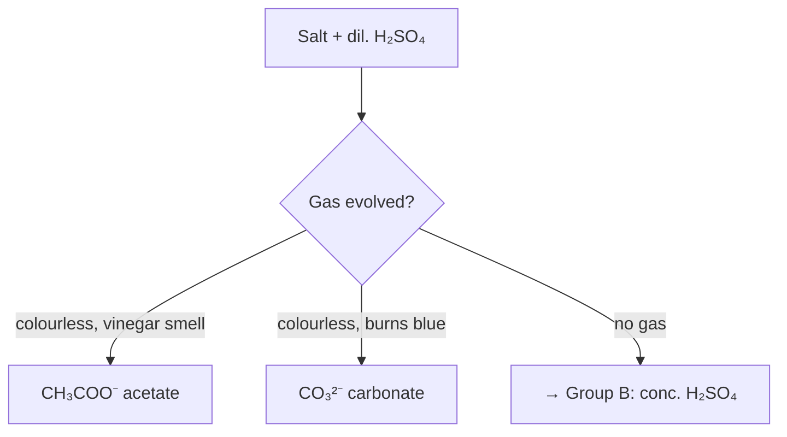

# Notes Formatting Rulebook — v1.1

**Authority.** This file is the single specification for every `notes.md` in this repo. Where it
and habit disagree, this wins. The six finished notes
([Equilibrium](../Physical-Chemistry/04-Equilibrium/notes.md),
[Redox](../Physical-Chemistry/05-Redox-Reactions/notes.md),
[Electrochemistry](../Physical-Chemistry/08-Electrochemistry/notes.md),
[d- and f-block](../Inorganic-Chemistry/07-The-d-and-f-Block-Elements/notes.md),
[Coordination](../Inorganic-Chemistry/08-Coordination-Compounds/notes.md),
[Salt Analysis](../Practical-Chemistry/Salt-Analysis/notes.md)) are the **reference
implementation** — every rule below was extracted from what they already do.

**Companion docs:** [`OBSIDIAN-SETUP.md`](OBSIDIAN-SETUP.md) (full plugin catalogue) ·
[`OBSIDIAN-VAULT-PLAN.md`](OBSIDIAN-VAULT-PLAN.md) (repo → vault conversion).

**The prime directive:**

> A `notes.md` must render **identically well on github.com and in Obsidian**, must stay
> **plain-text diffable**, and must be **readable when printed in black and white**.
> Anything Obsidian-only is allowed *only* if Rule R19's fallback is also present.

---

## Part 0 — The five non-negotiables

| # | Rule |
|---|---|
| **N1** | Exactly **one `notes.md` per chapter folder**, named `notes.md`. Never `Notes.md`, never `chapter-4.md`. The fetch script and every index detect that exact filename. |
| **N2** | **GitHub-safe markdown** in every committed file: GFM tables, Mermaid, `$…$`/`$$…$$`, fenced ASCII, relative links. No `[[wikilinks]]`, no `> [!callout]`, no Dataview blocks, no `\ce{}`. |
| **N3** | House markers used with their fixed meanings: **🅰** Allen-only · **🆇** beyond-NCERT/Advanced · **⚠** trap · **✅** written · **⏳** pending. |
| **N4** | Every section heading carries **NCERT's own section number** in parentheses — `(8.7.5)` — so the PDF and the notes can be read side by side. |
| **N5** | Every `notes.md` ends with a **Quick Revision Sheet** and a **cross-links footer**. |

---

## Part 1 — Files, folders and ownership

### R1 — File inventory of a chapter folder

```
Physical-Chemistry/04-Equilibrium/
├── notes.md          ← you + Arena AI write this      (rule book applies)
├── cards.md          ← optional study layer            (§Part 7, Obsidian-only syntax allowed)
├── figures/          ← optional: structures.md + mol/*.svg (R18), map, Excalidraw SVG
├── kech106.pdf       ← NCERT chapter                   (fetched by the script)
├── <module>.pdf      ← Allen module, if uploaded       (dropped in by hand)
└── README.md         ← ⚠ GENERATED. Never hand-edit.
```

> **⚠ Stray PDFs become "Module PDFs".** The script lists *every* top-level `.pdf` in a chapter
> folder (other than the NCERT file) as a **Module PDF** row on the chapter card. A print-to-PDF
> export or an annotated copy saved next to `notes.md` therefore shows up as if it were an Allen
> module. Exports and annotated copies go in `figures/` (the script only scans the top level) or
> outside the repo.

### R2 — Ownership boundary (the rule people break)

| File | Owner | Hand-edit? |
|---|---|---|
| `*/README.md` (chapter cards) | `scripts/fetch_ncert_pdfs.py` | ❌ **Never** — re-running the script silently overwrites your edit |
| `Physical-/Inorganic-/Organic-Chemistry/README.md` (branch indexes) | the script | ❌ Never |
| `README.md` (repo root), `Practical-Chemistry/**/README.md` | you (the script has no Practical branch) | ✅ |
| `notes.md`, `cards.md`, `figures/`, `docs/` | you + Arena AI | ✅ |
| Chapter numbering / branch assignment | `BRANCH_OF` dict in the script | ✅ edit there, then `git mv` the folder and re-run with `--layout` |

If a chapter card's "Notes" line is wrong, the fix is to create or delete `notes.md` and re-run
the script — not to edit the card.

### R3 — Frontmatter

`notes.md` and `cards.md` **may** carry YAML frontmatter. Script-generated `README.md` files
**must not** (it would be overwritten, and the cards use a metadata *table* instead).

```yaml
---
branch: Physical Chemistry
chapter: Equilibrium
class: 11
ncert_unit: 6
ncert_code: kech106
edition: rationalised
exams: [JEE Main, JEE Advanced]
sources: [kech106.pdf]          # add the module PDF filename once uploaded
status: written                 # draft | written | reviewed
words: 15206
updated: 2026-09-24
tags: [chemistry/physical, jee/main, jee/advanced]
---
```

Frontmatter is what makes Dataview, Bases and the progress dashboard work — see the vault plan.
It renders as a properties panel in Obsidian and is invisible on GitHub.

### R4 — Names and attachments

- New files: `lowercase-hyphen.md`, no spaces. (The Allen PDFs already in the repo have spaces —
  keep them, but **URL-encode** every link: `[`Salt Analysis_Theory_26.pdf`](Salt%20Analysis_Theory_26.pdf)`.)
- Images/diagrams go in the chapter's `figures/`. Commit **SVG**, not PNG (text, smaller, and it
  keeps the repo inside the artifact-size budget).
- One attachment folder per chapter, never a global `assets/` — attachments must travel with the
  chapter when `BRANCH_OF` changes.

---

## Part 2 — Document skeleton

### R5 — Required order

```
1  # <Chapter> — JEE Main + Advanced Notes          (H1, exactly one)
2  > Sources merged into these notes  (blockquote + 2-col table + marker legend)
3  ## Contents                                      (Parts as links, sections as nested list)
4  # Part A — …                                     (H1 dividers, 3–5 parts)
5    ## 1. Section title (NCERT §x.y)               (H2, continuously numbered 1…N)
6      ### sub-point                                (H3, unnumbered)
7  ## N. Quick Revision Sheet                       (last numbered section)
8  ---  + *Cross-links:* footer
```

### R6 — Heading rules

| Rule | Detail |
|---|---|
| H1 | Title **and** Part dividers only. Never inside a section. |
| H2 | Numbered `## 1.` … `## N.` — continuous across the whole file, restarting nowhere |
| H3 | Unnumbered, ≤ 1 level below H2. Never H4 in a `notes.md` (use a bold lead-in instead) |
| Length | Heading text ≤ 70 characters so the Contents block stays on one line |
| NCERT § | Append `(8.7.5)` when the section maps to one; append the marker (`🆇`, `🅰`) when the *whole* section is Advanced-only or Allen-only |

### R7 — Anchor rules for the Contents block (GitHub's algorithm)

Lowercase → drop everything that is not a letter, digit, space or hyphen → spaces to hyphens.
Emoji, `≠`, `:`, `/`, `,`, `.` and `()` all vanish, which is why consecutive hyphens appear.
Real examples already in the repo:

| Heading | Anchor |
|---|---|
| `## 1. Classical idea: gain/loss of oxygen and hydrogen (7.1)` | `#1-classical-idea-gainloss-of-oxygen-and-hydrogen-71` |
| `## 6. Oxidation number ≠ formal charge ≠ real charge 🆇` | `#6-oxidation-number--formal-charge--real-charge-` |
| `## 11. n-factor, equivalent weight, normality 🆇` | `#11-n-factor-equivalent-weight-normality-` |

**Rule:** generate Contents anchors mechanically, never by eye; a Contents block must be
re-checkable with a script (see R33).

> **⚠ Obsidian does not resolve these slugs.** Obsidian ids headings by their literal text
> (`#1. Classical idea…` / `%20`), not by GitHub's kebab-case slug, so clicking a Contents link
> inside Obsidian gives *"Unable to find selection"*. This is a long-standing open feature
> request, not a setting. **Keep the GitHub slugs anyway** — GitHub is the published surface —
> and navigate in Obsidian with the core **Outline** pane (auto-built from headings, always
> correct). Never "fix" the Contents block with `[[#Heading]]` links: that breaks GitHub.
> The vault plan (Phase 5) specifies a small vault-local plugin that makes slug links clickable.

---

## Part 3 — Prose, notation and markers

### R8 — Unicode-first chemistry notation

Committed notes write formulas with **Unicode subscripts/superscripts in prose**, not LaTeX and
not `\ce{}` — because GitHub renders them everywhere (search, mobile, PDF export, plain `cat`).

| Use | Characters |
|---|---|
| Subscripts | `₀₁₂₃₄₅₆₇₈₉` → `H₂SO₄`, `K₄[Fe(CN)₆]`, `C₂H₅OH` |
| Superscripts | `⁰¹²³⁴⁵⁶⁷⁸⁹ ⁺ ⁻` → `MnO₄⁻`, `Fe³⁺`, `SO₄²⁻`, `mol⁻¹`, `cm³` |
| Arrows | `→` irreversible · `⇌` equilibrium · `⟶` with conditions · `↔` resonance · `⇄` fast both ways |
| Bonds / structure | `–` single · `═` or `=` double · `≡` triple · `⋯` H-bond · `:` lone pair |
| Maths in prose | `×  ·  ≈  ≠  ∝  ±  °  Δ  Σ  √  ∞` |
| Greek | `α β γ δ ε ζ η θ κ λ μ ν ξ π ρ σ τ φ χ ψ ω Ω` |
| Units | `kJ mol⁻¹`, `pm`, `Å`, `bar`, `S cm² mol⁻¹`, `V`, `C mol⁻¹` (space before unit, negative exponents not `/`) |

**LaTeX** (`$…$`, `$$…$$`) is for *mathematics*, not for writing formulas:
`$$\log K = \frac{nE^\circ}{0.0591}$$`, `$$K_p = K_c(RT)^{\Delta n_g}$$`, `$$E = E^\circ - \frac{RT}{nF}\ln Q$$`.
`\ce{}` is **forbidden in committed notes** (GitHub has no mhchem) and allowed in `cards.md`.

### R9 — Reaction equations

```
Reactants → Products        (conditions in parentheses after the arrow, on the same line)
CH₃CH₂OH ⟶ CH₂═CH₂ + H₂O    (conc. H₂SO₄, 443–453 K)
N₂(g) + 3H₂(g) ⇌ 2NH₃(g)    (Fe/Mo catalyst, 200 atm, 773 K; ΔH = −92.4 kJ mol⁻¹)
```

- Always **balanced**; state symbols `(s)(l)(g)(aq)` used consistently within a section or not at all.
- Conditions carry the marks: reagent, catalyst, temperature, pressure — that is what JEE asks.
- Multi-step sequences: one reaction per line inside a fenced block, numbered `(1)`, `(2)`, so a
  mechanism can be referenced as "step 2".

### R10 — Markers

| Marker | Meaning | Placement | Constraint |
|---|---|---|---|
| 🅰 | Comes from the **Allen module**, not NCERT | End of heading, or start of the bullet | **Only if the module PDF is actually in the folder.** Where it isn't, the source table must say *"not uploaded yet"* and every beyond-NCERT point is 🆇 instead |
| 🆇 | Beyond NCERT, needed for **JEE Advanced** | End of heading, or start of the bullet | Never on a bullet that NCERT states explicitly |
| ⚠ | A **trap** / the wrong answer most students give | Start of the bullet or inside the warning block | Must state the wrong belief *and* the correction |
| ✅ / ⏳ | Notes written / pending | **Only** in indexes and cards | Generated by the script — never typed by hand |

One marker per bullet, never two. Markers are for scanning; if a whole section is 🆇, tag the
heading, not every bullet.

### R11 — Warnings and asides (GitHub-safe callouts)

```markdown
> **⚠ The single most common error:** treating an *average* oxidation number as if every atom
> carried it. `Na₂S₂O₃` → S = +2 on average, but structurally one S is −2 and the other +6.
```

| Want | Committed notes use | Obsidian-only equivalent (private files) |
|---|---|---|
| Trap | `> **⚠ …**` | `> [!warning] ⚠ …` |
| Key result | `> **★ …**` or `> **Key:**` | `> [!important]` |
| Derivation aside | `> **Note:**` | `> [!note]` |
| Mnemonic | `> **Mnemonic:**` | `> [!tip]` |
| Worked example | `**Example.**` bold lead-in | `> [!example]` |

### R12 — Emphasis and links

- **Bold** = a term being defined for the first time, or the answer inside a sentence. *Italic* =
  nomenclature, source names, nuance. `` `code` `` = formulas, values, filenames, codes (`kech106`).
  Never bold-italic; never CAPITALISE prose (ASCII diagrams excepted).
- Bullets ≤ 3 lines. Paragraphs ≤ 5 lines. One idea per bullet.
- Links: relative markdown paths only. Link to a chapter's `notes.md` if it exists, otherwise to
  its `README.md` — exactly as Electrochemistry and Equilibrium already do. Cross-chapter links
  live in the footer, in reading order, each with a one-clause reason:

```markdown
*Cross-links:* [Equilibrium (Unit 6)](../04-Equilibrium/notes.md) — the E° ⇄ ΔG ⇄ K connection;
[d- and f-block](../../Inorganic-Chemistry/07-The-d-and-f-Block-Elements/notes.md) — the
KMnO₄/K₂Cr₂O₇ preparations behind §12.
```

---

## Part 4 — Tables

### R13 — When to use a table

| Situation | Use |
|---|---|
| ≥ 3 rows × ≥ 2 columns of **parallel** data | ✅ Table |
| Ordered rules applied in sequence (oxidation-number rules, IUPAC priority) | ✅ Numbered table |
| A vs B comparison (lanthanoids vs actinoids, SN1 vs SN2) | ✅ Two- or three-column table |
| A bank of formulas/constants | ✅ Two-column table (name → expression) |
| A sequence of steps with *reasoning* | ❌ Numbered list or Mermaid flowchart |
| One-off fact, or a single comparison | ❌ Prose sentence |
| Anything needing merged cells or nested bullets | ❌ Split into two tables |

### R14 — Table anatomy

| Rule | Detail |
|---|---|
| Columns | **≤ 6.** Beyond that, split the table or move a column into a second table |
| Cell width | ≤ 55 characters. Long cells use `<br>` for a line break — never a nested list |
| Header | Row 1 = header, row 2 = delimiter with alignment. No blank header cells |
| Alignment | Text `:---` left · numbers `---:` right · short codes/flags `:--:` centre |
| First column | The **lookup key**, sorted (alphabetically, or in rule-application order). Never a serial number unless the order *is* the content |
| Empty cells | Use `—`, never leave blank (blank cells break scanning and diff review) |
| Escaping | A literal pipe inside a cell is `\|` |
| Raw formatting | Keep the source pipes aligned (Advanced Tables does this on Tab) so git diffs show one changed row, not a reformatted block |
| Caption | If a table needs explaining, put one italic line **above** it: `*NCERT Table 7.1, extended.*` |

### R15 — The five canonical table types in this repo

| Type | Shape | Real example |
|---|---|---|
| **Source table** | 2 col, inside the header blockquote | every `notes.md`, lines 3–7 |
| **Rule / order table** | `#` \| Rule \| Notes & examples | Redox §4 (10 oxidation-number rules) |
| **Comparison bank** | Property \| A \| B (\| C) | d-block §17 lanthanoids vs actinoids |
| **Formula bank** | Quantity \| Expression \| When to use | Equilibrium §23, Electrochemistry §23 |
| **Species / data bank** | Species \| Value \| Why it matters | Redox §5 "nasty species" |

The **Quick Revision Sheet is never a table** — bullets only (R30).

### R16 — Table plugins and where each is used

| Job | Plugin | ID | Used for |
|---|---|---|---|
| ⭐ Author/edit every committed table | **Advanced Tables** | `table-editor-obsidian` | Tab between cells, auto-align pipes, sort rows, insert/delete rows, CSV export. This keeps the raw markdown diff-clean |
| Paste from Excel/Sheets | **Excel to Markdown Table** | *(search by name)* | Converting a spreadsheet of bond enthalpies / electrode potentials |
| Large reference datasets | **CSV Table** | `obsidian-csv-table` | A `figures/data.csv` (e.g. all of NCERT Table 7.1) rendered with sorting/filtering. **Keep a markdown copy in the note** — CSV blocks don't render on GitHub |
| Cell merging, vertical headers, styled study sheets | **Sheets Extended** | `sheets` | Private `cards.md` / revision sheets only — merged cells are Obsidian-only |
| List ⇄ table conversion | **Any Block** | `any-block` | Turning an existing bullet list into a table when revising a chapter |
| Quick empty table | **Table Generator** | `obsidian-table-generator` | Scaffolding |
| Clickable checkboxes in tables | **Markdown table checkboxes** | `table-checkboxes` | A "have I revised this?" checklist in `meta/Progress.md` |
| JSON ⇄ table | **JSON table** | `json-table` | Rare |
| **Live** tables computed from the vault | **Dataview** / core **Bases** | `dataview` | Progress dashboards in `meta/` only — never inside `notes.md` |
| ❌ **Do not use** | Notion-Like Tables / **DataLoom** | `notion-like-tables` | Stores row/column IDs in frontmatter and a separate definition file; unreadable on GitHub, unmaintained upstream, hostile to diffs. Violates N2 |

---

## Part 5 — Diagrams: tables, mindmaps, flowcharts, structures

### R17 — The decision matrix (pick the *lowest* rung that does the job)

| You are drawing… | System | Renders on GitHub? | Plugin to author/edit |
|---|---|---|---|
| A molecule's formula, an ion, a unit | **Unicode text** (R8) | ✅ | — |
| A balanced equation / ionic equation | Unicode, or `\ce{}` **in private files only** | ✅ / ❌ | LaTeX Suite (snippets), mhchem is core |
| A small structural formula, apparatus, orbital picture, energy profile, lattice | **ASCII in a fenced block** | ✅ | plain text; ASCII Tree Generator for trees |
| A process, decision tree, classification, cycle, reaction map | **Mermaid `flowchart`** | ✅ | Mermaid Tools, Mermaid Popup, Mermaid Link Navigator |
| A chapter overview / revision map | **Mindmap from the note's own outline** | ❌ (outline itself is the fallback ✅) | Mindmap Nextgen (markmap), Markmind, Canvas Mindmap |
| A flowsheet with loops and parallel branches (metallurgy, salt analysis) | **Mermaid** first; **PlantUML** only in private files | ✅ / ❌ | PlantUML (`obsidian-plantuml`) |
| A skeletal organic structure or reaction scheme | **SMILES code block** → drawn structure | ❌ raw string ✅ (readable) | Chem (`chem`), ChemEdit (`chemedit`) |
| A publication-grade skeletal formula / `chemfig` | **TikZJax** | ❌ | `tikzjax` |
| A curved-arrow mechanism, anything freehand | **Excalidraw** + committed SVG export | ✅ via the SVG | Excalidraw (`obsidian-excalidraw-plugin`) |
| A draw.io-style box diagram | **draw.io** | ❌ | `drawio` |
| A vault concept map (auto) | **ExcaliBrain** / graph view | ❌ | `excalibrain` |

### R18 — The chemical-structure ladder

Choose the lowest rung that communicates the point. Climbing rungs costs portability.

| Rung | Syntax | GitHub | Obsidian | Diffable | Use for |
|---|---|---|---|---|---|
| 1 | `CH₃CH₂OH`, `[Fe(CN)₆]⁴⁻` | ✅ | ✅ | ✅ | 95 % of cases — prose, tables, bullets |
| 2 | `$\ce{CH3CH2OH + [O] -> CH3CHO}$` | ❌ | ✅ | ✅ | Private `cards.md`, study sheets |
| 3 | ASCII drawing in a fence | ✅ | ✅ | ✅ | Conformations, apparatus, orbital splitting, `CrO₅` butterfly |
| 4 | ` ```smiles ` + `CC(=O)O` | string only | ✅ drawn | ✅ | Organic: every compound in a named-reaction table |
| 5 | `.mol` / `.cdxml` in `figures/` + exported SVG | ✅ SVG | ✅ editable | ✅ (SVG is text) | Multi-step schemes, isomer sets, stereochemistry |
| 6 | TikZJax `chemfig` | ❌ | ✅ | ✅ | When rung 5 isn't precise enough |
| 7 | Excalidraw hand-drawn | ✅ SVG export | ✅ | ⚠ noisy | Mechanisms with curved arrows |

> **⚠ Rung discipline.** The existing notes live on rungs 1 and 3 and that is *why* they read
> perfectly on GitHub. Rungs 4–5 are for structures whose *bonds* are the point (peroxide O–O,
> P–H, S–S, per-carbon O.S.). Redox §5 was the first user; organic chemistry will need them
> everywhere.

**The structure pipeline (rungs 4 + 5 together).** One table per chapter,
`figures/structures.md`, is the single source for every drawn structure:

```
| Label | SMILES | ID | O.S. | Check | Note |
|---|---|---|---|---|---|
| H₂SO₅ Caro's acid | OOS(=O)(=O)O | h2so5 | auto | S=+6 O=-2,-1 | one O–O |
```

Run `python scripts/render_structures.py <chapter>/figures/structures.md` (or `--all
--library docs/COMPOUND-LIBRARY.md`). The script (RDKit, CoordGen layout):

1. writes **`figures/mol/<ID>.svg`** per row. This is a normal SVG drawing *and* a Ketcher SVG:
   the molfile is embedded as `<desc id="ketcher-data" data-format="mol">`, so GitHub shows
   an image and ChemEdit opens the same file in Ketcher;
2. **computes the oxidation state of every atom** from the bonds (the more electronegative
   atom takes each bond; like atoms count 0; conventions N > Cl and P > H) and prints them in
   red. `O.S.` = `auto` / `-` (none) / `show:0,3` (only these atoms) / `1:+6` (override) /
   `H` (draw every hydrogen);
3. **asserts the `Check` column** (`S=+6`: every S is +6; `S=+5,0`: exactly these values;
   `S~+5/2`: average) plus "O.S. sum = charge", and exits non-zero on any mismatch;
4. regenerates the gallery table (`<!-- gallery:begin/end -->`) and the ` ```smiles ` block
   (`<!-- smiles:begin/end -->`) inside `structures.md`;
5. with `--library`, rebuilds [`COMPOUND-LIBRARY.md`](COMPOUND-LIBRARY.md) from every chapter.

**Who does what (Chem vs ChemEdit):**

| Place | Syntax | Plugin | GitHub shows |
|---|---|---|---|
| `notes.md` | ``, grouped in image tables | **ChemEdit** (opens the SVG in Ketcher) | the drawing |
| `figures/structures.md` | generated ` ```smiles ` block | **Chem** (live grid) | the SMILES text |
| `cards.md` | inline `` `$smiles=CCO` `` inside the question | **Chem** (turn on *Inline SMILES*) | the SMILES as code |
| `docs/COMPOUND-LIBRARY.md` | `\| Name \| SMILES \| Chapter \|` | **ChemEdit** *Insert SMILES from Library* | a table |

No ` ```smiles ` blocks and no `$smiles=` in `notes.md`: GitHub would show raw strings where a
drawing belongs. **Editing a structure:** change the SMILES in `structures.md` and rerun.
If you drew it in Ketcher, copy the SMILES out (right-click → *Copy SMILES*) into the table.
A Ketcher save rewrites `mol/<ID>.svg` in Ketcher's own style, without the O.S. labels, and
the next script run overwrites it anyway. RDKit is a **dev-only** dependency
(`pip install rdkit` in a local venv); readers never need it. First used in
[Redox §5](../Physical-Chemistry/05-Redox-Reactions/notes.md) (32 structures, including the
carbon O.S. ladder).

### R19 — The fallback rule (the one that protects the repo)

> **Every Obsidian-only visual must ship with a committed fallback in the same note**:
> an ASCII/Unicode equivalent, an exported **SVG** in `figures/`, or a table carrying the same
> information. A reader on github.com, on a phone browser, or with plugins disabled must never
> hit a hole.

Applies to: SMILES blocks, markmap/mindmap previews, PlantUML, Excalidraw embeds, TikZJax,
Dataview, CSV blocks, Sheets Extended merges.

### R20 — Mermaid house style



| Rule | Detail |
|---|---|
| Type | `flowchart TD` (hierarchy/decision) or `flowchart LR` (sequence/pipeline). Others only with a reason |
| Labels | Always in **double quotes**; `<br>` for line breaks; Unicode subscripts allowed |
| Node ids | Single letters or short ASCII words (`A`, `E1`, `ksp`) — never Unicode, never spaces |
| Size | ≤ 14 nodes per diagram. Bigger ⇒ split into two diagrams, or use a `subgraph` per Part |
| Edge meaning | `-->` normal · `-.->` exception/fails · `==>` dominant path · edge label in `\|"quotes"\|` |
| Styling | No `classDef`/`style` lines — themes and GitHub colour them differently |
| Caption | One italic line under the fence saying what the reader should take from it |
| Language tag | Exactly ` ```mermaid ` (lowercase) |

### R21 — ASCII house style

- Always inside a bare ` ``` ` fence (no language tag) so nothing tries to highlight it.
- ≤ 100 columns; box-drawing characters `│ ─ ┌ ┐ └ ┘ ├ ┤ ┬ ┴ ┼` are allowed and preferred over `+--+`.
- Label every atom and every arrow; put curved-arrow electron movement in words *under* the drawing
  ("lone pair on O attacks the carbonyl C; π electrons go up to O").
- One drawing = one idea. Two related drawings side by side are better than one wide drawing.

### R22 — Mindmaps: generated, never hand-maintained

A mindmap in this repo is a **view of the note's outline**, not a separate document. Mindmap
Nextgen (`obsidian-mindmap-nextgen`) renders headings/lists — including LaTeX and checkboxes —
so the `## Contents` block and the Quick Revision Sheet *become* a mindmap for free. Rules:

- Do **not** keep a parallel hand-drawn mindmap file: it drifts from the notes within a week.
- If a chapter needs a standalone map (e.g. Coordination isomerism), write it as a **nested bullet
  outline** in `figures/<chapter>-map.md`. Outlines render on GitHub *and* preview as a mindmap.
- Export to SVG only when printing.

| Plugin | ID | Fit |
|---|---|---|
| ⭐ **Mindmap Nextgen** | `obsidian-mindmap-nextgen` | markmap rendering of a note's outline, pin/unpin, collapse-all, LaTeX + checkboxes, per-note frontmatter settings |
| Markmind | `obsidian-markmind` | Rich maps (summaries, boundaries, linked nodes), embeds in markdown, outline → table, PDF annotation, image/PDF export |
| Enhancing Mindmap | `obsidian-enhancing-mindmap` | Editable maps with a mindmap ⇄ markdown toggle |
| Canvas Mindmap | `canvas-mindmap` | Mindmaps on the core Canvas with auto-layout |
| Mindmap | `mindmap` | vue3-mindmap based, right-click "new mindmap" |
| ExcaliBrain | `excalibrain` | Auto map of the **vault** from links/tags/frontmatter — parents, children, friends, siblings |
| ASCII Tree Generator | `ascii-tree-generator` | Indented outline → box-drawing ASCII tree in a code block. **GitHub-safe**, so it is the fallback for every mindmap |

### R23 — Where each visual system is used, chapter by chapter

| Chapter | Tables | Flowchart (Mermaid) | Mindmap | ASCII | Structures |
|---|---|---|---|---|---|
| **Equilibrium** | K-conversion bank, Le Chatelier 5-factor table, pH/salt-hydrolysis table, formula bank §23 | ✅ exists (§8 ICE-table logic); add: "which K do I use?" decision tree | Parts A/B/C outline → revision map | Titration curves, Ostwald dilution, buffer action | — |
| **Redox** | ✅ 10 rules, fixed-value ions, n-factor bank, species bank | ✅ exists (§1 three languages); add: balancing-method chooser | Oxidation-state map §18 as an outline tree | Latimer & Frost diagrams, Daniell cell | `CrO₅`, `H₂S₂O₈` ✅ exist |
| **Electrochemistry** | Cell-notation rules, battery comparison, Kohlrausch applications, trap list | ✅ exists (§4 Nernst forms); add: **products-of-electrolysis discharge rules** — the best flowchart candidate here | Conductance family tree | Galvanic cell, salt bridge, conductance cell, Pourbaix | — |
| **d- and f-block** | ✅ trends, oxidation states, halide/oxide stability | ✅ exists; add: K₂Cr₂O₇ and KMnO₄ **preparation flowsheets** | Lanthanoid vs actinoid comparison as a map | Crystal-field splitting, lanthanide contraction | — |
| **Coordination** | ✅ ligand classification, VBT hybridisation, nomenclature order | Isomer-counting decision tree; CFT strong/weak-field split | ⭐ **Isomerism taxonomy** — the single best mindmap in the repo (structural → ionisation/hydrate/linkage/coordination; stereo → geometrical/optical) | Octahedral/tetrahedral/square-planar splitting, Jahn–Teller | Complexes as SMILES/`chemedit` where useful |
| **Salt Analysis** | ✅ group reagents, flame colours, borax bead, anion summary | ⭐ **The whole chapter is a flowchart**: anion Groups A/B/C and cation Groups 0–VI with confirmatory tests | Group scheme as an outline | Charcoal cavity, borax bead apparatus | Precipitate colours |
| **Organic (when written)** | Named-reaction banks, reagent → product matrices, acidity/basicity orders, isomer counts | ⭐ **Functional-group interconversion maps**, reaction-mechanism decision trees (SN1 vs SN2 vs E1 vs E2), electrophile/Markovnikov prediction | Conversion ladders per chapter | Newman/sawhorse, chair conformations, energy profiles, resonance contributors | ⭐ **SMILES + ChemEdit** for every structure; Excalidraw for curved-arrow mechanisms |
| **Metallurgy — Physical 12 (module uploaded, notes pending)** | Concentration-method choice, reduction-temperature table | ⭐ Extraction flowsheets (Fe, Cu, Al, Zn, Ag/Au) — natural Mermaid | Ellingham-diagram reading order | Blast furnace, Bessemer, Hall–Héroult, electrolytic refining | — |

### R24 — Plugin summary for the four visual systems

| System | Best plugin | ID | Second choice | Fallback that keeps GitHub working |
|---|---|---|---|---|
| **Tables** | Advanced Tables | `table-editor-obsidian` | Sheets Extended `sheets` (private only) | Plain GFM markdown — always works |
| **Mindmaps** | Mindmap Nextgen | `obsidian-mindmap-nextgen` | Markmind `obsidian-markmind` | The nested outline itself, or ASCII Tree Generator `ascii-tree-generator` |
| **Flowcharts** | Mermaid (**core**) + Mermaid Tools | `mermaid-tools` | PlantUML `obsidian-plantuml` (private), draw.io `drawio`, Excalidraw | Mermaid renders natively on GitHub; Excalidraw → committed SVG |
| **Chemical structures** | ChemEdit (Ketcher SVGs in `notes.md`, compound library) + Chem (`smiles` galleries, inline in cards), split as in R18 | `chemedit` + `chem` | Ketcher `ketcher`, Chemical Structure Renderer `chemical-structure-renderer`, TikZJax `tikzjax` | The generated SVG itself (it renders on GitHub), plus Unicode formulas / ASCII (rungs 1 & 3) |
| *(support)* PDFs beside notes | PDF++ | `pdf-plus` | Annotator `obsidian-annotator` | — |
| *(support)* Module PDF → text for Arena AI | Marker PDF to MD | `marker-api` | Text Extractor `text-extractor` | — |

---

## Part 6 — Sections, examples and the revision sheet

### R25 — Section internal order (the repeating unit)

```
## N. Title (NCERT §x.y)
   1–2 sentence answer-first statement of what this is and why JEE asks it
   The rule / the expression / the table
   Worked pattern(s), labelled "Example."
   > **⚠ …** trap block, if there is one
   Pointer to where this is used again ("see §17")
```

Answer-first: the fact comes before the derivation. A revision reader must get the result from the
first line of each section.

### R26 — Worked examples

- Label with a bold lead-in `**Example.**` or `**Pattern 3.**`, never a heading (headings would
  enter the Contents block).
- Show the *decision*, not just the arithmetic: "Kp is asked, Δn_g = −1, so …".
- End every example with the answer in bold on its own line.
- Group repeated shapes into a "**Worked problem patterns**" or "**Solved-example patterns**"
  section near the end, as Equilibrium §24, Redox §20 and Coordination §17 already do.

### R27 — Numbers, constants and units

| Item | Rule |
|---|---|
| Constants | Use **NCERT's** values and say so: `F = 96487 C mol⁻¹` (note that solutions often use 96500), `R = 8.314 J K⁻¹ mol⁻¹`, `N_A = 6.022 × 10²³` |
| Significant figures | Match the data given; never imply more precision than the question |
| Sign conventions | State them explicitly where students lose marks (ΔG negative = spontaneous; E° positive = spontaneous) |
| Temperature | Kelvin in calculations, °C when quoting a lab condition — always with the unit |
| Every memorised number | Must appear in the Quick Revision Sheet |

### R28 — Length targets

| Chapter type | Words | Sections |
|---|---|---|
| Core Class-XI physical (Equilibrium) | 12 000 – 16 000 | 24 – 28 |
| Standard chapter (Redox, Electrochemistry, d-block) | 9 000 – 12 000 | 20 – 24 |
| Smaller/factual chapter (Coordination, Salt Analysis) | 4 500 – 7 000 | 17 – 23 |
| Advanced-only legacy chapter | 5 000 – 8 000 | 15 – 20 |

Depth is measured in *exam-relevant distinctions*, not words. A section that adds no decision rule,
number, exception or trap should be cut.

---

## Part 7 — Study layer

### R29 — `cards.md`

- Optional sibling file per chapter; **Obsidian-only syntax is allowed here** (`\ce{}`,
  `> [!warning]`, `[[wikilinks]]`) because it is a study file, not a published note.
- Tag scheme: `#flashcards/<branch>/<chapter>` e.g. `#flashcards/inorganic/coordination`.
- Syntax (Spaced Repetition / Aosr / Flashcards all read `::`):
  - one-line: `Question?::Answer`
  - multi-line: `::` on its own line between question and answer
  - cloze for lists: `The three bidentate ligands to know are {{en, ox, dmg}}`
- One fact per card, ≤ 3 lines per side, question phrased to force recall ("Why…", "Order…",
  "Predict…") rather than recognition.
- Never duplicate a whole paragraph as a card — card the *decision rule* inside it.

### R30 — Quick Revision Sheet

- The **last numbered H2** of every `notes.md`, titled exactly `Quick Revision Sheet`.
- Bullets only (no tables, no diagrams), ≤ 30 bullets, ≤ 3 lines each.
- Every bullet is a *recallable* fact containing a number, an order, an exception or a rule.
- No new content: anything in the sheet must appear earlier in the notes.
- Followed by `---` and the `*Cross-links:*` footer.

### R31 — Status and progress

| Where | Form | Owner |
|---|---|---|
| Chapter card `## Notes` | sentence linking `notes.md`, or the HTML placeholder comment | the script |
| Branch index `Notes` column | `✅ notes.md` / `⏳ pending` | the script |
| Root README *Notes status* table | ✅/⏳ + what was covered | you |
| `meta/Progress.md` (optional) | Dataview queries | you |

Never hand-write ✅ into a script-owned file.

---

## Part 8 — Quality gate

### R32 — Pre-commit checklist

- [ ] One `notes.md`, correct folder, filename exact (N1)
- [ ] Frontmatter present and truthful (`status`, `updated`, `words`, `sources`)
- [ ] Exactly one H1 title; Parts are H1; H2 numbering continuous, no gaps or duplicates
- [ ] Every heading's NCERT section number present where one exists (N4)
- [ ] Contents block: every link resolves; anchors generated mechanically (R7)
- [ ] No `[[wikilinks]]`, no `> [!…]`, no `\ce{}`, no Dataview in a committed note (N2)
- [ ] Every table: ≤ 6 columns, aligned delimiters, no empty cells, ≤ 55-char cells
- [ ] Every Mermaid fence: `flowchart`, quoted labels, ≤ 14 nodes, caption below, renders on GitHub
- [ ] Every ASCII drawing inside a bare fence, ≤ 100 columns
- [ ] Every Obsidian-only visual has its R19 fallback
- [ ] Markers: 🅰 only where the module PDF is in the folder; one marker per bullet
- [ ] Quick Revision Sheet present, bullets only, no new facts (R30)
- [ ] Cross-links footer: relative links, `notes.md` where it exists else `README.md`, spaces URL-encoded
- [ ] Script-generated files untouched (R2)
- [ ] Word count inside the R28 band for the chapter type

### R33 — Automation

The checklist is mechanical enough to script. A `scripts/check_notes.py` should verify, for every
`notes.md`: single H1, continuous H2 numbering, Contents anchors resolving against generated
slugs, presence of `Quick Revision Sheet`, absence of `[[`, `> [!`, `\ce{`, `dataview`, table
pipe-count consistency per block, Mermaid node counts, and word-count bands — exiting non-zero
with a per-file report. Run it before committing and, ideally, in a GitHub Action on pull
requests. *(Not yet written — spec only.)*

---

## Appendix A — Copy-paste skeleton

```markdown
---
branch: Inorganic Chemistry
chapter: Coordination Compounds
class: 12
ncert_unit: 5
ncert_code: lech105
edition: rationalised
exams: [JEE Main, JEE Advanced]
sources: [lech105.pdf, 3-JAEIC-Coordination Compound_Eng.pdf.pdf]
status: written
updated: 2026-09-24
---

# Coordination Compounds — JEE Main + Advanced Notes

> **Sources merged into these notes**
> | Source | File |
> |---|---|
> | NCERT Class XII Chemistry (rationalised, 2023+), Unit 5 | [`lech105.pdf`](lech105.pdf) |
> | Allen — Coordination Compound module | [`3-JAEIC-Coordination Compound_Eng.pdf.pdf`](3-JAEIC-Coordination%20Compound_Eng.pdf.pdf) |
>
> 🅰 = Allen-only content; 🆇 = extra JEE-Advanced point; ⚠ = trap.

## Contents

- [Part A — Foundations](#part-a--foundations)
  1. [Introduction & Addition Compounds](#1-introduction--addition-compounds)

---

# Part A — Foundations

## 1. Introduction & Addition Compounds

Answer-first statement.

| Property | Value | When it matters |
|---|---:|---|
| — | — | — |

> **⚠ Trap:** the wrong belief, and the correction.

---

## N. Quick Revision Sheet

- Fact with a number or an order.

---

*Cross-links:* [d- and f-block](../../Inorganic-Chemistry/07-The-d-and-f-Block-Elements/notes.md) — reason.
```

## Appendix B — Changelog

| Version | Date | Change |
|---|---|---|
| 1.1 | 2026-09-26 | R18: structure pipeline v2 (per-molecule Ketcher SVGs, computed and checked O.S. labels, compound library) and the Chem/ChemEdit division of labour; R1, R24 updated |
| 1.0 | 2026-09-24 | First issue. Codified the conventions of the six finished notes; added the four-visual-system decision matrix (R17–R24), the GitHub/Obsidian portability rules (N2, R8, R19) and the quality gate (R32) |
