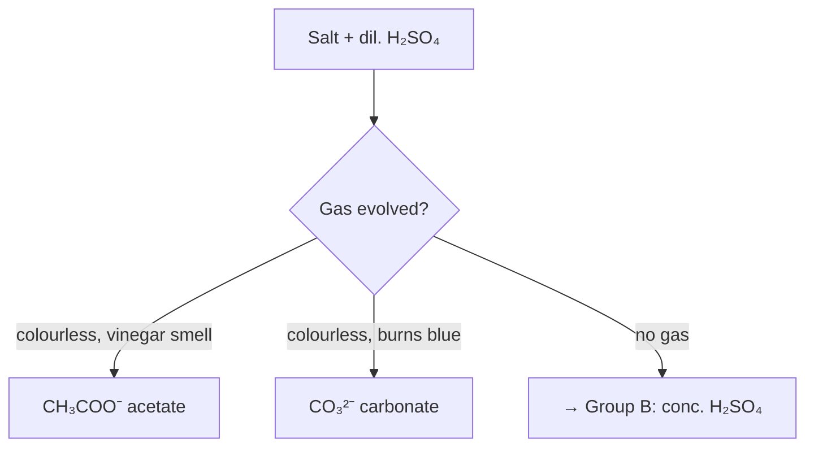

# Notes Formatting Rulebook — v1.2

**Authority.** This file is the single specification for every `notes.md` in this repo. Where
it and habit disagree, this wins. It is enforced mechanically: all 22 written notes pass
[`scripts/check_notes.py`](../scripts/check_notes.py) with zero findings, and
[`scripts/quote_mermaid_labels.py`](../scripts/quote_mermaid_labels.py) applies the
mechanical half of R20.

**Companion docs:** [`OBSIDIAN-SETUP.md`](OBSIDIAN-SETUP.md) (open the vault, plugins, Git
settings) · [`../README.md`](../README.md) (layout, status, scripts) ·
[`../meta/templates/chapter-notes.md`](../meta/templates/chapter-notes.md) (the skeleton to
start a note from).

**The prime directive:**

> A `notes.md` must render **identically well on github.com and in Obsidian**, must stay
> **plain-text diffable**, and must be **readable when printed in black and white**.
> Anything Obsidian-only is allowed *only* if Rule R19's fallback is also present.

---

## Part 0 — The six non-negotiables

| # | Rule |
|---|---|
| **N1** | Exactly **one `notes.md` per chapter folder**, named `notes.md`. Never `Notes.md`, never `chapter-4.md`. The fetch script and every index detect that exact filename. |
| **N2** | **GitHub-safe markdown** in every committed file: GFM tables, Mermaid, `$…$`/`$$…$$`, `$\ce{…}$`, relative links, ChemEdit SVGs. **No bare ASCII fences**. No `[[wikilinks]]`, no `> [!callout]`, no Dataview blocks. |
| **N6** | **No terminal-like ASCII diagrams.** Every diagram must be rendered by Obsidian plugins: Mermaid `flowchart`, `smiles` + Chem/ChemEdit SVG, Excalidraw SVG, or LaTeX `$\ce{}$`. Bare ` ``` ` fences are forbidden — use ` ```mermaid `, ` ```smiles `, or a named language. |
| **N3** | House markers used with their fixed meanings: **🅰** Allen-only · **🆇** beyond-NCERT/Advanced · **⚠** trap · **✅** written · **⏳** pending. |
| **N4** | Every section heading carries **NCERT's own section number** in parentheses — `(8.7.5)` — so the PDF and the notes can be read side by side. |
| **N5** | Every `notes.md` ends with a **Quick Revision Sheet** and a **cross-links footer**. |

---

## Part 1 — Files, folders and ownership

### R1 — File inventory of a chapter folder

```text
Physical-Chemistry/04-Equilibrium/
├── notes.md          ← you + Arena AI write this      (rule book applies)
├── cards.md          ← optional study layer            (§Part 7, Obsidian-only syntax allowed)
├── figures/          ← optional: structures.md + mol/*.svg (R18), map, Excalidraw SVG
├── kech106.pdf       ← NCERT chapter                   (fetched by the script)
├── <module>.pdf      ← Allen module, if uploaded       (dropped in by hand)
└── README.md         ← ⚠ GENERATED. Never hand-edit.
```

> **⚠ Stray PDFs become "Module PDFs".** The script lists *every* top-level `.pdf` in a chapter
> folder (other than the NCERT file) as a **Module PDF** row on the chapter card. A print-to-PDF
> export or an annotated copy saved next to `notes.md` therefore shows up as if it were an Allen
> module. Exports and annotated copies go in `figures/` (the script only scans the top level) or
> outside the repo.

### R2 — Ownership boundary (the rule people break)

| File | Owner | Hand-edit? |
|---|---|---|
| `*/README.md` (chapter cards) | `scripts/fetch_ncert_pdfs.py` | ❌ **Never** — re-running the script silently overwrites your edit |
| `Physical-/Inorganic-/Organic-Chemistry/README.md` (branch indexes) | the script | ❌ Never |
| `README.md` (repo root), `Practical-Chemistry/**/README.md` | you (the script has no Practical branch) | ✅ |
| `notes.md`, `cards.md`, `figures/`, `docs/` | you + Arena AI | ✅ |
| Chapter numbering / branch assignment | `BRANCH_OF` dict in the script | ✅ edit there, then `git mv` the folder and re-run with `--layout` |

If a chapter card's "Notes" line is wrong, the fix is to create or delete `notes.md` and re-run
the script — not to edit the card.

### R3 — Frontmatter

`notes.md` and `cards.md` **may** carry YAML frontmatter. Script-generated `README.md` files
**must not** (it would be overwritten, and the cards use a metadata *table* instead).

```yaml
---
branch: Physical Chemistry
chapter: Equilibrium
class: 11
ncert_unit: 6
ncert_code: kech106
edition: rationalised
exams: [JEE Main, JEE Advanced]
sources: [kech106.pdf]          # add the module PDF filename once uploaded
status: written                 # draft | written | reviewed
words: 16436
updated: 2026-09-24
tags: [chemistry/physical, jee/main, jee/advanced]
---
```

Frontmatter is what makes Dataview and the progress dashboard work — see
[`meta/Progress.md`](../meta/Progress.md).
It renders as a properties panel in Obsidian and is invisible on GitHub.

### R4 — Names and attachments

- New files: `lowercase-hyphen.md`, no spaces. (The Allen PDFs already in the repo have spaces —
  keep them, but **URL-encode** every link, e.g. from a chapter folder
  `[Salt Analysis_Theory_26.pdf](../Practical-Chemistry/Salt-Analysis/Salt%20Analysis_Theory_26.pdf)`.)
- Images/diagrams go in the chapter's `figures/`. Commit **SVG**, not PNG (text, smaller, and it
  keeps the repo inside the artifact-size budget).
- One attachment folder per chapter, never a global `assets/` — attachments must travel with the
  chapter when `BRANCH_OF` changes.

---

## Part 2 — Document skeleton

### R5 — Required order

```text
1  # <Chapter> — JEE Main + Advanced Notes          (H1, exactly one)
2  > Sources merged into these notes  (blockquote + 2-col table + marker legend)
3  ## Contents                                      (Parts as links, sections as nested list)
4  # Part A — …                                     (H1 dividers, 3–5 parts)
5    ## 1. Section title (NCERT §x.y)               (H2, continuously numbered 1…N)
6      ### sub-point                                (H3, unnumbered)
7  ## N. Quick Revision Sheet                       (last numbered section)
8  ---  + *Cross-links:* footer
```

### R6 — Heading rules

| Rule | Detail |
|---|---|
| H1 | Title **and** Part dividers only. Never inside a section. |
| H2 | Numbered `## 1.` … `## N.` — continuous across the whole file, restarting nowhere |
| H3 | Unnumbered, ≤ 1 level below H2. Never H4 in a `notes.md` (use a bold lead-in instead) |
| Length | Heading text ≤ 70 characters so the Contents block stays on one line |
| NCERT § | Append `(8.7.5)` when the section maps to one; append the marker (`🆇`, `🅰`) when the *whole* section is Advanced-only or Allen-only |

### R7 — Anchor rules for the Contents block (GitHub's algorithm)

Lowercase → drop everything that is not a letter, digit, space or hyphen → spaces to hyphens.
Emoji, `≠`, `:`, `/`, `,`, `.` and `()` all vanish, which is why consecutive hyphens appear.
Real examples already in the repo:

| Heading | Anchor |
|---|---|
| `## 1. Classical idea: gain/loss of oxygen and hydrogen (7.1)` | `#1-classical-idea-gainloss-of-oxygen-and-hydrogen-71` |
| `## 6. Oxidation number ≠ formal charge ≠ real charge 🆇` | `#6-oxidation-number--formal-charge--real-charge-` |
| `## 11. n-factor, equivalent weight, normality 🆇` | `#11-n-factor-equivalent-weight-normality-` |

**Rule:** generate Contents anchors mechanically, never by eye; a Contents block must be
re-checkable with a script (see R33).

> **⚠ Obsidian does not resolve these slugs.** Obsidian ids headings by their literal text
> (`#1. Classical idea…` / `%20`), not by GitHub's kebab-case slug, so clicking a Contents link
> inside Obsidian gives *"Unable to find selection"*. This is a long-standing open feature
> request, not a setting. **Keep the GitHub slugs anyway** — GitHub is the published surface —
> and navigate in Obsidian with the core **Outline** pane (auto-built from headings, always
> correct). Never "fix" the Contents block with `[[#Heading]]` links: that breaks GitHub.
> The dashboard at [`meta/Progress.md`](../meta/Progress.md) is the other half of the vault:
> Dataview turns the frontmatter below into a live table of the whole course.

---

## Part 3 — Prose, notation and markers

### R8 — Unicode-first chemistry notation

Committed notes write formulas with **Unicode subscripts/superscripts in prose**, not LaTeX and
not `\ce{}` — because GitHub renders them everywhere (search, mobile, PDF export, plain `cat`).

| Use | Characters |
|---|---|
| Subscripts | `₀₁₂₃₄₅₆₇₈₉` → `H₂SO₄`, `K₄[Fe(CN)₆]`, `C₂H₅OH` |
| Superscripts | `⁰¹²³⁴⁵⁶⁷⁸⁹ ⁺ ⁻` → `MnO₄⁻`, `Fe³⁺`, `SO₄²⁻`, `mol⁻¹`, `cm³` |
| Arrows | `→` irreversible · `⇌` equilibrium · `⟶` with conditions · `↔` resonance · `⇄` fast both ways |
| Bonds / structure | `–` single · `═` or `=` double · `≡` triple · `⋯` H-bond · `:` lone pair |
| Maths in prose | `×  ·  ≈  ≠  ∝  ±  °  Δ  Σ  √  ∞` |
| Greek | `α β γ δ ε ζ η θ κ λ μ ν ξ π ρ σ τ φ χ ψ ω Ω` |
| Units | `kJ mol⁻¹`, `pm`, `Å`, `bar`, `S cm² mol⁻¹`, `V`, `C mol⁻¹` (space before unit, negative exponents not `/`) |

**LaTeX** (`$…$`, `$$…$$`) is for *mathematics*, not for writing formulas:
`$$\log K = \frac{nE^\circ}{0.0591}$$`, `$$K_p = K_c(RT)^{\Delta n_g}$$`, `$$E = E^\circ - \frac{RT}{nF}\ln Q$$`.
**Redox exception:** `notes.md` now uses `$\ce{…}$` for reactions so they render as chemistry
on Android Obsidian (built-in MathJax/mhchem). GitHub may display raw `\ce` markup.
Keep Unicode formulas in prose and avoid converting non-reaction diagrams to math.

### R9 — Reaction equations

```text
Reactants → Products        (conditions in parentheses after the arrow, on the same line)
CH₃CH₂OH ⟶ CH₂═CH₂ + H₂O    (conc. H₂SO₄, 443–453 K)
N₂(g) + 3H₂(g) ⇌ 2NH₃(g)    (Fe/Mo catalyst, 200 atm, 773 K; ΔH = −92.4 kJ mol⁻¹)
```

- Always **balanced**; state symbols `(s)(l)(g)(aq)` used consistently within a section or not at all.
- Conditions carry the marks: reagent, catalyst, temperature, pressure — that is what JEE asks.
- Multi-step sequences: one reaction per line inside a fenced block, numbered `(1)`, `(2)`, so a
  mechanism can be referenced as "step 2".

### R10 — Markers

| Marker | Meaning | Placement | Constraint |
|---|---|---|---|
| 🅰 | Comes from the **Allen module**, not NCERT | End of heading, or start of the bullet | **Only if the module PDF is actually in the folder.** Where it isn't, the source table must say *"not uploaded yet"* and every beyond-NCERT point is 🆇 instead |
| 🆇 | Beyond NCERT, needed for **JEE Advanced** | End of heading, or start of the bullet | Never on a bullet that NCERT states explicitly |
| ⚠ | A **trap** / the wrong answer most students give | Start of the bullet or inside the warning block | Must state the wrong belief *and* the correction |
| ✅ / ⏳ | Notes written / pending | **Only** in indexes and cards | Generated by the script — never typed by hand |

One marker per bullet, never two. Markers are for scanning; if a whole section is 🆇, tag the
heading, not every bullet.

### R11 — Warnings and asides (GitHub-safe callouts)

```markdown
> **⚠ The single most common error:** treating an *average* oxidation number as if every atom
> carried it. `Na₂S₂O₃` → S = +2 on average, but structurally one S is −2 and the other +6.
```

| Want | Committed notes use | Obsidian-only equivalent (private files) |
|---|---|---|
| Trap | `> **⚠ …**` | `> [!warning] ⚠ …` |
| Key result | `> **★ …**` or `> **Key:**` | `> [!important]` |
| Derivation aside | `> **Note:**` | `> [!note]` |
| Mnemonic | `> **Mnemonic:**` | `> [!tip]` |
| Worked example | `**Example.**` bold lead-in | `> [!example]` |

### R12 — Emphasis and links

- **Bold** = a term being defined for the first time, or the answer inside a sentence. *Italic* =
  nomenclature, source names, nuance. `` `code` `` = formulas, values, filenames, codes (`kech106`).
  Never bold-italic; never CAPITALISE prose (ASCII diagrams excepted).
- Bullets ≤ 3 lines. Paragraphs ≤ 5 lines. One idea per bullet.
- Links: relative markdown paths only. Link to a chapter's `notes.md` if it exists, otherwise to
  its `README.md` — exactly as Electrochemistry and Equilibrium already do. Cross-chapter links
  live in the footer, in reading order, each with a one-clause reason:

```markdown
*Cross-links:* [Equilibrium (Unit 6)](../04-Equilibrium/notes.md) — the E° ⇄ ΔG ⇄ K connection;
[d- and f-block](../../Inorganic-Chemistry/07-The-d-and-f-Block-Elements/notes.md) — the
KMnO₄/K₂Cr₂O₇ preparations behind §12.
```

---

## Part 4 — Tables

### R13 — When to use a table

| Situation | Use |
|---|---|
| ≥ 3 rows × ≥ 2 columns of **parallel** data | ✅ Table |
| Ordered rules applied in sequence (oxidation-number rules, IUPAC priority) | ✅ Numbered table |
| A vs B comparison (lanthanoids vs actinoids, SN1 vs SN2) | ✅ Two- or three-column table |
| A bank of formulas/constants | ✅ Two-column table (name → expression) |
| A sequence of steps with *reasoning* | ❌ Numbered list or Mermaid flowchart |
| One-off fact, or a single comparison | ❌ Prose sentence |
| Anything needing merged cells or nested bullets | ❌ Split into two tables |

### R14 — Table anatomy

| Rule | Detail |
|---|---|
| Columns | **≤ 6.** Beyond that, split the table or move a column into a second table |
| Cell width | ≤ 55 characters. Long cells use `<br>` for a line break — never a nested list |
| Header | Row 1 = header, row 2 = delimiter with alignment. No blank header cells |
| Alignment | Text `:---` left · numbers `---:` right · short codes/flags `:--:` centre |
| First column | The **lookup key**, sorted (alphabetically, or in rule-application order). Never a serial number unless the order *is* the content |
| Empty cells | Use `—`, never leave blank (blank cells break scanning and diff review) |
| Escaping | A literal pipe inside a cell is `\|` |
| Raw formatting | Keep the source pipes aligned (Advanced Tables does this on Tab) so git diffs show one changed row, not a reformatted block |
| Caption | If a table needs explaining, put one italic line **above** it: `*NCERT Table 7.1, extended.*` |

### R15 — The five canonical table types in this repo

| Type | Shape | Real example |
|---|---|---|
| **Source table** | 2 col, inside the header blockquote | every `notes.md`, lines 3–7 |
| **Rule / order table** | `#` \| Rule \| Notes & examples | Redox §4 (10 oxidation-number rules) |
| **Comparison bank** | Property \| A \| B (\| C) | d-block §17 lanthanoids vs actinoids |
| **Formula bank** | Quantity \| Expression \| When to use | Equilibrium §23, Electrochemistry §23 |
| **Species / data bank** | Species \| Value \| Why it matters | Redox §5 "nasty species" |

The **Quick Revision Sheet is never a table** — bullets only (R30).

### R16 — Table plugins

A committed table is **plain GFM markdown** — that is the whole point: it renders on GitHub
with no plugin and diffs cleanly. The plugin layer is editing convenience only.

| Rule | Detail |
|---|---|
| Authoring | **Advanced Tables** `table-editor-obsidian` — tab between cells, auto-align pipes, sort, insert rows. Keeps the raw markdown intact |
| Never | **DataLoom** / Notion-Like Tables — they store row and column IDs in frontmatter plus a separate definition file, so the table is unreadable on GitHub and unreadable in a diff. Violates N2 |
| Never | a table that exists **only** as a Dataview or CSV block — the values must be readable in the committed markdown |
| Private only | **Sheets Extended** `sheets` (merged cells, styled sheets) may be used in `cards.md` and other study files, never in `notes.md` |

`docs/OBSIDIAN-SETUP.md` carries the rest of the plugin catalogue.
---

## Part 5 — Diagrams: tables, mindmaps, flowcharts, structures

### R17 — The decision matrix (pick the *lowest* rung that does the job)

| You are drawing… | System | Renders on GitHub? | Plugin to author/edit |
|---|---|---|---|
| A molecule's formula, an ion, a unit | **Unicode text** (R8) | ✅ | — |
| A balanced equation / ionic equation | `$\ce{…}$` (mhchem) — **allowed in committed notes for reactions**, or Unicode | ✅ GitHub renders via MathJax, Obsidian via mhchem | LaTeX Suite (snippets), mhchem is core |
| A small structural formula, apparatus, orbital picture, energy profile, lattice | **Mermaid `flowchart`** or ChemEdit SVG — **no ASCII art** (R21 deprecated) | ✅ | Mermaid Tools, ChemEdit |
| A process, decision tree, classification, cycle, reaction map | **Mermaid `flowchart`** | ✅ | Mermaid Tools, Mermaid Popup, Mermaid Link Navigator |
| A chapter overview / revision map | **Mindmap from the note's own outline** | ❌ (outline itself is the fallback ✅) | Mindmap Nextgen (markmap), Markmind, Canvas Mindmap |
| A flowsheet with loops and parallel branches (metallurgy, salt analysis) | **Mermaid** — mandatory; PlantUML forbidden in committed notes | ✅ | Mermaid |
| A skeletal organic structure or reaction scheme | **SMILES code block** → drawn structure + ChemEdit SVG | ✅ SVG + string | Chem (`chem`), ChemEdit (`chemedit`) |
| A publication-grade skeletal formula / `chemfig` | **TikZJax** | ❌ | `tikzjax` |
| A curved-arrow mechanism, anything freehand | **Excalidraw** + committed SVG export | ✅ via the SVG | Excalidraw (`obsidian-excalidraw-plugin`) |
| A draw.io-style box diagram | **draw.io** | ❌ | `drawio` |
| A vault concept map (auto) | **ExcaliBrain** / graph view | ❌ | `excalibrain` |

### R18 — The chemical-structure ladder

Choose the lowest rung that communicates the point. Climbing rungs costs portability.

| Rung | Syntax | GitHub | Obsidian | Diffable | Use for |
|---|---|---|---|---|---|
| 1 | `CH₃CH₂OH`, `[Fe(CN)₆]⁴⁻` | ✅ | ✅ | ✅ | 95 % of cases — prose, tables, bullets |
| 2 | `$\ce{CH3CH2OH + [O] -> CH3CHO}$` | ✅ (GitHub MathJax + Obsidian mhchem) | ✅ | ✅ | **Reactions in committed notes** — preferred over ASCII |
| 3 | **DEPRECATED** ASCII drawing — use Mermaid or ChemEdit SVG instead | ❌ forbidden by N6 | ❌ | ❌ | No longer allowed — convert to rungs 2,4,5,7 |
| 4 | ` ```smiles ` + `CC(=O)O` + `figures/mol/*.svg` | ✅ SVG + string | ✅ drawn | ✅ | Organic: every compound; also replaces old ASCII butterfly structures |
| 5 | `.mol` / `.cdxml` in `figures/` + exported SVG | ✅ SVG | ✅ editable | ✅ (SVG is text) | Multi-step schemes, isomer sets, stereochemistry |
| 6 | TikZJax `chemfig` | ❌ | ✅ | ✅ | When rung 5 isn't precise enough |
| 7 | Excalidraw hand-drawn | ✅ SVG export | ✅ | ⚠ noisy | Mechanisms with curved arrows |

> **⚠ Rung discipline.** The existing notes live on rungs 1 and 3 and that is *why* they read
> perfectly on GitHub. Rungs 4–5 are for structures whose *bonds* are the point (peroxide O–O,
> P–H, S–S, per-carbon O.S.). Redox §5 was the first user; organic chemistry will need them
> everywhere.

**The structure pipeline (rungs 4 + 5 together).** One table per chapter,
`figures/structures.md`, is the single source for every drawn structure:

```markdown
| Label | SMILES | ID | O.S. | Check | Note |
|---|---|---|---|---|---|
| H₂SO₅ Caro's acid | OOS(=O)(=O)O | h2so5 | auto | S=+6 O=-2,-1 | one O–O |
```

Run `python scripts/render_structures.py <chapter>/figures/structures.md` (or `--all
--library docs/COMPOUND-LIBRARY.md`). The script (RDKit, CoordGen layout):

1. writes **`figures/mol/<ID>.svg`** per row. This is a normal SVG drawing *and* a Ketcher SVG:
   the molfile is embedded as `<desc id="ketcher-data" data-format="mol">`, so GitHub shows
   an image and ChemEdit opens the same file in Ketcher;
2. **computes the oxidation state of every atom** from the bonds (the more electronegative
   atom takes each bond; like atoms count 0; conventions N > Cl and P > H) and prints them in
   red. `O.S.` = `auto` / `-` (none) / `show:0,3` (only these atoms) / `1:+6` (override) /
   `H` (draw every hydrogen);
3. **asserts the `Check` column** (`S=+6`: every S is +6; `S=+5,0`: exactly these values;
   `S~+5/2`: average) plus "O.S. sum = charge", and exits non-zero on any mismatch;
4. regenerates the gallery table (`<!-- gallery:begin/end -->`) and the ` ```smiles ` block
   (`<!-- smiles:begin/end -->`) inside `structures.md`;
5. with `--library`, rebuilds [`COMPOUND-LIBRARY.md`](COMPOUND-LIBRARY.md) from every chapter.

**Who does what (Chem vs ChemEdit):**

| Place | Syntax | Plugin | GitHub shows |
|---|---|---|---|
| `notes.md` | ``, grouped in image tables | **ChemEdit** (opens the SVG in Ketcher) | the drawing |
| `figures/structures.md` | generated ` ```smiles ` block | **Chem** (live grid) | the SMILES text |
| `cards.md` | inline `` `$smiles=CCO` `` inside the question | **Chem** (turn on *Inline SMILES*) | the SMILES as code |
| `docs/COMPOUND-LIBRARY.md` | `\| Name \| SMILES \| Chapter \|` | **ChemEdit** *Insert SMILES from Library* | a table |

No ` ```smiles ` blocks and no `$smiles=` in `notes.md`: GitHub would show raw strings where a
drawing belongs. **Editing a structure:** change the SMILES in `structures.md` and rerun.
If you drew it in Ketcher, copy the SMILES out (right-click → *Copy SMILES*) into the table.
A Ketcher save rewrites `mol/<ID>.svg` in Ketcher's own style, without the O.S. labels, and
the next script run overwrites it anyway. RDKit is a **dev-only** dependency
(`pip install rdkit` in a local venv); readers never need it. First used in
[Redox §5](../Physical-Chemistry/05-Redox-Reactions/notes.md) (32 structures, including the
carbon O.S. ladder).

### R19 — The fallback rule (the one that protects the repo)

> **Every Obsidian-only visual must ship with a committed fallback in the same note**:
> an ASCII/Unicode equivalent, an exported **SVG** in `figures/`, or a table carrying the same
> information. A reader on github.com, on a phone browser, or with plugins disabled must never
> hit a hole.

Applies to: SMILES blocks, markmap/mindmap previews, PlantUML, Excalidraw embeds, TikZJax,
Dataview, CSV blocks, Sheets Extended merges.

### R20 — Mermaid house style


```mermaid
flowchart TD
    A["Salt + dil. H₂SO₄"] --> B{"Gas evolved?"}
    B -->|"colourless, vinegar smell"| C["CH₃COO⁻ acetate"]
    B -->|"colourless, burns blue"| D["CO₃²⁻ carbonate"]
    B -->|"no gas"| E["→ Group B: conc. H₂SO₄"]
```
*A decision tree with quoted edge labels: the reader never has to guess what an arrow means.*

| Rule | Detail |
|---|---|
| Type | `flowchart TD` (hierarchy/decision) or `flowchart LR` (sequence/pipeline). Others only with a reason |
| Labels | Always in **double quotes**; `<br>` for line breaks; Unicode subscripts allowed |
| Node ids | Single letters or short ASCII words (`A`, `E1`, `ksp`) — never Unicode, never spaces |
| Size | ≤ 14 nodes per diagram. Bigger ⇒ split into two diagrams, or use a `subgraph` per Part |
| Edge meaning | `-->` normal · `-.->` exception/fails · `==>` dominant path · edge label in `\|"quotes"\|` |
| Styling | No `classDef`/`style` lines — themes and GitHub colour them differently |
| Caption | One italic line under the fence saying what the reader should take from it |
| Language tag | Exactly ` ```mermaid ` (lowercase) |

### R21 — ASCII ban — Obsidian-rendered diagrams only (v1.2)

- **DEPRECATED — bare ` ``` ` fences are forbidden by N6.** All legacy ASCII must be migrated.
- Replace with: Mermaid `flowchart` for apparatus/cycles/energy profiles/orbital diagrams; `$\ce{}$` for reactions; `smiles` + ChemEdit SVG for structures; Excalidraw SVG for curved-arrow/freehand.
- **No ASCII art**: Daniell cell, Bunsen flame, charcoal cavity, titration curves, Ostwald dilution, Latimer/Frost, crystal-field splitting, etc. must be Mermaid or SVG.
- One Mermaid diagram = one idea; ≤14 nodes; caption below; `flowchart TD/LR` with quoted labels.

### R22 — Mindmaps: generated, never hand-maintained

A mindmap in this repo is a **view of the note's outline**, not a separate document. Mindmap
Nextgen (`obsidian-mindmap-nextgen`) renders headings/lists — including LaTeX and checkboxes —
so the `## Contents` block and the Quick Revision Sheet *become* a mindmap for free. Rules:

- Do **not** keep a parallel hand-drawn mindmap file: it drifts from the notes within a week.
- If a chapter needs a standalone map (e.g. Coordination isomerism), write it as a **nested bullet
  outline** in `figures/<chapter>-map.md`. Outlines render on GitHub *and* preview as a mindmap.
- Export to SVG only when printing.

Recommended: **Mindmap Nextgen** `obsidian-mindmap-nextgen`. Richer alternative:
Markmind `obsidian-markmind`. The **fallback that always works** is the nested outline
itself, or ASCII Tree Generator `ascii-tree-generator`, whose output is GitHub-safe — so it
is what any committed outline should degrade to.

### R23 — Where each visual system is used

The rule is the same in every chapter, so this is the pattern rather than a per-chapter
inventory. What each rung is currently used for:

| Rung | Used in this repo for |
|---|---|
| **Table** (R13–R15) | every chapter: order lists, trend tables, master data tables, reagent and group tables. The d- and f-block electronic-configuration tables are transposed to one element per row so no table exceeds six columns (R14) |
| **Flowchart** (R20) | 157 diagrams: process flows (Solvay, borax, metallurgy, K₂Cr₂O₇/KMnO₄ prep), decision trees (VSEPR, buffer, group scheme, E° questions), and energy/level diagrams (MO, crystal field, Latimer) |
| **Outline** (R22) | optional only — a chapter may add `figures/<chapter>-map.md` when the structure genuinely helps |
| **Structure** (R18) | 133 SVGs across Chemical Bonding, Hydrogen, s-Block, p-Block (13–14), p-Block (15–18) and Redox |
| **ASCII** (R21) | none — banned. Every former ASCII diagram is now Mermaid, a table or prose |

Three diagrams were originally over the 14-node limit and were split rather than shrunk: the
VSEPR decision tree (SN 2–4 / SN 5–6), the isomerism taxonomy (stereo / structural), and the
six-group cation scheme (Groups I–II / III–VI).

### R24 — Plugin summary for the four visual systems

| System | Best plugin | ID | Fallback that keeps GitHub working |
|---|---|---|---|
| **Tables** | Advanced Tables | `table-editor-obsidian` | Plain GFM markdown — always works |
| **Mindmaps** | Mindmap Nextgen | `obsidian-mindmap-nextgen` | The nested outline, or ASCII Tree Generator `ascii-tree-generator` |
| **Flowcharts** | Mermaid (**core**) | built in | Mermaid renders natively on GitHub — this is why R20 is a house style and not a preference |
| **Chemical structures** | ChemEdit (Ketcher SVGs) + Chem (`smiles` galleries) | `chemedit` + `chem` | The generated SVG itself, which renders on GitHub, plus Unicode formulas (rungs 1 and 3) |

`docs/OBSIDIAN-SETUP.md` has the full catalogue, the Git settings and the one portability
rule that keeps `\ce{}` and `[[wikilinks]]` out of committed notes.

---

## Part 6 — Sections, examples and the revision sheet

### R25 — Section internal order (the repeating unit)

```markdown
## N. Title (NCERT §x.y)
   1–2 sentence answer-first statement of what this is and why JEE asks it
   The rule / the expression / the table
   Worked pattern(s), labelled "Example."
   > **⚠ …** trap block, if there is one
   Pointer to where this is used again ("see §17")
```

Answer-first: the fact comes before the derivation. A revision reader must get the result from the
first line of each section.

### R26 — Worked examples

- Label with a bold lead-in `**Example.**` or `**Pattern 3.**`, never a heading (headings would
  enter the Contents block).
- Show the *decision*, not just the arithmetic: "Kp is asked, Δn_g = −1, so …".
- End every example with the answer in bold on its own line.
- Group repeated shapes into a "**Worked problem patterns**" or "**Solved-example patterns**"
  section near the end, as Equilibrium §24, Redox §20 and Coordination §17 already do.

### R27 — Numbers, constants and units

| Item | Rule |
|---|---|
| Constants | Use **NCERT's** values and say so: `F = 96487 C mol⁻¹` (note that solutions often use 96500), `R = 8.314 J K⁻¹ mol⁻¹`, `N_A = 6.022 × 10²³` |
| Significant figures | Match the data given; never imply more precision than the question |
| Sign conventions | State them explicitly where students lose marks (ΔG negative = spontaneous; E° positive = spontaneous) |
| Temperature | Kelvin in calculations, °C when quoting a lab condition — always with the unit |
| Every memorised number | Must appear in the Quick Revision Sheet |

### R28 — Length targets

| Chapter type | Words | Sections |
|---|---|---|
| Core Class-XI physical (Equilibrium) | 12 000 – 16 000 | 24 – 28 |
| Standard chapter (Redox, Electrochemistry, d-block) | 9 000 – 12 000 | 20 – 24 |
| Smaller/factual chapter (Coordination, Salt Analysis) | 4 500 – 7 000 | 17 – 23 |
| Advanced-only legacy chapter | 5 000 – 8 000 | 15 – 20 |

Depth is measured in *exam-relevant distinctions*, not words. A section that adds no decision rule,
number, exception or trap should be cut.

---

## Part 7 — Study layer

### R29 — `cards.md`

- Optional sibling file per chapter; **Obsidian-only syntax is allowed here** (`\ce{}`,
  `> [!warning]`, `[[wikilinks]]`) because it is a study file, not a published note.
- Tag scheme: `#flashcards/<branch>/<chapter>` e.g. `#flashcards/inorganic/coordination`.
- Syntax (Spaced Repetition / Aosr / Flashcards all read `::`):
  - one-line: `Question?::Answer`
  - multi-line: `::` on its own line between question and answer
  - cloze for lists: `The three bidentate ligands to know are {{en, ox, dmg}}`
- One fact per card, ≤ 3 lines per side, question phrased to force recall ("Why…", "Order…",
  "Predict…") rather than recognition.
- Never duplicate a whole paragraph as a card — card the *decision rule* inside it.

### R30 — Quick Revision Sheet

- The **last numbered H2** of every `notes.md`, titled exactly `Quick Revision Sheet`.
- Bullets only (no tables, no diagrams), ≤ 30 bullets, ≤ 3 lines each.
- Every bullet is a *recallable* fact containing a number, an order, an exception or a rule.
- No new content: anything in the sheet must appear earlier in the notes.
- Followed by `---` and the `*Cross-links:*` footer.

### R31 — Status and progress

| Where | Form | Owner |
|---|---|---|
| Chapter card `## Notes` | sentence linking `notes.md`, or the HTML placeholder comment | the script |
| Branch index `Notes` column | `✅ notes.md` / `⏳ pending` | the script |
| `meta/Progress.md` | a Dataview query over the frontmatter — always live, never hand-maintained | you |
| Root `README.md` *Status* | the per-chapter table, with word/diagram/structure counts | you |

The README table is the one place a human writes status, and it is the first thing to
update when a chapter is finished. Never hand-write ✅ into a script-owned file; never
hand-edit a generated chapter `README.md`.

---

## Part 8 — Quality gate

### R32 — Pre-commit checklist

- [ ] One `notes.md`, correct folder, filename exact (N1)
- [ ] Frontmatter present and truthful (`status`, `updated`, `words`, `sources`)
- [ ] Exactly one H1 title; Parts are H1; H2 numbering continuous, no gaps or duplicates
- [ ] Every heading's NCERT section number present where one exists (N4)
- [ ] Contents block: every link resolves; anchors generated mechanically (R7)
- [ ] No `[[wikilinks]]`, no `> [!…]`, no Dataview in a committed note (N2) — `$\ce{}$` **allowed** for reactions (N2 v1.2)
- [ ] **No bare ` ``` ` fences** — every fence must have language tag: `mermaid`, `smiles`, or code (N6)
- [ ] Every table: ≤ 6 columns, aligned delimiters, no empty cells, ≤ 55-char cells
- [ ] Every Mermaid fence: `flowchart`, quoted labels, ≤ 14 nodes, caption below, renders on GitHub — replaces all old ASCII (R21)
- [ ] Every Obsidian-only visual has its R19 fallback (SVG committed for ChemEdit/Excalidraw)
- [ ] Markers: 🅰 only where the module PDF is in the folder; one marker per bullet
- [ ] Quick Revision Sheet present, bullets only, no new facts (R30)
- [ ] Cross-links footer: relative links, `notes.md` where it exists else `README.md`, spaces URL-encoded
- [ ] Script-generated files untouched (R2)
- [ ] Word count inside the R28 band for the chapter type

### R33 — Automation

The checklist is mechanical, so it is scripted. [`scripts/check_notes.py`](../scripts/check_notes.py)
verifies, for every `notes.md`, and exits non-zero with a per-file, per-rule report:

| Rule | What it checks |
|---|---|
| R3 | YAML frontmatter closes; `branch` `chapter` `class` `ncert_unit` `ncert_code` `edition` `exams` `status` `words` present; `words:` within 5 % of the real count |
| R5 | one `# Title` H1 (plus any `# Part …` dividers), a `## Contents` block, a `*Cross-links:*` footer |
| R6 | `## N.` numbering runs 1..n with no gaps or duplicates |
| R7 | every `](#…)` Contents anchor matches the GitHub slug of a real heading |
| R12, R19 | every relative link and image target exists on disk, and every `#fragment` it carries is a real heading in the file it points at |
| R14 | tables have ≤ 6 columns, consistent cell counts (escaped `\|` is content, not a break), and no empty cell — use `—` |
| R20 | Mermaid is `flowchart TD`/`LR` only, ≤ 14 nodes, every node/edge/subgraph label quoted, every diagram followed by an italic caption |
| R21 | no box-drawing or ASCII art inside a diagram |
| R30 | the Quick Revision Sheet is the last numbered H2, bullets only, ≤ 30 of them |

```bash
python3 scripts/check_notes.py                          # every notes.md
python3 scripts/check_notes.py Inorganic-Chemistry/*/notes.md
```

[`scripts/quote_mermaid_labels.py`](../scripts/quote_mermaid_labels.py) is the mechanical half
of R20: it quotes every unquoted node, edge and subgraph label in place, is idempotent, and
takes `--check` for a dry run. Run it after writing a diagram, then the linter to confirm.

Both scripts are stdlib-only, so they run in CI and in a pre-commit hook. Wire `check_notes.py`
into a GitHub Action on pull requests; **all 22 written chapters currently pass with zero
findings.**

---

## Appendix A — Copy-paste skeleton

```markdown
---
branch: Inorganic Chemistry
chapter: Coordination Compounds
class: 12
ncert_unit: 5
ncert_code: lech105
edition: rationalised
exams: [JEE Main, JEE Advanced]
sources: [lech105.pdf, 3-JAEIC-Coordination Compound_Eng.pdf.pdf]
status: written
updated: 2026-09-24
---

# Coordination Compounds — JEE Main + Advanced Notes

> **Sources merged into these notes**
> | Source | File |
> |---|---|
> | NCERT Class XII Chemistry (rationalised, 2023+), Unit 5 | [`lech105.pdf`](lech105.pdf) |
> | Allen — Coordination Compound module | [`3-JAEIC-Coordination Compound_Eng.pdf.pdf`](3-JAEIC-Coordination%20Compound_Eng.pdf.pdf) |
>
> 🅰 = Allen-only content; 🆇 = extra JEE-Advanced point; ⚠ = trap.

## Contents

- [Part A — Foundations](#part-a--foundations)
  1. [Introduction & Addition Compounds](#1-introduction--addition-compounds)

---

# Part A — Foundations

## 1. Introduction & Addition Compounds

Answer-first statement.

| Property | Value | When it matters |
|---|---:|---|
| — | — | — |

> **⚠ Trap:** the wrong belief, and the correction.

---

## N. Quick Revision Sheet

- Fact with a number or an order.

---

*Cross-links:* [d- and f-block](../../Inorganic-Chemistry/07-The-d-and-f-Block-Elements/notes.md) — reason.
```

## Appendix B — Changelog

| Version | Date | Change |
|---|---|---|
| 1.2 | 2026-09-27 | N6: repo-wide ASCII ban — bare ``` fences forbidden; mandatory Mermaid/$\ce{}$/ChemEdit SVG/Excalidraw. R17, R18 rung 3 deprecated, R21 rewritten as ban, R23 ASCII column → Mermaid, R32 checklist updated. |
| 1.1 | 2026-09-26 | R18: structure pipeline v2 (per-molecule Ketcher SVGs, computed and checked O.S. labels, compound library) and the Chem/ChemEdit division of labour; R1, R24 updated |
| 1.0 | 2026-09-24 | First issue. Codified the conventions of the six finished notes; added the four-visual-system decision matrix (R17–R24), the GitHub/Obsidian portability rules (N2, R8, R19) and the quality gate (R32) |
