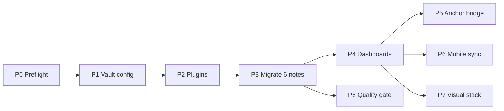

# Plan — Converting this repo into an Obsidian vault

**Status:** plan only, nothing executed yet. **Owner:** you + Arena AI. **Written:** 2026-09-24.
**Depends on:** [`NOTE-FORMATTING-RULEBOOK.md`](NOTE-FORMATTING-RULEBOOK.md) (what a note looks like) ·
[`OBSIDIAN-SETUP.md`](OBSIDIAN-SETUP.md) (full plugin catalogue).

---

## 0. The decision in one paragraph

**The repo root *is* the vault root.** No folder is renamed, moved, flattened or converted.
Obsidian is added as a *layer*: one `.obsidian/` config folder (partly committed), one `meta/`
folder of dashboards, frontmatter on the six existing `notes.md`, and a `figures/` convention.
GitHub stays the published surface; Obsidian becomes the place you read, revise and draw.
Every step is additive, so rollback is `git revert` or deleting two folders.

### Why not a separate vault, or a restructure?

| Option | Verdict | Reason |
|---|---|---|
| **A. Repo root = vault** | ✅ **Chosen** | Zero file moves. Script paths, chapter-card links and the root README keep working. `obsidian-git` syncs the same tree Arena AI writes to |
| B. Vault in a sub-folder (`vault/`) with symlinks | ❌ | Symlinks break on Windows and Obsidian mobile, and git + Obsidian disagree on them |
| C. Separate vault, copy notes in | ❌ | Two sources of truth: every Arena AI edit would need a manual copy |
| D. Restructure into Obsidian idioms (wikilinks, one attachments folder, MOCs replacing READMEs) | ❌ | Breaks GitHub rendering (N2), fights `scripts/fetch_ncert_pdfs.py` which regenerates every README, and moves 112 MB of PDFs for no gain |

---

## 1. Current-state inventory (measured, not estimated)

| Item | Count / size | Vault implication |
|---|---|---|
| Branch folders | 4 (`Physical`, `Inorganic`, `Organic`, `Practical`) | Become the top-level file-explorer tree as-is |
| Chapter folders | 31 (12 + 9 + 9 + 1 Salt Analysis) | Unchanged |
| `notes.md` written | 6 (≈ 57 600 words) | Get frontmatter in Phase 3 |
| Markdown files | 44 (+ this plan) | 33 are script-generated (30 chapter cards + 3 branch indexes), so hands off. The 2 `Practical-Chemistry` READMEs are hand-written |
| PDFs | 35 files, **112 MB** (30 NCERT + 5 Allen modules) | Core PDF viewer opens them in place. Largest is `kech207-legacy.pdf` at 10.1 MB |
| Working tree | 117 MB | Fine on desktop |
| `.git` | **65 MB** | Fine on desktop git. ⚠ Too heavy for `obsidian-git` on **mobile** (Phase 6) |
| Existing `.gitignore` | `__pycache__/`, `*.py[cod]`, `.venv/`, `.cache/` | Extended in Phase 1 |
| Links in notes | Relative markdown links + GitHub slug anchors | Relative links ✅ work in Obsidian. Slug anchors ❌ don't (Phase 5) |
| Wrapped prose | ≈ 230 hard-wrapped continuation lines across the 6 notes | Needs **Strict line breaks = on** |
| `[[wikilinks]]` / callouts / `\ce{}` in notes | 0 | Already GitHub-safe, nothing to undo |

### Target tree (new items marked ✚)

```
Chem_JEEAd_notes/                      ← vault root = repo root
├── .obsidian/                     ✚  config (selectively committed, Phase 1)
│   ├── app.json  appearance.json  core-plugins.json  community-plugins.json  hotkeys.json
│   ├── snippets/chem-notes.css    ✚  print + table + ASCII styling
│   └── plugins/<id>/data.json     ✚  only whitelisted, secret-free settings committed
├── meta/                          ✚  Obsidian-only layer, never linked from notes.md
│   ├── Progress.md                ✚  Dataview dashboard
│   ├── chapters.base              ✚  core Bases table view
│   ├── Revision-Queue.md          ✚  spaced-repetition hub
│   └── templates/chapter-notes.md ✚  Templater template = Rulebook Appendix A
├── docs/                             rulebook, plugin catalogue, this plan
├── scripts/                          fetch_ncert_pdfs.py (+ check_notes.py ✚ in Phase 8)
├── Physical-Chemistry/
│   └── 04-Equilibrium/
│       ├── notes.md                  ✚ frontmatter only
│       ├── cards.md               ✚  optional study layer
│       ├── figures/               ✚  SVG exports, .excalidraw.md, .mol, data.csv
│       ├── kech106.pdf
│       └── README.md                 script-owned, untouched
├── Inorganic-Chemistry/ …  Organic-Chemistry/ …  Practical-Chemistry/ …
└── README.md                         vault home page (Homepage plugin)
```

---

## 2. Phases

Each phase ends in a commit and has a pass/fail acceptance check. Phases 1–4 are the vault
proper (about 2 hours of work). Phases 5–8 are upgrades you can do whenever.


*P1–P4 are sequential and required; P5–P8 are independent upgrades.*

---

### Phase 0 — Preflight (10 min)

1. Obsidian desktop **≥ 1.9** (needed for core **Bases**; everything else works on older builds).
2. Clean tree: `git status` empty; `git pull` on the working branch.
3. Git for desktop installed and authenticated (the `obsidian-git` plugin shells out to it).
4. Tag the pre-vault state: `git tag pre-vault` (the rollback point).

**Accept when:** `git tag` lists `pre-vault`; `git status` is clean.

---

### Phase 1 — Vault configuration (20 min)

**1a. Open the repo as a vault.** Obsidian → *Open folder as vault* → select `Chem_JEEAd_notes/`.
This creates `.obsidian/`.

**1b. Settings** (Settings UI → the key it writes to `.obsidian/app.json`):

| Setting | Value | Key | Why |
|---|---|---|---|
| Use [[Wikilinks]] | **off** | `"useMarkdownLinks": true` | GitHub-safe links (Rulebook N2) |
| New link format | Relative path to file | `"newLinkFormat": "relative"` | Matches existing links, survives `git mv` |
| Automatically update internal links | on | `"alwaysUpdateLinks": true` | Renaming a file fixes the links pointing to it |
| Default attachment location | In subfolder under current folder: `figures` | `"attachmentFolderPath": "./figures"` | Rulebook R4. Keeps stray PDFs out of the script's Module-PDF scan |
| **Strict line breaks** | **on** | `"strictLineBreaks": true` | Wrapped prose renders as paragraphs, same as GitHub |
| Properties in document | visible | `"propertiesInDocument": "visible"` | Frontmatter shows as a properties panel |
| Default view for new tabs | Reading | `"defaultViewMode": "preview"` | You mostly *read* notes Arena AI wrote |
| Readable line length | on | `"readableLineLength": true` | — |
| Excluded files | `scripts/`, `__pycache__/`, `.venv/` | `"userIgnoreFilters": [...]` | Keeps search and graph clean |
| Detect all file extensions | off | `"showUnsupportedFiles": false` | Hides `.py` noise |

**1c. Core plugins** (`core-plugins.json`): enable **File explorer, Search, Quick switcher,
Graph, Backlinks, Outgoing links, Tags, Properties, Page preview, Outline, Bookmarks, Canvas,
Bases, Command palette, Word count, File recovery**. Disable core *Templates* and *Daily notes*
(Templater replaces the first; the second is irrelevant).

**1d. `.gitignore`: final version for the vault**

```gitignore
# --- existing ---
__pycache__/
*.py[cod]
.venv/
.cache/

# --- Obsidian: share config, never personal state or plugin binaries ---
.obsidian/workspace.json
.obsidian/workspace-mobile.json
.obsidian/workspaces.json
.obsidian/cache/
.trash/

# plugin folders: ignore everything inside…
.obsidian/plugins/*/*
# …then whitelist settings that are shareable and contain no secrets
!.obsidian/plugins/*/manifest.json
!.obsidian/plugins/table-editor-obsidian/data.json
!.obsidian/plugins/obsidian-latex-suite/data.json
!.obsidian/plugins/templater-obsidian/data.json
!.obsidian/plugins/dataview/data.json
!.obsidian/plugins/obsidian-mindmap-nextgen/data.json
!.obsidian/plugins/obsidian-excalidraw-plugin/data.json
!.obsidian/plugins/obsidian-spaced-repetition/data.json
# NEVER whitelist: obsidian-git (may hold author/remote), remotely-save, copilot,
# realclaudian, smart-*, text-generator, marker-api (API keys / tokens live there)
```

> **Why ignore plugin code but commit `manifest.json`:** Obsidian does not auto-install plugins
> from `community-plugins.json`. Committing the manifests plus whitelisted settings means that
> on a new machine you install each listed plugin once and it comes up already configured.
> Plugin code (`main.js`, several MB for Excalidraw) stays out of git history.

**Accept when:** Obsidian opens the vault with no errors. `Equilibrium/notes.md` shows
paragraphs, not a broken line every ~100 columns. Clicking the `kech106.pdf` link opens the PDF
in a tab. The `Module PDF` link on the d-block card (spaces, URL-encoded) opens.
`git status` shows only the committed `.obsidian/*.json` files.

---

### Phase 2 — Install plugins, in tiers (30 min)

Install one tier at a time and check the acceptance line before moving on, so if a plugin
misbehaves you know which one it was.

| Tier | Plugins (IDs) | Purpose | Accept when |
|---|---|---|---|
| **T1 Sync** | `obsidian-git` | Arena AI ⇄ vault loop. Auto-pull every 10 min, **manual** commit/push (never auto-push half-written notes) | *Pull* fetches the branch; the source-control view shows a clean status |
| **T2 Tables** | `table-editor-obsidian` | Rulebook R16 | Tab inside a note's table re-aligns the pipes, and `git diff` shows only whitespace |
| **T3 Maths & structures** | `obsidian-latex-suite`, `chemedit`, `chem` | Rulebook R18 | A SMILES block `CC(=O)O` renders as acetic acid; ChemEdit opens a new `.mol` |
| **T4 Flowcharts & mindmaps** | `mermaid-tools`, `obsidian-mindmap-nextgen`, `obsidian-excalidraw-plugin` | Rulebook R20–R22 | "Open as mindmap" on `Coordination/notes.md` renders the heading tree; Excalidraw saves into `figures/` |
| **T5 Navigation & data** | `dataview`, `templater-obsidian`, `homepage`, `omnisearch` | Phase 4 | Homepage opens `README.md` at launch; Omnisearch finds "Kohlrausch" |
| **T6 PDFs** | `pdf-plus` | NCERT side-by-side reading | Copying a highlight from `kech106.pdf` pastes a link that jumps back to it |
| **T7 Study** | `obsidian-spaced-repetition` | `cards.md` review | A test `cards.md` shows up in the review deck |

**Plugin settings to change from default:**

| Plugin | Setting | Value |
|---|---|---|
| obsidian-git | Auto pull interval | 10 min |
| obsidian-git | Auto commit-and-sync interval | **0 (off)** |
| obsidian-git | Pull on startup | on |
| obsidian-git | Commit message | `notes: {{date}} {{numFiles}} files` |
| obsidian-excalidraw-plugin | Excalidraw folder | *(blank)* + "use attachment folder" → `figures/` |
| obsidian-excalidraw-plugin | Auto-export SVG | **on** (keeps the committed SVG for Rulebook R19) |
| obsidian-mindmap-nextgen | Default: colour freeze level / initial expand level | 2 |
| templater-obsidian | Template folder | `meta/templates` |
| dataview | Enable JavaScript queries | on (the pending-chapters query needs it) |
| homepage | Homepage | `README.md` |
| omnisearch | Index PDFs | on (needs `text-extractor`, optional) |
| obsidian-spaced-repetition | Flashcard tags | `#flashcards` |

**Accept when:** every tier's check passes and `.obsidian/community-plugins.json` lists
exactly the installed IDs.

---

### Phase 3 — Migrate the six existing notes (30 min, scriptable)

The migration only adds things. No prose changes, no link rewrites.

| Step | Action | Tool |
|---|---|---|
| 3a | Prepend Rulebook R3 frontmatter to each `notes.md` (`branch`, `chapter`, `class`, `ncert_unit`, `ncert_code`, `sources`, `status: written`, `words`, `updated`, `tags`) | a one-off script reading the `CHAPTERS` table in `fetch_ncert_pdfs.py`, so the metadata can't drift from the script |
| 3b | Check each against the Rulebook R32 checklist and log deviations. **Report only, don't auto-fix** | manual, or `check_notes.py` once written (Phase 8) |
| 3c | Salt Analysis: `class`/`ncert_unit` don't apply, so use `ncert_code: none` and the two Allen PDFs as `sources` | manual |
| 3d | Commit: `notes: add vault frontmatter to 6 chapters` | git |

> **GitHub side-effect (acceptable):** GitHub renders YAML frontmatter as a small metadata
> table at the top of the file. That's a small visual change, not breakage.

**Accept when:** all 6 files show a Properties panel in Obsidian. On GitHub, each note still
opens with its title and source table right under the frontmatter box. The Dataview query
`TABLE status, words FROM "" WHERE file.name = "notes"` returns 6 rows.

---

### Phase 4 — Navigation and dashboards (30 min)

| File | Contents |
|---|---|
| `README.md` (root) | Stays the home page. Set it in **Homepage**. Unchanged content |
| `meta/Progress.md` | **Written:** `TABLE branch, chapter, status, words, updated FROM "" WHERE file.name = "notes" SORT branch, file.folder`. **Pending:** the DataviewJS block in [`OBSIDIAN-SETUP.md` §12](OBSIDIAN-SETUP.md), which reads the placeholder the script writes into chapter cards. Plus a total-word-count line |
| `meta/chapters.base` | A core **Bases** table over `notes.md` files showing frontmatter columns, sortable and filterable with no plugin. Build it in the UI (*New base* → filter `file.name == "notes"`) rather than hand-writing the YAML |
| `meta/Revision-Queue.md` | Links to each `cards.md` + the Spaced Repetition deck command |
| `meta/templates/chapter-notes.md` | Rulebook Appendix A with Templater tags filling `chapter`, `updated`, NCERT code from the folder name |
| Bookmarks | Pin: root `README.md`, the rulebook, `meta/Progress.md`, the three branch indexes |

> `meta/` is Obsidian-only and may use Dataview, `[[wikilinks]]` and callouts. **No `notes.md`
> ever links into `meta/`**, so GitHub readers never hit a broken dashboard.

**Accept when:** Progress shows **6 written / 25 pending** (31 chapter folders). Creating a note
from the template in an empty chapter folder gives a skeleton that passes R32 structurally.

---

### Phase 5 — The GFM-anchor bridge (optional, ~1 hour)

**Problem:** every `## Contents` block uses GitHub slug anchors (`#6-oxidation-number--formal-charge--real-charge-`),
and Obsidian resolves anchors by literal heading text, so they fail with *"Unable to find
selection"*. This is an open Obsidian feature request, not a setting.
**Workaround until then:** use the core **Outline** pane.
**Fix:** a ~60-line vault-local plugin committed at `.obsidian/plugins/gfm-anchors/`
(whitelisted in `.gitignore`, since it's our code):

```js
// main.js — sketch; resolve GitHub-style #slug links to Obsidian headings
const { Plugin } = require("obsidian");
const slug = h => h.toLowerCase().trim()
  .replace(/[^\p{L}\p{N}\s-]/gu, "")   // GitHub drops punctuation, emoji, symbols
  .replace(/\s/g, "-");                 // each space → one hyphen (no collapsing)
module.exports = class extends Plugin {
  onload() {
    this.registerDomEvent(document, "click", evt => {
      const a = evt.target.closest("a");
      const href = a?.getAttribute("href") || a?.dataset.href;
      if (!href || !href.startsWith("#")) return;
      const file = this.app.workspace.getActiveFile();
      const heads = this.app.metadataCache.getFileCache(file)?.headings ?? [];
      const hit = heads.find(h => slug(h.heading) === decodeURIComponent(href.slice(1)));
      if (!hit) return;
      evt.preventDefault(); evt.stopPropagation();
      this.app.workspace.openLinkText(`${file.path}#${hit.heading}`, file.path);
    }, { capture: true });
  }
};
```

Also handle GitHub's `-1`, `-2` suffixes on duplicate headings and cross-file links
(`other.md#slug`). Test it against all six Contents blocks.

**Accept when:** every Contents link in all six notes jumps to its section in Reading view.

---

### Phase 6 — Mobile and multi-device (optional)

| Device | Method | Notes |
|---|---|---|
| Desktop (primary) | `obsidian-git` → system git | Full read/write. The only place you commit |
| Android | Obsidian + `obsidian-git` **read-mostly**, or Termux git into the vault folder | `obsidian-git` on mobile uses a JavaScript git implementation. With a **65 MB** history and 112 MB of PDFs, the first clone is slow and can run out of memory. Prefer Termux, or a shallow clone |
| iOS | Working Copy app (git) → Obsidian folder, or Remotely Save | Working Copy does the git work and Obsidian just reads the folder |
| Any | Obsidian Sync (paid) *instead of* git on mobile | Don't let two sync systems write to the same folder |

⚠ **Only one writer per device.** Never run `obsidian-git` and another sync tool on the same
folder.
⚠ **Don't commit from mobile** unless the note has passed R32. Mobile is for reading and
reviewing flashcards.

**Future relief:** if the PDFs grow past ~300 MB, move `*.pdf` to **Git LFS**. That's a one-time
history rewrite, so plan it separately; it is not needed now.

---

### Phase 7 — The visual stack in daily use (applies when writing the pending 25 chapters)

| When writing… | Do this in Obsidian | What gets committed |
|---|---|---|
| A table | Type it with Advanced Tables (Tab / Enter) | Aligned GFM table |
| A flowchart | Mermaid fence. Open in Mermaid Tools to preview/insert templates | The fence (GitHub renders it) |
| A mindmap | Nothing new: write good headings, then *Open as mindmap* | The outline. Optionally `figures/<ch>-map.svg` for print |
| An organic structure | ` ```smiles ` block (Chem) or a `.mol` drawn in ChemEdit | The SMILES string + the Unicode/ASCII fallback line, or `figures/x.mol` + `x.svg` |
| A mechanism | Excalidraw in `figures/` with auto-export SVG | `figures/<name>.excalidraw.md` + `.svg`, embedded as `` |
| Reading NCERT alongside | PDF++ split view, copy highlight link | Links only in `cards.md` / private notes, not in `notes.md` |

Organic chemistry is the first branch that needs rungs 4–7 of the structure ladder (Rulebook R18),
so it's where this phase earns its keep.

---

### Phase 8 — Quality gate (optional, ~2 hours)

1. `scripts/check_notes.py` implements Rulebook R33: single H1, continuous H2 numbering, Contents
   anchors resolve against generated slugs, `Quick Revision Sheet` present, no `[[`/`> [!`/`\ce{`/
   `dataview` in `notes.md`, consistent table pipe counts, Mermaid ≤ 14 nodes, word-count bands.
2. Optional pre-commit hook running it on staged `notes.md` files.
3. `.github/workflows/check-notes.yml` runs it on every pull request, so an Arena-AI-authored PR
   that breaks GitHub rendering fails the check before merge.
4. Run it once over the six existing notes and triage the report into a follow-up list.

---

## 3. Things we deliberately do **not** do

| Tempting change | Why not |
|---|---|
| Convert links to `[[wikilinks]]` | Breaks GitHub rendering of every note |
| Rename `README.md` cards to `<Chapter>.md` / folder notes | The script regenerates `README.md`, so renamed copies would duplicate and go stale |
| One global `attachments/` folder | Attachments have to move with their chapter when `BRANCH_OF` changes |
| Rewrite Contents blocks as `[[#Heading]]` | Fixes Obsidian, breaks GitHub. Phase 5 fixes both |
| Commit `workspace.json` | Personal pane layout that changes on every click and causes merge conflicts |
| Commit plugin `main.js` | Megabytes of third-party code in history, and it goes stale |
| Auto-push from `obsidian-git` | Would push half-written notes, and races Arena AI pushes on the same branch |
| Notion-like Tables / DataLoom, PlantUML in committed notes | Don't render on GitHub (Rulebook R16, R17) |

---

## 4. Risks and mitigations

| Risk | Likelihood | Impact | Mitigation |
|---|---|---|---|
| Merge conflict: you edit a note in Obsidian while Arena AI pushes to the same file | Medium | Medium | Pull before editing (auto-pull on startup + every 10 min). One chapter = one writer at a time. Arena AI works on its branch, you merge via PR |
| Someone hand-edits a script-owned README in Obsidian | Medium | Low (silently overwritten) | Rulebook R2. Optionally set those READMEs to open in Reading view by default |
| A plugin data.json leaks an API key | Low | High | `.gitignore` whitelist (Phase 1d). Only secret-free plugins are whitelisted |
| Stray exported PDF shows up as a "Module PDF" | Medium | Low | Attachment folder = `figures/` (the script only scans the top level) |
| Wrapped prose looks broken | High if missed | Low | `strictLineBreaks: true` in Phase 1 |
| Frontmatter changes GitHub's first screen | Certain | Very low | Accepted. It renders as a tidy metadata box |
| Chemistry plugin abandoned upstream | Medium | Low | The structure ladder always keeps a rung-1/3 Unicode/ASCII fallback (Rulebook R19) |
| Mobile git runs out of memory | High on first mobile clone | Low | Phase 6: Termux/Working Copy, or read-only |

---

## 5. Rollback

- **Everything:** `git reset --hard pre-vault` (before pushing), or `git revert` the vault
  commits (after).
- **Just Obsidian:** delete `.obsidian/` and `meta/`. The notes are still plain markdown.
- **Just frontmatter:** revert the Phase 3 commit. No prose was touched.

---

## 6. Checklist

- [ ] P0 `pre-vault` tag, clean tree, Obsidian ≥ 1.9
- [ ] P1 settings (strict line breaks **on**, markdown links, attachments → `figures`) + `.gitignore`
- [ ] P2 tiers T1–T7 installed and each acceptance line passed
- [ ] P3 frontmatter on 6 notes, Dataview returns 6 rows
- [ ] P4 `meta/Progress.md` shows 6 written / 25 pending, template works, home page set
- [ ] P5 *(opt)* Contents links clickable in Obsidian
- [ ] P6 *(opt)* mobile read access set up without a second writer
- [ ] P7 used on the first Organic chapter
- [ ] P8 *(opt)* `check_notes.py` + CI
